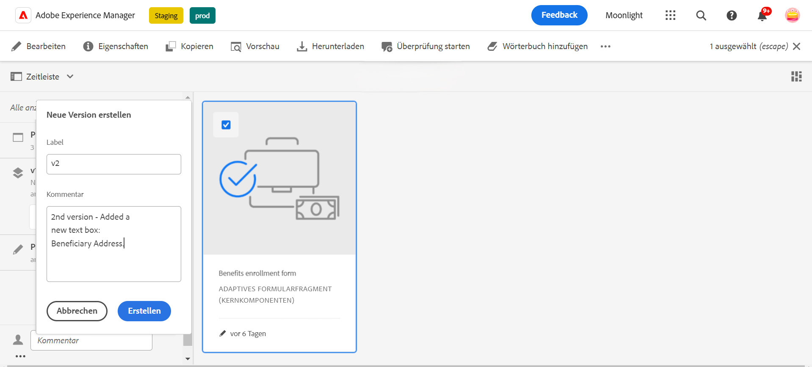
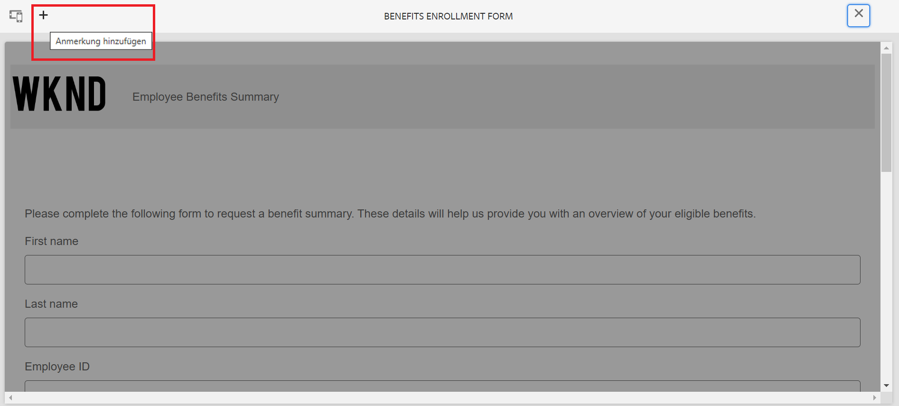

# Versionierung, Überprüfung und Kommentierung eines adaptiven Formulars

<!--Before you can use versionings, comments, and annotations in an Adaptive Form, you must ensure you have [enabled Adaptive Form Core Components](
https://experienceleague.adobe.com/en/docs/experience-manager-cloud-service/content/forms/setup-configure-migrate/enable-adaptive-forms-core-components).-->

<!--Adaptive Form Core Components facilitates to add versionings, comments, and annotations to a form. These features helps form authors and users to enhance the form development process where they can create multiple versions of a form, collaborate and add their comments to a form, and add annotations to form components.-->

Kernkomponenten für adaptive Formulare bieten Funktionen, mit denen Formularautorinnen und -autoren Versionierungen, Kommentare und Anmerkungen in Formulare aufnehmen können. Diese Funktionen dienen dazu, den Formularentwicklungsprozess zu optimieren. Benutzende können mehrere Versionen eines Formulars erstellen und verwalten, durch Kommentare an gemeinschaftlichen Diskussionen teilnehmen und Anmerkungen zu bestimmten Formularkomponenten hinzufügen. Dadurch wird die Formularerstellung insgesamt verbessert.

## Versionierung adaptiver Formulare {#adaptive-form-versioning}

Durch die Versionierung adaptiver Formulare können Versionen zu einem Formular hinzugefügt werden. Formularautoren und -autorinnen können einfach mehrere Versionen eines Formulars erstellen und schließlich die Version verwenden, die für die jeweiligen Geschäftsziele geeignet ist. Darüber hinaus haben Formularbenutzende die Möglichkeit, das Formular auf vorherige Versionen zurückzusetzen. Außerdem können Autorinnen und Autoren zwei Versionen eines Formulars vergleichen, indem sie sie in einer Vorschau anzeigen und so im Kontext der Benutzeroberfläche besser analysieren können. Im Folgenden werden die einzelnen Funktionen für die Versionierung adaptiver Formulare genauer beschrieben:

### Erstellen einer Formularversion {#create-a-form-version}

Gehen Sie wie folgt vor, um eine Formularversion zu erstellen:

1. Erstellen Sie ein Formular oder verwenden Sie ein vorhandenes Formular.
1. Navigieren Sie in der AEM-Benutzeroberfläche zu **[!UICONTROL Formular]** > **[!UICONTROL Formulare und Dokumente]** und wählen Sie Ihr **Formular** aus.
1. Wählen Sie im linken Bedienfeld in der Auswahl-Dropdown-Liste die Option **[!UICONTROL Versionen]** aus.
   
1. Klicken Sie im unteren Bedienfeld auf der linken Seite auf die Punkte **drei Punkte** und klicken Sie auf **[!UICONTROL Als Version speichern]**.
1. Geben Sie nun ein Label für die Formularversion an. Sie können außerdem unter „Kommentar“ Informationen zum Formular angeben.
   

### Aktualisieren einer Formularversion {#update-a-form-version}

Wenn Sie das adaptive Formular bearbeiten und aktualisieren, fügen Sie dem Formular eine neue Version hinzu. Führen Sie die im letzten Abschnitt beschriebenen Schritte aus, um eine neue Version des Formulars zu benennen, wie in der folgenden Abbildung dargestellt:

### Wiederherstellen einer Formularversion {#revert-a-form-version}

Um eine Formularversion wieder auf die vorherige Version zurückzusetzen, wählen Sie eine Formularversion aus und klicken Sie auf **[!UICONTROL Auf diese Version zurück]**.

### Vergleichen von Formularversionen {#compare-form-versions}

Formularautorinnen und -autoren können zwei verschiedene Versionen eines Formulars zu Vorschauzwecken vergleichen. Um Versionen zu vergleichen, wählen Sie eine beliebige Formularversion aus und klicken Sie auf **[!UICONTROL Mit aktueller Version vergleichen]**. Es werden zwei verschiedene Formularversionen im Vorschaumodus angezeigt.

## Hinzufügen von Kommentaren {#add-comments}

Bei einer Überprüfung handelt es sich um einen Mechanismus, mit dem ein oder mehrere Überprüfungspersonen zu Formularen Kommentare abgeben können. Alle Formularbenutzenden können ein Formular kommentieren oder anhand von Kommentaren einer Überprüfung unterziehen. Um ein Formular zu kommentieren, wählen Sie ein **[!UICONTROL Formular]** aus und fügen Sie dem Formular einen **[!UICONTROL Kommentar]** hinzu.

>[!NOTE]
> Wenn Sie, wie oben beschrieben, Kommentare in Kernkomponenten adaptiver Formulare verwenden, ist die Formularfunktion zum [Erstellen und Verwalten von Überprüfungen für Formulare](/help/forms/create-reviews-forms.md) deaktiviert.

## Hinzufügen von Anmerkungen {#adaptive-form-annotations}

In vielen Fällen müssen Benutzende von Formulargruppen Anmerkungen zu einem Formular hinzufügen, um diese zu überprüfen, z. B. auf einer bestimmten Registerkarte eines Formulars oder von Komponenten eines Formulars. In solchen Situationen können Autorinnen und Autoren Anmerkungen verwenden. Um Anmerkungen zu einem Formular hinzuzufügen, führen Sie die folgenden Schritte aus:

1. Öffnen Sie ein Formular im **[!UICONTROL Bearbeitungsmodus]**.

1. Klicken Sie auf das Symbol **Hinzufügen** in der oberen rechten Leiste, wie in der folgenden Abbildung dargestellt.
   

1. Klicken Sie auf das Symbol **Hinzufügen** in der oberen linken Leiste, wie in der folgenden Abbildung dargestellt, um die Anmerkung hinzuzufügen.
   

1. Nun können Sie Formularkomponenten Kommentare hinzufügen oder diese mit mehrfarbigen Skizzen versehen.

1. Um alle Anmerkungen anzuzeigen, die Sie einem Formular hinzugefügt haben, wählen Sie das Formular aus. Daraufhin sind die Anmerkungen zu sehen, die im linken Bedienfeld hinzugefügt wurden, wie in der folgenden Abbildung dargestellt.

   

## Siehe auch {#see-also}

{{see-also}}
