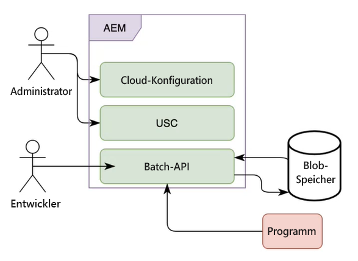

# Stapelverarbeitung von Kommunikationen in AEM Forms as a Cloud Service

Mit Kommunikationen können Sie markenorientierte und personalisierte Mitteilungen erstellen, zusammenstellen und versenden, z. B. Geschäftskorrespondenz, Dokumente, Auszüge, Briefe zur Bearbeitung von Ansprüchen, Leistungsmitteilungen, monatliche Rechnungen und Begrüßungspakete. Sie können Kommunikations-APIs verwenden, um eine Vorlage (XFA oder PDF) mit Kundendaten zu kombinieren und Dokumente im PDF-, PS-, PCL-, DPL-, IPL- und ZPL-Format zu generieren.

Die Kommunikationsfunktion bietet APIs für die On-Demand- und geplante Dokumenterstellung. Sie können synchrone APIs für die On-Demand-Dokumenterstellung und Batch-APIs (asynchrone APIs) für die geplante Dokumenterstellung verwenden:

* Synchrone APIs eignen sich für die Dokumenterstellung auf Anfrage, mit geringer Latenz und mit einzelnen Datensätzen. Diese APIs eignen sich besser für Anwendungen auf Basis einer Benutzeraktion. Zum Beispiel zum Generieren eines Dokuments, nachdem ein Anwender ein Formular ausgefüllt hat.

* Batch-APIs (asynchrone APIs) eignen sich für Anwendungsfälle für die geplante Erstellung mehrerer Dokumente mit hohem Durchsatz. Diese APIs generieren Dokumente in Stapeln. Beispielsweise werden damit monatliche Telefonrechnungen, Kreditkartenauszüge und Leistungsmitteilungen generiert.

<!-- The following skills are required to create templates and use HTTP APIs: 

* Understanding of Adobe Forms Designer or Acrobat Forms to create templates

* Understanding of HTTP APIs and experience of using HTTP APIs

* Basic understanding of Adobe Experience Manager -->

## Batch-Vorgänge {#batch-operations}

Bei einem Batch-Vorgang werden in terminierten Abständen mehrere Dokumente eines ähnlichen Typs für eine Gruppe von Datensätzen generiert. Ein Batch-Vorgang besteht aus zwei Teilen: Konfiguration (Definition) und Ausführung.

* **Konfiguration (Definition)**: In einer Batch-Konfiguration werden Informationen zu verschiedenen Assets und Eigenschaften gespeichert, die für generierte Dokumente festgelegt werden sollen. Beispielsweise enthält sie Details zu XDP- oder PDF-Vorlagen und zum Speicherort der zu verwendenden Kundendaten und gibt verschiedene Eigenschaften für Ausgabedokumente an.

* **Ausführung**: Zum Starten eines Batch-Vorgangs übergeben Sie den Batch-Konfigurationsnamen an die Batch-Ausführungs-API.

### Komponenten eines Batch-Vorgangs {#components-of-a-batch-operations}

**Cloud-Konfiguration**: Mit der Experience Manager Cloud-Konfiguration können Sie eine Experience Manager-Instanz mit dem kundeneigenen Microsoft Azure-Speicher verbinden. Damit können Sie die Anmeldeinformationen für das kundeneigene Microsoft Azure-Konto angeben, mit dem eine Verbindung hergestellt werden soll.

**Batch-Datenspeicherkonfiguration (USC)**: Mit der Batch-Datenkonfiguration können Sie eine bestimmte Instanz des Blob-Speichers für Batch-APIs konfigurieren. Damit können Sie die Ein- und Ausgabeverzeichnisse im kundeneigenen Microsoft Azure Blob-Datenspeicher angeben.

**Batch-APIs**: Ermöglichen Ihnen die Erstellung von Batch-Konfigurationen und die Ausführung von Batch-Vorgängen anhand dieser Konfigurationen, um eine PDF- oder XDP-Vorlage mit Daten zusammenzuführen und eine Ausgabe in den Formaten PDF, PS, PCL, DPL, IPL und ZPL zu erzeugen. Die Kommunikationsfunktion bietet Batch-APIs für die Konfigurationsverwaltung und Batch-Ausführung.

**Datenspeicherung**: Kommunikations-APIs verwenden den kundeneigenen Microsoft Azure Cloud-Speicher, um Kundendatensätze abzurufen und generierte Dokumente zu speichern. Der Microsoft Azure-Speicher wird in der Experience Manager Cloud Service-Konfiguration konfiguriert.

**Programm**: Ihr benutzerdefiniertes Programm zum Generieren und Verwenden von Dokumenten unter Verwendung der Batch-APIs.

## Generieren mehrerer Dokumente mithilfe von Batch-Vorgängen {#generate-multiple-documents-using-batch-operations}

Mithilfe von Batch-Vorgängen können Sie mehrere Dokumente in terminierten Intervallen generieren.

>[!VIDEO](https://video.tv.adobe.com/v/338349)

Sehen Sie sich das Video an oder befolgen Sie die unten stehenden Anweisungen, um zu erfahren, wie Sie Dokumente mithilfe von Batch-Vorgängen erstellen. Die im Video verwendete API-Referenzdokumentation ist im .yaml-Format verfügbar. Sie können die [Batch-APIs](assets/batch-api.yaml) als Datei herunterladen und in Postman hochladen, um ihre Funktionalität zu überprüfen und dem Video zu folgen.

### Voraussetzungen {#pre-requisites}

Um eine Batch-API zu verwenden, ist Folgendes erforderlich:

* [Ein Konto für den Microsoft Azure-Speicher](https://docs.microsoft.com/de-de/azure/storage/common/storage-account-create?tabs=azure-portal)
* PDF- oder XDP-Vorlagen
* [Daten, die mit Vorlagen zusammengeführt werden sollen](#form-data)
* Benutzer mit Experience Manager-Administratorberechtigungen

### Einrichten Ihrer Arbeitsumgebung {#setup-your-environment}

Vor der Verwendung eines Batch-Vorgangs:

* Hochladen von Kundendaten (XML-Dateien) in den Microsoft Azure-Blob-Speicher
* Erstellen einer Cloud-Konfiguration
* Erstellen der Batch-Datenspeicherkonfiguration
* Hochladen von Vorlagen und anderen Assets in Ihre Experience Manager Forms Cloud Service-Instanz

### Hochladen von Kundendaten (XML-Dateien) in den Azure-Speicher

Erstellen Sie im Microsoft Azure-Speicher [Container](https://docs.microsoft.com/de-de/azure/vs-azure-tools-storage-explorer-blobs) und [laden Sie Kundendaten (XML)](https://docs.microsoft.com/de-de/azure/vs-azure-tools-storage-explorer-blobs#managing-blobs-in-a-blob-container) in die [Ordner](https://docs.microsoft.com/de-de/azure/storage/blobs/storage-quickstart-blobs-portal) innerhalb der Container hoch.

>[!NOTE]
>
>Sie können den Microsoft Azure-Speicher so konfigurieren, dass der Eingabeordner automatisch bereinigt oder der Inhalt des Ausgabeordners in terminierten Intervallen an einen anderen Speicherort verschoben wird. Stellen Sie jedoch sicher, dass Ordner nicht bereinigt werden, falls ein Batch-Vorgang, der auf die Ordner verweist, weiterhin ausgeführt wird.

### Erstellen einer Cloud-Konfiguration {#create-a-cloud-configuration}

Die Cloud-Konfiguration verbindet Ihre Experience Manager-Instanz mit dem Microsoft Azure Datenspeicher. Erstellen einer Cloud-Konfiguration:

1. Gehen Sie zu „Tools“ > „Cloud Services“ > „Azure-Speicher“.
1. Öffnen Sie einen Ordner zum Hosten der Konfiguration und klicken Sie auf „Erstellen“. Verwenden Sie den Ordner „Global“ oder erstellen Sie einen Ordner.
1. Geben Sie den Namen der Konfiguration und die Anmeldeinformationen für die Verbindung mit dem Service an. Sie können [diese Anmeldeinformationen von Ihrem Microsoft Azure-Speicherportal abrufen](https://docs.microsoft.com/de-de/azure/storage/common/storage-account-keys-manage?tabs=azure-portal#view-account-access-keys).
1. Klicken Sie auf „Erstellen“.

Ihre Experience Manager-Instanz kann jetzt eine Verbindung zum Microsoft Azure-Speicher herstellen und Inhalte nach Bedarf speichern und lesen.

### Erstellen der Batch-Datenspeicherkonfiguration {#create-batch-data-store-configuration}

Die Batch-Datenkonfiguration hilft Ihnen beim Konfigurieren von Containern und Ordnern für Ein- und Ausgabe. Sie bewahren Ihre Kundendatensätze im Quellordner auf, generierte Dokumente werden im Zielordner abgelegt.

So erstellen Sie die Konfiguration:

1. Gehen Sie zu „Tools“ > „Forms“ > „Unified Storage Connector“.
1. Öffnen Sie einen Ordner zum Hosten der Konfiguration und klicken Sie auf „Erstellen“. Verwenden Sie den Ordner „Global“ oder erstellen Sie einen Ordner.
1. Geben Sie Titel und Namen der Konfiguration an. Wählen Sie unter „Speicher“ die Option „Microsoft Azure-Speicher“ aus.
1. Suchen Sie unter „Speicherkonfigurationspfad“ die Cloud-Konfiguration, die die Anmeldeinformationen des kundeneigenen Azure-Speicherkontos enthält, und wählen Sie sie aus.
1. Geben Sie im Quellordner den Pfad des Azure-Speicher-Containers und des Ordners mit Datensätzen an.
1. Geben Sie im Zielordner den Pfad des Azure-Speicher-Containers und des Ordners an, in dem die generierten Dokumente gespeichert werden sollen.
1. Klicken Sie auf „Erstellen“.

Ihre Experience Manager-Instanz ist jetzt mit dem Microsoft Azure-Speicher verbunden und so konfiguriert, dass Daten abgerufen und an bestimmte Speicherorte im Microsoft Azure-Speicher gesendet werden.

### Hochladen von Vorlagen und anderen Assets in Ihre Experience Manager-Instanz {#upload-templates-and-other-assets-to-your-AEM-instance}

Eine Organisation verfügt in der Regel über mehrere Vorlagen. Zum Beispiel eine Vorlage für Kreditkartenauszüge, Leistungsmitteilungen und Anträge. Laden Sie alle diese XDP- und PDF-Vorlagen in Ihre Experience Manager-Instanz hoch. Hochladen von Vorlagen:

1. Öffnen Sie die Experience Manager-Instanz.
1. Navigieren Sie zu „Forms“ > „Forms und Dokumente“.
1. Klicken Sie auf „Erstellen“ > „Ordner“ und erstellen Sie einen Ordner. Öffnen Sie den Ordner.
1. Klicken Sie auf „Erstellen“ > „Datei-Upload“ und laden Sie die Vorlagen hoch.

## Verwenden der Batch-API zum Generieren von Dokumenten {#use-batch-API-to-generate-documents}

Um eine Batch-API zu verwenden, erstellen Sie eine Batch-Konfiguration und führen Sie einen auf dieser Konfiguration basierenden Durchlauf aus. Die API-Dokumentation enthält Informationen zu APIs zum Erstellen und Ausführen eines Batches sowie zu entsprechenden Parametern und möglichen Fehlern. Sie können die [API-Definitionsdatei](assets/batch-api.yaml) speichern und in [Postman](https://go.postman.co/home) oder eine ähnliche Software hochladen, um die APIs zum Erstellen und Ausführen eines Batch-Vorgangs zu testen.

### Erstellen eines Batches {#create-a-batch}

Verwenden Sie zum Erstellen eines Batches die `POST /config`-API. Schließen Sie die folgenden obligatorischen Eigenschaften in den Text der HTTP-Anforderung ein:

* **configName**: Geben Sie den eindeutigen Namen des Batches an. Zum Beispiel: `wknd-job`
* **dataSourceConfigUri**: Geben Sie den Speicherort der Batch-Datenspeicherkonfiguration an. Es kann sich um den relativen oder absoluten Pfad der Konfiguration handeln. Beispiel: `/conf/global/settings/forms/usc/batch/wknd-batch`
* **outputTypes**: Geben Sie Ausgabeformate an: PDF oder PRINT. Wenn Sie den Ausgabetyp DRUCKEN verwenden, geben Sie in der Eigenschaft `printedOutputOptionsList` mindestens eine Druckoption an. Die Druckoptionen werden durch ihren Rendertyp identifiziert, daher sind derzeit mehrere Druckoptionen mit demselben Rendertyp nicht zulässig. Unterstützt werden PS, PCL, DPL, IPL und ZPL.

* **template**: Geben Sie den absoluten oder relativen Pfad der Vorlage an. Zum Beispiel: `crx:///content/dam/formsanddocuments/wknd/statements.xdp`

Wenn Sie einen relativen Pfad angeben, geben Sie auch einen Inhaltsstamm an. Weitere Informationen zum Inhaltsstamm finden Sie in der API-Dokumentation.

<!-- For example, you include the following JSON in the body of HTTP APIs to create a batch named wknd-job: -->

Sie können `GET /config /[configName]` verwenden, um Details zur Batch-Konfiguration anzuzeigen.

### Ausführen eines Batches {#run-a-batch}

Um einen Batch auszuführen, verwenden Sie `POST /config /[configName]/execution`. Um beispielsweise einen Batch mit dem Namen „wknd-demo“ auszuführen, verwenden Sie „/config/wknd-demo/execution“. Der Server gibt beim Akzeptieren der Anfrage den HTTP-Antwort-Code 202 zurück. Die API gibt keine Payload zurück, sondern lediglich einen eindeutigen Code (execution-identifier) in der Kopfzeile der HTTP-Antwort für den auf dem Server ausgeführten Batch-Auftrag. Sie können die Ausführungskennung verwenden, um den Status des Batches abzurufen.

>[!NOTE]
>
>Nehmen Sie während der Ausführung des Batches keine Änderungen an den entsprechenden Quell- und Zielordnern, der Datenquellenkonfiguration und der Microsoft Azure-Cloud-Konfiguration vor.

### Überprüfen des Status eines Batches {#status-of-a-batch}

Um den Status eines Batches abzurufen, verwenden Sie `GET /config /[configName]/execution/[execution-identifier]`. Die Ausführungskennung ist im Header der HTTP-Antwort für die Batch-Ausführungsanforderung enthalten.

Die Antwort der Statusanfrage enthält den Statusabschnitt. Sie enthält Details zum Status des Batch-Vorgangs, zur Anzahl der bereits in der Pipeline befindlichen Datensätze (bereits gelesen und in Verarbeitung) und zum Status jedes outputType/renderType (Anzahl der in Bearbeitung befindlichen, erfolgreichen und fehlgeschlagenen Elemente). Der Status enthält auch Start- und Endzeit des Batch-Vorgangs sowie ggf. Informationen zu Fehlern. Die Endzeit ist -1, bis die Batch-Ausführung tatsächlich abgeschlossen ist.

>[!NOTE]
>
>* Wenn Sie mehrere PRINT-Formate anfordern, enthält der Status mehrere Einträge. Beispiel: PRINT/ZPL, PRINT/IPL.
>* Ein Batch-Auftrag liest nicht alle Datensätze gleichzeitig, sondern liest und erhöht die Anzahl der Datensätze nach und nach. Der Status gibt also -1 zurück, bis alle Datensätze gelesen wurden.

### Anzeigen generierter Dokumente {#view-generated-documents}

Nach Abschluss des Auftrags werden die generierten Dokumente im Ordner `success` an dem in der Batch-Datenspeicherkonfiguration angegebenen Zielspeicherort gespeichert. Wenn Fehler auftreten, erstellt der Service einen Ordner `failure`. Er enthält Informationen über die Art und den Grund von Fehlern.

Sehen wir uns ein Beispiel an: Angenommen, es gibt eine Eingabedatendatei `record1.xml` und zwei Ausgabetypen: `PDF` und `PCL`. Dann enthält das Zielverzeichnis zwei Unterordner, `pdf` und `pcl`, einen für jeden Ausgabetyp. Nehmen wir an, die PDF-Generierung ist erfolgreich, dann enthält der Unterordner `pdf` den Unterordner `success`, der wiederum das eigentliche generierte PDF-Dokument `record1.pdf` enthält. Nehmen wir an, dass die PCL-Generierung fehlgeschlagen ist. Anschließend enthält der Unterordner `pcl` einen Unterordner `failure`, der wiederum eine Fehlerdatei `record1.error.txt` enthält, das Details zum Fehler enthält. Darüber hinaus enthält der Zielspeicherort einen temporären Ordner mit dem Namen `__tmp__`, der bestimmte Dateien enthält, die während der Batch-Ausführung erforderlich sind. Dieser Ordner kann gelöscht werden, wenn keine aktiven Batch-Vorgänge vorhanden sind, die auf den Zielordner verweisen.

>[!NOTE]
>
>Die Verarbeitung eines Batches kann je nach Anzahl der Eingabedateien und Komplexität der Vorlage etwas dauern. Warten Sie einige Minuten, bevor Sie die Zielordner auf Ausgabedateien überprüfen.

## API-Referenzdokumentation

Die Dokumentation zur API-Referenz enthält detaillierte Informationen zu allen Parametern, Authentifizierungsmethoden und verschiedenen Services, die von APIs bereitgestellt werden. Die API-Referenzdokumentation ist auch im .yaml-Format verfügbar. Sie können die [Batch-APIs](assets/batch-api.yaml) als Datei herunterladen und in Postman hochladen, um die Funktionalität der APIs zu überprüfen.

>[!MORELIKETHIS]
>
>* [Einführung in die Kommunikationsfunktion von AEM Forms as a Cloud Service](/help/forms/aem-forms-cloud-service-communications-introduction.md)
>* [AEM Forms as a Cloud Service-Architektur für adaptive Formulare und Kommunikations-APIs](/help/forms/aem-forms-cloud-service-architecture.md)
>* [Kommunikationsverarbeitung – synchrone APIs](/help/forms/aem-forms-cloud-service-communications.md)
>* [Kommunikationsverarbeitung – Batch-APIs](/help/forms/aem-forms-cloud-service-communications-batch-processing.md)