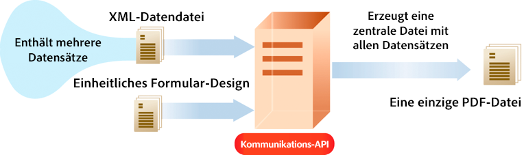

# AEM Forms as a Cloud Service – Kommunikations-APIs {#frequently-asked-questions}

| Version | Artikel-Link |
| -------- | ---------------------------- |
| AEM 6.5 | [Hier klicken](https://experienceleague.adobe.com/docs/experience-manager-65/forms/use-document-services/overview-aem-document-services.html?lang=de) |
| AEM as a Cloud Service | Dieser Artikel |

Die Kommunikationsfunktion hilft Ihnen, markenorientierte, personalisierte und standardisierte Dokumente wie Geschäftskorrespondenzen, Kontoauszüge, Mahnschreiben, Leistungsbescheide, monatliche Rechnungen oder Willkommenspakete zu erstellen.

Die Funktion stellt APIs zum Erzeugen und Bearbeiten der Dokumente bereit. Sie können bei Bedarf ein Dokument erzeugen oder einen Batch-Vorgang erstellen, um mehrere Dokumente in definierten Intervallen zu generieren. Kommunikations-APIs bieten:

* Optimierte Funktionen zur Erstellung von On-Demand- und Batch-Dokumentationen.

* Die Möglichkeit, PDF-Dokumente bei Bedarf zu kombinieren, neu anzuordnen und zu validieren.

* HTTP-APIs für eine einfachere Integration mit bestehenden Systemen. Separate APIs für Vorgänge auf Anfrage (niedrige Latenz) und Batch-Vorgänge (Vorgänge mit hohem Durchsatz) sind enthalten.

* Sicherer Datenzugriff. Kommunikations-APIs verbinden sich nur mit Daten aus Daten-Repositorys, die vom Kunden festgelegt wurden, und greifen nur auf solche Daten zu, wodurch die Kommunikation extrem sicher ist.

Die [Dokumentation zur API-Referenz](https://developer.adobe.com/experience-cloud/experience-manager-apis/api/experimental/document/) enthält detaillierte Informationen zu allen Parametern, Authentifizierungsmethoden und verschiedenen Services, die von APIs bereitgestellt werden. Die Dokumentation zur API-Referenz ist auch im Format .yaml verfügbar. Sie können die .yaml-Datei herunterladen und sie in Postman hochladen, um die Funktionalität der APIs zu überprüfen.

<!-- 

A credit card statement can be created using Communications APIs. This sample statement uses same template but separate data for each customer depending on their usage of credit card.

-->

## Erstellen von Dokumenten

APIs zur Generierung von Kommunikationsdokumenten ermöglichen Ihnen durch die Kombination einer Vorlage (XFA oder PDF) mit Kundendaten (XML-Daten) Dokumente in PDF- und Druckformaten wie PS, PCL, DPL, IPL und ZPL zu erstellen. Diese APIs verwenden PDF- und XFA-Vorlagen mit [XML-Daten](communications-known-issues-limitations.md#form-data), um auf Anfrage ein einzelnes Dokument oder mehrere Dokumente mithilfe eines Batch-Vorgangs zu erzeugen.

Normalerweise erstellen Sie eine Vorlage mit [Designer](use-forms-designer.md) und verwenden Communications-APIs, um Daten mit der Vorlage zusammenzuführen. Ihr Programm kann das Ausgabedokument zur Archivierung an einen Netzwerkdrucker, einen lokalen Drucker oder an ein Speichersystem senden. Typische vorkonfigurierte und benutzerdefinierte Workflows sehen wie folgt aus:

Je nach Anwendungsfall können Sie diese Dokumente auch über Ihre Website oder einen Speicher-Server zum Download bereitstellen.

Beispiele für APIs zum Erzeugen von Dokumenten:

### Erstellen von PDF-Dokumenten {#create-pdf-documents}

Sie können die API zum Erzeugen von Dokumenten verwenden, um ein PDF-Dokument zu erstellen, das auf einem Formular-Design und XML-Formulardaten basiert. Die Ausgabe ist ein nicht interaktives PDF-Dokument. Das heißt, Benutzer können keine Formulardaten eingeben oder ändern. Ein einfacher Workflow besteht darin, XML-Formulardaten mit einem Formular-Design zusammenzuführen, um ein PDF-Dokument zu erstellen. Die folgende Abbildung zeigt die Zusammenführung von Formular-Designs und XML-Formulardaten zur Erstellung eines PDF-Dokuments.

Abbildung: Typischer Workflow zum Erstellen eines PDF-Dokuments

Die API zur Dokumenterstellung gibt das generierte PDF-Dokument zurück. Optional können Sie auch die generierten PDF-Dateien in Azure Blob Storage hochladen.

 Das Hochladen der generierten PDF-Dateien mit der API zur Dokumenterstellung in die Azure Blob Storage-Funktion erfolgt im Rahmen des [Early-Adopter-Programms](/help/forms/early-access-ea-features.md). Sie können von Ihrer offiziellen E-Mail-Adresse aus an aem-forms-ea@adobe.com schreiben, um dem Early-Adopter-Programm beizutreten und den Zugriff auf diese Funktion zu beantragen. 

### Erstellen des Dokuments im Format PostScript (PS), Printer Command Language (PCL), Zebra Printing Language (ZPL) {#create-PS-PCL-ZPL-documents}

Sie können APIs zur Dokumenterstellung verwenden, und zwar von PostScript (PS)-, Printer Command Language (PCL)- und Zebra Printing Language (ZPL)-Dokumenten, die auf einem XDP-Formular-Design oder PDF-Dokument basieren. Diese APIs helfen beim Zusammenführen eines Formular-Designs mit Formulardaten, um ein Dokument zu erzeugen. Sie können das Dokument in einer Datei speichern und einen benutzerdefinierten Prozess entwickeln, um es an einen Drucker zu senden.

<!-- ### Processing batch data to create multiple documents

Communications APIs can create separate documents for each record within an XML batch data source. The APIs can also create a single document that contains all records (this functionality is the default). Assume that an XML data source contains ten records and you instruct the APIs to create a separate document for each record (for example, PDF documents). As a result, the APIs generate ten PDF documents.

The following illustration also shows Communications APIs processing an XML data file that contains multiple records. However, assume that you instruct the APIs to create a single PDF document that contains all data records. In this situation, the APIs generate one document that contains all the records.

The following illustration shows Communications APIs processing an XML data file that con tains multiple records. Assume that you instruct the Communications APIs to create a separate PDF document for each data record. In this situation, the APIs generates a separate PDF document for each data record.

 -->

### Verarbeitung von Batch-Daten zum Erstellen mehrerer Dokumente {#processing-batch-data-to-create-multiple-documents}

Sie können APIs zum Erzeugen von Dokumenten verwenden, um separate Dokumente für jeden Eintrag in einer XML-Batch-Datenquelle zu erstellen. Sie können Dokumente im Bulk-Modus und im asynchronen Modus erstellen. Sie können verschiedene Parameter für die Konvertierung konfigurieren und dann den Batch-Prozess starten.

<!-- You can can also create a single document that contains all records (this functionality is the default).  Assume that an XML data source contains ten records and you have a requirement to create a separate document for each record (for example, PDF documents). You can use the Communication APIs to generate ten PDF documents. -->

<!-- The following illustration shows the Communication APIs processing an XML data file that contains multiple records. However, assume that you instruct the Communication APIs to create a single PDF document that contains all data records. In this situation, the Communication APIs generate one document that contains all the records.

The following illustration shows the Communication APIs processing an XML data file that contains multiple records. Assume that you instruct the Communication APIs to create a separate PDF document for each data record. In this situation, the Communication APIs generates a separate PDF document for each data record.

For detailed information on using Batch APIs, see Communication APIs: Processing batch data to create multiple documents. 

### Flatten interactive PDF documents {#flatten-interactive-pdf-documents}

You can use document generation APIs to transform an interactive PDF document (for example, a form) to a non-interactive PDF document. An interactive PDF document lets users enter or modify data located in the PDF document fields. The process of transforming an interactive PDF document to a non-interactive PDF document is called flattening. When a PDF document is flattened, a user cannot modify the data located in the document's fields. One reason to flatten a PDF document is to ensure that data cannot be modified.

You can flatten the following types of PDF documents:

* Interactive PDF documents created in Designer (that contain XFA streams).

* Acrobat PDF forms

If you attempt to flatten a non-interactive PDF document, an exception occurs.

### Retain Form State {#retain-form-state}

An interactive PDF document contains various elements that constitute a form. These elements may include fields (to accept or display data), buttons (to trigger events), and scripts (commands to perform a specific action). Clicking a button may trigger an event that changes the state of a field. For example, choosing a gender option may change the color of a field or the appearance of the form. This is an example of a manual event causing the form state to change.

When such an interactive PDF document is flattened using the Communications APIs, the state of the form is not retained. To ensure that the state of the form is retained even after the form is flattened, set the Boolean value _retainFormState_ to True to save and retain the state of the form. -->

## Bearbeitung von Dokumenten

APIs zum Bearbeiten (Umwandeln) von Kommunikationsdokumenten helfen beim Kombinieren und Neuanordnen von PDF-Dokumenten. In der Regel erstellen Sie ein DDX und übermitteln es an APIs zur Dokumentenbearbeitung, um ein Dokument zusammenzustellen oder neu anzuordnen. Das [DDX-Dokument](https://helpx.adobe.com/content/dam/help/en/experience-manager/forms-cloud-service/ddxRef.pdf) enthält Anweisungen dazu, wie die Quelldokumente zum Erzeugen eines Satzes von erforderlichen Dokumenten verwendet werden. Die DDX-Referenzdokumentation enthält detaillierte Informationen zu allen unterstützten Vorgängen. Beispiele für die Bearbeitung von Dokumenten:

### Zusammenführen von PDF-Dokumenten

Mithilfe von APIs zur Dokumentbearbeitung können Sie zwei oder mehrere PDF- oder XDP-Dokumente zu einem einzigen PDF-Dokument oder PDF-Portfolio zusammenführen. Im Folgenden finden Sie einige Möglichkeiten, wie Sie PDF-Dokumente zusammenführen können:

* Zusammenführen eines einzelnen PDF-Dokuments
* Erstellen eines PDF-Portfolios
* Zusammenführen von verschlüsselten Dokumenten
* Zusammenführen von Dokumenten mithilfe der Bates-Nummerierung
* Reduzieren und Zusammenführen von Dokumenten

Abbildung: Zusammenstellen eines einfachen PDF-Dokuments aus mehreren PDF-Dokumenten

### Aufteilen von PDF-Dokumenten

Sie können die APIs zur Dokumentbearbeitung verwenden, um ein PDF-Dokument zu zerlegen. Die APIs können kann Seiten aus dem Quelldokument extrahieren oder ein Quelldokument basierend auf Lesezeichen aufteilen. Diese Aufgabe ist normalerweise hilfreich, wenn das PDF-Dokument ursprünglich aus vielen Einzeldokumenten erstellt wurde, wie z. B. einer Sammlung von Aussagen.

* Extrahieren von Seiten aus einem Quelldokument
* Aufteilen eines Quelldokuments basierend auf Lesezeichen

Abbildung: Aufteilen eines Quelldokuments basierend auf Lesezeichen in mehrere Dokumente

>[!NOTE]
>
> AEM Forms bietet eine Vielzahl integrierter Schriftarten, die nahtlos in PDF-Dateien integriert werden können. Um die Liste der unterstützten Schriftarten anzuzeigen, [klicken Sie hier](/help/forms/supported-out-of-the-box-fonts.md).

<!-- 

## Document utilities

Document utilities synchronous APIs helps you convert documents between PDF and XDP file formats, and query information about a PDF document. For example, you can determine whether a PDF document contains comments or attachments.

### Retrieve PDF document properties

You can [query a PDF document](https://developer.adobe.com/experience-manager-forms-cloud-service-developer-reference/references/pdf-utility-sync/#tag/Document-Extraction/) for the following information:

* Is a PDF Document: Check whether the source document is a PDF document.
* Is a fillable form: Check whether the source PDF document is a fillable form.
* Form Type: Retrieve the form type of the document.
* Check for Attachments: Check whether the source PDF document has any attachments.
* Check for Comments: Check whether the source PDF document has any review comments.
* Is a PDF Package: Check whether the document is a PDF package.
* Get the PDF Version: Retrieve the [version of the PDF document](https://en.wikipedia.org/wiki/History_of_PDF).
* Recommended Acrobat Version: Retrieve the required version of Acrobat (Reader) to open the PDF document.
* Is an XFA Document: Check whether the source PDF document is an XFA-based PDF document.
* Is Shell PDF: Check whether the source PDF document is shell PDF. A shell PDF contains only an XFA stream, font and image resources, and one page that is either blank or contains a warning that the document must be opened using Acrobat or Adobe Reader. The shell PDF is used with PDF transformation to optimize delivery of PDFForm transformations only.
* Get the XFA Version: Retrieve the [XFA Version for an XFA-based PDF document](https://en.wikipedia.org/wiki/XFA#XFA_versions).

### Convert PDF Documents into XDP Documents

The [PDF to XDP API](https://developer.adobe.com/experience-manager-forms-cloud-service-developer-reference/references/pdf-utility-sync/#tag/Document-Conversion) converts a PDF document to an XDP file. For a PDF document to be successfully converted to an XDP file, the PDF document must contain an XFA stream in the dictionary. -->

## Dokumentenextraktion

 Die Funktion zur Dokumentenextraktion ist im Rahmen des Early-Adopter-Programms verfügbar. Sie können von Ihrer offiziellen E-Mail-Adresse aus an aem-forms-ea@adobe.com schreiben, um dem Early-Adopter-Programm beizutreten und den Zugriff auf diese Funktion zu beantragen. 

Der Dokumentenextraktionsdienst bietet Ihnen die Möglichkeit, die Eigenschaften eines PDF-Dokuments abzurufen, z. B. die Verwendungsrechte, PDF-Eigenschaften und Metadaten. Dokumentenextraktionsfunktionen sind:

* Abrufen der Eigenschaften eines PDF-Dokuments, z. B. wenn das PDF Anhänge, Kommentare, die Acrobat-Version o. ä. enthält.
* Extrahieren der in einem PDF-Dokument aktivierten Verwendungsrechte. Benutzende rufen die Verwendungsrechte ab, die für ein PDF-Dokument für die Adobe Acrobat Reader-Erweiterbarkeit aktiviert oder deaktiviert sind.
* Abrufen der Metadateninformationen eines PDF-Dokuments. Die Metadaten sind Informationen über das Dokument (unabhängig vom Inhalt des Dokuments, wie z. B. Text und Grafiken). Adobe Extensible Metadata Platform (XMP) ist ein Standard für die Verarbeitung von Dokumentenmetadaten. Der XMP Utilities-Dienst kann XMP-Metadaten aus PDF-Dokumenten abrufen und XMP-Metadaten in PDF-Dokumente exportieren.

Die [Dokumentation zur API-Referenz](https://developer.adobe.com/experience-cloud/experience-manager-apis/api/experimental/document/) enthält detaillierte Informationen zu allen Parametern, Authentifizierungsmethoden und den Diensten, die von APIs bereitgestellt werden. Die Dokumentation zur API-Referenz ist auch im Format .yaml verfügbar. Sie können die .yaml-Datei herunterladen und sie in Postman hochladen, um die Funktionalität von APIs zu überprüfen.

<!--

 The XMP Utilities Service capability is under Early Adopter Program. You can write to aem-forms-ea@adobe.com from your official email id to join the early adopter program and request access to the capability. 

### XMP Utilities {#XMP-utilities}

 The XMP Utilities Service capability is under Early Adopter Program. You can write to aem-forms-ea@adobe.com from your official email id to join the early adopter program and request access to the capability. 

PDF documents contain metadata, which is information about the document (as distinguished from the contents of the document, such as text and graphics). The Adobe Extensible Metadata Platform (XMP) is a standard for handling document metadata. The XMP Utilities service can retrieve and save XMP metadata from PDF documents and import XMP metadata into PDF documents.

-->

## Dokumentenkonvertierung

### Konvertieren in PDF/A-konforme Dokumente und Validieren

Mithilfe von APIs zur Konvertierung von Kommunikationsdokumenten können Sie ein PDF-Dokument in PDF/A konvertieren. Sie können die APIs verwenden, um ein PDF-Dokument in ein PDF/A-konformes Dokument zu konvertieren und um zu ermitteln, ob ein PDF-Dokument PDF/A-konform ist. PDF/A ist ein Archivierungsformat für die langfristige Speicherung von Dokumentinhalten. Die Schriftarten werden im Dokument eingebettet und die Datei bleibt unkomprimiert. PDF/A-Dokumente sind daher in der Regel größer als normale PDF-Dokumente. Außerdem enthalten PDF/A-Dokumente keine Audio- und Videoinhalte. Zu den unterstützten PDF/A-Compliance-Standards gehören PDF/A-1a, 1b, 2a, 2b, 3a und 3b.

### Konvertieren von PDF in XDP {#convert-pdf-to-xdp}

 Die Funktion zum Konvertieren von PDF in XDP ist im Rahmen des Early-Adopter-Programms verfügbar. Sie können von Ihrer offiziellen E-Mail-Adresse aus an aem-forms-ea@adobe.com schreiben, um dem Early-Adopter-Programm beizutreten und den Zugriff auf diese Funktion zu beantragen. 

Konvertiert ein PDF-Dokument in eine XDP-Datei. Damit ein PDF-Dokument in eine XDP-Datei konvertiert werden kann, muss es einen XFA-Stream im Wörterbuch enthalten.

## Document Assurance {#doc-assurance}

Der DocAssurance-Dienst umfasst die Signature- und Verschlüsselungs-APIs:

### Signature-APIs

Signature-APIs ermöglichten Ihrem Unternehmen, die Sicherheit und Vertraulichkeit verteilter und empfangener Adobe PDF-Dokumente zu gewährleisten. <!--This service uses digital signatures and certification to ensure that only intended recipients can alter documents. --> Die Sicherheitsfunktionen werden auf das Dokument selbst angewendet, das Dokument bleibt für seinen gesamten Lebenszyklus sicher und kontrolliert. Das Dokument bleibt außerhalb der Firewall sicher, wenn es offline heruntergeladen und an Ihr Unternehmen zurückgesendet wird. Sie können die folgenden Aufgaben mithilfe der Signature-APIs ausführen:

* Einem PDF-Dokument ein sichtbares Signaturfeld hinzufügen.
* Einem PDF-Dokument ein unsichtbares Signaturfeld hinzufügen.
* Das angegebene Signaturfeld in einem PDF-Dokument signieren.
* Ein PDF-Dokument zertifizieren
* Die Signatur aus dem angegebenen Signaturfeld in einem PDF-Dokument entfernen
* Das angegebene Signaturfeld aus einem PDF-Dokument entfernen

 Die Funktionen zum Entfernen der Signatur aus dem angegebenen Signaturfeld und zum Löschen des angegebenen Signaturfelds aus einem PDF-Dokument sind im Rahmen des Early-Adopter-Programms verfügbar. Sie können von Ihrer offiziellen E-Mail-Adresse aus an aem-forms-ea@adobe.com schreiben, um dem Early-Adopter-Programm beizutreten und den Zugriff auf diese Funktion zu beantragen. 

<!--

### Remove Signature APIs

The Remove Signature API helps to remove an existing digital signatures from a PDF document. This API is useful when you need to update or revise a signed document and reapply signatures. It maintains document integrity while effectively clearing signatures from specific pages or the entire file. Use cases include re-signing documents with updated data or clearing previous approvals for revised versions.

### Remove Signature Field APIs

The Remove Signature Field API is tailored for removing signature fields from a PDF document. This is ideal when you need to delete empty or unused signature fields to streamline document presentation. It enables users to eliminate signature fields without impacting other form fields or the document structure, making it easier to create cleaner, final versions of a document that no longer require signatures.

-->

### Verschlüsselungs-APIs

Mit Verschlüsselungs-APIs können Sie Dokumente verschlüsseln und entschlüsseln. Wird ein Dokument verschlüsselt, ist sein Inhalt nicht mehr lesbar. Eine autorisierte Person kann das Dokument entschlüsseln, um Zugriff auf den Inhalt zu erhalten. Wenn ein PDF-Dokument mit einem Kennwort verschlüsselt wird, muss die Benutzerin bzw. der Benutzer das Kennwort zum Öffnen angeben, damit das Dokument in Adobe Reader oder Adobe Acrobat angezeigt werden kann. <!-- Likewise, if a PDF document is encrypted with a certificate, the user must decrypt the PDF document with the public key that corresponds to the certificate (private key) that was used to encrypt the PDF document.-->

Sie können diese Aufgaben mithilfe der Verschlüsselungs-APIs erledigen:

* Verschlüsseln eines PDF-Dokuments mit einem Kennwort.
* Entfernen der kennwortbasierten Verschlüsselung aus einem PDF-Dokument.
* Abrufen des Sicherheitstyps, der zum Schützen eines PDF-Dokuments verwendet wurde.
* Rückgabe des Sicherheitstyps, der auf ein PDF-Dokument angewendet wird.

Sowohl Signature-APIs als auch Verschlüsselungs-APIs sind [synchrone APIs](#types-of-communications-apis-types).

### Dokumenten-Dienstprogramme {#doc-utility}

Mithilfe von Dokumenten-Dienstprogrammen mit synchronen APIs können Sie Dokumente zwischen den Dateiformaten PDF und XDP konvertieren. Wenden Sie Verwendungsrechte auf ein Dokument an und extrahieren Sie die aktivierten Verwendungsrechte aus einem Dokument. Rufen Sie Informationen zu einem PDF-Dokument ab. <!-- determines whether a PDF document contains comments or attachments and more, and use document transformation services for XMP utilities--> Details zu den Verwendungsrechte-APIs finden Sie unten:

#### Verwendungsrechte-APIs (Reader-Erweiterung)

 Die Funktion für die Verwendungsrechte (Reader-Erweiterung) ist im Rahmen des Early-Adopter-Programms verfügbar. Sie können von Ihrer offiziellen E-Mail-Adresse aus an aem-forms-ea@adobe.com schreiben, um dem Early-Adopter-Programm beizutreten und den Zugriff auf diese Funktion zu beantragen. 

Die Verwendungsrechte-Funktion ermöglicht Unternehmen die einfache Freigabe interaktiver PDF-Dokumente durch Erweitern der Funktionalität von Adobe Reader durch zusätzliche Verwendungsrechte. Der Dienst funktioniert mit Adobe Reader 7.0 oder höher und fügt einem PDF-Dokument Verwendungsrechte hinzu. Diese Aktion aktiviert Funktionen, die normalerweise nicht verfügbar sind, wenn ein PDF-Dokument in Adobe Reader geöffnet wird, z. B. das Hinzufügen von Kommentaren zu einem Dokument, das Ausfüllen von Formularen und das Speichern des Dokuments.

Bei PDF-Dokumenten, denen entsprechende Verwendungsrechte hinzugefügt wurden, können Empfängerinnen und Empfänger die folgenden Aktivitäten in Adobe Reader durchführen:

* Ausfüllen von PDF-Dokumenten und Formularen online oder offline, sodass Empfängerinnen und Empfänger lokale Kopien speichern können und dabei die hinzugefügten Informationen erhalten bleiben.
* Speichern von PDF-Dokumenten auf einer lokalen Festplatte, damit das Originaldokument und alle weiteren Kommentare, Daten oder Anlagen erhalten bleiben.
* Anhängen von Dateien und Medien-Clips an PDF-Dokumente.
* Signieren, Zertifizieren und Authentifizieren von PDF-Dokumenten durch die Anwendung digitaler Signaturen mithilfe von PKI-Technologien (PKI = Public Key Infrastructure), die dem Branchenstandard entsprechen.
* Elektronisches Senden ausgefüllter oder mit Anmerkungen versehener PDF-Dokumente.
* Verwenden von PDF-Dokumenten und -Formularen als intuitives Entwicklungs-Frontend für interne Datenbanken und Web-Dienste.
* Freigeben von PDF-Dokumenten für andere Benutzende, sodass Prüfende mit intuitiven Markup-Werkzeugen Kommentare hinzufügen können Zu diesen Werkzeugen gehören elektronische Haftnotizen, Stempel, Hervorheben und Durchstreichen. Dieselben Funktionen sind in Acrobat verfügbar.
* Unterstützen der Dekodierung von Barcode-Formularen.

Diese speziellen Verwendungsrechte werden automatisch aktiviert, wenn ein PDF-Dokument mit aktivierten Rechten in Adobe Reader geöffnet wird. Wenn Benutzende die Arbeit mit einem Dokument mit aktivierten Rechten beendet haben, sind diese Funktionen in Adobe Reader wieder deaktiviert. Sie bleiben deaktiviert, bis die Person ein anderes PDF-Dokument mit aktivierten Rechten erhält.

#### Aktivieren oder Deaktivieren von Verwendungsrechten

Die verschiedenen Verwendungsrechte-Funktionen für die Erweiterung der PDF Reader-Dienste sind:

* **Barcode-Dekodierung**: Zum Dekodieren von Barcodes innerhalb des PDF-Dokuments.

* **Kommentare**: Um das PDF-Dokument offline zu kommentieren.

* **Online-Kommentare**: Um das PDF-Dokument online zu kommentieren.

* **Digitale Signatur**: Um einem PDF-Dokument digitale Signaturen hinzuzufügen.

* **Dynamische Formularfelder**: Um einem PDF-Dokument Formularfelder hinzuzufügen.

* **Dynamische Formularseiten**: Um einem PDF-Dokument Formularseiten hinzuzufügen.

* **Eingebettete Dateien**: Um Dateien in ein PDF-Dokument einzubetten.

* **Formulardaten-Import**: Um Formulardaten in ein PDF-Dokument zu importieren.

* **Formulardaten-Export**: Um Formulardaten in ein PDF-Dokument zu importieren.

* **Formular ausfüllen**: Um Formularfelder in einem PDF-Dokument auszufüllen.

* **Online-Formulare**: Um von einem PDF-Dokument aus auf einen Web-Dienst oder eine Datenbank zuzugreifen.

* **Eigenständig übermitteln**: Um Formulardaten offline aus einem PDF-Dokument zu übermitteln.

#### Sonstige Funktionen

* **Meldung**: Die Meldung, die in Adobe Acrobat Reader beim Öffnen eines PDF-Dokuments mit einem oder mehreren angewendeten Verwendungsrechten angezeigt wird.
* **Kennwort entsperren**: Das zum Öffnen eines verschlüsselten PDF-Dokuments erforderliche Kennwort. Normalerweise ist dies das Kennwort zum Öffnen des Dokuments, aber wenn das PDF-Dokument zusätzlich durch ein Berechtigungskennwort geschützt ist, können beide Kennwörter zum Öffnen des Dokuments verwendet werden.

## Typen von Kommunikations-APIs {#types}

Kommunikationen bieten HTTP-APIs für die On-Demand- und Batch-Dokumentgenerierung:

* **[Synchrone APIs](https://developer.adobe.com/experience-manager-forms-cloud-service-developer-reference/)** eignen sich für die Dokumenterstellung auf Anfrage, mit geringer Latenz und mit einzelnen Datensätzen. Diese APIs eignen sich besser für Anwendungen auf Basis einer Benutzeraktion. Zum Beispiel das Generieren eines Dokuments, nachdem ein Benutzer ein Formular ausgefüllt hat.

* **[Batch-APIs (asynchrone APIs)](https://developer.adobe.com/experience-manager-forms-cloud-service-developer-reference/)** eignen sich für Anwendungsfälle für die geplante Erstellung mehrerer Dokumente mit hohem Durchsatz. Diese APIs generieren Dokumente in Stapeln. Damit werden beispielsweise monatliche Telefonrechnungen, Kreditkartenauszüge und Leistungsmitteilungen generiert.

## Onboarding

Die Kommunikationsfunktion steht Forms as a Cloud Service-Benutzern als eigenständiges und als Add-on-Modul zur Verfügung. Sie können beim Adobe-Vertriebs-Team oder Adobe-Support um Zugriff bitten. Adobe ermöglicht den Zugriff für Ihre Organisation und stellt der in Ihrer Organisation als Admin genannten Person die erforderlichen Berechtigungen zur Verfügung. Admins können den Entwickelnden (Benutzenden) von Forms as a Cloud Service in Ihrer Organisation Zugriff auf die APIs gewähren.

So aktivieren Sie nach dem Onboarding die Kommunikationsfunktion für Ihre Forms as a Cloud Service-Umgebung:

1. Melden Sie sich bei Cloud Manager an und öffnen Sie eine AEM Forms as a Cloud Service-Instanz.

1. Wählen Sie die Option „Programm bearbeiten“, gehen Sie zur Registerkarte „Lösungen und Add-ons“ und wählen Sie **[!UICONTROL Forms – Kommunikation]**.

   

   Wenn Sie die Option **[!UICONTROL Forms – Digitale Registrierung]** bereits aktiviert haben, wählen Sie anschließend die Option **[!UICONTROL Forms – Kommunikations-Add-on]**.

   

1. Klicken Sie auf **[!UICONTROL Aktualisieren]**.

1. Führen Sie die Build-Pipeline aus. Nachdem die Build-Pipeline erfolgreich ausgeführt wurde, werden die Kommunikations-APIs für Ihre Umgebung aktiviert.

>[!NOTE]
>
> Um APIs zur Dokumentbearbeitung zu aktivieren und zu konfigurieren, fügen Sie die folgende Regel zur [Dispatcher-Konfiguration](setup-local-development-environment.md#forms-specific-rules-to-dispatcher) hinzu:
>
> `# Allow Forms Doc Generation requests`
> `/0062 { /type "allow" /method "POST" /url "/adobe/forms/assembler/*" }`

<!--

Communication help you combine a template and XML data to generate print documents in various formats. The service lets you generate documents in synchronous and batch modes. The APIs enables you to create applications that let you:

  * Generate documents by populating template files (PDF and XDP) with XML data.
  * Generate output forms in various formats, including non-interactive PDF print streams.

Consider a scenario where you have one or more templates and multiple records of XML data for each template. You can use Communications APIs to generate a print document for each record.  You can also combine the records into a single document.  The result is a non-interactive PDF document. A non-interactive PDF document does not let users enter data into its fields.

 There are two main Communications APIs. The _generatePDFOutput_ generates PDFs, while the _generatePrintedOutput_ generates PostScript, ZPL, and PCL formats. These APIs are available as REST endpoints on your environment, both on author and publish instances. Since the publish instances are configured to scale faster than the author instances, it is recommended use these APIs via publish instances.

The first parameter of both the operations accept the path and name of the template file (for example, ExpenseClaim.xdp). You can specify a fully qualified path, reference path of your AEM Repository, or path of a binary file. The second parameter accepts an XML document that is merged with the template while generating the output document.  

The [API reference documentation](https://documentcloud.adobe.com/link/track?uri=urn:aaid:scds:US:b1223732-ae0f-4921-bdc0-c31e48b56044) provides detailed information about all the parameters, authentication methods, and various services provided by APIs. The API reference documentation is also available in the .yaml format. You can download the .yaml for [Batch APIs](assets/batch-api.yaml) or [non-Batch API.yaml](assets/non-batch-api.yaml) file and upload it to postman to check functionality of APIs.

>[!VIDEO](https://video.tv.adobe.com/v/335771)

Uploading Communication APIs .yaml file to postman to check functionality of APIs.

## Using the Communications APIs {#workflows}

Typically, you create a template using [Designer](use-forms-designer.md) and use communications APIs ( generatePDFOutput and generatePrintedOutput) to:

* Convert these templates to various formats, including PDF, PostScript, ZPL, and PCL.
* Merge XML form data with a form design to generate a document.
* Generate a document without merging XML form data into the document. However, the primary workflow is merging data into the document.

Then, the output document is stored to a file. You can design custom workflows to send the file to a network printer, a local printer, or to a storage system for archival. A typical out of the box and custom workflows look like the following:

### Create PDF documents {#create-pdf-documents}

You can use the _generatePDFOutput_ API to create PDF document that is based on a form design and XML form data. The output is a non-interactive PDF document. That is, users cannot enter or modify form data. A basic workflow is to merge XML form data with a form design to create a PDF document. The following illustration shows the merging of a form design and XML form data to produce a PDF document.

### Create PostScript (PS), Printer Command Language (PCL), Zebra Printing Language (ZPL) document {#create-PS-PCL-ZPL-documents}

You can use Communications APIs to create PostScript (PS), Printer Command Language (PCL), and Zebra Printing Language (ZPL) document that are based on an XDP form design or PDF document. The _generatePrintedOutput_ API merges a form design with form data to generate a document. You can save the document to a file and develop a custom process to send it to a printer.

 ### Processing batch data to create multiple documents

Communications APIs can create separate documents for each record within an XML batch data source. The APIs can also create a single document that contains all records (this functionality is the default). Assume that an XML data source contains ten records and you instruct the APIs to create a separate document for each record (for example, PDF documents). As a result, the APIs generate ten PDF documents.

The following illustration also shows Communications APIs processing an XML data file that contains multiple records. However, assume that you instruct the APIs to create a single PDF document that contains all data records. In this situation, the APIs generate one document that contains all the records.

The following illustration shows Communications APIs processing an XML data file that contains multiple records. Assume that you instruct the Communications APIs to create a separate PDF document for each data record. In this situation, the APIs generates a separate PDF document for each data record.

### Processing batch data to create multiple documents {#processing-batch-data-to-create-multiple-documents}

You create separate documents for each record within an XML batch data source. You can can also create a single document that contains all records (this functionality is the default). Assume that an XML data source contains ten records and you have a requirement to create a separate document for each record (for example, PDF documents). You can use the Communication APIs to generate ten PDF documents.

The following illustration shows the Communication APIs processing an XML data file that contains multiple records. However, assume that you instruct the Communication APIs to create a single PDF document that contains all data records. In this situation, the Communication APIs generate one document that contains all the records.

The following illustration shows the Communication APIs processing an XML data file that contains multiple records. Assume that you instruct the Communication APIs to create a separate PDF document for each data record. In this situation, the Communication APIs generates a separate PDF document for each data record.

For detailed information on using Batch APIs, see Communication APIs: Processing batch data to create multiple documents.

### Flatten interactive PDF documents {#flatten-interactive-pdf-documents}

You can use the Communications APIs to transform an interactive PDF document (for example, a form) to a non-interactive PDF document. An interactive PDF document lets users enter or modify data located in the PDF document fields. The process of transforming an interactive PDF document to a non-interactive PDF document is called flattening. When a PDF document is flattened, a user cannot modify the data located in the document's fields. One reason to flatten a PDF document is to ensure that data cannot be modified.

You can flatten the following types of PDF documents:

* Interactive PDF documents created in Designer (that contain XFA streams).

* Acrobat PDF forms

If you attempt to flatten a non-interactive PDF document, an exception occurs.

### Retain Form State {#retain-form-state}

An interactive PDF document contains various elements that constitute a form. These elements may include fields (to accept or display data), buttons (to trigger events), and scripts (commands to perform a specific action). Clicking a button may trigger an event that changes the state of a field. For example, choosing a gender option may change the color of a field or the appearance of the form. This is an example of a manual event causing the form state to change.

When such an interactive PDF document is flattened using the Communications APIs, the state of the form is not retained. To ensure that the state of the form is retained even after the form is flattened, set the Boolean value _retainFormState_ to True to save and retain the state of the form.  -->

## Siehe auch {#see-also}

* [Kommunikationsverarbeitung – Synchrone APIs](/help/forms/aem-forms-cloud-service-communications.md)
* [Kommunikationsverarbeitung – Batch-APIs](/help/forms/aem-forms-cloud-service-communications-batch-processing.md)
* [AEM Forms as a Cloud Service-Architektur für adaptive Formulare und Kommunikations-APIs](/help/forms/aem-forms-cloud-service-architecture.md)
