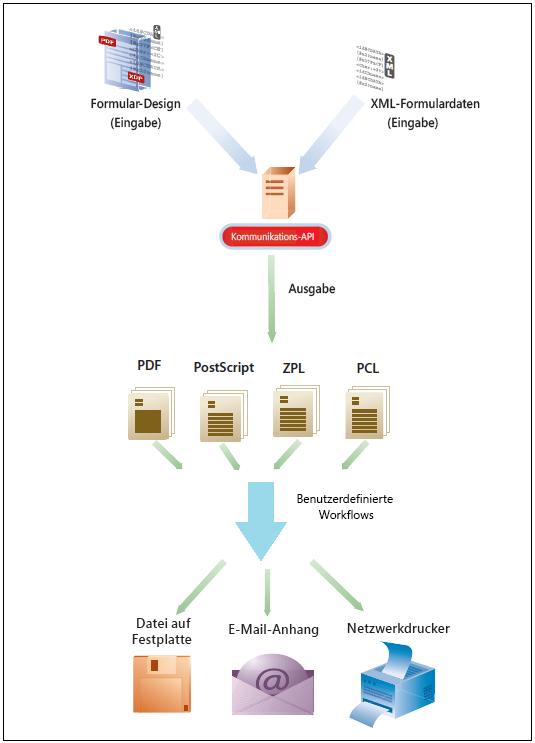
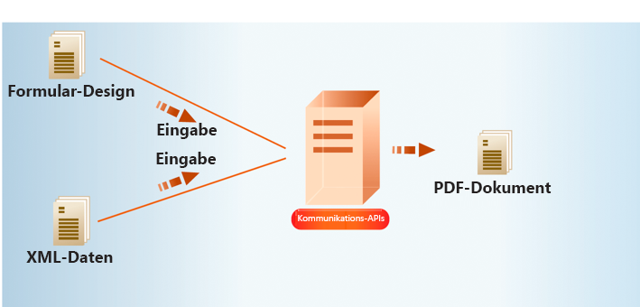
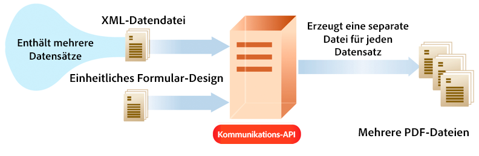
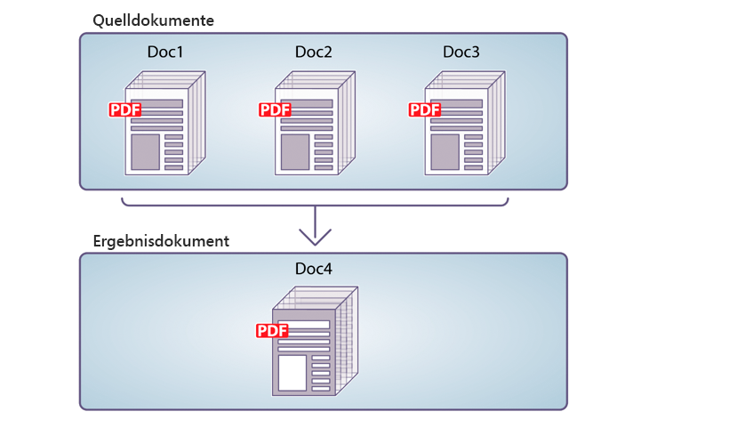
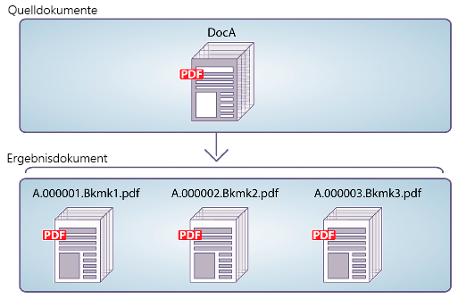

# AEM Forms as a Cloud Service – Kommunikations-APIs {#communications-apis-overview}

> **Versionsverfügbarkeit**
>
> * **AEM 6.5**: [Überblick über Dokumenten-Services in AEM](https://experienceleague.adobe.com/docs/experience-manager-65/forms/use-document-services/overview-aem-document-services.html?lang=de)
> * **AEM as a Cloud Service**: Dieser Artikel

## Einführung

Mithilfe von Kommunikations-APIs in AEM Forms as a Cloud Service können Sie markenkonforme, personalisierte und standardisierte Dokumente für Ihre Geschäftsanforderungen erstellen. Diese leistungsstarken APIs ermöglichen es Ihnen, Dokumente programmgesteuert zu erstellen, zu bearbeiten und zu schützen, sei es bei Bedarf oder in Batch-Prozessen mit hohem Volumen.

### Wichtigste Vorteile

* **Optimierte Dokumenterstellung**: Erstellen Sie personalisierte Dokumente durch Zusammenführen von Vorlagen mit Kundendaten.
* **Leistungsstarke Dokumentbearbeitung**: Nutzen Sie die Möglichkeit, PDF-Dokumente programmgesteuert zu kombinieren, neu anzuordnen und zu validieren.
* **Flexible Bereitstellungsoptionen**: Verwenden Sie On-Demand-APIs für Anforderungen mit geringer Latenz oder Batch-APIs für Vorgänge mit hohem Durchsatz.
* **Verbesserte Sicherheit**: Wenden Sie digitale Signaturen, Zertifizierung und Verschlüsselung zum Schutz vertraulicher Dokumente an.
* **Cloud-native Architektur**: Nutzen Sie eine skalierbare, sichere Cloud-Infrastruktur ohne Wartungsaufwand.

## Überblick über API-Funktionen

Kommunikations-APIs bieten einen umfassenden Satz an Dokumentverarbeitungsfunktionen, die in die folgenden Funktionsbereiche unterteilt sind:

| Dokumenterstellung | Dokumentbearbeitung | Dokumentextraktion | Dokumentkonvertierung | Dokumentsicherung |
|---------------------|----------------------|---------------------|---------------------|-------------------|
| Erstellen personalisierter Dokumente durch Zusammenführen von Vorlagen mit Daten in verschiedenen Formaten, einschließlich PDF- und Druckformaten | Programmgesteuertes Kombinieren, Neuanordnen und Validieren von PDF-Dokumenten, um neue Dokumentpakete zu erstellen | Extrahieren von Eigenschaften, Metadaten und Inhalte aus PDF-Dokumenten für die weitere Verarbeitung | Konvertieren von Dokumenten zwischen Formaten, einschließlich PDF/A-Compliance-Validierung für Archivierungsanforderungen | Anwenden von digitalen Signaturen, Zertifizierung und Verschlüsselung zum Sichern und Schützen von Dokumenten |

Die [Dokumentation zur API-Referenz](https://developer.adobe.com/experience-cloud/experience-manager-apis/api/experimental/document/) enthält detaillierte Informationen zu allen Parametern, Authentifizierungsmethoden und verschiedenen Services, die von APIs bereitgestellt werden. Die Dokumentation zur API-Referenz ist auch im Format .yaml verfügbar. Sie können die .yaml-Datei herunterladen und sie in Postman hochladen, um die Funktionalität der APIs zu überprüfen.

## Anwendbarkeit und Anwendungsfälle

### Versicherung

## Kann AEM Forms Versicherungspolice-Dokumente generieren?

Ja. AEM Forms kann richtlinienbezogene Dokumente mithilfe von Vorlagen und strukturierten Daten generieren, die über Formulare erfasst werden.

## Kann AEM Forms Versicherungsgeschäfte skaliert abwickeln?

Ja. Bei der Bereitstellung mit empfohlenen Architekturen auf Adobe Managed Services oder Private Cloud unterstützt AEM Forms Formularübermittlungen mit hohem Volumen und Arbeitslasten im Unternehmensmaßstab.

## Dokumenterstellung

APIs zur Erstellung von Kommunikationsdokumenten ermöglichen es Ihnen, durch die Kombination einer Vorlage (XFA oder PDF) mit Kundendaten (XML-Daten) Dokumente in PDF- und AFP-Formaten (Advanced Function Presentation) sowie Druckformaten wie PS, PCL, DPL, IPL und ZPL zu erstellen. Diese APIs verwenden PDF- und XFA-Vorlagen mit [XML-Daten](communications-known-issues-limitations.md#form-data), um auf Anfrage ein einzelnes Dokument oder mehrere Dokumente mithilfe eines Batch-Auftrags zu generieren.

Normalerweise erstellen Sie eine Vorlage mit [Designer](use-forms-designer.md) und verwenden Communications-APIs, um Daten mit der Vorlage zusammenzuführen. Ihr Programm kann das Ausgabedokument zur Archivierung an einen Netzwerkdrucker, einen lokalen Drucker oder an ein Speichersystem senden. Typische vorkonfigurierte und benutzerdefinierte Workflows sehen wie folgt aus:

Je nach Anwendungsfall können Sie diese Dokumente auch über Ihre Website oder einen Speicher-Server zum Download bereitstellen.

### Wichtige Funktionen für die Dokumenterstellung

#### Erstellen von Dokumenten in elektronischen PDF/AFP-Formaten

Sie können das API zur Dokumentenerstellung verwenden, um ein Dokument in PDF- oder AFP-Format zu erstellen, das auf einem Formular-Design und XML-Formulardaten basiert. Die Ausgabe ist ein nicht interaktives Dokument. Das heißt, Benutzende können keine Formulardaten eingeben oder ändern. Ein einfacher Workflow besteht darin, XML-Formulardaten mit einem Formular-Design zusammenzuführen, um ein Dokument zu erstellen. Die folgende Abbildung zeigt die Zusammenführung von Formular-Designs und XML-Formulardaten zur Erstellung eines PDF-Dokuments.

Abbildung: Typischer Workflow zum Erstellen eines Dokuments

In der folgenden Tabelle wird der Unterschied zwischen dem AFP- und PDF-Format angezeigt:

| **Funktion** | **AFP (Advanced Function Presentation)** | **PDF (Portable Document Format)** |
|---------------------------|--------------------------------------------------------------------|-------------------------------------------------------------|
| **Zweck** | Drucken großer Mengen und Erstellen von Transaktionsdokumenten | Freigeben und Anzeigen von Dokumenten für allgemeine Zwecke |
| **Anwendungsfall** | Kontoauszüge, Rechnungen, Belege, Versicherungsunterlagen | E-Books, Formulare, Berichte, Lebensläufe, Handbücher |
| **Plattform-Ursprung** | Entwickelt von IBM | Entwickelt von Adobe |
| **Struktur** | Seitenorientiertes Format mit strukturierten Feldern und Objekten | Seitenorientiert, aber mit festem Layout |
| **Editierbarkeit** | Entwickelt für den Produktionsdruck und wird selten bearbeitet | Kann mit verschiedenen Tools bearbeitet werden, z. B. Adobe Acrobat |
| **Dateigröße und Leistung** | Optimiert für Leistung in Schnelldruckumgebungen | Kann größer und weniger für die Massenausgabe optimiert sein |
| **Interaktivität** | Minimal bis keine; statische Seiten | Unterstützt interaktive Elemente wie Formulare, Links und JavaScript |
| **Ausgabesteuerung** | Fein abgestimmte Steuerung des Layouts für Drucker | Visuelles Layout für Bildschirm und Druck optimiert |
| **Schriftarten und Grafiken** | Verwendet Schriftart- und Ressourcenverweise; erfordert, dass Renderer Folgendes interpretieren | Bettet Schriftarten und Bilder direkt in die Datei ein |

Das API zur Dokumentenerstellung gibt das generierte PDF- oder AFP-Dokument zurück. Optional können Sie auch die generierten PDF-Dateien in Azure Blob Storage hochladen.

 Das Hochladen der generierten PDF-Dateien mit der API zur Dokumenterstellung in die Azure Blob Storage-Funktion erfolgt im Rahmen des [Early-Adopter-Programms](/help/forms/early-access-ea-features.md). Sie können von Ihrer offiziellen E-Mail-Adresse aus an aem-forms-ea@adobe.com schreiben, um dem Early-Adopter-Programm beizutreten und den Zugriff auf diese Funktion zu beantragen. 

>
>
> APIs zur Dokumenterzeugung enthalten Endpunkte zur Batch- und synchronen Ausgabegenerierung. Diese APIs unterstützen die Server-zu-Server-Authentifizierung mit JWT oder OAuth, je nach Endpunkt. Weitere Informationen zu APIs zur Dokumenterstellung finden Sie [hier ](/help/forms/aem-forms-communication-api-overview.md#document-generation-apis).

#### Erstellen des Dokuments im Format PostScript (PS), Printer Command Language (PCL), Zebra Printing Language (ZPL) {#create-PS-PCL-ZPL-documents}

Sie können APIs zur Dokumenterstellung verwenden, und zwar von PostScript (PS)-, Printer Command Language (PCL)- und Zebra Printing Language (ZPL)-Dokumenten, die auf einem XDP-Formular-Design oder PDF-Dokument basieren. Diese APIs helfen beim Zusammenführen eines Formular-Designs mit Formulardaten, um ein Dokument zu erzeugen. Sie können das Dokument in einer Datei speichern und einen benutzerdefinierten Prozess entwickeln, um es an einen Drucker zu senden.

#### Verarbeitung von Batch-Daten zum Erstellen mehrerer Dokumente {#processing-batch-data-to-create-multiple-documents}

Sie können APIs zum Erzeugen von Dokumenten verwenden, um separate Dokumente für jeden Eintrag in einer XML-Batch-Datenquelle zu erstellen. Sie können Dokumente im Bulk-Modus und im asynchronen Modus erstellen. Sie können verschiedene Parameter für die Konvertierung konfigurieren und dann den Batch-Prozess starten.

## Dokumentbearbeitung

APIs zum Bearbeiten (Umwandeln) von Kommunikationsdokumenten helfen beim Kombinieren und Neuanordnen von PDF-Dokumenten. In der Regel erstellen Sie ein DDX und übermitteln es an APIs zur Dokumentenbearbeitung, um ein Dokument zusammenzustellen oder neu anzuordnen. Das [DDX-Dokument](https://helpx.adobe.com/content/dam/help/en/experience-manager/forms-cloud-service/ddxRef.pdf) enthält Anweisungen dazu, wie die Quelldokumente zum Erzeugen eines Satzes von erforderlichen Dokumenten verwendet werden. Die DDX-Referenzdokumentation enthält detaillierte Informationen zu allen unterstützten Vorgängen. 

>
>
> APIs zur Dokumentbearbeitung unterstützen die Server-zu-Server-Authentifizierung mithilfe von JWT. Weitere Informationen zu APIs zur Dokumentbearbeitung finden Sie [hier ](/help/forms/aem-forms-communication-api-overview.md#document-manipulation-apis).

### Wichtige Funktionen für die Dokumentbearbeitung

#### Zusammenstellen von PDF-Dokumenten

Mithilfe von APIs zur Dokumentbearbeitung können Sie zwei oder mehrere PDF- oder XDP-Dokumente zu einem einzigen PDF-Dokument oder PDF-Portfolio zusammenführen. Im Folgenden finden Sie einige Möglichkeiten, wie Sie PDF-Dokumente zusammenführen können:

* Zusammenführen eines einzelnen PDF-Dokuments
* Erstellen eines PDF-Portfolios
* Zusammenführen von verschlüsselten Dokumenten
* Zusammenführen von Dokumenten mithilfe der Bates-Nummerierung
* Reduzieren und Zusammenführen von Dokumenten

Abbildung: Zusammenstellen eines einfachen PDF-Dokuments aus mehreren PDF-Dokumenten

#### Aufteilen von PDF-Dokumenten

Sie können die APIs zur Dokumentbearbeitung verwenden, um ein PDF-Dokument zu zerlegen. Die APIs können kann Seiten aus dem Quelldokument extrahieren oder ein Quelldokument basierend auf Lesezeichen aufteilen. Diese Aufgabe ist normalerweise hilfreich, wenn das PDF-Dokument ursprünglich aus vielen Einzeldokumenten erstellt wurde, wie z. B. einer Sammlung von Aussagen.

* Extrahieren von Seiten aus einem Quelldokument
* Aufteilen eines Quelldokuments basierend auf Lesezeichen

Abbildung: Aufteilen eines Quelldokuments basierend auf Lesezeichen in mehrere Dokumente

>[!NOTE]
>
> AEM Forms bietet eine Vielzahl integrierter Schriftarten, die nahtlos in PDF-Dateien integriert werden können. Um die Liste der unterstützten Schriftarten anzuzeigen, [klicken Sie hier](/help/forms/supported-out-of-the-box-fonts.md).

## Dokumentextraktion

 Die Funktion zur Dokumentenextraktion ist im Rahmen des Early-Adopter-Programms verfügbar. Sie können von Ihrer offiziellen E-Mail-Adresse aus an aem-forms-ea@adobe.com schreiben, um dem Early-Adopter-Programm beizutreten und den Zugriff auf diese Funktion zu beantragen. 

Der Dokumentenextraktionsdienst bietet Ihnen die Möglichkeit, die Eigenschaften eines PDF-Dokuments abzurufen, z. B. die Verwendungsrechte, PDF-Eigenschaften und Metadaten. Dokumentenextraktionsfunktionen sind:

* Abrufen der Eigenschaften eines PDF-Dokuments, z. B. wenn das PDF Anhänge, Kommentare, die Acrobat-Version o. ä. enthält.
* Extrahieren der in einem PDF-Dokument aktivierten Verwendungsrechte. Benutzende rufen die Verwendungsrechte ab, die für ein PDF-Dokument für die Adobe Acrobat Reader-Erweiterbarkeit aktiviert oder deaktiviert sind.
* Abrufen der Metadateninformationen eines PDF-Dokuments. Die Metadaten sind Informationen über das Dokument (unabhängig vom Inhalt des Dokuments, wie z. B. Text und Grafiken). Adobe Extensible Metadata Platform (XMP) ist ein Standard für die Verarbeitung von Dokumentenmetadaten. Der XMP Utilities-Dienst kann XMP-Metadaten aus PDF-Dokumenten abrufen und XMP-Metadaten in PDF-Dokumente exportieren.

>
>
> APIs zur Dokumentextraktion unterstützen die Server-zu-Server-Authentifizierung mit OAuth. Weitere Informationen zu APIs zum Extrahieren von Dokumenten finden Sie [hier ](/help/forms/aem-forms-communication-api-overview.md#document-extraction-apis).
>

## Dokumentkonvertierung

### Konvertieren in PDF/A-konforme Dokumente und Validieren

Mithilfe von APIs zur Konvertierung von Kommunikationsdokumenten können Sie ein PDF-Dokument in PDF/A konvertieren. Sie können die APIs verwenden, um ein PDF-Dokument in ein PDF/A-konformes Dokument zu konvertieren und um zu ermitteln, ob ein PDF-Dokument PDF/A-konform ist. PDF/A ist ein Archivierungsformat für die langfristige Speicherung von Dokumentinhalten. Die Schriftarten werden im Dokument eingebettet und die Datei bleibt unkomprimiert. PDF/A-Dokumente sind daher in der Regel größer als normale PDF-Dokumente. Außerdem enthalten PDF/A-Dokumente keine Audio- und Videoinhalte. Zu den unterstützten PDF/A-Compliance-Standards gehören PDF/A-1a, 1b, 2a, 2b, 3a und 3b.

### Konvertieren von PDF in XDP {#convert-pdf-to-xdp}

 Die Funktion zum Konvertieren von PDF in XDP ist im Rahmen des Early-Adopter-Programms verfügbar. Sie können von Ihrer offiziellen E-Mail-Adresse aus an aem-forms-ea@adobe.com schreiben, um dem Early-Adopter-Programm beizutreten und den Zugriff auf diese Funktion zu beantragen. 

Konvertiert ein PDF-Dokument in eine XDP-Datei. Damit ein PDF-Dokument in eine XDP-Datei konvertiert werden kann, muss es einen XFA-Stream im Wörterbuch enthalten.

>
>
> Document Conversion-APIs unterstützen die Server-zu-Server-Authentifizierung mit OAuth. Weitere Informationen zu Dokumentkonvertierungs-APIs finden Sie [hier ](/help/forms/aem-forms-communication-api-overview.md#document-conversion-apiss).

## Dokumentsicherung {#doc-assurance}

Der DocAssurance-Dienst umfasst die Signature- und Verschlüsselungs-APIs:

### Signature-APIs

Signature-APIs ermöglichten Ihrem Unternehmen, die Sicherheit und Vertraulichkeit verteilter und empfangener Adobe PDF-Dokumente zu gewährleisten. <!--This service uses digital signatures and certification to ensure that only intended recipients can alter documents. --> Die Sicherheitsfunktionen werden auf das Dokument selbst angewendet, das Dokument bleibt für seinen gesamten Lebenszyklus sicher und kontrolliert. Das Dokument bleibt außerhalb der Firewall sicher, wenn es offline heruntergeladen und an Ihr Unternehmen zurückgesendet wird. Sie können die folgenden Aufgaben mithilfe der Signature-APIs ausführen:

* Einem PDF-Dokument ein sichtbares Signaturfeld hinzufügen.
* Einem PDF-Dokument ein unsichtbares Signaturfeld hinzufügen.
* Das angegebene Signaturfeld in einem PDF-Dokument signieren.
* Ein PDF-Dokument zertifizieren
* Die Signatur aus dem angegebenen Signaturfeld in einem PDF-Dokument entfernen
* Das angegebene Signaturfeld aus einem PDF-Dokument entfernen

 Die Funktionen zum Entfernen der Signatur aus dem angegebenen Signaturfeld und zum Löschen des angegebenen Signaturfelds aus einem PDF-Dokument sind im Rahmen des Early-Adopter-Programms verfügbar. Sie können von Ihrer offiziellen E-Mail-Adresse aus an aem-forms-ea@adobe.com schreiben, um dem Early-Adopter-Programm beizutreten und den Zugriff auf diese Funktion zu beantragen. 

>
>
> Document Assurance-APIs unterstützen die Server-zu-Server-Authentifizierung mit OAuth. Weitere Informationen zu Document Assurance-APIs finden Sie [hier ](/help/forms/aem-forms-communication-api-overview.md#document-assurance-apis).

### Verschlüsselungs-APIs

Mit Verschlüsselungs-APIs können Sie Dokumente verschlüsseln und entschlüsseln. Wird ein Dokument verschlüsselt, ist sein Inhalt nicht mehr lesbar. Eine autorisierte Person kann das Dokument entschlüsseln, um Zugriff auf den Inhalt zu erhalten. Wenn ein PDF-Dokument mit einem Kennwort verschlüsselt wird, muss die Benutzerin bzw. der Benutzer das Kennwort zum Öffnen angeben, damit das Dokument in Adobe Reader oder Adobe Acrobat angezeigt werden kann. <!-- Likewise, if a PDF document is encrypted with a certificate, the user must decrypt the PDF document with the public key that corresponds to the certificate (private key) that was used to encrypt the PDF document.-->

Sie können diese Aufgaben mithilfe der Verschlüsselungs-APIs erledigen:

* Verschlüsseln eines PDF-Dokuments mit einem Kennwort.
* Entfernen der kennwortbasierten Verschlüsselung aus einem PDF-Dokument.
* Abrufen des Sicherheitstyps, der zum Schützen eines PDF-Dokuments verwendet wurde.
* Rückgabe des Sicherheitstyps, der auf ein PDF-Dokument angewendet wird.

Sowohl Signature-APIs als auch Verschlüsselungs-APIs sind [synchrone APIs](#types-of-communications-apis-types).

### Dokumenten-Dienstprogramme {#doc-utility}

Mithilfe von Dokumenten-Dienstprogrammen mit synchronen APIs können Sie Dokumente zwischen den Dateiformaten PDF und XDP konvertieren. Wenden Sie Verwendungsrechte auf ein Dokument an und extrahieren Sie die aktivierten Verwendungsrechte aus einem Dokument. Fragen Sie Informationen zu einem PDF-Dokument ab. <!-- determines whether a PDF document contains comments or attachments and more, and use document transformation services for XMP utilities--> Details zu den Verwendungsrechte-APIs finden Sie unten:

#### Verwendungsrechte-APIs (Reader-Erweiterung)

 Die Funktion für die Verwendungsrechte (Reader-Erweiterung) ist im Rahmen des Early-Adopter-Programms verfügbar. Sie können von Ihrer offiziellen E-Mail-Adresse aus an aem-forms-ea@adobe.com schreiben, um dem Early-Adopter-Programm beizutreten und den Zugriff auf diese Funktion zu beantragen. 

Die Verwendungsrechte-Funktion ermöglicht Unternehmen die einfache Freigabe interaktiver PDF-Dokumente durch Erweitern der Funktionalität von Adobe Reader durch zusätzliche Verwendungsrechte. Der Dienst funktioniert mit Adobe Reader 7.0 oder höher und fügt einem PDF-Dokument Verwendungsrechte hinzu. Diese Aktion aktiviert Funktionen, die normalerweise nicht verfügbar sind, wenn ein PDF-Dokument in Adobe Reader geöffnet wird, z. B. das Hinzufügen von Kommentaren zu einem Dokument, das Ausfüllen von Formularen und das Speichern des Dokuments.

Bei PDF-Dokumenten, denen entsprechende Verwendungsrechte hinzugefügt wurden, können Empfängerinnen und Empfänger die folgenden Aktivitäten in Adobe Reader durchführen:

* Ausfüllen von PDF-Dokumenten und Formularen online oder offline, sodass Empfängerinnen und Empfänger lokale Kopien speichern können und dabei die hinzugefügten Informationen erhalten bleiben.
* Speichern von PDF-Dokumenten auf einer lokalen Festplatte, damit das Originaldokument und alle weiteren Kommentare, Daten oder Anlagen erhalten bleiben.
* Anhängen von Dateien und Medien-Clips an PDF-Dokumente.
* Signieren, Zertifizieren und Authentifizieren von PDF-Dokumenten durch die Anwendung digitaler Signaturen mithilfe von PKI-Technologien (PKI = Public Key Infrastructure), die dem Branchenstandard entsprechen.
* Elektronisches Senden ausgefüllter oder mit Anmerkungen versehener PDF-Dokumente.
* Verwenden von PDF-Dokumenten und -Formularen als intuitives Entwicklungs-Frontend für interne Datenbanken und Web-Dienste.
* Freigeben von PDF-Dokumenten für andere Benutzende, sodass Prüfende mit intuitiven Markup-Werkzeugen Kommentare hinzufügen können Zu diesen Werkzeugen gehören elektronische Haftnotizen, Stempel, Hervorheben und Durchstreichen. Dieselben Funktionen sind in Acrobat verfügbar.
* Unterstützen der Dekodierung von Barcode-Formularen.

Diese speziellen Verwendungsrechte werden automatisch aktiviert, wenn ein PDF-Dokument mit aktivierten Rechten in Adobe Reader geöffnet wird. Wenn Benutzende die Arbeit mit einem Dokument mit aktivierten Rechten beendet haben, sind diese Funktionen in Adobe Reader wieder deaktiviert. Sie bleiben deaktiviert, bis die Person ein anderes PDF-Dokument mit aktivierten Rechten erhält.

#### Aktivieren oder Deaktivieren von Verwendungsrechten

Die verschiedenen Verwendungsrechte-Funktionen für die Erweiterung der PDF Reader-Dienste sind:

* **Barcode-Dekodierung**: Zum Dekodieren von Barcodes innerhalb des PDF-Dokuments.

* **Kommentare**: Um das PDF-Dokument offline zu kommentieren.

* **Online-Kommentare**: Um das PDF-Dokument online zu kommentieren.

* **Digitale Signatur**: Um einem PDF-Dokument digitale Signaturen hinzuzufügen.

* **Dynamische Formularfelder**: Um einem PDF-Dokument Formularfelder hinzuzufügen.

* **Dynamische Formularseiten**: Um einem PDF-Dokument Formularseiten hinzuzufügen.

* **Eingebettete Dateien**: Um Dateien in ein PDF-Dokument einzubetten.

* **Formulardaten-Import**: Um Formulardaten in ein PDF-Dokument zu importieren.

* **Formulardaten-Export**: Um Formulardaten in ein PDF-Dokument zu importieren.

* **Formular ausfüllen**: Um Formularfelder in einem PDF-Dokument auszufüllen.

* **Online-Formulare**: Um von einem PDF-Dokument aus auf einen Web-Dienst oder eine Datenbank zuzugreifen.

* **Eigenständig übermitteln**: Um Formulardaten offline aus einem PDF-Dokument zu übermitteln.

#### Sonstige Funktionen

* **Meldung**: Die Meldung, die in Adobe Acrobat Reader beim Öffnen eines PDF-Dokuments mit einem oder mehreren angewendeten Verwendungsrechten angezeigt wird.
* **Kennwort entsperren**: Das zum Öffnen eines verschlüsselten PDF-Dokuments erforderliche Kennwort. Normalerweise ist dies das Kennwort zum Öffnen des Dokuments, aber wenn das PDF-Dokument zusätzlich durch ein Berechtigungskennwort geschützt ist, können beide Kennwörter zum Öffnen des Dokuments verwendet werden.

## Typen von Kommunikations-APIs {#types}

Kommunikationen bieten HTTP-APIs für die On-Demand- und Batch-Dokumentgenerierung:

* **[Synchrone APIs](https://developer.adobe.com/experience-manager-forms-cloud-service-developer-reference/)** eignen sich für die Dokumenterstellung auf Anfrage, mit geringer Latenz und mit einzelnen Einträgen. Diese APIs eignen sich besser für Anwendungen auf Basis einer Benutzeraktion. Zum Beispiel das Generieren eines Dokuments, nachdem ein Benutzer ein Formular ausgefüllt hat.

* **[Batch-APIs (asynchrone APIs)](https://developer.adobe.com/experience-manager-forms-cloud-service-developer-reference/)** eignen sich für Anwendungsfälle für die geplante Erstellung mehrerer Dokumente mit hohem Durchsatz. Diese APIs generieren Dokumente in Stapeln. Damit werden beispielsweise monatliche Telefonrechnungen, Kreditkartenauszüge und Leistungsmitteilungen generiert.

## Onboarding

Die Kommunikationsfunktion steht Forms as a Cloud Service-Benutzern als eigenständiges und als Add-on-Modul zur Verfügung. Sie können beim Adobe-Vertriebs-Team oder Adobe-Support um Zugriff bitten. Adobe ermöglicht den Zugriff für Ihre Organisation und stellt der in Ihrer Organisation als Admin genannten Person die erforderlichen Berechtigungen zur Verfügung. Admins können den Entwickelnden (Benutzenden) von Forms as a Cloud Service in Ihrer Organisation Zugriff auf die APIs gewähren.

So aktivieren Sie nach dem Onboarding die Kommunikationsfunktion für Ihre Forms as a Cloud Service-Umgebung:

1. Melden Sie sich bei Cloud Manager an und öffnen Sie eine AEM Forms as a Cloud Service-Instanz.

1. Wählen Sie die Option „Programm bearbeiten“, gehen Sie zur Registerkarte „Lösungen und Add-ons“ und wählen Sie **[!UICONTROL Forms – Kommunikation]**.

   

   Wenn Sie die Option **[!UICONTROL Forms – Digitale Registrierung]** bereits aktiviert haben, wählen Sie anschließend die Option **[!UICONTROL Forms – Kommunikations-Add-on]**.

   

1. Klicken Sie auf **[!UICONTROL Aktualisieren]**.

1. Führen Sie die Build-Pipeline aus. Nachdem die Build-Pipeline erfolgreich ausgeführt wurde, werden die Kommunikations-APIs für Ihre Umgebung aktiviert.

>[!NOTE]
>
> Um APIs zur Dokumentbearbeitung zu aktivieren und zu konfigurieren, fügen Sie die folgende Regel zur [Dispatcher-Konfiguration](setup-local-development-environment.md#forms-specific-rules-to-dispatcher) hinzu:
>
> `# Allow Forms Doc Generation requests`
> `/0062 { /type "allow" /method "POST" /url "/adobe/forms/assembler/*" }`

## Zusätzliche Ressourcen {#see-also}

* [Kommunikationsverarbeitung – Synchrone APIs](/help/forms/aem-forms-cloud-service-communications.md)
* [Kommunikationsverarbeitung – Batch-APIs](/help/forms/aem-forms-cloud-service-communications-batch-processing.md)
* [AEM Forms as a Cloud Service – Architektur](/help/forms/aem-forms-cloud-service-architecture.md)
* [API-Referenzdokumentation](https://developer.adobe.com/experience-cloud/experience-manager-apis/api/experimental/document/)
* [Funktionen des Early-Adopter-Programms](/help/forms/early-access-ea-features.md)
