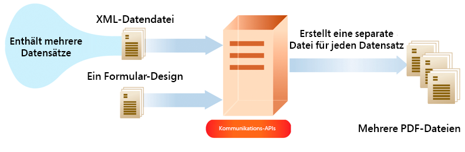

# as a Cloud Service Kommunikation mit AEM Forms verwenden {#frequently-asked-questions}

**APIs zur Dokumentbearbeitung befinden sich in der Vorabversion und können vor der eigentlichen Veröffentlichung geändert werden.**

Mithilfe der Kommunikationsfunktionen können Sie markengenehmigte, personalisierte und standardisierte Dokumente erstellen, z. B. Geschäftskorrespondenzen, Anweisungen, Anforderungsverarbeitungsbriefe, Leistungsbenachrichtigungen, monatliche Rechnungen oder Willkommenskits.

Die Funktion stellt APIs zum Generieren und Bearbeiten der Dokumente bereit. Sie können ein Dokument bei Bedarf generieren oder bearbeiten oder einen Batch-Auftrag erstellen, um in definierten Intervallen mehrere Dokumente zu generieren. Kommunikations-APIs bieten:

* Optimierte Funktionen zur Erstellung von On-Demand- und Batch-Dokumentationen.

* Möglichkeit, PDF-Dokumente bei Bedarf zu kombinieren, neu anzuordnen und zu validieren.

* HTTP-APIs zur einfacheren Integration in externe Systeme. Separate APIs für On-Demand-Vorgänge (niedrige Latenz) und Batch-Vorgänge (Hochdurchsatz-Vorgänge) sind enthalten.

* Sicherer Datenzugriff. Kommunikations-APIs stellen eine Verbindung zu Daten her und greifen nur auf Daten von kundenspezifischen Datenspeichern zu, wodurch die Kommunikation sehr sicher ist.

Ein Kreditkartenauszug kann mit Kommunikations-APIs erstellt werden. In diesem Beispielauszug wird dieselbe Vorlage verwendet, aber je nach Verwendung der Kreditkarte werden für jeden Kunden separate Daten verwendet.

## Dokumentengenerierung

Mithilfe von APIs zur Dokumenterstellung können Sie eine Vorlage (XFA oder PDF) mit Kundendaten kombinieren ([XML-Daten](#form-data)), um Dokumente in PDF- und Druckformaten wie PS, PCL, DPL, IPL und ZPL zu generieren. Diese APIs nutzen [PDF- und XFA-Vorlagen](#supported-document-types) mit [XML-Daten](communications-known-issues-limitations.md#form-data) , um ein einzelnes Dokument bei Bedarf oder mehrere Dokumente mit einem Batch-Auftrag zu generieren.

Normalerweise erstellen Sie eine Vorlage mit [Designer](use-forms-designer.md) und verwenden Kommunikations-APIs, um Daten mit der Vorlage zusammenzuführen. Ihr Programm kann das Ausgabedokument zur Archivierung an einen Netzwerkdrucker, einen lokalen Drucker oder an ein Speichersystem senden. Typische vorkonfigurierte und benutzerdefinierte Workflows sehen wie folgt aus:

Je nach Anwendungsfall können Sie diese Dokumente auch über Ihre Website oder einen Speicher-Server zum Download bereitstellen.

Beispiele für APIs zur Dokumenterstellung:

### Erstellen von PDF-Dokumenten {#create-pdf-documents}

Sie können die APIs zur Dokumenterstellung verwenden, um ein PDF-Dokument zu erstellen, das auf einem Formularentwurf und XML-Formulardaten basiert. Die Ausgabe ist ein nicht interaktives PDF-Dokument. Das heißt, Benutzer können die Formulardaten nicht eingeben oder ändern. Ein einfacher Workflow besteht darin, XML-Formulardaten mit einem Formular-Design zusammenzuführen, um ein PDF-Dokument zu erstellen. Die folgende Abbildung zeigt die Zusammenführung von Formularentwürfen und XML-Formulardaten zur Erstellung eines PDF-Dokuments.

Abbildung: Typischer Workflow zum Erstellen eines PDF-Dokuments

### Erstellen des Dokuments im Format PostScript (PS), Printer Command Language (PCL), Zebra Printing Language (ZPL) {#create-PS-PCL-ZPL-documents}

Sie können APIs zur Dokumenterstellung verwenden, um PostScript (PS)-, Printer Command Language (PCL)- und Zebra Printing Language (ZPL)-Dokumente zu erstellen, die auf einem XDP-Formularentwurf oder einem PDF-Dokument basieren. Diese APIs helfen beim Zusammenführen eines Formularentwurfs mit Formulardaten, um ein Dokument zu generieren. Sie können das Dokument in einer Datei speichern und einen benutzerdefinierten Prozess entwickeln, um es an einen Drucker zu senden.

<!-- ### Processing batch data to create multiple documents

Communications APIs can create separate documents for each record within an XML batch data source. The APIs can also create a single document that contains all records (this functionality is the default). Assume that an XML data source contains ten records and you instruct the APIs to create a separate document for each record (for example, PDF documents). As a result, the APIs generate ten PDF documents.

The following illustration also shows Communications APIs processing an XML data file that contains multiple records. However, assume that you instruct the APIs to create a single PDF document that contains all data records. In this situation, the APIs generate one document that contains all of the records.

The following illustration shows Communications APIs processing an XML data file that con tains multiple records. Assume that you instruct the Communications APIs to create a separate PDF document for each data record. In this situation, the APIs generates a separate PDF document for each data record.

 -->

### Verarbeitung von Batch-Daten zum Erstellen mehrerer Dokumente {#processing-batch-data-to-create-multiple-documents}

Sie können Document Generation-APIs verwenden, um separate Dokumente für jeden Datensatz in einer XML-Batch-Datenquelle zu erstellen. Sie können Dokumente im Bulk-Modus und im asynchronen Modus erstellen. Sie können verschiedene Parameter für die Konvertierung konfigurieren und dann den Batch-Prozess starten.

<!-- You can can also create a single document that contains all records (this functionality is the default).  Assume that an XML data source contains ten records and you have a requirement to create a separate document for each record (for example, PDF documents). You can use the Communication APIs to generate ten PDF documents. -->

<!-- The following illustration shows the Communication APIs processing an XML data file that contains multiple records. However, assume that you instruct the Communication APIs to create a single PDF document that contains all data records. In this situation, the Communication APIs generate one document that contains all of the records.

The following illustration shows the Communication APIs processing an XML data file that contains multiple records. Assume that you instruct the Communication APIs to create a separate PDF document for each data record. In this situation, the Communication APIs generates a separate PDF document for each data record.

For detailed information on using Batch APIs, see Communication APIs: Processing batch data to create multiple documents. 

### Flatten interactive PDF documents {#flatten-interactive-pdf-documents}

You can use document generation APIs to transform an interactive PDF document (for example, a form) to a non-interactive PDF document. An interactive PDF document lets users enter or modify data located in the PDF document fields. The process of transforming an interactive PDF document to a non-interactive PDF document is called flattening. When a PDF document is flattened, a user cannot modify the data located in the document’s fields. One reason to flatten a PDF document is to ensure that data cannot be modified.

You can flatten the following types of PDF documents:

* Interactive PDF documents created in Designer (that contain XFA streams).

* Acrobat PDF forms

If you attempt to flatten a non-interactive PDF document, an exception occurs.

### Retain Form State {#retain-form-state}

An interactive PDF document contains various elements that constitute a form. These elements may include fields (to accept or display data), buttons (to trigger events), and scripts (commands to perform a specific action). Clicking a button may trigger an event that changes the state of a field. For example, choosing a gender option may change the color of a field or the appearance of the form. This is an example of a manual event causing the form state to change.

When such an interactive PDF document is flattened using the Communications APIs, the state of the form is not retained. To ensure that the state of the form is retained even after the form is flattened, set the Boolean value _retainFormState_ to True to save and retain the state of the form. -->

## (Vorabversion) Dokumentbearbeitung

Mithilfe von APIs zur Dokumentbearbeitung können Sie PDF-Dokumente kombinieren, neu anordnen und validieren. In der Regel erstellen Sie ein DDX und senden es an Dokumentbearbeitungs-APIs, um ein Dokument zusammenzustellen oder neu anzuordnen. Das DDX-Dokument enthält Anweisungen zur Verwendung der Quelldokumente zum Erstellen eines Satzes erforderlicher Dokumente. Die DDX-Referenzdokumentation enthält detaillierte Informationen zu allen unterstützten Vorgängen. Beispiele für die Bearbeitung von Dokumenten:

### Zusammenführen von PDF-Dokumenten

Sie können die APIs für die Dokumentmanualisierung verwenden, um zwei oder mehr PDF- oder XDP-Dokumente in einem PDF-Dokument oder PDF-Portfolio zusammenzuführen. Im Folgenden finden Sie einige Möglichkeiten, wie Sie PDF-Dokumente zusammenführen können:

* Assemblieren eines einzelnen PDF-Dokuments
* Erstellen eines PDF-Portfolios
* Zusammenführen von verschlüsselten Dokumenten
* Zusammenführen von Dokumenten mithilfe der Bates-Nummerierung
* Reduzieren und Zusammenführen von Dokumenten

Abbildung: Assemblieren eines einfachen PDF-Dokuments aus mehreren PDF-Dokumenten

### Aufteilen von PDF-Dokumenten

Sie können die APIs für die Dokumentmanualisierung verwenden, um ein PDF-Dokument zu zerlegen. Die APIs können Seiten aus dem Quelldokument extrahieren oder ein Quelldokument basierend auf Lesezeichen teilen. Diese Aufgabe ist normalerweise hilfreich, wenn das PDF-Dokument ursprünglich aus vielen Einzeldokumenten erstellt wurde, wie z. B. einer Sammlung von Aussagen.

* Extrahieren von Seiten aus einem Quelldokument
* Aufteilen eines Quelldokuments basierend auf Lesezeichen

Abbildung: Aufteilen eines Quelldokuments basierend auf Lesezeichen in mehrere Dokumente

### Konvertieren in PDF/A-konforme Dokumente und Validieren

Sie können die APIs für die Dokumentmanualisierung verwenden, um ein PDF-Dokument in ein PDF/A-konformes Dokument zu konvertieren und zu ermitteln, ob ein PDF-Dokument PDF/A-konform ist. PDF/A ist ein Archivierungsformat für die langfristige Speicherung von Dokumentinhalten.  Die Schriftarten werden im Dokument eingebettet und die Datei bleibt unkomprimiert. PDF/A-Dokumente sind daher in der Regel größer als normale PDF-Dokumente. Außerdem enthalten PDF/A-Dokumente keine Audio- und Videoinhalte.

>[!NOTE]
>
> Um Dokumentbearbeitungs-APIs zu aktivieren und zu konfigurieren, fügen Sie die folgende Regel zu [Dispatcher-Konfiguration](setup-local-development-environment.md#forms-specific-rules-to-dispatcher):
>
> `# Allow Forms Doc Generation requests`
> `/0062 { /type "allow" /method "POST" /url "/adobe/forms/assembler/*" }`

## Typen von Kommunikations-APIs

Kommunicationen bieten HTTP-APIs für die On-Demand- und Batch-Dokumentgenerierung:

* **[Synchrone APIs](https://www.adobe.io/experience-manager-forms-cloud-service-developer-reference/)** eignen sich für die Dokumenterstellung auf Anfrage, mit geringer Latenz und mit einzelnen Datensätzen. Diese APIs eignen sich besser für Anwendungen auf Basis einer Benutzeraktion. Zum Beispiel das Generieren eines Dokuments, nachdem ein Benutzer ein Formular ausgefüllt hat.

* **[Batch-APIs (asynchrone APIs)](https://www.adobe.io/experience-manager-forms-cloud-service-developer-reference/)** eignen sich für Anwendungsfälle für die geplante Erstellung mehrerer Dokumente mit hohem Durchsatz. Diese APIs generieren Dokumente in Stapeln. Beispielsweise werden damit monatliche Telefonrechnungen, Kreditkartenauszüge und Leistungsmitteilungen generiert.

## Einstieg 

Die Kommunikationsfunktion ist als eigenständiges Zusatzmodul für as a Cloud Service Forms-Benutzer verfügbar. Sie können sich an das Adobe-Vertriebs-Team oder Ihren Adobe-Support-Mitarbeiter wenden, um Zugriff anzufordern. Adobe ermöglicht den Zugriff für Ihre Organisation und stellt der in Ihrer Organisation als Administrator genannten Person die erforderlichen Berechtigungen zur Verfügung. Der Administrator kann den as a Cloud Service Entwicklern (Benutzern) Ihrer Forms-Organisation Zugriff auf die APIs gewähren.

Nach dem Onboarding, um Kommunikationsfunktionen für Ihre as a Cloud Service Forms-Umgebung zu aktivieren:

1. Melden Sie sich bei Cloud Manager an und öffnen Sie Ihre as a Cloud Service AEM Forms-Instanz.

1. Wählen Sie die Option „Programm bearbeiten“, gehen Sie zur Registerkarte „Lösungen und Add-ons“ und wählen Sie **[!UICONTROL Forms - Communications]**.

   

   Wenn Sie die Funktion **[!UICONTROL Forms - Digitale Registrierung]** und wählen Sie anschließend die **[!UICONTROL Forms - Communications-Add-on]** -Option.

   

1. Klicken Sie auf **[!UICONTROL Aktualisieren]**.

1. Führen Sie die Build-Pipeline aus. Nachdem die Build-Pipeline erfolgreich war, werden Kommunikations-APIs für Ihre Umgebung aktiviert.

<!--

Communication help you combine a template and XML data to generate print documents in various formats. The service allows you to generate documents in synchronous and batch modes. The APIs enables you to create applications that let you:

  * Generate documents by populating template files (PDF and XDP) with XML data.
  * Generate output forms in various formats, including non-interactive PDF print streams.

Consider a scenario where you have one or more templates and multiple records of XML data for each template. You can use Communications APIs to generate a print document for each record.  You can also combine the records into a single document.  The result is a non-interactive PDF document. A non-interactive PDF document does not let users enter data into its fields.

 There are two main Communications APIs. The _generatePDFOutput_ generates PDFs, while the _generatePrintedOutput_ generates PostScript, ZPL, and PCL formats. These APIs are available as REST endpoints on your environment, both on author and publish instances. Since the publish instances are configured to scale faster than the author instances, it is recommended use these APIs via publish instances.

The first parameter of both the operations accept the path and name of the template file (for example ExpenseClaim.xdp). You can specify a fully qualified path, reference path of your AEM Repository, or path of a binary file. The second parameter accepts an XML document that is merged with the template while generating the output document.  

The [API reference documentation](https://documentcloud.adobe.com/link/track?uri=urn:aaid:scds:US:b1223732-ae0f-4921-bdc0-c31e48b56044) provides detailed information about all the parameters, authentication methods, and various services provided by APIs. The API reference documentation is also available in the .yaml format. You can download the .yaml for [Batch APIs](assets/batch-api.yaml) or [non-Batch API.yaml](assets/non-batch-api.yaml) file and upload it to postman to check functionality of APIs.

>[!VIDEO](https://video.tv.adobe.com/v/335771)

Uploading Communication APIs .yaml file to postman to check functionality of APIs.

## Using the Communications APIs {#workflows}

Typically, you create a template using [Designer](use-forms-designer.md) and use communications APIs ( generatePDFOutput and generatePrintedOutput) to:

* Convert these templates to various formats, including PDF, PostScript, ZPL, and PCL.
* Merge XML form data with a form design to generate a document.
* Generate a document without merging XML form data into the document. However, the primary workflow is merging data into the document.

Then, the output document is stored to a file. You can design custom workflows to send the file to a network printer, a local printer, or to a storage system for archival. A typical out of the box and custom workflows look like the following:

### Create PDF documents {#create-pdf-documents}

You can use the _generatePDFOutput_ API to create PDF document that is based on a form design and XML form data. The output is a non-interactive PDF document. That is, users cannot enter or modify form data. A basic workflow is to merge XML form data with a form design to create a PDF document. The following illustration shows the merging of a form design and XML form data to produce a PDF document.

### Create PostScript (PS), Printer Command Language (PCL), Zebra Printing Language (ZPL) document {#create-PS-PCL-ZPL-documents}

You can use Communications APIs to create PostScript (PS), Printer Command Language (PCL), and Zebra Printing Language (ZPL) document that are based on a XDP form design or PDF document. The _generatePrintedOutput_ API merges a form design with form data to generate a document. You can save the document to a file and develop a custom process to send it to a printer.

 ### Processing batch data to create multiple documents

Communications APIs can create separate documents for each record within an XML batch data source. The APIs can also create a single document that contains all records (this functionality is the default). Assume that an XML data source contains ten records and you instruct the APIs to create a separate document for each record (for example, PDF documents). As a result, the APIs generate ten PDF documents.

The following illustration also shows Communications APIs processing an XML data file that contains multiple records. However, assume that you instruct the APIs to create a single PDF document that contains all data records. In this situation, the APIs generate one document that contains all of the records.

The following illustration shows Communications APIs processing an XML data file that contains multiple records. Assume that you instruct the Communications APIs to create a separate PDF document for each data record. In this situation, the APIs generates a separate PDF document for each data record.

### Processing batch data to create multiple documents {#processing-batch-data-to-create-multiple-documents}

You create separate documents for each record within an XML batch data source. You can can also create a single document that contains all records (this functionality is the default). Assume that an XML data source contains ten records and you have a requirement to create a separate document for each record (for example, PDF documents). You can use the Communication APIs to generate ten PDF documents.

The following illustration shows the Communication APIs processing an XML data file that contains multiple records. However, assume that you instruct the Communication APIs to create a single PDF document that contains all data records. In this situation, the Communication APIs generate one document that contains all of the records.

The following illustration shows the Communication APIs processing an XML data file that contains multiple records. Assume that you instruct the Communication APIs to create a separate PDF document for each data record. In this situation, the Communication APIs generates a separate PDF document for each data record.

For detailed information on using Batch APIs, see Communication APIs: Processing batch data to create multiple documents.

### Flatten interactive PDF documents {#flatten-interactive-pdf-documents}

You can use the Communications APIs to transform an interactive PDF document (for example, a form) to a non-interactive PDF document. An interactive PDF document lets users enter or modify data located in the PDF document fields. The process of transforming an interactive PDF document to a non-interactive PDF document is called flattening. When a PDF document is flattened, a user cannot modify the data located in the document’s fields. One reason to flatten a PDF document is to ensure that data cannot be modified.

You can flatten the following types of PDF documents:

* Interactive PDF documents created in Designer (that contain XFA streams).

* Acrobat PDF forms

If you attempt to flatten a non-interactive PDF document, an exception occurs.

### Retain Form State {#retain-form-state}

An interactive PDF document contains various elements that constitute a form. These elements may include fields (to accept or display data), buttons (to trigger events), and scripts (commands to perform a specific action). Clicking a button may trigger an event that changes the state of a field. For example, choosing a gender option may change the color of a field or the appearance of the form. This is an example of a manual event causing the form state to change.

When such an interactive PDF document is flattened using the Communications APIs, the state of the form is not retained. To ensure that the state of the form is retained even after the form is flattened, set the Boolean value _retainFormState_ to True to save and retain the state of the form.  -->
