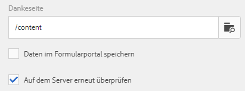

# Von adaptiven Formularen unterstützte Übermittlungsaktionen

Adaptive Formulare bieten Ihnen die Möglichkeit, interaktive, responsive und dynamische adaptive Formulare zu erstellen. Sie bieten eine intuitive Benutzeroberfläche und eine Vielzahl vorkonfigurierter Komponenten zur effizienten Erstellung und Verwaltung von Formularen. Sie können verschiedene Übermittlungsaktionen konfigurieren, um Formulardaten an Services wie OneDrive, SharePoint, Workfront Fusion und mehr zu senden.

Eine Übermittlungsaktion wird ausgelöst, wenn Benutzende in einem adaptiven Formular auf die Schaltfläche **[!UICONTROL Senden]** klicken. Forms as a Cloud Service stellt mehrere vorkonfigurierte Übermittlungsaktionen bereit. Diese integrierten Übermittlungsaktionen ermöglichen Ihnen Folgendes:

* Müheloses Senden von Formulardaten per E-Mail.
* Starten von Microsoft® Power Automate-Abläufen oder AEM-Workflows beim Senden der Daten.
* Sie können die Formulardaten direkt an Microsoft® SharePoint Server, Microsoft® Azure Blob Storage oder Microsoft® OneDrive übertragen.
* Nahtloses Senden von Daten an eine konfigurierte Datenquelle mit dem Formulardatenmodell (FDM).
* Bequemes Senden von Daten an einen REST-Endpunkt.

## Von adaptiven Formularen unterstützte Übermittlungsaktionen

AEM Forms bietet die folgenden vorkonfigurierten Übermittlungsaktionen:

* [E-Mail senden](/help/forms/configure-submit-action-send-email.md)
* [Power Automate-Fluss aufrufen](/help/forms/forms-microsoft-power-automate-integration.md)
* [An SharePoint senden](/help/forms/configure-submit-action-sharepoint.md)
* [Workfront Fusion aufrufen](/help/forms/submit-adaptive-form-to-workfront-fusion.md)
* [Senden mit Formulardatenmodell (FDM)](/help/forms/using-form-data-model.md)
* [An Azure Blob Storage senden](/help/forms/configure-submit-action-azure-blob-storage.md)
* [An REST-Endpunkt senden](/help/forms/configure-submit-action-restpoint.md)
* [An OneDrive senden](/help/forms/configure-submit-action-onedrive.md)
* [Aufrufen eines AEM-Workflows](/help/forms/configure-submit-action-workflow.md)
* [An Marketo Engage senden](/help/forms/submit-adaptive-form-to-marketo-engage.md)
* [An Adobe Experience Platform (AEP) senden](/help/forms/aem-forms-aep-connector.md)
* [An Tabelle senden](/help/forms/forms-submission-service.md)

Sie können ein adaptives Formular auch an andere Speicherkonfigurationen senden:

* [Verbinden eines adaptiven Formulars mit einer Salesforce-Anwendung](/help/forms/aem-forms-salesforce-integration.md)
* [Verbinden eines adaptiven Formulars mit Microsoft](/help/forms/ms-dynamics-odata-configuration.md)

## Unterstützung von Übermittlungsaktionen für verschiedene Authoring-Typen

Die nachstehende Tabelle zeigt, welche Übermittlungsaktionen je nach der in AEM Forms verwendeten Formularerstellungsmethode unterstützt werden:

| Sende-Aktion | [Foundation-Komponenten](/help/forms/configuring-submit-actions.md) | [Kernkomponenten](/help/forms/configure-submit-actions-core-components.md) | [Universeller Editor](/help/forms/configure-submit-action-eds-forms.md#submit-actions-supported-by-adaptive-forms-created-in-universal-editor) | [Dokumentenbasierte Formulare](/help/forms/configure-submit-action-eds-forms.md#supported-submit-actions-for-document-based-forms) |
|----------------------------|------------------------|------------------|------------------|------------------------|
| E-Mail senden | ✅ Unterstützt | ✅ Unterstützt | ✅ Unterstützt |                        |
| Power Automate-Fluss | ✅ Unterstützt | ✅ Unterstützt | ✅ Unterstützt |                        |
| An SharePoint senden | ✅ Unterstützt | ✅ Unterstützt | ✅ Unterstützt |                        |
| Workfront Fusion | ✅ Unterstützt | ✅ Unterstützt | ✅ Unterstützt |                        |
| Mit benutzerdefiniertem FDM senden | ✅ Unterstützt | ✅ Unterstützt | ✅ Unterstützt |                        |
| An AEP senden | ✅ Unterstützt | ✅ Unterstützt | ✅ Unterstützt |                        |
| Azure Blob Storage | ✅ Unterstützt | ✅ Unterstützt | ✅ Unterstützt |                        |
| An REST-Endpunkt senden | ✅ Unterstützt | ✅ Unterstützt | ✅ Unterstützt |                        |
| An Marketo Engage senden | ✅ Unterstützt | ✅ Unterstützt | ✅ Unterstützt |                        |
| An OneDrive senden | ✅ Unterstützt | ✅ Unterstützt | ✅ Unterstützt |                        |
| AEM-Workflow aufrufen | ✅ Unterstützt | ✅ Unterstützt | ✅ Unterstützt |                        |
| An Tabelle senden |                        |                  | ✅ Unterstützt | ✅ Unterstützt |

## Server-seitige Überprüfung im adaptiven Formular

Normalerweise platzieren Entwickler in jedem Online-Datenerfassungssystem einige Javascript-Validierungen auf Client-Seite, um Geschäftsregeln durchzusetzen. Moderne Browser bieten Endbenutzern jedoch Möglichkeiten, diese Validierungen zu umgehen und Übermittlungen mithilfe verschiedener Techniken wie beispielsweise die Web Browser DevTools-Konsole manuell durchzuführen. Diese Techniken sind auch für adaptive Formulare gültig. Entwicklerinnen und Entwickler von Formularen können verschiedene Validierungslogiken erstellen, aber aus technischer Sicht können Endbenutzerinnen und -benutzer diese Validierungslogiken umgehen und ungültige Daten an den Server senden. Ungültige Daten verstoßen gegen die Geschäftsregeln, die eine Formularautorin bzw. ein -autor durchgesetzt hat.

Die Funktion für eine erneute Server-seitige Überprüfung enthält die Möglichkeit, auch Validierungen durchzuführen, die von einem Autor für adaptive Formulare beim Entwerfen eines adaptiven Formulars auf dem Server bereitgestellt wurden. Sie verhindert jede mögliche Beeinträchtigung von Datenübertragungen und Verstöße gegen Geschäftsregeln, die hinsichtlich Formularvalidierungen auftreten können.

### Was soll auf dem Server validiert werden?

Alle standardmäßig einsetzbaren Feldvalidierungen eines adaptiven Formulars, die erneut auf dem Server ausgeführt werden:

* Erforderlich
* Validierungbild-Klausel
* Validierungsausdruck

Verwenden Sie das Kontrollkästchen **[!UICONTROL Auf dem Server erneut überprüfen]** im Container für adaptive Formulare in der Seitenleiste, um die Server-seitige Validierung für das aktuelle Formular zu aktivieren oder zu deaktivieren.

**Aktivieren von Server-seitiger Validierung**

Wenn Endbenutzerinnen oder -benutzer diese Validierungen umgehen und die Formulare senden, führt der Server die Validierung erneut durch. Wenn die Validierung Server-seitig fehlschlägt, wird die Übermittlung gestoppt. Den Benutzenden wird das ursprüngliche Formular erneut präsentiert. Die erfassten Daten und die gesendeten Daten werden dem Benutzer als Fehler angezeigt.

>[!NOTE]
>
>Die Server-seitige Validierung prüft das Formularmodell. Es wird empfohlen, eine separate Client-Bibliothek für Validierungen zu erstellen und sie nicht mit anderen Elementen wie HTML-Stil und DOM-Manipulation in derselben Client-Bibliothek zu mischen.

<!--### Supporting Custom functions in Validation Expressions {#supporting-custom-functions-in-validation-expressions-br}

At times, if there are **complex validation rules**, the exact validation script reside in custom functions and author calls these custom functions from field validation expression. To make this custom function library known and available while performing server-side validations, the form author can configure the name of AEM client library under the **[!UICONTROL Basic]** tab of Adaptive Form Container properties as shown below.

Supporting Custom functions in Validation Expressions

Author can configure customJavaScript library per Adaptive Form. In the library, only keep the reusable functions, which have dependency on jquery and underscore.js third-party libraries.

Refer to the following articles to learn how to create custom functions for:

* [Adaptive Forms based on Foundation Components](/help/forms/rule-editor.md#custom-functions-in-rule-editor)
* [Adaptive Forms based on Core Components](/help/forms/create-and-use-custom-functions.md)
* [Adaptive Forms authored using Document-Based Authoring](/help/edge/docs/forms/rules-forms.md#create-a-custom-function)
* [Adaptive Forms created using the Universal Editor](/help/edge/docs/forms/universal-editor/rule-editor-universal-editor.md#create-a-custom-function)

## Error handling on Submit Action {#error-handling-on-submit-action}

As a part of AEM security and hardening guidelines, configure custom error pages such as 400.jsp, 404.jsp, and 500.jsp. These handlers are called, when on submitting a form 400, 404, or 500 errors appear. The handlers are also called when these error codes are triggered on the Publish node. You can also create JSP pages for other HTTP error codes.

When you prefill a form data model (FDM), or schema based Adaptive Form with XML or JSON data complaint to a schema that is data does not contain `<afData>`, `<afBoundData>`, and `</afUnboundData>` tags, then the data of unbounded fields of the Adaptive Form is lost. The schema can be an XML schema, JSON schema, or a Form Data Model (FDM). Unbounded fields are Adaptive Form fields without the `bindref` property.-->

## Siehe auch

{{af-submit-action}}
