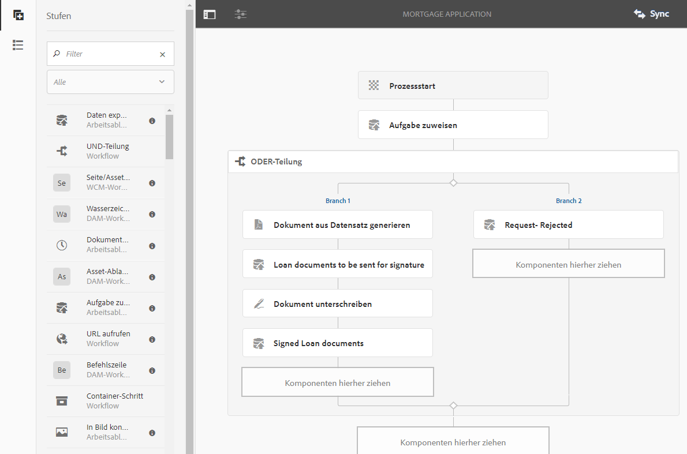

# Formularzentrierte Workflows in OSGi {#forms-centric-workflow-on-osgi}

Unternehmen erfassen Daten aus Hunderten und Tausenden von Formularen, verschiedenen Backend-Systemen sowie Online- oder Offline-Datenquellen. Darüber hinaus verfügen sie über eine dynamische Gruppe von Benutzenden, um Entscheidungen bezüglich der Daten zu treffen, was iterative Prüf- und Genehmigungsprozesse umfasst.

In großen Organisationen und Unternehmen fallen außer Workflows für die Prüfung und Genehmigung auch Aufgaben an, die sich wiederholen. Dazu gehört beispielsweise das Konvertieren von PDF-Dokumenten in andere Formate. Werden diese Aufgaben manuell durchgeführt, nehmen sie viel Zeit und Ressourcen in Anspruch. Unternehmen sind darüber hinaus gesetzlich dazu verpflichtet, Dokumente digital zu signieren und Formulardaten zur späteren Verwendung in vordefinierten Formaten zu archivieren.

## Einführung in den formularzentrierten Workflow in OSGi {#introduction-to-forms-centric-workflow-on-osgi}

Sie können mit AEM-Workflows schnell Workflows erstellen, die auf adaptiven Formularen basieren. Diese Workflows können für Prüfungen und Genehmigungen, Geschäftsprozessabläufe, zum Starten von Dokumentendiensten, zur Integration in Signatur-Workflows mit Adobe Sign und für ähnliche Vorgänge verwendet werden. Dazu gehören beispielsweise die Verarbeitung von Kreditkartenanträgen, Workflows für die Genehmigung von Urlaub für Mitarbeitende oder das Speichern von Formularen als PDF-Dokument. Darüber hinaus können diese Workflows innerhalb einer Organisation oder über eine Netzwerk-Firewall hinweg verwendet werden.

Mit formularzentrierten Workflows in OSGi können Sie schnell Workflows für verschiedene Aufgaben auf dem OSGi-Stapel erstellen und bereitstellen, ohne die komplette Prozessverwaltungsfunktion auf dem JEE-Stapel zu installieren. Bei der Bereitstellung und Verwaltung von Workflows werden die vertrauten AEM-Workflow- und AEM-Posteingangsfunktionen verwendet. Workflows bilden die Grundlage für die Automatisierung realer Geschäftsprozesse, an denen mehrere Softwaresysteme, Netzwerke, Abteilungen und sogar Unternehmen beteiligt sind.

Sobald eingerichtet, können diese Workflows manuell ausgelöst werden, um einen definierten Prozess durchzuführen, oder programmgesteuert ausgeführt werden, wenn Benutzer ein Formular senden <!-- or [correspondence management](cm-overview.md) letter-->. <!-- With this enhanced AEM Workflow capabilities, [!DNL AEM Forms] offers two distinct, yet similar, capabilities. As part of your deployment strategy, you need to decide which one works for you. See a [comparison](capabilities-osgi-jee-workflows.md) of the Forms-centric AEM Workflows on OSGi and Process Management on JEE. Moreover, for the deployment topology see, [Architecture and deployment topologies for [!DNL AEM Forms]]((aem-forms-architecture-deployment.md). -->

Der formularzentrierte Workflow für OSGi erweitert den [AEM-Posteingang](https://experienceleague.adobe.com/docs/experience-manager-cloud-service/sites/authoring/getting-started/inbox.html?lang=de#authoring) und stellt zusätzliche Komponenten (Schritte) für den AEM-Workflow-Editor bereit, um Unterstützung für [!DNL AEM Forms]-zentrierte Workflows hinzuzufügen. <!-- The extended AEM Inbox has functionalities similar to [[!DNL AEM Forms] Workspace](introduction-html-workspace.md). Along with managing human-centric workflows (Approval, Review, and so on), you can use AEM workflows to automate [document services](https://experienceleague.adobe.com/docs/experience-manager-65/developing/extending-aem/extending-workflows/workflows-step-ref.html#extending-aem)-related operations (for example, Generate PDF) and electronically signing (Adobe Sign) documents. -->

Alle [!DNL AEM Forms]-Workflow-Schritte unterstützen die Verwendung von Variablen. Variablen ermöglichen es, dass Workflowschritte zur Laufzeit Metadaten speichern und an andere Schritte übergeben. Sie können verschiedene Typen von Variablen zum Speichern unterschiedlicher Datentypen erstellen. Sie können auch Variablensammlungen erstellen, um mehrere Instanzen verwandter Daten vom selben Typ zu speichern. In der Regel verwenden Sie eine Variable oder eine Sammlung von Variablen, wenn eine Entscheidung basierend auf dem Wert der Variablen getroffen werden soll oder wenn Informationen gespeichert werden sollen, die Sie später in einem Prozess benötigen. Weitere Informationen zur Verwendung von Variablen in diesen formularzentrierten Workflow-Komponenten (Schritten) finden Sie unter [Formularzentrierter Workflow in OSGi – Schritt-Referenz](aem-forms-workflow-step-reference.md). Informationen zum Erstellen und Verwalten von Variablen finden Sie unter [Variablen in AEM-Workflows](variable-in-aem-workflows.md).

Das folgende Diagramm zeigt den kompletten Ablauf zum Erstellen, Ausführen und Überwachen eines formularzentrierten Workflows in OSGi.

## Anwendbarkeit und Anwendungsfälle

### Versicherung

## Unterstützt AEM Forms Workflows für Versicherungsgenehmigungen?

Ja. AEM Forms unterstützt Workflow-basierte Überprüfungen und Genehmigungen und ermöglicht so Prüfer-, Genehmigungs- und Nachbearbeitungsschleifen als Teil von Versicherungsprozessen.

## Unterstützt AEM Forms Maker-Checker-Prozesse für Versicherungen?

Ja. AEM Forms-Workflows können so konfiguriert werden, dass sie Maker-Checker-Muster unterstützen und so eine Trennung der Aufgaben zwischen Dateneingabe und Genehmigungsrollen sicherstellen.

## Kann AEM Forms den Status von Versicherungsansprüchen oder -anträgen verfolgen?

Ja. Mit AEM Forms-Workflows können Versicherer den Status der Formularübermittlung und -verarbeitung über verschiedene Phasen des Geschäftsprozesses hinweg verfolgen.

## Unterstützt AEM Forms Underwriting-Workflows?

Ja, mit Workflows und Integrationen. AEM Forms unterstützt Workflow-gesteuerte Prozesse und Backend-Integrationen, die es Anwendungsdaten ermöglichen, in Underwriting- und Entscheidungssysteme zu fließen.

## Unterstützt AEM Forms Audit-Trails für Versicherungsprozesse?

Ja. AEM Forms unterstützt die Auditierbarkeit durch Workflow-Verlauf, Zugriffskontrollen und Systemprotokolle, die Versicherungen bei der Erfüllung interner und externer Prüfungsanforderungen unterstützen.

## Bevor Sie beginnen {#before-you-start}

* Ein Workflow ist eine Darstellung eines realen Geschäftsprozesses. Halten Sie Ihren realen Geschäftsprozess und eine Liste der Teilnehmerinnen und Teilnehmer des Geschäftsprozesses bereit. Außerdem müssen Sie die zusätzlichen Dokumente (adaptive Formulare, PDF-Dokumente usw.) bereithalten, bevor Sie einen Workflow erstellen.
* Ein Workflow kann mehrere Phasen haben. Diese Phasen werden im AEM-Posteingang angezeigt und helfen, über den Fortschritt des Workflows zu berichten. Teilen Sie Ihren Geschäftsprozess in logische Phasen ein.
* Sie können den Schritt „Aufgabe zuweisen“ von AEM-Workflows so konfigurieren, dass E-Mail-Benachrichtigungen an die Benutzenden oder Bevollmächtigten gesendet werden. Sie sollten daher [E-Mail-Benachrichtigungen aktivieren](#configure-email-service).
* Ein Workflow kann darüber hinaus Adobe Sign für digitale Signaturen nutzen. Wenn Sie beabsichtigen, Adobe Sign in einem Workflow zu verwenden, [konfigurieren Sie Adobe Sign für [!DNL AEM Forms]](adobe-sign-integration-adaptive-forms.md), bevor Sie es im Workflow einsetzen.

## Erstellen eines Workflow-Modells {#create-a-workflow-model}

Ein Workflow-Modell besteht aus der Logik und dem Ablauf eines Geschäftsprozesses.  Es setzt sich aus einer Reihe von Schritten zusammen.  Diese Schritte sind AEM-Komponenten.  Sie können Workflow-Schritte nach Bedarf mit Parametern und Skripten erweitern, um einen größeren Funktionsumfang und mehr Kontrollmöglichkeiten zu erzielen. [!DNL AEM Forms] bietet außer den vordefinierten AEM-Schritten einige weitere Schritte. Eine detaillierte Liste der AEM- und [!DNL AEM Forms]-Schritte finden Sie unter [AEM-Workflows – Schritt-Referenz](https://experienceleague.adobe.com/docs/experience-manager-65/developing/extending-aem/extending-workflows/workflows-step-ref.html?lang=de#extending-aem) und [Formularzentrierte Workflows in OSGi – Schritt-Referenz](aem-forms-workflow.md).

AEM bietet eine intuitive Benutzeroberfläche zum Erstellen eines Workflow-Modells mithilfe der bereitgestellten Workflow-Schritte. Eine schrittweise Anleitung zum Erstellen eines Workflow-Modells finden Sie unter [Erstellen von Workflow-Modellen](https://experienceleague.adobe.com/docs/experience-manager-cloud-service/sites/authoring/workflows/overview.html?lang=de#workflows). Im folgenden Beispiel finden Sie eine schrittweise Anleitung zum Erstellen eines Workflow-Modells für einen Genehmigungs- und Überprüfungs-Workflow: 

>[!NOTE]
>
>Um ein Workflow-Modell zu erstellen oder zu bearbeiten, müssen Sie zur Gruppe workflow-editor gehören.

### Modell für einen Workflow zur Genehmigung und Prüfung erstellen {#create-a-model-for-an-approval-and-review-workflow}

Genehmigungs- und Überprüfungs-Workflow sind für Aufgaben vorgesehen, bei denen Entscheidungen von Personen getroffen werden müssen.  Im folgenden Beispiel wird ein Workflow-Modell für einen Hypothekenantrag erstellt, der von einem oder einer Frontend-Bankmitarbeitenden ausgefüllt werden soll.  Sobald der Antrag ausgefüllt ist, wird er zur Genehmigung übermittelt.  Der genehmigte Antrag wird später zur elektronischen Unterzeichnung mit Adobe Sign an den Antragsteller gesendet.

Das Beispiel ist als Paket verfügbar und ist unten angehängt.  Importieren und installieren Sie das Beispiel mithilfe des Paket-Managers.  Sie können darüber hinaus die folgenden Schritte ausführen, um das Workflow-Modell für den Antrag manuell zu erstellen:

In diesem Beispiel wird ein Workflow-Modell für einen Hypothekenantrag erstellt, der von einem oder einer Frontend-Bankmitarbeitenden ausgefüllt werden soll.  Der ausgefüllte Antrag wird zur Genehmigung übermittelt.  Der genehmigte Antrag wird später zur elektronischen Unterzeichnung mit Adobe Sign an die Kundin bzw. den Kunden gesendet.  Sie können das Beispiel mit dem Paket-Manager importieren und installieren.

[Datei laden](assets/example-mortgage-loan-application.zip)

1. Öffnen Sie die Workflow-Modell-Konsole für Arbeitsablaufmodelle. Die Standardeinstellung ist `https://[server]:[port]/libs/cq/workflow/admin/console/content/models.html/etc/workflow/models`
1. Wählen Sie **Erstellen** und dann **Modell erstellen** aus. Das Dialogfeld „Workflow-Modell hinzufügen“ wird angezeigt.
1. Geben Sie den **Titel** und den **Namen** ein (optional). Beispiel: Hypothekenantrag. Wählen Sie **Fertig**.
1. Wählen Sie das erstellte Workflow-Modell aus und wählen Sie dann **Bearbeiten**. Jetzt können Sie Workflow-Schritte hinzufügen, um Geschäftslogik zu erstellen. Wenn Sie ein Workflow-Modell neu erstellen, enthält es zunächst:

   * Die Schritte Fluss-Start und Fluss-Ende. Diese Schritte geben den Anfang und das Ende des Workflows an.  Diese Schritte sind erforderlich und können nicht bearbeitet oder entfernt werden.
   * Einen Teilnehmer-Beispielschritt mit der Bezeichnung „Schritt 1“. Dieser Schritt ist so konfiguriert, dass er dem Admin-Benutzer ein Arbeitselement zuordnet. Entfernen Sie diesen Schritt.

1. Aktivieren Sie E-Mail-Benachrichtigungen. Sie können einen formularzentrierten Workflow in OSGi so konfigurieren, dass E-Mail-Benachrichtigungen an die Benutzer oder Bevollmächtigten gesendet werden. Führen Sie die folgenden Konfigurationen durch, um E-Mail-Benachrichtigungen zu aktivieren:

   1. Wechseln Sie zum AEM Configuration Manager unter `https://[server]:[port]/system/console/configMgr`.
   1. Öffnen Sie die Konfiguration **[!UICONTROL Day CQ Mail Service]**. Geben Sie einen Wert in die Felder **[!UICONTROL Hostname des SMTP-Servers]**, **[!UICONTROL SMTP-Server-Port]** und **[!UICONTROL Absenderadresse]** ein. Klicken Sie auf **[!UICONTROL Speichern]**.
   1. Öffnen Sie die Konfiguration **[!UICONTROL Day CQ Link Externalizer]**. Geben Sie im Feld **[!UICONTROL Domains]** den tatsächlichen Hostnamen/die IP-Adresse und die Portnummer für lokale, Authoring- und Veröffentlichungsinstanzen an. Klicken Sie auf **[!UICONTROL Speichern]**.

1. Erstellen Sie Workflow-Phasen.  Ein Workflow kann mehrere Phasen haben. Diese Phasen werden im AEM-Posteingang angezeigt und geben den Fortschritt des Workflows an.

   Wählen Sie zum Definieren einer Phase das Symbol  aus, um die Eigenschaften des Workflow-Modells anzuzeigen. Öffnen Sie die Registerkarte **Phasen**, fügen Sie Phasen für das Workflow-Modell hinzu und wählen Sie **Speichern und schließen** aus. Für einen Hypothekenantrag könnten Sie beispielsweise die folgenden Schritte erstellen: Darlehensantrag, Status des Darlehensantrags, zu signierende Dokumente und signiertes Antragsdokument.

1. Ziehen Sie den Workflow **Aufgaben zuweisen** per Drag-and-Drop in das Workflow-Modell. Definieren Sie ihn als ersten Schritt im Modell.

   Die Komponente „Aufgabe zuweisen“ weist die durch den Workflow erstellte Aufgabe einer Benutzerin bzw. einem Benutzer oder einer Gruppe zu. Beim Zuweisen der Aufgabe können Sie die Komponenten verwenden, um ein adaptives Formular oder eine nicht-interaktive PDF-Datei für die Aufgabe anzugeben. Das adaptive Formular ist erforderlich, um Eingaben von Benutzern entgegenzunehmen, und eine nicht interaktive PDF-Datei oder ein schreibgeschütztes adaptives Formular wird in Workflows verwendet, die nur zur Prüfung dienen.

   Sie können mithilfe dieses Schritts auch das Verhalten der Aufgabe steuern. Dazu gehören beispielsweise das automatische Erstellen eines Datensatzdokuments, das Zuweisen der Aufgabe zu einem bestimmten Benutzer oder eine Gruppe, der Pfad der gesendeten Daten, der Pfad der im Voraus auszufüllenden Daten sowie Standardaktionen. Weitere Informationen zu den Optionen des Schritts „Aufgabe zuweisen“ finden Sie unter [Formularzentrierte Workflows in OSGi – Schritt-Referenz](aem-forms-workflow.md).

   

   Für das Beispiel mit dem Hypothekenantrag konfigurieren Sie den Schritt „Aufgabe zuweisen“ so, dass ein schreibgeschütztes adaptives Formular verwendet und das PDF-Dokument angezeigt werden soll, sobald die Aufgabe abgeschlossen ist. Wählen Sie auch die Benutzergruppe aus, die zum Genehmigen des Darlehensantrags berechtigt ist. Deaktivieren Sie auf der Registerkarte **Aktionen** die Option **Senden**. Erstellen Sie eine **actionTaken**-Variable vom Datentyp „String“ (Zeichenfolge) und geben Sie die Variable als **Route-Variable** an. Dies könnte beispielsweise „actionTaken“ sein.  Fügen Sie außerdem die Routen zu Genehmigen und Ablehnen hinzu.  Die Routen werden im AEM-Posteingang als separate Aktionen (Schaltflächen) angezeigt.  Der Workflow wählt die passende Verzweigung für die Aktion (Schaltfläche), auf die jemand klickt.

   Sie können das oben zum Download verfügbare Beispielpaket importieren, um sämtliche Werte aller Felder im Schritt „Aufgabe zuweisen“ zu erhalten, der für das Beispiel des Hypothekenantrags konfiguriert wurde.

1. Ziehen Sie die Komponente „ODER-Teilung“ aus dem Schritt-Browser in das Workflow-Modell.  Die ODER-Teilung erstellt eine Verzweigung im Workflow, nach der nur einer der beiden Zweige aktiv bleibt. Mit diesem Schritt können Sie bedingte Verarbeitungspfade in einem Workflow einrichten. Sie fügen jeder Verzweigung nach Bedarf Workflow-Schritte hinzu.

   Sie können Routing-Ausdrücke für eine Verzweigung mithilfe einer Regeldefinition, eines ECMA-Skripts oder eines externen Skripts definieren.

   Erstellen Sie mit dem Ausdruckseditor Routing-Ausdrücke für Zweig 1 und Zweig 2. Diese Routing-Ausdrücke helfen, je nach der Benutzeraktion im AEM-Posteingang eine Verzweigung auszuwählen.

   **Routing-Ausdruck für Zweig 1**

   Wenn ein Benutzer im AEM-Posteingang auf **Genehmigen** klickt, wird die Verzweigung 1 aktiviert.

   

   **Routing-Ausdruck für Zweig 2**

   Wenn der Benutzer im AEM-Posteingang auf **Ablehnen** klickt, wird die Verzweigung 2 aktiviert.

   

   Informationen über das Erstellen von Routing-Ausdrücken mithilfe von Variablen finden Sie unter [Variablen in [!DNL AEM Forms]  Workflows](variable-in-aem-workflows.md).

1. Fügen Sie weitere Workflow-Schritte hinzu, um die Geschäftslogik zu erstellen.

   Fügen Sie für das Hypothekenbeispiel einen Schritt zum Generieren des Datensatzdokuments, zwei Schritte zum Zuweisen einer Aufgabe und einen Schritt zum Signieren des Dokuments zur Verzweigung 1 des Modells hinzu, wie in der Abbildung unten gezeigt. Ein Schritt „Aufgabe zuweisen“ dient zum Anzeigen und Senden **zu unterzeichnender Darlehensdokumente an den Antragsteller** und der zweite Schritt „Aufgabe zuweisen“ dient zum **Anzeigen der unterzeichneten Dokumente**. Fügen Sie auch zur Verzweigung 2 einen Schritt „Aufgabe zuweisen“ hinzu.  Diese Verzweigung wird aktiviert, wenn ein Benutzer im AEM-Posteingang auf „Ablehnen“ klickt.

   Um den vollständigen Satz der Werte aller Felder für die Schritte „Aufgabe zuweisen“ sowie die Schritte für das Datensatzdokument und zum Unterzeichnen des Dokuments zu erhalten, die für den Beispielhypothekenantrag konfiguriert sind, importieren Sie das Beispielpaket, das am Anfang dieses Abschnitts zum Herunterladen zur Verfügung steht.

   Damit ist das Workflow-Modell einsatzbereit.  Sie können den Workflow über verschiedene Methoden starten.  Weitere Informationen finden Sie unter [Starten eines formularzentrierten Workflows in OSGi](#launch).

   

## Erstellen eines formularzentrierten Workflow-Programms {#create-a-forms-centric-workflow-application}

Die Anwendung ist das mit dem Workflow verknüpfte adaptive Formular. Wenn eine Anwendung über den Posteingang gesendet wird, wird der zugehörige Workflow gestartet. Um einen Forms-Workflow als Anwendung im AEM-Posteingang und in der [!DNL AEM Forms]-Mobile-App verfügbar zu machen, erstellen Sie wie folgt eine Workflow-Anwendung:

>[!NOTE]
>
>Sie müssen Mitglied der Gruppe fd-administrator sein, um Workflow-Anwendungen erstellen und verwalten zu können.

1. Wechseln Sie in Ihrer AEM-Autoreninstanz zu  > **[!UICONTROL Formulare]** > **[!UICONTROL Workflow-Anwendung verwalten]** und tippen Sie auf **[!UICONTROL Erstellen]**.
1. Geben Sie im Fenster „Workflow-Anwendung erstellen“ die entsprechenden Werte für die folgenden Felder ein und tippen Sie auf **Erstellen**. Eine neue Anwendung wird erstellt und im Bildschirm „Workflow-Anwendungen“ aufgeführt.

<table>
 <tbody>
  <tr>
   <td>Feld</td>
   <td>Beschreibung</td>
  </tr>
  <tr>
   <td>Titel</td>
   <td>Der Titel ist im AEM-Posteingang sichtbar und hilft Benutzenden bei der Auswahl einer Anwendung. Achten Sie darauf, einen beschreibenden Titel anzugeben. Beispiel: Antrag auf Eröffnung eines Sparkontos.  </td>
  </tr>
  <tr>
   <td>Name </td>
   <td>Geben Sie den Namen der Anwendung an. Zeichen, die keine Buchstaben, Ziffern, Bindestriche oder Unterstriche sind, werden durch Bindestriche ersetzt. </td>
  </tr>
  <tr>
   <td>Beschreibung</td>
   <td>Die Beschreibung ist im AEM-Posteingang sichtbar. Geben Sie ausführliche Informationen zur Anwendung in den Beschreibungsfeldern an, z. B. den Zweck der Anwendung.  </td>
  </tr>
  <tr>
   <td>Adaptives Formular</td>
   <td>
Geben Sie den Pfad eines adaptiven Formulars an. Wenn ein Benutzer eine Anwendung startet, wird das angegebene adaptive Formular angezeigt.
 
<strong>Hinweis:</strong> Workflow-Anwendungen unterstützen keine Formulare und PDF-Dokumente, die länger als eine Seite sind oder auf dem Apple iPad einen Bildlauf erfordern. Wenn eine Anwendung auf dem Apple iPad geöffnet wird und das adaptive Formular oder das PDF-Dokument länger als eine Seite ist, gehen die Formularfelder und der Inhalt auf der zweiten Seite verloren.
 </td>
  </tr>
  <tr>
   <td>Zugriffsgruppe</td>
   <td>
Wählen Sie eine Gruppe aus. Die Anwendung wird nur für die Mitglieder der ausgewählten Gruppe in AEM-Posteingang angezeigt. Die Option „Zugriffsgruppe“ stellt alle Gruppen der Gruppe [!DNL workflow-users] zur Auswahl bereit. 
   </td>
  </tr>
  <tr>
   <td>Vorbefüllungs-Service</td>
   <td>Wählen Sie einen <a href="prepopulate-adaptive-form-fields.md#aem-forms-custom-prefill-service" target="_blank">Vorbefüllungs-Service</a> für das adaptive Formular aus.  </td>
  </tr>
  <tr>
   <td>Workflow-Modell</td>
   <td>Wählen Sie ein <a href="aem-forms-workflow.md#create-a-workflow-model">Workflow-Modell</a> für die Anwendung aus. Ein Workflow-Modell besteht aus einer Logik und einem Ablauf des Geschäftsprozesses. </td>
  </tr>
  <tr>
   <td>Datendateipfad</td>
   <td>Geben Sie den Pfad der Datendatei im CRX-Repository an. Der Pfad wird relativ zur Payload des adaptiven Formulars angegeben und enthält den Namen der Datendatei. Geben Sie immer den vollständigen Namen der Datei einschließlich der Dateierweiterung (wo zutreffend) an. Beispiel: [Payload]/data.xml. </td>
  </tr>
  <tr>
   <td>Anhangspfad</td>
   <td>Geben Sie den Pfad des Ordners für Anhänge im CRX-Repository an. Der Pfad für Anhänge wird relativ zum Payload-Speicherort angegeben. Beispiel: [Payload]/data.xml. </td>
  </tr>
  <tr>
   <td>Pfad für das Datensatzdokument</td>
   <td>Geben Sie den Pfad der Datei für das Datensatzdokument im CRX-Repository an. Der Pfad wird relativ zum Speicherort der Payload für das adaptive Formular angegeben. Geben Sie immer den vollständigen Namen der Datei einschließlich der Dateierweiterung (wo zutreffend) an. Beispiel: [Payload]/DOR/creditcard.pdf.</td>
  </tr>
 </tbody>
</table>

## Starten eines formularzentrierten Workflows in OSGi {#launch}

Sie können einen formularzentrierten Workflow wie folgt starten oder auslösen:

* [Senden eines Antrags aus dem AEM-Posteingang](#inbox)
* [Senden eines Antrags aus der  [!DNL AEM Forms] -Mobile-App](#afa)

* [Senden eines adaptiven Formulars](#af)
* [Verwenden eines überwachten Ordners](#watched)

* [Senden einer interaktiven Kommunikation oder eines Briefes](#letter)

### Senden eines Antrags aus dem AEM-Posteingang {#inbox}

Die von Ihnen erstellte Workflow-Anwendung ist als Antrag im Posteingang verfügbar. Benutzende, die Mitglieder der Gruppe [!DNL workflow-users] sind, können den Antrag ausfüllen und absenden, der den zugehörigen Workflow auslöst.

<!-- ### Submitting an application from [!DNL AEM Forms] App {#afa}

The [!DNL AEM Forms] app syncs with an [!DNL AEM Forms] server and lets you change the form data, tasks, workflow applications, and saved information (drafts/templates) in your account. For more information, see [[!DNL AEM Forms] app]((aem-forms-app.md) and related articles.-->

### Senden eines adaptiven Formulars {#af}

Sie können die Übermittlungsaktionen eines adaptiven Formulars so konfigurieren, dass beim Senden des adaptiven Formulars ein Workflow gestartet wird. Adaptive Formulare stellen die Übermittlungsaktion **AEM-Workflow aufrufen** zur Verfügung, die bewirkt, dass beim Senden eines adaptiven Formulars ein Workflow gestartet wird. Ausführliche Informationen über die Übermittlungsaktion finden Sie unter [Konfigurieren der Übermittlungsaktion](configuring-submit-actions.md). Um ein adaptives Formular über die [!DNL AEM Forms]-Mobile-App zu senden, aktivieren Sie in den Eigenschaften des adaptiven Formulars die Option „Mit [!DNL AEM Forms]-App synchronisieren“.

<!-- You can configure an Adaptive Form to sync, submit, and trigger a workflow from [!DNL AEM Forms] app. For details, see [working with a form]((working-with-form.md). -->

<!-- ### Using a watched folder {#watched}

An administrator (a member of fd-administrators group) can configure a network folder to run a pre-configured workflow when a user places a file (such as a PDF file) in the folder. After the workflow completes, it can save the result file to a specified output folder. Such a folder is known as [Watched Folder](watched-folder-in-aem-forms.md). Perform the following procedure to configure a watched folder to launch a workflow:

1. On your AEM author instance, go to  > **[!UICONTROL Forms]** > **[!UICONTROL Configure Watched Folder]**. A list of already configured watched folders is displayed.
1. Select **[!UICONTROL New]**. A list of fields is displayed. Specify a value for the following fields to configure a Watched Folder for a workflow:

<table>
 <tbody>
  <tr>
   <td>Field</td>
   <td>Description</td>
  </tr>
  <tr>
   <td>Name</code></td>
   <td>Specify the name of the Watched Folder. This field support only alphanumeric.</td>
  </tr>
  <tr>
   <td>Path</code></td>
   <td>Specify the physical location of the Watched Folder. In a clustered environment, use a shared network folder that is accessible from AEM cluster node.</td>
  </tr>
  <tr>
   <td>Process Files Using</code></td>
   <td>Select the Workflow </code>option. </td>
  </tr>
  <tr>
   <td>Workflow Model</code></td>
   <td>Select a workflow model.  </td>
  </tr>
  <tr>
   <td>Output File Pattern</code></td>
   <td>Specify the directory structure for output files and directories. </a>.</td>
  </tr>
 </tbody>
</table>

1. Select **Advanced**. Specify a value for the following field and taps **Create**. The Watched Folder is configured to launch a workflow. Now, whenever a file is placed in the input directory of the Watched Folder, the specified workflow is triggered.

   | Field |Description |
   |---|---|
   | Payload Mapper Filter |When you create a watched folder, it creates a folder structure in the crx-repository. The folder structure can serve as a payload to the workflow. You can write a script to map an AEM Workflow to accept inputs from the watched folder structure. An out of the box implementation is available and listed in the Payload Mapper Filter. If you do not have a custom implementation, select the default implementation. |

   The Advanced tab contains more fields. Most of these fields contain a default value. To learn about all the fields, see the [Create or Configure a watched folder]((admin-help/configuring-watched-folder-endpoints.md) article. -->

<!-- ### Submitting an interactive communication or a letter {#letter}

You can associate and execute a Forms-centric workflow on OSGi on submission of an interactive communication or a letter. In correspondence management workflows are used for post processing interactive communications and letters. For example, emailing, printing, faxing, or archiving final letters. For detailed steps, see [Post processing of interactive communications and letters](submit-letter-topostprocess.md).

## Additional Configurations {#additional-configurations}

### Configure email service {#configure-email-service}

You can use the Assign Task and Send Email steps of AEM Workflows to send an email. Perform the following steps to specify email servers and other configurations required to send email:

1. Go to AEM configuration manager at `https://[server]:[port]/system/console/configMgr`.
1. Open the **[!UICONTROL Day CQ Mail Service]** configuration. Specify a value for the **[!UICONTROL SMTP server host name]**, **[!UICONTROL SMTP server port]**, and **[!UICONTROL "From" address]** fields. Click **[!UICONTROL Save]**.
1. Open the **[!UICONTROL Day CQ Link Externalizer]** configuration. In the **[!UICONTROL Domains]** field, specify the actual hostname/IP address and port number for local, author, and publish instances. Click **[!UICONTROL Save]**. -->

### Bereinigen von Workflow-Instanzen {#purge-workflow-instances}

Die Minimierung der Anzahl von Workflow-Instanzen steigert die Leistung der Workflow-Engine, sodass Sie regelmäßig abgeschlossene oder laufende Workflow-Instanzen aus dem Repository löschen können. Ausführliche Informationen dazu finden Sie unter [Regelmäßiges Bereinigen von Workflow-Instanzen](https://experienceleague.adobe.com/docs/experience-manager-cloud-service/operations/maintenance.html?lang=de).
