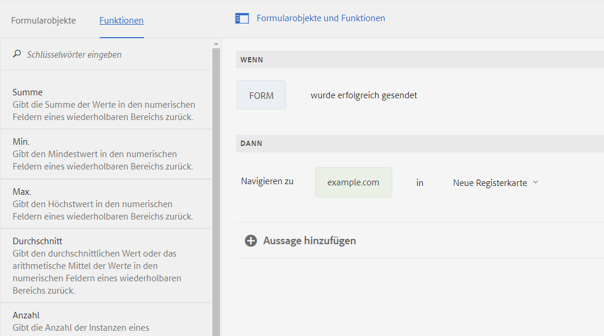

# Asynchrone Übermittlung von adaptiven Formularen {#asynchronous-submission-of-adaptive-forms}

Web-Formulare werden herkömmlicherweise für die synchrone Übermittlung konfiguriert. Wenn Benutzer ein Formular synchron senden, werden sie zu einer Bestätigungsseite, zu einer Dankeseite oder bei fehlgeschlagener Übermittlung zu einer Fehlerseite umgeleitet. Allerdings sind moderne Web-Abläufe wie Einzelseitenanwendungen zunehmend beliebt. Dabei bleibt die Web-Seite unverändert, während die Client-Server-Interaktion im Hintergrund abläuft. Um dieses Erlebnis mit adaptiven Formularen bereitzustellen, können Sie die asynchrone Übermittlung konfigurieren.

Bei der asynchronen Übermittlung fügt der Formularentwickler beim Absenden des Formulars durch den Benutzer ein separates Erlebnis ein, wie etwa die Weiterleitung zu einem anderen Formular oder einem separaten Bereich der Website. Der Autor kann auch separate Services wie das Senden von Daten an einen anderen Speicherort oder das Hinzufügen einer benutzerdefinierten Analytics-Engine einbinden. In diesem Fall verhält sich ein adaptives Formular wie eine Einzelseitenanwendung, da das Formular nicht neu geladen wird und die URL unverändert bleibt, wenn die gesendeten Formulardaten auf dem Server validiert werden.

Im Folgenden finden Sie weiterführende Informationen zur asynchronen Übermittlung bei adaptiven Formularen.

## Asynchrone Übermittlung konfigurieren {#configure}

So konfigurieren Sie die asynchrone Übermittlung für ein adaptives Formular:

1. Wählen Sie im Authoring-Modus des adaptiven Formulars den Formular-Container aus und tippen Sie auf , um dessen Eigenschaften anzuzeigen.
1. Aktivieren Sie im Eigenschaftenbereich **[!UICONTROL Übermittlung]** die Option **[!UICONTROL Asynchrone Übermittlung verwenden]**.
1. Wählen Sie im Abschnitt **[!UICONTROL Beim Absenden]** eine der folgenden Optionen aus, die bei der erfolgreichen Übermittlung des Formulars ausgeführt werden soll.

   * **[!UICONTROL Zu URL umleiten]**: Leitet bei Übermittlung des Formulars an die angegebene URL bzw. auf die angegebene Seite um. Sie können eine URL angeben oder mit der Funktion zum Durchsuchen den Pfad zu einer Seite im Feld **[!UICONTROL Umleitungs-URL/Pfad]** wählen.
   * **[!UICONTROL Nachricht anzeigen]**: Zeigt eine Meldung beim Senden des Formulars an. Sie können eine Nachricht in das Textfeld unterhalb der Option **[!UICONTROL Nachricht anzeigen]** eingeben. Das Textfeld unterstützt Rich-Text-Formatierung.

1. Tippen Sie auf , um die Eigenschaften zu speichern.

## Funktionsweise der asynchronen Übermittlung {#how-asynchronous-submission-works}

[!DNL Experience Manager Forms] bietet standardmäßig Handler zur Verarbeitung von erfolgreichen und fehlgeschlagenen Formularübermittlungen an. Handler sind clientseitige Funktionen, die anhand der Serverantwort ausgeführt werden. Wenn ein Formular übermittelt wird, werden die Daten zur Validierung an den Server gesendet, der eine Antwort mit Informationen über den Erfolg oder das Fehlschlagen der Übermittlung an den Client zurücksendet. Die Informationen werden als Parameter an den relevanten Handler übergeben, um die Funktion auszuführen.

Darüber hinaus können Formularautoren und -entwickler formularspezifische Regeln schreiben, die die Standard-Handler überschreiben. Weitere Informationen finden Sie unter [Standard-Handler mithilfe von Regeln außer Kraft setzen](#custom).

Im Folgenden wird zunächst die Serverantwort für Erfolgs- und Fehlerereignisse beschrieben.

### Server-Antwort für Erfolgsereignis bei Übermittlung {#server-response-for-submission-success-event}

Die Server-Antwort für Erfolgsereignis bei Übermittlung weist folgende Struktur auf:

```json
{oneOf: [
{  properties : {
     contentType : {"type" : "string",  "enum" : ["xmlschema", "jsonschema"]},
    data : {type : "string", description : "Form data in XML or  JSON  format"},
   thankYouOption : {type : "string"}
   }},
  properties : {
     contentType : {"type" : "string",  "enum" : ["xmlschema", "jsonschema"]},
    data : {type : "string", description : "Form data in XML or  JSON  format"},
   thankYouContent: {type: "string"}
   }
]

}
```

Die Antwort des Servers für die erfolgreiche Übermittlung eines Formulars enthält:

* Formattyp der Formulardaten: XML oder JSON
* Formulardaten im XML- oder JSON-Format
* Ausgewählte Option zum Umleiten auf eine Seite oder zum Anzeigen einer Meldung wie im Formular konfiguriert
* Seiten-URL oder Meldungsinhalt wie in dem Formular konfiguriert

Der Erfolgs-Handler liest die Serverantwort und leitet dementsprechend zur konfigurierten Seiten-URL weiter oder zeigt eine Meldung an.

### Serverantwort für Fehlerereignis bei Übermittlung {#server-response-for-submission-error-event}

Die Serverantwort für Fehlerereignis bei Übermittlung weist folgende Struktur auf:

```json
{
   errorCausedBy : "<CAPTCHA_VALIDATION or SERVER_SIDE_VALIDATION>",

   errors : [
               { "somExpression" : "<SOM Expression>",
                 "errorMessage"  : "<Error Message>"
               },
               ...
             ]
 }
```

Die Antwort des Servers für eine fehlgeschlagene Übermittlung eines Formulars enthält:

* Grund für den Fehler, falsche Antwort in CAPTCHA oder fehlgeschlagene Server-seitige Validierung
* Liste der Fehlerobjekte einschließlich SOM-Ausdruck des Felds mit der fehlgeschlagenen Validierung und zugehörige Fehlermeldung

Der Fehler-Handler liest die Serverantwort und zeigt die entsprechende Fehlermeldung im Formular an.

## Standard-Handler mithilfe von Regeln außer Kraft setzen {#custom}

Formularautoren und -entwickler können im Code-Editor formularspezifische Regeln schreiben, die die Standard-Handler außer Kraft setzen. Die Antwort des Servers bei Erfolgs- und Fehlerereignissen wird auf Formularebene bereitgestellt, auf die Entwickler mithilfe von `$event.data` in Regeln zugreifen können.

Führen Sie die folgenden Schritte aus, um im Code-Editor Regeln für die Verarbeitung von Erfolgs- und Fehlerereignissen zu schreiben.

1. Öffnen Sie das adaptive Formular im Authoring-Modus, wählen Sie ein Formularobjekt aus und tippen Sie auf , um den Regel-Editor zu öffnen.
1. Wählen Sie **[!UICONTROL Formular]** in der Struktur „Formularobjekte“ und tippen Sie auf **[!UICONTROL Erstellen]**.
1. Aus der Dropdown-Liste **[!UICONTROL Status auswählen]** wählen Sie **[!UICONTROL ist erfolgreich gesendet]** oder **[!UICONTROL Übermittlung schlägt fehl]**.
1. Definieren Sie eine **[!UICONTROL Dann]**-Aktion für den ausgewählten Status. Beispiel: Wählen Sie **[!UICONTROL Navigieren Sie zu]** und geben Sie dann eine URL ein – manuell oder durch Kopieren und Einfügen. Sie können auch über die Registerkarte **[!UICONTROL Funktionen]** beliebige Funktionen in die Regel ziehen.

   

1. Tippen Sie auf **[!UICONTROL Fertig]**, um die Regel zu speichern.
