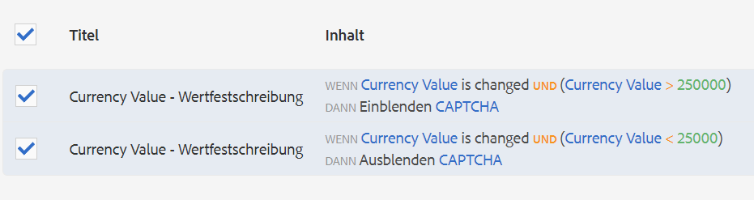

# Verwenden von reCAPTCHA in adaptiven Formularen {#using-reCAPTCHA-in-adaptive-forms}

>[!NOTE]
>
> Adobe empfiehlt, die modernen und erweiterbaren [Kernkomponenten](https://experienceleague.adobe.com/docs/experience-manager-core-components/using/adaptive-forms/introduction.html?lang=de) für die Datenerfassung zu verwenden, um [neue adaptive Formulare zu erstellen](/help/forms/creating-adaptive-form-core-components.md) oder [adaptive Formulare zu AEM Sites-Seiten hinzuzufügen](/help/forms/create-or-add-an-adaptive-form-to-aem-sites-page.md). Diese Komponenten stellen einen bedeutenden Fortschritt bei der Erstellung adaptiver Formulare dar und sorgen für beeindruckende Anwendererlebnisse. In diesem Artikel wird der ältere Ansatz zum Erstellen von adaptiven Formularen mithilfe von Foundation-Komponenten beschrieben.


| Version | Artikel-Link |
| -------- | ---------------------------- |
| AEM 6.5 | [Hier klicken](https://experienceleague.adobe.com/docs/experience-manager-65/forms/adaptive-forms-basic-authoring/captcha-adaptive-forms.html?lang=de) |
| AEM as a Cloud Service | Dieser Artikel |
| Gilt für | Adaptives Formular basierend auf Foundation-Komponenten. <br> Für adaptive Formulare, die auf Kernkomponenten basieren, [klicken Sie hier](/help/forms/captcha-adaptive-forms-core-components.md). |


CAPTCHA („Completely Automated Public Turing test to tell Computers and Humans Apart“ – „vollautomatischer öffentlicher Turing-Test zur Unterscheidung von Computern und Menschen“) ist ein Programm, das bei Onlinetransaktionen eingesetzt wird, um zwischen Menschen und Bots oder automatisierten Programmen zu unterscheiden. Es stellt eine herausfordernde Aufgabe und bewertet die Benutzerantwort, um festzustellen, ob es sich um einen Menschen oder einen Bot handelt, der mit der Site interagiert. Dabei wird verhindert, dass der Benutzer fortfährt, wenn der Test fehlschlägt, wodurch Onlinetransaktionen sicherer werden, da Bots keinen Spam senden oder andere bösartige Zwecke verfolgen können.

AEM Forms as a Cloud Service unterstützt die folgenden CAPTCHA-Lösungen:

* [Google reCAPTCHA](#configure-recaptcha-service-by-google)
* [Cloudflare Turnstile](/help/forms/integrate-adaptive-forms-turnstile.md)
* [hCaptcha](/help/forms/integrate-adaptive-forms-hcaptcha.md)

## Konfigurieren des reCAPTCHA-Service von Google {#google-reCAPTCHA}

Formularautorinnen und -autoren können den reCAPTCHA-Service von Google nutzen, um reCAPTCHA in adaptive Formulare zu implementieren. Er bietet erweiterte reCAPTCHA-Funktionen zum Schutz Ihrer Site. Weitere Informationen zur Funktionsweise von reCAPTCHA finden Sie unter [Google reCAPTCHA](https://developers.google.com/recaptcha/). AEM Forms unterstützt [!DNL reCAPTCHA v2] und [!DNL reCAPTCHA Enterprise]. Es werden keine anderen Versionen unterstützt. Im Offline-Modus der [!DNL AEM Forms]-Anwendung wird reCAPTCHA in adaptiven Formularen nicht unterstützt. Je nach Ihren Anforderungen können Sie den reCAPTCHA-Service konfigurieren, um Folgendes zu aktivieren:


* [reCAPTCHA Enterprise in AEM Forms](#steps-to-implement-reCAPTCHA-enterprise-in-forms)
* [reCAPTCHA v2 in AEM Forms](#steps-to-implement-reCAPTCHA-v2-in-forms)


### Konfigurieren von reCAPTCHA Enterprise  {#steps-to-implement-reCAPTCHA-enterprise-in-forms}

1. Erstellen oder wählen Sie ein [Google Cloud-Projekt](https://cloud.google.com/recaptcha-enterprise/docs/set-up-non-google-cloud-environments-api-keys#before-you-begin) und aktivieren Sie [reCAPTCHA Enterprise API](https://cloud.google.com/recaptcha-enterprise/docs/set-up-non-google-cloud-environments-api-keys#enable-the-recaptcha-enterprise-api).
1. Beziehen Sie die [Projekt-ID](https://support.google.com/googleapi/answer/7014113?hl=en#:~:text=To%20locate%20your%20project%20ID,a%20member%20of%20are%20displayed) und erstellen Sie einen [API-Schlüssel](https://cloud.google.com/recaptcha-enterprise/docs/set-up-non-google-cloud-environments-api-keys#create_an_api_key) und einen [Site-Schlüssel für Websites](https://cloud.google.com/recaptcha-enterprise/docs/create-key#create-key).
1. Erstellen Sie einen Konfigurations-Container für Cloud-Dienste.

   1. Wählen Sie **[!UICONTROL Tools > Allgemein > Konfigurationsbrowser]**.
   1. Wählen Sie einen Ordner aus oder erstellen Sie einen Ordner und aktivieren Sie ihn für Cloud-Konfigurationen, indem Sie folgende Schritte ausführen:
      1. Wählen Sie im Konfigurations-Browser den Ordner aus und wählen Sie dann **[!UICONTROL Eigenschaften]**.
      1. Aktivieren Sie im Dialogfeld „Konfigurationseigenschaften“ die Option **[!UICONTROL Cloud-Konfigurationen]**.
      1. Wählen Sie **[!UICONTROL Speichern und schließen]** aus, um die Konfiguration zu speichern und das Dialogfeld zu schließen.

1. Konfigurieren Sie den Cloud Service für [!DNL reCAPTCHA Enterprise].

   1. Gehen Sie in der Experience Manager-Autoreninstanz zu  > **[!UICONTROL Cloud Services]**.
   1. Wählen Sie **[!UICONTROL reCAPTCHA]** aus. Die Konfigurationsseite öffnet sich. Wählen Sie den erstellten Konfigurations-Container aus und wählen Sie dann **[!UICONTROL Erstellen]**.
   1. Wählen Sie die Version als [!DNL reCAPTCHA Enterprise] und geben Sie den Namen, die Projekt-ID, den Site-Schlüssel und den API-Schlüssel (erhalten in Schritt 2) für den reCAPTCHA-Enterprise-Dienst an.
   1. Wählen Sie den Schlüsseltyp aus. Der Schlüsseltyp sollte mit dem im [Google Cloud-Projekt](https://cloud.google.com/recaptcha-enterprise/docs/set-up-non-google-cloud-environments-api-keys#before-you-begin) konfigurierten Site-Schlüssel übereinstimmen, z. B. **Checkbox-Site-Schlüssel** oder **Bewertungsbasierter Site-Schlüssel**.
   1. Geben Sie einen [Schwellenwert im Bereich von 0 bis 1](https://cloud.google.com/recaptcha-enterprise/docs/interpret-assessment#interpret_scores) an. Werte, die größer oder gleich den Schwellenwerten sind, kennzeichnen menschliche Interaktionen, ansonsten wird von einer Bot-Interaktion ausgegangen.
   1. Wählen Sie **[!UICONTROL Erstellen]** aus, um die Cloud-Service-Konfiguration zu erstellen.

<!--
    1. In the Edit Component dialog, specify the name, project ID, site key, API key (obtained in steps 2 and 3), select the key type, and enter the threshold score. Select **[!UICONTROL Save Settings]** and then select **[!UICONTROL OK]** to complete the configuration.
-->

Sobald der reCAPTCHA Enterprise-Dienst aktiviert ist, kann er in adaptiven Formularen verwendet werden. Siehe [Verwenden von CAPTCHA in adaptiven Formularen](#using-reCAPTCHA).

<!--

-->

### Konfigurieren von Google reCAPTCHA v2 {#steps-to-implement-reCAPTCHA-v2-in-forms}

1. Rufen Sie ein [reCAPTCHA-API-Schlüsselpaar](https://www.google.com/recaptcha/admin) von Google ab. Er enthält einen **Site-Schlüssel** und einen **geheimen Schlüssel**.
1. Erstellen Sie einen Konfigurations-Container für Cloud-Dienste.
   1. Wählen Sie **[!UICONTROL Tools > Allgemein > Konfigurationsbrowser]**.
   1. Wählen Sie einen Ordner aus oder erstellen Sie einen Ordner und aktivieren Sie ihn für Cloud-Konfigurationen, indem Sie folgende Schritte ausführen:
      1. Wählen Sie im Konfigurations-Browser den Ordner aus und wählen Sie dann **[!UICONTROL Eigenschaften]**.
      1. Aktivieren Sie im Dialogfeld „Konfigurationseigenschaften“ die Option **[!UICONTROL Cloud-Konfigurationen]**.
      1. Wählen Sie **[!UICONTROL Speichern und schließen]** aus, um die Konfiguration zu speichern und das Dialogfeld zu schließen.

1. Konfigurieren Sie den Cloud Service für reCAPTCHA v2.

   1. Navigieren Sie in der AEM-Autoreninstanz zu  > **Cloud-Services**.
   1. Wählen Sie **[!UICONTROL reCAPTCHA]** aus. Die Konfigurationsseite öffnet sich. Wählen Sie den erstellten Konfigurations-Container aus und wählen Sie dann **[!UICONTROL Erstellen]**.
   1. Wählen Sie die Version als [!DNL reCAPTCHA v2] aus, geben Sie den Namen, den Site-Schlüssel und den geheimen Schlüssel für den reCAPTCHA-Service an (den Sie in Schritt 1 erhalten haben) und wählen Sie dann **[!UICONTROL Erstellen]**, um die Cloud-Service-Konfiguration zu erstellen.
   1. Geben Sie im Dialogfeld „Komponente bearbeiten“ die Site- und Geheimschlüssel an, die Sie in Schritt 1 erhalten haben. Wählen Sie **[!UICONTROL Einstellungen speichern]** und dann **OK** aus, um die Konfiguration abzuschließen.

   Sobald der reCAPTCHA-Service konfiguriert ist, kann er in adaptiven Formularen verwendet werden. Weitere Informationen finden Sie unter [Verwenden von CAPTCHA in adaptiven Formularen](#using-reCAPTCHA).

<!---->


## Verwenden von Google-reCAPTCHA in adaptiven Formularen {#using-reCAPTCHA}

So verwenden Sie Google-reCAPTCHA in einem adaptiven Formular:

1. Öffnen Sie ein adaptives Formular im Bearbeitungsmodus.

   >[!NOTE]
   >
   >Stellen Sie sicher, dass der beim Erstellen des adaptiven Formulars ausgewählte Konfigurations-Container den reCAPTCHA-Cloud Service enthält. Sie können auch adaptive Formulareigenschaften bearbeiten, um den Konfigurationscontainer zu ändern, der dem Formular zugeordnet ist.

1. Ziehen Sie die **CAPTCHA**-Komponente im Komponenten-Browser in das adaptive Formular und legen Sie sie dort ab.

   >[!NOTE]
   >
   >* Die Verwendung von mehr als einer CAPTCHA-Komponente in einem adaptiven Formular wird nicht unterstützt. Es wird nicht empfohlen, CAPTCHA in einem Fragment oder in einem Bedienfeld zu verwenden, das für das verzögerte Laden konfiguriert wurde.
   >* reCaptcha ist zeitkritisch und läuft nach einigen Minuten ab. Daher wird empfohlen, die Captcha-Komponente unmittelbar vor der Sendeschaltfläche im adaptiven Formular zu platzieren.

1. Wählen Sie die hinzugefügte Captcha-Komponente und dann  aus, um die zugehörigen Eigenschaften zu bearbeiten.
1. Geben Sie einen Titel für das CAPTCHA-Widget an. Der Standardwert ist **CAPTCHA**. Wählen Sie **Titel ausblenden**, wenn der Titel nicht angezeigt werden soll.
1. Wählen Sie aus der Dropdown-Liste **Captcha-Service** die Option **reCAPTCHA**, um den reCAPTCHA-Service zu aktivieren, wenn Sie ihn wie unter [reCAPTCHA-Service von Google](#google-reCAPTCHA) beschrieben konfiguriert haben.
1. Wählen Sie eine Konfiguration aus der Dropdown-Liste „Einstellungen“ für **reCAPTCHA Enterprise** oder **reCAPTCHA v2**
   1. Wenn Sie die Version **reCAPTCHA Enterprise** auswählen, kann der Schlüsseltyp **Kontrollkästchen** oder **punktebasiert** sein. Er basiert auf Ihrer Auswahl bei der Konfiguration des [Site-Schlüssels für Websites](https://cloud.google.com/recaptcha-enterprise/docs/create-key#create-key):

   >[!NOTE]
   >
   >* In der Cloud-Konfiguration mit **Schlüsseltyp** als **Kontrollkästchen** erscheint die angepasste Fehlermeldung als Inline-Meldung, wenn die Captcha-Validierung fehlschlägt.
   >* In der Cloud-Konfiguration mit **Schlüsseltyp** als **punktebasiert** wird die benutzerdefinierte Fehlermeldung als Popup-Meldung angezeigt, wenn die Captcha-Validierung fehlschlägt.

   1. Sie können zwischen den Größen **[!UICONTROL Normal]** und **[!UICONTROL Kompakt]** wählen.
   1. Sie können einen **[!UICONTROL Bindungsverweis]** auswählen. Bei **[!UICONTROL Bindungsverweisen]** handelt es sich bei den übermittelten Daten um gebundene Daten, ansonsten um ungebundene Daten. Im Folgenden finden Sie XML-Beispiele für ungebundene Daten und gebundene Daten (mit Bindungsverweis als SSN), wenn ein Formular gesendet wird.

   ```xml
           <?xml version="1.0" encoding="UTF-8" standalone="no"?>
           <afData>
           <afUnboundData>
               <data>
                   <captcha16820607953761>
                       <captchaType>reCaptchaEnterprise</captchaType>
                       <captchaScore>0.9</captchaScore>
                   </captcha16820607953761>
               </data>
           </afUnboundData>
           <afBoundData>
               <Root
                   xmlns:xfa="http://www.xfa.org/schema/xfa-data/1.0/"
                   xmlns:xsi="http://www.w3.org/2001/XMLSchema-instance">
                   <PersonalDetails>
                       <SSN>371237912</SSN>
                       <FirstName>Sarah </FirstName>
                       <LastName>Smith</LastName>
                   </PersonalDetails>
                   <OtherInfo>
                       <City>California</City>
                       <Address>54 Residency</Address>
                       <State>USA</State>
                       <Zip>123112</Zip>
                   </OtherInfo>
               </Root>
           </afBoundData>
           <afSubmissionInfo>
               <stateOverrides/>
               <signers/>
               <afPath>/content/dam/formsanddocuments/captcha-form</afPath>
               <afSubmissionTime>20230608034928</afSubmissionTime>
           </afSubmissionInfo>
           </afData>
   ```

   ```xml
           <?xml version="1.0" encoding="UTF-8" standalone="no"?>
           <afData>
           <afUnboundData>
               <data/>
           </afUnboundData>
           <afBoundData>
               <Root
                   xmlns:xfa="http://www.xfa.org/schema/xfa-data/1.0/"
                   xmlns:xsi="http://www.w3.org/2001/XMLSchema-instance">
                   <PersonalDetails>
                       <SSN>
                           <captchaType>reCaptchaEnterprise</captchaType>
                           <captchaScore>0.9</captchaScore>
                       </SSN>
                       <FirstName>Sarah</FirstName>
                       <LastName>Smith</LastName>
                   </PersonalDetails>
                   <OtherInfo>
                       <City>California</City>
                       <Address>54 Residency</Address>
                       <State>USA</State>
                       <Zip>123112</Zip>
                   </OtherInfo>
               </Root>
           </afBoundData>
           <afSubmissionInfo>
               <stateOverrides/>
               <signers/>
               <afPath>/content/dam/formsanddocuments/captcha-form</afPath>
               <afSubmissionTime>20230608035111</afSubmissionTime>
           </afSubmissionInfo>
           </afData>
   ```

   Wenn Sie die Version **reCAPTCHA v2** wählen:
   1. Sie können die Größe als **[!UICONTROL Normal]** oder **[!UICONTROL Kompakt]** für das reCAPTCHA-Widget auswählen.
   1. Sie können die Option **[!UICONTROL Unsichtbar]** wählen, um die CAPTCHA-Abfrage nur im Falle einer verdächtigen Aktivität anzuzeigen.

   Der reCAPTCHA-Dienst wird im adaptiven Formular aktiviert. Sie können das Formular in der Vorschau anzeigen und die CAPTCHA-Funktionsweise sehen. Das unten abgebildete Abzeichen **mit reCAPTCHA geschützt** wird auf den geschützten Formularen angezeigt.
   

1. Speichern Sie die Eigenschaften.

>[!NOTE]
> 
> Wählen Sie nicht **[!UICONTROL Standard]** aus der Dropdown-Liste „CAPTCHA-Service“ aus, da der standardmäßige AEM-CAPTCHA-Service nicht mehr unterstützt wird.

>[!VIDEO](https://video.tv.adobe.com/v/3422641/recaptcha-google-adaptive-forms/?quality=12&learn=on)

### Ein- oder Ausblenden der CAPTCHA-Komponente auf Grundlage von Regeln {#show-hide-captcha}

Sie können die CAPTCHA-Komponente auf Grundlage von Regeln, die Sie auf eine Komponente in einem adaptiven Formular anwenden, ein- oder ausblenden. Wählen Sie erst die Komponente, dann  und schließlich **[!UICONTROL Erstellen]** aus, um eine Regel zu erstellen. Weitere Informationen zum Erstellen von Regeln finden Sie im [Regeleditor](rule-editor.md).

Beispielsweise darf die CAPTCHA-Komponente nur dann in einem adaptiven Formular angezeigt werden, wenn das Feld „Währungswert“ im Formular einen Wert von mehr als 25000 aufweist.

Wählen Sie im Formular das Feld **[!UICONTROL Währungswert]** aus und erstellen Sie folgende Regeln:



>[!NOTE]
>
> Wenn Sie eine reCAPTCHA v2-Konfiguration auswählen und die Größe auf [!UICONTROL Unsichtbar] festgelegt ist, bleibt die Ein-/Ausblenden-Option deaktiviert.

### CAPTCHA validieren {#validate-captcha}

Sie können CAPTCHA in einem adaptiven Formular entweder beim Übermitteln des Formulars validieren oder angeben, dass die CAPTCHA-Validierung auf Benutzeraktionen und -bedingungen basiert.

#### CAPTCHA bei Formularübermittlung validieren {#validation-form-submission}

So validieren Sie ein CAPTCHA beim Übermitteln eines adaptiven Formulars automatisch:

1. Wählen Sie die CAPTCHA-Komponente und dann  aus, um die Komponenteneigenschaften anzuzeigen.
1. Wählen Sie im Abschnitt **[!UICONTROL Validieren von CAPTCHA]** **[!UICONTROL CAPTCHA bei Formularübermittlung validieren]**.
1. Wählen Sie  aus, um die Komponenteneigenschaften zu speichern.

#### Validieren von CAPTCHA mit Benutzeraktionen und -bedingungen {#validate-captcha-user-action}

So walidieren Sie ein CAPTCHA basierend auf Bedingungen und Benutzeraktionen:

1. Wählen Sie die CAPTCHA-Komponente und dann  aus, um die Komponenteneigenschaften anzuzeigen.
1. Wählen Sie im Abschnitt **[!UICONTROL CAPTCHA validieren]** die Option **[!UICONTROL CAPTCHA mit Benutzeraktion validieren]**.
1. Wählen Sie  aus, um die Komponenteneigenschaften zu speichern.

[!DNL Experience Manager Forms] stellt die `ValidateCAPTCHA`-API zur Validierung von CAPTCHA unter Verwendung vordefinierter Bedingungen bereit. Sie können die API mit einer benutzerdefinierten Übermittlungsaktion oder durch Definieren von Regeln für Komponenten in einem adaptiven Formular aufrufen.

Im Folgenden finden Sie ein Beispiel für eine `ValidateCAPTCHA`-API zur Validierung von CAPTCHA unter Verwendung vordefinierter Bedingungen:

```javascript
if (slingRequest.getParameter("numericbox1614079614831").length() >= 5) {
     GuideCaptchaValidatorProvider apiProvider = sling.getService(GuideCaptchaValidatorProvider.class);
        String formPath = slingRequest.getResource().getPath();
        String captchaData = slingRequest.getParameter(GuideConstants.GUIDE_CAPTCHA_DATA);
        if (!apiProvider.validateCAPTCHA(formPath, captchaData).isCaptchaValid()){
            response.setStatus(400);
            return;
        }
    }
```

Das Beispiel zeigt an, dass die `ValidateCAPTCHA`-API CAPTCHA im Formular nur dann validiert, wenn die Anzahl der Stellen im numerischen Feld, die der Benutzer beim Ausfüllen des Formulars angegeben hat, größer als 5 ist.

**Option 1: Verwenden Sie die [!DNL Experience Manager Forms] ValidateCAPTCHA-API, um CAPTCHA mithilfe einer benutzerdefinierten Übermittlungsaktion zu validieren.**

Führen Sie folgende Schritte aus, um die `ValidateCAPTCHA`-API zur Validierung von CAPTCHA mit einer benutzerdefinierten Übermittlungsaktion zu verwenden:

1. Fügen Sie das Skript, das die `ValidateCAPTCHA`-API enthält, zur benutzerdefinierten Übermittlungsaktion hinzu. Weitere Informationen zu benutzerdefinierten Übermittlungsaktionen finden Sie unter [Erstellen einer benutzerdefinierten Übermittlungsaktion für adaptive Formulare](custom-submit-action-form.md).
1. Wählen Sie den Namen der benutzerdefinierten Übermittlungsaktion aus der Dropdown-Liste **[!UICONTROL Übermittlungsaktion]** in den Eigenschaften für die **[!UICONTROL Übermittlung]** eines adaptiven Formulars.
1. Wählen Sie **[!UICONTROL Übermitteln]** aus. CAPTCHA wird auf Grundlage der Bedingungen validiert, die in der `ValidateCAPTCHA`-API der benutzerdefinierten Übermittlungsaktion definiert sind.

**Option 2: Verwenden Sie die [!DNL Experience Manager Forms] ValidateCAPTCHA-API, um CAPTCHA vor dem Übermitteln des Formulars bei einer Benutzeraktion zu validieren.**

Sie können die `ValidateCAPTCHA`-API auch aufrufen, indem Sie Regeln auf eine Komponente in einem adaptiven Formular anwenden.

Sie fügen beispielsweise die Schaltfläche **[!UICONTROL CAPTCHA validieren]** in einem adaptiven Formular hinzu und erstellen eine Regel, um beim Klick auf eine Schaltfläche einen Service aufzurufen.

Folgende Abbildung zeigt, wie Sie beim Klick auf die Schaltfläche **[!UICONTROL CAPTCHA validieren]** einen Service aufrufen können:


Sie können das benutzerdefinierte Servlet, das die `ValidateCAPTCHA`-API enthält, mit dem Regeleditor aufrufen und die Schaltfläche zum Übermitteln des adaptiven Formulars basierend auf dem Validierungsergebnis aktivieren oder deaktivieren.

Ebenso können Sie mithilfe des Regeleditors eine benutzerdefinierte Methode zur Validierung von CAPTCHA in ein adaptives Formular aufnehmen.

<!--

### Add custom CAPTCHA services {#add-custom-captcha-service}

[!DNL Experience Manager Forms] provides reCAPTCHA as the CAPTCHA service. However, you can add a custom service to display in the **[!UICONTROL CAPTCHA Service]** drop-down list.  

The following is a sample implementation of the interface to add additional CAPTCHA service to your Adaptive Form:

```javascript
package com.adobe.aemds.guide.service;

import org.osgi.annotation.versioning.ConsumerType;

/**
 * An interface to provide captcha validation at server side in Adaptive Form
 * This interface can be used to provide custom implementation for different captcha services.
 */
@ConsumerType
public interface GuideCaptchaValidator {
    /**
     * This method should define the actual validation logic of the captcha
     * @param captchaPropertyNodePath path to the node with CAPTCHA configurations inside form container
     * @param userResponseToken  The user response token provided by the CAPTCHA from client-side
     *
     * @return  {@link GuideCaptchaValidationResult} validation result of the captcha
     */
     GuideCaptchaValidationResult validateCaptcha(String captchaPropertyNodePath, String userResponseToken);

    /**
     * Returns the name of the captcha validator. This should be unique among the different implementations
     * @return  name of the captcha validator
     */
     String getCaptchaValidatorName();
}
```

`captchaPropertyNodePath` refers to the resource path of the CAPTCHA component in the Sling repository. Use this property to include details specific to the CAPTCHA component. For example, `captchaPropertyNodePath` includes information for the reCAPTCHA cloud configuration configured on the CAPTCHA component. The cloud configuration information provides **[!UICONTROL Site Key]** and **[!UICONTROL Secret Key]** settings for implementing the reCAPTCHA service.

`userResponseToken` refers to the `g_recaptcha_response` that gets generated after solving a CAPTCHA in a form. -->

### Bearbeiten der reCAPTCHA-Servicedomain {#reCAPTCHA-service-domain}

Der reCAPTCHA-Service verwendet `https://www.recaptcha.net/` als Standard-Domain. Sie können die Einstellungen ändern, um `https://www.google.com/` oder einen beliebigen benutzerdefinierten Domain-Namen zum Laden, Rendern und Validieren des reCAPTCHA-Service festzulegen.

Legen Sie die Eigenschaft **[!UICONTROL af.cloudservices.recaptcha.domain]** der Konfiguration **[!UICONTROL Adaptives Formular und Webkanal für interaktive Kommunikation]** fest, um `https://www.google.com/` oder einen anderen benutzerdefinierten Domain-Namen anzugeben. Folgende JSON-Datei zeigt ein Beispiel:

```json
{
  "af.cloudservices.recaptcha.domain": "https://www.google.com/"
}
```

Um Konfigurationswerte festzulegen, [generieren Sie OSGi-Konfigurationen mit dem AEM-SDK](https://experienceleague.adobe.com/docs/experience-manager-cloud-service/implementing/deploying/configuring-osgi.html?lang=de#generating-osgi-configurations-using-the-aem-sdk-quickstart) und [stellen Sie die Konfiguration](https://experienceleague.adobe.com/docs/experience-manager-cloud-service/implementing/using-cloud-manager/deploy-code.html?lang=de#deployment-process) in Ihrer Cloud Service-Instanz bereit.

## Siehe auch {#see-also}

{{see-also}}

<!--

>[!MORELIKETHIS]
>
>* [Reference Themes, Templates, and Form Data models for Adaptive Forms](/help/forms/reference-themes-templates-data-models.md)

-->
