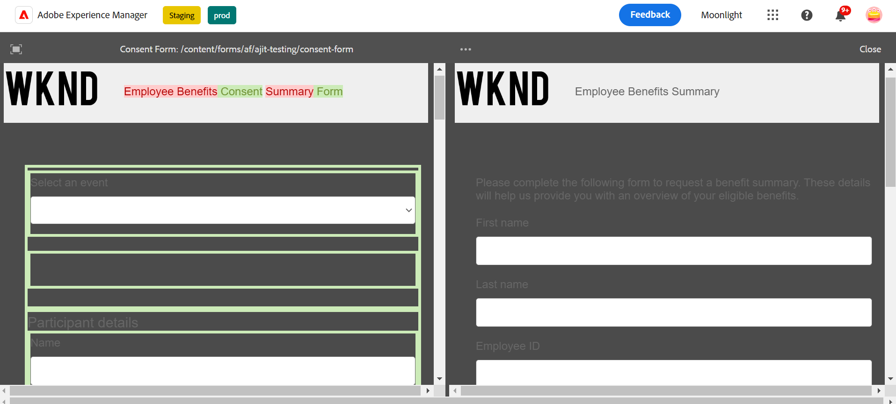

# Vergleichen adaptiver Formulare {#compare-two-forms}

 Dies ist eine Vorabversionsfunktion, auf die über unseren [Vorabversionskanal](https://experienceleague.adobe.com/docs/experience-manager-cloud-service/content/release-notes/prerelease.html?lang=de#new-features) zugegriffen werden kann. 

Wenn Formularautoren zwei verschiedene Formulare basierend auf den Feldern, Inhalten und Formularkomponenten vergleichen müssen, vergleichen sie die beiden Formulare. Der Formularautor muss sicherstellen, dass sich die beiden Formulare im selben Verzeichnis oder Ordner befinden, um sie vergleichen zu können. Um zwei verschiedene adaptive Formulare zu vergleichen, führen Sie die folgenden Schritte aus:

1. Wählen Sie adaptive Formulare aus und klicken Sie auf **[!UICONTROL Vergleichen]**.

   

1. Beim Klicken sehen Sie zwei Formulare im Vorschaumodus. Das erste Formular wird als Basisformular für den Vergleich mit dem zweiten Formular ausgewählt, und die Inhalte der beiden Formulare werden verglichen, wobei Ähnlichkeiten und Unterschiede ermittelt werden. Der abweichende Inhalt des ersten Formulars wird grün markiert, wie in der Abbildung gezeigt.

   

## Siehe auch {#see-also}

{{see-also}}
