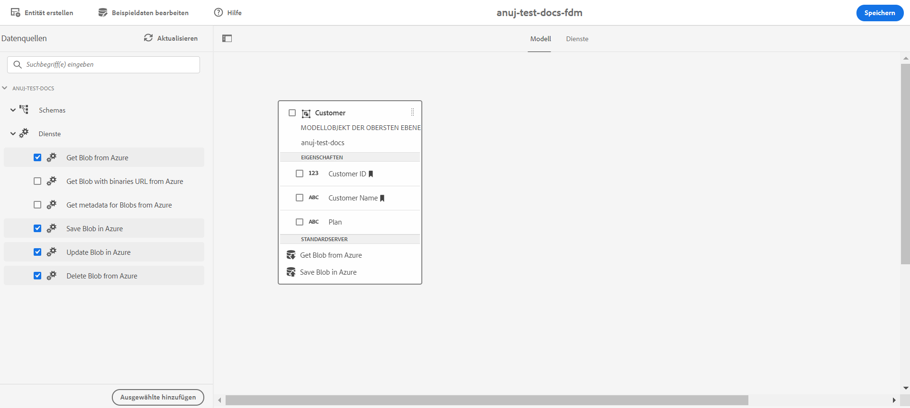

# Konfigurieren des [!DNL Azure]-Speichers {#configure-azure-storage}

[[!DNL Experience Manager Forms] Data Integration](data-integration.md) bietet eine [!DNL Azure]-Speicherkonfiguration, um Formulare mit [!DNL Azure]-Speicher-Services zu integrieren. Das Formulardatenmodell kann verwendet werden, um adaptive Formulare zu erstellen, die mit [!DNL Azure]Server interagieren, um Unternehmens-Workflows zu ermöglichen. Zum Beispiel:

* Schreiben von Daten in [!DNL Azure] bei Übermittlung von adaptiven Formularen.
* Speichern von Daten in [!DNL Azure] durch benutzerdefinierte Entitäten, die im Formulardatenmodell definiert sind, und umgekehrt.
* Abfragen eines [!DNL Azure]-Servers nach Daten und Auffüllen adaptiver Formulare.
* Lesen Sie Daten vom [!DNL Azure]-Server.

## Erstellen einer [!DNL Azure]-Speicherkonfiguration {#create-azure-storage-configuration}

Stellen Sie vor dem Ausführen dieser Schritte sicher, dass Sie über ein [!DNL Azure]-Speicherkonto und einen Zugriffsschlüssel verfügen, um den Zugriff auf das [!DNL Azure]-Speicherkonto zu autorisieren.

1. Gehen Sie zu **[!UICONTROL Tools]** > **[!UICONTROL Cloud Services]** > **[!UICONTROL Azure-Speicher]**.
1. Wählen Sie einen Ordner aus, um die Konfiguration zu erstellen, und tippen Sie auf **[!UICONTROL Erstellen]**.
1. Geben Sie im Feld **[!UICONTROL Titel]** einen Titel für die Konfiguration an.
1. Geben Sie den Namen des [!DNL Azure]-Speicherkontos im Feld **[!UICONTROL Azure-Speicherkonto]** an.
1. Geben Sie den Schlüssel für den Zugriff auf das Azure-Speicherkonto im Feld **[!UICONTROL Azure-Zugriffsschlüssel]** an und tippen Sie auf **[!UICONTROL Speichern]**.

## Erstellen von Formulardatenmodellen {#create-azure-form-data-model}

Nachdem Sie die [!DNL Azure]-Speicherkonfiguration erstellt haben, können Sie [das Formulardatenmodell erstellen](create-form-data-models.md). Geben Sie den Ordner, der die [!DNL Azure]-Konfiguration enthält, beim Erstellen des Formulardatenmodells im Feld **[!UICONTROL Datenquellenkonfiguration]** an. Anschließend können Sie die Konfiguration aus der Liste der Konfigurationen auswählen, die im angegebenen Ordnernamen vorhanden sind.

### Hinzufügen von [!DNL Azure]-Services zum Formulardatenmodell {#add-azure-services}

Nachdem Sie das Formulardatenmodell erstellt und Datenmodellobjekte hinzugefügt haben, können Sie dem Formulardatenmodell [!DNL Azure]-Services hinzufügen.

So fügen Sie [!DNL Azure]-Services hinzu:

1. Wählen Sie im Bearbeitungsmodus die Services im Abschnitt **[!UICONTROL Services]** im linken Bereich aus und tippen Sie auf **[!UICONTROL Auswahl hinzufügen]**. Die ausgewählten Services werden auf der Registerkarte **[!UICONTROL Services]** des Formulardatenmodells angezeigt.

   

1. Wählen Sie auf der Registerkarte **[!UICONTROL Services]** den Service aus und tippen Sie auf **[!UICONTROL Eigenschaften bearbeiten]**. Definieren Sie basierend auf dem Service die Eingabe- oder Ausgabemodellobjekte für den Service.

1. Tippen Sie auf **[!UICONTROL Speichern]**, um das Formulardatenmodell zu speichern.

   In der folgenden Tabelle werden die verfügbaren [!DNL Azure]-Services beschrieben:

   <table>
    <tbody>
     <tr>
      <th><strong>Service-Name</strong></th>
      <th><strong>Beschreibung</strong></th>
     </tr>
     <tr>
      <td>Blob von Azure abrufen</td>
      <td>Abrufen von Daten, die als Blob im Azure-Speicher gespeichert sind, unter Verwendung einer ID oder eines Namens</td>
     </tr>
     <tr>
      <td>Blob mit Binärdatei-URL von Azure abrufen</td>
      <td>Abrufen von Daten, die als Blob mit URL für Binärdateien im Azure-Speicher gespeichert sind, unter Verwendung einer ID oder eines Namens</td>
     </tr>
     <tr>
      <td>Blob in Azure speichern</td>
      <td>Blob-ID zum Speichern von Daten im Azure-Speicher verwenden</td>
     </tr>
     <tr>
      <td>Blob in Azure aktualisieren</td>
      <td>Blob-ID verwenden, um Daten im Azure-Speicher zu aktualisieren</td>
     </tr>
     <tr>
      <td>Liste der Blob-IDs aus Azure abrufen</td>
      <td>Rufen Sie basierend auf der in der Eingabeanforderung definierten Zahl eine Liste der Blob-IDs von Azure ab.</td>
     </tr>
     <tr>
      <td>SAS-URLs für Blobs aus Azure abrufen</td>
      <td>Rufen Sie SAS-URLs für Blobs von Azure basierend auf Blob-IDs in der Eingabeanforderung ab.</td>
     </tr>
     <tr>
      <td>Blob aus Azure löschen</td>
      <td>Blob-ID zum Löschen von Daten aus dem Azure-Speicher verwenden</td>
     </tr>
    </tbody>
   </table>

### Definieren einer Datenmodell-Objekteigenschaft als Suchschlüssel {#define-data-model-object-as-metadata}

Definieren einer Datenmodell-Objekteigenschaft als Suchschlüssel

1. Wählen Sie auf der Registerkarte **[!UICONTROL Modell]** die Datenmodell-Objekteigenschaft aus und tippen Sie auf **[!UICONTROL Eigenschaften bearbeiten]**.
1. Schalten Sie die Umschaltoption **[!UICONTROL Suchschlüssel]** in den Status „EIN“. Diese Option ist nur für primäre Datentypen verfügbar.
1. Tippen Sie auf **[!UICONTROL Fertig]** und anschließend auf **[!UICONTROL Speichern]**, um das Formulardatenmodell zu speichern.

Nachdem Sie die Datenmodell-Objekteigenschaften als Suchschlüssel definiert haben, werden die Schlüssel als Metadaten im Azure-Speicher gespeichert.
