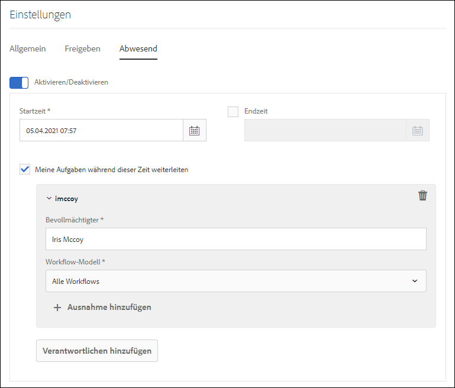

# Konfigurieren von Abwesenheitseinstellungen {#configure-out-of-office-settings}

Für geplante Abwesenheitszeiten können Sie festlegen, was während dieser Zeit mit den Ihnen zugeordneten Elementen passieren soll.

Sie haben die Möglichkeit, ein Anfangs- und Enddatum sowie eine Anfangs- und Enduhrzeit für die Gültigkeit der Abwesenheitseinstellungen anzugeben. Wenn Sie sich in einer anderen Zeitzone als der des Servers aufhalten, wird die Zeitzone des Client verwendet.

Sie können eine Person festlegen, an die Ihre Elemente standardmäßig gesendet werden. Zudem können Sie Ausnahmen für Elemente aus speziellen Prozessen festlegen, die an einen anderen Benutzer gesendet oder bis zu Ihrer Rückkehr in Ihrem Posteingang bleiben sollen. Wenn die angegebene Person ebenfalls abwesend ist, wird das Element an den von dieser Person angegebenen Vertreter weitergeleitet. Sind alle Benutzer abwesend, denen das Element zugewiesen werden könnte, bleibt es im Posteingang.

Sie können die Elementzuweisung auf der Basis der Workflow-Modelle differenzieren. Sie können beispielsweise ein Element aus Workflow A an Benutzer A und ein Element aus Workflow B an Benutzer B übertragen.

>[!NOTE]
>
>* Wenn Sie die Abwesenheitseinstellung aktivieren, bleiben alle Elemente, die bis zu diesem Zeitpunkt in Ihrem Posteingang verfügbar sind, weiterhin im Posteingang. Nur Elemente, die nach Aktivierung der Abwesenheitseinstellungen empfangen wurden, werden delegiert.
>* Wenn Sie die Abwesenheitseinstellung deaktivieren, werden die delegierten Elemente nicht automatisch an Sie zurückverwiesen. Mithilfe der Anforderungsfunktion können Sie Elemente an sich selbst übertragen.
>* Wenn Benutzer A Elemente an Benutzer B delegiert und Benutzer B an Benutzer C weiterdelegiert, werden die Elemente nur Benutzer C und nicht Benutzer B zugewiesen.
>* Wenn eine Schleife in der Aufgabenzuweisung entsteht, bleiben die Aufgaben beim ursprünglichen Benutzer. Eine solche Schleife besteht beispielsweise, wenn ein Element von Benutzer A an Benutzer B, von Benutzer B an Benutzer C, von Benutzer C an Benutzer D und schließlich von Benutzer D an Benutzer B delegiert wird. In einem solchen Fall verbleibt das Element beim ursprünglichen Benutzer. Beim Beispiel oben ist Benutzer A der ursprüngliche Benutzer.

## Aktivieren der Abwesenheitseinstellung für Ihr Konto {#enable-out-of-office}

Führen Sie folgende Schritte aus, um die Abwesenheitseinstellung für Ihr Konto zu aktivieren und Ihre Posteingangselemente an einen anderen Benutzer zu delegieren:

1. Melden Sie sich bei Ihrer AEM-Instanz an. Tippen Sie auf das Symbol  und dann auf **[!UICONTROL Alle anzeigen]**. Eine Liste Ihrer Posteingangselemente wird angezeigt.
1. Tippen Sie auf das Symbol  oder  neben der Schaltfläche **[!UICONTROL Erstellen]** und dann auf **[!UICONTROL Einstellungen]**. Das Dialogfeld „Einstellungen“ wird angezeigt.
1. Öffnen Sie im Dialogfeld „Einstellungen“ die Registerkarte **[!UICONTROL Abwesenheit]**.
1. Tippen Sie auf die Schaltfläche **[!UICONTROL Aktivieren/Deaktivieren]**, um die Abwesenheitseinstellung zu aktivieren.
1. Geben Sie die Zeiten für **[!UICONTROL Startzeit]** und **[!UICONTROL Endzeit]** an. Die Elemente werden nur während des angegebenen Zeitraums delegiert. Lassen Sie das Feld **[!UICONTROL Ende]** leer, um Elemente auf unbestimmte Zeit zu übertragen.
1. Aktivieren Sie das Kontrollkästchen **[!UICONTROL Meine Aufgaben während dieser Zeit weiterleiten]**. Wenn Sie diese Option nicht auswählen und keinen Empfänger angeben, werden Ihre Elemente nicht weitergeleitet. Obwohl Sie abwesend sind und die Einstellung aktiviert ist, bleiben alle Elemente in Ihrem Posteingang.
1. Tippen Sie auf **[!UICONTROL Verantwortlichen hinzufügen]**. Geben Sie im Feld **[!UICONTROL Bevollmächtigter]** einen Benutzer an, an den die Elemente delegiert werden sollen. Bestimmen Sie das **[!UICONTROL Workflow-Modell]**, um Elemente an den ausgewählten Benutzer zu delegieren. Sie können mehrere Workflow-Modelle auswählen.

   Wenn Sie einem bestimmten Benutzer alle Elemente unabhängig vom Workflow-Modell zuweisen möchten, wählen Sie in der Dropdown-Liste des Workflow-Modells die Option **[!UICONTROL Alle Workflows]**.  

   Um einem bestimmten Benutzer Elemente für alle Workflow-Modelle mit Ausnahme einiger weniger zuzuweisen, wählen Sie **[!UICONTROL Alle Workflows]** in der Dropdown-Liste Workflow-Modell aus, tippen Sie auf **[!UICONTROL + Ausnahmen hinzufügen]** und geben Sie die Workflow-Modelle an, die ausgeschlossen werden sollen.
    

   Wiederholen Sie den Schritt, um weitere Empfänger hinzuzufügen.  

   >[!NOTE]
   >
   >Die Reihenfolge der Empfänger ist wichtig. Wenn einem Benutzer, der die Abwesenheitseinstellung aktiviert hat, ein Element zugewiesen wird, wird das Element entsprechend der erstellten Empfängerliste weitergeleitet. Dabei gilt die Reihenfolge, in der die Empfänger hinzugefügt wurden. Erfüllt ein Element die Kriterien, wird es an den jeweiligen Empfänger weitergeleitet, ohne dass weitere Empfänger auf der Liste geprüft werden.

1. Tippen Sie auf **[!UICONTROL Speichern]**. Die Einstellung wird zum angegebenen Startzeitpunkt wirksam. Selbst wenn Sie sich während Ihrer Abwesenheit am System anmelden, gelten Sie erst wieder als anwesend, wenn Sie die Einstellungen ändern.

Nun werden alle während des Abwesenheitszeitraums empfangenen Elemente automatisch dem ausgewählten Empfänger zugewiesen.

>[!NOTE]
>
>(Nur bei Formular-zentrierten Workflow-Elementen) Aktivieren Sie die Option **[!UICONTROL Empfänger darf über Abwesenheitseinstellung delegieren]** des Schritts **[!UICONTROL Aufgabe zuweisen]**. Nur Elemente, bei denen diese Option aktiviert ist, werden an andere Benutzer delegiert.

## Beschränkungen {#limitations}

* Die Zuweisung von Elementen an eine Gruppe wird nicht unterstützt.
* Die Aktivierung von Abwesenheitszeiten für Projektaufgaben wird derzeit nicht unterstützt.
