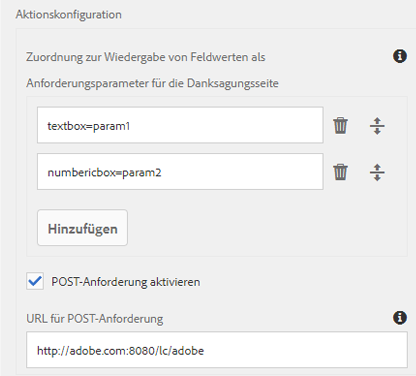

# Konfigurieren eines adaptiven Formulars für die REST-Endpunkt-Übermittlungsaktion

Verwenden Sie die Aktion **[!UICONTROL An REST-Endpunkt übermitteln]**, um die übertragenen Daten an eine Rest-URL zu veröffentlichen. Die URL kann sich auf einem internen Server (dem Server, auf dem das Formular gerendert wird) oder auf einem externen Server befinden.

AEM as a Cloud Service bietet verschiedene vordefinierte Übermittlungsaktionen für die Verarbeitung von Formularübermittlungen. Weitere Informationen zu diesen Optionen finden Sie im Artikel [Übermittlungsaktion für adaptive Formulare](/help/forms/configure-submit-actions-core-components.md).

## Vorteile

Einige Vorteile der Konfiguration der Übermittlungsaktion **[!UICONTROL An REST-Endpunkt übermitteln]** für adaptive Formulare sind:

* Sie ermöglicht die nahtlose Integration von Formulardaten in externe Systeme und Dienste über RESTful-APIs.
* Sie bietet Flexibilität bei der Verarbeitung von Datenübermittlungen aus adaptiven Formularen und unterstützt dynamische und komplexe Datenstrukturen.
* Sie unterstützt die dynamische Zuordnung von Formularfeldern zu Parametern in der REST-Endpunkt-URL, was eine anpassbare und benutzerdefinierte Datenübermittlung ermöglicht.

## Konfigurieren der Übermittlungsaktion als „An REST-Endpunkt übermitteln“ {#steps-to-configure-submit-to-restendpoint-submit-action}

So konfigurieren Sie eine Übermittlungsaktion basierend auf der Swagger Open API-Spezifikation:

1. Öffnen Sie den Inhalts-Browser und wählen Sie die **[!UICONTROL Guide-Container]**-Komponente Ihres adaptiven Formulars aus.
1. Klicken Sie auf das Symbol für die Guide-Container-Eigenschaften . Das Dialogfeld „Container für ein adaptives Formular“ wird geöffnet.
1. Klicken Sie auf die Registerkarte **[!UICONTROL Übermittlung]**.
1. Wählen Sie aus der Dropdown-Liste **[!UICONTROL Übermittlungsaktion]** die Option **[!UICONTROL An REST-Endpunkt übermitteln]**.
   

   Um Daten auf einem internen Server zu senden, geben Sie den Pfad der Ressource an. Die Daten werden an den Pfad der Ressource gesendet. Beispiel: `/content/restEndPoint`. Für solche Sende-Anfragen werden die Authentifizierungsinformationen der Versandanfrage verwendet.

   Geben Sie eine URL an, um Daten an einen externen Server zu senden. Das Format der URL ist `https://host:port/path_to_rest_end_point`. Stellen Sie sicher, dass Sie den Pfad zum Handhaben der POST-Anforderung anonym konfigurieren.

   

   Im obigen Beispiel hat der Benutzer Informationen in die `textbox` eingegeben, die mithilfe von Parameter `param1` erfasst werden. Die Syntax zur Veröffentlichung erfasster Daten mithilfe von `param1` lautet:

   `String data=request.getParameter("param1");`

   Auch Parameter, die Sie für die Veröffentlichung von XML-Daten und Anlagen verwenden, sind `dataXml` und `attachments`.

   Beispielsweise können Sie diese beiden Parameter in Ihrem Skript verwenden, um Daten an einem REST-Endpunkt zu analysieren. Verwenden Sie die folgende Syntax, um Daten zu speichern und zu analysieren:

   `String data=request.getParameter("dataXml");`
   `String att=request.getParameter("attachments");`

   In diesem Beispiel speichert `data` die XML-Daten, und `att` speichert Anlagendaten.

   Die Übermittlungsoption **[!UICONTROL An REST-Endpunkt übermitteln]** wird verwendet, wenn Sie die im Formular eingetragenen Daten zu einer konfigurierten Bestätigungsseite im Rahmen der HTTP GET-Anforderung weiterleiten möchten. Sie können den Namen der anzufordernden Felder hinzufügen. Das Format der Anfrage lautet:

   `{fieldName}={request parameter name}`

   Wie in der folgenden Abbildung dargestellt, werden `param1` und `param2` als Parameter mit Werten, die aus den Feldern **textbox** und **numericbox** kopiert wurden, für die nächste Aktion weitergeleitet.

   

   Sie können auch **[!UICONTROL POST-Anforderungen aktivieren]** und eine URL eingeben, um die Anforderung zu veröffentlichen. Um Daten an den AEM-Server, auf dem sich das Formular befindet, zu senden, verwenden Sie einen relativen Pfad entsprechend dem Stammpfad des AEM-Servers. Beispiel: `/content/forms/af/SampleForm.html`. Wenn Sie Daten an irgendeinen anderen Server senden, verwenden Sie den absoluten Pfad.

1. Klicken Sie auf **[!UICONTROL Fertig]**.

### Konfigurieren der Sendeaktion basierend auf dem Service-REST-Endpunkt {#config-service-endpoint-auth}

 Die Funktion „Service-Endpunkt“ befindet sich im Early-Adopter-Programm und gilt nur für Kernkomponenten. Sie können von Ihrer offiziellen E-Mail-Adresse aus an aem-forms-ea@adobe.com schreiben, um dem Early-Adopter-Programm beizutreten und den Zugriff auf diese Funktion zu beantragen. 

1. Öffnen Sie den Inhalts-Browser und wählen Sie die **[!UICONTROL Guide-Container]**-Komponente Ihres adaptiven Formulars aus.
1. Klicken Sie auf das Symbol für die Guide-Container-Eigenschaften . Das Dialogfeld „Container für ein adaptives Formular“ wird geöffnet.
1. Klicken Sie auf die Registerkarte **[!UICONTROL Übermittlung]**.
1. Wählen Sie aus der Dropdown-Liste **[!UICONTROL Übermittlungsaktion]** die Option **[!UICONTROL An REST-Endpunkt übermitteln]**.
1. Aktivieren Sie die POST-Anfrage.
1. Geben Sie die REST-Endpunkt-URL an.
1. Wählen Sie die Konfiguration aus, die Sie für Ihren Service-REST-Endpunkt-Authentifizierungstyp und die Inhaltstypen erstellt haben. Weitere Informationen zum Authentifizierungstyp und zu den Inhaltstypen finden Sie unter [Konfigurieren von Datenquellen](/help/forms/configure-data-sources.md#configure-restful-services-using-service-endpoint-configure-restful-services-service-endpoint).
   
1. Klicken Sie auf „Fertig“.

## Best Practices

* Stellen Sie beim Senden von Daten an einen externen Server sicher, dass die URL sicher ist, und konfigurieren Sie den Pfad, um die POST-Anforderung anonym zu verarbeiten und dadurch vertrauliche Informationen zu schützen.
* Alle Felder müssen über verschiedene Elementnamen verfügen, um als Parameter in der REST-URL weitergeleitet zu werden, und zwar auch dann, wenn die Felder in verschiedene Bereiche platziert wurden.

## Ähnliche Artikel

{{af-submit-action}}
