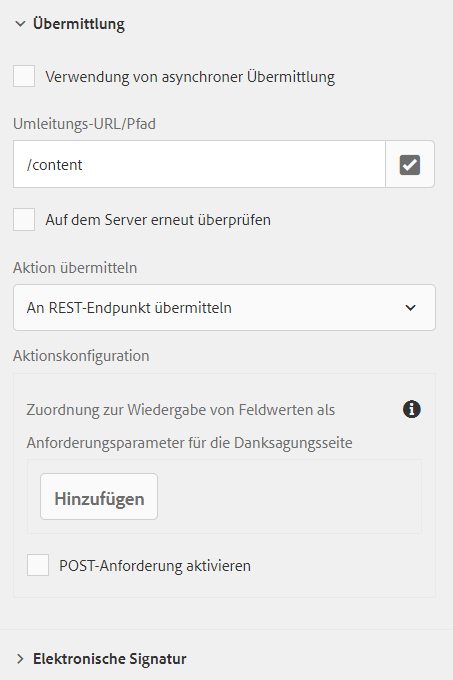

# Konfigurieren einer Umleitungsseite {#configuring-redirect-page}

| Version | Artikel-Link |
| -------- | ---------------------------- |
| AEM 6.5 | [Hier klicken](https://experienceleague.adobe.com/docs/experience-manager-65/forms/adaptive-forms-basic-authoring/configuring-redirect-page.html?lang=de) |
| AEM as a Cloud Service | Dieser Artikel |

Formularersteller können für jedes Formular eine Seite konfigurieren, zu der die Formularbenutzer nach dem Absenden eines Formulars umgeleitet werden.

1. Wählen Sie im Bearbeitungsmodus eine Komponente aus, klicken Sie dann auf  > **[!UICONTROL Container für ein adaptives Formular]** und anschließend auf .

1. Klicken Sie in der Seitenleiste auf **[!UICONTROL Übermittlung]**.

1. Geben Sie die URL der Umleitungsseite unter **[!UICONTROL Umleitungs-URL/Pfad]** im Abschnitt **[!UICONTROL Übermittlung]** an.
1. Optional können Sie unter „Übermittlungsaktion“ für die Aktion „An REST-Endpunkt übermitteln“ den Parameter konfigurieren, der zur Umleitungsseite weitergeleitet wird.

   

   Konfigurieren der Umleitungsseite

Autorinnen und Autoren von Formularen können folgende Parameter verwenden, die zur Dankeseite weitergeleitet werden.  Bei allen verfügbaren Übermittlungsaktionen werden `status`- und `owner`-Parameter übergeben. Neben diesen beiden Parametern werden für die folgenden Übermittlungsaktionen einige weitere Parameter übergeben:

* **[!UICONTROL An REST-Endpunkt übermitteln]**: Parameter, die für die Zuordnung feldinterner Werte zu Parametern hinzugefügt wurden, werden weitergeleitet. Die Parameter `status` und `owner` werden bei dieser Übermittlungsaktion nicht übergeben. Weitere Informationen finden Sie unter [Konfigurieren der Übermittlungsaktion „An REST-Endpunkt übermitteln“](configuring-submit-actions.md).

>[!MORELIKETHIS]
>
>* [Konfigurieren einer Umleitungsseite oder Dankesnachricht](/help/forms/configure-redirect-page-or-thank-you-message.md)
