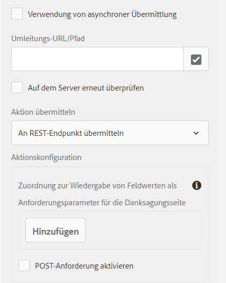

# Übermittlungsaktion für adaptive Formulare {#configuring-the-submit-action}

Eine Übermittlungsaktion wird ausgelöst, wenn ein Benutzer in einem adaptiven Formular auf die Schaltfläche **[!UICONTROL Senden]** klickt. Adaptive Formulare stellen einige Übermittlungsaktionen standardmäßig bereit. Die verfügbaren standardmäßigen Übermittlungsaktionen sind:

* [An REST-Endpunkt übermitteln](#submit-to-rest-endpoint)
* [E-Mail senden](#send-email)
* [Senden mit Formulardatenmodell](#submit-using-form-data-model)
* [AEM-Workflow aufrufen](#invoke-an-aem-workflow)
* [An SharePoint senden](#submit-to-sharedrive)
* [An OneDrive senden](#submit-to-onedrive)
* [An Azure Blob-Speicher senden](#azure-blob-storage)

Sie können die [standardmäßige Übermittlungsaktion erweitern](custom-submit-action-form.md) und dadurch eine eigene Übermittlungsaktion erstellen.

Sie können eine Übermittlungsaktion in der Seitenleiste im Bereich **[!UICONTROL Übermittlung]** des Containers für adaptive Formulare konfigurieren.

<!-- [!NOTE]
>
>Send PDF via Email Submit Action is applicable only to Adaptive Forms that use XFA template as form model. 

>[!NOTE]
>
>Ensure that the [AEM_Installation_Directory]\crx-quickstart\temp\datamanager\ASM folder
>exists. The directory is required to temporarily store attachments. If the directory does not exist, create it. -->

<!--

>[!CAUTION]
>
>If you  [prefill](prepopulate-adaptive-form-fields.md) a form template,  a Form Data Model or schema based Adaptive Form with XML or JSON data complaint to a schema (XML schema, JSON schema , form template, or form data model) that is data does not contain &lt;afData&gt;, &lt;afBoundData&gt;, and &lt;/afUnboundData&gt; tags, then the data of unbounded fields (Unbounded fields are Adaptive Form fields without [bindref](prepopulate-adaptive-form-fields.md) property) of the Adaptive Form is lost. 

>[!CAUTION]
>
>If you [prefill](prepopulate-adaptive-form-fields.md) a form template, a Form Data Model or schema based Adaptive Form with XML or JSON data complaint to a schema (XML schema, JSON schema, or form data model) that does not contain &lt;afData&gt;, &lt;afBoundData&gt;, and &lt;/afUnboundData&gt; tags, then the data of unbounded fields (Unbounded fields are Adaptive Form fields without [bindref](prepopulate-adaptive-form-fields.md) property) of the Adaptive Form is lost.

-->

## An REST-Endpunkt übermitteln {#submit-to-rest-endpoint}

Verwenden Sie die Aktion **[!UICONTROL An REST-Endpunkt übermitteln]**, um die übertragenen Daten an eine Rest-URL zu veröffentlichen. Die URL kann sich auf einem internen (dem Server, auf dem das Formular gerendert wird) oder auf einem externen Server befinden.

Stellen Sie den Pfad der Ressource bereit, um Daten an einen internen Server zu veröffentlichen. Die Daten werden an den Pfad der Ressource veröffentlicht. Beispiel: /content/restEndPoint. Für diese POST-Anforderungen werden die Authentifizierungsinformationen der Versandanfrage verwendet.

Stellen Sie die URL bereit, um Daten an einen externen Server zu veröffentlichen. Das Format der URL ist `https://host:port/path_to_rest_end_point`. Stellen Sie sicher, dass Sie den Pfad zum Handhaben der POST-Anforderung anonym konfigurieren.

Im obigen Beispiel hat der Benutzer Informationen in die `textbox` eingegeben, die mithilfe von Parameter `param1` erfasst werden. Die Syntax zur Veröffentlichung erfasster Daten mithilfe von `param1` lautet:

`String data=request.getParameter("param1");`

Auch Parameter, die Sie für die Veröffentlichung von XML-Daten und Anlagen verwenden, sind `dataXml` und `attachments`.

Beispielsweise können Sie diese beiden Parameter in Ihrem Skript verwenden, um Daten an einem Restendpunkt zu analysieren. Verwenden Sie die folgende Syntax, um Daten zu speichern und zu analysieren:

`String data=request.getParameter("dataXml");`
`String att=request.getParameter("attachments");`

In diesem Beispiel speichert `data` die XML-Daten, und `att` speichert Anlagendaten.

Die Übermittlungsoption **[!UICONTROL An REST-Endpunkt übermitteln]** wird verwendet, wenn Sie die im Formular eingetragenen Daten zu einer konfigurierten Bestätigungsseite im Rahmen der HTTP GET-Anforderung weiterleiten möchten. Sie können den Namen der Felder der Anforderung hinzufügen. Das Format der Anforderung lautet:

`{fieldName}={request parameter name}`

Wie in der folgenden Abbildung dargestellt, werden `param1` und `param2` als Parameter mit Werten, die aus den Feldern **textbox** und **numericbox** kopiert wurden, für die nächste Aktion weitergeleitet.

Sie können auch **[!UICONTROL POST-Anforderungen aktivieren]** und eine URL eingeben, um die Anforderung zu veröffentlichen. Um Daten an den AEM-Server, auf dem sich das Formular befindet, zu senden, verwenden Sie einen relativen Pfad entsprechend dem Stammpfad des AEM-Servers. Beispiel: `/content/forms/af/SampleForm.html`. Wenn Sie Daten an irgendeinen anderen Server senden, verwenden Sie den absoluten Pfad.

>[!NOTE]
>
>Alle Felder müssen über verschiedene Elementnamen verfügen, um als Parameter in der REST-URL weitergeleitet zu werden, auch dann, wenn die Felder in verschiedenen Bereichen platziert sind.

## E-Mail senden {#send-email}

Bei der Übermittlungsaktion **[!UICONTROL E-Mail senden]** wird bei erfolgreicher Übermittlung des Formulars eine E-Mail an einen oder mehrere Empfänger gesendet. Die generierte E-Mail kann Formulardaten in einem vordefinierten Format enthalten. Beispiel: Bei der folgenden Vorlage werden Kundenname, Versandadresse, Bundesstaat und Postleitzahl aus den übermittelten Formulardaten abgerufen.

    „
    
    Hallo ${customer_name},
    
    Ihre Standard-Versandadresse lautet:
    ${customer_name},
    ${customer_Shipping_Address},
    ${customer_state},
    ${customer_ZIPCode}
    
    Mit freundlichen Grüßen
    WKND
    
    “

>[!NOTE]
>
> * Alle Formularfelder müssen unterschiedliche Elementnamen haben – auch dann, wenn die Felder in verschiedenen Bereichen eines adaptiven Formulars platziert werden.
> * AEM as a Cloud Service erfordert die Verschlüsselung von ausgehenden E-Mails. Ausgehende E-Mails sind standardmäßig deaktiviert. Zur Aktivierung senden Sie ein Support-Ticket an [Zugriff anfordern](https://experienceleague.adobe.com/docs/experience-manager-cloud-service/implementing/developing/development-guidelines.html?lang=de#sending-email).

Sie können der E-Mail auch Anlagen und ein Datensatzdokument (DoR) hinzufügen. Um die Option **[!UICONTROL Datensatzdokument anhängen]** zu aktivieren, konfigurieren Sie das adaptive Formular, um ein Datensatzdokument (DoR) zu generieren. Bei Aktivierung dieser Option können Sie aus den Eigenschaften des adaptiven Formulars ein Datensatzdokument generieren.

<!-- ## Send PDF via Email {#send-pdf-via-email}

The **Send PDF via Email** Submit Action sends an email with a PDF containing form data, to one or more recipients on successful submission of the form.

>[!NOTE]
>
>This Submit Action is available for XFA-based Adaptive Forms and XSD-based adaption forms that have the Document of Record template. -->

<!-- ## Invoke a forms workflow {#invoke-a-forms-workflow}

The **Submit to Forms workflow** submit option sends a data xml and file attachments (if any) to an existing Adobe LiveCycle or [!DNL AEM Forms] on JEE process.

For information about how to configure the Submit to forms workflow Submit Action, see [Submitting and processing your form data using forms workflows](submit-form-data-livecycle-process.md). -->

## Senden mit Formulardatenmodell {#submit-using-form-data-model}

Die Übermittlungsaktion **[!UICONTROL Senden mit Formulardatenmodell]** schreibt gesendete Daten eines adaptiven Formulars für das angegebene Datenmodellobjekt in die Datenquelle eines Formulardatenmodells. Beim Konfigurieren der Übermittlungsaktion können Sie ein Datenmodellobjekt auswählen, dessen übermittelte Daten in die Datenquelle zurückgeschrieben werden sollen.

Darüber hinaus können Sie einen Formularanhang mit einem Formulardatenmodell und einem Datensatzdokument (Document of Record) an die Datenquelle senden. Weitere Informationen zum Formulardatenmodell finden Sie unter [[!DNL AEM Forms] Datenintegration](data-integration.md).

<!--
## Forms Portal Submit Action {#forms-portal-submit-action}

The **Forms Portal Submit Action** option makes form data available through an [!DNL AEM Forms] portal.

For more information about the Forms Portal and Submit Action, see [Drafts and submissions component](draft-submission-component.md). -->

## AEM-Workflow aufrufen {#invoke-an-aem-workflow}

Die Übermittlungsaktion **[!UICONTROL AEM-Workflow aufrufen]** verknüpft ein adaptives Formular mit einem [AEM-Workflow](https://experienceleague.adobe.com/docs/experience-manager-65/developing/extending-aem/extending-workflows/workflows-models.html?lang=de#extending-aem). Wenn ein Formular gesendet wird, startet der verknüpfte Workflow automatisch auf der Autoreninstanz. Sie können die Datendatei, die Anhänge und das Datensatzdokument am Payload-Speicherort des Workflows oder in einer Variablen speichern. Wenn der Workflow für die externe Datenspeicherung markiert und für eine externe Datenspeicherung konfiguriert ist, ist nur die Variablenoption verfügbar. Sie können aus der Liste der für das Workflow-Modell verfügbaren Variablen auswählen. Wenn der Workflow für die externe Datenspeicherung zu einem späteren Zeitpunkt und nicht zum Zeitpunkt der Workflow-Erstellung markiert ist, stellen Sie sicher, dass die erforderlichen Variablenkonfigurationen vorhanden sind.

Die Übermittlungsaktion platziert Folgendes im Payload-Speicherort des Workflows oder der Variablen, wenn der Workflow für die externe Datenspeicherung markiert ist:

* **Datendatei**: Sie enthält Daten, die an das adaptive Formular gesendet werden. Mit der Option **[!UICONTROL Datendateipfad]** können Sie den Dateinamen und den Dateipfad relativ zur Payload angeben. Beispielsweise erstellt der Pfad `/addresschange/data.xml` einen Ordner mit dem Namen `addresschange` und platziert ihn relativ zur Payload. Sie können auch nur `data.xml` angeben, um nur die übermittelten Daten zu senden, ohne die Erstellung einer Ordnerhierarchie. Wenn der Workflow für die externe Datenspeicherung markiert ist, verwenden Sie die Variablenoption und wählen Sie die Variable aus der Liste der Variablen aus, die für das Workflow-Modell verfügbar sind.

* **Anlagen**: Mit der Option **[!UICONTROL Anlagenpfad]** können Sie den Ordnernamen zum Speichern der in das adaptive Formular hochgeladenen Anlagen angeben. Der Ordner wird immer relativ zur Payload erstellt. Wenn der Workflow für die externe Datenspeicherung markiert ist, verwenden Sie die Variablenoption und wählen Sie die Variable aus der Liste der Variablen aus, die für das Workflow-Modell verfügbar sind.

* **Datensatzdokument**: Es enthält das Datensatzdokument, das für das adaptive Formular generiert wurde. Mit der Option **[!UICONTROL Pfad des Datensatzdokuments]** können Sie den Dateinamen des Datensatzdokuments sowie den Dateipfad relativ zur Payload angeben. Beispiel: Der Pfad `/addresschange/DoR.pdf` erstellt einen Ordner mit dem Namen `addresschange` relativ zur Payload und platziert `DoR.pdf` relativ zur Payload. Um nur das Datensatzdokument zu speichern, ohne eine Ordnerhierarchie zu erstellen, reicht die Angabe `DoR.pdf`. Wenn der Workflow für die externe Datenspeicherung markiert ist, verwenden Sie die Variablenoption und wählen Sie die Variable aus der Liste der Variablen aus, die für das Workflow-Modell verfügbar sind.

Bevor Sie die Übermittlungsaktion **[!UICONTROL AEM-Workflow aufrufen]** verwenden, richten Sie die Konfiguration des **[!UICONTROL AEM DS-Konfigurations-Service]** wie folgt ein:

* **[!UICONTROL Verarbeitungs-Server-URL]**: Der Verarbeitungs-Server ist der Server, auf dem der Forms- oder AEM-Workflow ausgelöst wird. Diese URL kann mit der URL der AEM-Autoreninstanz oder eines anderen Servers identisch sein.

* **[!UICONTROL Verarbeitungsserver-Benutzername]**: Benutzername des Workflow-Benutzers

* **[!UICONTROL Verarbeitungsserver-Kennwort]**: Kennwort des Workflow-Benutzers

## An SharePoint senden {#submit-to-sharedrive}

Die **[!UICONTROL An SharePoint übermitteln]** Übermittlungsaktion verbindet ein adaptives Formular mit einem Microsoft® SharePoint-Speicher. Sie können die Formulardatendatei, die Anlagen oder das Datensatzdokument an den verbundenen Microsoft® Sharepoint Storage senden. So verwenden Sie die **[!UICONTROL An SharePoint übermitteln]** Übermittlungsaktion in einem adaptiven Formular:

1. [Erstellen einer SharePoint-Konfiguration](#create-a-sharepoint-configuration-create-sharepoint-configuration): Dadurch wird AEM Forms mit Ihrem Microsoft® Sharepoint Storage verbunden.
2. [Verwenden der Sendeaktion &quot;An SharePoint übermitteln&quot;in einem adaptiven Formular](#use-sharepoint-configuartion-in-af): Dadurch wird Ihr adaptives Formular mit dem konfigurierten Microsoft® SharePoint verbunden.

### Erstellen einer SharePoint-Konfiguration {#create-sharepoint-configuration}

So verbinden Sie AEM Forms mit Ihrem Microsoft® SharePoint-Speicher:

1. Gehen Sie zu **AEM Forms Author** instance > **[!UICONTROL Instrumente]** > **[!UICONTROL Cloud Services]** >  **[!UICONTROL Microsoft® SharePoint]**.
1. Nachdem Sie die **[!UICONTROL Microsoft® SharePoint]**, werden Sie zu **[!UICONTROL SharePoint-Browser]**.
1. Wählen Sie eine **Konfigurations-Container**. Die Konfiguration wird im ausgewählten Konfigurations-Container gespeichert.
1. Klicken Sie auf **[!UICONTROL Erstellen]**. Der SharePoint-Konfigurationsassistent wird angezeigt.
   
1. Geben Sie die **[!UICONTROL Titel]**, **[!UICONTROL Client-ID]**, **[!UICONTROL Client Secret]** und **[!UICONTROL OAuth-URL]**. Informationen zum Abrufen der Client-ID, des Client-Geheimnisses und der Mandanten-ID für die OAuth-URL finden Sie unter [Dokumentation zu Microsoft®](https://learn.microsoft.com/en-us/graph/auth-register-app-v2).
   * Sie können die `Client ID` und `Client Secret` Ihrer App vom Microsoft® Azure-Portal aus.
   * Fügen Sie im Portal Microsoft® Azure den Umleitungs-URI als `https://[author-instance]/libs/cq/sharepoint/content/configurations/wizard.html`. Ersetzen `[author-instance]` mit der URL Ihrer -Autoreninstanz.
   * API-Berechtigungen hinzufügen `offline_access` und `Sites.Manage.All` um Lese-/Schreibberechtigungen bereitzustellen.
   * Verwenden der OAuth-URL: `https://login.microsoftonline.com/tenant-id/oauth2/v2.0/authorize`. Ersetzen `<tenant-id>` mit dem `tenant-id` Ihrer App vom Microsoft® Azure-Portal aus.

   >[!NOTE]
   >
   > Die **Client-Geheimnis** -Feld ist obligatorisch oder je nach Konfiguration der Azure Active Directory-Anwendung optional. Wenn Ihre Anwendung so konfiguriert ist, dass ein Client-Geheimnis verwendet wird, müssen Sie das Client-Geheimnis angeben.

1. Klicken Sie auf **[!UICONTROL Verknüpfen]**. Bei einer erfolgreichen Verbindung muss die Variable `Connection Successful` angezeigt.

1. Wählen Sie jetzt **SharePoint-Site** > **Dokumentbibliothek** > **SharePoint-Ordner**, um die Daten zu speichern.

   >[!NOTE]
   >
   >* Standardmäßig `forms-ootb-storage-adaptive-forms-submission` ist auf der ausgewählten SharePoint-Site vorhanden.
   >* Erstellen eines Ordners als `forms-ootb-storage-adaptive-forms-submission`, falls nicht bereits im `Documents` Bibliothek der ausgewählten SharePoint-Site durch Klicken auf **Ordner erstellen**.

Jetzt können Sie diese SharePoint Sites-Konfiguration für die Sendeaktion in einem adaptiven Formular verwenden.

### Verwenden der SharePoint-Konfiguration in einem adaptiven Formular {#use-sharepoint-configuartion-in-af}

Sie können die erstellte SharePoint-Konfiguration in einem adaptiven Formular verwenden, um Daten zu speichern oder das generierte Datensatzdokument in einem SharePoint-Ordner zu speichern. Führen Sie die folgenden Schritte aus, um eine SharePoint-Speicherkonfiguration in einem adaptiven Formular zu verwenden:
1. Erstellen Sie eine [Adaptives Formular](/help/forms/creating-adaptive-form.md).

   >[!NOTE]
   >
   > * Gleiches auswählen [!UICONTROL Konfigurations-Container] für ein adaptives Formular, in dem Sie Ihren SharePoint-Speicher erstellt haben.
   > * Wenn nicht [!UICONTROL Konfigurations-Container] ausgewählt ist, wird die globale [!UICONTROL Speicherkonfiguration] Ordner werden im Fenster Eigenschaften von Übermittlungsaktionen angezeigt.

1. Auswählen **Übermittlungsaktion** as **[!UICONTROL An SharePoint übermitteln]**.
   
1. Wählen Sie die **[!UICONTROL Speicherkonfiguration]**, wo Sie Ihre Daten speichern möchten.
1. Klicken **[!UICONTROL Speichern]** , um die Sendeeinstellungen zu speichern.

Wenn Sie das Formular übermitteln, werden die Daten im angegebenen Microsoft® Sharepoint Storage gespeichert.
Ordnerstruktur zum Speichern von Daten: `/folder_name/form_name/year/month/date/submission_id/data`.

## An OneDrive senden {#submit-to-onedrive}

Die **[!UICONTROL An OneDrive übermitteln]** &quot;Submit Action&quot;verbindet ein adaptives Formular mit einem Microsoft® OneDrive. Sie können die Formulardaten, Dateien, Anhänge oder Datensatzdokumente an den verbundenen Microsoft® OneDrive-Speicher senden. So verwenden Sie die [!UICONTROL An OneDrive übermitteln] Übermittlungsaktion in einem adaptiven Formular:

1. [OneDrive-Konfiguration erstellen](#create-a-onedrive-configuration-create-onedrive-configuration): Dadurch wird AEM Forms mit Ihrem Microsoft® OneDrive-Speicher verbunden.
2. [Verwenden Sie die Sendeaktion &quot;An OneDrive übermitteln&quot;in einem adaptiven Formular](#use-onedrive-configuration-in-an-adaptive-form-use-onedrive-configuartion-in-af): Dadurch wird Ihr adaptives Formular mit dem konfigurierten Microsoft® OneDrive verbunden.

### OneDrive-Konfiguration erstellen {#create-onedrice-configuration}

So verbinden Sie AEM Forms mit Ihrem Microsoft® OneDrive-Speicher:

1. Gehen Sie zu **AEM Forms Author** instance > **[!UICONTROL Instrumente]** > **[!UICONTROL Cloud Services]** >  **[!UICONTROL Microsoft® OneDrive]**.
1. Nachdem Sie die **[!UICONTROL Microsoft® OneDrive]**, werden Sie zu **[!UICONTROL OneDrive-Browser]**.
1. Wählen Sie eine **Konfigurations-Container**. Die Konfiguration wird im ausgewählten Konfigurations-Container gespeichert.
1. Klicken Sie auf **[!UICONTROL Erstellen]**. Der OneDrive-Konfigurationsassistent wird angezeigt.

   

1. Geben Sie die **[!UICONTROL Titel]**, **[!UICONTROL Client-ID]**, **[!UICONTROL Client Secret]** und **[!UICONTROL OAuth-URL]**. Informationen zum Abrufen der Client-ID, des Client-Geheimnisses und der Mandanten-ID für die OAuth-URL finden Sie unter [Dokumentation zu Microsoft®](https://learn.microsoft.com/en-us/graph/auth-register-app-v2).
   * Sie können die `Client ID` und `Client Secret` Ihrer App vom Microsoft® Azure-Portal aus.
   * Fügen Sie im Portal Microsoft® Azure den Umleitungs-URI als `https://[author-instance]/libs/cq/onedrive/content/configurations/wizard.html`. Ersetzen `[author-instance]` mit der URL Ihrer -Autoreninstanz.
   * API-Berechtigungen hinzufügen `offline_access` und `Files.ReadWrite.All` um Lese-/Schreibberechtigungen bereitzustellen.
   * Verwenden der OAuth-URL: `https://login.microsoftonline.com/tenant-id/oauth2/v2.0/authorize`. Ersetzen `<tenant-id>` mit dem `tenant-id` Ihrer App vom Microsoft® Azure-Portal aus.

   >[!NOTE]
   >
   > Die **Client-Geheimnis** -Feld ist obligatorisch oder je nach Konfiguration der Azure Active Directory-Anwendung optional. Wenn Ihre Anwendung so konfiguriert ist, dass ein Client-Geheimnis verwendet wird, müssen Sie das Client-Geheimnis angeben.

1. Klicken Sie auf **[!UICONTROL Verknüpfen]**. Bei einer erfolgreichen Verbindung muss die Variable `Connection Successful` angezeigt.

1. Wählen Sie jetzt **[!UICONTROL OneDrive-Container]** > **[OneDrive-Ordner]**  , um die Daten zu speichern.

   >[!NOTE]
   >
   >* Standardmäßig `forms-ootb-storage-adaptive-forms-submission` ist im OneDrive-Container vorhanden.
   > * Erstellen eines Ordners als `forms-ootb-storage-adaptive-forms-submission`, falls nicht bereits vorhanden, durch Klicken auf **Ordner erstellen**.

Jetzt können Sie diese OneDrive-Speicherkonfiguration für die Sendeaktion in einem adaptiven Formular verwenden.

### Verwenden der OneDrive-Konfiguration in einem adaptiven Formular {#use-onedrive-configuartion-in-af}

Sie können die erstellte OneDrive-Speicherkonfiguration in einem adaptiven Formular verwenden, um Daten zu speichern oder das generierte Datensatzdokument in einem OneDrive-Ordner zu speichern. Führen Sie die folgenden Schritte aus, um die OneDrive-Speicherkonfiguration in einem adaptiven Formular zu verwenden:
1. Erstellen Sie eine [Adaptives Formular](/help/forms/creating-adaptive-form.md).

   >[!NOTE]
   >
   > * Gleiches auswählen [!UICONTROL Konfigurations-Container] für ein adaptives Formular, in dem Sie Ihren OneDrive-Speicher erstellt haben.
   > * Wenn nicht [!UICONTROL Konfigurations-Container] ausgewählt ist, wird die globale [!UICONTROL Speicherkonfiguration] Ordner werden im Fenster Eigenschaften von Übermittlungsaktionen angezeigt.

1. Auswählen **Übermittlungsaktion** as **[!UICONTROL An OneDrive übermitteln]**.
   
1. Wählen Sie die **[!UICONTROL Speicherkonfiguration]**, wo Sie Ihre Daten speichern möchten.
1. Klicken **[!UICONTROL Speichern]** , um die Sendeeinstellungen zu speichern.

Wenn Sie das Formular übermitteln, werden die Daten im angegebenen Microsoft® OneDrive-Speicher gespeichert.
Ordnerstruktur zum Speichern von Daten: `/folder_name/form_name/year/month/date/submission_id/data`.

## An Azure Blob-Speicher senden {#submit-to-azure-blob-storage}

Die **[!UICONTROL Senden an Azure Blob Storage]**  Übermittlungsaktion verbindet ein adaptives Formular mit einem Microsoft® Azure-Portal. Sie können die Formulardaten, Dateien, Anhänge oder Datensatzdokumente an die verbundenen Azure Storage-Container senden. So verwenden Sie die Übermittlungsaktion für Azure Blob Storage:

1. [Erstellen eines Azure Blob Storage-Containers](#create-a-azure-blob-storage-container-create-azure-configuration): Dadurch wird AEM Forms mit Azure Storage-Containern verbunden.
2. [Verwenden der Azure-Speicherkonfiguration in einem adaptiven Formular ](#use-azure-storage-configuration-in-an-adaptive-form-use-azure-storage-configuartion-in-af): Dadurch wird Ihr adaptives Formular mit konfigurierten Azure Storage-Containern verbunden.

### Erstellen eines Azure Blob Storage-Containers {#create-azure-configuration}

So verbinden Sie AEM Forms mit Ihren Azure Storage-Containern:
1. Gehen Sie zu **AEM Forms Author** instance > **[!UICONTROL Instrumente]** > **[!UICONTROL Cloud Services]** >  **[!UICONTROL Azure-Speicher]**.
1. Nachdem Sie die **[!UICONTROL Azure-Speicher]**, werden Sie zu **[!UICONTROL Azure Storage Browser]**.
1. Wählen Sie eine **Konfigurations-Container**. Die Konfiguration wird im ausgewählten Konfigurations-Container gespeichert.
1. Klicken Sie auf **[!UICONTROL Erstellen]**. Der Assistent zum Erstellen der Azure-Speicherkonfiguration wird angezeigt.

   

1. Geben Sie die **[!UICONTROL Titel]**, **[!UICONTROL Azure-Speicherkonto]** und **[!UICONTROL Azure Access Key]**.

   * Sie können `Azure Storage Account` Name und `Azure Access key` über die Speicherkonten im Microsoft® Azure-Portal.

1. Klicken Sie auf **[!UICONTROL Speichern]**.

Jetzt können Sie diese Azure Storage-Container-Konfiguration für die Sendeaktion in einem adaptiven Formular verwenden.

### Verwenden der Azure-Speicherkonfiguration in einem adaptiven Formular {#use-azure-storage-configuartion-in-af}

Sie können die erstellte Azure Storage Container-Konfiguration in einem adaptiven Formular verwenden, um Daten zu speichern oder das generierte Datensatzdokument im Azure Storage-Container zu speichern. Führen Sie die folgenden Schritte aus, um die Konfiguration des Azure Storage-Containers in einem adaptiven Formular zu verwenden:
1. Erstellen Sie eine [Adaptives Formular](/help/forms/creating-adaptive-form.md).

   >[!NOTE]
   >
   > * Gleiches auswählen [!UICONTROL Konfigurations-Container] für ein adaptives Formular, in dem Sie Ihren OneDrive-Speicher erstellt haben.
   > * Wenn nicht [!UICONTROL Konfigurations-Container] ausgewählt ist, wird die globale [!UICONTROL Speicherkonfiguration] Ordner werden im Fenster Eigenschaften von Übermittlungsaktionen angezeigt.

1. Auswählen **Übermittlungsaktion** as **[!UICONTROL Senden an Azure Blob Storage]**.
   

1. Wählen Sie die **[!UICONTROL Speicherkonfiguration]**, wo Sie Ihre Daten speichern möchten.
1. Klicken **[!UICONTROL Speichern]** , um die Sendeeinstellungen zu speichern.

Wenn Sie das Formular senden, werden die Daten in der angegebenen Azure Storage Container-Konfiguration gespeichert.
Ordnerstruktur zum Speichern von Daten: `/configuration_container/form_name/year/month/date/submission_id/data`.

Um Konfigurationswerte festzulegen, [generieren Sie OSGi-Konfigurationen mit dem AEM-SDK](https://experienceleague.adobe.com/docs/experience-manager-cloud-service/implementing/deploying/configuring-osgi.html?lang=de#generating-osgi-configurations-using-the-aem-sdk-quickstart) und [stellen Sie die Konfiguration](https://experienceleague.adobe.com/docs/experience-manager-cloud-service/implementing/using-cloud-manager/deploy-code.html?lang=de#deployment-process) in Ihrer Cloud Service-Instanz bereit.

## Verwenden synchroner oder asynchroner Übermittlung {#use-synchronous-or-asynchronous-submission}

Eine Übermittlungsaktion kann die synchrone oder asynchrone Übermittlungsmethode verwenden.

**Synchrone Übermittlung**: Web-Formulare werden im Allgemeinen für die synchrone Übermittlung konfiguriert. Bei der synchronen Übermittlung werden Benutzer, die ein Formular senden, zu einer Bestätigungsseite, zu einer Dankeseite oder bei fehlgeschlagener Übermittlung zu einer Fehlerseite umgeleitet. Sie können die Option **[!UICONTROL Verwendung von asynchroner Übermittlung]** wählen, um die Benutzer zu einer Web-Seite umzuleiten oder eine Nachricht beim Senden anzuzeigen.

**Asynchrone Übermittlung**: Moderne Web-Erlebnisse wie Einzelseitenanwendungen sind zunehmend beliebt. Dabei bleibt die Web-Seite unverändert, während die Client-Server-Interaktion im Hintergrund abläuft. Für adaptive Formulare können Sie diese Erfahrung nun bieten, indem Sie die [asynchrone Übermittlung konfigurieren](asynchronous-submissions-adaptive-forms.md).

## Server-seitige Überprüfung im adaptiven Formular {#server-side-revalidation-in-adaptive-form}

Normalerweise platzieren Entwickler in jedem Online-Datenerfassungssystem einige Javascript-Validierungen auf Client-Seite, um Geschäftsregeln durchzusetzen. Moderne Browser bieten Endbenutzern jedoch Möglichkeiten, diese Validierungen zu umgehen und Übermittlungen mithilfe verschiedener Techniken wie beispielsweise die Web Browser DevTools-Konsole manuell durchzuführen. Diese Techniken sind auch für adaptive Formulare gültig. Ein Formularentwickler kann verschiedene Validierungslogiken erstellen, aber Endbenutzer können diese Validierungslogiken technisch umgehen und ungültige Daten an den Server leiten. Ungültige Daten verstoßen gegen die Geschäftsregeln, die der Formularautor durchgesetzt hat.

Die Funktion für eine erneute Server-seitige Überprüfung enthält die Möglichkeit, auch Validierungen durchzuführen, die von einem Autor für adaptive Formulare beim Entwerfen eines adaptiven Formulars auf dem Server bereitgestellt wurden. Sie verhindert jede mögliche Beeinträchtigung von Datenübertragungen und Verstöße gegen Geschäftsregeln, die hinsichtlich Formularvalidierungen auftreten können.

### Was soll auf dem Server validiert werden? {#what-to-validate-on-server-br}

Alle standardmäßig einsetzbaren Feldvalidierungen eines adaptiven Formulars, die erneut auf dem Server ausgeführt werden:

* Erforderlich
* Validierung-Picture-Klausel
* Überprüfungsausdruck

### Aktivieren von Server-seitiger Validierung {#enabling-server-side-validation-br}

Verwenden Sie das Kontrollkästchen **[!UICONTROL Auf dem Server erneut überprüfen]** im Container für adaptive Formulare in der Seitenleiste, um die Server-seitige Validierung für das aktuelle Formular zu aktivieren oder zu deaktivieren.

Aktivieren von Server-seitiger Validierung

Wenn der Endbenutzer diese Validierungen umgeht und die Formulare übermittelt, führt der Server die Validierung erneut aus. Wenn die Validierung Server-seitig fehlschlägt, wird die Übermittlung abgebrochen. Dem Endbenutzer wird das ursprüngliche Formular erneut präsentiert. Die erfassten Daten und die gesendeten Daten werden dem Benutzer als Fehler angezeigt.

>[!NOTE]
>
>Die Server-seitige Validierung prüft das Formularmodell. Es wird empfohlen, eine separate Client-Bibliothek für Validierungen zu erstellen und sie nicht mit anderen Elementen wie HTML-Stil und DOM-Manipulation in derselben Client-Bibliothek zu mischen.

### Unterstützende benutzerdefinierte Funktionen in Validierungsausdrücken {#supporting-custom-functions-in-validation-expressions-br}

Bisweilen befindet sich bei komplexen **Validierungsregeln** das exakte Validierungsskript in den benutzerdefinierten Funktionen. Der Autor kann diese benutzerdefinierten Funktionen über den Ausdruck für die Feldvalidierung abrufen. Um diese benutzerdefinierte Funktionsbibliothek bei Server-seitigen Validierungen bekannt und verfügbar zu machen, kann der Formularautor den Namen der AEM-Client-Bibliothek auf der Registerkarte **[!UICONTROL Allgemein]** des Dialogfelds „Container für adaptive Formulare bearbeiten“, wie nachfolgend dargestellt konfigurieren.

Unterstützende benutzerdefinierte Funktionen in Validierungsausdrücken

Der Autor kann eine benutzerdefinierte JavaScript-Bibliothek für jedes adaptive Formular konfigurieren. Legen Sie in der Bibliothek nur die wiederverwendbaren Funktionen ab, die von den Drittanbieter-Bibliotheken „jquery“ und „underscore“ abhängen.

## Fehlerbehandlung bei Übermittlungsaktionen {#error-handling-on-submit-action}

Als Teil AEM Richtlinien für Sicherheit und Härtung konfigurieren Sie benutzerdefinierte Fehlerseiten wie 400.jsp, 404.jsp und 500.jsp. Diese Handler werden aufgerufen, wenn beim Senden eines Formulars die Fehler-Codes 400, 404 oder 500 auftreten. Die Handler werden auch aufgerufen, wenn diese Fehler-Codes auf einem Veröffentlichungsknoten ausgelöst werden. Sie können JSP-Seiten auch für andere HTTP-Fehler-Codes erstellen.

Wenn Sie ein Formulardatenmodell oder ein Schema-basiertes adaptives Formular mit XML- oder JSON-Daten ausfüllen, die konform zu einem Schema sind, bei dem Daten keine `<afData>`-, `<afBoundData>`- und `</afUnboundData>`-Tags enthalten, gehen die Daten der ungebundenen Felder des adaptiven Formulars verloren. Das Schema kann ein XML-Schema, ein JSON-Schema oder ein Formulardatenmodell sein. Ungebundene Felder sind Felder des adaptiven Formulars ohne die Eigenschaft `bindref`.

<!-- For more information, see [Customizing Pages shown by the Error Handler](/help/sites-developing/customizing-errorhandler-pages.md). -->
