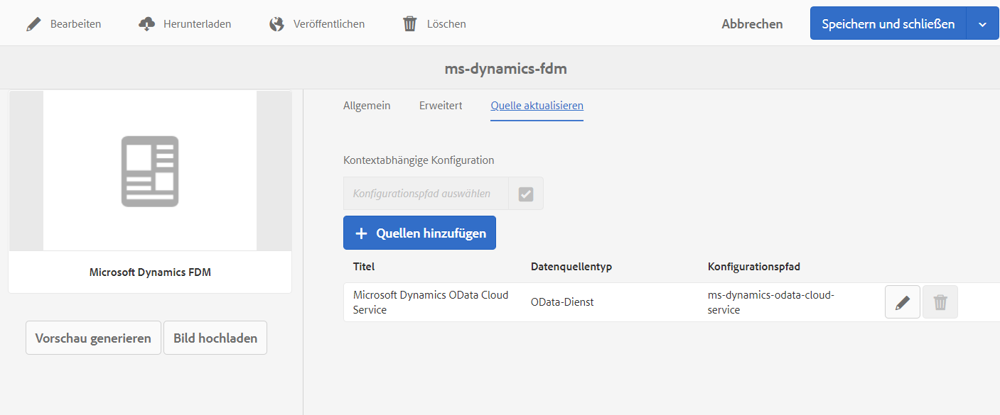

# Erstellen eines Formulardatenmodells (FDM) {#create-form-data-model}

| Version | Artikel-Link |
| -------- | ---------------------------- |
| AEM 6.5 | [Hier klicken](https://experienceleague.adobe.com/docs/experience-manager-65/forms/form-data-model/create-form-data-models.html?lang=de) |
| AEM as a Cloud Service | Dieser Artikel |

Die [!DNL Experience Manager Forms]-Datenintegration bietet eine intuitive Benutzeroberfläche zum Erstellen von und Arbeiten mit Formulardatenmodellen. Ein Formulardatenmodell (FDM) stützt sich auf Datenquellen für den Austausch von Daten. Sie können jedoch ein Formulardatenmodell (FDM) mit oder ohne Datenquelle erstellen. Je nachdem, ob Sie Datenquellen konfiguriert haben, gibt es zwei Möglichkeiten, ein Formulardatenmodell zu erstellen:

* **Vorkonfigurierte Datenquellen verwenden**: Wenn Sie Datenquellen wie in [Konfigurieren von Datenquellen](configure-data-sources.md) beschrieben konfiguriert haben, können Sie diese beim Erstellen eines Formulardatenmodells (FDM) auswählen. Es werden alle Datenmodellobjekte, Eigenschaften und Dienste aus den ausgewählten Datenquellen zur Verwendung im Formulardatenmodell (FDM) zur Verfügung gestellt.

* **Ohne Datenquellen**: Wenn Sie keine Datenquellen für Ihr Formulardatenmodell (FDM) konfiguriert haben, können Sie es auch ohne Datenquellen erstellen. Sie können das Formulardatenmodell (FDM) verwenden, um adaptive Formulare <!--and interactive communication--> zu verfassen und sie anhand von Beispieldaten zu testen. Wenn Datenquellen verfügbar sind, können Sie das Formulardatenmodell (FDM) an Datenquellen binden, was sich automatisch in den zugehörigen adaptiven Formularen reflektiert<!--and interactive communications-->.

>[!NOTE]
>
>Sie müssen Mitglied der beiden Gruppen **fdm-author** und **forms-user** sein, um Formulardatenmodelle (FDM) erstellen und verwenden zu können. Wenden Sie sich an Ihre [!DNL Experience Manager]-Admins, um Mitglied der Gruppen zu werden.

## Erstellen eines Formulardatenmodells (FDM) {#data-sources}

Stellen Sie sicher, dass Sie die Datenquellen konfiguriert haben, die Sie im Formulardatenmodell (FDM) verwenden möchten. Dies wird in [Konfigurieren von Datenquellen](configure-data-sources.md) beschrieben. Gehen Sie folgendermaßen vor, um ein Formulardatenmodell (FDM) basierend auf konfigurierten Datenquellen zu erstellen:

1. Gehen Sie in der [!DNL Experience Manager]-Autoreninstanz zu **[!UICONTROL Formulare > Datenintegration]**.
1. Wählen Sie **[!UICONTROL Erstellen > Formulardatenmodell]**.
1. Im Dialogfeld „Formulardatenmodell erstellen“:

   * Geben Sie einen Namen für das Formulardatenmodell (FDM) an.
   * (**Optional**) Geben Sie Titel, Beschreibung und Tags für das Formulardatenmodell (FDM) an.
   * (**Optional und nur anwendbar, wenn Datenquellen konfiguriert sind**) Wählen Sie das Häkchensymbol neben dem Feld **[!UICONTROL Datenquellenkonfiguration]** und dann den Konfigurationsknoten aus, in dem sich die Cloud-Services für die Datenquellen befinden, die verwendet werden sollen. Das beschränkt die Liste der Datenquellen, die auf der nächsten Seite zur Auswahl stehen, auf diejenigen, die im ausgewählten Konfigurationsknoten verfügbar sind. [!DNL Experience Manager]-Benutzerprofildatenquellen werden jedoch standardmäßig aufgelistet. Wenn Sie keinen Konfigurationsknoten auswählen, werden Datenquellen von allen Konfigurationsknoten angezeigt.

1. Wählen Sie **[!UICONTROL Weiter]** aus.

1. (**Trifft nur zu, wenn Datenquellen konfiguriert sind**) Der Bildschirm **[!UICONTROL Datenquelle auswählen]** listet verfügbare Datenquellen auf, falls vorhanden. Wählen Sie Datenquellen aus, die Sie im Formulardatenmodell verwenden möchten.
1. Wählen Sie **[!UICONTROL Erstellen]** und dann im Bestätigungsdialogfeld **[!UICONTROL Öffnen]**, um den Formulardatenmodelleditor zu öffnen.

   Im Folgenden werden die verschiedenen Komponenten der Benutzeroberfläche im Formulardatenmodelleditor beschrieben.

   ![Ein Formulardatenmodell mit drei Datenquellen: einem RESTful-Service, einem [!DNL Experience Manager]-Benutzerprofil und einem RDBMS](assets/fdm-ui.png)

   A. **[!UICONTROL Datenquellen]**: Listet Datenquellen in einem Formulardatenmodell auf. Erweitern Sie eine Datenquelle, um ihre Datenmodellobjekte und Services anzuzeigen.

   B. **[!UICONTROL Datenquellendefinitionen aktualisieren]**: Ruft alle Änderungen in den Datenquellendefinitionen aus den konfigurierten Datenquellen ab und aktualisiert sie in der Registerkarte „Data Sources“ des Formulardatenmodelleditors.

   C. **[!UICONTROL Modell]**: Inhaltsbereich, in dem hinzugefügte Datenmodellobjekte erscheinen.

   D. **[!UICONTROL Dienste]**: Inhaltsbereich, in dem hinzugefügte Datenquellenvorgänge oder -Services angezeigt werden.

   E. **[!UICONTROL Symbolleiste]**: Tools zum Arbeiten mit einem Formulardatenmodell (FDM). Die Symbolleiste zeigt mehr Optionen, abhängig vom ausgewählten Objekt im Formulardatenmodell (FDM).

   F. **[!UICONTROL Ausgewählte hinzufügen]**: Fügt die ausgewählten Datenmodellobjekte und Services zum Formulardatenmodell hinzu.

Weitere Informationen zum Formulardatenmodell-Editor und dazu, wie Sie mit ihm das Formulardatenmodell (FDM) bearbeiten und konfigurieren können, finden Sie unter [Arbeiten mit einem Formulardatenmodell](work-with-form-data-model.md).

## Aktualisieren von Datenquellen {#update}

Führen Sie folgende Schritte aus, um Datenquellen zu einem vorhandenen Formulardatenmodell (FDM) hinzuzufügen oder sie zu aktualisieren.

1. Navigieren Sie zu **[!UICONTROL Formulare > Datenintegrationen]**, wählen Sie das Formulardatenmodell (FDM) aus, dem Sie Datenquellen hinzufügen oder in dem Sie sie aktualisieren möchten, und wählen Sie dann **[!UICONTROL Eigenschaften]**.
1. Wechseln Sie in den Eigenschaften des Formulardatenmodells zur Registerkarte **[!UICONTROL Quelle aktualisieren]**.

   Auf der Registerkarte **[!UICONTROL Quelle aktualisieren]**:

   * Klicken Sie auf das Symbol „Durchsuchen“ im Feld **[!UICONTROL Kontextabhängige Konfiguration]** und wählen Sie einen Konfigurationsknoten aus, in dem sich die Cloud-Konfiguration für die hinzuzufügende Datenquelle befindet. Wenn Sie keinen Knoten auswählen, werden nur Cloud-Konfigurationen im Knoten `global` aufgelistet, wenn Sie **[!UICONTROL Quellen hinzufügen]** auswählen.

   * Um eine neue Datenquelle hinzuzufügen, wählen Sie **[!UICONTROL Quellen hinzufügen]** und dann die Datenquellen aus, die dem Formulardatenmodell (FDM) hinzugefügt werden sollen. Alle in `global` konfigurierten Datenquellen und ggf. der ausgewählte Konfigurationsknoten werden angezeigt.

   * Um eine vorhandene Datenquelle durch eine andere Datenquelle desselben Typs zu ersetzen, wählen Sie das Symbol **[!UICONTROL Bearbeiten]** für die Datenquelle und dann diese Datenquelle aus der Liste der verfügbaren Datenquellen aus.
   * Um eine vorhandene Datenquelle zu löschen, wählen Sie das Symbol **[!UICONTROL Löschen]** für die Datenquelle aus. Das Symbol „Löschen“ ist deaktiviert, wenn ein Datenmodellobjekt in der Datenquelle im Formulardatenmodell (FDM) hinzugefügt wird.

     

1. Wählen Sie **[!UICONTROL Speichern und schließen]** aus, um die Aktualisierungen zu speichern.

>[!NOTE]
>
>Nachdem Sie neue Datenquellen hinzugefügt oder vorhandene Datenquellen in einem Formulardatenmodell (FDM) aktualisiert haben, müssen Sie die Bindungsreferenzen in adaptiven Formularen<!--and interactive communications--> aktualisieren, die das aktualisierte Formulardatenmodell (FDM) verwenden.

## Kontextabhängige Konfigurationen für bestimmte Ausführungsmodi {#runmode-specific-context-aware-config}

Das [!UICONTROL Formulardatenmodell (FDM)] nutzt [kontextabhängige Konfigurationen von Sling](https://experienceleague.adobe.com/docs/experience-manager-core-components/using/developing/context-aware-configs.html?lang=de), um verschiedene Datenquellenparameter für die Verbindung mit Datenquellen für verschiedene [!DNL Experience Manager]-Ausführungsmodi zu unterstützen.

Wenn das [!UICONTROL Formulardatenmodell (FDM)] Cloud-Konfigurationen zum Speichern von Parametern verwendet, die beim Einchecken und Bereitstellen über die Versionskontrolle (Cloud Manager GIT-Repository) eine Cloud-Konfiguration mit denselben Parametern für alle Ausführungsmodi (Entwicklung, Staging und Produktion) erstellen. Für Anwendungsfälle, in denen unterschiedliche Datensätze für Test- und Produktionsumgebungen benötigt werden, verwenden wir jedoch Datenquellenparameter (z. B. die Datenquellen-URL) für unterschiedliche [!DNL Experience Manager]-Ausführungsmodi.

Dazu müssen Sie eine OSGi-Konfiguration erstellen, die Datenquellenparameter-Wert-Paare enthält. Dadurch wird dasselbe Paar aus der [!UICONTROL Formulardatenmodell(FDM)]-Cloud-Konfiguration zur Laufzeit überschrieben. Da die OSGi-Konfigurationen diese Ausführungsmodi standardmäßig unterstützen, können Sie einen Datenquellenparameter basierend auf dem Ausführungsmodus in andere Werte überschreiben.

So aktivieren Sie bereitstellungsspezifische Cloud-Konfigurationen im [!UICONTROL Formulardatenmodell (FDM)]:

1. Erstellen Sie die Cloud-Konfiguration auf der lokalen Entwicklungsinstanz. Ausführliche Anweisungen finden Sie unter [Konfigurieren von Datenquellen](/help/forms/configure-data-sources.md).

1. Speichern Sie Ihre Cloud-Konfiguration im Dateisystem.
   1. Erstellen Sie mithilfe des Filters `/conf/{foldername}/settings/cloudconfigs/fdm` ein Paket. Verwenden Sie denselben `{foldername}` wie in Schritt 1 und ersetzen Sie für die Azure Storage-Konfiguration `fdm` mit `azurestorage`.
   1. Erstellen Sie das Paket und laden Sie es herunter. Weitere Informationen finden Sie unter [Paketaktionen](/help/implementing/developing/tools/package-manager.md).

1. Integrieren Sie die Cloud-Konfiguration in den [!DNL Experience Manager]-Projektarchetyp.
   1. Entpacken Sie das heruntergeladene Paket.
   1. Kopieren Sie den Ordner `jcr_root` und legen Sie ihn in `ui.content` > `src` > `main` > `content` ab.
   1. Aktualisieren Sie `ui.content` > `src` > `main` > `content` > `META-INF` > `vault` > `filter.xml`, sodass der Filter `/conf/{foldername}/settings/cloudconfigs/fdm` enthalten ist. Weitere Informationen finden Sie unter [ui.content-Modul des AEM-Projektarchetyps](https://experienceleague.adobe.com/docs/experience-manager-core-components/using/developing/archetype/uicontent.html?lang=de). Wenn dieser Projektarchetyp über die CM-Pipeline bereitgestellt wird, wird dieselbe Cloud-Konfiguration in allen Umgebungen (oder Ausführungsmodi) installiert. Um den Wert von Feldern (wie URL) von Cloud-Konfigurationen basierend auf der Umgebung zu ändern, verwenden Sie die OSGi-Konfiguration, die im folgenden Schritt behandelt wird.

1. Erstellen Sie eine kontextabhängige Apache Sling-Konfiguration. So erstellen Sie die OSGi-Konfiguration:
   1. **Richten Sie die OSGi-Konfigurationsdateien im [!DNL Experience Manager]-Projektarchetypen ein.**
Erstellen von OSGi-Werkskonfigurationsdateien mit PID `org.apache.sling.caconfig.impl.override.OsgiConfigurationOverrideProvider`. Erstellen Sie eine Datei mit demselben Namen unter jedem Ausführungsmodusordner, in dem die Werte pro Ausführungsmodus geändert werden müssen. Weitere Informationen finden Sie unter [Konfigurieren von OSGi für [!DNL Adobe Experience Manager]](/help/implementing/deploying/configuring-osgi.md#creating-sogi-configurations).

   1. **Legen Sie das OSGi-Konfigurations-JSON fest.** So verwenden Sie den Apache Sling Context-Aware Configuration Override Provider (kontextabhängiger Apache Sling-Konfigurationsüberschreibungs-Anbieter):
      1. Wählen Sie in `/system/console/configMgr` der lokalen Entwicklungsinstanz die werkseitige OSGi-Konfiguration mit dem Namen **[!UICONTROL Apache Sling Context-Aware Configuration Override Provider: OSGi-Konfiguration]** aus.
      1. Geben Sie eine Beschreibung an.
      1. Wählen Sie **[!UICONTROL aktiviert]** aus.
      1. Geben Sie unter Überschreibungen Felder an, die basierend auf der Umgebung in der Sling-Überschreibungssyntax geändert werden müssen. Weitere Informationen finden Sie unter [Kontextabhängige Konfiguration von Apache Sling – Überschreiben](https://sling.apache.org/documentation/bundles/context-aware-configuration/context-aware-configuration-override.html#override-syntax). Beispiel: `cloudconfigs/fdm/{configName}/url="newURL"`.
Mehrere Überschreibungen können durch die Auswahl von **[!UICONTROL +]** hinzugefügt werden.
      1. Klicken Sie auf **[!UICONTROL Speichern]**.
      1. Um die JSON-Datei für die OSGi-Konfiguration abzurufen, führen Sie die Schritte unter [Generieren von OSGi-Konfigurationen mithilfe des AEM-SDK-Schnellstarts](/help/implementing/deploying/configuring-osgi.md#generating-osgi-configurations-using-the-aem-sdk-quickstart) aus.
      1. Platzieren Sie das JSON in den OSGi-Werkskonfigurationsdateien, die im vorherigen Schritt erstellt wurden.
      1. Ändern Sie den Wert von `newURL` basierend auf der Umgebung (oder dem Ausführungsmodus).
      1. Um den geheimen Wert basierend auf dem Ausführungsmodus zu ändern, kann die geheime Variable mithilfe der [Cloud Manager-API](/help/implementing/deploying/configuring-osgi.md#cloud-manager-api-format-for-setting-properties) erstellt und später in der [OSGi-Konfiguration](/help/implementing/deploying/configuring-osgi.md#secret-configuration-values) referenziert werden.
Wenn dieser Projektarchetyp über die CM-Pipeline bereitgestellt wird, liefert das Überschreiben unterschiedliche Werte für verschiedene Umgebungen (oder den Ausführungsmodus).

      >[!NOTE]
      >
      >Benutzende von [!DNL Adobe Managed Service] können die geheimen Werte mithilfe der Kryptounterstützung verschlüsseln (weitere Informationen finden Sie unter [Verschlüsselungsunterstützung für Konfigurationseigenschaften](https://experienceleague.adobe.com/docs/experience-manager-65/administering/security/encryption-support-for-configuration-properties.html?lang=de#enabling-encryption-support)) und verschlüsselten Text in den Wert einfügen, sobald [kontextabhängige Konfigurationen in Service Pack 6.5.13.0 verfügbar sind](https://experienceleague.adobe.com/docs/experience-manager-65/forms/form-data-model/create-form-data-models.html?lang=de#runmode-specific-context-aware-config).

1. Aktualisieren Sie die Datenquellendefinitionen mithilfe der Option zum Aktualisieren von Datenquellendefinitionen im [Formulardatenmodell-Editor](#data-sources), um den FDM-Cache über die FDM-Benutzeroberfläche zu aktualisieren und die neueste Konfiguration zu erhalten.

## Nächste Schritte {#next-steps}

Sie haben jetzt ein Formulardatenmodell (FDM), dem Datenquellen hinzugefügt wurden. Als Nächstes können Sie das Formulardatenmodell (FDM) bearbeiten, um Datenmodellobjekte und Dienste hinzuzufügen und zu konfigurieren, Verknüpfungen zwischen Datenmodellobjekten hinzuzufügen, Eigenschaften zu bearbeiten, benutzerdefinierte Datenmodellobjekte und -eigenschaften hinzuzufügen und Beispieldaten zu generieren.

Weitere Informationen finden Sie unter [Arbeiten mit einem Formulardatenmodell](work-with-form-data-model.md).

>[!MORELIKETHIS]
>
>* [Verwenden eines Formulardatenmodells (FDM)](/help/forms/using-form-data-model.md)