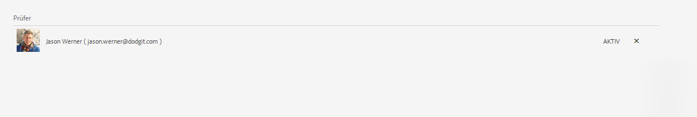
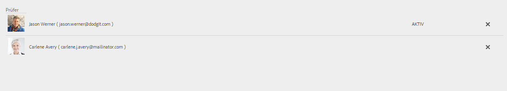

# Erstellen und Verwalten von Überprüfungen in Formularen{#creating-and-managing-reviews-to-forms}

 Adobe empfiehlt, die modernen und erweiterbaren [Kernkomponenten](https://experienceleague.adobe.com/docs/experience-manager-core-components/using/adaptive-forms/introduction.html?lang=de) zur Datenerfassung zu verwenden, um [neue adaptive Formulare zu erstellen](/help/forms/creating-adaptive-form-core-components.md) oder [adaptive Formulare zu AEM Sites-Seiten hinzuzufügen](/help/forms/create-or-add-an-adaptive-form-to-aem-sites-page.md). Diese Komponenten stellen einen bedeutenden Fortschritt bei der Erstellung adaptiver Formulare dar und sorgen für beeindruckende Benutzererlebnisse. In diesem Artikel wird ein älterer Ansatz zum Erstellen von adaptiven Formularen mithilfe von Foundation-Komponenten beschrieben. 

| Version | Artikel-Link |
| -------- | ---------------------------- |
| AEM 6.5 | [Hier klicken](https://experienceleague.adobe.com/docs/experience-manager-65/forms/adaptive-forms-advanced-authoring/create-reviews-forms.html?lang=de) |
| AEM as a Cloud Service | Dieser Artikel |

## Überprüfung {#review}

Bei einer Überprüfung handelt es sich um einen Mechanismus, mit dem ein oder mehrere Überprüfungspersonen zu Formularen Kommentare abgeben können.

## Einrichten einer Überprüfung {#setting-up-a-review}

1. Navigieren Sie zum Formular-Browser und wählen Sie ein zu überprüfendes Formular aus.
1. Wenn für das Formular keine Überprüfung im Gange ist, erscheint das Symbol **Überprüfung starten**  in der Aktionsleiste. Klicken Sie auf das Symbol **Überprüfung starten** .
1. Geben Sie folgende Informationen ein:

   * **Titel**: obligatorisch, kann alphanumerische Zeichen, Bindestriche und Unterstriche enthalten.
   * **Beschreibung**: optional, Beschreibung des Zwecks/Inhalts der Überprüfung.
   * **Frist**: optional, das Datum, an dem die Überprüfung beendet sein soll. Wenn die Frist bereits abgelaufen ist, wird die Aufgabe als „überfällig“ angezeigt.
   * **Name der Überprüfungsperson**: Es ist mindestens ein Name erforderlich. Verwenden Sie das Kombinationsfeld, um Überprüfungspersonen hinzuzufügen, indem Sie eine Namensliste mit allen übereinstimmenden Namen eingeben, einen Namen auswählen und auf **Hinzufügen** klicken. Im nächsten Abschnitt der Registerkarte **Prüfer** werden die Namen aller Prüfenden angezeigt.

1. Klicken Sie auf **Start**, um eine Überprüfung zu starten.

   >[!NOTE]
   >
   >* Admins können auf alle Gruppen zugreifen, die mit den Formularbenutzenden verknüpft sind.
   >* Die Gruppe der Dienstbenutzenden steht für die Überprüfung nicht zur Auswahl.

### Aktionen beim Einrichten von Überprüfungen {#actions-that-occur-when-a-review-is-set-up}

In diesem Abschnitt wird beschrieben, was passiert, wenn eine Überprüfung erstellt bzw. eingerichtet wird.

1. Eine neue Überprüfungsaufgabe wird erstellt und dem/der ausgewählten Überprüfenden zugewiesen.
1. Allen Reviewern wird eine Überprüfungsaufgabe zugeteilt. Die Aufgabe wird in ihrem Benachrichtigungsabschnitt angezeigt. Reviewer können auf eine Benachrichtigung klicken oder zum Posteingang wechseln, um die Aufgabe anzuzeigen. Reviewer können per Klick die Überprüfungsaufgabe öffnen, das Formular anzeigen und Kommentare hinzufügen.

   

   Warnung bei Reviewerbenachrichtigungen

1. Das Kommentarfeld ist für die Überprüfungspersonen des Formulars zugänglich. Andere können die Kommentare zwar lesen, aber keine eigenen hinzufügen.

## Verwalten einer Überprüfung {#managing-a-review}

>[!NOTE]
>
>* Nur laufende Überprüfungen können geändert werden.
>* Abgeschlossene Überprüfungen können nicht geändert werden.

1. Gehen Sie zur Registerkarte „Formulare“ und wählen Sie ein Formular aus.

1. Wenn für ein Formular eine Überprüfung im Gange ist und Sie die Person sind, die die Überprüfung initiiert hat, erscheint ein Symbol **Überprüfung verwalten**  in der Aktionsleiste. Nur die Person, die die Überprüfung initiiert hat, kann die Überprüfung verwalten (aktualisieren/beenden).

   Klicken Sie auf das Symbol **Überprüfung verwalten** .

   Für Benutzende, die nicht die Initiatorin bzw. der Initiator sind, ist das Symbol zum Verwalten von Überprüfungen deaktiviert.

1. Es wird nun ein Bildschirm mit den folgenden Informationen angezeigt:

   * **Überprüfungsname**: Kann nicht bearbeitet werden.

   * **Überprüfungsbeschreibung**: Kann bearbeitet werden.

   * **Überprüfungstermin**: Kann bearbeitet werden. Die Werte für Datum und Uhrzeit des Termins können geändert werden, wenn sie in der Zukunft liegen.

   * **Reviewer**: Kann bearbeitet werden. Sie können Reviewer hinzufügen oder entfernen. Wenn eine Aufgabe überfällig ist, können Sie Reviewer erst hinzufügen, wenn Sie den Termin verlängern und er über das aktuelle Datum hinausgeht.

1. Um die Überprüfung zu beenden, klicken Sie auf **Beenden**.

### Aktionen beim Ändern einer Überprüfung {#actions-that-occur-when-a-review-is-modified}

Dieser Abschnitt beschreibt, was beim **Aktualisieren/Beenden einer Überprüfung** geschieht:

1. Wenn die Überprüfungsbeschreibung geändert wird, wird die entsprechende Aufgabe der Überprüfungspersonen und der initiierenden Person aktualisiert.
1. Wenn der Überprüfungstermin geändert wird, wird die entsprechende Aufgabe der Überprüfungspersonen mit dem neuen Datum aktualisiert.

1. Wenn ein Reviewer entfernt wird:

   

   Entfernen eines Reviewers

   1. Wenn die zugewiesene Aufgabe unvollständig ist, wird sie beendet.
   1. Der/die Überprüfende kann das Formular nicht mehr kommentieren.

1. Wenn ein Reviewer hinzugefügt wird:

   

   Hinzufügen eines Reviewers

   1. Eine Überprüfungsaufgabe wird erstellt und dem neu hinzugefügten Reviewer zugewiesen.
   1. Der/die neu hinzugefügte Überprüfende kann Kommentare zum Formular hinzufügen.

1. Wenn eine Überprüfung abgeschlossen wird:

   1. **Reviewer**: Bei allen Reviewern werden zugewiesene unvollständige Aufgaben beendet. Die Aufgabe wird im Benachrichtigungsabschnitt des Reviewers nicht mehr als „Ausstehend“ angezeigt.
   1. **Initiator**: Die dem Initiator der Überprüfung zugewiesene Aufgabe wird als abgeschlossen markiert. Die Aufgabe wird aus dem Benachrichtigungsabschnitt des Initiators von Überprüfungen entfernt.
   1. **Alle**: Die Überprüfung wird im Abschnitt für die vorherigen Überprüfungen angezeigt. Es können keine weiteren Kommentare hinzugefügt werden.

   
