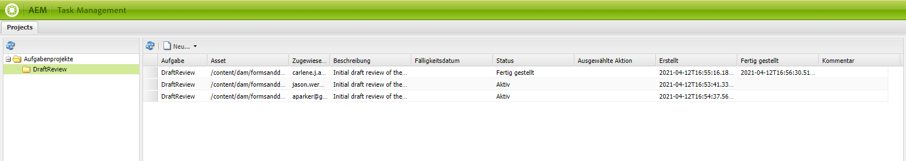

# Erstellen und Verwalten von Assetüberprüfungen in Formularen {#creating-and-managing-reviews-for-assets-in-forms}

## Überprüfung {#review}

Bei einer Überprüfung handelt es sich um einen Mechanismus, bei dem mindestens ein Prüfer Assets kommentieren kann, die in einem Formular verfügbar sind.

## Einrichten einer Überprüfung {#setting-up-a-review}

1. Gehen Sie zur Registerkarte „Formulare“ und wählen Sie ein Formular aus.
1. Wenn für das Asset derzeit keine Überprüfung durchgeführt wird, wird in der Aktionsleiste das Symbol  zum Starten einer Überprüfung angezeigt. Klicken Sie auf das Symbol zum Starten einer Überprüfung ().
1. Geben Sie folgende Informationen ein:

   * Überprüfungsname (erforderlich): Darf alphanumerische Zeichen, Bindestriche oder Unterstriche enthalten.
   * Überprüfungsbeschreibung (optional): Beschreibung des Zwecks/Inhalts der Überprüfung.
   * Überprüfungstermin (optional): Datum, an dem die Überprüfung beendet wird. Wenn der Termin bereits abgelaufen ist, wird die Aufgabe als „überfällig“ angezeigt.
   * Reviewer: Es muss mindestens ein Reviewer angegeben werden. Verwenden Sie das Kombinationsfeld, um Reviewer hinzuzufügen. Beim Eingeben eines Namens werden alle passenden Namen angezeigt. Wählen Sie einen Namen aus und klicken Sie auf „Hinzufügen“.

1. Füllen Sie alle weiteren Details und klicken Sie dann auf „Start“.

### Aktionen beim Einrichten von Überprüfungen {#actions-that-occur-when-a-review-is-set-up}

In diesem Abschnitt wird beschrieben, was passiert, wenn eine Überprüfung erstellt bzw. eingerichtet wird.

1. Eine neue Überprüfungsaufgabe wird erstellt und dem Initiator der Überprüfung zugewiesen.
1. Allen Reviewern wird eine Überprüfungsaufgabe zugeteilt. Die Aufgabe wird in ihrem Benachrichtigungsabschnitt angezeigt. Reviewer können auf eine Benachrichtigung klicken oder zum Posteingang wechseln, um die Aufgabe anzuzeigen. Reviewer können per Klick die Überprüfungsaufgabe öffnen, das Formular anzeigen und Kommentare hinzufügen.

   

   Warnung bei Reviewerbenachrichtigungen

1. Das Kommentarfeld ist für den Initiator und die Reviewer der Assets verfügbar. Andere können die Kommentare anzeigen, jedoch keine Kommentare schreiben.

## Verwalten einer Überprüfung {#managing-a-review}

>[!NOTE]
>
>Es können nur Überprüfungen geändert werden, die noch nicht abgeschlossen sind. Abgeschlossene Überprüfungen können nicht geändert werden.

1. Gehen Sie zur Registerkarte „Formulare“ und wählen Sie ein Formular aus.

1. Wenn bei einem Asset eine Überprüfung in Bearbeitung ist und Sie der Initiator der Überprüfung sind, wird in der Aktionsleiste das Symbol  zum Verwalten von Überprüfungen angezeigt. Nur Initiatoren von Überprüfungen können die Überprüfung verwalten (aktualisieren/beenden).

   Klicken Sie auf das Symbol  zum Verwalten der Überprüfung.

   Für Benutzer, die nicht der Initiator sind, ist das Symbol zum Verwalten von Überprüfungen deaktiviert.

1. Es wird ein Bildschirm mit folgenden Informationen anzeigt:

   * **Überprüfungsname**: Kann nicht bearbeitet werden.

   * **Überprüfungsbeschreibung**: Kann bearbeitet werden.

   * **Überprüfungstermin**: Kann bearbeitet werden. Die Werte für Datum und Uhrzeit des Termins können geändert werden, wenn sie in der Zukunft liegen.

   * **Reviewer**: Kann bearbeitet werden. Sie können Reviewer hinzufügen oder entfernen. Wenn eine Aufgabe überfällig ist, können Sie Reviewer erst hinzufügen, wenn Sie den Termin verlängern und er über das aktuelle Datum hinausgeht.

1. Bearbeiten Sie die erforderlichen Felder und klicken Sie dann auf „Aktualisieren“.

   

   Überprüfen des aktualisierten Status im Task Manager

1. Zum Beenden der Überprüfung klicken Sie auf „Beenden“.

### Aktionen beim Bearbeiten einer Überprüfung {#actions-that-occur-when-a-review-is-modified}

In diesem Abschnitt wird beschrieben, was beim Beenden/Bearbeiten von Überprüfungen passiert:

1. Wenn die Überprüfungsbeschreibung geändert wird, wird die entsprechende Aufgabe der Reviewer und des Initiators aktualisiert.
1. Wenn der Überprüfungstermin geändert wird, wird die entsprechende Aufgabe der Reviewer mit dem neuen Datum aktualisiert.

1. Wenn ein Reviewer entfernt wird:

   

   Entfernen eines Reviewers

   1. Falls die zugewiesene Aufgabe unvollständig ist, wird sie beendet.
   1. Der Reviewer kann das Asset nicht mehr kommentieren.

1. Wenn ein Reviewer hinzugefügt wird:

   

   Hinzufügen eines Reviewers

   1. Eine Überprüfungsaufgabe wird erstellt und dem neu hinzugefügten Reviewer zugewiesen.
   1. Der neu hinzugefügte Reviewer kann dem Asset Kommentare hinzufügen.

1. Wenn eine Überprüfung abgeschlossen wird:

   1. **Reviewer**: Bei allen Reviewern werden zugewiesene unvollständige Aufgaben beendet. Die Aufgabe wird im Benachrichtigungsabschnitt des Reviewers nicht mehr als „Ausstehend“ angezeigt.
   1. **Initiator**: Die dem Initiator der Überprüfung zugewiesene Aufgabe wird als abgeschlossen markiert. Die Aufgabe wird aus dem Benachrichtigungsabschnitt des Initiators von Überprüfungen entfernt.
   1. **Alle**: Die Überprüfung wird im Abschnitt für die vorherigen Überprüfungen angezeigt. Es können keine weiteren Kommentare hinzugefügt werden.

