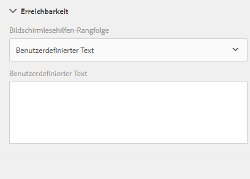
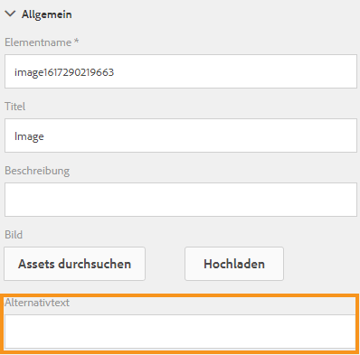

# Erstellen barrierefreier adaptiver Formulare{#creating-accessible-adaptive-forms}

## Einführung {#introduction}

Ein barrierefreies Formular ist ein Formular, das jeder verwenden kann, einschließlich Benutzer mit Behinderungen. Adaptive Formulare verfügen über eine Reihe von Merkmalen und Funktionen, die die Benutzerfreundlichkeit für Benutzer mit unterschiedlichen Fähigkeiten verbessern. Die Integration von Barrierefreiheit in adaptive Formulare macht Inhalte nicht nur für die größtmögliche Zielgruppe zugänglich, sondern stellt auch eine Anforderung dar, wenn Dokumente in Regionen bereitgestellt werden müssen, in denen die Einhaltung von Barrierefreiheitsstandards obligatorisch ist. Mit [!DNL AEM Forms] können Formularentwickler die Barrierefreiheitsstandards einhalten.

Beim Verfassen eines adaptiven Formulars müssen Autoren die folgenden Punkte berücksichtigen, um barrierefreie adaptive Formulare zu erstellen:

* Überprüfen des Formulars mit dem Barrierefreiheits-Test-Tool ANDI (Accessible Name and Description Inspector)
* Angabe von angemessenen Beschriftungen für Formularsteuerelemente
* Angabe von Textäquivalenten für Bilder
* Sicherstellen von ausreichendem Farbkontrast
* Sicherstellen, dass Formularsteuerelemente mit der Tastatur aufgerufen werden können

## Voraussetzung

Sie benötigen ein Barrierefreiheits-Tool wie **ANDI (Accessible Name and Description Inspector)** und ein **adaptives Formular-Design, das entwickelt wurde, um Barrierefreiheitsprobleme zu beheben**, um ein barrierefreies adaptives Formular zu erstellen.

### Herunterladen und Installieren des Test-Tools für Barrierefreiheit

Das Tool ANDI (Accessible Name and Description Inspector) hilft Ihnen bei der Identifizierung und Behebung von Problemen mit der Barrierefreiheit in Webinhalten. Es ist das empfohlene Tool gemäß den Trusted Tester-Richtlinien v5 des Ministeriums für Innere Sicherheit. Es wurde von der Abteilung „Social Security Administration“ der USA entwickelt, um Webinhalte auf die Einhaltung von Section 508-Anforderungen hin zu überprüfen. Das Tool:

* Hilft bei der Erkennung von Barrierefreiheitsproblemen auf einer Web-Seite
* Macht Vorschläge zur Verbesserung der Barrierefreiheit
* Erkennt Probleme mit der Barrierefreiheit der Tastaturnutzbarkeit und dem Farbkontrast
* Identifiziert eindeutig den Inhalt von Bildschirmlesehilfen gemäß den Standards

ANDI funktioniert mit allen gängigen Internetbrowsern. Detaillierte Anweisungen zum Konfigurieren und Verwenden des Tools finden Sie in der [Dokumentation von ANDI](https://www.ssa.gov/accessibility/andi/help/install.html).

### Herunterladen und Installieren des „Ultramarine-Accessible“-Designs

Das „Ultramarine-Accessible“-Design („Ultramarinblau – Barrierefreiheit“) ist ein Referenzdesign. Es hilft, zu veranschaulichen, wie Sie Farbkontrast- und andere Probleme mit der Barrierefreiheit in einem adaptiven Formular beheben können. Adobe empfiehlt, ein benutzerdefiniertes Design für die Produktionsumgebung zu erstellen, das auf den seitens Ihres Unternehmens zulässigen Stilen basiert. Führen Sie die folgenden Schritte aus, um das Thema in Ihre AEM-Instanz hochzuladen:

1. Laden Sie das Designpaket herunter.
1. Navigieren Sie in Ihrer AEM-Instanz zu **[!UICONTROL Experience Manager]** > **[!UICONTROL Navigation]**  > **[!UICONTROL Formulare]**.
1. Tippen Sie auf **[!UICONTROL Erstellen]** > **[!UICONTROL Datei hochladen]**. Wählen Sie die Datei x Ultramarine-Accessible-Theme.zip aus und laden Sie sie hoch. Das Design wird in Ihre AEM Instanz hochgeladen.

## Gestalten eines barrierefreien adaptiven Formulars

Sie sollten sich auf vier wichtige Aspekte konzentrieren: Tastaturnavigation, Farbkontrast, aussagekräftige Alternativtexte für Bilder und geeignete Beschriftungen für Formularsteuerelemente, um ein adaptives Formular barrierefrei zu gestalten. Führen Sie die folgenden Schritte aus, um das vorhandene adaptive Forms barrierefrei zu machen:

### 1. Anwenden eines barrierefreien Designs und Vornehmen weiterer Korrekturen

Wenden Sie das Design „Ultramarine-Accessible“ auf Ihr vorhandenes adaptives Formular an. So wenden Sie das Design an:

1. Öffnen Sie das adaptive Formular zum Bearbeiten.
1. Wählen Sie eine Komponente aus und tippen Sie auf das übergeordnete Symbol. Tippen Sie im Kontextmenü auf **[!UICONTROL Container für adaptive Formulare]** und dann auf das Symbol „Konfigurieren“.
1. Wählen Sie im Eigenschaftenbrowser das Thema „Ultramarine-barrierefrei“ aus und klicken Sie auf das Symbol **[!UICONTROL Speichern]**.
1. Aktualisieren Sie das Browserfenster. Das Design wird auf das adaptive Formular angewendet.

Nachdem Sie ein barrierefreies Design angewendet haben, führen Sie die folgenden zusätzlichen Korrekturen durch. Die Korrekturen ergänzen die Barrierefreiheitskorrekturen, die anhand des barrierefreien Designs angewandt werden:

1. Fügen Sie einen aussagekräftigen Alternativtext für das Logo-Bild im adaptiven Formular hinzu.

   Geben Sie einen aussagekräftigen Alternativtext für Bilder in den Kopf- und Fußzeilenkomponenten der Vorlage für das adaptive Formular ein. Wenn Sie die Vorlage korrigieren und zum Erstellen eines adaptiven Formulars verwenden, übernimmt das adaptive Formular alle Korrekturen, die im Interesse der Barrierefreiheit an der Kopf- und Fußzeile der Vorlage vorgenommen wurden.  Für ein vorhandenes adaptives Formular nehmen Sie Änderungen auf der Ebene des adaptiven Formulars vor. Änderungen, die an einer Vorlage für adaptive Formulare vorgenommen wurden, werden nicht automatisch in schon vorhandene adaptive Formulare eingespielt.

1. Fügen Sie dem adaptiven Formular eine Überschriftenkomponente hinzu, die den Formularnamen enthält. Wenn Ihr Formularentwurf einen Firmennamen angibt, fügen Sie auch für den Firmennamen eine separate Überschriftenkomponente hinzu.

   Die meisten Barrierefreiheits-Tools informieren Benutzer über die Hierarchie der Inhalte, damit sie die Struktur der Web-Seite besser verstehen. Legen Sie im adaptiven Formular unterschiedliche Überschriftenebenen für den Namen des Unternehmens und den Text mit dem Formularnamen fest, um eine hierarchische Struktur dieser Texte zu erzielen. Verwenden Sie außerdem vor jedem Bereich und Abschnitt eine Textkomponente mit einer entsprechenden Überschriftenebene, um eine Hierarchie zu erstellen.

   

1. Ändern Sie die Hintergrundfarbe der Fußzeile, um einen gemäß den Barrierefreiheitsstandards angemessenen Kontrast zu erhalten, damit der Text besser sichtbar und lesbar wird. Sie können ANDI verwenden, um Probleme mit dem Farbkontrast in Ihrem Formular zu ermitteln. Verwenden Sie auch keine zu kleinen Schriftarten. Kleine Schriftarten sind schwer zu lesen.

1. Ersetzen Sie die Umschalt- und Bildauswahl-Komponenten in Ihrem vorhandenen adaptiven Formular durch die Auswahlkomponente (Optionsfeld).

1. Ersetzen Sie die Komponente „Numerische Schritte“ in einem vorhandenen adaptiven Formular durch die Komponente „Numerisches Feld“.

1. Ersetzen Sie Datumseingabe-Felder durch Datumsauswahl-Felder.

1. Legen Sie Anzeige-, Prüf- und Bearbeitungsmuster für die Datumsauswahl-Komponente fest. Legen Sie außerdem eine benutzerdefinierte Fehlermeldung für den Fall von Prüffehlern fest. Zum Beispiel: „Sie haben ein ungültiges Datum angegeben. Das korrekte Datumsformat lautet TT.MM.JJJJ.“

1. Legen Sie einen benutzerdefinierten barrierefreien Text für die Datumsauswahl-Komponente fest. Zum Beispiel: „Geben Sie Ihr Geburtsdatum ein.“ Bildschirmlesehilfen lesen diese benutzerdefinierten barrierefreien Texte.

1. Verwenden Sie für Komponenten des adaptiven Formulars kurze anstelle langer Beschreibungen. Eine lange Beschreibung fügt die Schaltfläche „Hilfe“ hinzu. Vergewissern Sie sich, dass das adaptive Formular über keine Schaltfläche „Hilfe“ verfügt.

1. Fügen Sie allen schreibgeschützten Tabellenzellen einen benutzerdefinierten barrierefreien Text hinzu. Deaktivieren Sie außerdem alle schreibgeschützten Zellen von Tabellen.

1. Entfernen Sie, sofern vorhanden, Felder für die Freihandeingabe von Unterschriften aus dem adaptiven Formular. Konfigurieren Sie das adaptive Formular so, dass [!DNL Adobe Sign] für problemloses digitales Signieren verwendet wird.

### 2. Angabe von angemessenen Beschriftungen für Formularsteuerelemente {#provide-proper-labels-for-form-controls}

Die Beschriftung oder der Titel einer Komponente gibt an, was die Formularkomponente darstellt. Beispiel: Der Text „Vorname“ weist darauf hin, dass der Benutzer seinen Vornamen in ein Textfeld eingeben muss. Damit die Beschriftung von Bildschirmlesegeräten erkannt werden kann, wird sie programmgesteuert mit einer Formularkomponente verknüpft. Alternativ dazu kann das Formularsteuerelement mit zusätzlichen Barrierefreiheitsinformationen konfiguriert werden.

Die Beschriftung, die von Bildschirmlesegeräten erkannt wird, muss nicht unbedingt mit der visuellen Beschriftung identisch sein. In einigen Fällen möchten Sie den Zweck des Steuerelements möglicherweise genauer angeben. Für jedes Feldobjekt in einem Formular können die Barrierefreiheitsoptionen verwendet werden, um anzugeben, wie das Bildschirmlesegerät das entsprechende Formularfeld identifiziert.

Gehen Sie wie folgt vor, um die Barrierefreiheitsoptionen zu verwenden:

1. Wählen Sie eine Komponente aus und tippen Sie auf .
1. Klicken Sie in der Seitenleiste auf **[!UICONTROL Ein-/Ausgabehilfe]**, um die gewünschte Barrierefreiheitsoption auszuwählen.

### Barrierefreiheitsoptionen in Formularkomponenten {#accessibility-options-in-form-components}

**Eigener Text** Formularautoren geben den Inhalt im Textfeld „Eigener Text“ der Barrierefreiheitsoptionen an. Die Hilfstechnologie, wie Bildschirmlesegeräte, verwendet diesen benutzerdefinierten Text. In den meisten Szenarien ist die Verwendung der Einstellung „Titel“ die beste Option. Sie sollten nur dann benutzerdefinierten Text für Bildschirmlesegeräte erstellen, wenn die Option „Titel“ oder eine Kurzbeschreibung nicht möglich ist.

**Kurzbeschreibung** Bei den meisten Komponenten wird die Kurzbeschreibung zur Laufzeit angezeigt, wenn der Benutzer den Mauszeiger über die Komponente hält. Sie können diese Option im Feld „Kurzbeschreibung“ unter der Option für den Hilfeinhalt festlegen.

**Titel**[!DNL AEM Forms] Verwenden Sie diese Option, damit die visuelle Beschriftung, die mit dem Formularfeld verknüpft ist, als Text für Bildschirmlesegeräte verwendet wird.

**Name** Sie können einen Wert im Feld „Name“ auf der Registerkarte „Bindung“ angeben. Der Name darf keine Leerzeichen enthalten.

**Kein** Bei Auswahl von „Kein“ verfügt das Formularobjekt im veröffentlichten Formular über keinen Namen. Die Einstellung „Kein“ empfiehlt sich nicht für Formularsteuerelemente.

>[!NOTE]
>
>* Optionsfelder und Kontrollkästchen können nur zwei Optionen für die Barrierefreiheit aufweisen, nämlich „Eigener Text“ und „Titel“.
>* Bei XFA-basierten adaptiven Formularen wird die Barrierefreiheitsoption von den in der XDP festgelegten Barrierefreiheitsoptionen übernommen. QuickInfo von XDP werden der Kurzbeschreibung zugeordnet, und die Beschriftung wird dem Titel zugeordnet. Die anderen Optionen bleiben gleich.

### 3. Angabe von Textäquivalenten für Bilder {#provide-text-equivalents-for-images}

Durch Bilder können einigen Benutzern Aspekte veranschaulicht werden. Für Benutzer, die Bildschirmlesegeräte verwenden, verringern Bilder allerdings die Barrierefreiheit Ihres Formulars. Wenn Sie Bilder verwenden möchten, sollten Sie Textbeschreibungen für alle Bilder angeben.

Stellen Sie sicher, dass der Text das Objekt und seinen Zweck im Formular beschreibt. Ein Bildschirmlesegerät liest den alternativen Text, wenn ein Bild auftritt. Für jedes Bild muss ein alternativer Text angegeben sein.

Wählen Sie eine Bildkomponente aus und tippen Sie auf . Geben Sie in der Seitenleiste unter „Eigenschaften“ einen Alternativtext für ein Bild ein.

### 4. Sicherstellen von ausreichendem Farbkontrast {#provide-sufficient-color-contrast}

Bei Barrierefreiheits-Designs müssen zusätzliche Richtlinien zur Farbverwendung beachtet werden. Formularautoren können Farben verwenden, um das Erscheinungsbild von Formularen zu verbessern, indem sie verschiedene Formularkomponenten hervorheben. Bei einer falschen Farbnutzung kann ein Formular allerdings für Personen mit unterschiedlichen Fähigkeiten schwieriger oder gar nicht lesbar werden.

Sehbehinderte Benutzer sind auf einen hohen Kontrast zwischen Text und Hintergrund angewiesen, um digitale Inhalte lesen zu können. Ohne ausreichend Kontrast kann ein Formular für einige Benutzern schwieriger oder überhaupt nicht zu lesen sein.

Es wird empfohlen, dass Sie die Standardschrift und -hintergrundfarben verwenden: Inhalt in schwarzer Farbe auf einem weißen Hintergrund. Wenn Sie die Standardfarben ändern, wählen Sie entweder eine dunkle Vordergrundfarbe auf einer hellen Hintergrundfarbe oder umgekehrt.

<!-- See [Creating custom themes for Adaptive Forms](creating-custom-adaptive-form-themes.md), for more information about changing the color contrast and theme for the Adaptive Forms. -->

### 5. Sicherstellen, dass Formularsteuerelemente mit der Tastatur aufgerufen werden können {#ensure-that-form-controls-are-keyboard-accessible}

Ein barrierefreies Formular kann vollständig mit nur der Tastatur oder einem ähnlichen Eingabegerät ausgefüllt werden. Benutzer mit eingeschränkter Mobilität bzw. Sehfähigkeit haben möglicherweise keine andere Wahl, als die Tastatur zu nutzen, und viele Benutzer, die eine Maus verwenden könnten, ziehen es vor, Eingaben per Tastatur vorzunehmen. Indem Sie mehrere Eingabeverfahren ermöglichen, erstellen Sie Formulare, die nicht nur barrierefrei sind, sondern auch den Vorlieben aller Benutzer entgegenkommen.

Die folgenden Tastaturbefehle sind in [!DNL AEM Forms] verfügbar.

| Aktion | Tastaturbefehl |
|---|---|
| Den Cursor in einem Formular vorwärts bewegen | Tab |
| Den Cursor in einem Formular rückwärts bewegen | Umsch+Tab |
| Zum nächsten Bereich wechseln | Alt+Nach-rechts-Taste |
| Zum vorherigen Bereich wechseln | Alt+Nach-links-Taste |
| Die ausgefüllten Daten in einem Formular zurücksetzen | Alt+R |
| Formular senden | Alt+S |

Darüber hinaus stehen verschiedene Tastaturbefehle für die Komponente **[!UICONTROL Datumsauswahl]** in adaptiven Formularen zur Verfügung. Tippen Sie zum Aktivieren der Tastenkombinationen auf die Komponente **[!UICONTROL Datumsauswahl]** und dann auf , um die Eigenschaften zu öffnen. Wählen Sie im Abschnitt **[!UICONTROL Muster]** ein Anzeigemuster mithilfe der Dropdown-Listen **[!UICONTROL Typ]** und **[!UICONTROL Muster]** aus. Speichern Sie die Eigenschaften, um die Verwendung der Tastenkombinationen für die Komponente **[!UICONTROL Datumsauswahl]** zu aktivieren.

Für die Datumsauswahl-Komponente in adaptiven Formularen stehen die folgenden Tastaturbefehle zur Verfügung:

| Aktion | Tastaturbefehl |
|---|---|
| <ul><li>Anzeigen der Optionen für die Datumsauswahl-Komponente, wenn der Fokus auf dem Kalendersymbol liegt</li><li>Ausführen des Klick-Ereignisses, wenn der Fokus auf einer Option liegt</li> | Leertaste oder Eingabetaste |
| Ausblenden der Optionen für die Datumsauswahl-Komponente | Esc |
| <ul><li>Vorwärtsbewegen des Cursors durch die Optionen, die in der Komponente „Datumsauswahl“ verfügbar sind</li><li>Festlegen des Fokus auf das Kalendersymbol, wenn das Datumseingabefeld aktiv ist</li> | Registerkarte |
| Rückwärtsbewegen des Cursors durch die Optionen, die in der Komponente „Datumsauswahl“ verfügbar sind | Umsch+Tab |
| <ul><li>Anzeigen der Optionen für die Datumsauswahl-Komponente, wenn der Fokus auf dem Eingabefeld für ein Datum liegt</li><li>Abwärtsbewegen des Cursors in dem Kalender, der in der Datumsauswahl-Komponente verfügbar ist</li> | Nach-unten-Taste |
| Aufwärtsbewegen des Cursors in dem Kalender, der in der Datumsauswahl-Komponente verfügbar ist | Nach-oben-Taste |
| Rückwärtsbewegen des Cursors in dem Kalender, der in der Datumsauswahl-Komponente verfügbar ist | Nach-links-Taste |
| Vorwärtsbewegen des Cursors in dem Kalender, der in der Datumsauswahl-Komponente verfügbar ist | Nach-rechts-Taste |
| Durchführen der Aktion für die Beschriftung, die zwischen dem Nach-links- und dem Nach-rechts-Navigationssymbol und im Kalender verfügbar ist | Umsch+Nach-oben-Taste |
| Durchführen der Aktion für das Nach-rechts-Navigationssymbol , das im Kalender verfügbar ist | Umsch+Nach-links-Taste |
| Durchführen der Aktion für das Nach-links-Navigationssymbol , das im Kalender verfügbar ist | Umsch+Nach-rechts-Taste |

## Verwenden des Barrierefreiheits-Tools, um noch verbleibende Probleme hinsichtlich der Barrierefreiheit zu ermitteln

ANDI (Accessible Name and Description Inspector) unterstützt Sie beim Auffinden und Beheben von Problemen mit der Barrierefreiheit in einem adaptiven Formular. So suchen Sie mit dem ANDI-Tool nach Barrierefreiheitsproblemen in einem adaptiven Formular:

1. Öffnen Sie ein adaptives Formular im Vorschaumodus.
1. Klicken Sie auf das als Lesezeichen gespeicherte Symbol für das ANDI-Tool. Das ANDI-Tool analysiert das adaptive Formular und zeigt Probleme bezüglich der Barrierefreiheit an. Weitere Informationen zur Verwendung des Tools finden Sie in der [ANDI-Dokumentation](https://www.ssa.gov/accessibility/andi/help/howtouse.html).
1. Überprüfen und beheben Sie die von ANDI gemeldeten Probleme.
