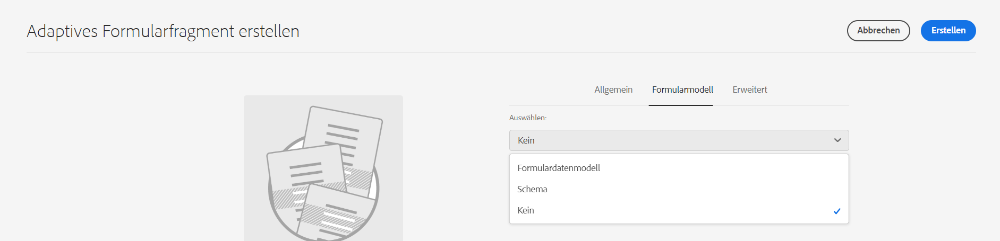
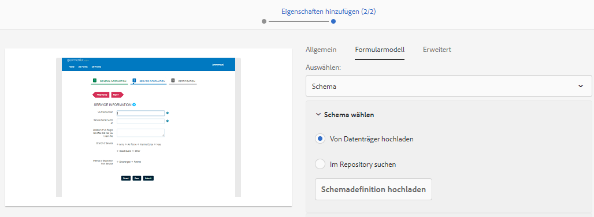
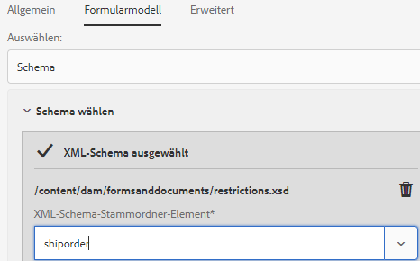

# Erstellen eines adaptiven Formulars (Foundation-Komponenten) {#creating-an-adaptive-form}

| Version | Artikel-Link |
| -------- | ---------------------------- |
| AEM 6.5 | [Hier klicken](https://experienceleague.adobe.com/docs/experience-manager-65/forms/adaptive-forms-basic-authoring/creating-adaptive-form.html?lang=de) |
| AEM as a Cloud Service | Dieser Artikel |

>[!NOTE]
>
> Adobe empfiehlt, die modernen und erweiterbaren [Kernkomponenten](https://experienceleague.adobe.com/docs/experience-manager-core-components/using/adaptive-forms/introduction.html?lang=de) für die Datenerfassung zu verwenden, um [neue adaptive Formulare zu erstellen](/help/forms/creating-adaptive-form-core-components.md) oder [adaptive Formulare zu AEM Sites-Seiten hinzuzufügen](/help/forms/create-or-add-an-adaptive-form-to-aem-sites-page.md). Diese Komponenten stellen einen bedeutenden Fortschritt bei der Erstellung adaptiver Formulare dar und sorgen für beeindruckende Anwendererlebnisse. In diesem Artikel wird der ältere Ansatz zum Erstellen von adaptiven Formularen mithilfe von Foundation-Komponenten beschrieben.

Mit Adaptive Forms können Sie Formulare erstellen, die ansprechend, reaktionsfähig, dynamisch und anpassungsfähig sind. AEM Forms bietet einen benutzerfreundlichen Assistenten, mit dem sich adaptive Formulare schnell erstellen lassen. Der Assistent bietet eine schnelle Registerkartennavigation, mit der Sie einfach vorkonfigurierte Vorlagen, Stile, Felder und Übermittlungsoptionen auswählen können, um ein adaptives Formular zu erstellen.

Bevor Sie beginnen, erfahren Sie mehr über die Arten der Formular-Komponenten, die Ihnen zur Verfügung stehen:

* [Kernkomponenten für adaptive Formulare](https://experienceleague.adobe.com/docs/experience-manager-core-components/using/adaptive-forms/introduction.html?lang=de) sind standardisierte Datenerfassungskomponenten. Diese Komponenten bieten Anpassungsfunktionen, kürzere Entwicklungszeiten und niedrigere Wartungskosten für Ihre Erlebnisse bei der digitalen Registrierung. Entwickelnde können diese Komponenten einfach anpassen und gestalten. Adobe empfiehlt die Nutzung dieser modernen und erweiterbaren Komponenten zur Entwicklung von adaptiven Formularen.

* [Foundation-Komponenten für adaptive Formulare](creating-adaptive-form.md) sind klassische (alte) Datenerfassungskomponenten. Sie können diese weiterhin verwenden, um Ihre vorhandenen Foundation-Komponenten auf Grundlage des adaptiven Formulars zu bearbeiten. Wenn Sie neue Formulare erstellen, empfiehlt Adobe die Verwendung von  [Kernkomponenten von adaptiven Formularen](creating-adaptive-form-core-components.md), um ein adaptives Formular zu erstellen.

<!-- 

You can choose to create an Adaptive Form based on a form model or schema or without a form model. It is important to carefully choose the form model that not only suits your requirements but extends your existing infrastructural investments and assets. You get to choose from the following options to create an Adaptive Form: 

-->

<!-- 

Adaptive Forms allow you to create forms that are engaging, responsive, dynamic, and adaptive. [!DNL AEM Forms] provides an intuitive wizard and out-of-the-box components to create Adaptive Forms. You can choose to create an Adaptive Form based on a form model or schema or without a form model. It is important to carefully choose the form model that not only suits your requirements but extends your existing infrastructural investments and assets. You get to choose from the following options to create an Adaptive Form:

* **Using a form data model**
  [Data integration](data-integration.md) lets you integrate entities and services from disparate data sources in to a Form Data Model that you can use to create Adaptive Forms. Choose Form Data Model if the Adaptive Form you are creating involves fetching and write data from and to multiple data source.

  <!--  * **Using an XDP Form Template**
   It is an ideal form model if you have investments in XFA-based or XDP forms. It provides a direct way to convert your XFA-based forms into Adaptive Forms. Any existing XFA rules are retained in the associated Adaptive Forms. The resulting Adaptive Forms support XFA constructs, such as validations, events, properties, and patterns. 

* **Using an XML Schema Definition (XSD) or a JSON Schema**
   XML and JSON schemas represent the structure in which data is produced or consumed by the back-end system in your organization. You can associate the schema to an Adaptive Form and use its elements to add dynamic content to the Adaptive Form. The elements of the schema are available for use in the Data Model Objects tab of the Content browser when authoring Adaptive Forms.

* **Using none or without a form model**
   Adaptive Forms created with this option do not use any form model. The data XML generated from such forms has flat structure with fields and corresponding values. -->

## Voraussetzungen

Zum Erstellen eines adaptiven Formulars benötigen Sie Folgendes:

* **Berechtigungen**: Fügen Sie Ihre Benutzenden zu [!DNL forms-users] hinzu, um ihnen die notwendigen Berechtigungen zum Erstellen eines adaptiven Formulars zu erteilen. Eine detaillierte Liste der formularspezifischen Benutzergruppen finden Sie unter [Gruppen und Berechtigungen](forms-groups-privileges-tasks.md).

* **Ein adaptives Formular**: Ein Design enthält Stildetails für die Komponenten und Bedienfelder. Die Stile umfassen Eigenschaften wie Hintergrundfarben, Statusfarben, Transparenz, Ausrichtung und Größe. Wenn Sie ein Design anwenden, spiegeln die entsprechenden Komponenten den angegebenen Stil wider. Sie können [ein Design erstellen](themes.md) oder [ein vorhandenes Design importieren](import-export-forms-templates.md#uploading-a-theme). Sie können auch den [neuesten Archetyp](https://experienceleague.adobe.com/docs/experience-manager-core-components/using/developing/archetype/using.html?lang=de#create-project) für einige Beispielthemen bereitstellen.

* **Eine adaptive Formularvorlage**: Eine Vorlage liefert eine Grundstruktur und definiert das Erscheinungsbild (Layouts und Stile) eines adaptiven Formulars. Es enthält vorformatierte Komponenten einschließlich bestimmter Eigenschaften und einer Struktur für Inhalte. Es bietet außerdem die Optionen zum Definieren eines Designs und einer Übermittlungsaktion. Das Design definiert den Look-and-Feel und die Übermittlungsaktion definiert die Aktion, die bei der Übermittlung eines adaptiven Formulars ausgeführt werden soll. Senden der erfassten Daten an eine Datenquelle. Der Cloud-Dienst unterstützt zwei Arten von Vorlagen:

   * **Bearbeitbare Vorlage**: Sie können [eine neue Vorlage erstellen](template-editor.md) oder [eine vorhandene bearbeitbare Vorlage importieren](migrate-to-forms-as-a-cloud-service.md). Sie können auch den [neuesten Archetyp](https://experienceleague.adobe.com/docs/experience-manager-core-components/using/developing/archetype/using.html?lang=de#:~:text=Der%20AEM%2DArchetyp%20besteht%20aus%20Modulen,Servlets%20und%20Anforderungsfilter%20enth%C3%A4lt.%20it.tests%3A%20are%20Java-based%20integration%20tests.) bereitstellen, um einige bearbeitbare Beispielvorlagen zu erhalten.

   * **Statische Vorlage**: Hierbei handelt es sich um veraltete Vorlagen, die nur für Kunden empfohlen werden, die von Adobe Managed Services (AMS)- und On-Premise-AEM Forms-Installationen (AEM 6.5 Forms oder früher) migrieren. Damit können Sie Ihre bereits getätigten Investitionen in statische Vorlagen verwenden. Wenn Sie ein adaptives Formular erstellen, verwenden Sie eine bearbeitbare Vorlage.

## Erstellen eines adaptiven Formulars (Foundation-Komponenten) {#create-an-adaptive-form-foundation-components}

1. Öffnen Sie die [!DNL Experience Manager Forms]-Autoreninstanz. Dabei kann es sich um eine Cloud-Instanz oder eine lokale Entwicklungsinstanz handeln.

1. Geben Sie Ihre Anmeldedaten auf der Experience Manager-Anmeldeseite ein.

   Wenn Sie sich angemeldet haben, wählen Sie in der linken oberen Ecke **[!UICONTROL Adobe Experience Manager]** > **[!UICONTROL Formulare]** > **[!UICONTROL Formulare und Dokumente]**.

1. Wählen Sie **[!UICONTROL Erstellen]** > **[!UICONTROL Adaptive Formulare]**. Der Assistent wird geöffnet.
1. Wählen Sie auf der Registerkarte „Quelle“ eine Vorlage aus:

   * Wenn Sie eine bearbeitbare Vorlage auswählen, werden ein Design und eine Sendeaktion, die in der Vorlage angegeben sind, automatisch ausgewählt und die **[!UICONTROL Erstellen]**-Schaltfläche wird aktiviert. Sie können zu den Registerkarten **[!UICONTROL Stil]** oder **[!UICONTROL Übermittlung]** gehen, um ein anderes Design oder eine andere Übermittlungsaktion auszuwählen. Wenn in der ausgewählten bearbeitbaren Vorlage kein Design angegeben wird, bleibt die Schaltfläche „Erstellen“ deaktiviert. Sie können zur Registerkarte **[!UICONTROL Stile]** gehen, um ein Design manuell auszuwählen.

     >[!NOTE]
     >
     > Sie können auch eine Vorlage für ein [!UICONTROL Datensatzdokument] unter Verwendung eines adaptiven Formulareditors erstellen. Weitere Informationen finden Sie unter [Unterstützung von Datensatzdokumenten im adaptiven Formulareditor](/help/forms/generate-document-of-record-for-non-xfa-based-adaptive-forms.md#document-of-record-support-in-adaptive-form-editor-dor-support-in-adaptiveform).

   * Wenn Sie eine statische Vorlage auswählen, sind die Optionen für Daten, Stil, Übermittlung, Bereitstellung und Vorschau-Optionen nicht verfügbar. Wenn Sie ein adaptives Formular erstellen, verwenden Sie eine bearbeitbare Vorlage.

1. Wählen Sie auf der Registerkarte **[!UICONTROL Stil]** ein Design aus:

   * Wenn die ausgewählte Vorlage ein Design angibt, wird das Design automatisch im Assistenten ausgewählt. Sie können auch auf der Registerkarte „Stil“ ein anderes Design auswählen.
   * Wenn in der ausgewählten Vorlage kein Design angegeben ist, können Sie auf der Registerkarte „Stil“ ein Design auswählen. Die **[!UICONTROL Erstellen]**-Schaltfläche wird erst aktiviert, nachdem ein Design ausgewählt wurde.

1. (Optional) Wählen Sie auf der Registerkarte **[!UICONTROL Daten]** ein Datenmodell aus:

   * **Formulardatenmodell**: Ein [Formulardatenmodell](data-integration.md) ermöglicht Ihnen die Integration von Entitäten und Diensten aus unterschiedlichen Datenquellen in ein adaptives Formular. Wählen Sie das Formulardatenmodell (FDM), wenn Sie ein adaptives Formular erstellen wollen, für das Daten aus mehreren Datenquellen abgerufen und in sie geschrieben werden sollen.

   * **JSON-Schema**: Das [JSON-Schema](adaptive-form-json-schema-form-model.md) stellt die Struktur dar, in der Daten vom Back-End-System in Ihrer Organisation produziert oder genutzt werden. Sie können das Schema mit einem adaptiven Formular verknüpfen und dem Formular mithilfe der Elemente dieses Schemas dynamische Inhalte hinzufügen. Die Schemaelemente stehen beim Erstellen von adaptiven Formularen auf der Registerkarte „Datenmodellobjekte“ des Inhalts-Browsers zur Verfügung und alle Felder werden auch zum erstellten adaptiven Formular hinzugefügt.

   Standardmäßig sind alle Felder des Datenmodells ausgewählt. Wenn Sie das adaptive Formular erstellen, werden alle ausgewählten Datenmodellfelder in entsprechende adaptive Formularkomponenten konvertiert. Mit den Kontrollkästchen des Assistenten können Sie nur die Felder auswählen, die im adaptiven Formular enthalten sein sollen.

   <!-- 
   
   If your JSON schema contains a fragment, the fragment is considered a single unit. You can select or deselect a complete fragment and all the fields of the fragment are selected or deselected accordingly. 
   
   -->

1. Wählen Sie auf der Registerkarte **[!UICONTROL Absenden]** eine Sendeaktion aus:

   * Wenn Sie eine Vorlage auswählen, wird die in der Vorlage angegebene Übermittlungsaktion automatisch ausgewählt. Sie können auf der Registerkarte „Übermittlung“ eine andere Übermittlungsaktion auswählen. Auf der Registerkarte **[!UICONTROL Übermittlung]** werden alle verfügbaren Übermittlungsaktionen angezeigt.

   * Wenn die ausgewählte Vorlage keine Übermittlungsaktion angibt, können Sie auf der Registerkarte **[!UICONTROL Übermittlung]** eine Übermittlungsaktion auswählen

1. (Optional) Auf der Registerkarte „Versand“ können Sie ein Datum für die Veröffentlichung oder das Rückgängigmachen der Veröffentlichung eines adaptiven Formular angeben.

1. Wählen Sie **[!UICONTROL Erstellen]** aus. Es wird ein Dialogfeld angezeigt, in dem Sie den Titel, Namen und Speicherort des adaptiven Formulars angeben können:

   * **[!UICONTROL Titel:]** Gibt den Anzeigenamen des Formulars an. Der Titel erleichtert Ihnen die Identifizierung des Formulars in der Benutzeroberfläche von [!DNL Experience Manager Forms].
   * **[!UICONTROL Name:]** Gibt den Namen des Formulars an. Im Repository wird ein Knoten mit dem angegebenen Namen erstellt. Wenn Sie mit der Eingabe des Titels beginnen, wird automatisch ein Wert für das Feld „Name“ vorgeschlagen. Sie können den vorgeschlagenen Wert gegebenenfalls ändern. Im Feld „Name“ dürfen nur alphanumerische Zeichen, Bindestriche und Unterstriche eingegeben werden. Alle ungültigen Eingaben werden durch Bindestriche ersetzt.
   * **[!UICONTROL Pfad:]** Gibt den Speicherort an, an dem das adaptive Formular gespeichert werden soll. Sie können das adaptive Formular direkt unter `/content/dam/formsanddocuments` erstellen oder einen Ordner wie `/content/dam/formsanddocuments/adaptiveforms` anlegen, um ein adaptives Formular zu speichern. Stellen Sie sicher, dass Sie den Ordner erstellen, bevor Sie ihn im Pfad verwenden. Das Feld **[!UICONTROL Pfad:]** erstellt nicht automatisch einen Ordner.

1. Wählen Sie **[!UICONTROL Erstellen]** aus. Ein adaptives Formular wird erstellt und im Editor für adaptive Formulare geöffnet. Der Editor zeigt die in der Vorlage verfügbaren Inhalte an. Er zeigt auch die Seitenleiste an, um das erstellte Formular entsprechend den Anforderungen anzupassen.

   Je nach Typ des adaptiven Formulars werden auf der Registerkarte **[!UICONTROL Datenmodellobjekte]** des **[!UICONTROL Inhalts-Browsers]** in der Seitenleiste die Formularelemente angezeigt, die im zugewiesenen <!--XFA form template, XML schema or --> JSON-Schema oder Formulardatenmodell (FDM) vorhanden sind. Sie können diese Elemente auch per Drag-and-Drop in das zu erstellende adaptive Formular ziehen.

<!-- ## Create an Adaptive Form based on a Form Data Model {#fdm}

[Data integration](data-integration.md) lets you integrate multiple data sources and bring their entities and services together to create a form data model. It is an extension of JSON schema. You can use a Form Data Model to create an Adaptive Form. The entities or data model objects configured in a Form Data Model are available as data model objects for form authoring. They are bound to respective data sources and used to prefill a form and write submitted data back to the respective data sources. You can also call services configured in a Form Data Model using Adaptive Form rules.

To use a Form Data Model for creating an Adaptive Form:

1. In Form Model tab on Add Properties screen, select **[!UICONTROL Form Data Model]** in the **[!UICONTROL Select From]** drop-down list.

   

1. Select to expand **[!UICONTROL Select Form Data Model]**. All available form data models are listed.Select a from data model.

>[!NOTE]
>
>You can also change the Form Data Model for an Adaptive Form. For detailed steps, see [Edit Form Model properties of an Adaptive Form](#edit-form-model).

## Create an Adaptive Form based on XML or JSON schema {#create-an-adaptive-form-based-on-xml-or-json-schema}

XML and JSON schemas represent the structure in which data is produced or consumed by the back-end system in your organization. You can associate a schema to an Adaptive Form and use its elements to add dynamic content to the Adaptive Form. The elements of the schema are available in the Data Model Object tab of the content browser for authoring Adaptive Forms. You can drag-drop the schema elements to build the form.

See the following documents to understand how to design XML or JSON schema for authoring Adaptive Forms.

* [Creating Adaptive Forms using XML schema](adaptive-form-xml-schema-form-model.md)
* [Creating Adaptive Forms using JSON schema](adaptive-form-json-schema-form-model.md)

Do the following to use XML or JSON schema as form model for an Adaptive Form:

1. On the **[!UICONTROL Add Properties]** step of Adaptive Form creation page, select on the **[!UICONTROL Form Model]** tab.
1. In the Form Model tab, select **[!UICONTROL Schema]** from the **[!UICONTROL Select From]** drop-down field.

1. Select **[!UICONTROL Select Schema]** and do one of the following:

    * **[!UICONTROL Upload from disk]** - Select this option and select Upload Schema Definition to browse and upload an XML schema or JSON schema from your file system. The uploaded schema file resides with the form and is not accessible to other Adaptive Forms.
    * **[!UICONTROL Search in repository]** - Select this option to select from the list of schema definition files available in the repository. Select the XML or JSON schema file as form model. The selected schema is associated with the form by reference and is accessible for use in other Adaptive Forms.

      Ensure that the JSON schema filename ends with **.schema.json**. For example: mySchema.schema.json

   
**Figure:** *Selecting XML or JSON schema*

1. (For XML schema only) After you select or upload an XML Schema, specify a root element of the selected XSD file to map with the Adaptive Form.

   
**Figure:** *Selecting XSD root element*

>[!NOTE]
>
>You can also change the schema for an Adaptive Form. For detailed steps, see [Edit Form Model properties of an Adaptive Form](#edit-form-model). -->

## Bearbeiten der Formularmodelleigenschaften eines adaptiven Formulars {#edit-form-model}

Sie können das Formularmodell für ein adaptives Formular (JSON-basiertes oder Formulardatenmodell) ändern. Sie können nicht zwischen Formularmodellen wechseln.

1. Wählen Sie das adaptive Formular aus und wählen Sie dann das Symbol **Eigenschaften**.
1. Öffnen Sie die Registerkarte **[!UICONTROL Formularmodell]** und wählen Sie eine der folgenden Vorgehensweisen.

   * Wenn das adaptive Formular nicht auf einem Formularmodell basiert, können Sie ein Formularmodell und ein entsprechendes <!-- a form template, --> XML- oder JSON-Schema oder ein Formulardatenmodell (FDM) auswählen.
   * Bei einem adaptiven Formular, das auf einem Formularmodell basiert, können Sie ein anderes <!-- form template, --> XML-Schema, JSON-Schema oder Formulardatenmodell (FDM) für dasselbe Formularmodell wählen.

1. Wählen Sie **[!UICONTROL Speichern]** aus, um die Eigenschaften zu speichern.

Sie können die Eigenschaften des Formularmodells auch im Editor für adaptive Formulare oder im Vorlagen-Editor für adaptive Formulare ändern.

1. Wählen Sie die Komponente **[!UICONTROL Adaptiver Formular-Container (Stamm)]** aus.
1. Klicken Sie auf das Symbol , um die **[!UICONTROL Eigenschaften]** des adaptiven Formular-Containers zu öffnen.
1. Öffnen Sie die Registerkarte **[!UICONTROL Datenmodell]** und führen Sie eine der folgenden Aktionen aus:

   * Wenn das adaptive Formular nicht auf einem Formularmodell basiert, können Sie ein Formularmodell und ein entsprechendes <!-- a form template, --> XML- oder JSON-Schema oder ein Formulardatenmodell (FDM) auswählen.
   * Wenn das adaptive Formular auf einem Formularmodell basiert, können Sie das Formularmodell nicht ändern. Sie können ggf. ein anderes <!-- form template, --> XML- oder JSON-Schema oder ein Formulardatenmodell (FDM) für dasselbe Formularmodell wählen.
1. Wählen Sie  aus, um die Eigenschaften zu speichern.

>[!NOTE]
>
> Sie können auch ein adaptives Formular als Vorlage speichern. Weitere Informationen finden Sie unter [Erstellen einer Vorlage mit einem adaptiven Formular](/help/forms/template-editor.md#saving-an-adaptive-form-as-template-saving-adaptive-form-as-template).

## Wie erfolgt das Umbenennen eines adaptiven AEM-Formulars? {#rename-an-AEM-Adaptive-Form}

Führen Sie zum Umbenennen eines adaptiven Formulars die folgenden Schritte aus:

1. Wählen Sie ein adaptives Formular in Ihrer AEM Forms-Benutzeroberfläche aus.
1. Klicken Sie auf **Eigenschaften** in der oberen Leiste.
1. Ändern Sie den Formularnamen auf der Registerkarte **Titel**, wie in der Abbildung unten dargestellt.
1. Klicken Sie auf **Speichern und schließen**.

## Siehe auch {#see-also}

{{see-also}}