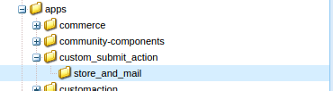
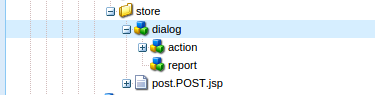
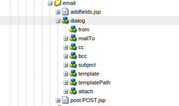
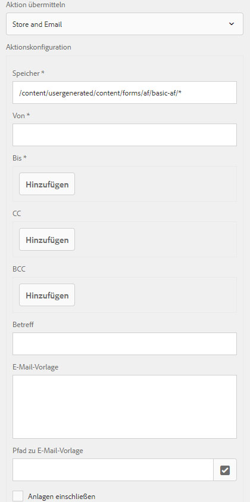
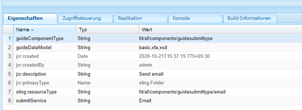
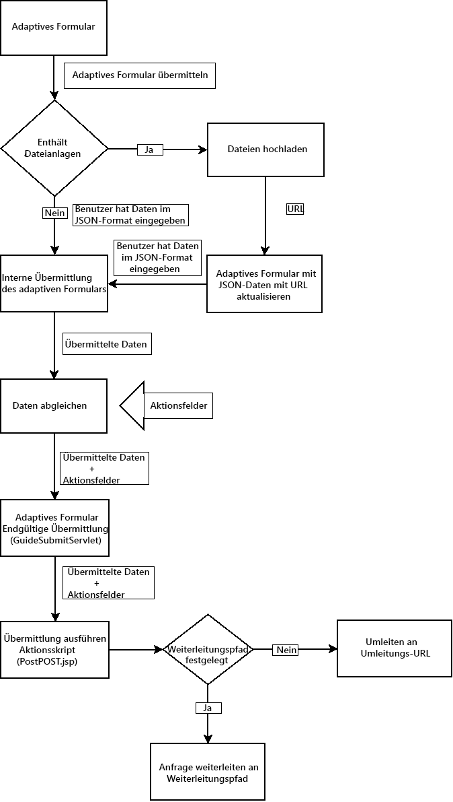

# Erstellen einer benutzerdefinierten Übermittlungsaktion für adaptive Formulare {#writing-custom-submit-action-for-adaptive-forms}

| Version | Artikel-Link |
| -------- | ---------------------------- |
| AEM 6.5 | [Hier klicken](https://experienceleague.adobe.com/docs/experience-manager-65/forms/customize-aem-forms/custom-submit-action-form.html?lang=de) |
| AEM as a Cloud Service (Kernkomponenten) | [Hier klicken](https://experienceleague.adobe.com/de/docs/experience-manager-cloud-service/content/forms/adaptive-forms-authoring/authoring-adaptive-forms-core-components/create-an-adaptive-form-on-forms-cs/custom-submit-action-for-adaptive-forms-based-on-core-components) |
| AEM as a Cloud Service (Foundation-Komponenten) | Dieser Artikel |

Ein adaptives Formular stellt mehrere vordefinierte Sende-Aktionen zur Verfügung. Eine Sende-Aktion gibt Details zu den Aktionen an, die mit den über das adaptive Formular erfassten Daten durchgeführt werden sollen. Beispielsweise das Senden von Daten in einer E-Mail.

Sie können eine benutzerdefinierte Sende-Aktion erstellen, um Funktionen hinzuzufügen, die nicht in [vordefinierten Sende-Aktionen](configuring-submit-actions.md) enthalten sind oder nicht durch eine einzelne vordefinierte Sende-Aktion unterstützt werden. Beispielsweise das Senden von Daten an einen Workflow, das Speichern der Daten in einem Datenspeicher, das Senden von E-Mail-Benachrichtigungen an die Person, die das Formular sendet, und das Senden einer E-Mail an die Person, die für die Verarbeitung des gesendeten Formulars für Genehmigungen und Ablehnungen verantwortlich ist, über eine einzige Sende-Aktion.

## XML-Datenformat {#xml-data-format}

Die XML-Daten werden mit dem Abfrageparameter **`jcr:data`** an das Servlet gesendet. Sende-Aktionen können zur Verarbeitung der Daten auf den Parameter zugreifen. Der folgende Code beschreibt das Format der XML-Daten. Die Felder, die an das Formularmodell gebunden sind, befinden sich im Bereich **`afBoundData`**. Nicht gebundene Felder befinden sich im `afUnoundData`Bereich. <!--For more information about the format of the `data.xml` file, see [Introduction to prepopulating Adaptive Form fields](prepopulate-adaptive-form-fields.md).-->

```xml
<?xml ?>
<afData>
<afUnboundData>
<data>
<field1>value</field2>
<repeatablePanel>
    <field2>value</field2>
</repeatablePanel>
<repeatablePanel>
    <field2>value</field2>
</repeatablePanel>
</data>
</afUnboundData>
<afBoundData>
<!-- xml corresponding to the Form Model /XML Schema -->
</afBoundData>
</afData>
```

### Aktionsfelder {#action-fields}

Eine Sende-Aktion kann dem gerenderten Formular-HTML (mit dem HTML-Tag [input](https://developer.mozilla.org/de/docs/Web/HTML/Element/Input)) verborgene Eingabefelder hinzufügen. Diese verborgenen Felder können Werte enthalten, die bei der Verarbeitung der Formularübermittlung benötigt werden. Wenn das Formular gesendet wird, werden diese Formularwerte als Abfrageparameter zurückgegeben, die die Sende-Aktion während der Verarbeitung der Übermittlung verwenden kann. Die Eingabefelder werden als Aktionsfelder bezeichnet.

Eine Sende-Aktion, die auch die für das Ausfüllen eines Formulars benötigte Zeit erfasst, kann beispielsweise die verborgenen Eingabefelder `startTime` und `endTime` hinzufügen.

Ein Skript kann die Werte der Felder `startTime` und `endTime` bereitstellen, wenn das Formular ausgegeben bzw. bevor das Formular übermittelt wird. Das Skript der Sende-Aktion `post.jsp` kann dann mithilfe von Abfrageparametern auf diese Felder zugreifen und die für das Ausfüllen des Formulars benötigte Gesamtzeit berechnen.

### Dateianhänge {#file-attachments}

Sende-Aktionen können auch die Dateianhänge nutzen, die Sie mit der Komponente „Dateianhang“ hochladen. Skripts für Sende-Aktionen können mit der Sling-API-Klasse [RequestParameter](https://sling.apache.org/apidocs/sling5/org/apache/sling/api/request/RequestParameter.html) auf diese Dateien zugreifen. Mit der Methode [isFormField](https://sling.apache.org/apidocs/sling5/org/apache/sling/api/request/RequestParameter.html#isFormField()) der API lässt sich identifizieren, ob es sich beim Abfrageparameter um eine Datei oder ein Formularfeld handelt. Sie können in einer Sende-Aktion über die Abfrageparameter iterieren, um Dateianhang-Parameter zu identifizieren.

Mit dem folgenden Beispielcode werden die Dateianhänge in der Abfrage identifiziert. Anschließend werden die Daten mit [Get API](https://sling.apache.org/apidocs/sling5/org/apache/sling/api/request/RequestParameter.html#get()) in die Datei eingelesen. Schließlich wird mit den Daten ein Dokumentobjekt erstellt und an eine Liste angehängt.

```java
RequestParameterMap requestParameterMap = slingRequest.getRequestParameterMap();
for (Map.Entry<String, RequestParameter[]> param : requestParameterMap.entrySet()) {
    RequestParameter rpm = param.getValue()[0];
    if(!rpm.isFormField()) {
        fileAttachments.add(new Document(rpm.get()));
    }
}
```

Wenn Sie Dateien an das adaptive Formular anhängen, validiert der Server die Dateianhänge nach der Übermittlung des adaptiven Formulars und gibt eine Fehlermeldung zurück, wenn eine der folgenden Bedingungen vorliegt:

* Dateianhänge enthalten einen Dateinamen, der mit dem Zeichen (.) beginnt, die Zeichen \ / : * ?  &quot; &lt; > | ; % $ beinhaltet oder spezielle Dateinamen enthält, die für das Windows-Betriebssystem reserviert sind, wie `nul`, `prn`, `con`, `lpt` oder `com`.

* Die Größe des Dateianhangs beträgt 0 Byte.

* Das Format des Dateianhangs wird beim Konfigurieren der Komponente „Dateianhang“ in einem adaptiven Formular nicht im Abschnitt [Unterstützte Dateitypen](https://helpx.adobe.com/de/document-cloud/help/supported-file-formats-fill-sign.html#main-pars_text) definiert.

### Weiterleitungspfad und Umleitungs-URL {#forward-path-and-redirect-url}

Nach dem Ausführen der gewünschten Aktion leitet das Sende-Servlet die Abfrage an den Weiterleitungspfad weiter. Eine Aktion verwendet die setForwardPath-API, um den Weiterleitungspfad im Guide Submit-Servlet festzulegen.

Wenn die Aktion keinen Weiterleitungspfad bereitstellt, leitet das Übermittlungs-Servlet den Browser mithilfe der Umleitungs-URL um. Die Autorin bzw. der Autor konfiguriert die Umleitungs-URL über die Konfiguration der Dankeseite im Dialogfeld für die Bearbeitung adaptiver Formulare. Sie können die Umleitungs-URL auch über die Sende-Aktion oder die setRedirectUrl-API im Guide Submit-Servlet konfigurieren. Sie können die Anfrageparameter, die an die Umleitungs-URL gesendet werden, auch mithilfe der setRedirectParameters-API im Guide Submit-Servlet konfigurieren.

>[!NOTE]
>
>Ein Autor stellt die Umleitungs-URL bereit (über die Konfiguration der Dankeseite). [Vordefinierte Sende-Aktionen](configuring-submit-actions.md) verwenden die Umleitungs-URL, um den Browser von der Ressource, auf die der Weiterleitungspfad verweist, umzuleiten.
>
>Sie können eine benutzerdefinierte Sende-Aktion schreiben, die eine Abfrage an eine Ressource oder ein Servlet weiterleitet. Adobe empfiehlt, dass das Skript, das das Ressourcen-Handling für den Weiterleitungspfad durchführt, die Abfrage an die Umleitungs-URL weiterleitet, wenn die Verarbeitung abgeschlossen ist.

## Sende-Aktion {#submit-action}

Bei einer Sende-Aktion handelt es sich um ein sling:Folder-Objekt, das Folgendes enthält:

* **addfields.jsp**: Dieses Skript stellt die Aktionsfelder bereit, die der HTML-Datei während der Ausgabe hinzugefügt werden. Verwenden Sie dieses Skript, um im Skript „post.POST.jsp“ verborgene Eingabeparameter hinzuzufügen, die während der Übermittlung benötigt werden.
* **dialog.xml**: Dieses Skript ähnelt dem Dialogfeld für die CQ-Komponente. Es enthält Konfigurationsinformationen, die der Autor anpasst. Die Felder werden im Dialogfeld für die Bearbeitung des adaptiven Formulars auf der Registerkarte „Aktionen übermitteln“ angezeigt, wenn Sie die Sende-Aktion auswählen.
* **post.POST.jsp**: Das Submit-Servlet ruft dieses Skript mit den Daten, die Sie übermitteln, und den zusätzlichen Daten aus den vorherigen Bereichen auf. Jede Erwähnung einer Aktionsausführung auf dieser Seite impliziert die Ausführung des Skripts „post.POST.jsp“. Um die Übermittlungsaktion mit dem adaptiven Formular zu registrieren, sodass sie im Dialogfeld für die Bearbeitung des adaptiven Formulars angezeigt wird, fügen Sie diese Eigenschaften zu `sling:Folder` hinzu:

   * **guideComponentType** vom Typ „String“ mit dem Wert **fd/af/components/guidesubmittype**
   * **guideDataModel** vom Typ „String“ und der Angabe, für welchen Typ von adaptiven Formularen die Sende-Aktion gilt. <!--**xfa** is supported for XFA-based Adaptive Forms while -->**xsd** wird für adaptive XSD-basierte Formulare unterstützt. **basic** wird für adaptive Formulare unterstützt, die weder XDP noch XSD verwenden. Um die Aktion in mehreren Typen adaptiver Formulare anzuzeigen, fügen Sie die entsprechenden Zeichenfolgen hinzu. Trennen Sie die Zeichenfolgen durch Kommas. Um beispielsweise eine Aktion in adaptiven <!--XFA- and -->XSD-basierten Formularen anzuzeigen, geben Sie den Wert <!--**xfa** and--> **xsd** an.

   * **jcr:description** vom Typ „String“. Der Wert dieser Eigenschaft wird im Dialogfeld für die Bearbeitung adaptiver Formulare auf der Registerkarte „Aktionen übermitteln“ in der Liste „Aktion übermitteln“ angezeigt. Die vordefinierten Aktionen befinden sich im CRX-Repository im Verzeichnis **/libs/fd/af/components/guidesubmittype**.

   * **submitService** vom Typ „String“. Weitere Informationen finden Sie unter [Planen der Übermittlung adaptiver Formulare für benutzerdefinierte Aktionen](#schedule-adaptive-form-submission).

## Erstellen einer benutzerdefinierten Sende-Aktion {#creating-a-custom-submit-action}

>[!NOTE]
>
> Informationen zum Erstellen einer benutzerdefinierten Übermittlungsaktion für Kernkomponenten finden Sie unter [Erstellen einer benutzerdefinierten Übermittlungsaktion für adaptive Formulare (Kernkomponenten)](https://experienceleague.adobe.com/de/docs/experience-manager-cloud-service/content/forms/adaptive-forms-authoring/authoring-adaptive-forms-core-components/create-an-adaptive-form-on-forms-cs/custom-submit-action-for-adaptive-forms-based-on-core-components).

Führen Sie die folgenden Schritte aus, um eine benutzerdefinierte Sende-Aktion zu erstellen, die die Daten im CRX-Repository speichert und Ihnen anschließend eine E-Mail sendet. Das adaptive Formular enthält die vordefinierte Sende-Aktion „Inhalt speichern“ (veraltet), mit der die Daten im CRX-Repository gespeichert werden. Zudem stellt AEM eine [Mail](https://www.adobe.io/experience-manager/reference-materials/6-5/javadoc/com/day/cq/mailer/package-summary.html)-API zum Senden von E-Mails bereit. Vor der Verwendung der Mail-API müssen Sie den Service „Day CQ Mail“ über die Systemkonsole konfigurieren. Sie können die Aktion „Inhalt speichern“ (veraltet) erneut verwenden, um Daten im Repository zu speichern. Die Aktion „Inhalt speichern“ (veraltet) ist im Ordner /libs/fd/af/components/guidesubmittype/store im CRX-Repository verfügbar.

1. Melden Sie sich unter der URL https://&lt;server>:&lt;port>/crx/de/index.jsp bei CRXDE Lite an. Erstellen Sie einen Knoten mit der Eigenschaft „sling:Folder“ und dem Namen „store_and_mail“ im Ordner /apps/custom_submit_action. Erstellen Sie den Ordner „custom_submit_action“, falls er noch nicht vorhanden ist.

   

2. **Füllen Sie die erforderlichen Konfigurationsfelder aus.**

   Fügen Sie die Konfiguration hinzu, die für die Speichern-Aktion erforderlich ist. Kopieren Sie den Knoten **cq:dialog** der Speichern-Aktion aus dem Ordner /libs/fd/af/components/guidesubmittype/store in den Ordner „action“ unter /apps/custom_submit_action/store_and_email.

   

3. **Geben Sie Konfigurationsfelder an, um den Autor zur E-Mail-Konfiguration aufzufordern.**

   Das adaptive Formular enthält auch eine E-Mail-Aktion, die E-Mails an Benutzer sendet. Passen Sie diese Aktion basierend auf Ihren Anforderungen an. Navigieren Sie zu /libs/fd/af/components/guidesubmittype/email/dialog. Kopieren Sie die Knoten aus dem Knoten „cq:dialog“ in den Knoten „cq:dialog“ Ihrer Sende-Aktion (/apps/custom_submit_action/store_and_email/dialog).

   

4. **Machen Sie die Aktion im Dialogfeld für die Bearbeitung adaptiver Formulare verfügbar.**

   Fügen Sie im Knoten „store_and_email“ die folgenden Eigenschaften ein:

   * **guideComponentType** vom Typ **String** mit dem Wert **fd/af/components/guidesubmittype**

   * **guideDataModel** vom Typ **String** mit dem Wert **<!--xfa, -->xsd, basic**

   * **jcr:description** vom Typ **String** mit dem Wert **Store and Email Action**

   * **submitService** vom Typ **String** mit dem Wert **Store and Email**. Weitere Informationen finden Sie unter [Planen der Übermittlung adaptiver Formulare für benutzerdefinierte Aktionen](#schedule-adaptive-form-submission).

5. Öffnen Sie ein beliebiges adaptives Formular. Klicken Sie auf die Schaltfläche **Bearbeiten** neben **Start**, um das Dialogfeld **Bearbeiten** des Containers für adaptive Formulare zu öffnen. Die neue Aktion wird auf der Registerkarte **Aktionen übermitteln** angezeigt. Wenn Sie die Aktion **Store and Email** auswählen, wird die im Knoten „dialog“ hinzugefügte Konfiguration angezeigt.

   

6. **Verwenden Sie die Aktion, um eine Aufgabe durchzuführen.**

   Fügen Sie der Aktion das Skript „post.POST.jsp“ hinzu. (/apps/custom_submit_action/store_and_mail/).

   Führen Sie die OOTB-Speicheraktion aus (Skript „post.POST.jsp“). Verwenden Sie die von CQ bereitgestellte [FormsHelper.runAction](https://www.adobe.io/experience-manager/reference-materials/6-5/javadoc/com/day/cq/wcm/foundation/forms/FormsHelper.html#runAction-java.lang.String-java.lang.String-org.apache.sling.api.resource.Resource-org.apache.sling.api.SlingHttpServletRequest-org.apache.sling.api.SlingHttpServletResponse-)-API (java.lang.String, java.lang.String, org.apache.sling.api.resource.Resource, org.apache.sling.api.SlingHttpServletRequest, org.apache.sling.api.SlingHttpServletResponse) im Code, um die Speicheraktion auszuführen. Fügen Sie der JSP-Datei den folgenden Code hinzu:

   `FormsHelper.runAction("/libs/fd/af/components/guidesubmittype/store", "post", resource, slingRequest, slingResponse);`

   Zum Senden der E-Mail wird im Code die E-Mail-Adresse des Empfängers aus der Konfiguration gelesen. Um den Konfigurationswert aus dem Skript der Aktion abzurufen, lesen Sie die Eigenschaften der aktuellen Ressource mit dem folgenden Code. Entsprechend können Sie die anderen Konfigurationsdateien lesen.

   `ValueMap properties = ResourceUtil.getValueMap(resource);`

   `String mailTo = properties.get("mailTo");`

   Verwenden Sie schließlich die CQ Mail-API zum Senden der E-Mail. Verwenden Sie die [SimpleEmail](https://commons.apache.org/proper/commons-email/commons-email2-javax/apidocs/org/apache/commons/mail2/javax/SimpleEmail.html)-Klasse, um das E-Mail-Objekt wie unten dargestellt zu erstellen:

   >[!NOTE]
   >
   >Stellen Sie sicher, dass die JSP-Datei den Namen „post.POST.jsp“ hat.

   ```java
   <%@include file="/libs/fd/af/components/guidesglobal.jsp" %>
   <%@page import="com.day.cq.wcm.foundation.forms.FormsHelper,
          org.apache.sling.api.resource.ResourceUtil,
          org.apache.sling.api.resource.ValueMap,
                   com.day.cq.mailer.MessageGatewayService,
     com.day.cq.mailer.MessageGateway,
     org.apache.commons.mail.Email,
                   org.apache.commons.mail.SimpleEmail" %>
   <%@taglib prefix="sling"
                   uri="https://sling.apache.org/taglibs/sling/1.0" %>
   <%@taglib prefix="cq"
                   uri="https://www.day.com/taglibs/cq/1.0"
   %>
   <cq:defineObjects/>
   <sling:defineObjects/>
   <%
           String storeContent =
                       "/libs/fd/af/components/guidesubmittype/store";
           FormsHelper.runAction(storeContent, "post", resource,
                                   slingRequest, slingResponse);
    ValueMap props = ResourceUtil.getValueMap(resource);
    Email email = new SimpleEmail();
    String[] mailTo = props.get("mailto", new String[0]);
    email.setFrom((String)props.get("from"));
           for (String toAddr : mailTo) {
               email.addTo(toAddr);
      }
    email.setMsg((String)props.get("template"));
    email.setSubject((String)props.get("subject"));
    MessageGatewayService messageGatewayService =
                       sling.getService(MessageGatewayService.class);
    MessageGateway messageGateway =
                   messageGatewayService.getGateway(SimpleEmail.class);
    messageGateway.send(email);
   %>
   ```

   Wählen Sie die Aktion im adaptiven Formular aus. Die Aktion sendet eine E-Mail und speichert die Daten.

## Verwenden der submitService-Eigenschaft für benutzerdefinierte Sende-Aktionen {#submitservice-property}

Wenn Sie eine benutzerdefinierte Sende-Aktion mit der `submitService`-Eigenschaft festlegen, wird beim Senden ein Aufruf von [FormSubmitActionService](https://helpx.adobe.com/de/experience-manager/6-5/forms/javadocs/com/adobe/aemds/guide/service/FormSubmitActionService.html) ausgelöst. `FormSubmitActionService` verwendet die `getServiceName`-Methode, um den Wert für die `submitService`-Eigenschaft abzurufen. Basierend auf dem Wert der `submitService`-Eigenschaft ruft der Service die entsprechende submit-Methode auf. Nehmen Sie `FormSubmitActionService` in das benutzerdefinierte Bundle auf, das Sie auf den [!DNL AEM Forms]-Server hochladen.

Fügen Sie die `submitService`-Eigenschaft vom Typ „String“ dem `sling:Folder` Ihrer benutzerdefinierten Sende-Aktion hinzu, um [!DNL Adobe Sign] für das adaptive Formular zu aktivieren. Sie können die Option **[!UICONTROL Adobe Sign aktivieren]** im Bereich **[!UICONTROL Elektronische Signatur]** der Eigenschaften des Containers für adaptive Formulare erst auswählen, nachdem Sie den Wert für die `submitService`-Eigenschaft der benutzerdefinierten Sende-Aktion festgelegt haben.

<!--As a result of setting an appropriate value for the `submitService` property and enabling [!DNL Adobe Sign], you can schedule the submission of an Adaptive Form to ensure that all configured signers have taken an action on the form. [!DNL Adobe Sign] Configuration Service keeps polling [!DNL Adobe Sign] server at regular intervals to verify the status of signatures. If all the signers complete signing the form, the Submit Action service is started and the form is submitted.-->




<!-- You can't do comments within comments, so I changed comment tags to <start-comment> <end-comment> -->

<!--
## Workflow for a Submit Action {#workflow-for-a-submit-action}

The flowchart depicts the workflow for a Submit Action that is triggered when you click the **[!UICONTROL Submit]** button in an Adaptive Form. The files in the File Attachment component are uploaded to the server, and the form data is updated with the URLs of the uploaded files. Within the client, the data is stored in the JSON format. The client sends an Ajax request to an internal servlet that massages the data you specified and returns it in the XML format. The client collates this data with action fields. It submits the data to the final servlet (Guide Submit servlet) through a Form Submit Action. Then, the servlet forwards the control to the Submit Action. The Submit Action can forward the request to a different sling resource or redirect the browser to another URL.



### XML data format {#xml-data-format}

The XML data is sent to the servlet using the **`jcr:data`** request parameter. Submit Actions can access the parameter to process the data. The following code describes the format of the XML data. The fields that are bound to the Form model appear in the **`afBoundData`** section. Unbound fields appear in the `afUnoundData`section. For more information about the format of the `data.xml` file, see [Introduction to prepopulating Adaptive Form fields](prepopulate-adaptive-form-fields.md).

```xml
<?xml ?>
<afData>
<afUnboundData>
<data>
<field1>value</field2>
<repeatablePanel>
    <field2>value</field2>
</repeatablePanel>
<repeatablePanel>
    <field2>value</field2>
</repeatablePanel>
</data>
</afUnboundData>
<afBoundData>
<start comment> xml corresponding to the Form Model /XML Schema <end comment>
<start comment> </afBoundData> <end comment>
</afData>
```

### Action fields {#action-fields}

A Submit Action can add hidden input fields (using the HTML [input](https://developer.mozilla.org/en/docs/Web/HTML/Element/Input) tag) to the rendered form HTML. These hidden fields can contain values that it needs while processing form submission. When submitting the form, these field values are posted back as request parameters that the Submit Action can use during submission handling. The input fields are called action fields.

For example, a Submit Action that also captures the time taken to fill a form can add the hidden input fields `startTime` and `endTime`.

A script can supply the values of the `startTime` and `endTime` fields when the form renders and before form submission, respectively. The Submit Action script `post.jsp` can then access these fields using request parameters and compute the total time required to fill the form.

### File attachments {#file-attachments}

Submit Actions can also use the file attachments you upload using the File Attachment component. Submit Action scripts can access these files using the sling [RequestParameter API](https://sling.apache.org/apidocs/sling5/org/apache/sling/api/request/RequestParameter.html). The [isFormField](https://sling.apache.org/apidocs/sling5/org/apache/sling/api/request/RequestParameter.html#isFormField()) method of the API helps identify whether the request parameter is a file or a form field. You can iterate over the Request parameters in a Submit Action to identify File Attachment parameters.

The following sample code identifies the file attachments in the request. Next, it reads the data into the file using the [Get API](https://sling.apache.org/apidocs/sling5/org/apache/sling/api/request/RequestParameter.html#get()). Finally, it creates a Document object using the data and appends it to a list.

```java
RequestParameterMap requestParameterMap = slingRequest.getRequestParameterMap();
for (Map.Entry<String, RequestParameter[]> param : requestParameterMap.entrySet()) {
    RequestParameter rpm = param.getValue()[0];
    if(!rpm.isFormField()) {
        fileAttachments.add(new Document(rpm.get()));
    }
}
```

### Forward path and Redirect URL {#forward-path-and-redirect-url}

After performing the required action, the Submit servlet forwards the request to the forward path. An action uses the setForwardPath API to set the forward path in the Guide Submit servlet.

If the action does not provide a forward path, the Submit servlet redirects the browser using the Redirect URL. The author configures the Redirect URL using the Thank You Page configuration in the Adaptive Form Edit dialog. You can also configure the Redirect URL through the Submit Action or the setRedirectUrl API in the Guide Submit servlet. You can also configure the Request parameters sent to the Redirect URL using the setRedirectParameters API in the Guide Submit servlet.

>[!NOTE]
>
>An author provides the Redirect URL (using the Thank You Page Configuration). [OOTB Submit Actions](configuring-submit-actions.md) use the Redirect URL to redirect the browser from the resource that the forward path references.
>
>You can write a custom Submit Action that forwards a request to a resource or servlet. Adobe recommends that the script that performs resource handling for the forward path redirect the request to the Redirect URL when the processing completes.

## Submit Action {#submit-action}

A Submit Action is a sling:Folder that includes the following:

* **addfields.jsp**: This script provides the action fields that are added to the HTML file during rendition. Use this script to add hidden input parameters required during submission in the post.POST.jsp script.
* **dialog.xml**: This script is similar to the CQ Component dialog. It provides configuration information that the author customizes. The fields are displayed in the Submit Actions Tab in the Adaptive Form Edit dialog when you select the Submit Action.
* **post.POST.jsp**: The Submit servlet calls this script with the data that you submit and the additional data in the previous sections. Any mention of running an action in this page implies running the post.POST.jsp script. To register the Submit Action with the Adaptive Forms to display in the Adaptive Form Edit dialog, add these properties to the sling:Folder:

    * **guideComponentType** of type String and value **fd/af/components/guidesubmittype**
    * **guideDataModel** of type String that specifies the type of Adaptive Form for which the Submit Action is applicable. **xfa** is supported for XFA-based Adaptive Forms while **xsd** is supported for XSD-based Adaptive Forms. **basic** is supported for Adaptive Forms that do not use XDP or XSD. To display the action on multiple types of Adaptive Forms, add the corresponding strings. Separate each string by a comma. For example, to make an action visible on XFA- and XSD-based Adaptive Forms, specify the values **xfa** and **xsd** respectively.

    * **jcr:description** of type String. The value of this property is displayed in the Submit Action list in the Submit Actions Tab of the Adaptive Form Edit dialog. The OOTB actions are present in the CRX repository at the location **/libs/fd/af/components/guidesubmittype**.

## Creating a custom Submit Action {#creating-a-custom-submit-action}

Perform the following steps to create a custom Submit Action that saves the data in the CRX repository and then sends you an email. The Adaptive Form contains the OOTB Submit Action Store Content (deprecated) that saves the data in the CRX repository. In addition, CQ provides a [Mail](https://www.adobe.io/experience-manager/reference-materials/6-5/javadoc/com/day/cq/mailer/package-summary.html) API that can be used to send emails. Before using the Mail API, configure the Day CQ Mail service through the system console. You can reuse the Store Content (deprecated) action to store the data in the repository. The Store Content (deprecated) action is available at the location /libs/fd/af/components/guidesubmittype/store in the CRX repository.

1. Log in to CRXDE Lite at the URL https://&lt;server&gt;:&lt;port&gt;/crx/de/index.jsp. Create a node with the property sling:Folder and name store_and_mail in the /apps/custom_submit_action folder. Create the custom_submit_action folder if it does not exist already.

   

1. **Provide the mandatory configuration fields.**

   Add the configuration the Store action requires. Copy the **cq:dialog** node of the Store action from /libs/fd/af/components/guidesubmittype/store to the action folder at /apps/custom_submit_action/store_and_email.

   

1. **Provide configuration fields to prompt the author for email configuration.**

   The Adaptive Form also provides an Email action that sends emails to users. Customize this action based on your requirements. Navigate to /libs/fd/af/components/guidesubmittype/email/dialog. Copy the nodes within the cq:dialog node to cq:dialog node of your Submit Action (/apps/custom_submit_action/store_and_email/dialog).

   

1. **Make the action available in the Adaptive Form Edit dialog.**

   Add the following properties in the store_and_email node:

    * **guideComponentType** of type **String** and value **fd/af/components/guidesubmittype**

    * **guideDataModel** of type **String** and value **xfa, xsd, basic**

    * **jcr:description** of type **String** and value **Store and Email Action**

1. Open any Adaptive Form. Click the **Edit** button next to **Start** to open the **Edit** dialog of the Adaptive Form container. The new action is displayed in the **Submit Actions** Tab. Selecting the **Store and Email Action** displays the configuration added in the dialog node.

   

1. **Use the action to complete a task.**

   Add the post.POST.jsp script to your action. (/apps/custom_submit_action/store_and_mail/).

   Run the OOTB Store action (post.POST.jsp script). Use the [FormsHelper.runAction](https://www.adobe.io/experience-manager/reference-materials/6-5/javadoc/com/day/cq/wcm/foundation/forms/FormsHelper.html#runAction-java.lang.String-java.lang.String-org.apache.sling.api.resource.Resource-org.apache.sling.api.SlingHttpServletRequest-org.apache.sling.api.SlingHttpServletResponse-(java.lang.String, java.lang.String, org.apache.sling.api.resource.Resource, org.apache.sling.api.SlingHttpServletRequest, org.apache.sling.api.SlingHttpServletResponse)) API that CQ provides in your code to run the Store action. Add the following code in your JSP file:

   `FormsHelper.runAction("/libs/fd/af/components/guidesubmittype/store", "post", resource, slingRequest, slingResponse);`

   To send the email, the code reads the recipient's email address from the configuration. To fetch the configuration value in the action's script, read the properties of the current resource using the following code. Similarly you can read the other configuration files.

   `ValueMap properties = ResourceUtil.getValueMap(resource);`

   `String mailTo = properties.get("mailTo");`

   Finally, use the CQ Mail API to send the email. Use the [SimpleEmail](https://commons.apache.org/proper/commons-email/apidocs/org/apache/commons/mail/SimpleEmail.html) class to create the Email Object as depicted below:

   >[!NOTE]
   >
   >Ensure that the JSP file has the name post.POST.jsp.

   ```java
   <%@include file="/libs/fd/af/components/guidesglobal.jsp" %>
   <%@page import="com.day.cq.wcm.foundation.forms.FormsHelper,
          org.apache.sling.api.resource.ResourceUtil,
          org.apache.sling.api.resource.ValueMap,
                   com.day.cq.mailer.MessageGatewayService,
     com.day.cq.mailer.MessageGateway,
     org.apache.commons.mail.Email,
                   org.apache.commons.mail.SimpleEmail" %>
   <%@taglib prefix="sling"
                   uri="https://sling.apache.org/taglibs/sling/1.0" %>
   <%@taglib prefix="cq"
                   uri="https://www.day.com/taglibs/cq/1.0"
   %>
   <cq:defineObjects/>
   <sling:defineObjects/>
   <%
           String storeContent =
                       "/libs/fd/af/components/guidesubmittype/store";
           FormsHelper.runAction(storeContent, "post", resource,
                                   slingRequest, slingResponse);
    ValueMap props = ResourceUtil.getValueMap(resource);
    Email email = new SimpleEmail();
    String[] mailTo = props.get("mailto", new String[0]);
    email.setFrom((String)props.get("from"));
           for (String toAddr : mailTo) {
               email.addTo(toAddr);
      }
    email.setMsg((String)props.get("template"));
    email.setSubject((String)props.get("subject"));
    MessageGatewayService messageGatewayService =
                       sling.getService(MessageGatewayService.class);
    MessageGateway messageGateway =
                   messageGatewayService.getGateway(SimpleEmail.class);
    messageGateway.send(email);
   %>
   ```

   Select the action in the Adaptive Form. The action sends an email and stores the data. 

-->

>[!MORELIKETHIS]
>
>* [Konfigurieren einer Übermittlungsaktion für ein adaptives Formular](/help/forms/configure-submit-actions-core-components.md)