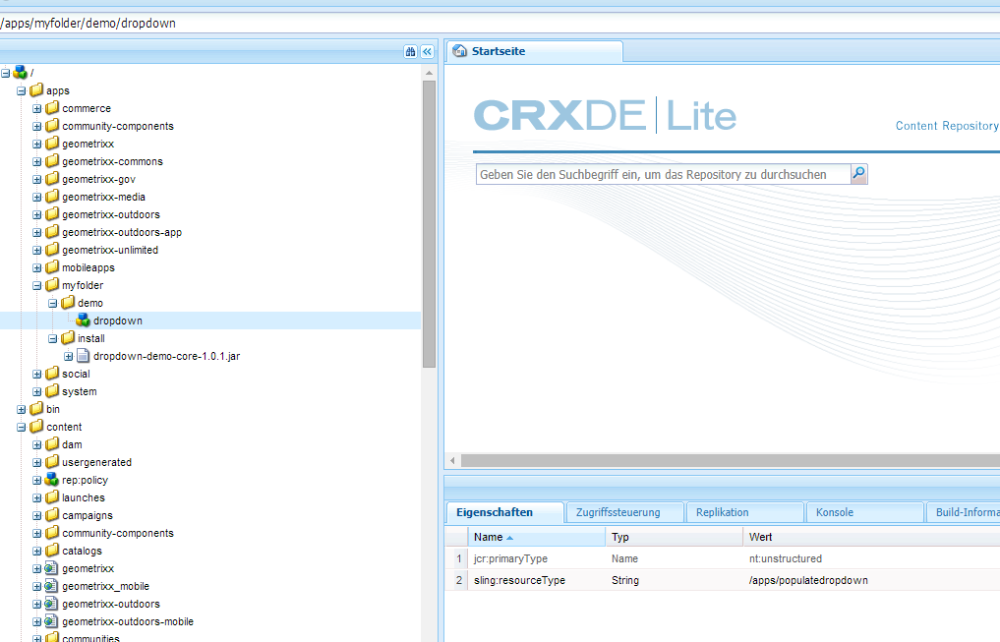
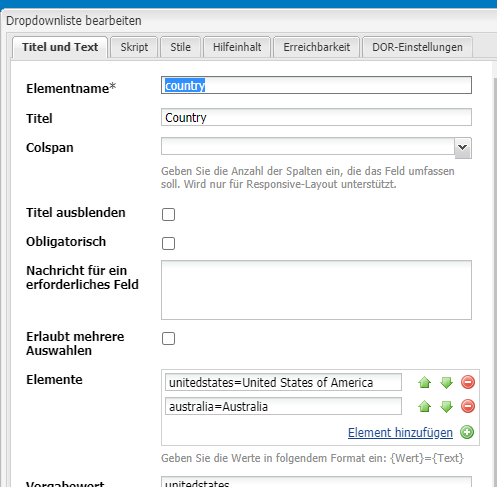
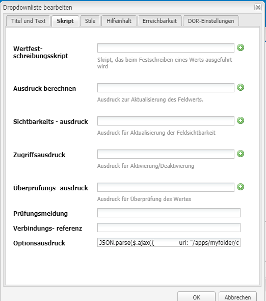
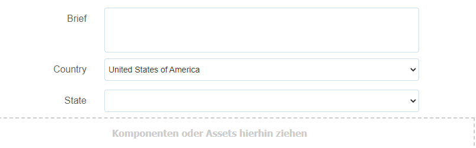

# Dynamisches Füllen von Dropdownlisten {#dynamically-populating-drop-down-lists}

## Voraussetzungen {#prerequisites}

* [Erstellung von OSGI-Bundles](https://experienceleague.adobe.com/docs/experience-manager-learn/getting-started-wknd-tutorial-develop/overview.html?lang=de&amp;CID=RedirectAEMCommunityKautuk)
* [Entwickeln von AEM-Komponenten](https://experienceleague.adobe.com/docs/experience-manager-cloud-service/implementing/developing/full-stack/components-templates/overview.html?lang=de#developing)
* [Erstellen von adaptiven Formularen](creating-adaptive-form.md)
* [Bearbeiten adaptiver Formulare](introduction-forms-authoring.md)

## Verfahren zum dynamischen Füllen von Dropdown-Listen {#procedure-to-dynamically-populate-drop-down-lists}

Gehen Sie von einem Szenario aus, in dem Sie die Dropdownliste **Bundesland** basierend auf einem Wert füllen möchten, den Sie in der Dropdownliste **Land** auswählen. Wenn Sie in der Dropdownliste **Land** den Eintrag „Australien“ wählen, werden in der Dropdownliste **Bundesland** die australischen Bundesstaaten angezeigt. Im folgenden Verfahren wird beschrieben, wie Sie dabei vorgehen.

1. Erstellen Sie ein Projekt mit den folgenden Modulen:

   * Das Bundle, das die Logik für das Füllen der Dropdownliste enthält, in diesem Fall handelt es sich um ein Servlet.
   * Der Inhalt, der die .jar-Datei einbettet und über eine Dropdownressource verfügt. Das Servlet verweist auf diese Ressource.

1. Schreiben Sie ein Servlet basierend auf dem Abfrageparameter „Land“, das ein Array mit den Namen der Bundesländer im jeweiligen Land zurückgibt.

   ```java
   @Component(metatype = false)
   @Service(value = Servlet.class)
   @Properties({
           @Property(name = "sling.servlet.resourceTypes", value = "/apps/populatedropdown"),
           @Property(name = "sling.servlet.methods", value = {"GET", "POST"}),
           @Property(name = "service.description", value = "Populate states dropdown based on country value")
   })
   public class DropDownPopulator extends SlingAllMethodsServlet {
       private Logger logger = LoggerFactory.getLogger(DropDownPopulator.class);
   
       protected void doPost(SlingHttpServletRequest request,
                             final SlingHttpServletResponse response)
               throws ServletException, IOException {
           response.setHeader("Access-Control-Allow-Origin", "*");
           response.setContentType("application/json");
           response.setCharacterEncoding("UTF-8");
           try {
               String US_STATES[] = {"0=Alabama",
                       "1=Alaska",
                       "2=Arizona",
                       "3=Arkansas",
                       "4=California",
                       "5=Colorado",
                       "6=Connecticut",
                       "7=Delaware",
                       "8=Florida",
                       "9=Georgia",
                       "10=Hawaii",
                       "11=Idaho",
                       "12=Illinois",
                       "13=Indiana",
                       "14=Iowa",
                       "15=Kansas",
                       "16=Kentucky",
                       "17=Louisiana",
                       "18=Maine",
                       "19=Maryland",
                       "20=Massachusetts",
                       "21=Michigan",
                       "22=Minnesota",
                       "23=Mississippi",
                       "24=Missouri",
                       "25=Montana",
                       "26=Nebraska",
                       "27=Nevada",
                       "28=New Hampshire",
                       "29=New Jersey",
                       "30=New Mexico",
                       "31=New York",
                       "32=North Carolina",
                       "33=North Dakota",
                       "34=Ohio",
                       "35=Oklahoma",
                       "36=Oregon",
                       "37=Pennsylvania",
                       "38=Rhode Island",
                       "39=South Carolina",
                       "40=South Dakota",
                       "41=Tennessee",
                       "42=Texas",
                       "43=Utah",
                       "44=Vermont",
                       "45=Virginia",
                       "46=Washington",
                       "47=West Virginia",
                       "48=Wisconsin",
                       "49=Wyoming"};
               String AUSTRALIAN_STATES[] = {"0=Ashmore and Cartier Islands",
                       "1=Australian Antarctic Territory",
                       "2=Australian Capital Territory",
                       "3=Christmas Island",
                       "4=Cocos (Keeling) Islands",
                       "5=Coral Sea Islands",
                       "6=Heard Island and McDonald Islands",
                       "7=Jervis Bay Territory",
                       "8=New South Wales",
                       "9=Norfolk Island",
                       "10=Northern Territory",
                       "11=Queensland",
                       "12=South Australia",
                       "13=Tasmania",
                       "14=Victoria",
                       "15=Western Australia"};
               String country = request.getParameter("country");
               JSONArray stateJsonArray = new JSONArray();
               if (country.length() > 0) {
                   if ("australia".equalsIgnoreCase(country)) {
                       stateJsonArray = new JSONArray();
                       for (String state : AUSTRALIAN_STATES) {
                           stateJsonArray.put(state);
                       }
                   } else if ("unitedstates".equalsIgnoreCase(country)) {
                       stateJsonArray = new JSONArray();
                       for (String state : US_STATES) {
                           stateJsonArray.put(state);
                       }
                   }
                   response.setContentType("application/json");
                   response.getWriter().write(stateJsonArray.toString());
               }
   
           } catch ( Exception e) {
               logger.error(e.getMessage(), e);
           }
       }
   }
   ```

1. Erstellen Sie einen Dropdown-Knoten unter einer bestimmten Ordnerhierarchie im Ordner „apps“ (erstellen Sie z. B. einen Knoten unter /apps/myfolder/demo). Stellen Sie sicher, dass der Parameter `sling:resourceType` für den Knoten mit dem, auf den das Servlet verweist (/apps/populatedropdown), identisch ist.

   

1. Komprimieren Sie den Inhaltsknoten und betten Sie die .jar-Datei in einem bestimmten Verzeichnis ein (beispielsweise /apps/myfolder/demo/install/). Stellen Sie dieselbe Datei auf dem Server bereit.
1. Erstellen Sie ein adaptives Formular und fügen Sie zwei Dropdownlisten namens „Land“ und „Bundesland“ hinzu. Die Liste „Land“ kann die Namen von Ländern enthalten. Die Liste „Bundesland“ kann dynamisch die Namen der Bundesländer für das in der ersten Liste ausgewählte Land einfügen.

   Fügen Sie die Namen der Länder hinzu, die Sie in der Liste „Land“ anzeigen möchten. Fügen Sie in der Liste „Bundesland“ ein Skript hinzu, mit dem sie basierend auf dem in der Liste „Land“ gewählten Land gefüllt wird.

     

   ```javascript
   JSON.parse(
       $.ajax({
           url: "/apps/myfolder/demo/dropdown",
           type: "POST",
           async: false,
           data: {"country": country.value},
            success: function(res){},
            error : function (message) {
                 guideBridge._guide.logger().log(message);
                 successFlag = false;
                 }
              })
   .responseText);
   ```

Das Inhaltspaket, das ein Beispiel für ein adaptives Formular (demo/AFdemo) enthält, in dem der obige Code implementiert ist.

[Datei laden](assets/dropdown-demo-content-1.0.1-snapshot.zip)
