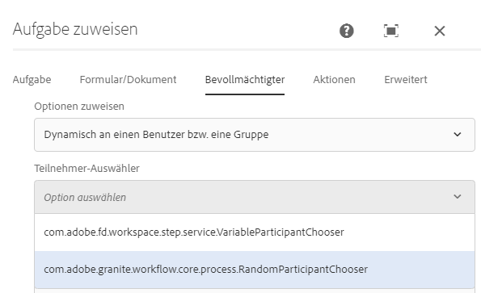

# Dynamische Benutzer- oder Gruppenauswahl im AEM-Workflow {#dynamically-select-a-user-or-group-for-aem-forms-centric-workflow-steps}

Erfahren Sie, wie Sie zur Laufzeit einen Benutzer oder eine Gruppe für einen [!DNL AEM Forms]-Workflow auswählen.

In großen Unternehmen müssen Benutzende für einen Prozess dynamisch ausgewählt werden. Zum Beispiel die Auswahl von Außendienstmitarbeitenden zur Betreuung von Kundschaft auf der Grundlage der Nähe der Mitarbeitenden zur Kundschaft. In einem solchen Szenario werden die Mitarbeitenden dynamisch ausgewählt.

Die Schritte „Aufgabe zuweisen“ und „[!DNL Adobe Sign]“ [Forms-zentrierter Workflows unter OSGi](aem-forms-workflow.md) bieten Optionen für die dynamische Auswahl von Benutzern. Sie können ECMAScript oder OSGi-Bundles verwenden, um einen Verantwortlichen für den Schritt „Aufgabe zuweisen“ oder Unterzeichner für den Schritt „Dokument signieren“ dynamisch auszuwählen.

## Verwenden von ECMAScript zur dynamischen Auswahl eines Benutzers oder einer Gruppe {#use-ecmascript-to-dynamically-select-a-user-or-group}

ECMAScript ist eine Skriptsprache. Sie wird für die Client-seitige Skripterstellung und Server-Anwendungen verwendet. Führen Sie die folgenden Schritte aus, um eine Benutzerin bzw. einen Benutzer oder eine Gruppe mit ECMAScript dynamisch auszuwählen:

1. Öffnen Sie CRXDE Lite. Die URL lautet `https://'[server]:[port]'/crx/de/index.jsp`.
1. Erstellen Sie eine Datei mit der Erweiterung „.ecma“ unter folgendem Pfad. Wenn der Pfad (Knotenstruktur) nicht vorhanden ist, erstellen Sie ihn:

   * (Pfad für Schritt „Aufgabe zuweisen“) `/apps/fd/dashboard/scripts/participantChooser`
   * (Pfad für Signaturschritt) `/apps/fd/workflow/scripts/adobesign`

1. Fügen Sie der ECMA-Datei ein ECMAScript hinzu, welches über eine Logik zur dynamischen Auswahl von Benutzenden verfügt. Klicken Sie auf **[!UICONTROL Alle speichern]**.

   Beispielskripte finden Sie unter [Beispiele für ECMAScripts zur dynamischen Auswahl eines Benutzers oder einer Gruppe](dynamically-select-a-user-or-group-for-aem-workflow.md#sample-ecmascripts-to-dynamically-choose-a-user-or-a-group).

1. Fügen Sie den Anzeigenamen des Skripts hinzu. Dieser Name wird in den Workflow-Schritten angezeigt. Eingeben des Namens:

   1. Erweitern Sie den Skriptknoten, klicken Sie mit der rechten Maustaste auf den Knoten **[!UICONTROL jcr:content]** und dann auf **[!UICONTROL Mixins]**.
   1. Fügen Sie die Eigenschaft `mix:title` im Dialogfeld „Mixins bearbeiten“ hinzu und klicken Sie auf **OK**.
   1. Fügen Sie folgende Eigenschaft zum Knoten „jcr:content“ des Skripts hinzu:

      | Name | Typ | Wert |
      |--- |--- |--- |
      | jcr:title | Zeichenfolge | Geben Sie den Namen des Skripts an. Wählen Sie beispielsweise die nächstliegende Person aus, die im Außendienst tätig ist. Dieser Name wird in den Schritten „Aufgabe zuweisen“ und „Dokument unterschreiben“ angezeigt. |

   1. Klicken Sie auf **Alle speichern**. Das Skript ist nun zur Auswahl in den Komponenten des AEM-Workflows verfügbar.

      

### Beispiele für ECMAScripts zum dynamischen Auswählen eines Benutzers oder einer Gruppe {#sample-ecmascripts-to-dynamically-choose-a-user-or-a-group}

Im folgenden Beispiel wählt das ECMAScript dynamisch eine beauftragte Person für den Schritt „Aufgabe zuweisen“ aus. In diesem Skript wird eine Benutzerin bzw. ein Benutzer basierend auf dem Pfad der Nutzlast ausgewählt. Bevor Sie dieses Skript verwenden, stellen Sie sicher, dass alle im Skript erwähnten Benutzenden in AEM vorhanden sind. Wenn die im Skript erwähnten Benutzenden nicht in AEM vorhanden sind, kann der zugehörige Prozess fehlschlagen.

```javascript
function getParticipant() {

var workflowData = graniteWorkItem.getWorkflowData();

if (workflowData.getPayloadType() == "JCR_PATH") { 

var path = workflowData.getPayload().toString(); 
     if (path.indexOf("/content/geometrixx/en") == 0) {
    return "user1";
    } 
   else {
              return "user2";
            }
}
}
```

Im folgenden Beispiel wird vom ECMAScript dynamisch ein Verantwortlicher für den Schritt „[!DNL Adobe Sign]“ ausgewählt. Vor der Verwendung der unten aufgeführten Skripts müssen Sie sicherstellen, dass die Benutzerinformationen (E-Mail-Adressen und Telefonnummern), die im Skript erwähnt werden, richtig sind. Wenn die im Skript enthaltenen Benutzerdaten nicht korrekt sind, schlägt der entsprechende Prozess möglicherweise fehl.

>[!NOTE]
>
>Bei der Verwendung von ECMAScript für [!DNL Adobe Sign] muss sich das Skript im CRX-Repository unter /apps/fd/workflow/scripts/adobesign/ befinden und sollte über eine Funktion namens „getAdobeSignRecipients“ verfügen, mit der eine Liste der Benutzer zurückgegeben wird.

```javascript
function getAdobeSignRecipients() {

    var recipientSetInfos = new Packages.java.util.ArrayList();

    var recipientInfoSet = new com.adobe.aem.adobesign.recipient.RecipientSetInfo();
    var recipientInfoList = new Packages.java.util.ArrayList();
    var recipientInfo = new com.adobe.aem.adobesign.recipient.RecipientInfo();

    var email;
    var recipientAuthenticationMethod = com.adobe.aem.adobesign.recipient.RecipientAuthenticationMethod.PHONE;  
    //var recipientAuthenticationMethod = com.adobe.aem.adobesign.recipient.RecipientAuthenticationMethod.NONE;
    var securityOptions = null;

    var phoneNumber = "123456789";
    var countryCode = "+1";
    var recipientPhoneInfo = new Array();
    recipientPhoneInfo.push(new com.adobe.aem.adobesign.recipient.RecipientPhoneInfo(phoneNumber, countryCode));

     securityOptions = new com.adobe.aem.adobesign.recipient.RecipientSecurityOption(recipientAuthenticationMethod, recipientPhoneInfo , null);
    
    email = "example@example.com";
    
    recipientInfo.setEmail(email);
    recipientInfo.setSecurityOptions(securityOptions);
    
    recipientInfoList.add(recipientInfo);
    recipientInfoSet.setMemberInfos(recipientInfoList);
    recipientSetInfos.add(recipientInfoSet);

    return recipientSetInfos;

}
```

## Verwenden der Java-Schnittstelle zum dynamischen Auswählen eines Benutzers oder einer Gruppe {#use-java-interface-to-dynamically-choose-a-user-or-group}

Sie können die Java-Schnittstelle [RecipientInfoSpecifier](https://developer.adobe.com/experience-manager/reference-materials/6-5/forms/javadocs/com/adobe/fd/workflow/adobesign/api/RecipientInfoSpecifier.html?lang=de) verwenden, um einen Benutzer oder eine Gruppe für die Schritte „[!DNL Adobe Sign]“ und „Aufgabe zuweisen“ dynamisch auszuwählen. Sie können ein OSGi-Bundle erstellen, das die Java-Schnittstelle [RecipientInfoSpecifier](https://developer.adobe.com/experience-manager/reference-materials/6-5/forms/javadocs/com/adobe/fd/workflow/adobesign/api/RecipientInfoSpecifier.html?lang=de) verwendet, und es auf dem [!DNL AEM Forms]-Server bereitstellen. Dadurch wird die Option zur Auswahl in den Komponenten „Aufgabe zuweisen“ und „[!DNL Adobe Sign]“ im AEM-Workflow verfügbar.

Sie benötigen die Dateien [[!DNL AEM Forms] Client SDK](https://experienceleague.adobe.com/docs/experience-manager-release-information/aem-release-updates/forms-updates/aem-forms-releases.html?lang=de)-JAR und [granite-JAR](https://repo1.maven.org/maven2/com/adobe/granite/com.adobe.granite.workflow.api/1.0.2/), um die unten aufgeführten Code-Beispiele zu kompilieren. Fügen Sie diese JAR-Dateien dem OSGi-Bundle-Projekt als externe Abhängigkeiten hinzu. Sie können eine beliebige Java-IDE verwenden, um ein OSGi-Bundle zu erstellen. Das folgende Beispiel zeigt die Erstellung eines OSGi-Bundles mithilfe von Eclipse:

1. Öffnen Sie die Eclipse-IDE. Navigieren Sie zu **[!UICONTROL Datei]** > **[!UICONTROL Neues Projekt]**.
1. Wählen Sie im Assistenten-Dialogfeld **[!UICONTROL Maven-Projekt]** aus und klicken Sie auf **[!UICONTROL Weiter]**.
1. Behalten Sie im Feld „Neues Maven-Projekt“ die Standardeinstellungen bei und klicken Sie auf **[!UICONTROL Weiter]**. Wählen Sie einen Archetyp aus und klicken Sie auf **[!UICONTROL Weiter]**. Beispiel: maven-archetype-quickstart. Geben Sie **[!UICONTROL Group Id]**, **[!UICONTROL Artifact ID]**, **[!UICONTROL Version]** und **[!UICONTROL Paket]** für das Projekt an und klicken Sie auf **[!UICONTROL Beenden]**. Das Projekt wird erstellt.
1. Öffnen Sie die Datei „pom.xml“ zur Bearbeitung und ersetzen Sie den gesamten Inhalt dieser Datei durch den folgenden Text:

   ```xml
   <project xmlns="https://maven.apache.org/POM/4.0.0" xmlns:xsi="https://www.w3.org/2001/XMLSchema-instance"
       xsi:schemaLocation="https://maven.apache.org/POM/4.0.0 https://maven.apache.org/xsd/maven-4.0.0.xsd">
       <modelVersion>4.0.0</modelVersion>
   
       <groupId>getAgent</groupId>
       <artifactId>assignToAgent</artifactId>
       <version>1.0</version>
       <packaging>bundle</packaging><!-- packaging type bundle is must -->
   
       <name>assignToAgent</name>
       <url>https://maven.apache.org</url>
       <repositories>
           <repository>
               <id>adobe</id>
               <name>Adobe Public Repository</name>
               <url>https://repo1.maven.org/maven2/com/adobe/</url>
               <layout>default</layout>
           </repository>
       </repositories>
       <pluginRepositories>
           <pluginRepository>
               <id>adobe</id>
               <name>Adobe Public Repository</name>
               <url>https://repo1.maven.org/maven2/com/adobe/</url>
               <layout>default</layout>
           </pluginRepository>
       </pluginRepositories>
   
       <dependencies>
           <dependency>
               <groupId>com.adobe.aemfd</groupId>
               <artifactId>aemfd-client-sdk</artifactId>
               <version>6.0.138</version>
           </dependency>
           <dependency>
               <groupId>com.adobe.granite</groupId>
               <artifactId>com.adobe.granite.workflow.api</artifactId>
               <version>1.0.0</version>
           </dependency>
   
           <dependency>
               <groupId>org.osgi</groupId>
               <artifactId>org.osgi.core</artifactId>
               <version>4.2.0</version>
               <scope>provided</scope>
           </dependency>
   
           <dependency>
               <groupId>org.apache.felix</groupId>
               <artifactId>org.apache.felix.scr.annotations</artifactId>
               <version>1.7.0</version>
   
           </dependency>
   
           <dependency>
               <groupId>org.apache.sling</groupId>
               <artifactId>org.apache.sling.api</artifactId>
               <version>2.2.0</version>
   
           </dependency>
   
       </dependencies>
   
       <!-- ====================================================================== -->
       <!-- B U I L D D E F I N I T I O N -->
       <!-- ====================================================================== -->
       <build>
           <plugins>
   
               <plugin>
                   <groupId>org.apache.felix</groupId>
                   <artifactId>maven-bundle-plugin</artifactId>
                   <extensions>true</extensions>
                   <configuration>
                       <instructions>
                           <Bundle-SymbolicName>com.aem.assigntoAgent-bundle</Bundle-SymbolicName>
                       </instructions>
                   </configuration>
               </plugin>
   
               <plugin>
                   <groupId>org.apache.felix</groupId>
                   <artifactId>maven-scr-plugin</artifactId>
                   <version>1.9.0</version>
                   <executions>
                       <execution>
                           <id>generate-scr-descriptor</id>
                           <goals>
                               <goal>scr</goal>
                           </goals>
                       </execution>
                   </executions>
               </plugin>
           </plugins>
       </build>
   
   </project>
   ```

1. Fügen Sie Quell-Code hinzu, der die Java-Schnittstelle [RecipientInfoSpecifier](https://developer.adobe.com/experience-manager/reference-materials/6-5/forms/javadocs/com/adobe/fd/workflow/adobesign/api/RecipientInfoSpecifier.html?lang=de) verwendet, um einen Benutzer oder eine Gruppe für den Schritt „Aufgabe zuweisen“ dynamisch zuzuweisen. Unter [Beispiel für die dynamische Auswahl eines Benutzers oder einer Gruppe mithilfe einer Java-Schnittstelle](#-sample-scripts-for) finden Sie einen Beispiel-Code.
1. Öffnen Sie eine Eingabeaufforderung und navigieren Sie zum Ordner, der das OSGi-Bundle-Projekt enthält. Verwenden Sie den folgenden Befehl, um das OSGi-Bundle zu erstellen:

   `mvn clean install`

1. Laden Sie das Bundle auf einen [!DNL AEM Forms]-Server hoch. Sie können AEM Package Manager verwenden, um das Paket in einen [!DNL AEM Forms]-Server zu importieren.

Nachdem das Bundle importiert wurde, ist die Option für die Auswahl der Java-Schnittstelle zum dynamischen Auswählen eines Benutzers oder einer Gruppe für die Schritte „Adobe Sign“ und „Aufgabe zuweisen“ verfügbar.

### Beispiele für Java-Code zum dynamischen Auswählen eines Benutzers oder einer Gruppe {#sample-java-code-to-dynamically-choose-a-user-or-a-group}

Der Beispiel-Code im folgenden Beispiel wählt dynamisch einen Verantwortlichen für den Schritt „Adobe Sign“ aus. Sie verwenden den Code in einem OSGi-Bundle. Vor der Verwendung der unten aufgeführten Codes müssen Sie sicherstellen, dass die Benutzerinformationen (E-Mail-Adressen und Telefonnummern), die im Code genannt werden, richtig sind. Wenn die im Code enthaltenen Benutzerdaten nicht korrekt sind, schlägt der entsprechende Prozess möglicherweise fehl.

```java
/*************************************************************************

 *
 * ADOBE CONFIDENTIAL
 * __________________
 *
 * Copyright 2016 Adobe Systems Incorporated
 * All Rights Reserved.
 *
 * NOTICE:  All information contained herein is, and remains
 * the property of Adobe Systems Incorporated and its suppliers,
 * if any.  The intellectual and technical concepts contained
 * herein are proprietary to Adobe Systems Incorporated and its
 * suppliers and are protected by trade secret or copyright law.
 * Dissemination of this information or reproduction of this material
 * is strictly forbidden unless prior written permission is obtained
 * from Adobe Systems Incorporated.
 **************************************************************************/
 
package com.aem.impl;

import java.util.ArrayList;
import java.util.List;

import com.adobe.aem.adobesign.recipient.RecipientAuthenticationMethod;
import com.adobe.aem.adobesign.recipient.RecipientInfo;
import com.adobe.aem.adobesign.recipient.RecipientPhoneInfo;
import com.adobe.aem.adobesign.recipient.RecipientSecurityOption;
import com.adobe.aem.adobesign.recipient.RecipientSetInfo;
import com.adobe.fd.workflow.adobesign.api.RecipientInfoSpecifier;
import com.adobe.granite.workflow.WorkflowException;
import com.adobe.granite.workflow.WorkflowSession;
import com.adobe.granite.workflow.exec.WorkItem;
import com.adobe.granite.workflow.metadata.MetaDataMap;
import org.apache.felix.scr.annotations.Component;
import org.apache.felix.scr.annotations.Service;

/**
 * <code>DummyRecipientInfoSpecifier implementation. A sample code to write implementation of RecipientInfoSpecifier to choose recipients/code>...
 */
@Service

@Component(metatype = false)
public class DummyRecipientChoser implements RecipientInfoSpecifier {
    public List<RecipientSetInfo> getAdobeSignRecipients(WorkItem workItem, WorkflowSession workflowSession, MetaDataMap args) throws WorkflowException {

        List<RecipientSetInfo> recipientSetInfos = new ArrayList<RecipientSetInfo>();

                //First Recipient

                RecipientSetInfo recipientInfoSet1 = new RecipientSetInfo();
                List<RecipientInfo> recipientInfoList = new ArrayList<RecipientInfo>();
                RecipientInfo recipientInfo1 = new RecipientInfo();//Member to first recipient

                String email;

                RecipientAuthenticationMethod recipientAuthenticationMethod = RecipientAuthenticationMethod.WEB_IDENTITY;
                RecipientSecurityOption securityOptions = null;

                String phoneNumber = "123456789";
                String countryCode = "+1";
                RecipientPhoneInfo[] recipientPhoneInfo = new RecipientPhoneInfo[1];  //if multiple phone numbers, size>1
                recipientPhoneInfo[0] = new RecipientPhoneInfo(phoneNumber, countryCode);
                securityOptions = new RecipientSecurityOption(recipientAuthenticationMethod, recipientPhoneInfo , null);
                 
                email = "example@example.com";

                recipientInfo1.setEmail(email);
                recipientInfo1.setSecurityOptions(securityOptions);

                recipientInfoList.add(recipientInfo1);  //Add member

                recipientInfoSet1.setMemberInfos(recipientInfoList);

                //Second Recipient

                RecipientSetInfo recipientInfoSet2 = new RecipientSetInfo();
                List<RecipientInfo> recipientInfoList2 = new ArrayList<RecipientInfo>();

                recipientAuthenticationMethod = RecipientAuthenticationMethod.PHONE;
                securityOptions = null;
                 
                phoneNumber = "987654321";//"0123456789";

                countryCode = "+1";
                RecipientPhoneInfo[] recipientPhoneInfo_1 = new RecipientPhoneInfo[1];
                recipientPhoneInfo_1[0] = new RecipientPhoneInfo(phoneNumber, countryCode);
                securityOptions = new RecipientSecurityOption(recipientAuthenticationMethod, recipientPhoneInfo_1 , null);
                 
                email = "example2@example.com";//"dummymail2@domain.com";

                RecipientInfo recipientInfo2  = new RecipientInfo();
                recipientInfo2.setEmail(email);
                recipientInfo2.setSecurityOptions(securityOptions);

                recipientInfoList2.add(recipientInfo2);  //Add member

                recipientInfoSet2.setMemberInfos(recipientInfoList2);

                //*********************************

                recipientSetInfos.add(recipientInfoSet1); 
                recipientSetInfos.add(recipientInfoSet2);

        return recipientSetInfos;

    }

}
```

>[!MORELIKETHIS]
>
>* [Verwenden eines AEM Forms-Workflows für die Automatisierung von Geschäftsprozessen](/help/forms/aem-forms-workflow.md)
