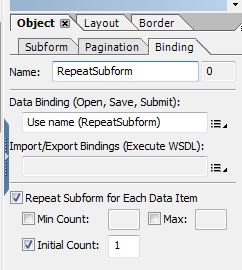

# Häufig gestellte Fragen (FAQ) für HTML5-Formulare{#frequently-asked-questions-faq-for-html-forms}

<span class="preview"> Die HTML5-Formularfunktion wird als Teil des Early-Access-Programms angeboten. Um Zugriff anzufordern, senden Sie eine E-Mail von Ihrer offiziellen (Arbeits-)E-Mail-ID an aem-forms-ea@adobe.com.
</span>

Es gibt einige häufig gestellte Fragen (FAQ) zu Layout, Skriptunterstützung und dem Umfang von HTML5-Formularen.

## Layout {#layout}

1. Warum werden Barcodes und das Unterschriftsfeld in meinem Formular nicht angezeigt?

   Antwort: Barcodes und Unterschriftsfelder sind in HTML- oder Mobilgerät-Szenarien nicht wichtig. Diese Felder erscheinen als nicht interaktiver Bereich. AEM Forms Designer bietet allerdings ein neues Scribble-Unterschriftsfeld, das anstelle des Unterschriftsfeldes verwendet werden kann. Sie können auch ein [benutzerdefiniertes Widget](/help/forms/custom-widgets.md) für Barcodes hinzufügen und integrieren.

1. Wird im XFA-Textfeld Rich Text unterstützt?

   Antwort: Das XFA-Feld, das umfangreiche Inhalte in AEM Forms Designer zulässt, wird nicht unterstützt, sondern als normaler Text dargestellt, der nicht über die Benutzeroberfläche formatiert werden kann. Auch XFA-Felder mit Kombinationseigenschaft werden als normales Feld angezeigt, obwohl je nach dem Wert der Kombinationszahlen Einschränkungen hinsichtlich der zulässigen Zeichenanzahl möglich sind.

1. Gibt es Einschränkungen bei der Verwendung wiederholbarer Teilformulare?

   Antwort: Wiederholbare Teilformulare müssen eine Anfangszahl von 1 oder höher haben. Wiederholbare Teilformulare mit einer Anfangszahl von Null werden nicht unterstützt. Sie können auch ein wiederholbares Teilformular verwenden und es nicht anzeigen, wenn das Formular geladen wird. Um den Anwendungsfall zu erreichen: 

   1. Legen Sie die Anfangszahl des wiederholbaren Teilformulars auf 1 fest.

      

   1. Verwenden Sie das initialize-Ereignis des Formulars, um die primäre Instanz des Teilformulars auszublenden. Der folgende Code blendet beispielsweise die primäre Instanz des Teilformulars bei der Formularinitialisierung aus. Außerdem überprüft es den App-Typ, um sicherzustellen, dass das Skript nur auf der Clientseite ausgeführt wird: 

      ```javascript
      if ((xfa.host.appType == "HTML 5" || xfa.host.appType == "Exchange-Pro" || xfa.host.appType == "Reader")&&(_RepeatSubform.count == 1)&&(form1.Page1.Subform1.RepeatSubform.Key.rawValue == null)) {
      RepeatSubform.presence = "hidden";
      }
      ```

   1. Öffnen Sie das Skript zum Hinzufügen einer Instanz des Teilformulars zum Bearbeiten. Fügen Sie den folgenden Code hinzu, um eine Instanz des Teilformularskripts hinzuzufügen.

      Der folgende Code überprüft die ausgeblendete Instanz des Teilformulars. Wenn die ausgeblendete Instanz des Teilformulars gefunden wird, löschen Sie die ausgeblendete Instanz des Teilformulars und fügen Sie eine neue Instanz ein. Wenn die ausgeblendete Instanz des Teilformulars nicht gefunden wird, fügen Sie einfach eine neue Instanz des Teilformulars ein.

      ```javascript
      if (RepeatSubform.presence == "hidden")
      {
      RepeatSubform.instanceManager.insertInstance(0);
      RepeatSubform.instanceManager.removeInstance(1);
      }
      else
      {
      RepeatSubform.instanceManager.addInstance(1);
      }
      ```

   1. Öffnen Sie das Skript zum Entfernen einer Instanz des Teilformulars zum Bearbeiten. Fügen Sie Code ähnlich dem folgenden zum Entfernen einer Instanz des Teilformulars hinzu.

      Der Code überprüft die Anzahl der Teilformulare. Wenn die Anzahl der Teilformulare 1 erreicht, blendet der Code das Teilformular aus, anstatt es zu löschen. 

      ```javascript
      if (RepeatSubform.instanceManager.count == 1) {
      RepeatSubform.presence = "hidden";
      } else {
      RepeatSubform.instanceManager.removeInstance(RepeatSubform.instanceManager.count - 1);
      }
      ```

   1. Öffnen Sie das presubmit-Ereignis des Formulars zum Bearbeiten. Fügen Sie dem Ereignis das folgende Skript hinzu, um die ausgeblendete Instanz des Skripts vor der Bearbeitung zu entfernen. Dadurch wird verhindert, dass Daten des ausgeblendeten Teilformulars bei der Übermittlung gesendet werden.

      ```javascript
      if(RepeatSubform.instanceManager.count == 1 && RepeatSubform.presence == "hidden") {
      RepeatSubform.instanceManager.removeInstance(0);
      }
      ```

1. Gibt es Einschränkungen bei der Verwendung ausgeblendeter Teilformulare?

   Antwort: Ein ausgeblendetes Teilformular mit einer komplexen Hierarchie, die auf mehrere Seiten aufgeteilt ist, führt zu Problemen mit dem Layout. Eine Option besteht darin, das Teilformular am Anfang als sichtbar zu markieren und es anschließend in einem auf Logik oder Daten basierenden Initialisierungsskript auszublenden.

1. Warum sind einige Textteile abgeschnitten oder werden in HTML5 nicht korrekt angezeigt?

   Antwort: Wenn nicht genügend Platz zum Anzeigen des Inhalts eines Zeichnungs- oder Beschriftungs-Textelements vorhanden ist, werden manche Texte im Rendering von Mobile Forms abgeschnitten angezeigt. Diese Kürzung ist dann auch in der Designansicht von AEM Forms Designer sichtbar. Zwar kann eine solche Kürzung im PDF-Format bearbeitet werden, in HTML5-Formularen ist dies jedoch nicht möglich. Wenn Sie dieses Problem vermeiden möchten, stellen Sie genügend Platz zum Zeichnen oder für Beschriftungen zur Verfügung, damit der Text im Design-Modus von AEM Forms Designer nicht abgeschnitten wird.

1. Ich habe beim Layout Probleme mit fehlenden oder sich überlappenden Inhalten. Was ist der Grund dafür?

   Antwort: Wenn sich ein Text- oder Bildzeichnungselement an derselben Position befindet wie ein überlagertes Element (z. B. ein Rechteck), ist der Inhalt des Textzeichnungselements nicht sichtbar, wenn dieses in der Dokumentreihenfolge später kommt (in der Hierarchieansicht des AEM Forms Designer). PDF unterstützt eine transparente Überlagerung, HTML/Browser unterstützen jedoch keine transparente Überlagerung.

1. Warum werden einige Schriften im HTML-Formular in einer anderen Form angezeigt als beim Entwerfen des Formulars?

   Antwort: HTML5-Formulare erlauben keine Einbettung von Schriftarten (im Gegensatz zu PDF-Formularen, bei denen Schriftarten innerhalb des Formulars eingebettet sind). Damit die HTML-Version eines Formulars wie erwartet gerendert wird, stellen Sie sicher, dass die Schriftarten im CRX-Repository (AEM Content-Repository) Ihres AEM Forms-Servers und auf dem Rechner, auf dem AEM Designer installiert ist, verfügbar sind. Wenn die Schriftarten im CRX-Repository Ihres AEM Forms-Servers oder an dem Ort, an dem AEM Designer installiert ist, nicht verfügbar sind, wird das Formular mit Ersatzschriftarten gerendert.

1. Werden die Attribute „vAlign“ und „hAlign“ in HTML-Formularen unterstützt?

   Antwort: Ja, die Attribute „vAlign“ und „hAlign“ werden unterstützt. Das Attribut „vAlign“ wird in Internet Explorer und mehrzeiligen Feldern nicht unterstützt.

1. Unterstützen HTML5-Formulare hebräische Zeichen?

   Antwort: HTML5-Formulare unterstützen hebräische Zeichen in allen Browsern außer Microsoft Internet Explorer.

1. Gibt es in HTML5-Formularen Beschränkungen für numerische Felder?

   Antwort: Ja, HTML5-Formulare weisen einige Einschränkungen auf. Wenn die Anzahl der Ziffern die in der Picture-Klausel festgelegte Anzahl überschreitet, werden die Zahlen nicht lokalisiert, sondern im englischen Gebietsschema angezeigt.

1. Warum sind HTML-Formulare größer als PDF-Formulare?

   Antwort: Um ein XDP-Formular in ein HTML-Formular umzuwandeln, sind viele intermediäre Datenstrukturen und Objekte wie Formular-DOM, Daten-DOM und Layout-DOM erforderlich.

   Für PDF-Formulare verfügt Adobe Acrobat über eine integrierte XTG-Engine zum Erstellen von intermediären Datenstrukturen und Objekten. Acrobat übernimmt auch Layout und Skripte.

   Für HTML5-Formulare verfügen Browser nicht über eine integrierte XTG-Engine zum Erstellen von intermediären Datenstrukturen und Objekten aus rohen XDP-Byte. Für HTML5-Formulare werden als intermediäre Strukturen auf dem Server generiert und an den Client gesendet. Auf dem Client verwenden ein JavaScript-basiertes Skript und die Layout-Engine diese Zwischenstrukturen.

   Die Größe der Zwischenstruktur hängt von der Größe der Original-XDP und der mit der XDP zusammengeführten Daten ab.

1. Gibt es Einschränkungen bei der Verwendung von Tabellen in meinem XDP?

   Antwort: Beim Rendering komplexer Tabellen treten Probleme auf.

   * Abschnitte (Teilformularsätze) innerhalb einer Tabelle werden nicht unterstützt.
   * Die Kopf- oder Fußzeilen in einigen Tabellen sind für eine Wiederholung markiert. Die Aufteilung solcher Tabellen über mehrere Seiten kann zu Problemen führen.

1. Gibt es Einschränkungen bei barrierefreien Tabellen?

   Antwort: Ja barrierefreie Tabellen haben die folgenden Einschränkungen:

   * Geschachtelte Tabellen und Teilformulare innerhalb einer Tabelle werden nicht unterstützt.
   * Kopfzeilen werden nur für die erste Zeile bzw. die linken Spalten der Tabelle unterstützt. Kopfzeilen werden nicht für mittige Tabellenelemente unterstützt. Sie können Kopfzeilen auf mehrere Zeilen anwenden und Spaltenüberschriften und Spaltenüberschriften werden unterstützt, wenn alle derartigen Zeilen und Spalten auf der obersten Zeile oder in der ganz linken Spalte der Tabelle sind. 
   * `Rowspan` und`colspan` von einer beliebigen Stelle in der Tabelle wird nicht unterstützt. 

   * Sie können Instanzen von Zeilen, die Elemente mit rowspan-Werten größer als 1 enthalten, nicht dynamisch hinzufügen oder entfernen.

1. Was ist die Lesereihenfolge der QuickInfo und Beschriftung für Bildschirmleseprogramme?

   Antwort:
   * Wird QuickInfo und Beschriftung vorhanden sind, wird nur die Beschriftung gelesen. Wenn die Beschriftung nicht verfügbar ist, wird die QuickInfo gelesen. Sie können den Vorrang für das Lesen in einem XDP auch mit Forms Designer festlegen.
   * Wenn Sie den Mauszeiger über ein Element bewegen, wird die QuickInfo angezeigt. Wenn die QuickInfo nicht verfügbar ist, wird Sprachtext angezeigt. Wenn Sprachtext nicht verfügbar ist, dann wird der Feldname angezeigt.

1. Wenn mit dem Mauszeiger auf ein Feld gezeigt wird, wird eine QuickInfo angezeigt. Wie wird sie deaktiviert?

   Antwort: Um den Tooltip beim Daraufzeigen zu deaktivieren, wählen Sie im Bedienfeld „Barrierefreiheit“ von Designer die Option „Keine“.

1. In Designer kann ein Benutzer benutzerdefinierte Erscheinungsbildeigenschaften von Optionsfeldern und Kontrollkästchen konfigurieren. Berücksichtigen HTML5-Formulare beim Rendern von Formularen auch diese benutzerdefinierten Erscheinungsbildeigenschaften?

   Antwort: HTML5-Formulare ignorieren die benutzerdefinierten Darstellungseigenschaften von Optionsfeldern und Kontrollkästchen. Die Optionsfelder und Kontrollkästchen werden entsprechend den Spezifikationen des zugrundeliegenden Browsers angezeigt.

1. Wenn ein HTML5-Formular in einem unterstützten Browser geöffnet wird, wird der Rand der angrenzenden Felder nicht richtig ausgerichtet oder Teilformulare überlappen sich. Wenn das gleiche HTML5-Formular im Forms Designer in der Vorschau angezeigt wird, werden die Felder und das Layout nicht falsch ausgerichtet und die Teilformulare werden an der richtigen Position angezeigt. Wie lässt sich das Problem beheben?

   Antwort: Wenn ein Unterformular auf Flussinhalt eingestellt ist und das Unterformular ein ausgeblendetes Randelement hat, wird der Rand der nebeneinander platzierten Felder nicht richtig ausgerichtet oder die Unterformulare erscheinen überlappend. Um das Problem zu beheben, können Sie die versteckten &lt;border>-Elemente aus dem entsprechenden XDP entfernen oder mit Kommentaren versehen. Beispielsweise wird das folgende &lt;border>-Element als Kommentar markiert:

   ```xml
               <!--<border>
                  <edge presence="hidden"/>
                  <corner thickness="0.175mm" presence="hidden"/>
               </border> -->
   ```

1. Warum funktionieren Bildschirmlesehilfen nicht ordnungsgemäß mit dem Datums-/Uhrzeitfeldobjekt?

   Antwort: Bildschirmlesehilfen unterstützen keine Datums-/Zeitfelder. Sie können jedoch manuell Datum/Uhrzeit in das Feld eingeben, damit die Bildschirmlesehilfe dies liest. Verwenden Sie eine QuickInfo oder Text der Bildschirmlesehilfe, um den Benutzer anzuweisen, Datum/Uhrzeit für das Feld manuell auszuwählen.

1. Unterstützen HTML5-Formulare Anzeigemuster für schwebende Felder?

   Antwort: HTML5-Formulare unterstützen keine Anzeigemuster für schwebende Felder.

1. Welches Format hat das Datumsfeld in HTML5-Formularen?
Antwort: Das Datumsfeld akzeptiert das ISO-Format JJJJ-MM-TT. Wenn Sie ein Datum in einem anderen Format angeben, übernimmt das Datumsfeld die Formatierung erst, wenn der Benutzer das Feld mit der Tabulatortaste verlässt.

### Skripterstellung {#scripting}

1. Gibt es Einschränkungen bei der Implementierung von JavaScript in HTML-Formularen?

   Antwort:

   * Das Skript „xfa.connectionSet“ wird nur eingeschränkt unterstützt. Für „connectionSet“ werden nur Server-seitige Webservice-Aufrufe unterstützt. Detaillierte Informationen finden Sie unter [Skriptunterstützung](/help/forms/scripting-support.md).
   * In clientseitigen Skripten werden $record und $data nicht unterstützt. Wenn die Skripte jedoch in einen „formReady“-, „layoutReady“-Block geschrieben werden, funktionieren diese Skripte weiterhin, da die Ereignisse auf der Server-Seite ausgelöst werden.
   * XFA-Zeichnungselement-spezifische Skripte wie eine Änderung des Zeichnungstexts (oder im Falle von Feldern des Beschriftungstexts) werden nicht unterstützt.

1. Gibt es Einschränkungen bei der Verwendung von formCalc?

   Antwort: Derzeit ist nur eine Teilmenge der formCalc-Skripte implementiert. Detaillierte Informationen finden Sie unter [Skriptunterstützung](/help/forms/scripting-support.md).

1. Gibt es eine empfohlene Benennungskonvention und gibt es reservierte Schlüsselwörter, die vermieden werden sollten?

   Antwort:
   * In AEM Forms Designer wird empfohlen, den Namen eines Objekts (z. B. eines Unterformulars oder eines Textfelds) nicht mit einem Unterstrich (_) zu beginnen. Um einen Unterstrich am Anfang des Namens zu verwenden, fügen Sie ein Präfix nach dem Unterstrich hinzu,_&lt;prefix>&lt;objectname>.
   * Alle HTML5-Formular-APIs sind reservierte Schlüsselwörter. Bei benutzerdefinierten APIs/Funktionen müssen Sie einen Namen verwenden, der nicht mit den [HTML5 Forms APIs](/help/forms/scripting-support.md) identisch ist.

1. Unterstützen HTML5-Formulare schwebende Felder?

   Antwort: Ja, HTML5-Forms unterstützen schwebende Felder. Um schwebende Felder zu aktivieren, fügen Sie folgende Eigenschaften zum Render-Profil hinzu:

   >[!NOTE]
   >
   >Standardmäßig werden die Felder nicht als schwebende Felder aktiviert. Sie können den Forms Designer verwenden, um die Schwebe-Eigenschaften der Felder festzulegen.

   1. Öffnen Sie CRXDE Lite und navigieren Sie zum Knoten `/content/xfaforms/profiles/default`.
   1. Fügen Sie eine `mfDataDependentFloatingField`-Eigenschaft mit dem Typ „Zeichenfolge“ hinzu und legen Sie den Wert der Eigenschaft auf `true` fest.
   1. Klicken Sie auf **Alle speichern**. Jetzt sind die schwebenden Felder für die HTML-Formulare mit dem aktualisierten Renderprofil aktiviert.

      >[!NOTE]
      >
      >Um schwebende Felder für ein spezifisches Formular zu aktivieren, ohne das Renderprofil zu aktualisieren, geben Sie die Eigenschaft „mfDataDependentFloatingField=true“ als URL-Parameter weiter.

1. Führen HTML5-Formulare das Initialisierungsskript und das Formularbereitschaftsereignis mehrmals aus?

   Antwort: Ja, die Initialisierungsskripte und Formularbereitschaftsereignisse werden mehrfach ausgeführt, mindestens einmal auf dem Server und einmal auf der Client-Seite. Es wird empfohlen, Skripte wie initialize oder form:ready-Ereignisse basierend auf einer Geschäftslogik (Formular- oder Felddaten) zu schreiben, sodass die Aktion basierend auf dem Status der Daten und idempotent (wenn die Daten gleich sind) ausgeführt wird.

### XDP-Entwurf {#designing-xdp}

1. Gibt es reservierte Schlüsselwörter in HTML5-Formularen?

   Antwort: Alle HTML5-Formular-APIs sind reservierte Schlüsselwörter. Bei benutzerdefinierten APIs/Funktionen müssen Sie einen Namen verwenden, der nicht mit den [HTML5 Forms APIs](/help/forms/scripting-support.md) identisch ist. Wenn Sie, abgesehen von reservierten Schlüsselwörtern, Objektnamen verwenden, die mit einem Unterstrich (_) beginnen, wird empfohlen, nach dem Unterstrich ein Präfix einzufügen. Das Einfügen eines Präfix verhindert mögliche Konflikte mit HTML5-Formular-internen APIs. Beispiel: `_fpField1`
