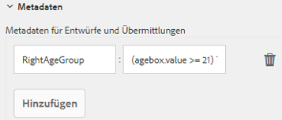
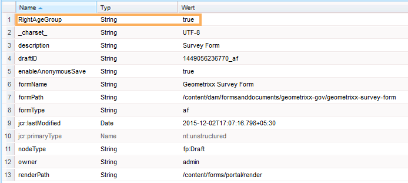
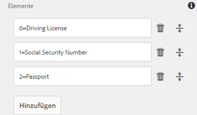
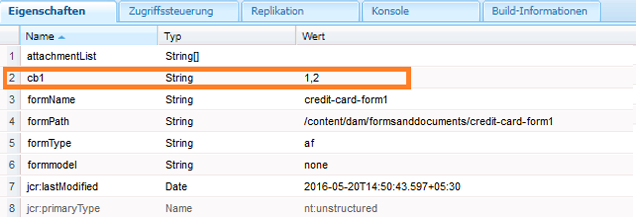

# Hinzufügen von Informationen aus Benutzerdaten zu Formularübermittlungsmetadaten {#adding-information-from-user-data-to-form-submission-metadata}

Sie können Werte verwenden, die in ein Element Ihres Formulars eingegeben wurden, um Metadatenfelder eines Entwurfs oder einer Formularübermittlung zu berechnen. Mit Metadaten können Sie Inhalte auf der Grundlage von Benutzerdaten filtern. Beispiel: Ein Benutzer gibt „Hans Mustermann“ in das Namensfeld Ihres Formulars ein. Sie können diese Informationen verwenden, um Metadaten zu berechnen, die diese Übermittlung unter den Initialen „HM“ kategorisieren können.

Um die Metadatenfelder mit den vom Benutzer eingegebenen Werten zu berechnen, müssen Sie Elemente Ihres Formulars in den Metadaten hinzufügen. Wenn ein Benutzer einen Wert in diesem Element eingibt, verwendet ein Skript den Wert, um diese Informationen zu berechnen. Diese Informationen werden den Metadaten hinzugefügt. Wenn Sie ein Element als Metadatenfeld hinzufügen, stellen Sie einen Schlüssel dafür bereit. Der Schlüssel wird als Feld in den Metadaten hinzugefügt und die berechneten Informationen werden damit protokolliert.

Beispielsweise veröffentlicht eine Krankenversicherung ein Formular. In diesem Formular erfasst ein Feld das Alter der Endbenutzenden. Die Kundin bzw. der Kunde möchte alle Übermittlungen in einer bestimmten Altersgruppe überprüfen, nachdem mehrere Benutzende das Formular übermittelt haben. Statt alle Daten einzeln zu überprüfen, was mit zunehmender Anzahl an Formularen schwieriger wird, helfen zusätzliche Metadaten dabei. Die Autorin bzw. der Autor des Formulars kann konfigurieren, welche Eigenschaften/Daten, die von der Benutzerin bzw. dem Benutzer angegeben wurden, auf der obersten Ebene gespeichert werden, damit die Suche möglichst einfach ist. Zusätzliche Metadaten sind von Benutzenden ausgefüllte Informationen, die auf der obersten Ebene des Metadatenknotens gespeichert werden, wie von der Autorin bzw. dem Autor konfiguriert.

Ein weiteres Beispiel ist ein Formular, das E-Mail-IDs und Telefonnummern erfasst. Wenn eine Benutzerin bzw. ein Benutzer dieses Formular anonym besucht und das Formular verlässt, kann die Autorin bzw. der Autor das Formular so konfigurieren, dass die E-Mail-Adresse und die Telefonnummer automatisch gespeichert werden. Dieses Formular wird automatisch gespeichert und die Telefonnummer und die E-Mail-Adresse werden im Metadatenknoten des Entwurfs gespeichert. Ein Anwendungsfall dieser Konfiguration ist das Lead-Management-Dashboard.

## Hinzufügen von Formularelementen zu Metadaten {#adding-form-elements-to-metadata}

Führen Sie die folgenden Schritte aus, um den Metadaten ein Element hinzuzufügen:

1. Öffnen Sie das adaptive Formular im Bearbeitungsmodus.\
   Um das Formular im Bearbeitungsmodus zu öffnen, wählen Sie es im Forms Manager aus und wählen Sie **[!UICONTROL Öffnen]**.
1. Wählen Sie im Bearbeitungsmodus eine Komponente aus, wählen Sie  > **[!DNL Adaptive Form Container]** und dann .
1. Klicken Sie in der Seitenleiste auf **[!DNL Metadata]**.
1. Klicken Sie im Abschnitt „Metadaten“ auf **[!DNL Add]**.
1. Verwenden Sie das Feld „Wert“ auf der Registerkarte „Metadaten“, um Skripte hinzuzufügen. Die Skripte, die Sie hinzufügen, erfassen Daten aus Elementen im Formular und berechnen Werte, die an die Metadaten übergeben werden.

   Zum Beispiel wird **[!DNL true]** den Metadaten hinzugefügt, wenn der eingegebene Wert für Alter größer als 21 ist, und **[!DNL false]** wird eingefügt, wenn er kleiner als 21 ist. Sie können das folgende Skript auf der Registerkarte „Metadaten“ eingeben:

   `(agebox.value >= 21) ? true : false`

   

   Skript, das auf der Registerkarte „Metadaten“ eingegeben wurde

1. Klicken Sie auf **[!DNL OK]**.

Nachdem eine Benutzerin bzw. ein Benutzer Daten in das als Metadatenfeld ausgewählte Element eingegeben hat, werden die berechneten Informationen in den Metadaten protokolliert. Sie können die Metadaten im Repository sehen, das Sie zum Speichern von Metadaten konfiguriert haben.

## Anzeigen der aktualisierten Formularübermittlungsmetadaten: {#seeing-updated-form-nbsp-submission-metadata}

Für das obige Beispiel werden die Metadaten im CRX-Repository gespeichert. Die Metadaten sehen wie folgt aus:

Wenn Sie den Metadaten ein Kontrollkästchenelement hinzufügen, werden die ausgewählten Werte als kommagetrennte Zeichenfolge gespeichert. Angenommen, Sie fügen Ihrem Formular ein Kontrollkästchenelement hinzu und legen als Namen `checkbox1` fest. Sie fügen den Eigenschaften der Kontrollkästchenkomponente die Elemente „Führerschein“, „Sozialversicherungsnummer“ und „Reisepass“ für die Werte 0, 1 und 2 hinzu.

Sie wählen einen Container für das adaptive Formular aus, und in den Formulareigenschaften fügen Sie den Metadatenschlüssel `cb1` hinzu, in dem `checkbox1.value` gespeichert wird, und dann veröffentlichen Sie das Formular. Wenn eine Kundin oder ein Kunde das Formular ausfüllt, wählt sie bzw. er im Kontrollkästchen die Optionen „Pass“ und „Sozialversicherungsnummer“ aus. Die Werte 1 und 2 werden als 1, 2 im Feld „cb1“ der Übermittlungsmetadaten gespeichert.

>[!NOTE]
>
>Das obige Beispiel ist lediglich für Schulungszwecke gedacht. Stellen Sie sicher, dass Sie im richtigen Ordner, wie in der [!DNL Experience Manager Forms]-Implementierung konfiguriert, nach den Metadaten suchen.
