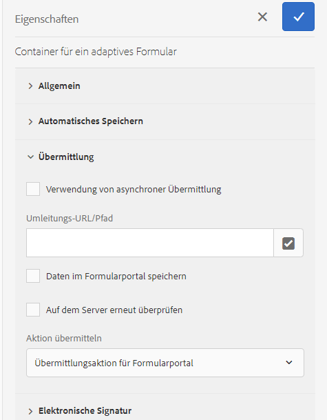

# Verbinden eines adaptiven Formulars mit Microsoft® Power Automate {#connect-adaptive-form-with-power-automate}

| Version | Artikel-Link |
| -------- | ---------------------------- |
| AEM 6.5 | [Hier klicken](https://experienceleague.adobe.com/en/docs/experience-manager-65/content/forms/adaptive-forms-basic-authoring/forms-microsoft-power-automate-integration) |
| AEM as a Cloud Service | Dieser Artikel |

<span class="preview"> Wenn Sie sich in GovCloud befinden und eine Verbindung zu einem GCC(Government Cloud Computing)-Mandanten herstellen müssen, senden Sie eine E-Mail von Ihrer offiziellen Adresse an aem-forms-ea@adobe.com, um den Zugriff über das Early-Adopter-Programm anzufordern. </span>

Sie können ein adaptives Formular so konfigurieren, dass bei der Übermittlung ein Cloud-Fluss bei Microsoft® Power Automate ausgeführt wird. Das konfigurierte adaptive Formular sendet erfasste Daten, Anhänge und das Datensatzdokument zur Verarbeitung an den Cloud-Fluss von Power Automate. Dies hilft Ihnen beim Erstellen benutzerdefinierter Datenerfassungserlebnisse und nutzt gleichzeitig die Leistungsfähigkeit von Microsoft® Power Automate, um Geschäftslogiken zu erfassten Daten zu erstellen und Kunden-Workflows zu automatisieren.

Der Editor für adaptive Formulare verfügt über die Übermittlungsaktion **Aufrufen eines Microsoft® Power Automate-Flusses** zum Senden von Daten, Anhängen und Datensatzdokumenten für adaptive Formulare an den Cloud-Fluss von Power Automate.

AEM as a Cloud Service bietet verschiedene vordefinierte Übermittlungsaktionen für die Verarbeitung von Formularübermittlungen. Weitere Informationen zu diesen Optionen finden Sie im Artikel [Übermittlungsaktion für adaptive Formulare](/help/forms/aem-forms-submit-action.md).


## Vorteile

Im Folgenden finden Sie einige Beispiele dafür, was Sie nach der Integration eines adaptiven Formulars in Microsoft® Power Automate tun können:

* Verwenden Sie Daten von adaptiven Formularen in einem Power Automate-Geschäftsprozess
* Verwenden Sie Power Automate, um erfasste Daten an mehr als 500 Datenquellen oder eine beliebige öffentlich verfügbare API zu senden
* Führen Sie komplexe Berechnungen für erfasste Daten durch
* Speichern Sie die Daten von adaptiven Formularen in Speichersystemen nach einem vordefinierten Zeitplan

## Voraussetzungen

Um ein adaptives Formular mit Microsoft® Power Automate zu verbinden, ist Folgendes erforderlich:

* Premium-Lizenz von Microsoft® Power Automate.
* Der Microsoft® [Power Automate-Fluss](https://docs.microsoft.com/de-de/power-automate/create-flow-solution) mit dem `When an HTTP request is received`-Trigger zum Akzeptieren der Übermittlungsdaten für adaptive Formulare.
* Benutzerin bzw. Benutzer von Experience Manager mit Berechtigungen als [Formularautor](/help/forms/forms-groups-privileges-tasks.md) und [Formularadministrator](/help/forms/forms-groups-privileges-tasks.md)
* Konto, das für die Verbindung mit Microsoft® Power Automate verwendet wird, als verantwortliche Person des Power Automate-Flusses, der für den Empfang von Daten aus dem adaptiven Formular konfiguriert ist

## Verbinden Ihrer Instanz von Forms as a Cloud Service mit Microsoft® Power Automate {#connect-forms-server-with-power-automate}

Führen Sie die folgenden Schritte aus, um Ihre Instanz von Forms as a Cloud Service mit Microsoft® Power Automate zu verbinden:

1. [Erstellen Sie eine Microsoft](#ms-power-automate-application)
1. [Erstellen Sie eine Microsoft](#microsoft-power-automate-dataverse-cloud-configuration)
1. [Erstellen Sie eine Microsoft](#create-microsoft-power-automate-flow-cloud-configuration)
1. [Veröffentlichen Sie eine Microsoft](#publish-microsoft-power-automate-dataverse-cloud-configuration)

### Erstellen einer Microsoft® Azure Active Directory-Anwendung {#ms-power-automate-application}

1. Melden Sie sich beim [Azure Portal](https://portal.azure.com/) an.
1. Wählen Sie in der linken Navigationsleiste die Option [!UICONTROL Azure Active Directory].
1. Wählen Sie auf der Seite „Standardverzeichnis“ aus dem linken Bereich die Option [!UICONTROL App-Registrierungen].
1. Klicken Sie auf der Seite „App-Registrierungen“ auf „Neue Registrierungen“.
1. Geben Sie auf der Seite den Namen, die unterstützten Kontotypen und den Umleitungs-URI an. Geben Sie im Umleitungs-URI Folgendes an und klicken Sie auf „Speichern“.
   * `https://[Forms as a Cloud Service Server]/libs/fd/powerautomate/content/dataverse/config.html`
   * `https://[Forms as a Cloud Service Server]/libs/fd/powerautomate/content/flowservice/config.html`

   

   >[!NOTE]
   >Sie können auf der Seite „Authentifizierung“ bei Bedarf auch zusätzliche Umleitungs-URIs angeben.
   > Wählen Sie für unterstützte Kontotypen je nach Anwendungsfall einen einzelnen Mandanten, mehrere Mandanten oder ein persönliches Microsoft®-Konto aus.


1. Aktivieren Sie auf der Seite „Authentifizierung“ die folgenden Optionen und klicken Sie auf „Speichern“.


   * Zugriffs-Token (für implizite Flüsse verwendet)
   * ID-Token (für implizite und hybride Flüsse verwendet)

1. Klicken Sie auf der Seite mit den API-Berechtigungen auf `Add a permission`.

1. Wählen Sie unter den Microsoft® APIs den `Power Automate` und dann die folgenden Berechtigungen aus.
   * Flows.Manage.All
   * Flows.Read.All
   * GCC-Berechtigung (optional, wenn Sie eine Verbindung zu einem GCC-Mandanten [Government Cloud Computing] herstellen möchten)
Klicken Sie auf `Add permissions`, um die Berechtigungen zu speichern.
1. Klicken Sie auf der Seite mit den API-Berechtigungen auf `Add a permission`. Wählen Sie „APIs, die meine Organisation verwendet“, suchen Sie nach `DataVerse` und aktivieren Sie die Berechtigungen für `user_impersonation`. Klicken Sie auf „`Add` permissions“ (Berechtigungen hinzufügen).
1. (Optional) Klicken Sie auf der Seite „Zertifikate und geheime Schlüssel“ auf „Neuer geheimer Client-Schlüssel“. Geben Sie im Bildschirm „Geheimen Client-Schlüssel hinzufügen“ eine Beschreibung und einen Zeitraum ein, nach dem das Geheimnis ablaufen soll, und klicken Sie auf „Hinzufügen“. Es wird eine geheime Zeichenfolge generiert.
1. Notieren Sie sich Ihre organisationsspezifische [URL der Dynamics-Umgebung](https://docs.microsoft.com/de-de/power-automate/web-api#compose-http-requests).

### Erstellen einer Cloud-Konfiguration des Microsoft® Power Automate Dataverse {#microsoft-power-automate-dataverse-cloud-configuration}

1. Navigieren Sie auf der AEM Forms-Autoreninstanz zu **[!UICONTROL Tools]**  > **[!UICONTROL Allgemein]** > **[!UICONTROL Konfigurations-Browser]**.
1. Wählen Sie auf der Seite **[!UICONTROL Konfigurations-Browser]** die Option **[!UICONTROL Erstellen]** aus.
1. Legen Sie im Dialogfeld **[!UICONTROL Konfiguration erstellen]** einen **[!UICONTROL Titel]** für die Konfiguration fest und aktivieren Sie **[!UICONTROL Cloud-Konfigurationen]**. Wählen Sie dann die Option **[!UICONTROL Erstellen]** aus. Es wird ein Konfigurations-Container für Cloud Services erstellt. Stellen Sie sicher, dass der Ordnername keine Leerzeichen enthält.
1. Navigieren Sie zu **[!UICONTROL Tools]**  > **[!UICONTROL Cloud Services]** > **[!UICONTROL Microsoft® Power Automate Dataverse]** und öffnen Sie den Konfigurations-Container, den Sie im vorherigen Schritt erstellt haben.


   >[!NOTE]
   >
   >Wenn Sie ein adaptives Formular erstellen, geben Sie den Namen des Containers im Feld **[!UICONTROL Konfigurations-Container]** an.

1. Wählen Sie auf der Konfigurationsseite die Option **[!UICONTROL Erstellen]** aus, um die [!DNL Microsoft® Power Automate Flow Service]-Konfiguration in AEM Forms zu erstellen.
1. Geben Sie auf der Seite **[!UICONTROL Dataverse-Service für Microsoft® Power Automate konfigurieren]** die **[!UICONTROL Client-ID]** (auch als Anwendungs-ID bezeichnet), den **[!UICONTROL geheimen Client-Schlüssel]**, die **[!UICONTROL OAuth-URL]** und die **[!UICONTROL URL der Dynamics-Umgebung]** an. Verwenden Sie die Client-ID, den geheimen Client-Schlüssel, die OAuth-URL und die URL der Dynamics-Umgebung der [Microsoft® Azure Active Directory-Anwendung](#ms-power-automate-application), die Sie im vorherigen Abschnitt erstellt haben. Verwenden Sie die Option „Endpunkte“ in der Benutzeroberfläche der Microsoft® Azure Active Directory-Anwendung, um die OAuth-URL zu finden.

   

1. Wählen Sie **[!UICONTROL Verbinden]** aus. Wenn Sie dazu aufgefordert werden, melden Sie sich bei Ihrem Microsoft® Azure-Konto an. Wählen Sie **[!UICONTROL Speichern]** aus.

### Erstellen einer Cloud-Konfiguration für den Microsoft® Power Automate-Fluss-Service {#create-microsoft-power-automate-flow-cloud-configuration}

1. Navigieren Sie zu **[!UICONTROL Tools]**  > **[!UICONTROL Cloud Services]** > **[!UICONTROL Microsoft® Power Automate Flow Service]** und öffnen Sie den Konfigurations-Container, den Sie im vorherigen Schritt erstellt haben.


   >[!NOTE]
   >
   >Wenn Sie ein adaptives Formular erstellen, geben Sie den Namen des Containers im Feld **[!UICONTROL Konfigurations-Container]** an.

1. Wählen Sie auf der Konfigurationsseite die Option **[!UICONTROL Erstellen]** aus, um die [!DNL Microsoft® Power Automate Flow Service]-Konfiguration in AEM Forms zu erstellen.

1. (Optional) Aktivieren Sie das Kontrollkästchen `Connect to Microsoft GCC`, um eine Verbindung zum GCC-Mandanten herzustellen.

   >[!NOTE]
   >
   > Wenn Sie eine Verbindung zu einem GCC-Mandanten (Government Cloud Computing) herstellen möchten, wählen Sie die GCC-Berechtigung in Microsoft Azure Portal aus.


   

1. Geben Sie auf der Seite **[!UICONTROL Dataverse für Microsoft® Power Automate konfigurieren]** die **[!UICONTROL Client-ID]** (auch als Anwendungs-ID bezeichnet), den **[!UICONTROL geheimen Client-Schlüssel]**, die **[!UICONTROL OAuth-URL]** und die **[!UICONTROL URL der Dynamics-Umgebung]** an. Verwenden Sie die Client-ID, den geheimen Client-Schlüssel, die OAuth-URL und die ID der Dynamics-Umgebung. Verwenden Sie die Option „Endpunkte“ in der Benutzeroberfläche der Microsoft® Azure Active Directory-Anwendung, um die OAuth-URL zu finden. Öffnen Sie den Link [Meine Flüsse](https://powerautomate.microsoft.com/de-de/), wählen Sie „Meine Flüsse“ aus und verwenden Sie die ID, die unter dem Bereich für URLs als Dynamics-Umgebungs-ID aufgeführt ist.

1. Wählen Sie **[!UICONTROL Verbinden]** aus. Wenn Sie dazu aufgefordert werden, melden Sie sich bei Ihrem Microsoft® Azure-Konto an. Wählen Sie **[!UICONTROL Speichern]** aus.

### Veröffentlichen Sie sowohl die Cloud-Konfigurationen des Microsoft® Power Automate Dataverse als auch des Microsoft® Power Automate Flow Service. {#publish-microsoft-power-automate-dataverse-cloud-configuration}

1. Navigieren Sie zu **[!UICONTROL Tools]**  > **[!UICONTROL Cloud Services]** > **[!UICONTROL Microsoft® Power Automate Dataverse]** und öffnen Sie den Konfigurations-Container, den Sie zuvor im Abschnitt [Erstellen einer Cloud-Konfiguration des Microsoft® Power Automate Dataverse](#microsoft-power-automate-dataverse-cloud-configuration) erstellt haben.
1. Wählen Sie die `dataverse`-Konfiguration und wählen Sie dann **[!UICONTROL Veröffentlichen]**.
1. Wählen Sie auf der Seite „Veröffentlichen“ die Option **[!UICONTROL Alle Konfigurationen]** und dann die Option **[!UICONTROL Veröffentlichen]** aus. Veröffentlichen Sie sowohl die Cloud-Konfigurationen des Power Automate Dataverse als auch die des Power Automate Flow Service.

Ihre Instanz von Forms as a Cloud Service ist jetzt mit Microsoft® Power Automate verbunden. Sie können jetzt Daten von adaptiven Formularen an einen Power Automate-Fluss senden.

>[!IMPORTANT]
>
>Token, die für die Microsoft® Power Automate-Verbindung verwendet werden, laufen nach 90 Tagen ab.
>
> Führen Sie die Schritte aus, die unter [Veröffentlichen der Cloud-Konfigurationen von Microsoft® Power Automate Dataverse und Microsoft® Power Automate Flow Service dokumentiert sind, bevor oder nach Ablauf des Tokens der Vorgang fortgesetzt wird, um die Integration zu funktionieren und sowohl die Cloud-Konfigurationen des Microsoft® Power Automate Dataverse als auch des Microsoft® Power Automate Flow Service erneut zu authentifizieren und &#x200B;](#publish-microsoft-power-automate-dataverse-cloud-configuration).
>
> Details zu Token-Lebensdauerrichtlinien finden Sie in der [Microsoft Entra-Dokumentation zu konfigurierbaren Token-Lebensdauern](https://learn.microsoft.com/en-us/entra/identity-platform/configurable-token-lifetimes#token-lifetime-policies-for-refresh-tokens-and-session-tokens). Wenn das Token nicht erneuert wird, können Formularübermittlungen an Power Automate fehlschlagen.

## Verwenden der Übermittlungsaktion „Microsoft® Power Automate-Fluss aufrufen“, um Daten an einen Power Automate-Fluss zu senden {#use-the-invoke-microsoft-power-automate-flow-submit-action}

Nachdem Sie [Ihre Instanz von Forms as a Cloud Service mit Microsoft® Power Automate verbunden haben](#connect-forms-server-with-power-automate), führen Sie die folgende Aktion durch, um Ihr adaptives Formular so zu konfigurieren, dass die erfassten Daten bei der Formularübermittlung an einen Microsoft®-Fluss gesendet werden.

>[!BEGINTABS]

>[!TAB Foundation-Komponente]

1. Melden Sie sich bei Ihrer Autoreninstanz an, wählen Sie Ihr adaptives Formular aus und klicken Sie auf **[!UICONTROL Eigenschaften]**.
1. Suchen Sie im Konfigurations-Container den im Abschnitt [Erstellen einer Cloud-Konfiguration des Microsoft® Power Automate Dataverse](#microsoft-power-automate-dataverse-cloud-configuration) erstellten Container, wählen Sie ihn und dann **[!UICONTROL Speichern und schließen]** aus.
1. Öffnen Sie das adaptive Formular zur Bearbeitung und navigieren Sie zum Abschnitt **[!UICONTROL Übermittlung]** der Eigenschaften des Containers für adaptive Formulare.
1. Wählen Sie im Eigenschaften-Container für **[!UICONTROL Sendeaktionen]** die Option **[!UICONTROL Power Automate-Fluss aufrufen]** aus und wählen Sie dann einen **[!UICONTROL Power Automate-Fluss]** aus. Wählen Sie den erforderlichen Fluss aus, und die Daten von adaptiven Formularen werden bei der Übermittlung übermittelt.

   
1. Klicken Sie auf **[!UICONTROL Fertig]**.

>[!NOTE]
>
> Stellen Sie vor dem Übermitteln des adaptiven Formulars sicher, dass der Trigger `When an HTTP Request is received` mit dem folgenden JSON-Schema zu Ihrem Power Automate-Fluss hinzugefügt wurde.

```
        {
            "type": "object",
            "properties": {
                "attachments": {
                    "type": "array",
                    "items": {
                        "type": "object",
                        "properties": {
                            "filename": {
                                "type": "string"
                            },
                            "data": {
                                "type": "string"
                            },
                            "contentType": {
                                "type": "string"
                            },
                            "size": {
                                "type": "integer"
                            }
                        },
                        "required": [
                            "filename",
                            "data",
                            "contentType",
                            "size"
                        ]
                    }
                },
                "templateId": {
                    "type": "string"
                },
                "templateType": {
                    "type": "string"
                },
                "data": {
                    "type": "string"
                },
                "document": {
                    "type": "object",
                    "properties": {
                        "filename": {
                            "type": "string"
                        },
                        "data": {
                            "type": "string"
                        },
                        "contentType": {
                            "type": "string"
                        },
                        "size": {
                            "type": "integer"
                        }
                    }
                }
            }
        }
```

>[!TAB Kernkomponente]

1. Melden Sie sich bei Ihrer Autoreninstanz an, wählen Sie Ihr adaptives Formular aus und klicken Sie auf **[!UICONTROL Eigenschaften]**.
1. Suchen Sie im Konfigurations-Container den im Abschnitt [Erstellen einer Cloud-Konfiguration des Microsoft® Power Automate Dataverse](#microsoft-power-automate-dataverse-cloud-configuration) erstellten Container, wählen Sie ihn und dann **[!UICONTROL Speichern und schließen]** aus.
1. Öffnen Sie den Inhalts-Browser und wählen Sie die **[!UICONTROL Guide-Container]**-Komponente Ihres adaptiven Formulars aus.
1. Klicken Sie auf das Symbol für die Guide-Container-Eigenschaften . Das Dialogfeld „Container für ein adaptives Formular“ wird geöffnet.
1. Klicken Sie auf die Registerkarte **[!UICONTROL Übermittlung]**.
1. Wählen Sie aus der Dropdown-Liste „Übermittlungsaktion“ die Option **[!UICONTROL Power Automate-Fluss aufrufen]** und wählen Sie einen **[!UICONTROL Power Automate-Fluss]** aus. Wählen Sie den erforderlichen Fluss aus, und die Daten von adaptiven Formularen werden bei der Übermittlung übermittelt.

   
1. Klicken Sie auf **[!UICONTROL Fertig]**.

>[!NOTE]
>
> Stellen Sie vor dem Übermitteln des adaptiven Formulars sicher, dass der Trigger `When an HTTP Request is received` mit dem folgenden JSON-Schema zu Ihrem Power Automate-Fluss hinzugefügt wurde.

```
        {
            "type": "object",
            "properties": {
                "attachments": {
                    "type": "array",
                    "items": {
                        "type": "object",
                        "properties": {
                            "filename": {
                                "type": "string"
                            },
                            "data": {
                                "type": "string"
                            },
                            "contentType": {
                                "type": "string"
                            },
                            "size": {
                                "type": "integer"
                            }
                        },
                        "required": [
                            "filename",
                            "data",
                            "contentType",
                            "size"
                        ]
                    }
                },
                "templateId": {
                    "type": "string"
                },
                "templateType": {
                    "type": "string"
                },
                "data": {
                    "type": "string"
                },
                "document": {
                    "type": "object",
                    "properties": {
                        "filename": {
                            "type": "string"
                        },
                        "data": {
                            "type": "string"
                        },
                        "contentType": {
                            "type": "string"
                        },
                        "size": {
                            "type": "integer"
                        }
                    }
                }
            }
        }
```

>[!TAB Universeller Editor]

1. Melden Sie sich bei Ihrer Autoreninstanz an und wählen Sie Ihr adaptives Formular aus.
1. Suchen Sie im Konfigurations-Container den im Abschnitt [Erstellen einer Cloud-Konfiguration des Microsoft® Power Automate Dataverse](#microsoft-power-automate-dataverse-cloud-configuration) erstellten Container, wählen Sie ihn und dann **[!UICONTROL Speichern und schließen]** aus.
1. Öffnen Sie das adaptive Formular zum Bearbeiten.
1. Klicken Sie im Editor auf die Erweiterung **Formulareigenschaften bearbeiten**.
Das Dialogfeld **Formulareigenschaften** wird angezeigt.

   >[!NOTE]
   >
   > * Wenn das Symbol **Formulareigenschaften bearbeiten** in der Benutzeroberfläche des universellen Editors nicht angezeigt wird, aktivieren Sie die Erweiterung **Formulareigenschaften bearbeiten** im Extension Manager.
   > * Informationen zum Aktivieren und Deaktivieren von Erweiterungen im universellen Editor finden Sie im Artikel [Extension Manager – Highlights der Funktionen](https://developer.adobe.com/uix/docs/extension-manager/feature-highlights/#enablingdisabling-extensions).


1. Klicken Sie auf die Registerkarte **Übermittlung** und wählen Sie die Übermittlungsaktion **[!UICONTROL Power Automate-Fluss aufrufen]** aus. Wählen Sie den erforderlichen Fluss aus, und die Daten von adaptiven Formularen werden bei der Übermittlung übermittelt.

   
1. Klicken Sie auf **[!UICONTROL Speichern und schließen]**.

>[!NOTE]
>
> Stellen Sie vor dem Übermitteln des adaptiven Formulars sicher, dass der Trigger `When an HTTP Request is received` mit dem folgenden JSON-Schema zu Ihrem Power Automate-Fluss hinzugefügt wurde.

```
        {
            "type": "object",
            "properties": {
                "attachments": {
                    "type": "array",
                    "items": {
                        "type": "object",
                        "properties": {
                            "filename": {
                                "type": "string"
                            },
                            "data": {
                                "type": "string"
                            },
                            "contentType": {
                                "type": "string"
                            },
                            "size": {
                                "type": "integer"
                            }
                        },
                        "required": [
                            "filename",
                            "data",
                            "contentType",
                            "size"
                        ]
                    }
                },
                "templateId": {
                    "type": "string"
                },
                "templateType": {
                    "type": "string"
                },
                "data": {
                    "type": "string"
                },
                "document": {
                    "type": "object",
                    "properties": {
                        "filename": {
                            "type": "string"
                        },
                        "data": {
                            "type": "string"
                        },
                        "contentType": {
                            "type": "string"
                        },
                        "size": {
                            "type": "integer"
                        }
                    }
                }
            }
        }
```

>[!ENDTABS]

<!--
## See also

* [Create an Adaptive Form](creating-adaptive-form-core-components.md)
* [Configure a Submit Action](configure-submit-actions-core-components.md)
* [Adobe Experience Manager Connector for Microsoft&reg; Power Automate](https://learn.microsoft.com/en-us/connectors/adobeexperiencemanag/)
* [Connect Adaptive Form to Microsoft&reg; Power Automate](/help/forms/configure-submit-actions-core-components.md#microsoft-power-automate)
-->


## Verwandte Artikel

{{af-submit-action}}

<!--

>[!MORELIKETHIS]
>
>* [Connect Adaptive Form to Microsoft Power Automate](/help/forms/configure-submit-actions-core-components.md#microsoft-power-automate)

-->