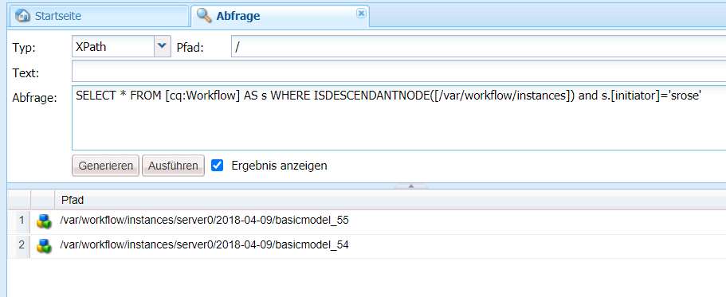
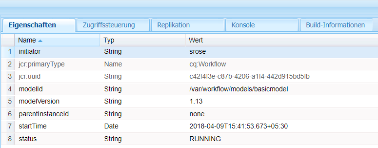
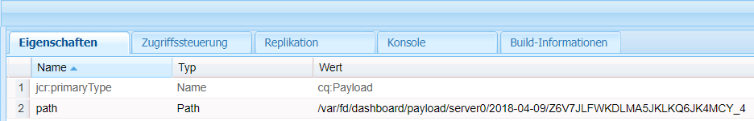

# Formularzentrierte Workflows unter OSGi | Umgang mit Benutzerdaten {#forms-centric-workflows-on-osgi-handling-user-data}

Formularzentrierte AEM-Workflows ermöglichen die Automatisierung von formularzentrierten Geschäftsprozessen. Workflows bestehen aus einer Reihe von Schritten, die in einer bestimmten Reihenfolge ausgeführt werden, die im zugehörigen Workflowmodell angegeben ist. Bei jedem Schritt wird eine bestimmte Aktivität ausgeführt, z. B. einem Benutzer eine Aufgabe zuweisen oder eine E-Mail verschicken. Workflows können mit Assets im Repository, mit Benutzerkonten und mit Experience Manager-Diensten interagieren. Daher können Workflows komplizierte Aktivitäten koordinieren, die einen beliebigen Aspekt von Experience Manager betreffen.

Ein formularzentrierter Workflow kann über eine der folgenden Methoden ausgelöst oder gestartet werden:

* Senden eines Programms aus dem AEM-Posteingang
* Senden eines Programms aus der AEM [!DNL Forms] Mobile App
* Senden eines adaptiven Formulars
* Überwachten Ordner verwenden
* Senden einer interaktiven Kommunikation oder eines Briefes

Weitere Informationen über die formularzentrierten AEM-Workflows und -Funktionen finden Sie unter [Formularzentrierter Workflow auf OSGi](aem-forms-workflow.md).

## Benutzerdaten und Datenspeicher {#user-data-and-data-stores}

Wenn ein Workflow ausgelöst wird, wird automatisch eine Nutzlast für die Workflow-Instanz generiert. Jede Workflow-Instanz erhält eine eindeutige Instanz-ID und eine zugehörige Nutzlast-ID. Die Nutzlast enthält die Repository-Speicherorte für Benutzer- und Formulardaten, die einer Workflow-Instanz zugeordnet sind. Darüber hinaus werden Entwürfe und Protokolldaten für eine Workflow-Instanz ebenfalls im AEM-Repository gespeichert.

Die Standardspeicherorte des Repositorys, in denen Nutzlast, Entwürfe und der Verlauf einer Workflow-Instanz gespeichert sind, lauten wie folgt:

>[!NOTE]
>
>Sie können verschiedene Speicherorte zum Speichern von Nutzlast-, Entwurfs- und Verlaufsdaten beim Erstellen eines Workflows oder einer Anwendung konfigurieren. Um die Standorte zu ermitteln, an denen ein Workflow oder eine Anwendung Daten gespeichert hat, überprüfen Sie den Workflow.

<table>
 <tbody>
  <tr>
   <td> </td>
   <td><b>AEM 6.4 [!DNL Forms]</b></td>
   <td><b>AEM 6.3 [!DNL Forms]</b></td>
  </tr>
  <tr>
   <td><strong>Workflow- Instanz</strong></td>
   <td>/var/workflow/instances/[server_id]/&lt;date&gt;/[workflow-instance]/</td>
   <td>/etc/workflow/instances/[server_id]/[date]/[workflow-instance]/</td>
  </tr>
  <tr>
   <td><strong>Nutzlast</strong></td>
   <td>/var/fd/dashboard/payload/[server_id]/[date]/  [payload-id]/</td>
   <td>/etc/fd/dashboard/payload/[server_id]/[date]/  [payload-id]/</td>
  </tr>
  <tr>
   <td><strong>Entwürfe</strong></td>
   <td>/var/fd/dashboard/instances/[server_id]/  [date]/[workflow-instance]/draft/[workitem]/</td>
   <td>/etc/fd/dashboard/instances/[server_id]/  [date]/[workflow-instance]/draft/[workitem]/</td>
  </tr>
  <tr>
   <td><strong>Verlauf</strong></td>
   <td>/var/fd/dashboard/instances/[server_id]/  [date]/[workflow_instance]/history/</td>
   <td>/etc/fd/dashboard/instances/[server_id]/  [date]/[workflow_instance]/history/</td>
  </tr>
 </tbody>
</table>

## Zugreifen auf und Löschen von Benutzerdaten {#access-and-delete-user-data}

Sie können auf Benutzerdaten von einer Workflow-Instanz aus im Repository zugreifen und sie löschen. Um dies zu erreichen, müssen Sie die Instanz-ID der Workflow-Instanz kennen, die dem Benutzer zugeordnet ist. Sie können die Instanz-ID einer Workflow-Instanz mithilfe des Benutzernamens des Benutzers finden, der die Workflow-Instanz initiiert hat oder der der aktuelle Bearbeiter der Workflow-Instanz ist.

In den folgenden Szenarios können Sie das jedoch nicht erkennen oder die Ergebnisse sind möglicherweise nicht eindeutig, wenn Sie Workflows identifizieren, die mit einem Initiator verknüpft sind:

* **Workflow, der durch einen überwachten Ordner ausgelöst wurde**: Eine Workflow-Instanz kann nicht über ihren Initiator identifiziert werden, wenn der Workflow von einem überwachten Ordner ausgelöst wird. In diesem Fall werden die Benutzerinformationen in den gespeicherten Daten codiert.
* **Workflow, der von der AEM-Veröffentlichungsinstanz initiiert wurde**: Alle Workflow-Instanzen werden mithilfe eines Servicebenutzers erstellt, wenn adaptive Formulare, interaktive Mitteilungen oder Briefe von der AEM-Veröffentlichungsinstanz gesendet werden. In diesen Fällen wird der Benutzername des angemeldeten Benutzers nicht in den Workflow-Instanz-Daten erfasst.

### Zugreifen auf Benutzerdaten {#access}

Führen Sie die folgenden Schritte aus, um Benutzerdaten für eine Workflow-Instanz zu identifizieren und darauf zuzugreifen:

1. Navigieren Sie in der AEM-Author-Instanz zu `https://'[server]:[port]'/crx/de` und anschließend zu **[!UICONTROL Tools > Abfrage]**.

   Wählen Sie **[!UICONTROL SQL2]** aus der Dropdownliste **[!UICONTROL Typ]**.

1. Führen Sie abhängig von den verfügbaren Informationen eine der folgenden Abfragen aus:

   * Führen Sie Folgendes aus, wenn der Workflow-Initiator bekannt ist:

   `SELECT &ast; FROM [cq:Workflow] AS s WHERE ISDESCENDANTNODE([path-to-workflow-instances]) and s.[initiator]='*initiator-ID*'`

   * Führen Sie Folgendes aus, wenn der Benutzer, dessen Daten Sie finden, der aktuelle Workflow-Bearbeiter ist:

   `SELECT &ast; FROM [cq:WorkItem] AS s WHERE ISDESCENDANTNODE([path-to-workflow-instances]) and s.[assignee]='*assignee-id*'`

   Die Abfrage gibt den Speicherort aller Workflow-Instanzen für den angegebenen Workflow-Initiator oder den aktuellen Workflow-Empfänger zurück.

   Die folgende Abfrage gibt z. B. den Pfad zweier Workflow-Instanzen vom Knoten `/var/workflow/instances` zurück, deren Workflow-Initiator `srose` ist.

   

1. Wechseln Sie zu einem Workflow-Instanzpfad, der von der Abfrage zurückgegeben wird. Die Eigenschaft „status“ zeigt den aktuellen Status der Workflow-Instanz an.

   

1. Navigieren Sie im Workflow-Instanzknoten zu `data/payload/`. Die Eigenschaft `path` speichert den Pfad zur Nutzlast für die Workflow-Instanz. Sie können zu dem Pfad navigieren, um auf Daten zuzugreifen, die in der Nutzlast gespeichert sind.

   

1. Navigieren Sie zu den Speicherorten für Entwürfe und Verlauf für die Workflow-Instanz.

   Beispiel:

   `/var/fd/dashboard/instances/server0/2018-04-09/_var_workflow_instances_server0_2018-04-09_basicmodel_54/draft/`

   `/var/fd/dashboard/instances/server0/2018-04-09/_var_workflow_instances_server0_2018-04-09_basicmodel_54/history/`

1. Wiederholen Sie die Schritte 3 bis 5 für alle Workflow-Instanzen, die von der Abfrage in Schritt 2 zurückgegeben wurden.

   >[!NOTE]
   >
   >Die AEM [!DNL Forms] Mobile App speichert auch im Offline-Modus Daten. Es ist möglich, dass Daten für eine Workflow-Instanz lokal auf einzelnen Geräten gespeichert und an den [!DNL Forms]-Server gesendet werden, wenn die Mobile App mit dem Server synchronisiert wird.

### Löschen von Benutzerdaten {#delete-user-data}

Sie müssen ein AEM-Administrator sein, um Benutzerdaten aus Workflow-Instanzen zu löschen, indem Sie die folgenden Schritte ausführen:

1. Folgen Sie den Anweisungen in [Auf Benutzerdaten zugreifen](forms-workflow-osgi-handling-user-data.md#access) und beachten Sie Folgendes:

   * Pfade zu Workflow-Instanzen, die dem Benutzer zugeordnet sind
   * Status der Workflow-Instanzen
   * Pfade zu Nutzlasten für die Workflow-Instanzen
   * Pfade zu Entwürfen und Verlauf für die Workflow-Instanzen

1. Führen Sie diesen Schritt für Workflow-Instanzen mit dem Status **RUNNING**, **SUSPENDED** oder **STALE** aus:

   1. Navigieren Sie zu `https://'[server]:[port]'/aem/start.html` und melden Sie sich als Administrator an.
   1. Navigieren Sie zu **[!UICONTROL Tools > Workflow > Instanzen]**.
   1. Wählen Sie relevante Workflow-Instanzen für den Benutzer aus und tippen Sie auf **[!UICONTROL Beenden]**, um die laufenden Instanzen zu beenden.

      Weitere Informationen zum Arbeiten mit Workflow-Instanzen finden Sie unter [Verwalten von Workflow-Instanzen](https://experienceleague.adobe.com/docs/experience-manager-cloud-service/sites/authoring/workflows/overview.html?lang=de#authoring).

1. Wechseln Sie zur [!DNL CRXDE Lite]-Konsole, navigieren Sie zum Nutzlastpfad für eine Workflow-Instanz und löschen Sie den Knoten `payload`.
1. Navigieren Sie zum Entwurfspfad für eine Workflow-Instanz und löschen Sie den Knoten `draft`.
1. Navigieren Sie zu dem Verlaufspfad für eine Workflow-Instanz und löschen Sie den Knoten `history`.
1. Navigieren Sie zum Workflow-Instanzpfad für eine Workflow-Instanz und löschen Sie den Knoten `[workflow-instance-ID]` für den Workflow.

   >[!NOTE]
   >
   >Durch das Löschen des Workflow-Instanzknotens wird die Workflow-Instanz für alle Workflow-Teilnehmer entfernt.

1. Wiederholen Sie die Schritte 2 bis 6 für alle Workflow-Instanzen, die für einen Benutzer identifiziert wurden.
1. Identifizieren und löschen Sie Offline-Entwurfs- und -Sendedaten aus dem AEM [!DNL Forms]-Mobile-App-Postausgang von Workflow-Teilnehmern, um eine Übermittlung an den Server zu vermeiden.

Sie können auch APIs verwenden, um auf Knoten und Eigenschaften zuzugreifen und sie zu entfernen. Weitere Informationen finden Sie in den folgenden Dokumenten.

* [Anleitung für den programmgesteuerten Zugriff auf das AEM-JCR](https://experienceleague.adobe.com/docs/experience-manager-65/developing/platform/access-jcr.html?lang=de#platform)
* [Entfernen von Knoten und Eigenschaften](https://docs.adobe.com/docs/en/spec/jcr/2.0/10_Writing.html#10.9%20Removing%20Nodes%20and%20Properties)
* [API-Referenz](https://experienceleague.adobe.com/docs/experience-manager-release-information/aem-release-updates/previous-updates/aem-previous-versions.html?lang=de)

