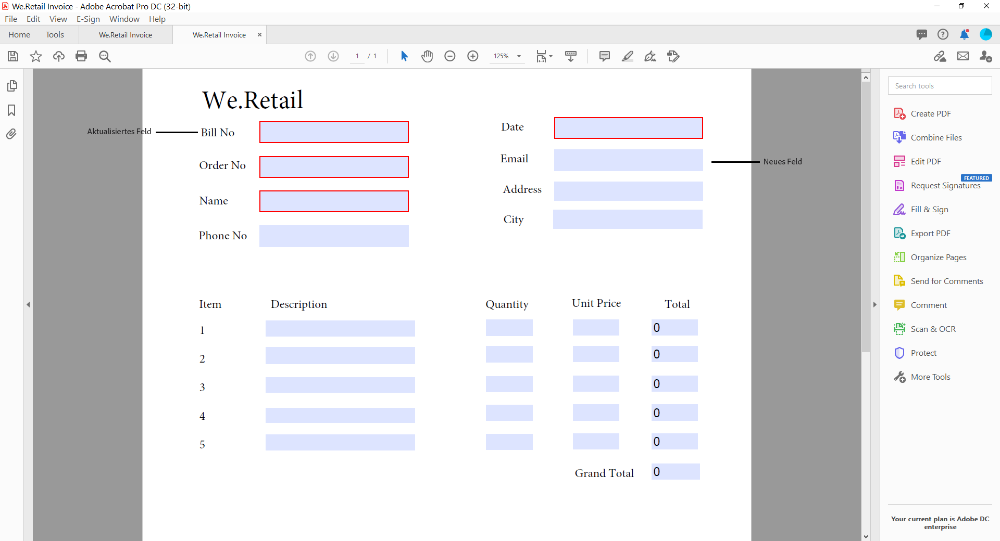
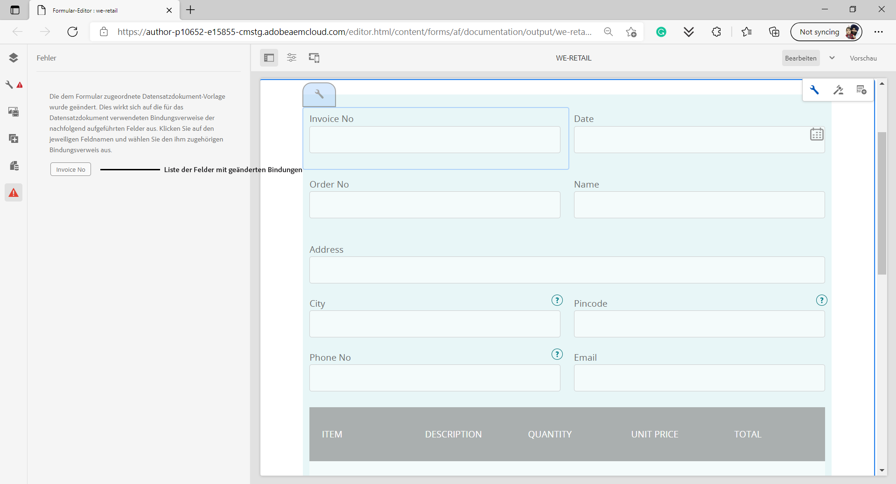

# Generieren eines Übermittlungs-PDF (ehemals Datensatzdokument) für Adaptive Forms (Kernkomponenten)

## Überblick {#overview}

Wenn ein Formular ausgefüllt oder übermittelt wird, können Sie das Formular drucken oder als Dokument speichern. Dieser Datensatz wird als Übermittlungs-PDF (ehemals Document of Record, DoR) bezeichnet. Es handelt sich um eine druckoptimierte PDF des gesendeten Formulars. Sie können auch auf der PDF für die Übermittlung Informationen finden, die Kundinnen und Kunden zu einem späteren Zeitpunkt ausgefüllt haben, oder die PDF für die Übermittlung verwenden, um Formulare und Inhalte gemeinsam im PDF-Format zu archivieren.

## Anwendbarkeit und Anwendungsfälle

### Versicherung

## Kann AEM Forms Dokumente für Versicherungsansprüche generieren?

Ja. AEM Forms unterstützt die Generierung von Submission PDF (ehemals Document of Record), sodass Versicherer PDFs und Datensätze basierend auf gesendeten Formulardaten erstellen können.

## Sind von AEM Forms generierte Dokumente für Audits geeignet?

Ja. AEM Forms unterstützt die konsistente Dokumenterstellung, den kontrollierten Zugriff und die Rückverfolgbarkeit, die für Audit- und Compliance-Anforderungen wichtig sind.

Um eine Übermittlungs-PDF zu erstellen, wird eine XFA- oder AcroForm-basierte Vorlage mit Daten zusammengeführt, die über ein adaptives Formular erfasst wurden. Sie können eine Übermittlungs-PDF automatisch oder bei Bedarf generieren. Mit der On-Demand-Option können Sie eine benutzerdefinierte XFA- oder AcroForm-basierte Vorlage angeben, um Ihrer Übermittlungs-PDF ein benutzerdefiniertes Erscheinungsbild zu verleihen.

Sie haben folgende Möglichkeiten:

* [Generieren einer XFA-basierten Übermittlungs-PDF](#generate-an-XFA-based-document-of-record)
* [Erzeugen einer AcroForm-basierten (Acrobat Form PDF) Übermittlungs-PDF](#generate-an-Acroform-based-document-of-record)
* [Automatisches Generieren einer Übermittlungs-PDF](#auto-generate-a-document-of-record)

## Bevor Sie beginnen {#components-to-automatically-generate-a-document-of-record}

Bevor Sie beginnen, lernen Sie die für eine Übermittlungs-PDF erforderlichen Assets kennen und bereiten Sie sie vor:

**Basisvorlage:** Eine XFA-Vorlage (XDP-Datei), die in Forms Designer oder einem Acrobat-Formular (AcroForm) erstellt wurde. [Basisvorlage](#base-template-of-a-document-of-record) wird verwendet, um Stil- und Branding-Informationen für eine Übermittlungs-PDF anzugeben. Laden Sie vorher Ihre XFA-Vorlage (XDP-Datei) in Ihre AEM Forms-Instanz hoch.

**Adaptives Formular** Ein adaptives Formular, für das die Übermittlungs-PDF generiert werden soll.

## Generieren einer XFA-basierten Übermittlungs-PDF {#generate-an-XFA-based-document-of-record}

Laden Sie Ihre XFA-Vorlage (XDP-Datei) in Ihre AEM Forms-Instanz hoch. Führen Sie die folgenden Schritte aus, um ein adaptives Formular so zu konfigurieren, dass eine XFA-Vorlage (XDP-Datei) als Vorlage für die PDF für die Übermittlung verwendet wird:

1. Klicken Sie in der Experience Manager-Autoreninstanz auf **[!UICONTROL Forms]** > **[!UICONTROL Formulare und Dokumente].**
1. Wählen Sie ein Formular aus oder erstellen Sie ein adaptives Formular und klicken Sie auf **[!UICONTROL Eigenschaften]**.
1. Wählen Sie im Fenster „Eigenschaften“ **[!UICONTROL Formularmodell]**.
1. Öffnen Sie die Registerkarte **[!UICONTROL Formularmodell]** und wählen Sie im Dropdown-Menü **[!UICONTROL Auswählen aus]** die Option **[!UICONTROL Formulardatenmodell]**, **[!UICONTROL Schema]** oder **[!UICONTROL Keine]** aus. Sie können auch bei der Erstellung eines Formulars ein Formularmodell auswählen.
1. Wählen Sie auf der Registerkarte „Formularmodell“ im Abschnitt „Konfiguration der Datensatzdokument-Vorlagenkonfiguration“ die Option **Formularvorlage als Datensatzdokument-Vorlage zuordnen**. Bei Auswahl dieser Option werden alle auf Ihrem Computer verfügbaren XFA-Vorlagen (XDP-Dateien) angezeigt. Wählen Sie die entsprechende Datei aus. Stellen Sie außerdem sicher, dass dasselbe Schema (Datenschema) für das adaptive Formular und die ausgewählte XFA-Vorlage (XDP-Datei) verwendet wird.
1. Klicken Sie auf **[!UICONTROL Fertig]**.

Ihr adaptives Formular ist jetzt so konfiguriert, dass eine XDP-Datei als Vorlage für die PDF zur Übermittlung verwendet wird. Der nächste Schritt besteht darin, [die Komponenten des adaptiven Formulars an die entsprechenden Vorlagenfelder zu binden](#bind-adaptive-form-components-with-template-fields).

## Generieren einer Acroform-basierten Übermittlungs-PDF {#generate-an-Acroform-based-document-of-record}

Laden Sie Ihr Adobe Acrobat-PDF (AcroForm) in Ihre AEM Forms-Instanz hoch. Führen Sie die folgenden Schritte aus, um ein adaptives Formular so zu konfigurieren, dass Adobe Acrobat PDF (AcroForm) als Vorlage für die Übermittlung von PDF verwendet wird:

1. Klicken Sie in der Experience Manager-Autoreninstanz auf **[!UICONTROL Forms]** > **[!UICONTROL Formulare und Dokumente].**
1. Wählen Sie ein Formular aus oder wählen Sie **[!UICONTROL Erstellen eines adaptiven Formulars]** und klicken Sie auf **[!UICONTROL Eigenschaften]**.
1. Wählen Sie im Fenster „Eigenschaften“ **[!UICONTROL Formularmodell]**.
1. Öffnen Sie die Registerkarte **[!UICONTROL Formularmodell]** und wählen Sie im Dropdown-Menü **[!UICONTROL Auswählen aus]** die Option **[!UICONTROL Formulardatenmodell]**, **[!UICONTROL Schema]** oder **[!UICONTROL Keine]** aus. Sie können auch bei der Erstellung eines Formulars ein Formularmodell auswählen.
1. Wählen Sie auf der Registerkarte „Formularmodell“ im Abschnitt „Konfiguration der Datensatzdokument-Vorlagenkonfiguration“ die Option **Formularvorlage als Datensatzdokument-Vorlage zuordnen**. Bei Auswahl dieser Option werden alle auf Ihrem Gerät verfügbaren Acrobat-PDFs (AcroForm) angezeigt. Wählen Sie das AcroForm aus, das Sie verwenden möchten.
1. Klicken Sie auf **[!UICONTROL Fertig]**.

Ihr adaptives Formular ist jetzt so konfiguriert, dass ein AcroForm als Vorlage für die PDF-Übermittlung verwendet wird. Der nächste Schritt besteht darin, [die Komponenten des adaptiven Formulars an die entsprechenden Vorlagenfelder zu binden](#bind-adaptive-form-components-with-template-fields).

## Automatisch eine Übermittlungs-PDF generieren {#auto-generate-a-document-of-record}

Wenn ein adaptives Formular so konfiguriert ist, dass es automatisch eine Übermittlungs-PDF generiert, wird jedes Mal, wenn ein Formular geändert wird, die Übermittlungs-PDF sofort aktualisiert. Wenn beispielsweise ein Feld aus einem vorhandenen adaptiven Formular entfernt wird, wird das entsprechende Feld ebenfalls entfernt und ist in der Übermittlungs-PDF nicht sichtbar. Die automatische Generierung einer Übermittlungs-PDF bietet noch viele weitere Vorteile:

* Bindungen von Daten müssen von Formularentwicklern nicht mehr manuell verwaltet werden. Die automatisch generierte Übermittlungs-PDF übernimmt alle Aktualisierungen im Zusammenhang mit der Datenbindung.
* Formularentwickler müssen Felder, die als von der PDF für die Übermittlung ausgeschlossen gekennzeichnet sind, nicht manuell ausblenden. Die automatisch generierten Übermittlungs-PDF sind so vorkonfiguriert, dass solche Felder ausgeschlossen werden.
* Mit der Option zur automatisch generierten Übermittlung von PDF sparen Sie Zeit, die zum Erstellen einer Formularvorlage für die Übermittlung von PDF benötigt wird.
* Mit der Option der automatisch generierten PDF für die Übermittlung können Sie unterschiedliche Stile und Erscheinungsbilder verwenden, indem Sie unterschiedliche Basisvorlagen verwenden. So können Sie den besten Stil und das beste Erscheinungsbild für Submission PDF für Ihr Unternehmen auswählen. Wenn Sie keinen Stil angeben, werden standardmäßig die systemeigenen Stile verwendet.
* Durch die automatisch generierte Übermittlungs-PDF wird sichergestellt, dass jede Änderung im Formular sofort in der Übermittlungs-PDF übernommen wird.

Führen Sie die folgenden Schritte aus, um ein adaptives Formular so zu konfigurieren, dass automatisch eine Übermittlungs-PDF generiert wird:

1. Klicken Sie in der Experience Manager-Autoreninstanz auf **[!UICONTROL Forms]** > **[!UICONTROL Formulare und Dokumente].**
1. Wählen Sie ein Formular aus oder erstellen Sie ein adaptives Formular und klicken Sie auf **[!UICONTROL Eigenschaften]**.
1. Wählen Sie im Fenster „Eigenschaften“ **[!UICONTROL Formularmodell]**.
1. Öffnen Sie die Registerkarte **[!UICONTROL Formularmodell]** und wählen Sie im Dropdown-Menü **[!UICONTROL Auswählen aus]** die Option **[!UICONTROL Formulardatenmodell]**, **[!UICONTROL Schema]** oder **[!UICONTROL Keine]** aus. Sie können auch bei der Erstellung eines Formulars ein Formularmodell auswählen.
1. Wählen Sie auf der Registerkarte „Formularmodell“ im Abschnitt „Konfiguration der Datensatzdokument-Vorlage“die Option **Datensatzdokument erzeugen**.
1. Klicken Sie auf **[!UICONTROL Fertig]**.

## Binden von Komponenten adaptiver Formulare mit Vorlagenfeldern {#bind-adaptive-form-components-with-template-fields}

Binden Sie Felder adaptiver Formulare mit Vorlagenfeldern, um die erfassten Formulardaten im entsprechenden PDF-Feld für die Übermittlung anzuzeigen. So binden Sie Komponenten des adaptiven Formulars an die entsprechenden PDF-Vorlagenfelder für die Übermittlung:

1. Öffnen Sie das adaptive Formular, das für die Verwendung einer benutzerdefinierten Formularvorlage konfiguriert wurde, um es zu bearbeiten.

1. Wählen Sie eine Komponente des adaptiven Formulars aus und klicken Sie auf das Symbol . Dadurch wird der Eigenschaften-Browser geöffnet.

1. Wählen Sie im Eigenschaften-Browser ein Feld aus.

   * Bei Verwendung der AcroForm-Vorlage wählen Sie die Feldeigenschaft für den Bindungsverweis zum **[!UICONTROL Datensatzdokument]**.
   * Bei Verwendung der XFA-Vorlage verwenden Sie die Eigenschaft für den **[!UICONTROL Bindungsverweis zum Datenmodell]**.

1. Klicken Sie auf **[!UICONTROL Speichern]**.

<!-- 
In the following video, Adaptive Form components are bound with corresponding Acroform template fields and the Document of Record is sent as an email attachment.
-->

Sie können Übermittlungsaktionen wie „E-Mail senden“, &quot;AEM-Workflow aufrufen“, „Power Automate-Fluss aufrufen“ und andere [Übermittlungsaktionen“ verwenden](configuring-submit-actions.md) um eine Übermittlungs-PDF zu erhalten.

>[!NOTE]
>
> Sie können die Übermittlungs-PDF für jedes Formulardatenmodell speichern, indem Sie die **[!UICONTROL Bindungsverweis für das Datensatzdokument“]**.

## Inkrementelle Aktualisierungen der Vorlage für die PDF-Übermittlung {#document-of-record-template-incremental-updates}

Adaptive Formulare und entsprechende Vorlagen für die PDF-Übermittlung können sich im Laufe der Zeit weiterentwickeln. Sie können einem adaptiven Formular oder einer PDF-Vorlage für die Übermittlung Felder hinzufügen, entfernen oder ändern.

Wenn Sie eine PDF-Vorlage für die Übermittlung ändern und die geänderte Vorlage in AEM Forms hochladen, erkennt der Editor für adaptive Forms die geänderten Bindungen automatisch und informiert Sie über die Komponenten des adaptiven Formulars, für die neue Bindungen erforderlich sind. Damit können Sie eine PDF-Vorlage für die Übermittlung inkrementell aktualisieren.

Beispiel: Beim Unternehmen &quot;*.Retail* wird eine AcroForm-basierte Vorlage für die PDF-Übermittlung namens &quot;*-retail-bill.pdf“*. Die Vorlage sieht wie folgt aus:

Nachdem das Unternehmen die Vorlage einige Zeit verwendet hat, entscheidet es sich, das Feld `invoice-number` in `bill-number` umzubenennen und die E-Mail-Adresse der Käufer zu erfassen. Ein Entwickler aktualisiert den Namen des Felds `invoice-number` und fügt der Vorlage ein Feld zur Eingabe der E-Mail-Adresse hinzu. Außerdem erstellt er eine neue Version der Vorlage namens *we-retail-invoice-v2.pdf*.

<!--

The developer uploads and applies to the updated template to the adaptive form. The adaptive form automatically detects and displays list of fields where binding has changed.

The form developer binds Adaptive Forms fields with corresponding Document of Record template.

-->

>[!VIDEO](assets/we-retail-binding.mp4)

Wenn das adaptive Formular übermittelt wird, wird eine aktualisierte Übermittlungs-PDF generiert.

## Wichtige Aspekte beim Arbeiten mit der Übermittlungs-PDF {#key-considerations-when-working-with-document-of-record}

Beachten Sie die folgenden Hinweise und Einschränkungen bei der Arbeit mit der Übermittlungs-PDF für adaptive Forms.

* Übermittlungs-PDF-Vorlagen unterstützen keinen Rich-Text. Daher wird jeglicher Rich-Text, der im statischen adaptiven Formular oder in den von den Benutzenden ausgefüllten Informationen enthalten ist, in der PDF für die Übermittlung als unformatierter Text angezeigt.
* Dokumentfragmente in einem adaptiven Formular werden nicht in der Übermittlungs-PDF angezeigt. Adaptive Formularfragmente werden jedoch unterstützt.
* Die Inhaltsbindung wird in der für XML-Schema-basierte adaptive Formulare generierten Übermittlungs-PDF nicht unterstützt.
* Die lokalisierte Version der Übermittlungs-PDF wird für ein Gebietsschema bei Bedarf erstellt, wenn Benutzende die Darstellung der Übermittlungs-PDF anfordern. Die Lokalisierung des Übermittlungs-PDF erfolgt zusammen mit der Lokalisierung des adaptiven Formulars. <!-- For more information on localization of Document of Record and Adaptive Forms see Using AEM translation workflow to localize Adaptive Forms and Document of Record.-->

<!-- ## Configure an adaptive form to generate  Document of Record {#adaptive-form-types-and-their-documents-of-record}

While creating an adaptive form, in the Form Model tab of Adaptive Form properties, select one the following option: 

* **None**
  Select the option to create an Adaptive Form without a form model. When the option is selected, the Document of Record is automatically generated for your Adaptive Form.

* **[Associate form template as a Document of Record template](creating-adaptive-form.md#create-an-adaptive-form-based-on-an-xfa-form-template)**
  
  Select the option to use an XFA Form as a template for Document of Record. 

* **[Generate Document of Record](creating-adaptive-form.md#create-an-adaptive-form-based-on-xml-or-json-schema)**
  Select the option to use an XFA Form as a template. When the option is selected, the Document of Record is automatically generated for your Adaptive Form. When you use an XML schema as a template for an Adaptive Form, ensure that the adaptive form and associated XFA Form use the same XML schema as your Adaptive Form
  

When you select a form model, configure Document of Record using options available under Document of Record Template Configuration. See [Document of Record Template Configuration](#document-of-record-template-configuration). -->

## Zuordnen von adaptiven Formularelementen {#mapping-of-adaptive-form-elements}

In der folgenden Tabelle werden die Komponenten des adaptiven Formulars und die zugehörigen XFA-Komponenten beschrieben. Außerdem wird angegeben, ob diese in einer Übermittlungs-PDF enthalten sind.

### Felder {#fields}

<table>
 <tbody>
  <tr>
   <th>Komponente eines adaptiven Formulars</th>
   <th>Zugehörige XFA-Komponente</th>
   <th>Standardmäßig in der PDF-Vorlage für die Übermittlung enthalten?</th>
   <th>Anmerkungen</th>
  </tr>
  <tr>
   <td>Schaltfläche</td>
   <td>Schaltfläche</td>
   <td>Falsch</td>
   <td> </td>
  </tr>
  <tr>
   <td>Kontrollkästchen</td>
   <td>Kontrollkästchen</td>
   <td>Ja</td>
   <td> </td>
  </tr>
  <tr>
   <td>Datumsauswahl</td>
   <td>Datum-/Uhrzeitfeld</td>
   <td>Ja</td>
   <td> </td>
  </tr>
  <tr>
   <td>Dropdown-Liste</td>
   <td>Dropdown-Liste</td>
   <td>Ja</td>
   <td> </td>
  </tr>
  <tr>
   <td>Numerisches Feld</td>
   <td>Numerisches Feld</td>
   <td>Ja</td>
   <td> </td>
  </tr>
  <tr>
   <td>Optionsschaltfläche</td>
   <td>Optionsschaltfläche</td>
   <td>Ja</td>
   <td> </td>
  </tr>
  <tr>
   <td>Textfeld</td>
   <td>Textfeld</td>
   <td>Ja</td>
   <td> </td>
  </tr>
  <tr>
   <td>Schaltfläche „Zurücksetzen“</td>
   <td>Schaltfläche „Zurücksetzen“</td>
   <td>Falsch</td>
   <td> </td>
  </tr>
  <tr>
   <td>Schaltfläche „Senden“</td>
   <td>
Schaltfläche „E-Mail senden“
 
Schaltfläche „HTTP senden“
 </td>
   <td>Falsch</td>
   <td> </td>
  </tr>
  <tr>
   <td>Dateianhang</td>
   <td> </td>
   <td>Falsch</td>
   <td>In der Vorlage für die PDF-Übermittlung nicht verfügbar. Nur über Anhänge in der Übermittlungs-PDF verfügbar.</td>
  </tr>
 </tbody>
</table>

### Container {#containers}

<table>
 <tbody>
  <tr>
   <th>Komponente eines adaptiven Formulars</th>
   <th>Zugehörige XFA-Komponente</th>
   <th>Anmerkungen</th>
  </tr>
  <tr>
   <td>Bereich  </td>
   <td>Teilformular  </td>
   <td>Wiederholbare Bedienfelder werden wiederholbaren Teilformularen zugeordnet.</td>
  </tr>
 </tbody>
</table>

### Statische Komponenten {#static-components}

| Komponente eines adaptiven Formulars | Zugehörige XFA-Komponente | Anmerkungen |
|---|---|---|
| Bild | Bild | Die Komponenten „TextDraw“ und „Image“ (unabhängig davon, ob gebunden oder nicht) werden immer in der Übermittlungs-PDF für ein XSD-basiertes adaptives Formular angezeigt, es sei denn, sie werden mithilfe der Einstellungen für die Übermittlungs-PDF ausgeschlossen. |
| Text | Text |  |

### Tabellen {#tables}

Die Tabellenkomponenten adaptiver Formulare (wie Kopf- und Fußzeile sowie Zeilen) sind den entsprechenden XFA-Komponenten zugeordnet. Sie können Tabellen in Submission PDF wiederholbare Bereiche zuordnen.

## Basisvorlage einer Übermittlungs-PDF {#base-template-of-a-document-of-record}

Die Basisvorlage liefert Informationen zu Stil und Erscheinungsbild für Submission PDF. Damit können Sie das standardmäßige Erscheinungsbild der automatisch generierten Übermittlungs-PDF anpassen. Sie können beispielsweise eine Basisvorlage verwenden, um Ihr Firmenlogo in der Kopfzeile und Copyright-Informationen in der Fußzeile der Submission PDF hinzuzufügen.

Die Musterseite aus einer Basisvorlage wird als Musterseite für die PDF-Vorlage für die Übermittlung verwendet. Die Musterseite kann Informationen wie Kopfzeile, Fußzeile und Seitenzahl enthalten, die Sie auf die Übermittlungs-PDF anwenden können. Sie können diese Informationen mithilfe der Basisvorlage auf die Übermittlungs-PDF anwenden, um die Übermittlungs-PDF automatisch zu generieren. Mithilfe der Basisvorlage können Sie die Standardeigenschaften von Feldern ändern.

Halten Sie sich bei der Entwicklung Ihrer Basisvorlage stets an die [Konventionen für Basisvorlagen](#base-template-conventions).

## Konventionen für Basisvorlagen {#base-template-conventions}

Eine Basisvorlage wird verwendet, um Kopf- und Fußzeile, Stil und Erscheinungsbild einer Übermittlungs-PDF zu definieren. Die Kopf- und die Fußzeile können Informationen wie Firmenlogo und Copyright-Vermerk enthalten. Die erste Musterseite in der Basisvorlage wird kopiert und dient als Musterseite für die Übermittlungs-PDF. Sie enthält Kopfzeile, Fußzeile, Seitenzahl oder andere Informationen, die auf allen Seiten in der Übermittlungs-PDF angezeigt werden sollen. Wenn Sie eine Basisvorlage verwenden, die den Konventionen für Basisvorlagen nicht entspricht, wird die erste Musterseite aus der Basisvorlage dennoch in der PDF-Vorlage für die Übermittlung verwendet. Es wird dringend empfohlen, dass Sie Ihre Basisvorlage gemäß den Konventionen gestalten und sie für die automatische Generierung der Übermittlungs-PDF verwenden.

**Konventionen für Masterseiten**

* Benennen Sie in der Basisvorlage das Stamm-Unterformular mit `AF_METATEMPLATE` und die Musterseite mit `AF_MASTERPAGE`.

* Die Musterseite mit dem Namen `AF_MASTERPAGE`, die sich unterhalb des Stamm-Unterformulars `AF_METATEMPLATE` befindet, hat beim Extrahieren von Kopfzeilen-, Fußzeilen- und Stilinformationen Vorrang.

* Wenn `AF_MASTERPAGE` fehlt, wird die erste Musterseite in der Basisvorlage verwendet.

**Stilkonventionen für Felder**

* Wenn Sie einen Stil auf die Felder in der Übermittlungs-PDF anwenden, stellt die Basisvorlage die Felder in dem Teilformular `AF_FIELDSSUBFORM` unter dem `AF_METATEMPLATE` Stammteilformular bereit.

* Die Eigenschaften dieser Felder werden auf die Felder in der Übermittlungs-PDF angewendet. Benennungen für diese Felder sollten der Form `AF_<name of field in all caps>_XFO` folgen. So sollte beispielsweise der Feldname für ein Kontrollkästchen `AF_CHECKBOX_XFO` lauten.

Gehen Sie wie folgt vor, um eine Basisvorlage in Forms Designer zu erstellen:

1. Klicken Sie auf **[!UICONTROL Datei]** > **[!UICONTROL Neu]**.
1. Wählen Sie die Option **[!UICONTROL Auf Basis einer Vorlage]** aus.

1. Wählen Sie die Kategorie **[!UICONTROL Formulare – Aufzuzeichnendes Dokument]**.
1. Wählen Sie **[!UICONTROL DoR-Basisvorlage]** aus.
1. Klicken Sie auf **[!UICONTROL Weiter]** und geben Sie die erforderlichen Informationen ein.

1. (Optional) Ändern Sie den Stil und das Erscheinungsbild von Feldern, die Sie auf die Felder in der Übermittlungs-PDF anwenden möchten.
1. Speichern Sie das Formular.
   

Sie können das gespeicherte Formular jetzt als Basisvorlage für eine Übermittlungs-PDF verwenden. Ändern oder entfernen Sie keine Skripte, die in der Basisvorlage vorhanden sind.

**Ändern der Basisvorlage**

* Sie sollten auf Felder in der Basisvorlage keinen Stil anwenden. Es wird empfohlen, diese Felder aus der Basisvorlage zu entfernen, damit alle Aktualisierungen der Basisvorlage automatisch übernommen werden.
* Während des Änderns der Basisvorlage dürfen Sie keine Skripte entfernen, hinzufügen oder ändern.

Halten Sie sich bei der Entwicklung einer Basisvorlage genau die oben genannten Konventionen und Anweisungen.

## Anpassen der Branding-Informationen in Submission PDF {#customize-the-branding-information-in-document-of-record}

Beim Generieren einer PDF für die Übermittlung können Sie auf der Registerkarte „Datensatzdokument“ die Branding-Informationen für die PDF für die Übermittlung ändern. Die Registerkarte „Datensatzdokument“ enthält Optionen für Logos, Aussehen, Layout, Kopf- und Fußzeile, zum Anpassen des Haftungsausschlusses sowie eine Optionen zum Entscheiden, ob Sie deaktivierte Kontrollkästchen und Optionsfeldern berücksichtigen möchten.

Achten Sie darauf, dass für Ihren Browser das richtige Gebietsschema festgelegt ist. Dadurch wird sichergestellt, dass die von Ihnen auf der Registerkarte für das Datensatzdokument eingegebenen Branding-Informationen lokalisiert werden. Um die Branding-Informationen von Submission PDF anzupassen, führen Sie die folgenden Schritte aus:

1. Wählen Sie einen Bereich (Stammbereich) in der Übermittlungs-PDF und dann  aus.
1. Wählen Sie . Die Registerkarte „Datensatzdokument“ wird angezeigt.
1. Wählen Sie entweder die Standardvorlage oder eine benutzerdefinierte Vorlage für das Rendern der Übermittlungs-PDF aus. Wenn Sie die Standardvorlage auswählen, wird unter der Dropdown-Liste „Vorlage“ eine Miniaturvorschau der Übermittlungs-PDF angezeigt.
1. Abhängig davon, ob Sie eine standardmäßige oder benutzerdefinierte Vorlage auswählen, werden einige oder alle der folgenden Eigenschaften auf der Registerkarte „Datensatzdokument“ angezeigt. Geben Sie die unten genannten Eigenschaften an, um das Erscheinungsbild der Übermittlungs-PDF zu definieren:

   1. **Allgemeine Eigenschaften**:
      * **Vorlage**: Wenn Sie eine benutzerdefinierte Vorlage auswählen möchten, wählen Sie eine XDP-Datei auf Ihrem [!DNL AEM Forms]-Server aus. Wenn Sie eine Vorlage verwenden möchten, die sich noch nicht auf Ihrem [!DNL AEM Forms]-Server befindet, müssen Sie die XDP-Datei zuerst auf Ihren [!DNL AEM Forms]-Server hochladen.
      * **Akzentfarbe**: Die Farbe, in der Kopfzeilentext und Trennlinien in der Übermittlungs-PDF dargestellt werden.
      * **Schriftfamilie**: Schriftfamilie des Textes in der PDF für die Übermittlung.

        >[!NOTE]
        >
        > AEM Forms bietet eine Vielzahl integrierter Schriftarten, die nahtlos in PDF-Dateien integriert werden können. Um die Liste der unterstützten Schriftarten anzuzeigen, [klicken Sie hier](/help/forms/supported-out-of-the-box-fonts.md).

      * **Formularobjekte einschließen, die nicht mit dem Datenmodell verbunden sind**: Durch Festlegen dieser Eigenschaft werden ungebundene Felder aus dem schemabasierten adaptiven Formular in die Übermittlungs-PDF einbezogen.

        <!-- **Exclude hidden fields from the Document of Record**: Setting the property identifies the hidden fields for exclusion from Document of Record.-->

      * **Beschreibung der Bedienfelder ausblenden**: Durch Festlegen dieser Eigenschaft ist die Beschreibung des Bedienfelds/der Tabelle in der PDF für die Übermittlung nicht enthalten. Gilt für Bedienfeld und Tabelle.

   1. **Formularfeldeigenschaften**:

      * **Für Kontrollkästchen und Optionsschaltflächenkomponenten nur ausgewählte Werte einblenden**: Durch Festlegen dieser Eigenschaft werden nur die ausgewählten Werte von Kontrollkästchen und Optionsfeldern im [!UICONTROL Datensatzdokument] angezeigt.
      * **Trennzeichen für mehrere Werte**: Sie können ein beliebiges Trennzeichen wie Komma oder Zeilenumbruch auswählen, um mehrere Werte anzuzeigen.
      * **Optionenausrichtung**: Sie können die gewünschte Ausrichtung (horizontal, vertikal, wie das adaptive Formular) auswählen, um die Ausrichtung für Felder wie Kontrollkästchen oder Optionsfelder festzulegen, die im [!UICONTROL Datensatzdokument] angezeigt werden sollen. Standardmäßig ist für die Felder im [!UICONTROL Datensatzdokument] die vertikale Ausrichtung festgelegt. Das Festlegen der Eigenschaften über die [!UICONTROL Formularfeldeigenschaften] des Datensatzdokuments überschreibt die Eigenschaften, die in der [!UICONTROL Elementausrichtung] für die Felder in einem adaptiven Formular festgelegt sind. Wenn Sie die Option [!UICONTROL Wie adaptives Formular] auswählen, wird die in der Autoreninstanz des adaptiven Formulars konfigurierte Ausrichtung für Felder des [!UICONTROL Datensatzdokuments] verwendet.
      * **Anzahl der Optionen für die horizontale Ausrichtung**:You kann die Anzahl der Optionen festlegen, die auf der Übermittlungs-PDF für die horizontale Ausrichtung angezeigt werden sollen.

   1. **Eigenschaften der primären Seite**:

      * **Logo-Bild**: Sie können wahlweise das Logo-Bild aus dem adaptiven Formular verwenden, eines aus DAM auswählen oder eines von Ihrem Computer hochladen.
      * **Formulartitel**: Titel des Datensatzdokuments.
* **Kopfzeilentext**: Text, der im Kopfzeilenabschnitt der Übermittlungs-PDF angezeigt wird.
* **Haftungsausschluss-Bezeichnung**: Bezeichnung des Haftungsausschlusses.
* **Haftungsausschluss**: Text, der den Umfang der Rechte und Pflichten für die Submission PDF angibt.
* **Text des Haftungsausschlusses**: Text des Haftungsausschlusses.

      &lt;!——>
     
     >[!NOTE]
     >
     >Wenn Sie eine Vorlage für ein adaptives Formular mit einer Version von Designer vor 6.3 verwenden, müssen Sie sicherstellen, dass in Ihrer Vorlage für das adaptive Formular unter dem Stamm-Unterformular 
     
     „xml
&lt;proto>    &lt;typy=&quot;
„(    >
&lt;color=&quot;    =&quot;
&quot;>    &lt;/full> vorhanden ist value=„4,166,203“/>
&lt;/edge>    &lt;/proto>
&quot;     
      
      
      
      
  
1. Wählen Sie **[!UICONTROL Fertig]** aus, um die Branding-Änderungen zu speichern.

>[!NOTE]
> 
> Um einen benutzerdefinierten Formulartitel in Ihrer Übermittlungs-PDF anzuzeigen, bearbeiten Sie **benutzerdefinierten Formulartitel** unter **Datensatzdokument-Eigenschaften** > **Eigenschaften der Musterseite**. Dieser benutzerdefinierte Titel:
> 
> * Erscheint in der Kopfzeile der generierten PDF-Datei
> * Wird als Titel in den Dokumenteneigenschaften der PDF-Datei angezeigt
> * Wird beim Öffnen der PDF-Datei als Ansichtstitel angezeigt

## Tabellen- und Spalten-Layouts für Bedienfelder in Submission PDF {#table-and-column-layouts-for-panels-in-document-of-record}

Ihr adaptives Formular ist möglicherweise sehr lang und enthält mehrere Formularfelder. Sie möchten möglicherweise nicht, dass eine Übermittlungs-PDF als exakte Kopie des adaptiven Formulars gespeichert wird. Jetzt können Sie zum Speichern eines oder mehrerer Bereiche des adaptiven Formulars in der Übermittlungs-PDF ein Tabellen- oder Spalten-Layout auswählen.

Wählen Sie vor dem Generieren einer Übermittlungs-PDF in den Einstellungen eines Bereichs als Layout für das Datensatzdokument für diesen Bereich „Tabelle“ oder „Spalte“ aus. Die Felder im Bedienfeld werden in der Übermittlungs-PDF entsprechend angeordnet.

Felder in einem Bereich, die im Übermittlungs-PDF im Tabellen-Layout dargestellt werden

Felder in einem Bereich, die im Übermittlungs-PDF im Spalten-Layout dargestellt werden

## Einstellungen für Submission PDF {#document-of-record-settings}

Mit den Einstellungen für die Übermittlungs-PDF können Sie Optionen auswählen, die Sie in die Übermittlungs-PDF aufnehmen möchten. Eine Bank akzeptiert zum Beispiel Name, Alter, Sozialversicherungsnummer und Telefonnummer in einem Formular. Das Formular generiert eine Bankkontonummer und Details zur Zweigstelle. Sie können festlegen, dass nur der Name, die Sozialversicherungsnummer, das Bankkonto und die Filialendetails in der Übermittlungs-PDF angezeigt werden sollen.

Die Einstellung der Komponente „Datensatzdokument“ ist in den Eigenschaften verfügbar. Um auf die Eigenschaften einer Komponente zuzugreifen, wählen Sie die Komponente aus und klicken Sie auf  in der Überlagerung. Die Eigenschaften werden in der Seitenleiste mit den folgenden Einstellungen angezeigt.

**Einstellungen auf Feldebene**

* **Aus Datensatzdokument ausschließen**: Wenn aktiviert, ist das Feld in der PDF für die Übermittlung nicht enthalten. Dies ist eine skriptfähige Eigenschaft namens `excludeFromDoR`. Ihr Verhalten ist von der auf Formularebene befindlichen Eigenschaft **Felder aus DoR ausschließen, wenn sie ausgeblendet sind** abhängig.

* **Bereich als Tabelle anzeigen** Wenn aktiviert, wird der Bereich in der PDF für Übermittlungen als Tabelle angezeigt, wenn der Bereich weniger als 6 Felder enthält. Gilt nur für den Bereich.
* **Titel aus Datensatzdokument ausschließen:** Wenn aktiviert, ist der Titel des Bereichs bzw. der Tabelle in der PDF für die Übermittlung nicht enthalten. Gilt nur für Bereiche und Tabellen.
* **Beschreibung aus Datensatzdokument ausschließen:** Wenn aktiviert, ist die Beschreibung des Bereichs bzw. der Tabelle in der PDF für die Übermittlung nicht enthalten. Gilt nur für Bereiche und Tabellen.
* **Ausgeblendete Felder vom Datensatzdokument ausschließen**: Wenn Sie diese Eigenschaft auswählen, sind ausgeblendete Felder aus der Übermittlungs-PDF ausgeschlossen. Dies gilt für alle Formularfelder. Standardmäßig ist die Option **Ausgeblendete Felder vom Dokument aus Datensatz ausschließen** nicht ausgewählt.

**Einstellungen auf Formularebene**

* **Ungebundene Felder in DoR einbeziehen** Durch Festlegen dieser Eigenschaft werden ungebundene Felder aus dem schemabasierten adaptiven Formular in der Übermittlungs-PDF einbezogen. Diese Option ist standardmäßig aktiviert.

## Siehe auch {#see-also}

{{see-also}}

<!-- 

**Exclude fields from DoR if hidden:** Set the property to exclude the hidden fields from Document of Record at form submission. When you enable [Revalidate on server](/help/forms/configuring-submit-actions.md#server-side-revalidation-in-adaptive-form-server-side-revalidation-in-adaptive-form), the server recomputes the hidden fields before excluding those fields from the Document of Record.

!->>
