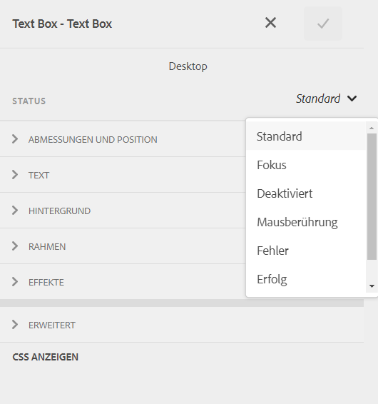
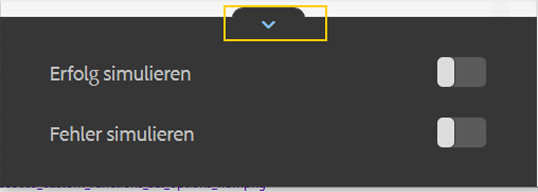

# Inline-Formatierung von Komponenten adaptiver Formulare {#inline-styling-of-adaptive-form-components}

>[!NOTE]
>
> Adobe empfiehlt, die modernen und erweiterbaren [Kernkomponenten](https://experienceleague.adobe.com/docs/experience-manager-core-components/using/adaptive-forms/introduction.html?lang=de) für die Datenerfassung zu verwenden, um [neue adaptive Formulare zu erstellen](/help/forms/creating-adaptive-form-core-components.md) oder [adaptive Formulare zu AEM Sites-Seiten hinzuzufügen](/help/forms/create-or-add-an-adaptive-form-to-aem-sites-page.md). Diese Komponenten stellen einen bedeutenden Fortschritt bei der Erstellung adaptiver Formulare dar und sorgen für beeindruckende Anwendererlebnisse. In diesem Artikel wird der ältere Ansatz zum Erstellen von adaptiven Formularen mithilfe von Foundation-Komponenten beschrieben.

| Version | Artikel-Link |
| -------- | ---------------------------- |
| AEM 6.5 | [Hier klicken](https://experienceleague.adobe.com/docs/experience-manager-65/forms/adaptive-forms-basic-authoring/inline-style-adaptive-forms.html?lang=de) |
| AEM as a Cloud Service | Dieser Artikel |

Sie können das allgemeine Erscheinungsbild und Design eines adaptiven Formulars definieren, indem Sie mit dem [Design-Editor](themes.md) Stile definieren. Außerdem können Sie Inline-CSS-Stile auf einzelne Komponenten anwenden und die Änderungen direkt in der Vorschau anzeigen. Inline-Stile überschreiben die Formatierung, die im Design bereitgestellt wird.

## Verwenden von Inline-CSS-Eigenschaften {#apply-inline-css-properties}

Hinzufügen von Inline-Stilen zu einer Komponente:

1. Öffnen Sie das Formular im Formular-Builder und ändern Sie den Modus in den Stilmodus . Um den Stilmodus zu aktivieren, wählen Sie in der Symbolleiste der Seite auf  > **[!UICONTROL Stil]** aus.
1. Wählen Sie eine Komponente auf der Seite und die Schaltfläche „Bearbeiten“  aus. In der Randleiste geöffnete Stileigenschaften.

   Sie können auch Komponenten aus der Hierarchiestruktur in der Seitenleiste auswählen. Die Hierarchiestruktur für das Formular ist als „Formularobjekte“ in der Seitenleiste verfügbar.

   Im Modus [!UICONTROL Stil] können Sie Komponenten sehen, die unter „Formularobjekte“ aufgeführt sind. Allerdings führt „Formularobjekte“ in der Seitenleiste Komponenten wie Felder und Bereiche auf. Felder und Bereiche sind generische Komponenten, die Komponenten wie Textfelder und Optionsschaltflächen enthalten können.

   Wenn Sie eine Komponente in der Seitenleiste auswählen, sehen Sie alle aufgelisteten Unterkomponenten sowie die Eigenschaften der ausgewählten Komponente. Sie können eine bestimmte Unterkomponente auswählen und formatieren.

1. Klicken Sie auf eine Registerkarte in der Seitenleiste, um CSS-Eigenschaften festzulegen. Sie können Eigenschaften wie die folgenden angeben:

   * [!UICONTROL Abmessungen und Position] (Anzeigeeinstellung, Auffüllung, Höhe, Breite, Ränder, Position, Z-Index, „Float“, „Clear“, Überlauf)
   * [!UICONTROL Text] (Schriftfamilie, Stärke, Farbe, Größe, Zeilenhöhe und Ausrichtung)
   * [!UICONTROL Hintergrund] (Bild und Verlauf, Hintergrundfarbe)
   * [!UICONTROL Rahmen] (Breite, Stil, Farbe, Radius)
   * [!UICONTROL Effekte] (Schatten, Deckkraft)
   * [!UICONTROL Erweitert] (Ermöglicht das Schreiben benutzerdefinierten CSS für die Komponente)

1. Ebenso können Sie Stile auf andere Teile einer Komponente wie [!UICONTROL Widget], [!UICONTROL Beschriftung] und [!UICONTROL Hilfe] anwenden.
1. Wählen Sie **[!UICONTROL Fertig]**, um die Änderungen zu bestätigen, oder **[!UICONTROL Abbrechen]**, um die Änderungen zu verwerfen.

## Beispiel: Inline-Formatvorlagen für eine Feldkomponente {#example-inline-styles-for-a-field-component}

Die folgenden Bilder zeigen ein Textfeld, bevor und nachdem Inline-Stile darauf angewendet wurden.

Textfeldkomponente vor der Anwendung von Inline-Stil-Eigenschaften

Beachten Sie die Änderung im Textfeldstil in der folgenden Abbildung, nachdem die folgenden CSS-Eigenschaften angewendet wurden.

<table>
 <tbody>
  <tr>
   <td>
Selektor
 </td>
   <td>
CSS-Eigenschaft
 </td>
   <td>
Wert
 </td>
   <td>
Ergebnis
 </td>
  </tr>
  <tr>
   <td>
Feld
 </td>
   <td>
border
 </td>
   <td>
Border width =2px
 
Border style=Solid
 
Border color=#1111
 </td>
   <td>
Erstellt einen schwarzen, 2 Pixel breiten Rahmen um das Feld
 </td>
  </tr>
  <tr>
   <td>
Textfeld
 </td>
   <td>
background-color
 </td>
   <td>
#6495ED
 </td>
   <td>
Ändert die Hintergrundfarbe zu Kornblumenblau (#6495ED)
 
Hinweis: Sie können einen Farbnamen oder den zugehörigen Hexadezimalcode im Wertefeld angeben.
 </td>
  </tr>
  <tr>
   <td>
Bezeichnung
 </td>
   <td>
Abmessungen und Position &gt; Breite
 </td>
   <td>
100 px
 </td>
   <td>
Stellt die Breite als 100 px für die Beschriftung ein.
 </td>
  </tr>
  <tr>
   <td>Feld Hilfe Symbol</td>
   <td>Text &gt; Schriftfarbe</td>
   <td>#2ECC40</td>
   <td>Ändert die Farbe des Hilfesymbols.</td>
  </tr>
  <tr>
   <td>
Lange Beschreibung
 </td>
   <td>
text-align
 </td>
   <td>
Zentriert
 </td>
   <td>
Richtet die Langbeschreibung für die Hilfe mittig aus.
 </td>
  </tr>
 </tbody>
</table>

Textfeldkomponente nach der Anwendung der Inline-Stil-Eigenschaften.

Wenn Sie den obigen Schritten folgen, können Sie andere Komponenten wie Bereiche, Sendenfelder und Optionsfelder auswählen und formatieren.

>[!NOTE]
>
>Designeigenschaften variieren je nach ausgewählter Komponente.

## Kopieren und Einfügen von Stilen {#copy-paste-styles}

Sie können einen Stil auch von einer Komponente kopieren und in eine andere Komponente in einem adaptiven Formular einfügen. Wählen Sie im Modus **[!UICONTROL Stil]** die entsprechende Komponente und dann das Symbol „Kopieren“ .

Wählen Sie die andere Komponente desselben Typs und dann das Symbol „Einfügen“ , um den kopierten Stil einzufügen. Sie können auch auf das Symbol „Stil entfernen“  auswählen, um den angewendeten Stil zu entfernen.

## Stile für verschiedene Zustände einer Komponente festlegen {#set-styles-for-states}

Sie können Stile für verschiedene Statuszustände eines Komponententyps festlegen. Zu den verschiedenen Statuszuständen gehören: [!UICONTROL Fokus], [!UICONTROL Deaktiviert], [!UICONTROL Mausberührung], [!UICONTROL Fehler], [!UICONTROL Erfolg] und [!UICONTROL Obligatorisch].

So definieren Sie die Formatierung für einen Status einer Komponente:

1. Wählen Sie im Modus **[!UICONTROL Stil]** die Komponente und wählen Sie das Symbol „Bearbeiten“ .

1. Wählen Sie mit der Dropdownliste **[!UICONTROL Status]** den Status der Komponente aus.

   

1. Definieren Sie die Formatierung für den ausgewählten Status der Komponente und wählen Sie , um die Eigenschaften zu speichern.

Sie können die Statuszustände „Erfolg“ und „Fehler“ auch simulieren. Wählen Sie das Symbol „Erweitern“, um die Optionen **[!UICONTROL Erfolg simulieren]** und **[!UICONTROL Fehler simulieren]** anzuzeigen.

## Siehe auch {#see-also}

{{see-also}}

<!--

>[!MORELIKETHIS]
>
>* [Use themes in Adaptive Form Core Components ](/help/forms/using-themes-in-core-components.md)

-->