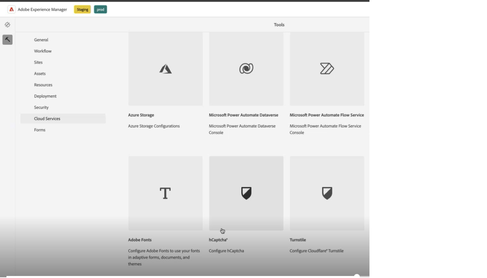

# Verbinden Ihrer AEM Forms-Umgebung mit Captcha® {#connect-your-forms-environment-with-hcaptcha-service}

 Diese Funktion ist im Rahmen des Programms für frühzeitige Bearbeitung verfügbar. Sie können von Ihrer offiziellen E-Mail-Adresse aus an aem-forms-ea@adobe.com schreiben, um dem Early-Adopter-Programm beizutreten und den Zugriff auf diese Funktion zu beantragen. 

CAPTCHA („Completely Automated Public Turing test to tell Computers and Humans Apart“ – „vollautomatischer öffentlicher Turing-Test zur Unterscheidung von Computern und Menschen“) ist ein Programm, das bei Onlinetransaktionen eingesetzt wird, um zwischen Menschen und Bots oder automatisierten Programmen zu unterscheiden. Es stellt eine herausfordernde Aufgabe und bewertet die Benutzerantwort, um festzustellen, ob es sich um einen Menschen oder einen Bot handelt, der mit der Site interagiert. Dabei wird verhindert, dass der Benutzer fortfährt, wenn der Test fehlschlägt, wodurch Onlinetransaktionen sicherer werden, da Bots keinen Spam senden oder andere bösartige Zwecke verfolgen können.

AEM Forms as a Cloud Service unterstützt die folgenden CAPTCHA-Lösungen:
* [hCaptcha](#integrate-aem-forms-environment-with-hcaptcha-captcha)
* [Google reCAPTCHA](/help/forms/captcha-adaptive-forms-core-components.md)
* [hCaptcha](/help/forms/integrate-adaptive-forms-hcaptcha-core-components.md)

## Integrieren der AEM Forms-Umgebung mit Captcha Captcha

Der hCaptcha®-Dienst schützt Ihre Formulare vor Bots, Spam und automatisiertem Missbrauch. Er führt einen Kontrollkästchen-Widget-Test durch und ermittelt anhand der Benutzerantwort, ob ein Mensch oder ein Bot mit dem Formular interagiert. Dabei wird verhindert, dass Benutzende fortfahren, wenn der Test fehlschlägt. Dies erhöht die Sicherheit von Online-Transaktionen, indem Bots keinen Spam senden oder andere bösartige Aktivitäten durchführen können.

AEM Forms as a Cloud Service unterstützt Captcha® in den adaptiven Forms-Kernkomponenten. Sie können es verwenden, um eine Herausforderung für ein Kontrollkästchen-Widget bei der Formularübermittlung darzustellen.

<!-- -->

### Voraussetzungen für die Integration der AEM Forms-Umgebung in Captcha® {#prerequisite}

Um Captcha® mit AEM Forms zu konfigurieren, müssen Sie den [hCaptcha®-Site-Schlüssel und den geheimen Schlüssel](https://docs.hcaptcha.com/switch/#get-your-hcaptcha-sitekey-and-secret-key) von der hCaptcha®-Website abrufen.

### Captcha® konfigurieren {#steps-to-configure-hcaptcha}

Führen Sie die folgenden Schritte aus, um AEM Forms mit dem Captcha®-Dienst zu integrieren:

1. Erstellen Sie einen Konfigurations-Container in Ihrer AEM Forms as a Cloud Service-Umgebung. Ein Konfigurations-Container enthält Cloud-Konfigurationen, mit denen AEM mit externen Diensten verbunden wird. So erstellen und konfigurieren Sie einen Konfigurations-Container, um Ihre AEM Forms-Umgebung mit Captcha® zu verbinden:
   1. Öffnen Sie Ihre AEM Forms as a Cloud Service-Instanz.
   1. Wählen Sie **[!UICONTROL Tools > Allgemein > Konfigurations-Browser]**.
   1. Im Konfigurationsbrowser können Sie einen vorhandenen Ordner auswählen oder einen Ordner erstellen. Sie können einen Ordner erstellen und die Cloud-Konfigurationsoption dafür aktivieren oder die Option „Cloud-Konfigurationen“ für einen vorhandenen Ordner aktivieren:

      * Erstellen eines Ordners und Aktivieren der entsprechenden Cloud-Konfigurationsoption:
         1. Klicken Sie im Konfigurations-Browser auf **[!UICONTROL Erstellen]**.
         1. Geben Sie im Dialogfeld &quot;Konfiguration erstellen&quot;einen Namen und einen Titel ein und wählen Sie die Option **[!UICONTROL Cloud-Konfigurationen]** aus.
         1. Klicken Sie auf **[!UICONTROL Erstellen]**.
      * So aktivieren Sie die Option „Cloud-Konfigurationen“ für einen vorhandenen Ordner:
         1. Wählen Sie im Konfigurations-Browser den Ordner aus und wählen Sie **[!UICONTROL Eigenschaften]**.
         1. Aktivieren Sie im Dialogfeld „Konfigurationseigenschaften“ die Option **[!UICONTROL Cloud-Konfigurationen]**.
         1. Wählen Sie **[!UICONTROL Speichern und schließen]**, um die Konfiguration zu speichern und das Dialogfeld zu schließen.

1. Konfigurieren des Cloud-Service:
   1. Wechseln Sie in Ihrer AEM-Autoreninstanz zu  > **[!UICONTROL Cloud Service]** und wählen Sie **[!UICONTROL Captcha®]** aus.
      
   1. Wählen Sie einen Konfigurations-Container aus, der erstellt oder aktualisiert wurde, wie im vorherigen Abschnitt beschrieben. Wählen Sie **[!UICONTROL Erstellen]** aus.
      
   1. Geben Sie **[!UICONTROL Titel]**, **[!UICONTROL Name]**, **[!UICONTROL Site-Schlüssel]** und **[!UICONTROL Geheimschlüssel]** für den Captcha®-Dienst [an, der in Voraussetzung](#prerequisite) abgerufen wurde. Wählen Sie **[!UICONTROL Erstellen]** aus.

      

   >[!NOTE]
   > Benutzer müssen die [clientseitige JavaScript-Validierungs-URL](https://docs.hcaptcha.com/#add-the-hcaptcha-widget-to-your-webpage) und die [serverseitige Validierungs-URL](https://docs.hcaptcha.com/#verify-the-user-response-server-side) nicht ändern, da sie bereits für die Captcha®-Validierung vorausgefüllt sind.

   Sobald der hCAPTCHA-Dienst konfiguriert ist, ist er für die Verwendung in einem [adaptiven Formular basierend auf Kernkomponenten](https://experienceleague.adobe.com/de/docs/experience-manager-core-components/using/adaptive-forms/introduction) verfügbar.

## Verwenden von Captcha® in adaptiven Forms-Kernkomponenten {#using-hCaptcha®-core-components}

1. Öffnen Sie Ihre AEM Forms as a Cloud Service-Instanz.
1. Gehen Sie zu **[!UICONTROL Formulare]** > **[!UICONTROL Formulare und Dokumente]**.
1. Wählen Sie ein adaptives Formular und dann **[!UICONTROL Eigenschaften]** aus. Wählen Sie für die Option **[!UICONTROL Konfigurations-Container]** den Konfigurationscontainer aus, der die Cloud-Konfiguration enthält, die AEM Forms mit Captcha® verbindet, und wählen Sie **[!UICONTROL Speichern und schließen]**.

   Wenn Sie keinen solchen Konfigurations-Container haben, finden Sie im Abschnitt [Verbinden Ihrer AEM Forms-Umgebung mit Captcha®](#connect-your-forms-environment-with-hcaptcha-service) Informationen zum Erstellen eines Konfigurations-Containers.

   

1. Wählen Sie ein adaptives Formular und danach **[!UICONTROL Bearbeiten]** aus. Das adaptive Formular wird im Editor für adaptive Formulare geöffnet.
1. Ziehen Sie die Komponente **[!UICONTROL Adaptives Formular Captcha®]** aus dem Komponenten-Browser in das adaptive Formular oder fügen Sie sie hinzu.
1. Wählen Sie die Komponente **[!UICONTROL Adaptives Formular Captcha®]** aus und klicken Sie auf das Symbol für die Eigenschaften  . Dadurch wird das Dialogfeld „Eigenschaften“ geöffnet. Geben Sie die folgenden Eigenschaften an:

   

   * **[!UICONTROL Name]:** Geben Sie den Namen für Ihre Captcha-Komponente an. Sie können eine Formularkomponente sowohl im Formular als auch im Regeleditor leicht mit ihrem eindeutigen Namen identifizieren.
   * **[!UICONTROL Titel]:** Geben Sie den Titel für Ihre Captcha-Komponente an.
   * **[!UICONTROL Konfigurationseinstellungen]:** Wählen Sie eine für hCaptcha® konfigurierte Cloud-Konfiguration aus.
   * **Captcha-Größe:** Sie können die Anzeigegröße des Chaptcha®-Challenger-Dialogfelds auswählen. Verwenden Sie die Option **[!UICONTROL Kompakt]** zur Anzeige eines kleinen und die Option **[!UICONTROL Normal]** zur Anzeige eines relativ großen Dialogfelds für den hCaptcha®-Test.<!-- or **[!UICONTROL Invisible]** to validate hCaptcha&reg; without explicitly rendering the checkbox widget on the user interface. -->
   * **[!UICONTROL Validierungsmeldung]:** Stellen Sie eine Validierungsmeldung für Ihre Captcha-Validierung bei der Formularübermittlung bereit.
   * **[!UICONTROL Meldung zur Skriptvalidierung]**: Mit dieser Option können Sie eine Meldung eingeben, die angezeigt werden soll, wenn die Skriptvalidierung fehlschlägt.
     >[!NOTE]
     >Sie können für einen ähnlichen Zweck mehrere Cloud-Konfigurationen in Ihrer Umgebung haben. Wählen Sie den Dienst daher sorgfältig aus. Wenn kein Dienst aufgeführt ist, finden Sie unter [Verbinden Ihrer AEM Forms-Umgebung mit Captcha®](#connect-your-forms-environment-with-hcaptcha-service) Informationen zum Erstellen eines Cloud Service, der Ihre AEM Forms-Umgebung mit dem Captcha®-Dienst verbindet.
     <!--* **Error Message:** Provide the error message to display to the user when the Captcha submission fails.-->

1. Wählen Sie **[!UICONTROL Fertig]**.

Jetzt sind nur legitime Formulare für die Formularübermittlung zulässig, bei denen der Formularbenutzer die vom Captcha®-Dienst ausgehende Herausforderung erfolgreich löscht. hCaptcha®

**hCaptcha® ist eine eingetragene Marke von Intuition Machines, Inc.**

## Häufig gestellte Fragen

* **Q: Kann ich mehrere Captcha-Komponenten in einem adaptiven Formular verwenden?**
* **s:** Die Verwendung von mehr als einer Captcha-Komponente in einem adaptiven Formular wird nicht unterstützt. Es wird außerdem nicht empfohlen, eine Captcha-Komponente in einem Fragment oder in einem Bereich zu verwenden, der für verzögertes Laden markiert ist.

## Siehe auch {#see-also}

{{see-also}}
