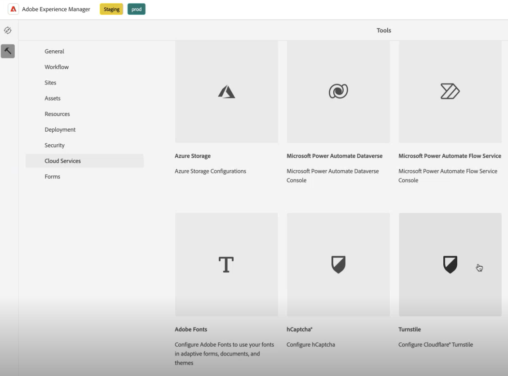

# Verbinden Ihrer AEM Forms-Umgebung mit Turnstile {#connect-your-forms-environment-with-turnstile-service}

Diese Funktion ist im Rahmen des Early-Adopter-Programms verfügbar. Sie können von Ihrer offiziellen E-Mail-Adresse aus an aem-forms-ea@adobe.com schreiben, um dem Early-Adopter-Programm beizutreten und den Zugriff auf diese Funktion zu beantragen. 

CAPTCHA („Completely Automated Public Turing test to tell Computers and Humans Apart“ – „vollautomatischer öffentlicher Turing-Test zur Unterscheidung von Computern und Menschen“) ist ein Programm, das bei Onlinetransaktionen eingesetzt wird, um zwischen Menschen und Bots oder automatisierten Programmen zu unterscheiden. Es stellt eine herausfordernde Aufgabe und bewertet die Benutzerantwort, um festzustellen, ob es sich um einen Menschen oder einen Bot handelt, der mit der Site interagiert. Dabei wird verhindert, dass der Benutzer fortfährt, wenn der Test fehlschlägt, wodurch Onlinetransaktionen sicherer werden, da Bots keinen Spam senden oder andere bösartige Zwecke verfolgen können.

AEM Forms as a Cloud Service unterstützt die folgenden CAPTCHA-Lösungen:

* [Turnstile](/help/forms/integrate-adaptive-forms-turnstile-core-components.md)
* [Google reCAPTCHA](/help/forms/captcha-adaptive-forms-core-components.md)
* [hCaptcha](/help/forms/integrate-adaptive-forms-hcaptcha-core-components.md)

<!-- -->

## Integrieren der AEM Forms-Umgebung mit Turnstile Captcha

Turnstile Captcha von Cloudflare bietet eine Sicherheitsmaßnahme zum Schutz von Formularen vor automatisierten Bots, bösartigen Angriffen, Spams und unerwünschtem automatisierten Traffic. Bei der Formularübermittlung wird ein Kontrollkästchen angezeigt, mit dem Sie überprüfen können, ob es sich um menschliche Daten handelt, bevor Sie ihnen das Senden des Formulars ermöglichen. AEM Forms as a Cloud Service unterstützt Drehkreuz-Captcha in den Kernkomponenten von Adaptive Forms.

### Voraussetzungen für die Integration der AEM Forms-Umgebung mit Turnstile Captcha {#prerequisite}

Um das Drehkreuz für AEM Forms-Kernkomponenten zu konfigurieren, müssen Sie den [Drehkreuz-Standortschlüssel und geheimen Schlüssel](https://developers.cloudflare.com/turnstile/get-started/) von der Drehkreuz-Website abrufen.

### Konfigurieren von Turnstile {#steps-to-configure-hcaptcha}

So integrieren Sie AEM Forms mit dem Turnstile-Service:

1. Erstellen Sie einen Konfigurations-Container in Ihrer AEM Forms as a Cloud Service-Umgebung. Ein Konfigurations-Container enthält Cloud-Konfigurationen, mit denen AEM mit externen Diensten verbunden wird. Gehen Sie wie folgt vor, um einen Konfigurations-Container für die Verbindung Ihrer AEM Forms-Umgebung mit Turnstile zu erstellen und zu konfigurieren:
   1. Öffnen Sie Ihre AEM Forms as a Cloud Service-Instanz.
   1. Navigieren Sie zu **[!UICONTROL Tools > Allgemein > Konfigurations-Browser]**.
   1. Erstellen Sie im Konfigurations-Browser entweder einen neuen Ordner und aktivieren Sie Cloud-Konfigurationen dafür oder aktivieren Sie Cloud-Konfigurationen für einen vorhandenen Ordner wie unten beschrieben:

      * Gehen Sie wie **vor, um einen** neuen Ordner“ zu erstellen und die entsprechenden Cloud-Konfigurationen zu aktivieren:
         1. Klicken Sie im Konfigurations-Browser auf **[!UICONTROL Erstellen]**.
         1. Geben Sie im Dialogfeld „Konfiguration erstellen“ einen Namen und einen Titel an und wählen Sie die Option **[!UICONTROL Cloud-]**&quot;.
         1. Klicken Sie auf **[!UICONTROL Erstellen]**.
      * So aktivieren Sie die Option Cloud-Konfigurationen für einen **Ordner**:
         1. Wählen Sie im Konfigurationsbrowser den vorhandenen Ordner aus und klicken Sie auf **[!UICONTROL Eigenschaften]**.
         1. Aktivieren Sie im Dialogfeld „Konfigurationseigenschaften“ die Option **[!UICONTROL Cloud-Konfigurationen]**.
         1. Klicken Sie auf **[!UICONTROL Speichern und schließen]**, um die Konfiguration zu speichern und zu beenden.

1. Konfigurieren des Cloud-Service:
   1. Wechseln Sie in der AEM-Autoreninstanz zu  > **[!UICONTROL Cloud Services]** und klicken Sie auf **[!UICONTROL Drehkreuz]**.
      
   1. Wählen Sie einen Konfigurations-Container aus, der wie im vorherigen Abschnitt beschrieben erstellt oder aktualisiert wurde. Wählen Sie **[!UICONTROL Erstellen]** aus.
      
   1. Geben Sie **[!UICONTROL Widget-Typ]** als verwaltet, nicht interaktiv oder unsichtbar an. Weitere Informationen zum Widget-Typ finden Sie unter [Drehkreuz-Widget](https://developers.cloudflare.com/turnstile/concepts/widget/).
   1. Geben Sie **[!UICONTROL Titel]**, **[!UICONTROL Name]**, **[!UICONTROL Site-Schlüssel]** und **[!UICONTROL Geheimer Schlüssel]** für den [&#x200B; an (in der Voraussetzung erhalten](#prerequisite).
   1. Klicken Sie auf **[!UICONTROL Erstellen]**.

      

   >[!NOTE]
   >
   > Benutzende brauchen die Client-seitige JavaScript-Validierungs-URL und die Server-seitige Validierungs-URL nicht zu ändern, da sie bereits für die Turnstile-Validierung vorausgefüllt sind.

   Sobald der Service „Drehkreuz-CAPTCHA“ konfiguriert ist, kann er in einem [adaptiven Formular auf der Grundlage von Kernkomponenten“ verwendet &#x200B;](https://experienceleague.adobe.com/de/docs/experience-manager-core-components/using/adaptive-forms/introduction).

## Verwenden von Turnstile in einem adaptiven Formular {#using-turnstile-core-components}

1. Öffnen Sie Ihre AEM Forms as a Cloud Service-Instanz.
1. Gehen Sie zu **[!UICONTROL Formulare]** > **[!UICONTROL Formulare und Dokumente]**.
1. Wählen Sie Ihr adaptives Formular aus und klicken Sie auf **[!UICONTROL Eigenschaften]**. Wählen Sie im Abschnitt **[!UICONTROL Konfigurations-Container]** den Konfigurations-Container aus, der die Cloud-Konfiguration enthält, die AEM Forms mit Turnstile verbindet.
1. Klicken Sie auf **[!UICONTROL Speichern und schließen]**.

   Wenn Sie keinen Konfigurations-Container haben, erfahren Sie im Abschnitt [Konfigurieren eines &#x200B;](#steps-to-configure-hcaptcha)&quot;, wie Sie einen Konfigurations-Container erstellen.

   

1. Wählen Sie ein adaptives Formular aus und klicken Sie **[!UICONTROL Bearbeiten]**, um ein Formular im Editor zu öffnen.
1. Ziehen Sie im Komponenten-Browser per Drag &amp; Drop die Komponente **[!UICONTROL Adaptives Formular - Drehkreuz]** auf das adaptive Formular.
   
1. Wählen Sie die Komponente **[!UICONTROL Adaptives Formular - Drehkreuz]** aus und klicken Sie auf das Symbol Eigenschaften . Dadurch wird das Dialogfeld „Eigenschaften“ geöffnet. Geben Sie die folgenden Eigenschaften an:

   

   * **[!UICONTROL Name]:** Geben Sie den Namen für Ihre CAPTCHA-Komponente an. Sie können eine Formularkomponente sowohl im Formular als auch im Regeleditor einfach mit ihrem eindeutigen Namen identifizieren.
   * **[!UICONTROL Titel]:** Geben Sie den Titel für Ihre Captcha-Komponente an. Sie können Rich-Text für den Titel zulassen und auch den Titel ausblenden, indem Sie die Kontrollkästchen aktivieren.
   * **[!UICONTROL Konfigurationseinstellungen]:** Wählen Sie eine Cloud-Konfiguration aus, die für den Turnstile CAPTCHA-Service konfiguriert ist.

     >[!NOTE]
     >
     >* Es kann sein, dass Sie für ähnliche Zwecke über mehrere Cloud-Konfigurationen in Ihrer Umgebung verfügen. Wählen Sie den Service daher sorgfältig aus. Wenn kein Dienst aufgeführt ist, erfahren Sie im Abschnitt [Konfigurieren von Drehkreuz](#steps-to-configure-hcaptcha), wie Sie einen Konfigurations-Container erstellen, um Ihre AEM Forms-Umgebung mit dem Drehkreuz-Dienst zu verbinden.

   * **[!UICONTROL Validierung]:** CAPTCHA-Validierung in Form einer Fehlermeldung bereitstellen:

      * **Fehlermeldung:** Geben Sie die Fehlermeldung an, die Benutzern angezeigt werden soll, wenn die CAPTCHA-Übermittlung fehlschlägt.

        >[!NOTE]
        >
        >* Eine Fehlermeldung wird nur angezeigt, wenn das CAPTCHA Client-seitig ausgefüllt ist.

1. Klicken Sie auf **[!UICONTROL Fertig]**.

Jetzt sind nur legitime Formulare zur Übermittlung zulässig, bei denen die Person, die das Formular ausfüllt, die vom Turnstile-Service ausgehende Herausforderung erfolgreich löst.

## Häufig gestellte Fragen

* **F: Kann ich mehr als eine Captcha-Komponente in einem adaptiven Formular verwenden?**
* **Antwort:** Die Verwendung von mehr als einer Captcha-Komponente in einem adaptiven Formular wird nicht unterstützt. Außerdem wird davon abgeraten, eine Captcha-Komponente in einem Fragment oder einem Bereich zu verwenden, das bzw. der für verzögertes Laden markiert ist.

## Siehe auch {#see-also}

{{see-also}}
