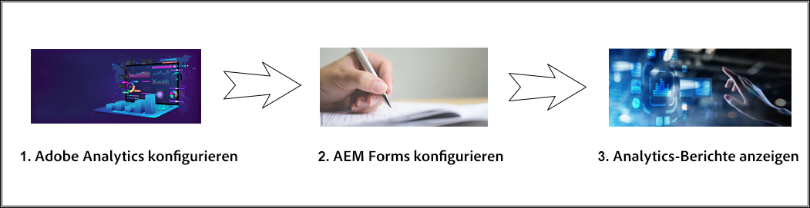
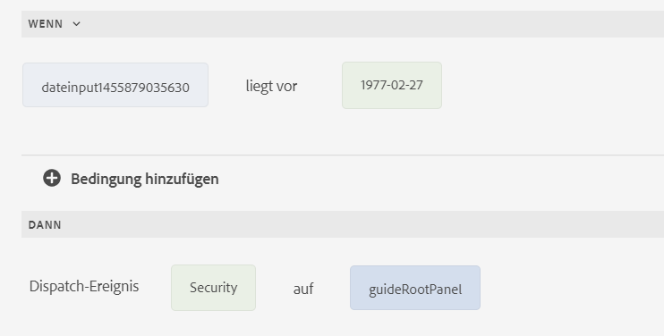

# Formularanalyse mit Adobe Analytics und AEM Forms - vollständiges Handbuch {#integrate-aem-forms-with-adobe-analytics}

## Was ist Form Analytics?

Bei der Formularanalyse werden Daten darüber erfasst, gemessen und analysiert, wie Benutzer mit Ihren Formularen interagieren. Es bietet Einblicke in das Benutzerverhalten, identifiziert Engpässe beim Formularausfüllungsprozess und hilft bei der Optimierung von Formularen für bessere Konversionsraten.

Die Formularanalyse geht über das einfache Übermittlungs-Tracking hinaus und bietet umfassende Einblicke in jeden Aspekt des Benutzererlebnisses. Durch die Analyse der Interaktion von Benutzern mit einzelnen Formularfeldern, Navigationsmustern und Abschlussverhalten können Unternehmen datengesteuerte Verbesserungen vornehmen, die sich erheblich auf Geschäftsergebnisse auswirken.

### Grundlegende Konzepte der Formularanalyse

**Benutzerinteraktions-Tracking**
Die Formularanalyse erfasst detaillierte Informationen zur Interaktion der Benutzer mit Formularen, einschließlich der Zeit, die mit jedem Feld verbracht wurde, der Mausbewegungen, des Bildlaufverhaltens und der Interaktionsmuster. Diese detaillierten Daten helfen bei der Identifizierung von Nutzungsproblemen und Optimierungsmöglichkeiten.

**Analyse von Verhaltensmustern**
Durch die Analyse von Benutzerverhaltensmustern in mehreren Formularsitzungen können Unternehmen allgemeine Journey, typische Abbruchstellen und Pfade für den erfolgreichen Abschluss identifizieren. Diese Analyse ermöglicht zielgerichtete Verbesserungen, die den tatsächlichen Benutzeranforderungen entsprechen.

**Leistungsmessung**
Die Formularanalyse bietet quantitative Metriken, mit denen die Effektivität eines Formulars gemessen wird, einschließlich Konversionsraten, Abschlusszeiten, Fehlerhäufigkeiten und Indikatoren für die Benutzerzufriedenheit. Diese Metriken ermöglichen eine objektive Bewertung der Formularleistung und der Auswirkungen auf die Optimierung.

### Warum die Formularanalyse für Unternehmen wichtig ist

Die Formularanalyse wandelt unbearbeitete Benutzerinteraktionsdaten in umsetzbare geschäftliche Einblicke um, die in wichtigen Geschäftsmetriken messbare Verbesserungen fördern:

**Optimierung der Konversionsrate**
Formularabbrüche sind eine wichtige geschäftliche Herausforderung, die sich direkt auf den Umsatz und die Lead-Generierung auswirkt. Studien zeigen, dass 68 % der Benutzer Formulare vor dem Ausfüllen abbrechen, weshalb die Formularanalyse für die Identifizierung von Abbruchpunkten unerlässlich ist. Die Formularanalyse ermöglicht gezielte Konversionsoptimierungsstrategien, mit denen die Formularleistung erheblich gesteigert werden kann. Eine effektive Konversionsoptimierung mithilfe der Formularanalyse bietet messbare Verbesserungen bei der Lead-Generierung und der Kundenakquise.

**Verbesserung des Benutzererlebnisses**
Durch das Verständnis von Problemen und Problemen von Benutzern können Unternehmen reibungslosere, intuitivere Formularerlebnisse schaffen. Dies führt zu höherer Kundenzufriedenheit, niedrigeren Support-Kosten und einer besseren Markenwahrnehmung.

**Datengestützte Entscheidungsfindung**
Anstatt sich auf Annahmen oder Best Practices zu verlassen, stellt die Formularanalyse konkrete Daten zur Analyse des Benutzerverhaltens bereit. Dies ermöglicht eine evidenzbasierte Konversionsoptimierung, die deutlich bessere Ergebnisse liefert als intuitive Änderungen. Die Analyse des Benutzerverhaltens durch Formular-Performance-Tracking stellt sicher, dass sich die Optimierungsbemühungen auf die tatsächlichen Benutzeranforderungen und nicht auf Annahmen konzentrieren.

**ROI-Messung und -Begründung**
Die Formularanalyse quantifiziert die Auswirkungen von Optimierungsmaßnahmen und bietet klare Metriken, die den geschäftlichen Nutzen demonstrieren. Unternehmen können die direkte Korrelation zwischen Formularverbesserungen und Geschäftsergebnissen wie Lead-Generierung, Verkaufsumrechnung und Kosten für die Kundenakquise messen.

**Wettbewerbsvorteil**
Überlegene Formularerlebnisse werden zu einem Wettbewerbsvorteil bei der Kundenakquise. Unternehmen, die Formularanalysen verwenden, können erstklassige Benutzererlebnisse schaffen, die ihre Mitbewerber übertreffen und das Wachstum ihrer Marktanteile vorantreiben.

### Wichtige Formularanalysemetriken

Effektive Formularanalyse konzentriert sich auf Metriken, die sich direkt auf Geschäftsergebnisse auswirken und umsetzbare Einblicke zur Optimierung bieten:

**Primäre Erfolgsmetriken**

- **Formular-Konversionsrate**: Der Prozentsatz der Formularansichten, die zu erfolgreichen Übermittlungen führen - der ultimative Maßstab für die Formulareffektivität
- **Formularabbruchrate**: Wo und warum Benutzer abbrechen, um eine direkte insight für Probleme mit dem Benutzererlebnis bereitzustellen
- **Abschlusszeit**: Wie lange Benutzende brauchen, um Formulare auszufüllen, was auf Komplexität und Benutzererlebnisqualität hinweist

**Detaillierte Leistungsindikatoren**

- **Analyse auf Feldebene**: Welche spezifischen Felder verursachen Probleme, sodass gezielte Optimierungsmaßnahmen durchgeführt werden können
- **Fehlerrate-Analyse**: Validierungsprobleme und Benutzerfehler, die das erfolgreiche Ausfüllen des Formulars verhindern
- **Hilfe zu Nutzungsmustern**: Wann und wo Benutzende Hilfe benötigen, unter Angabe von Bereichen, in denen Verbesserungen möglich sind

**Erweiterte**

- **Konversionstrichter-Analyse**: Benutzer-Journey durch mehrstufige Formulare und zeigt Progressions- und Abfallmuster an
- **Geräte- und Browser-**: Technische Faktoren, die sich in verschiedenen Benutzerumgebungen auf die Fertigstellung auswirken
- **Benutzerinteraktionstiefe**: Besuchszeit für Formulare, Feldinteraktionsmuster und Indikatoren für die Benutzeraufmerksamkeit

**Metriken zur Geschäftswirkung**

- **Lead-Qualitätskorrelation**: Wie sich das Verhalten bei der Formularausfüllung auf die Lead-Konversion und den Kundenwert bezieht
- **Traffic-Source-Leistung**: Welche Marketing-Kanäle fördern die hochwertigsten Formularübermittlungen?
- **Saisonale Wirkung und**: Wie die Formularleistung von Marketing-Aktivitäten und externen Faktoren abweicht

## Geschäftliche Vorteile der Formularanalyse

Die Implementierung der Formularanalyse bietet einen messbaren geschäftlichen Nutzen über mehrere Dimensionen hinweg. Unternehmen, die die Formularanalyse nutzen, sehen in der Regel deutliche Verbesserungen bei den Konversionsraten, der Benutzerzufriedenheit und der betrieblichen Effizienz.

### &#x200B;1. Reduzieren Sie den Formularabbruch und erhöhen Sie die Konversionen

Der Abbruch von Formularen ist eine wichtige geschäftliche Herausforderung, die sich direkt auf den Umsatz und die Lead-Generierung auswirkt:

- **Drop-off-Punkte identifizieren**: Verfolgen Sie genau, wo Benutzer Formulare verlassen, um problematische Felder oder Abschnitte zu identifizieren
- **Formularfluss optimieren**: Neuanordnen, Vereinfachen oder Entfernen von Feldern, die die höchsten Abbruchraten verursachen
- **A/B-Test-Verbesserungen**: Testen Sie verschiedene Formularvarianten und messen Sie deren Auswirkungen auf die Abschlussraten
- **Optimierung für Mobilgeräte**: Identifizieren Sie mobile spezifische Probleme, die das Ausfüllen des Formulars verhindern
- **Echtzeit-Überwachung**: Erhalten Sie sofortige Warnhinweise, wenn die Formularleistung abnimmt

**Geschäftsauswirkungen**: Nach der Implementierung analysegesteuerter Optimierungen können Unternehmen in der Regel erhebliche Verbesserungen bei den Konversionsraten von Formularen feststellen.

### &#x200B;2. Verbessern des Benutzererlebnisses und der Benutzerzufriedenheit

Die Formularanalyse bietet tiefe Einblicke in das Benutzerverhalten und die Problembereiche:

- **Abschlusszeit verkürzen**: Identifizieren Sie Felder, deren Abschluss zu lange dauert, und optimieren Sie den Prozess
- **Minimieren Sie die Benutzerfrustration**: Verfolgen Sie Fehlermuster und Validierungsprobleme, um die Benutzerfreundlichkeit der Formulare zu verbessern
- **Feldreihenfolge optimieren**: Ordnen Sie Felder in der logischsten und benutzerfreundlichsten Reihenfolge an
- **Hilfe und Anleitung verbessern**: Stellen Sie fest, wo Benutzende Hilfe benötigen, und bieten Sie gezielte Hilfe an
- **Geräteübergreifendes Erlebnis**: Sicherstellen einer konsistenten Leistung auf Desktop-, Tablet- und Mobilgeräten

**Geschäftsauswirkungen**: Ein verbessertes Anwendererlebnis führt zu höheren Kundenzufriedenheitswerten und erhöhter Markentreue.

### &#x200B;3. Durchführen von datengesteuerten Formularverbesserungen

Ersetzen Sie bei der Formularoptimierung Rätselraten durch konkrete Daten:

- **Beweisbasierte Entscheidungen**: Verwenden Sie tatsächliche Daten zum Benutzerverhalten anstelle von Annahmen, um Verbesserungen zu erzielen
- **Auswirkungen der Optimierung messen**: Quantifizieren Sie die Ergebnisse von Formularänderungen mit Vor-/Nach-Analysen
- **Verbesserungen priorisieren**: Konzentrieren Sie sich auf Änderungen, die die größten Auswirkungen auf Geschäftsmetriken haben werden
- **Kontinuierliche Optimierung**: Etablierung fortlaufender Verbesserungszyklen auf Basis von Leistungsdaten
- **Stakeholder-Reporting** Bereitstellung konkreter Metriken zur Demonstration der Formularleistung und des ROI

**Geschäftsauswirkungen**: Datengesteuerte Optimierung liefert in der Regel deutlich bessere Ergebnisse als intuitive Änderungen.

### &#x200B;4. Steigerung der Lead-Qualität und der Verkaufseffizienz

Mit der Formularanalyse können Sie nicht nur die Quantität, sondern auch die Qualität der Formularübermittlungen optimieren:

- **Integration der Lead-Bewertung**: Korrelieren Sie das Formularverhalten mit der Lead-Qualität und dem Konversionspotenzial.
- **Source-Attribution**: Erfahren Sie, welche Traffic-Quellen die hochwertigsten Formularübermittlungen generieren
- **Progressive Profiling**: Optimieren Sie mehrstufige Formulare, um mehr qualifizierte Leads zu sammeln
- **Segmentierungs-Insights**: Identifizieren von Mustern im hochwertigen Kundenformularverhalten
- **Optimierung der Verkaufsübergabe**: Vermitteln Sie Vertriebsteams Kontext zu Lead-Formular-Interaktionen

**Geschäftsauswirkungen**: Höhere Leads führen zu besseren Konversionsraten und niedrigeren Kosten bei der Kundenakquise.

### &#x200B;5. Betriebseffizienz und Kostensenkung

Die Formularanalyse treibt betriebliche Verbesserungen im gesamten Unternehmen voran:

- **Support-Tickets reduzieren**: Identifizieren und beheben Sie häufige Formularprobleme, die zu Kundendienstanrufen führen
- **Optimierung automatisieren**: Richten Sie automatisierte Warnhinweise und Optimierungsregeln basierend auf Leistungsschwellen ein.
- **Ressourcenzuteilung**: Konzentrieren Sie Ihre Entwicklungsressourcen auf Formulare und Felder mit den größten geschäftlichen Auswirkungen
- **Compliance-Überwachung**: Verfolgen Sie die Formularleistung, um die Einhaltung von Vorschriften und Barrierefreiheitsvorschriften zu gewährleisten.
- **Integrationseffizienz**: Optimieren Sie die Integration von Formularen in Systeme auf der Grundlage von Übermittlungsmustern

**Geschäftsauswirkungen**: Durch betriebliche Verbesserungen können die formularbezogenen Support-Kosten erheblich gesenkt werden.

### &#x200B;6. Wettbewerbsvorteil durch überlegene Forms

Mit der Formularanalyse können Unternehmen erstklassige Formularerlebnisse erstellen:

- **Benchmark Performance**: Vergleich der Formularleistung mit Branchenstandards und Mitbewerbern
- **Innovationsmöglichkeiten**: Identifizieren Sie einzigartige Optimierungsmöglichkeiten, die Mitbewerber möglicherweise verpassen
- **Kundenbindung**: Überlegene Formularerlebnisse tragen zur allgemeinen Kundenzufriedenheit und Kundenbindung bei
- **Marktdifferenzierung**: Verwenden Sie Formularanalyseeinblicke, um Wettbewerbsvorteile im Benutzererlebnis zu schaffen
- **Skalierbare Optimierung**: Anwendung erfolgreicher Formularmuster auf mehrere Produkte und Kampagnen

**Geschäftsauswirkungen**: Überlegene Formularerlebnisse können zu einem wichtigen Wettbewerbsvorteil bei der Kundenakquise werden.

## Anwendungsfälle und Beispiele für die Formularanalyse

Wenn Sie verstehen, wie die Formularanalyse auf reale Szenarien angewendet wird, können Unternehmen Optimierungsmöglichkeiten identifizieren und effektive Messstrategien implementieren. Im Folgenden finden Sie gängige Anwendungsfälle für verschiedene Branchen und Formulartypen.

### E-Commerce und Retail Forms

**Checkout und Payment Forms**

- **Herausforderung**: Ein hoher Warenkorbabbruch während des Checkout-Prozesses wirkt sich direkt auf den Umsatz aus
- **Formularanalyselösung**: Verfolgen Sie Feld-für-Feld-Abschlussraten und die Formularleistung, um Reibungspunkte zu identifizieren
- **Häufige**: Kreditkartenfelder, Validierung der Versandadresse und Schritte zur Kontoerstellung führen häufig zu einem Abbruch des Formulars
- **Ergebnisse der Konversionsoptimierung**: Einzelhändler sehen in der Regel erhebliche Verbesserungen beim Checkout-Abschluss nach einer analysegesteuerten Optimierung der Formularleistung
- **Benutzerverhaltensanalyse**: Verfolgen Sie Muster bei Warenkorbabbrüchen, um zu verstehen, wann und warum Kunden während des Checkouts den Warenkorb verlassen
- **Geschäftsauswirkungen**: Ein reduzierter Formularabbruch führt direkt zu höheren Umsätzen und höheren Kosten für die Kundenakquise

**Produktregistrierung und Garantie Forms**

- **Challenge**: Niedrige Produktregistrierungsraten, die sich auf den Support und das Marketing auswirken
- **Analyselösung**: Überwachen Sie Abschlussraten und identifizieren Sie optionale und erforderliche Feldauswirkungen.
- **Optimierungsstrategie**: Erforderliche Felder reduzieren und das mobile Erlebnis verbessern
- **Geschäftsauswirkungen**: Höhere Registrierungsraten verbessern den Kundenlebenszeitwert und unterstützen die Effizienz

### Lead-Generierung und B2B-Forms

**Forms kontaktieren und Demo anfordern**

- **Herausforderung**: Abwägen der Lead-Qualität mit den Formularausfüllungsraten und Minimieren des Formularabbruchs
- **Formularanalyselösung**: Verfolgen Sie die Korrelation zwischen Formularleistung, Formularlänge und Lead-Konversionsqualität
- **Wichtige Erkenntnisse**: Die progressive Profilerstellung übertrifft häufig lange einseitige Formulare zur Konversionsoptimierung
- **Analyse des Benutzerverhaltens** Überwachen Sie, wie sich die Formularlänge auf die Abschlussraten und Lead-Qualitätswerte auswirkt
- **Ergebnisse der Konversionsoptimierung**: B2B-Unternehmen sehen durch die Optimierung der Formularleistung deutliche Verbesserungen bei der Generierung qualifizierter Leads
- **Geschäftsauswirkungen**: Eine bessere Formularanalyse führt zu hochwertigeren Leads und verbesserten Konversionsraten beim Umsatz

**Registrierung für Webinare und Veranstaltungen**

- **Challenge**: Maximieren der Teilnahme an Veranstaltungen bei gleichzeitiger Erfassung erforderlicher Informationen
- **Analytics-Lösung**: Überwachen des Abschlusses der Registrierung im Vergleich zur tatsächlichen Anwesenheitsrate
- **Allgemeine Muster**: Kürzere Formulare erhöhen die Anmeldungen, können aber die Anwesenheitsqualität verringern
- **Best Practice**: Verwenden Sie Analysen, um ein optimales Gleichgewicht zwischen Formularlänge und Teilnehmerqualität zu finden

### Financial Services Forms

**Kredit- und Kreditanträge**

- **Challenge**: Komplexe mehrstufige Anwendungen mit hohen Abbruchraten
- **Analyselösung**: Verfolgen Sie Abschlussraten bei jedem Schritt und identifizieren Sie Abbrechpunkte
- **Kritische Einblicke**: Schritte zum Hochladen von Dokumenten und zur Einkommensüberprüfung führen häufig zu einem Abbruch
- **Optimierungsstrategie**: Bereitstellung klarer Fortschrittsindikatoren und Speicher- und Wiederaufnahmefunktionen
- **Überlegungen zu Vorschriften**: Analytics muss die Datenschutzanforderungen für Finanzdaten erfüllen

**Versicherungsangebot und Schadensfälle Forms**

- **Challenge**: Sammeln detaillierter Informationen unter Beibehaltung der Benutzerinteraktion
- **Analyselösung**: Überwachen der Zeit bis zur Fertigstellung und der Interaktion auf Feldebene
- **Wichtigste Ergebnisse**: Die automatische Population und die intelligenten Standardeinstellungen verbessern die Abschlussraten erheblich
- **Geschäftsauswirkungen**: Verbessertes Ausfüllen von Formularen korreliert direkt mit Konversionsraten von Richtlinien

### Gesundheitswesen und Medical Forms

**Patientenregistrierung und Einnahme von Forms**

- **Challenge**: Effizientes Erfassen umfassender medizinischer Informationen
- **Analyselösung**: Verfolgen Sie Abschlussraten in verschiedenen Patientendemografien
- **Schwerpunkt Barrierefreiheit**: Überwachen der Leistung auf verschiedenen Geräten und Barrierefreiheits-Tools
- **Optimierungspriorität**: Mobile Optimierung entscheidend für die Patientenzufriedenheit
- **Compliance-Anforderungen**: HIPAA-Konformität unerlässlich für alle Analytics-Implementierungen

**Terminplanung für Forms**

- **Challenge**: Reduzierung von No-Shows bei gleichzeitiger Vereinfachung des Buchungsprozesses
- **Analytics-Lösung**: Korrelieren Sie das Verhalten beim Ausfüllen des Formulars mit der Anwesenheit bei Terminen
- **Wichtige Erkenntnisse**: Bestätigungs- und Erinnerungsvoreinstellungen wirken sich erheblich auf die Teilnahme aus
- **Integrationsmöglichkeit**: Verbinden der Formularanalyse mit Terminverwaltungssystemen

### Bildungseinrichtung Forms

**Anwendungs- und Registrierungs-Forms**

- **Challenge**: Verwaltung komplexer mehrstufiger Anwendungen mit Dokumentanforderungen
- **Analytics-Lösung**: Verfolgen Sie Abschlussraten in verschiedenen Anwendungsphasen
- **Kritische Metriken**: Nutzungsmuster für Time-to-Completion und Speichern und Fortsetzen
- **Optimierungsschwerpunkt**: Mobile Erlebnisse werden für Studentenanwendungen immer wichtiger
- **Saisonale Überlegungen**: Die Leistung variiert während der Anwendungszeiträume erheblich

**Kursregistrierung und -feedback Forms**

- **Challenge**: Maximierung der Interaktion der Studierenden mit Verwaltungsprozessen
- **Analyselösung**: Überwachen Sie Abschlussraten und identifizieren Sie Probleme mit dem Benutzererlebnis
- **Key Insights**: Integration mit Studentenportalen verbessert Abschlussraten
- **Kontinuierliche Verbesserung**: Regelmäßige Überprüfung der Analysen ist für die Optimierung des Semesters über das Semester hinweg unerlässlich

### Häufige Szenarien für die Formularanalyse

**Mehrstufige Formularoptimierung**

Mehrstufige Formulare erzielen im Allgemeinen 86 % höhere Konversionsraten als einseitige Formulare, wenn sie ordnungsgemäß optimiert sind:

- **Schrittweise Analyse** Verfolgen Sie Abschlussraten bei jedem Formularschritt
- **Fortschrittsanzeige Auswirkung**: Messen Sie, wie sich Fortschrittsbalken auf die Abschlussraten auswirken
- **Speichern und fortsetzen**: Überwachen Sie, wie sich das Speichern von Entwürfen auf den endgültigen Abschluss auswirkt
- **Leistung von Mobilgeräten im Vergleich zu Desktop**: Vergleichen Sie Abschlussraten geräteübergreifend.

**Leistungsanalyse auf Feldebene**

- **Erforderliche im Vergleich zu optionalen Feldern**: Analysieren der Auswirkungen von Feldanforderungen auf den Abschluss
- **Optimierung der Feldreihenfolge**: Testen verschiedener Feldsequenzen für einen optimalen Fluss
- **Validierungsfehlermuster**: Ermitteln häufiger Benutzerfehler und Verbessern der Validierung
- **Hilfe zur Texteffektivität**: Messung der Wirkung von Feldleitfäden auf Abschlussraten

**Saison- und Kampagnenleistung**

- **Traffic-Analyse in Source**: Formularleistung über verschiedene Marketing-Kanäle hinweg vergleichen
- **Saisonale Variationen**: Verfolgen Sie, wie sich die Formularleistung im Laufe des Jahres ändert
- **Kampagnenintegration**: Korrelieren Sie die Formularanalyse mit der Leistung von Marketing-Kampagnen
- **A/B-Testintegration**: Verwenden Sie Analysen, um Testvarianzen zu messen und kontinuierlich zu optimieren

## Implementierungsszenarien für die Formularanalyse in der Praxis

Das Verständnis spezifischer Implementierungsszenarien hilft Unternehmen dabei, Formularanalysen effektiv auf verschiedene Geschäftskontexte anzuwenden. Diese realen Beispiele zeigen, wie die Nachverfolgung der Formularleistung und die Konversionsoptimierung messbare Geschäftsergebnisse erzielen.

### E-Commerce-Checkout-Optimierung

**Szenario**: Online-retailer verzeichnet hohen Warenkorbabbruch während des Checkouts

- **Implementierung der Formularanalyse**: Verfolgen Sie den Warenkorbabbruch auf Formularebene mit einer Analyse für jedes Feld
- **Wichtigste Ergebnisse**: Das Ausfüllen des Zahlungsformulars ist bei der Kreditkartenüberprüfung erheblich zurückgegangen
- **Konversionsoptimierungsstrategie**: Vereinfachtes Zahlungsformular, zusätzliche Fortschrittsanzeigen, optimiertes mobiles Erlebnis
- **Ergebnisse**: Deutlich reduzierter Formularabbruch und höhere Einnahmen
- **Analyse des Benutzerverhaltens**: Identifizierte mobile Benutzer hatten höhere Abbruchraten, was zu einer Neugestaltung „Mobile-First“ führte

### Formularoptimierung für Lead-Generierung

**Szenario**: B2B-Softwareunternehmen kämpfen mit qualitativ minderwertigen Leads aus Kontaktformularen

- **Form Performance Challenge**: Hohe Formularausfüllungsraten, aber schlechte Lead-zu-Kunden-Konversion
- **Analyselösung**: Korrelieren Sie das Verhalten beim Ausfüllen des Formulars mit der Lead-Qualität und den Vertriebsergebnissen
- **Optimierungsansatz**: Implementierte Integration der progressiven Profilerstellung und Lead-Bewertung
- **Business Impact**: Deutliche Verbesserung der Lead-Qualität und Steigerung der Anzahl an verkaufsqualifizierten Leads
- **Konversionsoptimierung**: Reduzierter Formularabbruch bei verbesserter Lead-Qualifizierung

### Registrierung und Onboarding-Optimierung

**Szenario**: SaaS-Plattform mit hohem Anmeldeabbruch während des Onboarding-Prozesses

- **Analyse des Benutzerverhaltens**: Verfolgen Sie Anmeldungsabschlussraten und identifizieren Sie Engpässe beim Onboarding
- **Form Analytics Insights**: Bei der Kontoüberprüfung wurde der Benutzer erheblich abgebrochen
- **Optimierungsstrategie**: Optimierter Verifizierungsprozess, zusätzliche Speicher- und Wiederaufnahmefunktion
- **Ergebnisse**: Erheblich höherer Anmeldeabschluss und verbesserte Benutzeraktivierungsraten
- **Langfristige Wirkung**: Besserer Abschluss des Onboarding in Verbindung mit höherem Kundenlebenszeitwert

## Formularanalysefunktionen in Adobe Analytics

Adobe Analytics bietet Formular-Tracking-Funktionen auf Unternehmensniveau, mit denen Unternehmen detaillierte Einblicke in Benutzerinteraktionen mit ihren Formularen erfassen können. Die nahtlose Integration mit AEM Forms bietet sowohl leistungsstarke vordefinierte Analysefunktionen als auch anspruchsvolle Anpassungsoptionen, die mit den Geschäftsanforderungen skaliert werden können.

### Gründe für die Verwendung von Adobe Analytics für die Formularanalyse

**Performance auf Unternehmensebene**
Adobe Analytics verarbeitet Millionen von Formularinteraktionen ohne Leistungseinbußen, wodurch es sich ideal für Websites mit hohem Traffic und komplexe Unternehmensumgebungen eignet. Die robuste Infrastruktur der Plattform gewährleistet eine zuverlässige Datenerfassung auch in Spitzenzeiten.

**Erweiterte Segmentierungsfunktionen**
Im Gegensatz zu einfachen Formularanalysetools ermöglicht Adobe Analytics eine anspruchsvolle Benutzersegmentierung basierend auf Verhalten, Demografie, Traffic-Quellen und benutzerdefinierten Geschäftskriterien. Dies ermöglicht zielgerichtete Optimierungsstrategien, die auf bestimmte Benutzergruppen und Szenarien zugeschnitten sind.

**Echtzeiteinblicke und Warnhinweise**
Überwachen Sie die Formularleistung direkt in Echtzeit mit Dashboards und automatisierten Warnhinweisen. Sofortige Erkennung und Behebung von Problemen, um potenzielle Umsatzverluste durch Formularprobleme oder Leistungseinbußen zu verhindern.

### Vorkonfigurierte Tracking-Funktionen

AEM Forms lässt sich nahtlos mit [Adobe Analytics](https://experienceleague.adobe.com/docs/analytics-learn/tutorials/overview.html?lang=de) integrieren, um Leistungsmetriken für Ihre veröffentlichten Formulare automatisch zu erfassen und zu verfolgen. Sie können das Verhalten sowohl authentifizierter als auch anonymer Benutzer ohne zusätzliche Konfiguration überwachen.

Stellen Sie vor der Implementierung der Formularanalyse sicher, dass Ihre [AEM Forms-Umgebung ordnungsgemäß konfiguriert &#x200B;](/help/forms/setup-forms-cloud-service.md) und Sie [Ihre adaptiven Formulare erstellt haben](/help/forms/creating-adaptive-form-core-components.md) entweder mithilfe von Kernkomponenten oder [Foundation-Komponenten](/help/forms/creating-adaptive-form.md).

**Umfassende Formular-Ereignisverfolgung:**

Adobe Analytics erfasst automatisch ein vollständiges Bild der Benutzerformularinteraktionen:

- **Formular-Rendering**: Verfolgen Sie Impressionen und Ansichten von Formularen, um Reichweite und anfängliche Interaktion zu verstehen
- **Formularübermittlungen**: Überwachen Sie erfolgreiche Abschlüsse mit detailliertem Übermittlungskontext und Benutzer-Journey-Daten
- **Formularabbruchsanalyse**: Erfassen Sie präzise Abbruchspunkte mit Granularität auf Feldebene und dem Kontext der Benutzersitzung
- **Validation Error Tracking**: Notieren Sie Fehlertypen, Häufigkeit und Auflösungsmuster, um Probleme mit der Benutzerfreundlichkeit zu identifizieren
- **Hilfe zur Inhaltsnutzung**: Überwachen Sie, wann Benutzer auf Hilferessourcen zugreifen, und zeigen Sie Bereiche mit Verwirrung oder Komplexität an
- **Interaktionen auf Feldebene**: Verfolgen Sie individuelle Feldinteraktionen, Besuchszeit und Interaktionsmuster
- **Verhalten beim Speichern von Entwürfen**: Verstehen Sie die Benutzerabsicht und die Komplexität von Formularen durch Nutzungsmuster zum Speichern und Fortsetzen
- **Sitzungsübergreifendes Tracking**: Verfolgen Sie Benutzer über mehrere Formularsitzungen hinweg, um die Journey zum Abschluss zu verstehen

**Erweiterte verhaltensbezogene Erkenntnisse:**

- **Zeit-vor-Ort-Analyse**: Messen Sie, wie lange Benutzer in jedem Formularfeld benötigen, um Komplexitätsprobleme zu identifizieren
- **Mausbewegungsmuster**: Verfolgen Sie das Zögern und die Interaktion der Benutzer mithilfe der Cursorverhaltensanalyse
- **Scroll Depth Tracking**: Verstehen Sie, wie Benutzer durch lange Formulare navigieren, und ermitteln Sie die optimale Formularlänge
- **Muster für die Fehlerbehebung**: Analysieren, wie Benutzer auf Validierungsfehler reagieren und diese beheben

### Benutzerdefinierte Ereignisverfolgung

Über die Standardereignisse hinaus ermöglicht Adobe Analytics ein ausgefeiltes benutzerdefiniertes Tracking:

- **Geschäftsspezifische Metriken**: Definieren Sie benutzerdefinierte Ereignisse mit dem Regeleditor, um organisationsspezifische Formularinteraktionen zu verfolgen
- **User Journey Mapping**: Erstellen Sie benutzerspezifische Ereignisse, um komplexe Benutzerpfade in mehrstufigen Formularen zu verfolgen
- **Konversionstrichter-Analyse**: Richten Sie benutzerdefinierte Ereignisse ein, um bestimmte Konversionspunkte und Abbruchphasen zu messen
- **Integrationsereignisse**: Verfolgen von Formularinteraktionen mit externen Systemen und APIs

### Erweiterte Reporting-Funktionen

Adobe Analytics bietet Reporting-Funktionen auf Unternehmensniveau für die Formularleistung:

- **Echtzeit-Dashboards**: Überwachen der Formularleistung und der Benutzerinteraktionen bei ihrem Auftreten
- **Segmentierungsanalyse** Analysieren der Formularleistung in verschiedenen Benutzergruppen, Traffic-Quellen und Demographien
- **Trichtervisualisierung**: Visualisieren des Benutzerfortschritts durch mehrstufige Formulare und Ermitteln von Optimierungsmöglichkeiten
- **Kohortenanalyse**: Verfolgen Sie Verbesserungen der Formularleistung im Zeitverlauf und messen Sie die Wirkung der Optimierung
- **Geräteübergreifendes Tracking**: Erfahren Sie, wie Benutzer auf verschiedenen Geräten und Sitzungen mit Formularen interagieren

### Vorteile der Integration

Die Integration von Adobe Analytics und AEM Forms bietet einzigartige Vorteile:

- **Unified Data Platform**: Kombinieren Sie Formularanalyse mit umfassenderen Website- und Marketing-Analysen
- **Adobe Experience Cloud-Integration**: Nutzen Sie Verbindungen mit Adobe Target, Campaign und anderen Experience Cloud-Lösungen
- **Enterprise Security**: Integrierte Einhaltung von Datenschutzbestimmungen und Sicherheitsanforderungen des Unternehmens
- **Skalierbare Architektur**: Handhabung von Formularinteraktionen mit hohem Volumen ohne Leistungseinbußen
- **Professioneller Support**: Zugriff auf Enterprise Support und Optimierungs-Services von Adobe

Nach der Implementierung der in diesem Artikel beschriebenen Integrationsschritte können Sie umfassende Berichte konfigurieren und in [!DNL Adobe Analytics] anzeigen, wie im folgenden Video gezeigt:

>[!VIDEO](https://video.tv.adobe.com/v/337262)

## Nachzuverfolgende wichtige Formularanalysemetriken

Für eine erfolgreiche Implementierung der Formularanalyse müssen Sie sich auf Metriken konzentrieren, die sich direkt auf Geschäftsergebnisse auswirken. Wenn Sie verstehen, welche Metriken priorisiert werden sollen, können Unternehmen datengesteuerte Entscheidungen treffen und die Formularleistung effektiv optimieren.

### Primäre Leistungsmetriken

**Formular-Konversionsrate**

- **Definition**: Prozentsatz der Formularansichten, die zu erfolgreichen Übermittlungen führen
- **Berechnung**: (Formularübermittlungen / Formularansichten) × 100
- **Geschäftsauswirkungen**: Korreliert direkt mit den Zielen für die Lead-Generierung und den Umsatz
- **Optimierungsziel**: Variiert je nach Branche und Komplexität der Formulare

**Formular-Abbruchrate**

- **Definition**: Prozentsatz der Benutzer, die beginnen, aber keine Formulare ausfüllen
- **Berechnung**: (Formularstarts - Formularabschlüsse) / Formularstarts × 100
- **Kritische Erkenntnisse**: Identifiziert Probleme mit dem Benutzererlebnis und Optimierungsmöglichkeiten
- **Benchmark**: Hohe Abbruchraten weisen in der Regel auf erhebliche Nutzungsprobleme hin

**Durchschnittliche Abschlusszeit**

- **Definition**: Durchschnittliche Zeit, die Benutzer mit dem Ausfüllen von Formularen von Beginn bis Übermittlung verbringen
- **Analysefokus**: Identifizieren Sie Formulare, die zu lange dauern und Benutzer frustrieren können
- **Optimierungsziel** Ausgewogenheit zwischen Gründlichkeit und Benutzererlebniseffizienz
- **Segmentierung**: Abschlusszeiten zwischen Geräten, Benutzertypen und Traffic-Quellen vergleichen

### Analyse auf Feldebene

**Abbruchraten**

- **Messung**: Prozentsatz der Benutzer, die Formulare in bestimmten Feldern verlassen haben
- **Optimierungswert**: Identifiziert problematische Felder, die vereinfacht oder entfernt werden müssen
- **Häufige**: Komplexe Validierungsanforderungen, unklare Anweisungen oder technische Probleme
- **Aktionselemente**: Optimierungsbemühungen auf Feldern mit den höchsten Abbruchraten priorisieren

**Feldinteraktionsmuster**

- **Klickraten**: Prozentsatz der Benutzer, die mit bestimmten Formularfeldern interagieren
- **Zeit pro Feld**: Durchschnittliche Zeit, die Benutzer auf einzelnen Feldern verbringen
- **Fehlerquoten**: Häufigkeit der Validierungsfehler für bestimmte Felder
- **Hilfe-Nutzung**: Wie oft Benutzer auf Hilfeinhalte für bestimmte Felder zugreifen

**Feldvervollständigungsraten**

- **Progressive Analyse**: Verfolgen Sie Abschlussraten, während Benutzende durch Formularfelder navigieren
- **Dropoff-Identifizierung**: Bestimmen Sie exakte Orte, an denen Benutzer Formulare verlassen
- **Optimierungspriorität**: Fokussierung der Verbesserungen auf Felder mit der höchsten Abschlussrate

### Benutzererlebnis-Metriken

**Fehlerrate-Analyse**

- **Validierungsfehler**: Häufigkeit und Arten von Fehlern bei der Formularvalidierung
- **Technische Fehler**: Probleme auf Systemebene, die die Formularfunktionalität beeinträchtigen
- **Benutzerfehlermuster**: Häufige Fehler beim Ausfüllen von Formularen
- **Auflösungs-Tracking**: Überwachen Sie, wie sich Verbesserungen der Fehlerrate auf die Gesamtkonvertierung auswirken

**Leistung für Mobilgeräte im Vergleich zu Desktops**

Mobile Formulare weisen im Vergleich zu Desktop-Versionen in der Regel 30 % höhere Abbruchraten auf, sodass eine gerätespezifische Optimierung entscheidend ist:

- **Gerätespezifische Konversionsraten**: Formularleistung über Gerätetypen hinweg vergleichen
- **Responsive Design Impact**: Messen Sie, wie sich die Optimierung von Mobilgeräten auf die Abschlussraten auswirkt
- **Benutzerfreundlichkeit der Touch** Oberfläche: Analysieren Sie mobile Interaktionsmuster
- **Geräteübergreifendes Journey**: Verfolgen Sie Benutzer, die Formulare auf einem Gerät starten und auf einem anderen ausfüllen

**Metriken zum Seitenladen und zur Leistung**

Forms, die in weniger als 3 Sekunden geladen werden, haben 70 % höhere Abschlussraten als langsamere Formulare:

- **Formular-Ladezeit**: Zeit, die erforderlich ist, damit Formulare vollständig gerendert und interaktiv werden können
- **Feld-Antwortzeit**: Latenz zwischen Benutzereingabe und Systemantwort
- **Verarbeitungszeit für die Übermittlung**: Dauer von der Formularübermittlung bis zur Bestätigung
- **Leistungsbeeinträchtigung**: Korrelation zwischen Ladezeiten und Abbruchraten

### Erweiterte Analysemetriken

**Analyse der Benutzersegmentierung**

- **Traffic-Source-Leistung**: Vergleichen Sie die Konversionsraten von Formularen über Marketing-Kanäle hinweg.
- **Geografische Leistung**: Analysieren der Formularausfüllungsraten nach Standort und Sprache
- **Benutzertypanalyse**: Leistung zwischen neuen und wiederkehrenden Benutzenden vergleichen
- **Demografische Einblicke**: Verstehen, wie verschiedene Benutzergruppen mit Formularen interagieren

**Konversionstrichter-Analyse**

- **Mehrstufiger Formularfortschritt**: Verfolgen Sie das Fortschreiten Ihrer Benutzer durch komplexe Formulare
- **Staging-Konversion**: Messen Sie die Abschlussraten bei jedem Formularschritt
- **Trichteroptimierung**: Erkennung und Behebung von Engpässen beim Formularfortschritt
- **A/B-Testintegration**: Die Trichterleistung zwischen Formularvarianten vergleichen

**Metriken zur Geschäftswirkung**

- **Bewertung der Lead-Qualität**: Korrelieren Sie das Verhalten bei Formularabschluss mit den Lead-Konversionsraten.
- **Umsatzzuordnung**: Verbinden von Formularübermittlungen mit tatsächlichen Geschäftsergebnissen
- **Customer Lifetime Value**: Analysieren Sie den langfristigen Wert von Benutzern, der über verschiedene Formulare erworben wurde
- **Kosten pro Akquise**: Berechnen der Marketing-Effizienz auf der Grundlage von Formularleistungsdaten

Die folgende Abbildung veranschaulicht die Aktionen, die Sie durchführen müssen, damit Sie Berichte in [!DNL Adobe Analytics] anzeigen können:



## Einrichten von Formularanalysen für AEM Forms

Die Implementierung der Formularanalyse mit Adobe Analytics und AEM Forms erfordert eine systematische Konfiguration über mehrere Komponenten hinweg. Dieser Abschnitt enthält umfassende Einrichtungshandbücher, Voraussetzungen und Best Practices für eine erfolgreiche Implementierung.

### Voraussetzungen und Anforderungen

Bevor Sie mit der Implementierung der Formularanalyse beginnen, stellen Sie sicher, dass Ihre Umgebung die folgenden Anforderungen erfüllt:

>[!NOTE]
>
>Wenn beim Setup Probleme auftreten, finden Sie in unserem umfassenden Handbuch zur Fehlerbehebung bei [AEM Forms](/help/forms/troubleshooting-installation-and-configuration.md) Informationen zu Installations- und Konfigurationsproblemen.

**Adobe Experience Cloud-Zugriff**

- Gültige Adobe Experience Cloud-Organisation mit Adobe Analytics-Lizenzierung
- Administrativer Zugriff auf Adobe Analytics- und AEM Forms-Umgebungen
- Zugriff auf Adobe Launch (Datenerfassung) für Tag-Management und Konfiguration

**AEM Forms-Umgebung**

- [AEM Forms as a Cloud Service](/help/forms/setup-forms-cloud-service.md) oder AEM Forms 6.5+ (lokale/AMS-Installationen)
- Authoring- und Publishing-Funktionen von Forms aktiviert
- Stellen Sie sicher, dass die Option [Forms &#x200B;](/help/forms/troubleshooting-installation-and-configuration.md#forms-option-is-unavailable) Ihrer AEM-Umgebung verfügbar ist
- [Kernkomponenten für adaptive Forms](/help/forms/creating-adaptive-form-core-components.md) oder [Foundation-Komponenten](/help/forms/creating-adaptive-form.md) verfügbar

**Technische Anforderungen**

- Moderne Webbrowser, bei denen JavaScript für die Formularanalyse aktiviert ist
- HTTPS-Protokollimplementierung für sichere Datenübertragung
- Geeignete Firewall- und Netzwerkkonfigurationen für die Datenerfassung in Adobe Analytics

**Berechtigungen und Zugriff**

- Adobe Analytics-Administratorrolle für die Report Suite-Konfiguration
- AEM Forms-Autorenberechtigungen für die Konfiguration und Veröffentlichung von Formularen
- Adobe Launch-Entwicklerzugriff für Tag-Implementierung und Regelerstellung

### Schrittweise Implementierungshandbuch

#### &#x200B;1. Konfigurieren von Adobe Analytics {#Configure-adobe-analytics}

Vor dem Konfigurieren von [!DNL Adobe Analytics] erstellen Sie:

- Eine Adobe ID, um sich bei [Adobe Experience Cloud](https://experience.adobe.com/#/home) anzumelden.
- Eine [Report Suite](https://experienceleague.adobe.com/docs/analytics/admin/manage-report-suites/new-report-suite/t-create-a-report-suite.html?lang=de).


### Installieren von AEM Forms und [!DNL Adobe Analytics]-Erweiterungen {#install-extensions}

Führen Sie die folgenden Schritte aus, um die Erweiterungen AEM Forms und [Adobe Analytics](https://experienceleague.adobe.com/docs/experience-platform/tags/extensions/adobe/analytics/overview.html?lang=de) zu konfigurieren:

1. Melden Sie sich bei Adobe Experience Cloud an und wählen Sie einen geeigneten Namen für das Unternehmen.

1. Wählen Sie **[!UICONTROL Launch/Datenerfassung]** und dann **[!UICONTROL Zu Launch/Datenerfassung gehen]** aus.

1. Wählen Sie **[!UICONTROL Neue Eigenschaft]** aus und geben Sie einen Namen für die Konfiguration an.

1. Geben Sie einen Domain-Namen an und wählen Sie **[!UICONTROL Speichern]** aus, um die Eigenschaft zu speichern.

1. Wählen Sie den Konfigurationsnamen aus, der in der Liste der Tag-Eigenschaften verfügbar ist.

1. Wählen Sie im Abschnitt **[!UICONTROL Authoring]** die Option **[!UICONTROL Erweiterungen]** aus.

1. Wählen Sie **[!UICONTROL Katalog]** und dann **[!UICONTROL Installieren]** für die Erweiterung **[!UICONTROL Adobe Experience Manager Forms]** aus. **[!UICONTROL Adobe Experience Manager Forms]** wird in der Liste der installierten Erweiterungen auf der Registerkarte **Installiert** angezeigt.

1. Wählen Sie **[!UICONTROL Installieren]** für die **[!UICONTROL Adobe Analytics]**-Erweiterung aus.
1. Wählen Sie den Namen der Report Suite in den Dropdown-Listen **[!UICONTROL Entwicklungs-Report Suites]**, **[!UICONTROL Staging-Report Suites]** und **[!UICONTROL Produktions-Report Suites]** und dann **[!UICONTROL Speichern]** aus, um die Erweiterung zu speichern.

### Konfigurieren von Datenelementen {#configure-data-elements}

Sie können jedes dieser konfigurierten Datenelemente in einer für ein Ereignis erstellten Regel auswählen. Wenn ein Ereignis in einem adaptiven Formular auftritt, sendet AEM Forms diese Datenelemente an [!DNL Adobe Analytics].

Nach der Installation der Erweiterung **[!UICONTROL Adobe Experience Manager Forms]** können Sie die folgenden Datenelemente erstellen:

<table>
 <tbody>
  <tr>
   <td>FieldName</th>
   <td>FieldTitle</th>
   <td>FormInstance</th>
  </tr>
  <tr>
   <td>FormName<br /> </td>
   <td>FormTitle<br /> </td>
   <td>PageName</td>
  </tr>
  <tr>
   <td>PageURL<br /> </td>
   <td>PanelTitle<br /> </td>
   <td>TimeSpent</td>
  </tr>
 </tbody>
</table>

Führen Sie die folgenden Schritte aus, um Datenelemente zu konfigurieren:

1. Wählen Sie im Abschnitt **[!UICONTROL Authoring]** die Option **[!UICONTROL Datenelemente]** aus.

1. Wählen Sie **[!UICONTROL Neues Datenelement erstellen]** aus.

1. Geben Sie einen Namen für das Datenelement an. Zum Beispiel „Formulartitel“ für ein Datenelement vom Typ Formulartitel.

1. Geben Sie **[!UICONTROL Adobe Experience Manager Forms]** als Name der Erweiterung an.

1. Wählen Sie den **[!UICONTROL Datenelementtyp]** aus.

1. Wählen Sie **[!UICONTROL Speichern]** aus, um das Datenelement zu speichern.

>[!VIDEO](https://video.tv.adobe.com/v/337472)

### Konfigurieren von Regeln {#configure-rules}

Führen Sie die folgenden Schritte aus, um Regeln auf der Grundlage der Erweiterung **[!UICONTROL Adobe Experience Manager Forms]** zu erstellen:

1. Wählen Sie im Abschnitt **[!UICONTROL Authoring]** die Option **[!UICONTROL Regeln]** aus.

1. Wählen Sie **[!UICONTROL Neue Regel erstellen]** aus.

1. Geben Sie einen Namen für die Regel an. Zum Beispiel „Formularübermittlung“, um Formularübermittlungen aufzuzeichnen.

1. Wählen Sie im Abschnitt **[!UICONTROL Ereignisse]** die Option **[!UICONTROL Hinzufügen]** aus.

1. Geben Sie **[!UICONTROL Adobe Experience Manager Forms]** als Name der Erweiterung an.

1. Wählen Sie den Ereignistyp aus. Die Eingabe für das Feld **[!UICONTROL Name]** wird automatisch auf der Grundlage des ausgewählten Ereignistyps ausgefüllt.

1. Wählen Sie **[!UICONTROL Änderungen beibehalten]** aus, um das Ereignis zu speichern.

1. Wählen Sie im Abschnitt **[!UICONTROL Aktionen]** die Option **[!UICONTROL Hinzufügen]** aus.

1. Geben Sie **[!UICONTROL Adobe Analytics]** als Namen der Erweiterung an.

1. Wählen Sie als Aktionstyp **[!UICONTROL Variablen festlegen]** aus. In der Dropdown-Liste sind folgende Optionen verfügbar:

   - **[!UICONTROL Variablen festlegen]**: Verwenden Sie diesen Aktionstyp, um den Ereignistyp zu definieren, für den die ausgewählten Datenelemente von AEM Forms an [!DNL Adobe Analytics] gesendet werden.

   - **[!UICONTROL Beacon senden]**: Verwenden Sie diesen Aktionstyp, um Daten von AEM Forms an [!DNL Adobe Analytics] zu senden.

   - **[!UICONTROL Variablen löschen]**: Verwenden Sie diesen Aktionstyp, um den Datenpfad zu löschen, damit das Ereignis nur einmal in [!DNL Adobe Analytics] registriert wird.

     Es wird empfohlen, den Aktionstyp **[!UICONTROL Variablen festlegen]** zu verwenden, um die Ereignis- und Datenelemente zu konfigurieren, dann **[!UICONTROL Beacon senden]** zu verwenden, um Daten zu senden, und dann **[!UICONTROL Variablen löschen]** zu verwenden, um den Datenpfad zu löschen.

1. Im Abschnitt **[!UICONTROL Props]** ordnen Sie die in der Dropdown-Liste verfügbaren Report Suite-Optionen den Datenelementen zu, die mit [Datenelemente konfigurieren](#configure-data-elements) definiert wurden.

   Zum Beispiel, um das Datenelement **Formulartitel** von AEM Forms an zu senden, wenn Sie ein Formular übermitteln:[!DNL Adobe Analytics]
   1. Wählen Sie im Abschnitt **[!UICONTROL Props]** ein in der Report Suite verfügbares Prop für Formulartitel und dann das  aus, um es dem unter [Datenelemente konfigurieren](#configure-data-elements) erstellten Formulartitel zuzuordnen.

      

   1. Wählen Sie **[!UICONTROL Weiteres hinzufügen]** aus, um der Liste weitere Datenelemente hinzuzufügen.

1. Wählen Sie im Abschnitt **[!UICONTROL Ereignisse]** ein Ereignis aus den in der Report Suite verfügbaren Optionen und dann **[!UICONTROL Änderungen beibehalten]** aus.

1. Wählen Sie im Abschnitt **[!UICONTROL Aktionen]** das Pluszeichen (+) aus und geben Sie **[!UICONTROL Adobe Analytics]** als Namen der Erweiterung an.

1. Wählen Sie als Aktionstyp **[!UICONTROL Beacon senden]** aus. Wählen Sie im rechten Bereich **[!UICONTROL s.t()]**, um Daten an [!DNL Adobe Analytics] zu senden und als Seitenansicht zu behandeln, oder **[!UICONTROL s.tl()]**, um Daten an [!DNL Adobe Analytics] zu senden und nicht als Seitenansicht zu behandeln. Wählen Sie **[!UICONTROL Änderungen beibehalten]** aus.

1. Wählen Sie im Abschnitt **[!UICONTROL Aktionen]** das Pluszeichen (+) aus und geben Sie **[!UICONTROL Adobe Analytics]** als Namen der Erweiterung an.

1. Wählen Sie als Aktionstyp **[!UICONTROL Variablen löschen]** aus. Wählen Sie **[!UICONTROL Änderungen beibehalten]** aus. Nachdem Sie diese Schritte durchgeführt haben, wird der Abschnitt **[!UICONTROL Aktionen]** wie folgt angezeigt:
   

   Passen Sie den Abschnitt **[!UICONTROL Aktionen]** Ihren Anforderungen entsprechend an. Sie können beispielsweise zwei Schritte **Beacon senden** in einem Aktionsfluss definieren, um in einem Schritt Daten an [!DNL Adobe Analytics] zu senden und als Seitenansicht zu behandeln und im zweiten Schritt Daten an [!DNL Adobe Analytics] zu senden und nicht als Seitenansicht zu behandeln.

   

1. Wählen Sie **[!UICONTROL Speichern]** aus, um die Regel zu speichern.

   Sie können Regeln für alle Ereignistypen erstellen, wie z. B. Abbruch, Fehler, Außendienstbesuche, Hilfe, Ausgaben, Speicherungen und Übermittlungen.

>[!VIDEO](https://video.tv.adobe.com/v/337425)


### Flüsse veröffentlichen {#publish-flow}

Nachdem Sie die Datenelemente erstellt und in Regeln verwendet haben, müssen Sie die Konfiguration veröffentlichen, um Formulardaten in [!DNL Adobe Analytics] zu erfassen.

Führen Sie zum Veröffentlichen der Konfiguration folgende Schritte aus:

1. Wählen Sie im Abschnitt **[!UICONTROL Veröffentlichung]** die Option für den **[!UICONTROL Veröffentlichungsfluss]** aus.

1. Wählen Sie **[!UICONTROL Bibliothek hinzufügen]** aus, geben Sie einen Namen an und wählen Sie die Umgebung für die Bibliothek aus.

1. Wählen Sie **[!UICONTROL Alle geänderten Ressourcen hinzufügen]** und dann **[!UICONTROL Für Entwicklung speichern und erstellen]** aus.

1. Wählen Sie im Abschnitt **[!UICONTROL Entwicklung]**  und dann **[!UICONTROL Genehmigen und zur Produktion veröffentlichen]**.

1. Bestätigen Sie die Änderungen. Der Veröffentlichungsfluss wird kurz darauf im Abschnitt **[!UICONTROL Veröffentlicht]** angezeigt.


## &#x200B;2. Konfiguration von AEM Forms {#configure-aem-forms}

Bevor Sie eine Adobe Launch-Konfiguration erstellen, erstellen Sie eine [Adobe IMS-Konfiguration mit Adobe Launch als Cloud-Lösung](https://experienceleague.adobe.com/docs/experience-manager-learn/sites/integrations/experience-platform-launch/connect-aem-launch-adobe-io.html?lang=de).

### Erstellen einer Adobe Launch-Konfiguration {#create-adobe-launch-configuration}

Führen Sie die folgenden Schritte aus, um eine Adobe Launch-Konfiguration zu erstellen:

1. Gehen Sie in der AEM Forms-Autoreninstanz zu **[!UICONTROL Tools]** > **[!UICONTROL Cloud Services]** > **[!UICONTROL Adobe Launch-Konfigurationen]**.

1. Wählen Sie einen Ordner aus, um die Konfiguration zu erstellen, und dann **[!UICONTROL Erstellen]**.

1. Geben Sie im Feld **[!UICONTROL Titel]** einen Titel für die Konfiguration an.

1. Wählen Sie die [zugehörige Adobe IMS-Konfiguration](https://experienceleague.adobe.com/docs/experience-manager-learn/sites/integrations/experience-platform-launch/connect-aem-launch-adobe-io.html?lang=de) aus.

1. Wählen Sie den Namen des Unternehmens, der bei der [Konfiguration von Adobe Analytics](#Configure-adobe-analytics) verwendet wurde.

1. Wählen Sie den Namen der erstellten Eigenschaft, der bei der [Konfiguration von Adobe Analytics](#install-extensions) verwendet wurde.

1. Klicken Sie auf **[!UICONTROL Speichern und schließen]**.

1. Veröffentlichen Sie die Konfiguration.

### Aktivieren von [!DNL Adobe Analytics] für ein adaptives Formular {#enable-analytics-adaptive-form}

So wird die [!DNL Adobe Launch]-Konfiguration in einem vorhandenen adaptiven Formular verwendet:

1. Navigieren Sie in der AEM Forms-Autoreninstanz zu **[!UICONTROL Adobe Experience Manager]** > **[!UICONTROL Forms]** > **[!UICONTROL Formulare und Dokumente]**.
1. Wählen Sie das adaptive Formular und dann **[!UICONTROL Eigenschaften]** aus.
1. Wählen Sie auf der Registerkarte **[!UICONTROL Standard]** den [Konfigurations-Container](#create-adobe-launch-configuration) aus, der bei der Erstellung der Adobe Launch-Konfiguration verwendet wurde.
1. Wählen Sie **[!UICONTROL Speichern und schließen]** aus. Das adaptive Formular ist für [!DNL Adobe Analytics] aktiviert.
1. Formulare veröffentlichen.

Nachdem Sie [!DNL Adobe Analytics] für ein adaptives Formular aktiviert haben, können Sie [überprüfen](https://experienceleague.adobe.com/docs/launch-learn/implementing-in-websites-with-launch/implement-solutions/analytics.html?lang=de#validate-the-page-view-beacon), ob ein geeigneter Datenereignisfluss zwischen AEM Forms und [!DNL Adobe Analytics] vorhanden ist. Die Integration von AEM Forms mit Adobe Analytics ist nun abgeschlossen. Sie können jetzt [Berichte in Adobe Analytics konfigurieren und anzeigen](#view-reports-adobe-analytics).

### Erstellen von Regeln zur Erfassung benutzerdefinierter Ereignisse (optional) {#capture-custom-events}

Erstellen Sie mit dem Regeleditor Regeln für bestimmte Felder eines adaptiven Formulars, um Analytics-Daten aus einem adaptiven Formular an [!DNL Adobe Analytics] zu senden.

In einem zweistufigen Prozess definieren Sie eine Regel für ein Feld in einem adaptiven Formular. Die Regel löst ein Ereignis aus. Der Name des Ereignisses wird einem benutzerdefinierten Erfassungsereignis in Adobe Launch zugeordnet.

So erstellen Sie mit dem Regeleditor Regeln in einem adaptiven Formular:

1. Wählen Sie das entsprechende Feld und wählen Sie , um die Seite mit dem Regeleditor zu öffnen.
1. Definieren Sie eine Bedingung im Abschnitt [!UICONTROL Wenn] der Regel.
1. Wählen Sie im Abschnitt [!UICONTROL Dann] der Regel die Option **[!UICONTROL Dispatch-Ereignis]** aus der Dropdown-Liste **[!UICONTROL Aktion auswählen]**.
1. Geben Sie den Namen des Ereignisses im Feld **[!UICONTROL Ereignisname eingeben]** an.

Wenn beispielsweise das Geburtsdatum vor einem bestimmten Datum liegt, sendet AEM Forms das Ereignis **Sicherheit**.



So ordnen Sie das Ereignis einem benutzerdefinierten Erfassungsereignis in [!DNL Adobe Analytics] zu:

1. [Erstellen einer Regel](#configure-rules).

1. Wählen Sie im Abschnitt **[!UICONTROL Ereignisse]** die Option **[!UICONTROL Hinzufügen]** aus.

1. Geben Sie **[!UICONTROL Adobe Experience Manager Forms]** als Name der Erweiterung an.

1. Wählen Sie in der Dropdown-Liste **[!UICONTROL Ereignistyp]** die Option **[!UICONTROL Benutzerdefiniertes Ereignis erfassen]** aus.

1. Geben Sie den Namen des Ereignisses an, den Sie in Schritt 4 beim Erstellen einer Regel mit dem Regeleditor angegeben haben.

1. Wählen Sie **Änderungen beibehalten** und führen Sie die restlichen unter [Regeln konfigurieren](#configure-rules) angegebenen Aktionen aus.

## &#x200B;3. Konfigurieren und Anzeigen von Berichten in [!DNL Adobe Analytics] {#view-reports-adobe-analytics}

Nachdem Sie ein adaptives Formular zum Senden von Ereignisdaten an [!DNL Adobe Analytics] konfiguriert haben, können Sie in [!DNL Adobe Analytics] Berichte anzeigen.

1. Wählen Sie  und dann **[!UICONTROL Analytics]** aus.

1. Wählen Sie **[!UICONTROL Projekt erstellen]** und dann **[!UICONTROL Leeres Projekt]** aus.

1. Wählen Sie den Namen der Report Suite aus der Dropdown-Liste oben rechts im Freiformformular.

1. Geben Sie den **Formulartitel** im Text von **[!UICONTROL Dimensionselemente durchsuchen]** an, um alle Formulartitel anzuzeigen.

1. Fügen Sie den Titel des adaptiven Formulars in das Textfeld **[!UICONTROL Segment (oder eine andere Komponente) hier ablegen]** ein.

1. Legen Sie im Abschnitt **[!UICONTROL Metriken]** die zu verfolgenden Ereignisse in das Textfeld **[!UICONTROL Metrik (oder eine andere Komponente) hier ablegen]** ab.

1. Wählen Sie  aus und legen Sie einen Diagrammtyp im Abschnitt „Freiform“ ab. In ähnlicher Weise können Sie mehrere Diagrammtypen zum Abschnitt „Freiform“ hinzufügen.

1. Wählen Sie die Tasten Strg+S und geben Sie einen Namen an, um das Projekt zu speichern.

<!--

## Add AEM Forms and Adobe Analytics integration specific rules to Dispatcher {#forms-specific-rules-to-dispatcher}

Add AEM Forms and Adobe Analytics integration specific rules to filter the data traffic that is sent to the backend.

Perform the following steps to add AEM Forms and Adobe Analytics integration specific rules to Dispatcher for Experience Manager Forms as a Cloud Service:

1. Open your AEM Project and navigate to `\src\conf.dispatcher.d\filters`.
1. Open `filters.any` file for editing and add the following rule at the end of the file:

     ```json
     /00XX { /type "allow" /path "/content/forms/af/*" /method "POST" /selectors '(analyticsconfigparser)' /extension '(jsp|json)' }
     ```

1. Save and close the file.
1. Compile and deploy the project to your [!DNL AEM Forms] as a Cloud Service environment.


## Limitations {#limitations}

* Adobe Analytics can track form metrics only for authenticated users.

-->

## Erweiterte Form Analytics-Konfiguration

Neben der allgemeinen Einrichtung bietet Adobe Analytics erweiterte Konfigurationsoptionen, die eine ausgefeilte Formularverfolgung und -analyse ermöglichen. Diese erweiterten Funktionen helfen Unternehmen, tiefere Einblicke zu gewinnen und komplexe Analyseszenarien zu implementieren.

### Benutzerspezifische Ereignisse und Tracking

**Erstellen benutzerdefinierter Formularereignisse**

Benutzerspezifische Ereignisse ermöglichen das Tracking geschäftsspezifischer Interaktionen, die über die standardmäßige Formularanalyse hinausgehen:

- **Geschäftsprozessereignisse**: Verfolgen Sie Formularinteraktionen, die mit bestimmten Geschäfts-Workflows übereinstimmen
- **Benutzerinteraktionsereignisse**: Messen Sie erweiterte Benutzerverhaltensweisen wie die Formularvorschau, die Verwendung der Feldhilfe oder den Abschluss von Abschnitten
- **Integrationsereignisse**: Überwachen von Formularinteraktionen mit externen Systemen, APIs oder Drittanbieterdiensten
- **Leistungsereignisse**: Verfolgen Sie benutzerdefinierte Leistungsmetriken wie Formularladezeiten oder Feldantwortraten

**Implementierungsansatz**

1. **Geschäftsanforderungen definieren**: Identifizieren Sie spezifische Formularinteraktionen, die geschäftlichen Nutzen bieten
2. **Benutzerdefinierte Variablen erstellen**: Einrichten von benutzerdefinierten eVars und Props in Adobe Analytics für geschäftsspezifische Daten
3. **Regeleditor konfigurieren**: Verwenden Sie den AEM Forms-Regeleditor, um benutzerdefinierte Ereignisse auf der Grundlage von Formularinteraktionen in einen Trigger zu bringen
4. **Analytics-Ereignissen zuordnen**: Benutzerdefinierte Formularereignisse mit der Ereignisverfolgung in Adobe Analytics verbinden
5. **Implementierung validieren**: Testen benutzerdefinierter Ereignisse, um eine genaue Datenerfassung und Berichterstellung sicherzustellen

### Erweiterte Reporting-Einrichtung

**Konfiguration der mehrdimensionalen Analyse**

- **Formularübergreifende Analyse**: Leistung über verschiedene Formulartypen und Geschäftsprozesse hinweg vergleichen
- **User Journey Mapping**: Benutzerinteraktionen auf mehreren Formularen und Touchpoints verfolgen
- **Attributionsmodellierung**: Erfahren Sie, wie verschiedene Marketing-Kanäle zum Formularausfüllen beitragen
- **Kohortenanalyse**: Analysieren Sie die Verbesserungen der Formularleistung im Laufe der Zeit und die Benutzersegmente

**Konfiguration der Echtzeitberichterstellung**

- **Live-Dashboard-Einrichtung**: Konfigurieren der Echtzeit-Überwachung der Formularleistung
- **Warnhinweiskonfiguration**: Richten Sie automatische Warnhinweise für Leistungsprobleme oder Anomalien im Formular ein
- **Leistungsschwellenwerte**: Definieren Sie akzeptable Leistungsbereiche und Trigger für die Überwachung
- **Stakeholder-Reporting**: Erstellen automatisierter Berichte für verschiedene Unternehmensrollen und -verantwortlichkeiten

### Integration mit anderen Adobe-Tools

**Adobe Target-Integration**

- **Formular-A/B-Tests**: Testen Sie verschiedene Formularvarianten und messen Sie die Auswirkungen auf die Leistung
- **Personalization**: Bereitstellen personalisierter Formularerlebnisse auf der Grundlage von Benutzerverhalten und Analysedaten
- **Optimierung**: Verwenden Sie Analytics Insights, um Target-Optimierungsstrategien zu entwickeln
- **Konversionsoptimierung**: Kombinieren Sie die Formularanalyse mit umfassenderen Konversionsoptimierungsbemühungen

**Adobe Campaign-Integration**

- **Lead-Pflege**: Formularanalysedaten für E-Mail-Marketing- und Lead-Pflege-Kampagnen verwenden
- **Segmentierung**: Erstellen von Benutzersegmenten basierend auf dem Verhalten bei Formularvervollständigung und Interaktionsmustern
- **Kampagnenzuordnung**: Verfolgen Sie, wie Marketing-Kampagnen die Formularleistung und Abschlussraten beeinflussen
- **Lifecycle Marketing**: Integration der Formularanalyse in umfassendere Marketing-Strategien für den Kundenlebenszyklus

## Formularanalyseberichte und -einblicke

Für eine erfolgreiche Optimierung ist es von entscheidender Bedeutung, zu verstehen, wie Formularanalysedaten interpretiert und darauf reagiert werden. Dieser Abschnitt behandelt wichtige Berichte, die Dashboard-Konfiguration und eine umsetzbare Insights-Extraktion.

### Grundlegendes zu Ihrem Analytics-Dashboard

**Dashboard für wichtige Leistungsindikatoren (KPIs)**

- **Formularkonversionstrichter**: Visualisieren des Benutzerfortschritts durch den Formularausfüllungsprozess
- **Abbruchsanalyse**: Identifizieren Sie bestimmte Punkte, an denen Benutzer Formulare unvollständig lassen
- **Leistungstrends**: Verfolgen Sie Änderungen der Formularleistung im Zeitverlauf und identifizieren Sie Muster
- **Vergleichende Analyse**: Leistung über verschiedene Formulare, Zeiträume und Benutzersegmente hinweg vergleichen

**Dashboard für Betriebsmetriken**

- **Formularaktivität in Echtzeit**: Überwachen der aktuellen Formularnutzung und -ausfüllungsraten
- **Überwachung der Fehlerrate**: Verfolgen Sie Validierungsfehler und technische Probleme, die die Formularleistung beeinträchtigen
- **Geräte- und Browser-**: Analysieren der Formularleistung in verschiedenen technischen Umgebungen
- **Geografische Leistung**: Verstehen Sie, wie die Formularleistung je nach Standort und Sprache variiert

### Wichtige zu überwachende Berichte

**Tägliche Leistungsberichte**

- **Zusammenfassung zum Formularabschluss**: Täglicher Überblick über Formularübermittlungen, Abbruchraten und Konversionsmetriken
- **Fehleranalyse**: Tägliches Tracking von Formularfehlern, Validierungsproblemen und technischen Problemen
- **Traffic-Leistung von Source**: Analyse der Auswirkungen verschiedener Marketing-Kanäle auf den Formularabschluss
- **Leistung von Mobilgeräten vs. Desktops**: Vergleich der Formularleistung zwischen Gerätetypen

**Wöchentliche Trendanalyse**

- **Identifikation von Leistungstrends**: Wochentagsanalyse der Verbesserungen oder Rückgänge der Formularleistung
- **Benutzerverhaltensmuster**: Wöchentliche Analyse der Benutzerinteraktionsmuster und Interaktionstrends
- **Messung der Auswirkungen der Optimierung**: Bewertung, wie sich Formularänderungen auf Leistungsmetriken auswirken
- **Wettbewerbsorientiertes Benchmarking**: Vergleich der Formularleistung mit Industriestandards und Benchmarks

**Monthly Strategic Reports**

- **ROI-Analyse**: Monatliche Bewertung der Auswirkungen der Formularanalyse auf Geschäftsergebnisse und Umsatz
- **User Experience Insights**: Umfassende Analyse der Verbesserungen und Optimierungsmöglichkeiten von Benutzererlebnissen
- **Integrationsleistung**: Analyse der Auswirkungen der Formularanalyseintegration auf allgemeinere Marketing- und Geschäftsprozesse
- **Strategische Empfehlungen**: Datengesteuerte Empfehlungen zur Formularoptimierung und Verbesserung von Geschäftsprozessen

### Umsetzbare Insights-Extraktion

**Erkenntnisse zur Leistungsoptimierung**

- **Optimierung auf Feldebene**: Identifizieren Sie bestimmte Formularfelder, die verbessert oder entfernt werden müssen
- **Verbesserung des Benutzererlebnisses**: Entdecken Sie Probleme mit dem Benutzererlebnis und implementieren Sie zielgerichtete Verbesserungen
- **Konversionsratenoptimierung**: Verwenden Sie Analysedaten, um Änderungen zu implementieren, die die Formularausfüllungsraten verbessern
- **Technische Leistungsoptimierung**: Beheben Sie technische Probleme, die die Leistung beim Laden und Übermitteln von Formularen beeinträchtigen

**Einblicke in Geschäftsprozesse**

- **Analyse der Lead-Qualität**: Hier erfahren Sie, wie das Verhalten bei der Formularvervollständigung mit der Lead-Qualität und der Konversion korreliert
- **Marketing-Attribution**: Identifizieren Sie, welche Marketing-Kanäle und Kampagnen die höchste Formularübermittlungsqualität fördern
- **Kunden-Journey-Optimierung**: Verwenden Sie die Formularanalyse, um umfassendere Prozesse zur Kundenakquise und -bindung zu verbessern
- **Ressourcenzuteilung**: Treffen Sie datengestützte Entscheidungen darüber, wo Sie Formularoptimierungsressourcen investieren sollten

## Fehlerbehebung bei Problemen mit der Formularanalyse

Selbst bei sorgfältiger Implementierung können bei Formularanalysekonfigurationen Probleme auftreten, die sich auf die Datenerfassung und die Berichtsgenauigkeit auswirken. Dieser Abschnitt enthält systematische Anleitungen zur Fehlerbehebung bei häufigen Problemen.

### Häufige Einrichtungsprobleme

**Probleme bei der Datenerfassung**

- **Fehlende Formulardaten**: Überprüfen Sie die Adobe Launch-Konfiguration und stellen Sie eine ordnungsgemäße Tag-Bereitstellung sicher
- **Unvollständige Ereignisverfolgung**: Regelkonfiguration überprüfen und sicherstellen, dass alle Formularereignisse ordnungsgemäß zugeordnet sind
- **Datenlatenz**: Verstehen Sie normale Verzögerungen bei der Datenverarbeitung und identifizieren Sie ungewöhnliche Verzögerungen bei der Berichterstellung
- **Domain-übergreifendes Tracking**: Probleme mit der Formularanalyse in verschiedenen Domains oder Subdomains lösen

>[!TIP]
>
>Weitere Anleitungen zur Fehlerbehebung finden Sie in unserer [Sammlung zur Fehlerbehebung bei AEM Forms](/help/forms/troubleshooting-installation-and-configuration.md) und in [Handbüchern zur Fehlerbehebung bei der &#x200B;](/help/forms/form-creation-failing.md)).

**Konfigurationsprobleme**

- **Zuordnung von Report Suites**: Stellen Sie sicher, dass Formulare Daten an die richtige Adobe Analytics Report Suite senden
- **Variablenkonfiguration**: Überprüfen Sie, ob benutzerdefinierte Variablen (eVars, Props) ordnungsgemäß konfiguriert und zugeordnet sind
- **Regellogische Probleme**: Debuggen Sie Adobe Launch-Regeln, die möglicherweise nicht korrekt ausgelöst werden
- **Berechtigungsprobleme**: Beheben von Zugriffsproblemen, die eine ordnungsgemäße Konfiguration oder Datenanzeige verhindern

### Auflösung von Datendiskrepanzen

**Diskrepanzen zwischen Analytics und dem Formularsystem**

- **Unterschiede bei der Übermittlungsanzahl**: Stimmen Sie die Unterschiede zwischen den Übermittlungszahlen von Adobe Analytics und AEM Forms ab
- **User Behavior Tracking**: Beheben von Diskrepanzen beim Tracking von Benutzerinteraktionen zwischen Systemen
- **Zeitzonen- und Datumsprobleme**: Beheben von Berichtsdiskrepanzen, die durch Zeitzonen-Konfigurationsunterschiede verursacht wurden
- **Datenstichproben**: Erfahren Sie, wann und wie das Adobe Analytics-Datenstichprobenverfahren die Genauigkeit der Formularanalyse beeinflusst

**Plattformübergreifende Datenkonsistenz**

- **Mobile- vs. Desktop-Tracking**: Sicherstellung einer konsistenten Datenerfassung über verschiedene Gerätetypen und Plattformen hinweg
- **Browser-**: Beheben von Tracking-Problemen, die für bestimmte Browser oder Browser-Versionen spezifisch sind
- **Integration von Drittanbietern**: Beheben von Datenkonsistenzproblemen mit externen Systemen und Integrationen
- **Echtzeit- vs. historische Daten**: Unterschiede zwischen Echtzeit- und verarbeiteten historischen Daten verstehen und beheben

### Leistungsoptimierung

**Auswirkungen auf die Analytics-**

- **Seitenladeleistung**: Minimieren der Auswirkungen des Analytics-Trackings auf die Ladezeiten von Formularen
- **Effizienz der Datenerfassung**: Optimieren Sie die Datenerfassung, um die Bandbreitennutzung zu reduzieren und das Benutzererlebnis zu verbessern
- **Echtzeit-Verarbeitung**: Konfigurieren der Echtzeit-Analyseverarbeitung für zeitabhängige Formularanalyseanforderungen
- **Überlegungen zur Skalierbarkeit**: Stellen Sie sicher, dass die Analytics-Konfiguration die Verwendung von Formularen mit hohem Volumen verarbeiten kann, ohne die Leistung zu beeinträchtigen

**Systemintegrationsleistung**

- **API-Leistung**: Optimieren Sie die Integrationen zwischen AEM Forms und Adobe Analytics, um die Leistung zu verbessern
- **Datenverarbeitungseffizienz**: Verbessern Sie Datenverarbeitungs-Workflows, um die Latenz zu reduzieren und die Reporting-Zeitnähe zu verbessern
- **Ressourcenauslastung**: Überwachen und optimieren Sie die Nutzung der Systemressourcen für die Datenerfassung und -verarbeitung in Analytics
- **Netzwerkoptimierung**: Konfigurieren von Netzwerkeinstellungen zur Optimierung der Datenübertragung zwischen Systemen

## Best Practices für die Formularanalyse

Für die erfolgreiche Implementierung der Formularanalyse sind die Befolgung bewährter Best Practices erforderlich, die eine genaue Datenerfassung, aussagekräftige Einblicke und nachhaltige Optimierungsprozesse sicherstellen.

>[!TIP]
>
>Stellen Sie vor der Implementierung von Analytics sicher, dass Ihre Formulare ordnungsgemäß konfiguriert sind, indem Sie [Best &#x200B;](/help/forms/introduction-forms-authoring.md) für AEM Forms und geeignete [Übermittlungsaktionen](/help/forms/configuring-submit-actions.md) verwenden.

### Implementierungsrichtlinien

**Strategische Planung**

- **Ausrichtung am Geschäftsziel**: Stellen Sie sicher, dass die Formularanalyseimplementierung an bestimmten Geschäftszielen und KPIs ausgerichtet ist
- **Interaktion mit Stakeholdern**: Binden Sie wichtige Stakeholder in die Planung ein, um sicherzustellen, dass die Analyse den organisatorischen Anforderungen entspricht
- **Schrittweise Implementierung** Implementierung der Formularanalyse in Phasen, um die Komplexität zu verwalten und eine erfolgreiche Bereitstellung sicherzustellen
- **Definition von Erfolgsmetriken**: Definieren Sie klar, wie ein Erfolg aussieht und wie er gemessen wird

**Technische Implementierung**

- **Konfigurationsdokumentation**: Pflegen Sie eine umfassende Dokumentation der Analytics-Konfiguration, um später auf Informationen und Fehlerbehebungen zurückgreifen zu können
- **Testprotokolle**: Implementieren Sie gründliche Testverfahren, um eine genaue Datenerfassung vor der Produktionsbereitstellung sicherzustellen.
- **Versionskontrolle**: Verwenden Sie die Versionskontrolle für Änderungen der Analytics-Konfiguration, um bei Problemen ein Rollback zu aktivieren
- **Leistungsüberwachung**: Kontinuierliche Überwachung der Leistung der Analytics-Implementierung und der Auswirkungen auf die Formularfunktion

### Überlegungen zum Datenschutz

**Einhaltung des Datenschutzes**

- **DSGVO-Compliance**: Sicherstellen, dass die Implementierung der Formularanalyse den europäischen Datenschutzbestimmungen entspricht
- **CCPA-Konformität**: Implementieren der Anforderungen des California Consumer Privacy Act für die Formulardatenerfassung und Benutzerrechte
- **Branchenspezifische Vorschriften**: Befassen Sie sich mit Gesundheitswesen (HIPAA), Finanzwesen (PCI DSS) und anderen branchenspezifischen Datenschutzanforderungen
- **Benutzereinverständnisverwaltung**: Implementieren geeigneter Einverständnismechanismen für die Datenerfassung und -verarbeitung in Analytics

**Datensicherheit**

- **Datenverschlüsselung**: Stellen Sie sicher, dass alle Formularanalysedaten bei der Übertragung und im Ruhezustand verschlüsselt werden
- **Zugriffssteuerungen**: Implementieren geeigneter Zugriffssteuerungen für Analysedaten und -berichte
- **Datenaufbewahrung**: Einrichten und Durchsetzen geeigneter Richtlinien zur Datenaufbewahrung für Formularanalyseinformationen
- **Audit-Trails**: Verwalten von Audit-Trails für den Zugriff auf Analytics-Daten und Konfigurationsänderungen

### Optimierungsstrategien

**Prozess der kontinuierlichen Verbesserung**

- **Regelmäßige Leistungsüberprüfung**: Einrichtung regelmäßiger Überprüfungszyklen zur Bewertung der Formularanalyseleistung und Identifizierung von Optimierungsmöglichkeiten
- **A/B-Testintegration**: Verwenden Sie Formularanalysedaten, um A/B-Teststrategien zu entwickeln und die Wirkung der Optimierung zu messen
- **Integration von Benutzer-Feedback**: Kombinieren Sie quantitative Analysedaten mit qualitativem Benutzer-Feedback, um umfassende Optimierungseinblicke zu erhalten
- **Funktionsübergreifender Collaboration**: Fördern Sie die Zusammenarbeit zwischen Marketing-, UX-, Entwicklungs- und Analyseteams zur ganzheitlichen Optimierung

**Erweiterte Analytics-Nutzung**

- **Prädiktive Analyse**: Verwenden Sie historische Formularanalysedaten, um das Benutzerverhalten vorherzusagen und Formularerlebnisse proaktiv zu optimieren
- **Integration des maschinellen Lernens**: Nutzen Sie die Funktionen des maschinellen Lernens, um Muster und Optimierungsmöglichkeiten in Formularanalysedaten zu identifizieren
- **Echtzeit-Optimierung**: Implementieren der Echtzeit-Formularoptimierung auf der Grundlage der aktuellen Analyseleistung und des Benutzerverhaltens
- **Cross-Channel-Integration**: Integrieren Sie die Formularanalyse mit umfassenderen Journey-Analysen für Kunden, um ein umfassendes Benutzererlebnis zu optimieren

## Häufig gestellte Fragen (FAQ)

In diesem umfassenden FAQ-Abschnitt werden häufig gestellte Fragen zur Implementierung, Fehlerbehebung und Optimierung von Formularanalysen behandelt, um Benutzenden auf allen Erlebnisebenen zu helfen.

### Erste Schritte mit Fragen

**F: Was ist der Unterschied zwischen der Formularanalyse und der allgemeinen Website-Analyse?**

A.: Die Formularanalyse konzentriert sich speziell auf Benutzerinteraktionen innerhalb von Formularen und bietet detaillierte Einblicke in das Verhalten auf Feldebene, Fertigstellungsmuster und Abbruchpunkte. Während mit der allgemeinen Website-Analyse Seitenansichten und allgemeine Benutzer-Journey verfolgt werden, bietet die Formularanalyse granulare Daten zu formularspezifischen Benutzererlebnissen, Validierungsfehlern, Feldausfüllungszeiten und Konversionstrichter-Analysen in den Formularen selbst.

**F: Benötige ich technische Expertise, um die Formularanalyse mit Adobe Analytics zu implementieren?**

A.: Die grundlegende Implementierung kann mit moderatem technischem Wissen erreicht werden, aber erweiterte Konfigurationen profitieren von technischem Know-how. Adobe bietet automatisierte Einrichtungsoptionen durch Experience Cloud Setup Automation für einfachere Implementierungen. Bei komplexen Unternehmensbereitstellungen mit benutzerdefinierten Ereignissen und erweiterten Berichten wird die Zusammenarbeit mit Entwicklern oder Adobe-Beratern empfohlen.

**F: Wie lange dauert es, bis aussagekräftige Daten aus der Formularanalyse angezeigt werden?**

A.: Erste Daten erscheinen innerhalb von 24-48 Stunden nach der Implementierung, aber aussagekräftige Einblicke erfordern in der Regel 2-4 Wochen der Datenerfassung, um Muster und Trends zu identifizieren. Um bei A/B-Tests und Optimierungsentscheidungen eine statistische Signifikanz zu erreichen, sollten Sie je nach Traffic-Volumen Ihres Formulars 4 bis 6 Wochen für die Datenerfassung einplanen.

**F: Wie hoch ist das für eine effektive Formularanalyse erforderliche minimale Traffic-Volumen?**

A.: Die Formularanalyse kann einen Wert auf jeder Traffic-Ebene bieten, aber die statistische Signifikanz für Optimierungsentscheidungen erfordert in der Regel mindestens 100 Formularübermittlungen pro Woche. Für A/B-Tests und erweiterte Analysen bieten mehr als 500 wöchentliche Einreichungen zuverlässigere Einblicke. Formulare mit niedrigerem Traffic können weiterhin von qualitativen Einblicken in Benutzerverhaltensmuster und Fehlererkennung profitieren.

### Implementierungs- und Konfigurationsfragen

**F: Kann ich Formulare über mehrere Domains oder Subdomains hinweg verfolgen?**

A: Ja, Adobe Analytics unterstützt die domänenübergreifende Formularverfolgung durch die ordnungsgemäße Konfiguration des Adobe Analytics-Trackingcodes und der Adobe Launch-Implementierung. Stellen Sie eine konsistente Report Suite-Konfiguration und domänenübergreifende Tracking-Einrichtung sicher, um die Datenintegrität über verschiedene Domains hinweg aufrechtzuerhalten.

**F: Wie handhabe ich die Formularanalyse für mehrstufige oder assistentenartige Formulare?**

A: Mehrstufige Formulare erfordern eine spezielle Konfiguration, um den Fortschritt durch jeden Schritt zu verfolgen. Benutzerdefinierte Ereignisse für den Abschluss von Schritten implementieren, Trichteranalyse konfigurieren, um Ablagepunkte zwischen Schritten zu visualisieren, und benutzerdefinierte Variablen verwenden, um Benutzerpfade durch den Formularassistenten zu verfolgen. Adobe Analytics bietet spezifische Anleitungen für die mehrseitige Formularverfolgung.

**F: Was passiert mit Analytics-Daten, wenn ein Formular offline oder mit deaktivierter JavaScript ausgefüllt wird?**

A.: Adobe Analytics erfordert für die Datenerfassung JavaScript, sodass Benutzende mit deaktivierter JavaScript nicht verfolgt werden. Implementieren Sie für Offline-Szenarien Ausweich-Tracking-Mechanismen für die Server-seitige Analytics-Erfassung. die Auswirkungen auf die Vollständigkeit der Daten berücksichtigen und alternative Tracking-Methoden für kritische Geschäftsprozesse implementieren.

**F: Wie kann ich die Formularleistung auf verschiedenen Geräten und Browsern verfolgen?**

A.: Adobe Analytics erfasst automatisch Geräte- und Browserinformationen mit Formularanalysedaten. Konfigurieren Sie benutzerdefinierte Berichte, um die Formularleistung nach Gerätetyp, Browser, Betriebssystem und Bildschirmauflösung zu analysieren. Verwenden Sie diese Daten, um gerätespezifische Optimierungsmöglichkeiten zu identifizieren und plattformübergreifend konsistente Formularerlebnisse sicherzustellen.

### Fragen zur Datenanalyse und -optimierung

**F: Welche Form Abbruchrate sollte ich als problematisch betrachten?**

A.: Die Rate der Formularabbrüche variiert je nach Branche und Komplexität der Formulare erheblich. Einfache Kontaktformulare weisen in der Regel niedrigere Abbruchraten auf, während komplexe mehrstufige Formulare und E-Commerce-Checkout-Prozesse tendenziell höhere Raten aufweisen. Ungewöhnlich hohe Abbruchraten für Ihren spezifischen Formulartyp und Ihre Branche weisen auf Optimierungsmöglichkeiten hin.

**F: Wie kann ich feststellen, welche Formularfelder den meisten Abbruch verursachen?**

A.: Verwenden Sie das Tracking auf Feldebene von Adobe Analytics, um die Abschlussraten der einzelnen Formularfelder zu analysieren. Achten Sie auf signifikante Abbrüche bei bestimmten Feldern, auf überdurchschnittlich lange Zeitaufwand für bestimmte Felder und auf hohe Fehlerquoten bei bestimmten Feldtypen. Die Aufzeichnung von Heatmaps und Benutzersitzungen kann zusätzlichen Kontext für die Optimierung auf Feldebene bieten.

**F: Sollte ich das Formular hinsichtlich der Geschwindigkeit oder Gründlichkeit optimieren?**

A: Das Gleichgewicht hängt von Ihren Geschäftszielen ab. Optimieren Sie die Lead-Generierung für die Fertigstellung und behalten Sie dabei die Lead-Qualität bei. Konzentrieren Sie sich bei der detaillierten Datenerfassung (Umfragen, Anwendungen) auf Verbesserungen des Benutzererlebnisses, die Reibungen reduzieren, ohne die Datenqualität zu beeinträchtigen. Verwenden Sie A/B-Tests, um das optimale Gleichgewicht für Ihren spezifischen Anwendungsfall zu finden.

**F: Wie kann ich den ROI einer Formularanalyseimplementierung messen?**

A: Berechnung des ROI durch Messung von Verbesserungen der Konversionsraten, der Lead-Qualität und der betrieblichen Effizienz. Verfolgen Sie Metriken wie: Erhöhte Formularausfüllungsraten, reduzierte Support-Tickets im Zusammenhang mit Formularproblemen, verbesserte Lead-zu-Kunden-Konversionsraten und niedrigere Kosten für die Kundenakquise. Beziffern Sie diese Verbesserungen anhand der Kosten der Analytics-Implementierung und der laufenden Optimierungsbemühungen.

### Technische Fragen und Fehlerbehebung

**F: Warum sehe ich Diskrepanzen zwischen Adobe Analytics und der Anzahl der Übermittlungen meines Formularsystems?**

A.: Häufige Ursachen sind: JavaScript-Fehler, die das Analytics-Tracking verhindern, Benutzer, die Formulare mehrmals senden, Traffic, der ein System, aber nicht das andere betrifft, Zeitzonenunterschiede beim Reporting und Verzögerungen bei der Datenverarbeitung. Implementieren von Validierungsregeln, Bot-Filterung und stellen Sie systemübergreifend konsistente Zeitzoneneinstellungen sicher.

**F: Wie verarbeite ich die Formularanalyse für Single Page Applications (SPAs)?**

A: SPAs erfordern eine spezielle Konfiguration für die Formularanalyse, da herkömmliche Seitenladeereignisse nicht auftreten. Implementieren Sie die benutzerdefinierte Ereignisverfolgung für Formularinteraktionen, verwenden Sie SPA-Tracking-Funktionen von Adobe Analytics, konfigurieren Sie virtuelle Seitenansichten für Formularschritte und stellen Sie sicher, dass dynamische Formularelemente ordnungsgemäß ausgelöst werden.

**F: Was sollte ich tun, wenn sich die Formularanalyse auf die Seitenladeleistung auswirkt?**

A: Optimieren Sie die Analytics-Implementierung, indem Sie Analytics-Skripte asynchron laden, verzögertes Laden für das nicht kritische Tracking implementieren, die Anzahl der benutzerdefinierten Variablen und Ereignisse reduzieren, effiziente Regelkonfigurationen in Adobe Launch verwenden und die wichtigsten Web Vitals überwachen, um sicherzustellen, dass die Analyse keine negativen Auswirkungen auf das Benutzererlebnis hat.

**F: Wie stelle ich die Einhaltung der Datenschutzbestimmungen durch die Formularanalyse sicher?**

A: Einhaltung der Datenschutzbestimmungen implementieren, indem Sie die Einwilligung der Benutzer zur Analyse-Nachverfolgung einholen, personenbezogene Daten anonymisieren oder pseudonymisieren, Richtlinien zur Datenspeicherung implementieren, Opt-out-Mechanismen bereitstellen, die DSGVO-/CCPA-Konformität bei der Datenerfassung und -verarbeitung sicherstellen und mit Rechtsexperten zusammenarbeiten, um die Einhaltung der Vorschriften sicherzustellen.

### Erweiterte Implementierungsfragen

**F: Kann ich die Formularanalyse mit anderen Adobe Experience Cloud-Lösungen integrieren?**

A: Ja, Adobe Analytics lässt sich nahtlos mit anderen Experience Cloud-Lösungen integrieren. Verbinden Sie sich mit Adobe Target für Formular-A/B-Tests und Personalisierung, integrieren Sie mit Adobe Campaign für Lead-Nurturing auf Grundlage des Formularverhaltens, verwenden Sie Adobe Audience Manager für die erweiterte Segmentierung und nutzen Sie Adobe Experience Platform für eine umfassende Journey-Analyse.

**F: Wie richte ich prädiktive Analysen für den Formularabbruch ein?**

A.: Prädiktive Analysen implementieren, indem umfassende Daten zum Benutzerverhalten erfasst, maschinelle Lernfunktionen von Adobe Analytics genutzt, Echtzeit-Bewertungsmodelle implementiert, automatisierte Interventionen für Szenarien mit hohem Risiko eingerichtet und Modelle auf der Grundlage von Leistungsdaten kontinuierlich verfeinert werden.

**F: Was ist der beste Ansatz zum Tracking der Formularanalyse in einer Mobile App?**

A.: Für die Formularanalyse für Mobile Apps ist die Implementierung von Adobe Analytics Mobile SDK erforderlich. Konfigurieren Sie mobilespezifische Ereignisse und Variablen, implementieren Sie die Offline-Datenerfassung und -Synchronisierung, verfolgen Sie mobilespezifische Interaktionen (Touch-Ereignisse, Geräteausrichtung) und stellen Sie eine ordnungsgemäße Zuordnung über App-Sitzungen und Web-Interaktionen hinweg sicher.

**F: Wie erstelle ich benutzerdefinierte Dashboards für verschiedene Stakeholder?**

A.: Erstellen Sie rollenspezifische Dashboards, indem Sie Schlüsselmetriken für jede Stakeholder-Gruppe (Führungskräfte, Marketing-Fachleute, Entwickler) identifizieren, Adobe Analytics Workspace zum Erstellen benutzerdefinierter Visualisierungen verwenden, automatisierte Berichtszeitpläne implementieren, Drilldown-Funktionen für detaillierte Analysen erstellen und Schulungen zur Interpretation und Verwendung von Dashboards anbieten.

### Fehlerbehebung für Schnellkorrekturen

**Häufige Probleme und Lösungen:**

| Problem | Schnellkorrektur | Detaillierte Lösung |
|-------|-----------|-------------------|
| Keine Daten werden angezeigt | Überprüfen der Adobe Launch-Bereitstellung | Überprüfen der Tag-Implementierung und Regelkonfiguration |
| Falsche Anzahl der Übermittlungen | Validieren der Ereignisauslösung | Regellogik und Datenelementzuordnung überprüfen |
| Fehlende Daten auf Feldebene | Feld-Tracking konfigurieren | Benutzerdefinierte Variablen für Feldinteraktionen einrichten |
| Domain-übergreifende Probleme | Tracking-Konfiguration aktualisieren | Implementieren einer ordnungsgemäßen domänenübergreifenden Tracking-Einrichtung |
| Probleme beim Tracking von Mobilgeräten | Mobile Implementierung überprüfen | Überprüfen des responsiven Designs und mobilspezifischer Ereignisse |
| Leistungsbeeinträchtigung | Optimieren der Ladestrategie | Asynchrones Laden und effiziente Regeln implementieren |

>[!MORELIKETHIS]
>
>*[Aktivieren von Adobe Analytics für ein adaptives Formular](/help/forms/enable-adobe-analytics-adaptive-form-using-experience-cloud-setup-automation.md)
