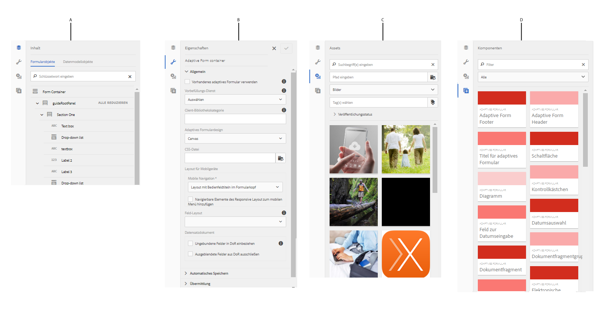
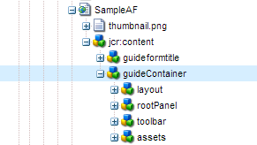

# Editor für adaptive Formulare {#introduction-to-authoring-adaptive-forms}

## Überblick {#overview}

Adaptive Formulare bieten Ihnen die Möglichkeit, interaktive, responsive und dynamische adaptive Formulare zu erstellen. [!DNL AEM Forms] bietet eine intuitive Benutzeroberfläche sowie vordefinierte Komponenten zum Erstellen und Verarbeiten von adaptiven Formularen. Sie können adaptive Formulare auf der Basis eines Formularmodells oder Schemas oder ohne Formularmodell erstellen. Es ist wichtig, sorgfältig ein Formularmodell zu wählen, das nicht nur Ihren Verwendungszwecken entspricht, sondern auch Ihre bestehenden Infrastrukturinvestitionen und -Assets erweitert. Zum Erstellen eines adaptiven Formulars werden die folgenden Optionen bereitgestellt:

* **Verwendung eines Formulardatenmodell**
  [Datenintegration](data-integration.md) ermöglicht die Integration von Entitäten und Services aus unterschiedlichen Datenquellen in ein Formulardatenmodell, das Sie zum Erstellen adaptiver Formulare verwenden können. Wählen Sie das Formulardatenmodell, wenn Sie ein adaptives Formular erstellen, für das Daten aus mehreren Datenquellen abgerufen und in sie geschrieben werden sollen.

* **Verwenden einer XDP-Formularvorlage** Dieses Formularmodell ist ideal, wenn bereits ein Bestand an XFA- oder XDP-basierten Formularen vorhanden ist. Es bietet eine direkte Möglichkeit, Ihre XFA-basierten Formulare in adaptive Formulare zu konvertieren. Alle vorhandenen XFA-Regeln bleiben in den adaptiven Formularen erhalten. Die resultierenden adaptiven Formulare unterstützen XFA-Konstrukte, z. B. Validierungen, Ereignisse, Eigenschaften und Muster.

* **Verwendung einer XML-Schemadefinition (XSD) oder eines JSON-Schemas** XML- und JSON-Schemas stellen die Struktur dar, in der Daten vom Back-End-System in Ihrem Unternehmen produziert oder genutzt werden. Sie können das Schema mit einem adaptiven Formular verknüpfen und dem Formular mithilfe der Elemente dieses Schemas dynamische Inhalte hinzufügen. Die Elemente des Schemas stehen beim Authoring von Adaptive Forms auf der Registerkarte Datenmodellobjekte des Inhaltsbrowsers zur Verfügung.

* **Verwenden von &quot;none&quot;oder &quot;without&quot;(Formularmodell)**
Adaptive Forms, die mit dieser Option erstellt wurde, verwendet kein Formularmodell. Die XML-Datendatei, die aus diesen Formularen generiert wird, hat eine flache Struktur mit Feldern und entsprechenden Werten.

  >[!NOTE]
  >
  > Sie können die Eigenschaften des Formularmodells im Editor für adaptive Formulare oder im Editor für adaptive Formularvorlagen ändern. Detaillierte Anweisungen hierfür finden Sie unter [Formularmodelleigenschaften eines adaptiven Formulars bearbeiten](/help/forms/creating-adaptive-form.md#edit-form-model-properties-of-an-adaptive-form-edit-form-model).

Informationen zum Erstellen eines adaptiven Formulars finden Sie unter [Erstellen eines adaptiven Formulars](creating-adaptive-form.md).

## Benutzeroberfläche für das Authoring adaptiver Formulare {#adaptive-form-authoring-ui}

Die Touch-optimierte Benutzeroberfläche für das Erstellen adaptiver Formulare ist intuitiv bedienbar und bietet:

* Drag-and-Drop-Funktion
* Standardmäßige Formularkomponenten
* Integriertes Repository für Assets

Wenn Sie ein neues adaptives Formular erstellen oder ein vorhandenes bearbeiten, verwenden Sie die folgenden UI-Elemente:

* [Randleiste](#sidebar)
* [Seitensymbolleiste](#page-toolbar)
* [Komponenten-Symbolleiste](#component-toolbar)
* [Seite mit adaptivem Formular](#af-page)

<!-- 

**A.** Sidebar **B.** Page toolbar **C.** Adaptive Form page -->

### Randleiste {#sidebar}

Die Seitenleiste ermöglicht Ihnen Folgendes:

* Suchen, Anzeigen und Verwenden von Assets in Ihrem DAM (AEM Digital Asset Management)-Repository.
* Anzeigen von Formularinhalt wie Bereichen, Komponenten, Feldern und Layout.
* Hinzufügen von Komponenten im Formular.
* Bearbeiten von Komponenteneigenschaften.

**A.** Inhalt-Browser **B.** Eigenschaften-Browser **C.** Assets-Browser **D.** Komponenten-Browser

<!--Click to enlarge

](assets/sidebar-comps-1.png) -->

Die Seitenleiste enthält folgende Browser:

* **Inhalt-Browser**
Im Inhalt-Browser können Sie Folgendes anzeigen:

   * **Formularobjekte** Zeigt die Objekthierarchie des Formulars an. Der Autor kann zu bestimmten Formularkomponenten navigieren, indem er auf das entsprechende Element in der Formularobjektstruktur tippt. Der Autor kann in dieser Struktur Objekte suchen und neu anordnen.

   * **Datenmodellobjekte**
Hiermit können Sie die Formularmodellhierarchie anzeigen.
Damit können Sie Formularmodellelemente per Drag-and-Drop-Funktion auf das adaptive Formular ziehen. Die hinzugefügten Elemente werden automatisch in Formularkomponenten konvertiert, während ihre ursprünglichen Eigenschaften beibehalten werden. Sie können Datenmodellobjekte anzeigen, wenn Ihr Formular ein XML-Schema, ein JSON-Schema oder eine XDP-Vorlage verwendet.

* **Eigenschaften-Browser**

  Hier können Sie die Eigenschaften einer Komponente bearbeiten. Die Eigenschaften sind je nach Komponente verschieden. So zeigen Sie die Eigenschaften des Containers für adaptive Formulare an:

  Wählen Sie eine Komponente aus, tippen Sie auf  > **[!UICONTROL Container des adaptiven Formulars]** und dann auf .

* **Assets-Browser**

  Trennt verschiedene Inhaltstypen wie Bilder, Dokumente, Seiten, Filme usw. voneinander.

* **Komponenten-Browser**

  Enthält Komponenten, mit denen Sie ein adaptives Formular erstellen können. Sie können Komponenten in das adaptive Formular ziehen, um Formularelemente hinzuzufügen, und hinzugefügte Elemente den Anforderungen entsprechend konfigurieren. In der folgenden Tabelle sind die im Komponenten-Browser aufgelisteten Komponenten beschrieben.

<table>
 <tbody>
  <tr>
   <th><strong>Komponente</strong></th>
   <th><strong>Funktionen</strong></th>
  </tr>
  <tr>
   <td>Adobe Sign Block</td>
   <td>Fügt einen Textblock mit Platzhaltern für Felder hinzu, die beim Signieren mit Adobe Sign ausgefüllt werden sollen.</td>
  </tr>
  <tr>
   <td>Schaltfläche</td>
   <td>Fügt eine Schaltfläche hinzu, die Sie konfigurieren können, um Aktionen auszuführen, wie Speichern, Zurücksetzen, Weiter, Zurück usw.</td>
  </tr>
  <tr>
   <td>Captcha</td>
   <td>Fügt die CAPTCHA-Validierung mithilfe des Google reCAPTCHA-Service hinzu.</td>
  </tr>
  <tr>
   <td>Diagramm</td>
   <td>Fügt ein Diagramm hinzu, das Sie in adaptiven Formularen und Dokumenten für die visuelle Darstellung von zweidimensionalen Daten in wiederholbaren Bereichen und Tabellenzeilen verwenden können.</td>
  </tr>
  <tr>
   <td>Kontrollkästchen</td>
   <td>Fügt ein Kontrollkästchen hinzu.</td>
  </tr>
  <tr>
   <td>Feld zur Datumseingabe</td>
   <td>Verwenden Sie die Komponente Datumseingabefeld in Ihrem Formular, damit Kunden Tag, Monat und Jahr separat in drei Feldern ausfüllen können. Sie können das Erscheinungsbild der Komponente anpassen und das Datumsformat ändern. Beispielsweise können Sie Ihren Kunden die Eingabe von Datumsangaben im Format MM/TT/JJJJ oder TT/MM/JJJJ gestatten.</td>
  </tr>
  <tr>
   <td>Datumsauswahl</td>
   <td>Fügt ein Kalenderfeld hinzu, um ein Datum auszuwählen.</td>
  </tr>
  <tr>
   <td>Dokumentfragment</td>
   <td>Ermöglicht das Hinzufügen wiederverwendbarer Komponenten einer Korrespondenz.</td>
  </tr>
  <tr>
   <td>Dokumentfragmentgruppe</td>
   <td>Ermöglicht das Hinzufügen einer Gruppe verwandter Dokumentfragmente, die Sie in einer Briefvorlage als Einheit verwenden können.</td>
  </tr>
  <tr>
   <td>Dropdown-Liste</td>
   <td>Fügt eine Dropdown-Liste für Einzel- oder Mehrfachauswahl hinzu.</td>
  </tr>
  <tr>
   <td>E-Mail</td>
   <td>
Fügt ein Feld zum Erfassen der E-Mail-Adresse hinzu. Die E-Mail-Komponente validiert standardmäßig E-Mail-Adressen mit dem folgenden regulären Ausdruck.
 
<code>^[a-zA-Z0-9.!#$%&amp;'*+/=?^_`{|}~-]+@[a-zA-Z0-9-]+(?:.[a-zA-Z0-9-]+)*$</code>
 </td>
  </tr>
  <tr>
   <td>Dateianhang</td>
   <td>
Fügt eine Schaltfläche hinzu, mit der Benutzende ergänzende Dokumente suchen und an das Formular anhängen können.
 
<strong>Hinweis: </strong>Die Dateianhangskomponente unterstützt eine vordefinierte Gruppe von Dateiformaten in adaptiven Formularen, die für Adobe Sign aktiviert sind. Weitere Informationen finden Sie unter <a href="https://helpx.adobe.com/de/document-cloud/help/supported-file-formats-fill-sign.html#main-pars_text">Unterstützte Dateiformate</a>.
 </td>
  </tr>
  <tr>
   <td>Dateianlagenliste</td>
   <td>Fügt ein Feld hinzu, das alle mit der Dateianlagenkomponente hochgeladenen Anlagen auflistet.</td>
  </tr>
  <tr>
   <td>Fußzeile  </td>
   <td>Fügt die Kopfzeile hinzu, die normalerweise das Logo eines Unternehmens, den Titel des Formulars und eine Zusammenfassung enthält.  </td>
  </tr>
  <tr>
   <td>Kopfzeile</td>
   <td>Fügt die Fußzeile hinzu, die normalerweise Copyright-Informationen und Links zu anderen Seiten enthält. </td>
  </tr>
  <tr>
   <td>Bild</td>
   <td>Ermöglicht es Ihnen, ein Bild einzufügen.</td>
  </tr>
  <tr>
   <td>Bildauswahl</td>
   <td>Ermöglicht es Ihren Kunden, ein Bild auszuwählen, um Informationen bereitzustellen. Mithilfe dieser Informationen können Sie Ihren Kunden personalisierte Dienste anbieten.</td>
  </tr>
  <tr>
   <td>Schaltfläche „Weiter“</td>
   <td>Fügt eine Schaltfläche hinzu, um zum nächsten Bereich in einem Formular zu navigieren.</td>
  </tr>
  <tr>
   <td>Numerisches Feld</td>
   <td>Fügt ein Feld zum Erfassen numerischer Werte hinzu</td>
  </tr>
  <tr>
   <td>Numerische Schritte</td>
   <td>Verwenden Sie numerische Schritte in Ihrem Formular, damit Ihre Kunden einen numerischen Wert eingeben können, den sie anhand eines vordefinierten Schritts erhöhen oder verringern können.</td>
  </tr>
  <tr>
   <td>Bereich</td>
   <td>
Fügt einen Bereich oder Unterbereich hinzu.
 
Sie können auch eine Bedienfeldkomponente aus der Symbolleiste des übergeordneten Bedienfelds hinzufügen, indem Sie die Untergeordnetes Bedienfeld hinzufügen</code> Schaltfläche. Auf ähnliche Weise können Sie eine bereichsspezifische Symbolleiste mit der Bereichssymbolleiste hinzufügen</code> Schaltfläche. Sie können die Position der Bedienfeld-Symbolleiste mithilfe des Dialogfelds „Bedienfeld bearbeiten“ konfigurieren.
 </td>
  </tr>
  <tr>
   <td>Kennwortfeld</td>
   <td>Fügt ein Feld zum Erfassen eines Kennworts hinzu.</td>
  </tr>
  <tr>
   <td>Schaltfläche "Zurück"</td>
   <td>Fügt eine Schaltfläche hinzu, die Benutzer benötigen, um zur vorherigen Seite oder zum vorherigen Bedienfeld zurückzukehren.</td>
  </tr>
  <tr>
   <td>Optionsschaltfläche</td>
   <td>Fügt Optionsfelder hinzu.</td>
  </tr>
  <tr>
   <td>Zurücksetzen-Schaltfläche</td>
   <td>Fügt eine Schaltfläche zum Zurücksetzen von Formularfeldern hinzu.</td>
  </tr>
  <tr>
   <td>Schaltfläche „Speichern“</td>
   <td>Fügt eine Schaltfläche zum Speichern von Formulardaten hinzu.</td>
  </tr>
  <tr>
   <td>Freihändige Unterschrift</td>
   <td>Fügt ein Feld zum Erfassen von Freihandsignaturen hinzu.</td>
  </tr>
  <tr>
   <td>Trennzeichen</td>
   <td>Aktiviert die visuelle Trennung von Bereichen im Formular.</td>
  </tr>
  <tr>
   <td>Unterschriftsschritt</td>
   <td>Zeigt die Informationen an, die im Formular bereitgestellt werden, sowie die Signaturfelder, die der Benutzer zum Überprüfen und Signieren des Formulars verwenden kann.</td>
  </tr>
  <tr>
   <td>Text</td>
   <td>Ermöglicht die Angabe von statischem Text.</td>
  </tr>
  <tr>
   <td>Senden-Schaltfläche</td>
   <td>Fügt eine Schaltfläche zum Senden hinzu, um das Formular an die konfigurierte Übermittlungsaktion zu übergeben.</td>
  </tr>
  <tr>
   <td>Zusammenfassungsschritt</td>
   <td>Sendet das Formular und zeigt von den Autoren angegebenen Zusammenfassungstext an, nachdem das Formular gesendet wurde. </td>
  </tr>
  <tr>
   <td>Schalter</td>
   <td>Fügt einen Schalter hinzu, der einen Umschalter ausführt oder eine Aktion aktiviert/deaktiviert. Sie können nicht mehr als zwei Optionen in der Schalter-Komponente hinzufügen. Da ein Schalter nur zwei Werte haben kann: An und Aus, ist „Obligatorisch“ nicht verfügbar. Mindestens ein Wert wird unabhängig von der Benutzereingabe gespeichert.   </td>
  </tr>
  <tr>
   <td>Tabelle</td>
   <td>Fügt eine Tabelle hinzu, mit der Sie Daten in Zeilen und Spalten organisieren können. </td>
  </tr>
  <tr>
   <td>Telefonnummer</td>
   <td>
Fügt ein Feld zum Erfassen der Telefonnummer hinzu. Mit der Komponente „Telefonnummer“ können Autoren einen der folgenden Telefonnummerntypen konfigurieren. Jeder Typ ist mit einem standardmäßigen regulären Ausdruck für die Validierung verknüpft.

    <ul>
     <li>Der Typ „International“ wird durch <code>^[+][0-9]{0,14}$</code> validiert.</li>
     <li>Der Typ „USPhoneNumber“ wird durch <code>{'+1 ('999') '999-9999}</code> validiert.</li>
     <li>Der Typ „UKPhoneNumber“ wird durch <code>text{'+'99 999 999 9999}</code> validiert.</li>
     <li>Der Typ Benutzerdefiniert bietet kein standardmäßiges Überprüfungsmuster. Er nimmt den Wert des zuletzt ausgewählten Telefonnummerntyps an. Sie können auch Ihr eigenes benutzerdefiniertes Überprüfungsmuster angeben.</li>
    </ul> </td>
  </tr>
  <tr>
   <td>Geschäftsbedingungen  </td>
   <td>Fügt ein Feld hinzu, mit dem Autoren die Bedingungen festlegen können, die Benutzer überprüfen können, bevor sie das Formular ausfüllen.</td>
  </tr>
  <tr>
   <td>Textfeld </td>
   <td>
Fügt ein Textfeld hinzu, in dem ein Benutzer die erforderlichen Informationen angeben kann. 
 
Standardmäßig akzeptiert die Textfeldkomponente nur Text. Sie können die Eingabe von Rich Text in einer Textfeldkomponente ermöglichen. Eine für Rich-Text aktivierte Textkomponente bietet Optionen zum Hinzufügen von Kopfzeilen, zum Ändern von Zeichenstilen (fett, kursiv, unterstreichen die Zeichen), zum Erstellen geordneter und ungeordneter Listen, zum Ändern von Texthintergrund und Textfarbe und zum Hinzufügen von Hyperlinks. Um Rich Text für ein Textfeld zu aktivieren, aktivieren Sie die Option <strong>Rich Text erlauben</strong> in den Komponenteneigenschaften.
 </td>
  </tr>
  <tr>
   <td>Titel</td>
   <td>Gibt einen Titel für das adaptive Formular an.</td>
  </tr>
  <tr>
   <td>Überprüfungsschritt</td>
   <td>
Fügt einen Platzhalter hinzu, um das ausgefüllte Formular zur Überprüfung durch den Benutzer anzuzeigen.
 
<strong>Hinweis</strong>: Adaptive Formulare, die die Verify-Komponente enthalten, unterstützen keine anonymen Benutzer. Außerdem wird nicht empfohlen, die Verify-Komponente in einem adaptiven Formularfragment zu verwenden.
 </td>
  </tr>
 </tbody>
</table>

### Seitensymbolleiste {#page-toolbar}

Die Seitensymbolleiste oben bietet Optionen, mit denen Sie eine Vorschau des Formulars anzeigen, Formulareigenschaften ändern und das Formularlayout bearbeiten können. Sie können eine Vorschau des Formulars anzeigen, wenn Sie es erstellen, und entsprechend Änderungen vornehmen. In der Symbolleiste der Seite wird Folgendes angezeigt:

* **Seitliches Bedienfeld ein/aus** : Hiermit können Sie die Seitenleiste ein- oder ausblenden.

* **Seiteninformationen** : Hier können Sie Seiteneigenschaften anzeigen, ein Formular veröffentlichen bzw. dessen Veröffentlichung zurücknehmen, einen Formular-Workflow starten und ein Formular auf der klassischen Benutzeroberfläche öffnen.

* **Emulator** : Hiermit können Sie die Darstellung des Formulars für verschiedene Displaygrößen (z. B. für Tablets und Mobiltelefone) emulieren.

* **Bearbeiten**: Hiermit können Sie andere Modi auswählen, wie etwa: **[!UICONTROL Bearbeiten]**, **[!UICONTROL Stil]**, **[!UICONTROL Entwickler]** und **[!UICONTROL Design]**.

   * **Bearbeiten**: Hiermit können Sie die Eigenschaften des Formulars und seiner Komponenten bearbeiten. Dies tun Sie, indem Sie beispielsweise eine Komponente hinzufügen, ein Bild ablegen oder obligatorische Felder festlegen.
   * **Stil**: Hiermit können Sie das Erscheinungsbild von Komponenten im Formular stilistisch anpassen. Im Stilmodus können Sie beispielsweise einen Bereich auswählen und dessen Hintergrundfarbe festlegen.

   * **Entwickler**: Hier haben Entwickler folgende Möglichkeiten:

      * Erfahren Sie, woraus Formulare bestehen.
      * Debuggen Sie, was wo und wann passiert, was wiederum hilft, Probleme zu lösen.

      * **Design**: Hier können Sie benutzerdefinierte Komponenten oder auch nicht in der Seitenleiste aufgelistete vordefinierte Komponenten aktivieren oder deaktivieren.

* **Vorschau**: Hier können Sie das Aussehen des Formulars bei Veröffentlichung in einer Vorschau anzeigen.

### Komponenten-Symbolleiste {#component-toolbar}

Wenn Sie eine Komponente auswählen, wird eine Symbolleiste angezeigt, über die Sie sie bearbeiten können. Sie erhalten Optionen zum Ausschneiden, Einfügen, Verschieben und Angeben von Eigenschaften der Komponenten. Ihre Optionen sind:

A. **Konfigurieren**: Wenn Sie auf **[!UICONTROL Konfigurieren]** tippen, werden in der Seitenleiste Komponenteneigenschaften sichtbar. Durch die Konfiguration dieser Eigenschaften können Sie die Datenerfassung anpassen. Sie können den Elementnamen der Komponente ändern und den Beschriftungstext im Feld Titel der Komponente angeben. Mit dem Elementnamen können Sie Werte erfassen, die Benutzer mithilfe der Komponente eingeben. In den Komponenteneigenschaften geben Sie das Verhalten der Komponente an und verwalten die Benutzereingabe. Konfigurieren Sie Eigenschaften in der Seitenleiste, um Benutzerdaten zu erfassen und sie für die weitere Verarbeitung zu verwenden. Mit den Eigenschaften für den adaptiven Formular-Container können Sie Client-Bibliotheken, Layouts, Designs sowie die Einstellungen für Datensatzdokumente, Speicherung, Übermittlung und Metadaten festlegen.

B. **Kopieren**: Sie können die Kopieroption verwenden, um eine Komponente zu kopieren und an anderen Positionen im Formular einzufügen. Wenn Sie eine Komponente einfügen, erhält die eingefügte Komponente einen neuen Elementnamen, behält jedoch die Eigenschaften der kopierten Komponente bei.

C. **Ausschneiden**: Sie können die Option zum Ausschneiden verwenden, um eine Komponente von einer Position im adaptiven Formular an eine andere Position zu verschieben.

D. **Löschen**: Hiermit können Sie die Komponente aus dem Formular löschen.

E. **Einfügen**: Hiermit können Sie eine Komponente oberhalb der ausgewählten Komponente einfügen.

F. **Einfügen**: Hiermit können Sie die mithilfe der oben genannten Optionen ausgeschnittene oder kopierte Komponente einfügen.

G. **Regeln bearbeiten**: Hiermit können Sie den Regel-Editor öffnen. Für weitere Informationen <!-- see [Rule Editor](rule-editor.md). -->

H. **Gruppieren**: Mit dieser Funktion können Sie mehrere Komponenten auswählen, um sie zusammen auszuschneiden, zu kopieren oder einzufügen.

I. **Übergeordnet**: Hier können Sie das übergeordnete Element einer Komponente auswählen. Beispiel: Ein Textfeld, das innerhalb eines Unterabschnitts liegt, der seinerseits Teil eines Abschnitts ist. Der Abschnitt befindet sich im Guide-Stammbereich, und der adaptive Formular-Container ist einem Guide-Stammbereich übergeordnet. Bei einer Komponente können Sie alle Optionen sehen, wobei die Sortierhierarchie von unten nach oben verläuft.

Wenn Sie beispielsweise für ein Textfeld auf **[!UICONTROL Übergeordnet]** tippen, sehen Sie Folgendes:

* Unterabschnitt
* Abschnitt
* guideRootPanel
* Container für adaptive Formulare

J. **sonstige**: Bietet weitere Optionen zum Arbeiten mit der ausgewählten Komponente.

* SOM-Ausdruck anzeigen
* Speichern eines Bedienfelds als Fragment (nur für Bedienfelder)
* Untergeordnetes Bedienfeld hinzufügen (nur für Bedienfelder)
* Bedienfeld-Symbolleiste hinzufügen (nur für Bereiche)
* Ersetzen (nicht für Bedienfelder)

### Seite mit adaptivem Formular {#af-page}

Die Seite mit dem adaptiven Formular enthält das eigentliche Formular. Sie wird wie jede andere WCM-Seite als WCM-`cq:Page`-Komponente modelliert. Die folgende Abbildung zeigt die Inhaltsstruktur eines typischen adaptiven Formulars.

Die Inhaltsstruktur enthält in der Regel die folgenden Hauptkomponenten:

* **guideContainer**: Der Stamm eines adaptiven Formulars, der als **[!UICONTROL Beginn des adaptiven Formulars]** in der Benutzeroberfläche des adaptiven Formulars markiert ist. In dieser Komponente können Sie Folgendes angeben:

   * *Mobile-Layout des adaptiven Formulars*: Definiert die Darstellung des Formulars auf mobilen Geräten.
   * *Dankeseite*: Definiert die Seite, auf die der Benutzer nach dem Senden des Formulars umgeleitet wird.
   * *Übermittlungsaktion*: Definiert, wie das Formular auf dem Server verarbeitet wird, sobald der Benutzer das Formular sendet.
   * *Formatierung*: Gibt den Pfad zur CSS-Datei an, die zum Anpassen des Erscheinungsbilds des Formulars verwendet wird.

* **rootPanel**: Der Stammbereich eines adaptiven Formulars. Sie kann Unterbereiche unter dem Elementknoten enthalten. Jedem Bedienfeld einschließlich des Stammbereichs kann ein Layout zugeordnet sein. Das Layout des Bedienfelds bestimmt das Layout des Formulars. Im Akkordeonlayout beispielsweise werden die Elemente als Akkordeonschritte angeordnet.

* **Symbolleiste**: Ein Container für ein adaptives Formular verfügt über eine zugehörige Symbolleiste, die global für das Formular verfügbar ist. Diese Symbolleiste kann mit der Aktion **[!UICONTROL Symbolleiste hinzufügen]** in der Bearbeitungsleiste hinzugefügt werden. Damit können Autoren Aktionen wie Übermitteln, Speichern, Zurücksetzen usw. hinzufügen.

* **assets**: Dieser Knoten enthält zusätzliche Informationen für das Formular-Authoring. Beispiele: Formularmodelldetails, Lokalisierungsdetails usw.
