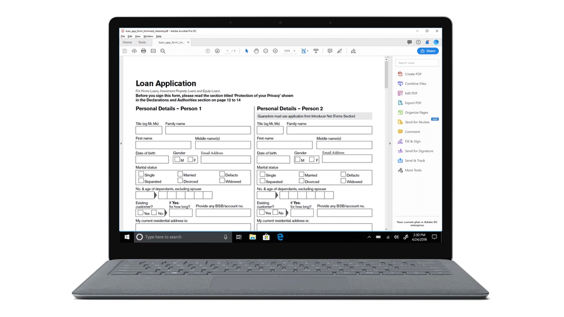
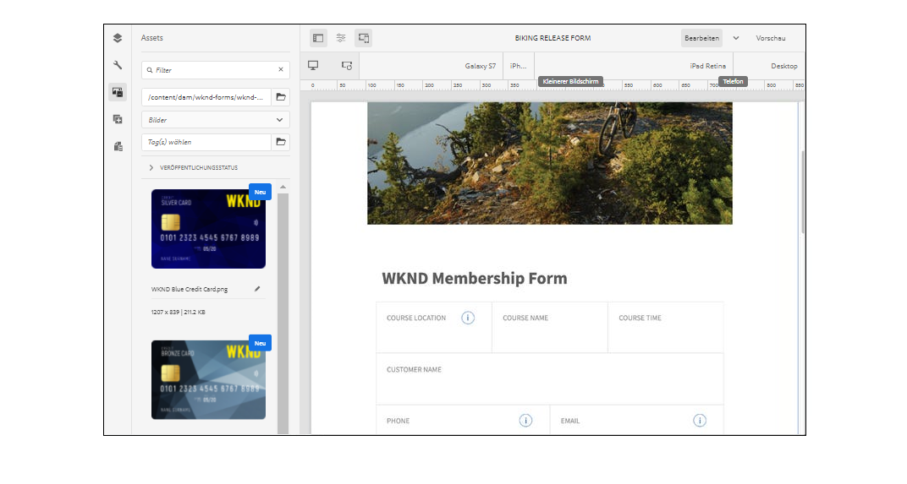

<!-- # Introduction to [!DNL AEM Forms] as a Cloud Service {#overview}

Adobe Experience Manager Forms as a Cloud Service offers a cloud-native, Platform as a Service (PaaS) solution for businesses to create, manage, publish, and update complex digital forms while integrating submitted data with back-end processes, business rules, and saving data in an external data store. The service is always current, always available, and always learning.

You can use the service to create and rollout  interactive and engaging digital forms. For example, an organization is looking to digitize their customer enrollment journey. They have multiple data sources with existing customer data, they are looking to pre-populate forms, add e-sign their forms, and archive filled forms as PDF files. Besides, the organization has multiple print forms (PDF forms), they are also looking to convert all of their print forms to digital forms.

The organization can use [!DNL AEM Forms] as a Cloud Service to create digital forms, connect forms to existing data sources, integrate forms with [!DNL Adobe Sign] to add e-signatures to forms, and generate Document of Record (DoR) to archive filled forms as PDF files. The organization can also use the service to convert their existing PDF forms to digital forms. 

An organization can sign up for [!DNL AEM Forms] as a Cloud Service and start using all these features without waiting to buy and set up a local infrastructure. The service also frees the organizations from the cycle of upgrades as it is always up to date and always offers the latest feature.  -->

# Neueste Innovationen {#latest-innovations}

Zu den neuesten Innovationen in AEM Forms as a Cloud Service gehören:

| Funktion | Details |
|---|---|
| Headless Adaptive Forms | Erstellen und Verwalten [Headless Adaptive Forms](https://experienceleague.corp.adobe.com/docs/experience-manager-headless-adaptive-forms/using/overview.html) innerhalb der Adobe Experience Manager-Plattform. Ermöglichen es Entwicklern, interaktive Formulare zu erstellen, zu veröffentlichen und zu verwalten, auf die über APIs und nicht über eine herkömmliche grafische Benutzeroberfläche zugegriffen und mit denen interagiert werden kann.     Diese Formulare sind für die Übermittlung konzipiert, ohne dass eine herkömmliche HTML-Formular-Oberfläche erforderlich ist. Mit anderen Worten: Sie ermöglichen es Ihnen, Formulardaten programmgesteuert über eine API oder einen Backend-Code zu senden, ohne dass sichtbare Formularelemente am Frontend erforderlich sind.     Headless-Formulare sind in verschiedenen Szenarien nützlich, z. B. beim Erstellen von Einzelseitenanwendungen, progressiven Web-Apps oder mobilen Anwendungen, bei denen eine herkömmliche HTML-Formular-Oberfläche möglicherweise nicht erforderlich oder praktisch ist. Durch die Möglichkeit, dass Entwickler Formulardaten direkt über APIs oder Backend-Code senden können, helfen Headless-Formulare bei der Optimierung von Workflows und der Verbesserung der Gesamtleistung von Webanwendungen. |
| Kernkomponenten | Die [Adaptive Forms-Kernkomponenten](https://experienceleague.adobe.com/docs/experience-manager-core-components/using/adaptive-forms/introduction.html#features) sind eine Gruppe von 24 Open-Source-BEM-kompatiblen Komponenten, die auf der Grundlage der Adobe Experience Manager WCM-Kernkomponenten erstellt wurden. Sie sind speziell für die Erstellung von Adaptive Forms entwickelt worden. Hierbei handelt es sich um Formulare, die sich an Gerät, Browser und Bildschirmgröße des Benutzers anpassen.     Diese Komponenten können verwendet werden, um außergewöhnliche Datenerfassungs- und Registrierungserlebnisse zu schaffen, indem sie eine breite Palette von Formularfeldoptionen bereitstellen, darunter Textfelder, Kontrollkästchen, Dropdownmenüs und mehr. Sie umfassen auch Funktionen wie Validierung, Bedingungslogik und responsives Design, die zum Erstellen benutzerfreundlicher und benutzerfreundlicher Formulare verwendet werden können.      Da es sich bei diesen Komponenten um Open-Source-Komponenten handelt, können Entwickler die Komponenten einfach anpassen und erweitern, um sie an die spezifischen Anforderungen ihrer Organisation anzupassen. Und diese Komponenten basieren auf der BEM-Methode, die sicherstellt, dass sie skalierbar und wartbar sind. |
| Microsoft PowerAutomate Connector | AEM Forms Power Automate Connector ermöglicht Ihnen die Integration von Adobe Experience Manager (AEM) Forms in Microsoft Power Automate (früher bekannt als Microsoft Flow). Power Automate ist ein Cloud-basierter Dienst, mit dem Sie automatisierte Workflows zwischen verschiedenen Anwendungen und Diensten erstellen können.      Mit AEM Power Automate Connector für Formulare können Sie Workflows erstellen, die basierend auf der Übermittlung eines adaptiven Formulars automatisch Trigger werden. Sie können beispielsweise einen Workflow erstellen, der automatisch eine E-Mail-Benachrichtigung an eine bestimmte Person sendet, wenn ein Benutzer ein Formular sendet, oder eine Aufgabe in Microsoft Planer erstellt, wenn ein Benutzer ein Formular ausfüllt.       Der AEM Forms Power Automate Connector ist ein leistungsstarkes Tool, mit dem Sie Ihre adaptive Forms automatisieren und mit anderen Anwendungen und Diensten integrieren können, die mit Microsoft Power Automate verbunden sind, sodass Sie mit einer größeren Palette von Tools arbeiten können. Sie können Workflows erstellen, die auf Ihre spezifischen Anforderungen zugeschnitten sind und benutzerdefinierte Aktionen, Bedingungen und Trigger hinzufügen. Zusätzlich bietet Power Automate detaillierte Analysen und Berichte, mit denen Sie Ihre Workflows im Laufe der Zeit überwachen und optimieren können. |
| Microsoft Storage Connectors | AEM Forms Microsoft Storage Connectors für <a href="https://experienceleague.corp.adobe.com/docs/experience-manager-cloud-service/content/forms/adaptive-forms-authoring/authoring-adaptive-forms-foundation-components/configure-submit-actions-and-metadata-submission/configuring-submit-actions.html#submit-to-sharedrive">OneDrive</a>, <a href="https://experienceleague.corp.adobe.com/docs/experience-manager-cloud-service/content/forms/adaptive-forms-authoring/authoring-adaptive-forms-foundation-components/configure-submit-actions-and-metadata-submission/configuring-submit-actions.html?#submit-to-sharedrive"> SharePoint, </a> und <a href="https://experienceleague.corp.adobe.com/docs/experience-manager-cloud-service/content/forms/adaptive-forms-authoring/authoring-adaptive-forms-foundation-components/configure-submit-actions-and-metadata-submission/configuring-submit-actions.html?#submit-to-azure-blob-storage"> Azure Blob Storage </a> sind Connectoren, mit denen Sie Adobe Experience Manager (AEM) Forms in Microsoft OneDrive und SharePoint integrieren können. Mit diesem Connector können Sie Datendateien und Anhänge direkt von Adaptive Forms in OneDrive und SharePoint hochladen.     OneDrive und SharePoint können in andere Geschäftsanwendungen wie CRM-Systeme, Buchhaltungssoftware und Projektmanagement-Tools integriert werden. Dies ermöglicht Ihnen, Ihre Geschäftsprozesse zu optimieren, die manuelle Dateneingabe zu reduzieren und die Gesamteffizienz zu verbessern. |

<!-- 

# Key features and capabilities {#key-features}

[!DNL AEM Forms] as a Cloud Service provides several cloud-native capabilities such as a cloud-native architecture, auto-scaling, zero downtime for upgrades, a CDN (Content Delivery Network), cloud-native development environment, and ability to self-Service the environments via Cloud Manager. You can use the service to: 

* [Create Adaptive Forms](creating-adaptive-form.md#strong-create-an-adaptive-form-strong) that automatically render for a user's device and browser.

    

* [Create pixel-perfect PDF forms](use-forms-designer.md#create-an-adaptive-form) that look almost like paper.

* Use [Automated Forms Conversion service](https://experienceleague.adobe.com/docs/aem-forms-automated-conversion-service/using/introduction.html) to convert a PDF Form to an Adaptive Form. It helps you accelerate digitization and modernization of data capture experiences of your organization.

    

* [Create business processes](aem-forms-workflow-step-reference.md#create-form-centric-workflows). For example, You can create and trigger an approval and rejection workflow on submission of an Adaptive Form.

In addition to above [!DNL AEM Forms] as a Cloud Service offers the following features and capabilities:

* An easy-to-use graphical user interface to let business users easily import, manage, preview, and publish forms
* A responsive forms directory with powerful search features using keywords, tags, and metadata
* Dynamic detection of a user's device and location to render the form appropriately across web and mobile channels
* [Integration with Adobe Sign](adobe-sign-integration-adaptive-forms.md) services or Scribble to electronically sign documents containing confidential information
* Ability to [connect the service to various types of data sources](data-integration.md#create-an-adaptive-form) to send and retrieve data. The service supports sending and retrieving data from RESTful web services, SOAP-based web services, and OData enabled services.
* Integration with AEM Sites. It allows to embed an adaptive form in an AEM Sites page. You can also integrate an adaptive form to any webpage. 
* Ability to create a Document of Record (DoR) to keep a record of the information that you provide and submit in an Adaptive Form so that you can refer to it later. A DoR is a PDF version of a form. It includes both a template and data. The service provides a default DoR template and tools to develop a custom template.
* Ability to create Adaptive Forms to produce schema-compliant data. It helps you submit captured data to existing processes and data sources without any or minimal modifications.
* Ability to create a prefill service to fill a form with existing customer data based on a criteria. It helps fasten the form filling process and reduce the abandon rate.

<!-- 

## Enterprise-class forms {#enterprise-class-forms}

You can create enterprise class forms (Adaptive Forms) and deliver beautiful, interactive, responsive, and personalized experiences to your customers. These forms change behavior and appearance based on the underlying device. You can also use themes and templates with Adaptive Forms to mandate a uniform structure and appearance for all the forms of an organization or a department.

## Automatic conversion of PDF forms to Adaptive Forms {#automatic-conversion-of-pdf-forms-to-adaptive-forms}

You can use Automated Forms Conversion service to convert a PDF Form to an Adaptive Form. It helps you accelerate digitization and modernization of data capture experiences of your organization.

## Data Integration {#data-integration}

You can connect the service to various types of data sources to send and retrieve data. The service supports sending and retrieving data from RESTful web services, SOAP-based web services, and OData enabled services.

## Integration with [!DNL Adobe Sign] {#integration-with-adobe-sign}

 You can integrate the service with [!DNL Adobe Sign] and add [!DNL Adobe Sign] fields to an Adaptive Form. It allows your users to e-sign an Adaptive Form and use [!DNL Adobe Sign] with AEM Workflows. You can use AEM Workflows to develop a business logic and send forms and documents to recipients for signatures based on the business logic.

## Integration with [!DNL AEM Sites] {#integration-with-aem-sites}

You can embed an adaptive form in an AEM Sites or an external webpage. The service provides a component out of the box to integrate an adaptive forms to an AEM Sites page.

## Business Processes Automation {#bpa}

You can use AEM Workflows to create business processes and automate operations. For example, You can create and trigger an approval and rejection workflow on submission of an Adaptive Form. 

## Document of Record {#dor}

You can create a Document of Record (DoR) to keep a record of the information that you provide and submit in an Adaptive Form so that you can refer to it later. A DoR is a PDF version of a form. It includes both a template and data. The service provides a default DoR template and tools to develop a custom template.

## Rule editor {#rule-editor}

Rule editor empowers you to build dynamism and interactivity to Adaptive Forms. These rules define actions to trigger on form objects based on preset conditions, user inputs, and user actions on the form. It helps  streamline the form filling experience while ensuring accuracy and speed.
  

## WYSIWYG editors {#wysiwyg-editor} 

The service provides several WYSIWYG editors: Adaptive Forms editor, Theme editor, and Template editor. These help you create and edit forms and related assets in WYSIWYG manner. The editors also provide out-of-the-box options to simulate views for popular mobile devices, tablets, and desktop screen configurations.

## Schema-compliant data {#schema-complaint-data}

You can create Adaptive Forms to produce schema-compliant data. It helps you submit captured data to existing processes and data sources without any or minimal modifications.

## Prefill a form

You can create a prefill service to fill a form with existing customer data based on a criteria. It helps fasten the form filling process and reduce the abandon rate.

## Submit Actions

A Submit Action allows you to persist and process captured data. The service provides several Submit Actions out-of-the-box. You can use these Submit Actions to send submitted data to a REST endpoint, database, or an AEM Workflow. You can also email submitted data along with attachments and Document of Record(DoR). You can also develop a custom Submit Action to perform an action specific to your business.

* **Emulators:** You can view an Adaptive Form in an in-built emulator. It helps you simulate how an Adaptive Form appears on different devices to an end user. It provides out-of-the-box options to simulate views for popular mobile devices, tablets, and desktop screen configurations. 

In addition to standard [!DNL AEM Forms] features, [!DNL AEM Forms] as a Cloud Service provides several cloud-native capabilities such as a cloud-native architecture, auto-scaling, zero downtime for upgrades, a CDN (Content Delivery Network), cloud-native development environment, and ability to self-Service the environments via Cloud Manager. -->
