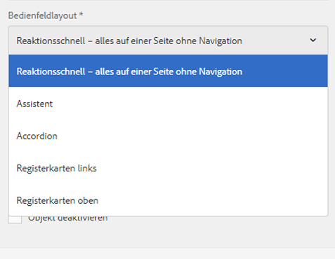
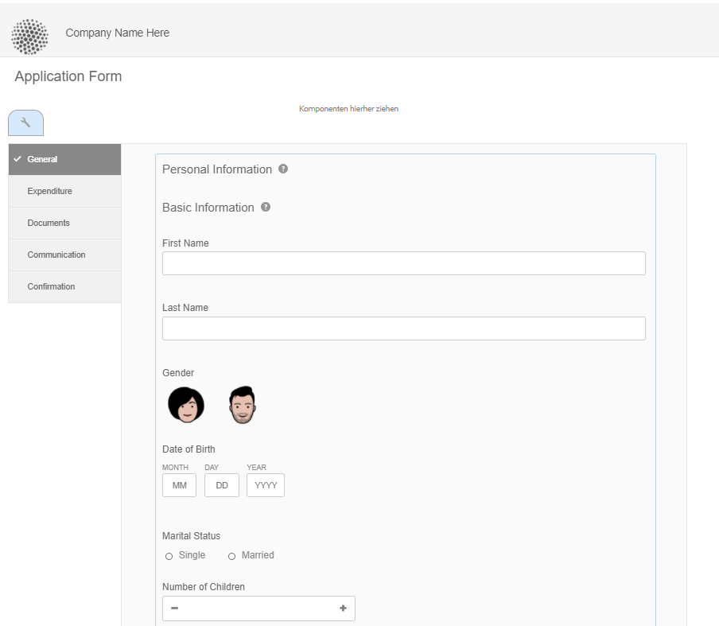
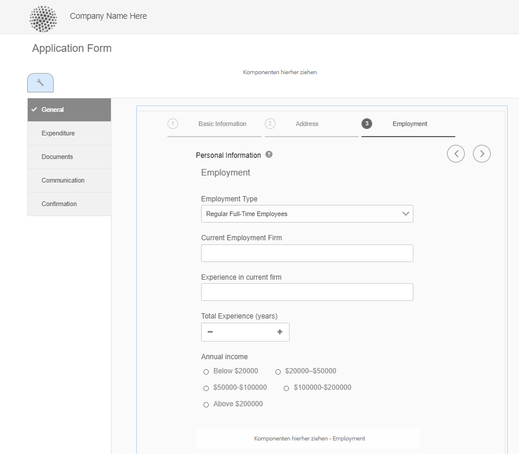
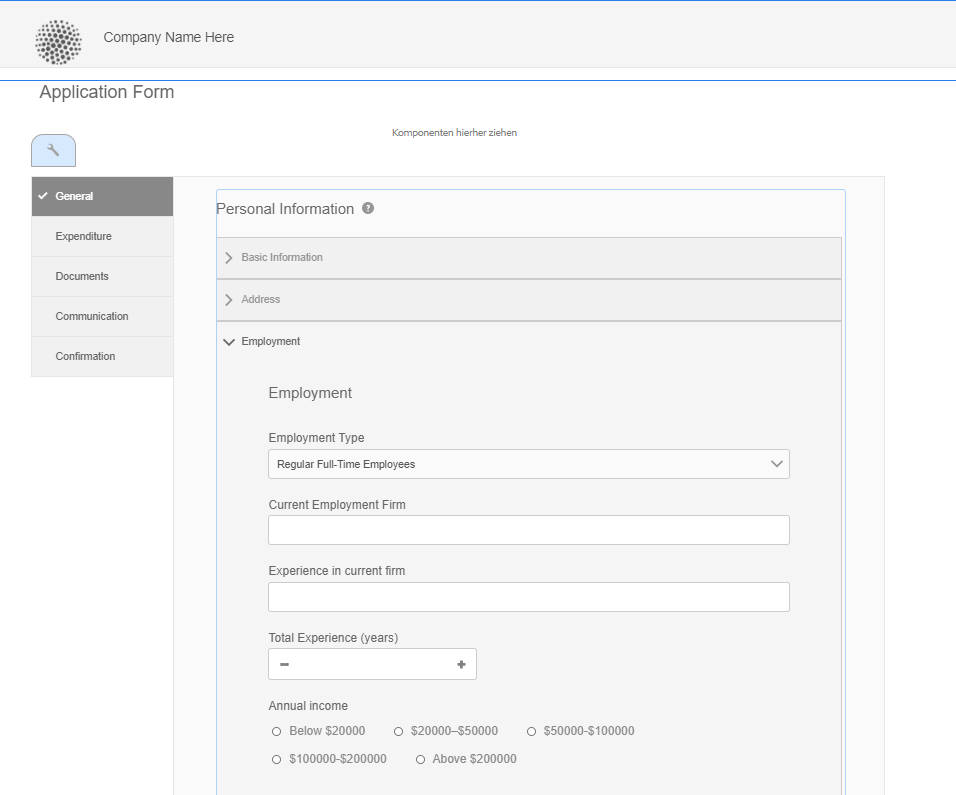
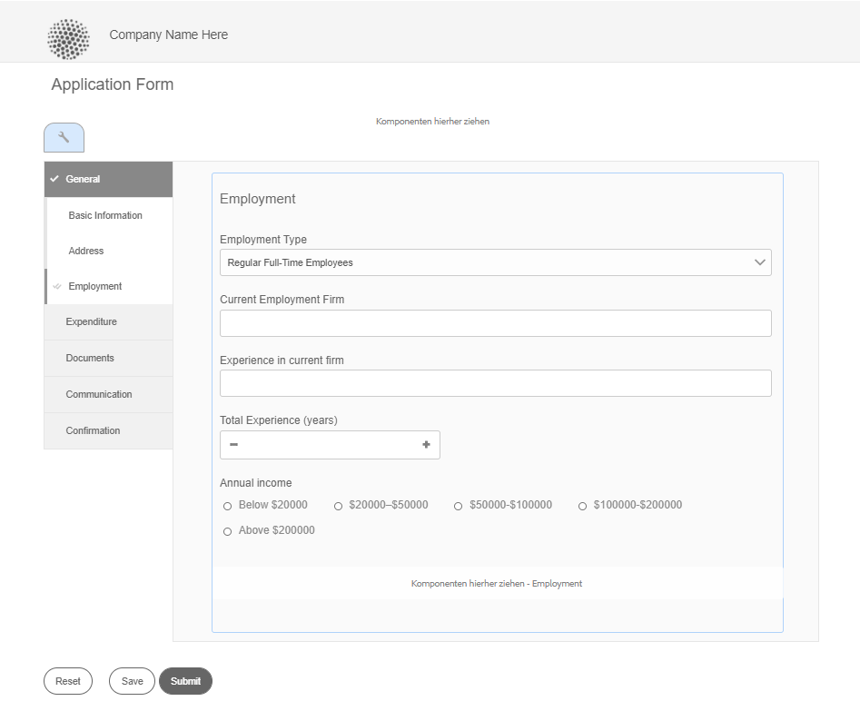
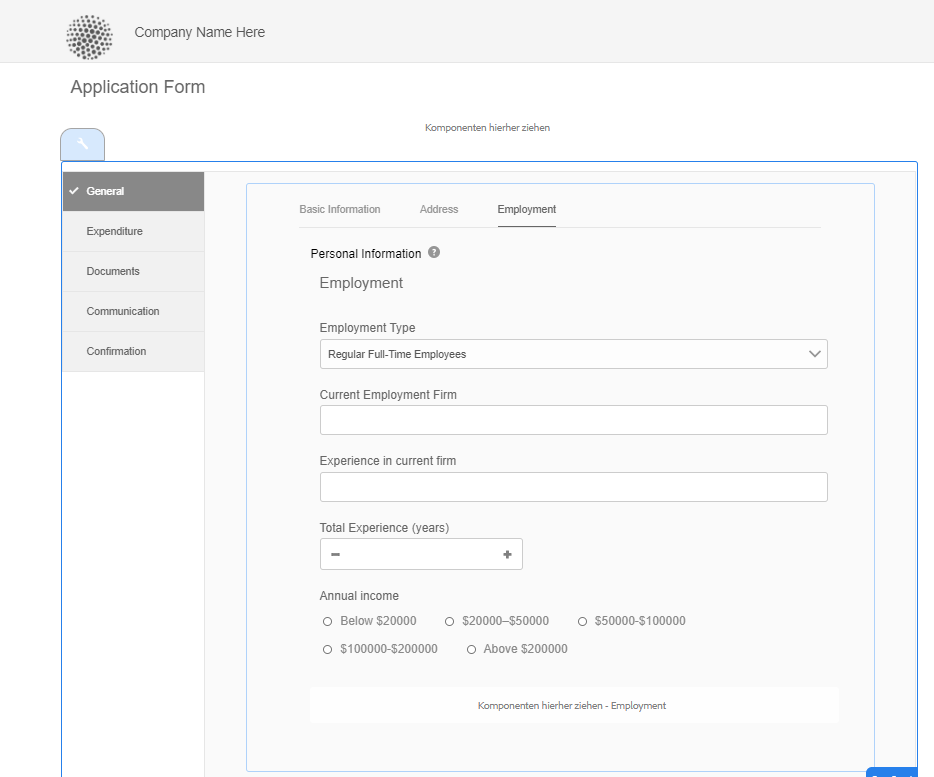
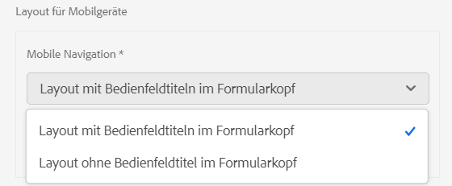
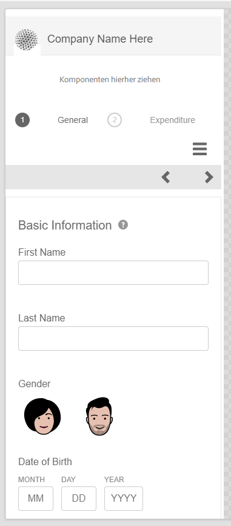
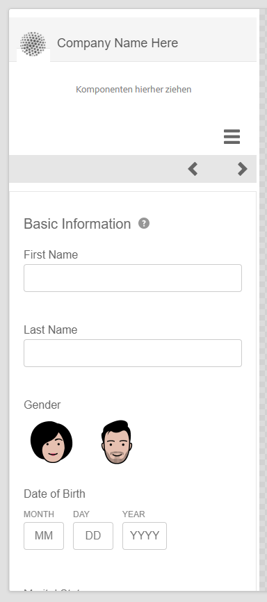
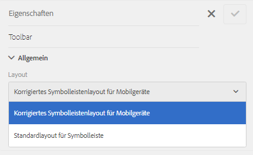

# Layout-Möglichkeiten für adaptive Formulare {#layout-capabilities-of-adaptive-forms}

>[!NOTE]
>
> Adobe empfiehlt, die modernen und erweiterbaren [Kernkomponenten](https://experienceleague.adobe.com/docs/experience-manager-core-components/using/adaptive-forms/introduction.html?lang=de) für die Datenerfassung zu verwenden, um [neue adaptive Formulare zu erstellen](/help/forms/creating-adaptive-form-core-components.md) oder [adaptive Formulare zu AEM Sites-Seiten hinzuzufügen](/help/forms/create-or-add-an-adaptive-form-to-aem-sites-page.md). Diese Komponenten stellen einen bedeutenden Fortschritt bei der Erstellung adaptiver Formulare dar und sorgen für beeindruckende Anwendererlebnisse. In diesem Artikel wird der ältere Ansatz zum Erstellen von adaptiven Formularen mithilfe von Foundation-Komponenten beschrieben.


| Version | Artikel-Link |
| -------- | ---------------------------- |
| AEM 6.5 | [Hier klicken](https://experienceleague.adobe.com/docs/experience-manager-65/forms/adaptive-forms-basic-authoring/layout-capabilities-adaptive-forms.html?lang=de) |
| AEM as a Cloud Service (Kernkomponenten) | [Hier klicken](/help/forms/layout-capabilities-adaptive-forms-core-components.md) |
| AEM as a Cloud Service (Foundation-Komponenten) | Dieser Artikel |

Mit [!DNL Adobe Experience Manager] können Sie adaptive Formulare erstellen, die für Endbenutzer einfach und dynamisch zu verwenden sind. Das Formular-Layout steuert, wie Elemente oder Komponenten in einem adaptiven Formular angezeigt werden.

<!-- ## Prerequisite knowledge {#prerequisite-knowledge}

Before learning about the different layout capabilities of Adaptive Forms, read [Introduction to authoring forms](introduction-forms-authoring.md) to know more about Adaptive Forms. -->

## Layout-Typen {#types-of-layouts}

In einem adaptiven Formular stehen Ihnen die folgenden Typen von Layouts zur Verfügung:

**[!UICONTROL Bereichslayout]** Steuert, wie in einem Bereich befindliche Elemente oder Komponenten auf einem Gerät angezeigt werden.

**[!UICONTROL Layout für Mobilgeräte]** Steuert die Navigation eines Formulars auf einem mobilen Gerät. Wenn das Gerät eine Bildschirmbreite von mindestens 768 Pixel hat, wird das Layout als Layout für Mobilgeräte betrachtet und für Mobilgeräte optimiert.

**[!UICONTROL Symbolleisten-Layout]** Steuert die Platzierung von Aktionsschaltflächen in der Symbolleiste bzw. in der Bereichssymbolleiste in einem Formular.

Alle diese Bereichslayouts sind unter `/libs/fd/af/layouts` definiert.

Um das Layout eines adaptiven Formulars zu ändern, verwenden Sie den Autorenmodus in [!DNL Experience Manager].

## [!UICONTROL Bedienfeld-Layout] {#panel-layout}

Formularersteller können jedem Bereich eines adaptiven Formulars ein Layout zuordnen, einschließlich des Stammbereichs.

Die Bereichslayouts stehen unter `/libs/fd/af/layouts/panel` zur Verfügung. Wählen Sie den Bereich und wählen Sie dann , um die Eigenschaften des Bereichs anzuzeigen.



### [!UICONTROL Responsiv – alles auf einer Seite ohne Navigation] {#responsive-everything-on-one-page-without-navigation-br}

Verwenden Sie dieses Bereichslayout, um ein responsives Layout zu erstellen, das sich ohne spezielle Navigation an die Bildschirmgröße Ihres Geräts anpasst.

Mithilfe dieses Layouts können Sie auch mehrere Komponenten vom Typ **[!UICONTROL Bereich für adaptive Formulare]** nacheinander in einen Bereich einfügen.



### [!UICONTROL Assistent] {#wizard}

Verwenden Sie dieses Bereichslayout, um innerhalb eines Formulars eine geführte Navigation anzubieten. Beispielsweise können Sie dieses Layout verwenden, wenn Sie in einem Formular obligatorische Informationen erfassen und dabei die Benutzer Schritt für Schritt anleiten möchten.

Verwenden Sie die Komponente **[!UICONTROL Bereich für adaptive Formulare]**, um in einem Bereich eine schrittweise Navigation zur Verfügung zu stellen. Wenn Sie dieses Layout verwenden, gehen Benutzer erst dann zum nächsten Schritt über, wenn der aktuelle Schritt abgeschlossen ist.

```javascript
window.guideBridge.validate([], this.panel.navigationContext.currentItem.somExpression)
```



### [!UICONTROL Akkordeon] {#layout-for-accordion-design}

Mit diesem Layout können Sie die Komponente **[!UICONTROL Bereich für adaptive Formulare]** in einen Bereich mit Navigation im Akkordeonstil einfügen. Mit diesem Layout können Sie außerdem wiederholbare Bereiche erstellen. Wiederholbare Bereiche ermöglichen es Ihnen, Bereiche nach Bedarf hinzuzufügen oder zu entfernen. Sie können dabei festlegen, wie oft sich ein Bereich mindestens oder maximal wiederholen darf. Außerdem kann anhand der in den Bereichselementen angegebenen Informationen der Titel des Bereichs dynamisch festgelegt werden.

Der Zusammenfassungsausdruck kann verwendet werden, um im Titel des minimierten Bedienfelds die von der Benutzerin oder dem Benutzer eingegebenen Werte anzuzeigen.



### [!UICONTROL Layout mit Registerkarten – Registerkarten werden auf der linken Seite angezeigt]{#tabbed-layout-tabs-appear-on-the-left}

Mithilfe dieses Layouts können Sie die Komponente **[!UICONTROL Bereich für adaptive Formulare]** in einen Bereich mit Registerkartennavigation einfügen. Die Registerkarten befinden sich auf der linken Seite der Bereichsinhalte.



Registerkarten auf der linken Seite eines Bereichs

### [!UICONTROL Layout mit Registerkarten – Registerkarten werden oben angezeigt] {#tabbed-layout-tabs-appear-on-the-top}

Mithilfe dieses Layouts können Sie die Komponente **[!UICONTROL Bereich für adaptive Formulare]** in einen Bereich mit Registerkartennavigation einfügen. Die Registerkarten befinden sich oberhalb der Bereichsinhalte.



## Layouts für Mobilgeräte {#mobile-layouts}

Layouts für Mobilgeräte ermöglichen eine benutzerfreundliche Navigation auf Mobilgeräten mit verhältnismäßig kleineren Bildschirmen. Layouts für Mobilgeräte verwenden für die Formularnavigation entweder Registerkarten- oder Assistentenstile. Das Anwenden eines Layouts für Mobilgeräte bietet ein einzelnes Layout für das gesamte Formular.

In diesem Layout wird die Navigation über eine Navigationsleiste und ein Navigationsmenü gesteuert. In der Navigationsleiste befinden sich die Symbole **&lt;** und **>**, um den **[!UICONTROL nächsten]** und den **[!UICONTROL vorigen]** Navigationsschritt im Formular anzuzeigen.

Die Layouts für Mobilgeräte sind unter `/libs/fd/af/layouts/mobile/` verfügbar. Die folgenden Layouts für Mobilgeräte stehen in adaptiven Formularen standardmäßig zur Verfügung.



Wählen Sie die Option **[!UICONTROL Navigierbare Elemente des responsiven Layouts zum Mobilmenü hinzufügen]** aus, um die Navigationsmöglichkeiten anzuzeigen, die für einen Bereich im Layout für Mobilgeräte verfügbar sind. Die Navigationsoptionen werden nur angezeigt, wenn Sie für einen Bereich das **[!UICONTROL responsive]** Layout auswählen.

Bei einem Layout für Mobilgeräte ist das Formularmenü (über das auf verschiedene Formularbereiche zugegriffen werden kann) per Klick auf das Symbol  verfügbar.

### [!UICONTROL Layout mit Bedienfeldtiteln in der Formularkopfzeile] {#layout-with-panel-titles-in-the-form-header}

Wie der Name schon sagt, werden bei diesem Layout neben dem Navigationsmenü und der Navigationsleiste Bedienfeldtitel angezeigt. Dieses Layout enthält auch die Symbole „Weiter“ und „Zurück“ zur Navigation.



### [!UICONTROL Layout ohne Bereichstitel in der Formularkopfzeile]{#layout-without-panel-titles-in-the-form-header}

Wie der Name schon sagt, werden bei diesem Layout nur das Navigationsmenü und die Navigationsleiste ohne Bedienfeldtitel angezeigt. Dieses Layout enthält auch die Symbole „Weiter“ und „Zurück“ zur Navigation.



## Siehe auch {#see-also}

{{see-also}}


<!-- ## Toolbar layouts {#toolbar-layouts}

A Toolbar Layout controls positioning and display of any action buttons that you add to your Adaptive Forms. The layout can be added at a form level or at a panel level.



A list of Toolbar Layouts in Adaptive Forms

Toolbar layouts are available at `/libs/fd/af/layouts/toolbar` location. Adaptive Forms provide the following Toolbar Layouts, by default.

### [!UICONTROL Default layout for toolbar] {#default-layout-for-toolbar}

This layout is selected as the default layout when you add any action buttons in an Adaptive Form. Selecting this layout displays the same layout for both, desktop and mobile devices.

Also, you can add multiple toolbars containing action buttons configured with this layout. An action button is associated with a form control. You can configure the toolbars to be before or after a panel.


Default view for toolbar

### [!UICONTROL Mobile fixed layout for toolbar] {#mobile-fixed-layout-for-toolbar}

Select this layout to provide alternate layouts for desktop and mobile devices.

For the desktop layout, you can add Action buttons using some specific labels. Only one toolbar can be configured with this layout. If more than one toolbar is configured with this layout, there is an overlap for mobile devices and only one toolbar is visible. For example, you can have a toolbar at the bottom or the top of the form, or, after or before panels in the form.

For the Mobile layout, you can add action buttons using icons.


Mobile fixed layout for toolbar-->


