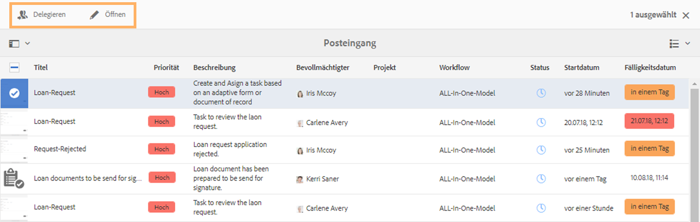
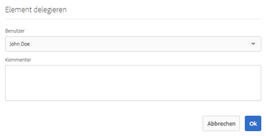
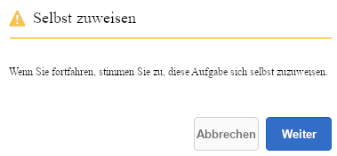
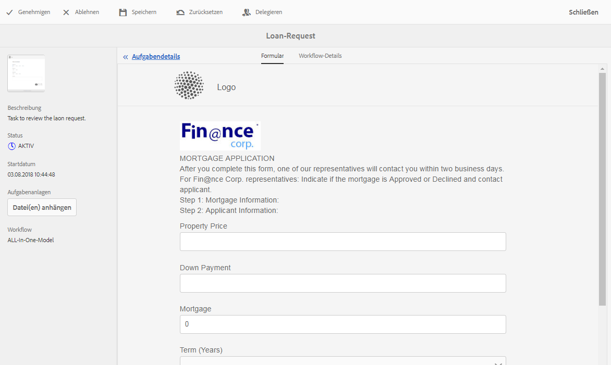
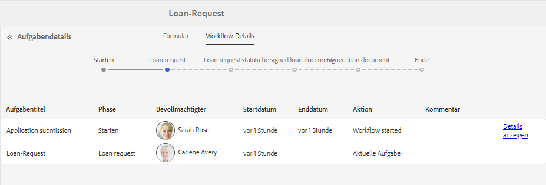
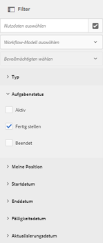
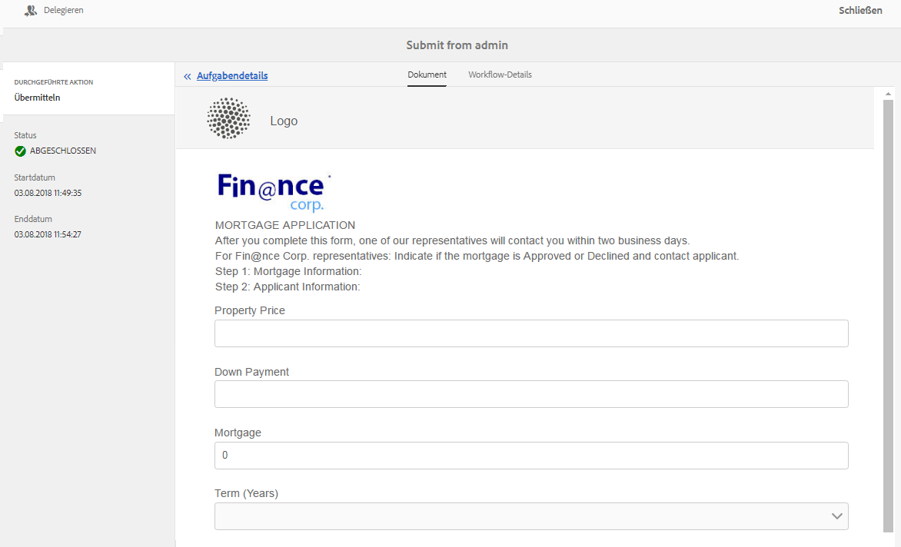
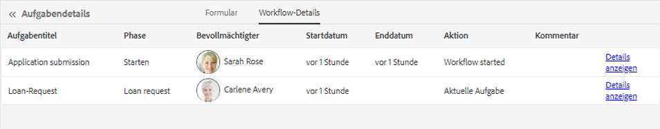

# Verwalten von Formularanwendungen und Aufgaben im AEM-Posteingang {#manage-forms-applications-and-tasks-in-aem-inbox}

Eine der vielen Möglichkeiten, einen Forms-orientierten Workflow zu starten oder auszulösen, besteht darin, Anwendungen im AEM-Posteingang zu verwenden. Sie müssen eine Workflow-Anwendung erstellen, um einen Forms-Workflow als Anwendung im Posteingang verfügbar zu machen. Weitere Informationen zu Workflow-Anwendungen und anderen Möglichkeiten zum Starten von Forms-Workflows finden Sie unter [Starten eines formularzentrierten Workflow auf OSGi](aem-forms-workflow.md#launch).

Darüber hinaus führt der AEM-Posteingang Benachrichtigungen und Aufgaben aus verschiedenen AEM-Komponenten einschließlich Forms-Workflows zusammen. Wenn ein Forms-Workflow ausgelöst wird, der einen Schritt zur Zuweisung einer Aufgabe enthält, wird die dazugehörige Anwendung als Aufgabe im Posteingang der zugewiesenen Person angezeigt. Wenn eine ganze Gruppe zugewiesen ist, wird die Aufgabe im Posteingang aller Gruppenmitglieder angezeigt, bis eine Person die Aufgabe annimmt oder delegiert.

Die Benutzeroberfläche des Posteingangs bietet Listen- und Kalenderansichten zum Anzeigen von Aufgaben. Sie können außerdem die Einstellungen für die Anzeige konfigurieren. Sie können Aufgaben nach verschiedenen Parametern filtern. Weitere Informationen zum Anzeigen und Filtern finden Sie unter [Ihr Posteingang](https://experienceleague.adobe.com/docs/experience-manager-cloud-service/sites/authoring/getting-started/inbox.html?lang=de#inbox-in-the-header).

Kurz zusammengefasst: Mit dem Posteingang können Sie neue Anwendungen erstellen und zugewiesene Aufgaben verwalten.

## Anwendbarkeit und Anwendungsfälle

### Versicherung

## Kann AEM Forms den Status von Versicherungsansprüchen oder -anträgen verfolgen?

Ja. Mit AEM Forms-Workflows können Versicherer den Status der Formularübermittlung und -verarbeitung über verschiedene Phasen des Geschäftsprozesses hinweg verfolgen.

## Unterstützt AEM Forms Audit-Trails für Versicherungsprozesse?

Ja. AEM Forms unterstützt die Auditierbarkeit durch Workflow-Verlauf, Zugriffskontrollen und Systemprotokolle, die Versicherungen bei der Erfüllung interner und externer Prüfungsanforderungen unterstützen.

## Können Kundendienstmitarbeiter Versicherungsformulare im Namen von Kunden einreichen?

Ja. AEM Forms unterstützt das Ausfüllen von Formularen mit Assistenz und Agenten, sodass autorisierte Benutzende Formulare im Namen von Kundinnen und Kunden senden können, während die Prüffähigkeit gewahrt bleibt.

>[!NOTE]
>
>Damit Sie den AEM-Posteingang verwenden können, müssen Sie der Gruppe [!DNL workflow-users] angehören.

## Anwendung erstellen {#create-application}

1. Wechseln Sie zum AEM-Posteingang unter https://&#39;[server]:[port]&#39;/aem/inbox.
1. Wählen Sie in der Benutzeroberfläche des Posteingangs **[!UICONTROL Erstellen > Anwendung]** aus. Die Seite „Programm auswählen“ wird angezeigt.
1. Wählen Sie ein Programm aus und klicken Sie auf **[!UICONTROL Erstellen]**. Das zum Programm gehörige adaptive Formular wird geöffnet. Füllen Sie die Informationen im adaptiven Formular aus und wählen Sie **[!UICONTROL Senden]**. Der dazugehörige Workflow wird gestartet und erstellt eine Aufgabe im Posteingang des Empfängers.

## Aufgaben verwalten {#manage-tasks}

Wenn ein Forms-Workflow ausgelöst wird und Sie eine bevollmächtigte Person sind oder zu einer bevollmächtigten Gruppe gehören, wird eine Aufgabe in Ihrem Posteingang angezeigt. Sie können im Posteingang Aufgabendetails anzeigen und verfügbare Aktionen für die Aufgabe ausführen.

### Aufgaben annehmen oder delegieren {#claim-or-delegate-tasks}

Aufgaben, die einer Gruppe zugewiesen sind, werden im Posteingang aller Gruppenmitglieder angezeigt. Jedes Gruppenmitglied kann diese Aufgabe annehmen oder an ein anderes Gruppenmitglied delegieren. Gehen Sie dazu wie folgt vor:

1. Wählen Sie die Miniaturansicht der Aufgabe aus. Optionen zum Öffnen oder Delegieren der Aufgabe werden oben angezeigt.

   

1. Führen Sie einen der folgenden Schritte aus:

   * Um die Aufgabe zu delegieren, wählen Sie **[!UICONTROL Delegieren]** aus. Das Dialogfeld „Element delegieren“ wird geöffnet. Wählen Sie eine Person aus, fügen Sie optional einen Kommentar hinzu und wählen Sie **[!UICONTROL OK]** aus.

   

   * Um die Aufgabe anzunehmen,wählen Sie **[!UICONTROL Öffnen]** aus. Das Dialogfeld „Selbst zuweisen“ wird geöffnet. Wählen Sie **[!UICONTROL Weiter]** aus, um die Aufgabe anzunehmen. Die angenommene Aufgabe wird mit Ihnen als bevollmächtigte Person in Ihrem Posteingang angezeigt.

   

### Aufgabendetails anzeigen und Aktionen für Aufgaben durchführen {#view-details-and-perform-actions-on-tasks}

Wenn Sie eine Aufgabe öffnen, können Sie Aufgabendetails anzeigen und verfügbare Aktionen ausführen. Die für eine Aufgabe verfügbaren Aktionen werden im Schritt der Aufgabenzuweisung des dazugehörigen Forms-Workflows definiert.

1. Wählen Sie die Miniaturansicht der Aufgabe, um sie auszuwählen. Die Optionen zum Öffnen oder Delegieren der ausgewählten Aufgabe werden oben angezeigt.
1. Wählen Sie **Öffnen**, um Aufgabendetails und verfügbare Aktionen anzuzeigen. Die detaillierte Aufgabenansicht wird geöffnet. In dieser Ansicht können Sie Aufgabendetails anzeigen und an der Aufgabe arbeiten.

   >[!NOTE]
   >
   >Wenn eine Aufgabe einer Gruppe zugewiesen ist, müssen Sie sie erst annehmen, um sie in der Detailansicht öffnen zu können.



Die detaillierte Aufgabenansicht umfasst die folgenden Abschnitte:

* Aufgabendetails
* Formular
* Workflow-Details
* Aktionssymbolleiste

#### Aufgabendetails {#task-details}

Der Abschnitt „Aufgabendetails“ zeigt Informationen zur Aufgabe an. Welche Informationen angezeigt werden, hängt von den Konfigurationseinstellungen aus dem Schritt [Aufgabe zuweisen](https://experienceleague.adobe.com/docs/experience-manager-65/developing/extending-aem/extending-workflows/workflows-step-ref.html?lang=de#extending-aem) im Workflow ab. Das Beispiel oben zeigt die Beschreibung, den Status, das Startdatum und den verwendeten Workflow für die Aufgabe an. Es ist außerdem möglich, Dateien an Aufgaben anzuhängen.

#### Formular {#form}

Auf der Registerkarte „Formular“ im Hauptinhaltsbereich werden das übermittelte Formular und gegebenenfalls Anhänge für einzelne Felder angezeigt.

#### Workflow-Details {#workflow-details}

Die Registerkarte „Workflow-Details“ oben zeigt den Fortschritt der Aufgabe in verschiedenen Phasen des Workflows an. Es werden die abgeschlossenen, aktuellen und ausstehenden Phasen der Aufgabe angezeigt. Die Phasen für einen Workflow werden im Schritt [Aufgabe zuweisen](https://experienceleague.adobe.com/docs/experience-manager-65/developing/extending-aem/extending-workflows/workflows-step-ref.html?lang=de#extending-aem) des dazugehörigen Workflows definiert.

Darüber hinaus zeigt die Registerkarte den Aufgabenverlauf für jede abgeschlossene Phase im Workflow an. Sie können für eine abgeschlossene Phase **[!UICONTROL Details anzeigen]** auswählen, um Details zu dieser Phase zu erfahren. Es werden Kommentare, Formular- und Aufgabenanhänge, Status, Start- und Enddaten usw. zu der Aufgabe angezeigt.



#### Aktionssymbolleiste {#actions-toolbar}

In der Aktionssymbolleiste werden alle verfügbaren Optionen für die Aufgabe angezeigt. Speichern, Zurücksetzen und Delegieren sind Standardaktionen, andere verfügbare Aktionen werden dagegen im Schritt [Aufgabe zuweisen](https://experienceleague.adobe.com/docs/experience-manager-65/developing/extending-aem/extending-workflows/workflows-step-ref.html?lang=de#extending-aem) konfiguriert. Im obigen Beispiel sind „Genehmigen“ und „Ablehnen“ im Workflow konfiguriert.

Während Sie an der Aufgabe arbeiten, schreitet sie im Workflow weiter voran.

### Anzeigen der abgeschlossenen Aufgaben {#view-completed-tasks}

Im AEM-Posteingang werden nur aktive Aufgaben angezeigt. Abgeschlossene Aufgaben werden nicht in der Liste angezeigt. Sie können jedoch mithilfe von Posteingangsfiltern Aufgaben basierend auf verschiedenen Parametern filtern, z. B. Aufgabentyp, Status oder Start- und Enddatum. So zeigen Sie abgeschlossene Aufgaben an:

1. Wählen Sie im AEM-Posteingang , um die Filterauswahl zu öffnen.
1. Wählen Sie das Akkordeon **[!UICONTROL Aufgabenstatus]** und wählen Sie dann **[!UICONTROL Abgeschlossen]** aus. Alle Ihre abgeschlossenen Aufgaben werden angezeigt.

   

1. Wählen Sie eine Aufgabe aus und klicken Sie auf **[!UICONTROL Öffnen]**.

Die Aufgabe wird geöffnet, und das dazugehörige Dokument oder adaptive Formular wird angezeigt. Bei einem adaptiven Formular wird das schreibgeschützte adaptive Formular oder dessen PDF-Datensatzdokument wie auf der Registerkarte „Formular“/„Dokument“ des Workflow-Schritts [Aufgabe zuweisen](https://experienceleague.adobe.com/docs/experience-manager-65/developing/extending-aem/extending-workflows/workflows-step-ref.html?lang=de#extending-aem) konfiguriert angezeigt.

Im Abschnitt mit den Aufgabendetails werden Informationen wie die durchgeführte Aktion, der Aufgabenstatus, das Startdatum und das Enddatum angezeigt.



Auf der Registerkarte **[!UICONTROL Workflow-Details]** werden alle Schritte des Workflows angezeigt. Wählen Sie für detaillierte Informationen zu einem Schritt **[!UICONTROL Details anzeigen]** aus.



## Fehlerbehebung {#troubleshooting-workflows}

### Elemente eines AEM-Workflows werden im AEM-Posteingang nicht angezeigt {#unable-to-see-aem-worklow-items}

Die Eigentümerin bzw. der Eigentümer eines Workflow-Modells ist nicht in der Lage, die Elemente eines AEM-Workflows im AEM-Posteingang anzusehen. Um das Problem zu beheben, fügen Sie die unten aufgeführten Indizes zu Ihrem AEM-Repository hinzu und erstellen Sie den Index neu.

1. Verwenden Sie eine der folgenden Methoden, um Indizes hinzuzufügen:

   * Erstellen Sie die folgenden Knoten in CRX DE bei `/oak:index/workflowDataLucene/indexRules/granite:InboxItem/properties` mit den entsprechenden Eigenschaften, die in folgender Tabelle angegeben sind:

     | Knoten | Eigenschaft | Typ |
     |---|---|---|
     | sharedWith | sharedWith | ZEICHENFOLGE |
     | locked | locked | BOOLESCH |
     | returned | returned | BOOLESCH |
     | allowInboxSharing | allowInboxSharing | BOOLESCH |
     | allowExplicitSharing | allowExplicitSharing | BOOLESCH |


   * Stellen Sie die Indizes über ein AEM-Paket bereit. Sie können ein bereitstellbares AEM-Paket mithilfe eines [AEM Archetype](https://experienceleague.adobe.com/docs/experience-manager-core-components/using/developing/archetype/overview.html?lang=de)-Projekts erstellen. Verwenden Sie den folgenden Beispiel-Code, um einem AEM-Archetyp-Projekt Indizes hinzuzufügen:

   ```Java
      .property("sharedWith", "sharedWith").type(TYPENAME_STRING).propertyIndex()
      .property("locked", "locked").type(TYPENAME_BOOLEAN).propertyIndex()
      .property("returned", "returned").type(TYPENAME_BOOLEAN).propertyIndex()
      .property("allowInboxSharing", "allowInboxSharing").type(TYPENAME_BOOLEAN).propertyIndex()
      .property("allowExplicitSharing", "allowExplicitSharing").type(TYPENAME_BOOLEAN).propertyIndex()
   ```

1. [Erstellen Sie einen Eigenschaftsindex und weisen Sie ihm „true“ zu](https://experienceleague.adobe.com/docs/experience-manager-65/deploying/deploying/queries-and-indexing.html?lang=de#the-property-index).

1. Nachdem Sie in CRX DE Indizes konfiguriert oder über ein Paket bereitgestellt haben, indizieren Sie das Repository erneut.
