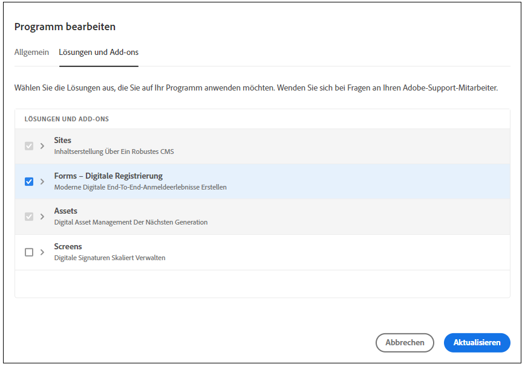

# Migrieren von [!DNL AEM Forms] (On-Premise- und AMS-Umgebungen) in [!DNL AEM Forms] as a Cloud Service  {#Harden-your-AEM-Forms-as-a-Cloud-Service-environment}

| Version | Artikel-Link |
| -------- | ---------------------------- |
| AEM 6.5 | [Hier klicken](https://experienceleague.adobe.com/docs/experience-manager-65/forms/upgrade-aem-forms/upgrade.html?lang=de) |
| AEM as a Cloud Service | Dieser Artikel |

Sie können Ihre adaptiven Formulare, Designs, Vorlagen und Cloud-Konfigurationen aus <!-- AEM 6.3 Forms AEM 6.4 Forms on OSGi and --> AEM 6.5 Forms unter OSGi zu [!DNL AEM] as a Cloud Service migrieren. Bevor Sie diese Assets migrieren, verwenden Sie das Migrationsdienstprogramm, um das in früheren Versionen verwendete Format in das Format zu konvertieren, das in [!DNL AEM] as a Cloud Service verwendet wird.
Beginnen wir die Migration zu AEM as a Cloud Service | Adobe Experience Manager.  Wenn Sie das Migrationsdienstprogramm ausführen, werden die folgenden Assets aktualisiert:

* Benutzerdefinierte Komponenten für adaptive Formulare
* Adaptive Formularvorlagen und -Designs
* Cloud-Konfigurationen
* Code-Editor-Skripte werden in wiederverwendbare Funktionen konvertiert und auf visuelle Regeln angewendet.

## Überlegungen zur Migration zu Forms as a Cloud Service {#consideration}

Für die Migration von AEM 6.5 Forms zu AEM Cloud Service müssen folgende Punkte berücksichtigt werden:

* Der Service hilft nur beim Migrieren von Inhalten aus [!DNL AEM Forms] in OSGi-Umgebungen. Das Migrieren von Inhalten aus [!DNL AEM Forms] auf JEE in eine Cloud Service-Umgebung wird nicht unterstützt.

* (Nur für Versionen vor AEM 6.5 Forms) Adaptive Formulare, die auf in AEM 6.3 Forms oder einer früheren Version verfügbaren mitgelieferten Vorlagen und Designs basieren, werden in [!DNL AEM Forms] as a Cloud Service nicht unterstützt.

* Einige Funktionen in Adobe Experience Manager Forms as a Cloud Service unterscheiden sich beträchtlich gegenüber den vorhandenen Funktionen in Umgebungen mit Adobe Experience Manager 6.5 Forms (On-Premise und Adobe-Managed Service). Bevor Sie mit der Migration auf den Dienst fortfahren, [informieren Sie sich über diese Veränderungen](notable-changes.md) und [Funktionsunterschiede](https://experienceleague.adobe.com/docs/experience-manager-cloud-service/content/migration-journey/cloud-migration/best-practices-analyzer/using-best-practices-analyzer.html?lang=de#viewing-report), um die Entscheidung zur Migration auf der Grundlage der von Ihrem Unternehmen benötigten Funktionen zu treffen.

<!-- 
## Difference with AEM 6.5 Forms 

| Feature         | Difference with AEM 6.5 Forms    |
|--------------|-----------|
| HTML5 Forms (Mobile Forms)     | The service does not support HTML5 Forms (Mobile Forms). If you render your XDP-based forms as HTML5 Forms, you can continue using the feature on AEM 6.5 Forms. |
| Adaptive Forms     | <li><b>XSD-Based Adaptive Forms:</b> The service does not support HTML5 Forms (Mobile Forms). If you render your XDP-based forms as HTML5 Forms, you can continue using the feature on AEM 6.5 Forms. </li> <li><b> Adaptive Form templates:</b> Use build pipeline and corresponding Git repository of your program to import existing Adaptive Form templates. </li><li><b>Rule editor:</b> AEM Forms as a Cloud Service provides a hardened [Rule editor](rule-editor.md#visual-rule-editor). The code editor is not available on Forms as a Cloud Service. The migration utility helps you migrate your forms that have custom rules (created in code editor). The utility converts such rules into custom functions supported on Forms as a Cloud Service. You can use the reusable functions with Rule editor to continue obtaining results obtained with rule scripts  The `onSubmitError` or `onSubmitSuccess` functions are now available as actions the Rule Editor. </li> <li><b>Drafts and submissions:</b> The service does not retain metadata for drafts and submitted Adaptive Forms. </li> <li><b> Prefill Service:</b> By default, the prefill service merges data with an Adaptive Form at client as opposed to merging data on Server in AEM 6.5 Forms. The feature helps improve the time required to prefill an Adaptive Form. You can always configure to run the merge action on the Adobe Experience Manager Forms Server. </li><li><b>Submit actions:</b> The **Email as PDF** action is not available. The **Email** submit action provide options to send attachments and attach Document of Record (DoR) with email. </li>|
| Form Data Model | <li>Forms data model supports only HTTP and HTTPs endpoints to submit data. </li><li>Forms as a Cloud Service allows to use Microsoft Azure Blob, Microsoft Sharepoint, Microsoft OneDrive, and services supporting general CRUD (Create, Read, Update, and Delete) operations as data stores. The service does not support JDBC connector, Mutual SSL for Rest connector, and x509 certificate-based authentication for SOAP data sources. </li>|
| Automated Forms Conversion Service     | The service does not provide meta-model for Automated Forms Conversion Service. You can [download it from Automated Forms Conversion Service documentation](https://experienceleague.adobe.com/docs/aem-forms-automated-conversion-service/using/extending-the-default-meta-model.html?lang=en#default-meta-model).|
|Configurations|<li>Email support only HTTP and HTTPs protocols, by default. [Contact the support team](https://experienceleague.adobe.com/docs/experience-manager-cloud-service/implementing/developing/development-guidelines.html#sending-email) to enable ports for sending emails and to enable SMTP protocol for your environment. </li> <li>If you use custom bundles, recompile your code with latest version of adobe-aemfd-docmanager before using these bundles with Forms as a Cloud Service.</li> |
| Document Manipulation APIs (Assembler Service)| The service does not support operations dependent on other services or applications: <li>Conversion of documents in a non-PDF format to a PDF format is not supported. For example, Microsoft Word to PDF, Microsoft Excel to PDF, and HTML to PDF are not supported</li><li>Adobe Distiller-based conversions are not supported. For example, PostScript(PS) to PDF</li><li>Forms Service-based conversions are not supported. For example, XDP to PDF Forms.</li><li>The service does not support converting a Signed PDF or Transparent PDF to another PDF format.</li>| -->

## Voraussetzungen {#prerequisites}

Um einen reibungslosen Übergang von AEM Forms 6.5 zur AEM as a Cloud Service-Umgebung sicherzustellen, müssen folgende Voraussetzungen berücksichtigt werden:

* Aktivieren Sie die Option [Forms – Digitale Registrierung](https://experienceleague.adobe.com/docs/experience-manager-cloud-manager/using/getting-started/setting-up-program.html?lang=de#editing-program) für Ihr Forms Cloud Service-Programm und [führen Sie die Pipeline aus](https://experienceleague.adobe.com/docs/experience-manager-cloud-manager/using/how-to-use/deploying-code.html?lang=de).

  

* In einer Cloud Service-Umgebung arbeitet das Migrationsdienstprogramm mit dem Content Transfer Tool zusammen. Das Migrationsdienstprogramm macht [!DNL AEM Forms]-Assets mit Cloud Service kompatibel und das Content Transfer Tool migriert den Inhalt aus Ihrer [!DNL AEM Forms]-Umgebung in eine [!DNL AEM] as a Cloud Service-Umgebung. Bevor Sie das Migrationsdienstprogramm verwenden, machen Sie sich damit vertraut, wie der [Umstieg auf AEM as a Cloud Service](https://experienceleague.adobe.com/docs/experience-manager-cloud-service/moving/home.html?lang=de) funktioniert. Der Prozess verwendet das folgende Tool:
   * [Content Transfer Tool](https://experienceleague.adobe.com/docs/experience-manager-cloud-service/moving/cloud-migration/content-transfer-tool/overview-content-transfer-tool.html?lang=de#cloud-migration): Mit dem Content Transfer Tool können Sie Inhalte aus Ihrer vorhandenen Umgebung vorbereiten und in eine Cloud Service-Umgebung übertragen. Dies erleichtert Benutzerinnen und Benutzern das einfache Upgrade von AEM Forms auf die Cloud-Umgebung.
* Konten mit Administratorrechten in [!DNL AEM Forms] as a Cloud Service und Ihrer lokalen [!DNL AEM Forms]-Umgebung.
* Laden Sie den Best Practice Analyzer, das Content Transfer Tool und das [!DNL AEM Forms] Migration Utility ([) herunter und installieren Sie ](https://experience.adobe.com/#/downloads/content/software-distribution/de/aemcloud.html).

* Führen Sie das Tool [Best Practices Analyzer](https://experienceleague.adobe.com/docs/experience-manager-cloud-service/moving/cloud-migration/best-practices-analyzer/overview-best-practices-analyzer.html?lang=de#cloud-migration) aus und beheben Sie die gemeldeten Probleme. Die möglichen Probleme bei der Migration von Adobe Experience Manager Forms zu Adobe Experience Manager Forms as a Cloud Service finden Sie unter [AEM-Mustererkennung für Forms as a Cloud Service](https://experienceleague.adobe.com/docs/experience-manager-cloud-service/content/migration-journey/cloud-migration/best-practices-analyzer/using-best-practices-analyzer.html?lang=de#viewing-report).

<!-- * Download the latest [compatibility package](https://experienceleague.adobe.com/docs/experience-manager-release-information/aem-release-updates/forms-updates/aem-forms-releases.html?lang=en#aem-65-forms-releases) for your [!DNL AEM Forms] version. -->

## Migrieren von [!DNL AEM 6.5 Forms]-Assets zum AEM Cloud Service {#use-the-migration-utility}

Führen Sie die folgenden Schritte aus, um Ihre [!DNL AEM Forms]-Assets mit Cloud Service kompatibel zu machen und sie in eine [!DNL AEM] as a Cloud Service-Umgebung zu übertragen.

1. Erstellen Sie einen [Klon](https://experienceleaguecommunities.adobe.com/t5/adobe-experience-manager/correct-method-to-clone-the-aem-environment/qaq-p/363487) Ihrer bestehenden [!DNL AEM Forms]-Umgebung.

   >[!NOTE]
   >
   > Wenn Sie von 6.5 zum Cloud-Service migrieren, wird empfohlen, eine geklonte Umgebung zum Ausführen des Content Transfer Tool und des Migrationsdienstprogramms zu verwenden. Das Content Transfer Tool und das Migrationsdienstprogramm nehmen einige Änderungen am Inhalt und an den Assets vor. Daher sollten Sie das Content Transfer Tool oder das Migrationsdienstprogramm nicht in einer Produktionsumgebung ausführen.

1. Melden Sie sich mit Administratorrechten bei Ihrer geklonten Umgebung an.

1. Laden Sie das [Content Transfer Tool](https://experienceleague.adobe.com/docs/experience-manager-cloud-service/moving/cloud-migration/content-transfer-tool/overview-content-transfer-tool.html?lang=de#cloud-migration) und das [!DNL AEM Forms] as a Cloud Service-Migrationsdienstprogramm aus dem [Software Distribution Portal](https://experience.adobe.com/#/downloads/content/software-distribution/de/aemcloud.html) in die geklonte Umgebung herunter und installieren Sie die Tools. Sie können AEM Package Manager verwenden, um das Tool und das Dienstprogramm zu installieren.

1. Navigieren Sie zu **[!UICONTROL Tools]** > **[!UICONTROL Vorgänge]** > **[!UICONTROL Inhaltsmigration]**.

1. Öffnen Sie die Karte **[!UICONTROL Forms für Migration vorbereiten]**. Der Browser zeigt fünf Optionen an:
   * **[!UICONTROL AEM Forms-Assets-Migration]**
   * **[!UICONTROL Migration von benutzerdefinierten adaptiven Formularkomponenten]**
   * **[!UICONTROL Migration von adaptiven Formularvorlagen]**
   * **[!UICONTROL Migration von AEM Forms-Cloud-Konfigurationen]**
   * **[!UICONTROL Migration von Code-Editor-Skript]**

1. Verwenden Sie die Optionen nacheinander, um Ihre [!DNL AEM Forms]-Assets mit [!DNL AEM] as a Cloud Service kompatibel zu machen:

   1. Wählen Sie **[!UICONTROL AEM Forms-Assets-Migration]** und im nächsten Bildschirm die Option **[!UICONTROL Migration beginnen]** aus. Dadurch werden adaptive Formulare und Designs in Ihrer [!DNL AEM Forms]-Umgebung mit [!DNL AEM] as a Cloud Service kompatibel gemacht.

   1. Wählen Sie **[!UICONTROL Migration benutzerdefinierter Komponenten für adaptive Formulare]** und auf der Seite „Migration von benutzerdefinierten Komponenten“ die Option **[!UICONTROL Migration beginnen]** aus. Dadurch werden alle benutzerdefinierten Komponenten, die für adaptive Formulare und Komponentenüberlagerungen in Ihrer [!DNL AEM Forms]-Umgebung entwickelt wurden, mit [!DNL AEM] as a Cloud Service kompatibel gemacht.

   1. Wählen Sie **[!UICONTROL Migration von Vorlagen für adaptive Formulare]** und auf der Seite „Migration von benutzerdefinierten Komponenten“ die Option **[!UICONTROL Migration beginnen]** aus. Dadurch werden Vorlagen für adaptive Formulare unter `/apps` oder `/conf`, die mit dem AEM-Vorlageneditor erstellt wurden, mit [!DNL AEM] as a Cloud Service kompatibel gemacht.

   1. Wählen Sie **[!UICONTROL Migration von AEM Forms Cloud-Konfigurationen]** und auf der Seite „Migration von Konfigurationen“ die Option **[!UICONTROL Migration beginnen]** aus. Dadurch werden die folgenden Cloud Services aktualisiert und an einen neuen Speicherort verschoben:

      * Form Data Model Cloud Service (Cloud Service für Formulardatenmodell)
      * Google reCAPTCHA Cloud Service
      * [!DNL Adobe Sign] Cloud Service
      * Adobe Fonts Cloud Service (Cloud Service für Adobe Fonts)

   1. Wählen Sie **[!UICONTROL Migration von Code-Editor-Skripten]** aus, geben Sie einen Speicherort für wiederverwendbare Funktionen an und wählen Sie [!UICONTROL Migration beginnen] aus.

   Der Cloud Service unterstützt keine Regeleditorskripte. Das Tool für die **[!UICONTROL Migration von Code-Editor-Skripten]** konvertiert alle Regelskripte in Ihrer Umgebung in wiederverwendbare Funktionen und wendet die wiederverwendbaren Funktionen auf den entsprechenden Speicherort im Visual Editor an. Diese wiederverwendbaren Funktionen werden in Form von Client-Bibliotheken gespeichert und helfen Ihnen dabei, die vorhandenen Funktionen zu erhalten. Das Tool wendet die generierten wiederverwendbaren Funktionen automatisch auf entsprechende adaptive Formulare an.

   AEM Forms-Migration zu Cloud Service: Verwenden Sie [Package Manager](https://experienceleague.adobe.com/docs/experience-manager-65/administering/contentmanagement/package-manager.html?lang=de#contentmanagement), um die wiederverwendbaren Funktionen (Client-Bibliotheken) in ein Paket zu exportieren.

1. [Stellen Sie](https://experienceleague.adobe.com/docs/experience-manager-cloud-service/implementing/deploying/overview.html?lang=de#deploying-content-packages-via-cloud-manager-and-package-manager) das Paket mit den wiederverwendbare Funktionen (Client-Bibliotheken), [benutzerspezifischen Code, Komponenten, Konfigurationen](https://experienceleague.adobe.com/docs/experience-manager-learn/cloud-service/cloud-manager/devops/deploy-code.html?lang=de#cloud-manager) und benutzerdefinierte gebietsschemaspezifische Bibliotheken in Ihrer [!DNL AEM] as a Cloud Service-Umgebung bereit.

   <!-- 1. Install the latest [Compatibility Package](https://experienceleague.adobe.com/docs/experience-manager-cloud-service/moving/cloud-migration/content-transfer-tool/overview-content-transfer-tool.html?#cloud-migration) to your cloned [!DNL AEM Forms] environment. -->

1. Führen Sie das [Content Transfer Tool](https://experienceleague.adobe.com/docs/experience-manager-cloud-service/moving/cloud-migration/content-transfer-tool/overview-content-transfer-tool.html?lang=de#cloud-migration) aus. Geben Sie beim Festlegen von Parametern im Bildschirm **[!UICONTROL Migrationssatz erstellen]** den Pfad von adaptiven Formularen, Designs, Vorlagen, Formulardatenmodellen (FDM), Cloud-Services, benutzerdefinierten Komponenten und anderen AEM Forms-spezifischen Elementen in der Option **[!UICONTROL Einzuschließende Pfade]** an. Dadurch werden die angegebenen [!DNL AEM Forms]-Assets zum Migrationssatz hinzugefügt.

## Pfade verschiedener AEM Forms-spezifischer Assets

Wenn Sie von AEM Forms 6.5 zu Cloud Service migrieren, können Sie die AEM Forms-spezifischen Assets unter folgendem Pfad finden:

* **Adaptive Formulare**: Adaptive Formulare finden Sie unter `/content/dam/formsanddocuments/` und `/content/forms/af`. Beispiel: Für ein adaptives Formular mit dem Titel „WKND-Registrierung“ fügen Sie die Pfade `/content/dam/formsanddocuments/wknd-registration` und `/content/forms/af/wknd-registration` hinzu.
* **Formulardatenmodell**: Alle Formulardatenmodelle (FDM) finden Sie unter `/content/dam/formsanddocuments-fdm`. Beispiel: `/content/dam/formsanddocuments-fdm/ms-dynamics-fdm`.

* **Client-Bibliotheken**: Der Standardpfad von Client-Bibliotheken lautet `/etc/clientlibs/fd/theme`.

* **Adaptive Formularvorlagen**: Der Standardpfad von Vorlagen lautet `/conf/<template folder>`. Beispiel: Für eine Vorlage mit dem Titel „Basic“ fügen Sie den Pfad `/conf/ReferenceEditableTemplates/settings/wcm/templates/basic` hinzu.

* **Designs für adaptive Formulare und Client-Bibliotheken**: Der Standardpfad von Designs lautet ` /content/dam/formsanddocuments-themes/`, und der Standardpfad von Client-Bibliotheken ist `/etc/clientlibs/fd/theme`. Beispiel: Für eine Vorlage mit dem Titel „WKND-Design“ fügen Sie den Pfad ` /content/dam/formsanddocuments-themes/wkndtheme` und die Client-Bibliotheken für das Design unter `/etc/clientlibs/reference-themes/wkndtheme-3-0` hinzu. Sie können Designs und Client-Bibliotheken auch an anderen benutzerdefinierten Pfaden speichern.

* **Cloud-Konfigurationen**: Sie finden die Cloud-Konfigurationen unter `/conf/`. Die Cloud-Konfiguration für das Formulardatenmodell (FDM) befindet sich beispielsweise unter `/conf/global/settings/cloudconfigs/fdm`.

* **Workflow-Modell**: AEM Workflow-Modelle finden Sie unter `/conf/global/settings/workflow/models/`. Beispiel: Für ein Workflow-Modell mit dem Titel „WKND-Registrierung“ fügen Sie den Pfad `/conf/global/settings/workflow/models/wknd-registration` hinzu.

Sie können die unten aufgeführten Ordnerpfade der obersten Ebene oder bestimmte Ordnerpfade wie unten beschrieben hinzufügen. Sie können ein bestimmtes Asset oder alle Assets und Formulare gleichzeitig migrieren, wenn Sie von AEM Forms 6.5 auf Cloud Service aktualisieren.

* `/content/dam/formsanddocuments-fdm`
* `/content/dam/formsanddocuments/themes`
* `/content/forms/af`
* `/etc/clientlibs/fd/theme`

Wenn Sie AEM-Workflow-Modelle von AEM Forms 6.5 zu Cloud Service migrieren, geben Sie die folgenden Pfade an:

* `/conf/global/settings/workflow/models/`
* `/conf/global/settings/workflow/launcher`
* `/var/workflow/models`

## Siehe nächste Punkte

* [Wesentliche Änderungen für bestehende Benutzerinnen und Benutzer von Adobe Experience Manager 6.5 Forms](https://experienceleague.adobe.com/docs/experience-manager-cloud-service/content/forms/forms-overview/notable-changes.html?lang=de)
* [Einstieg in AEM Forms as a Cloud Service](https://experienceleague.adobe.com/docs/experience-manager-cloud-service/content/forms/setup-configure-migrate/setup-forms-cloud-service.html?lang=de)
* [Erstellen Ihres ersten adaptiven Formulars auf dem Cloud Service](https://experienceleague.adobe.com/docs/experience-manager-cloud-service/content/forms/adaptive-forms-authoring/authoring-adaptive-forms-foundation-components/create-an-adaptive-form-on-forms-cs/creating-adaptive-form.html?lang=de)

## Zusätzliche Informationen

Das Migrationsdienstprogramm hilft Ihnen bei der Migration von adaptiven Formularen basierend auf Foundation-Komponenten. Darüber hinaus unterstützt Forms as a Cloud Service Kernkomponenten für adaptive Formulare. Damit können Sie:

* [Auf Kernkomponenten basierende, eigenständige adaptive Formulare erstellen](/help/forms/creating-adaptive-form-core-components.md)
* [auf Kernkomponenten basierende adaptive Formulare direkt auf einer AEM Sites-Seite erstellen](/help/forms/create-or-add-an-adaptive-form-to-aem-sites-page.md)

Weitere Informationen zu AEM Forms as a Cloud Service finden Sie unter:

* [Einführung in AEM Forms Cloud Service](/help/forms/home.md)
* [Innovationen in AEM Forms Cloud Service](/help/forms/latest-innovations.md)