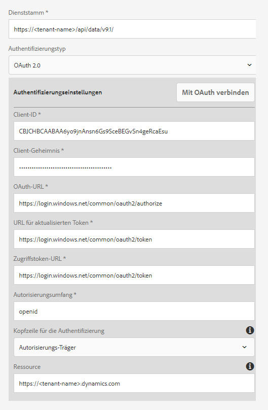
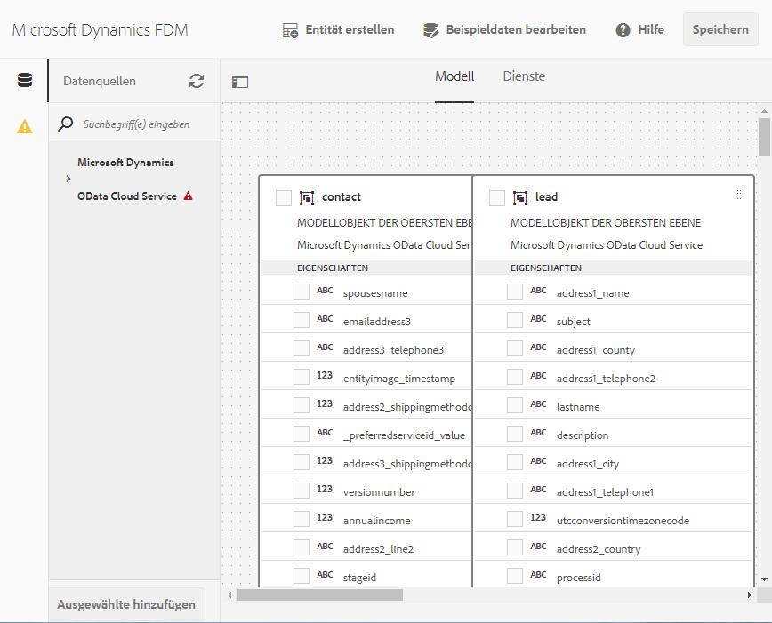

# [!DNL Microsoft Dynamics] OData-Konfiguration {#microsoft-dynamics-odata-configuration}

| Version | Artikel-Link |
| -------- | ---------------------------- |
| AEM 6.5 | [Hier klicken](https://experienceleague.adobe.com/docs/experience-manager-65/forms/form-data-model/ms-dynamics-odata-configuration.html?lang=de) |
| AEM as a Cloud Service | Dieser Artikel |


[!DNL Microsoft Dynamics] ist eine CRM (Customer Relationship Management)- und ERP (Enterprise Resource Planning)-Software, die Unternehmenslösungen für das Erstellen und Verwalten von Kundenkonten, Kontakten, Leads, Chancen und Fällen bereitstellt. [[!DNL Experience Manager Forms] Datenintegration](data-integration.md) bietet eine OData-Cloud Service-Konfiguration für die Integration von Forms mit online und lokal installierten [!DNL Microsoft Dynamics]-Servern. Dies ermöglicht Ihnen das Erstellen von Formulardatenmodellen (FDM) basierend auf den im [!DNL Microsoft Dynamics]-Dienst definierten Entitäten, Attributen und Diensten. Das Formulardatenmodell (FDM) kann verwendet werden, um adaptive Formulare zu erstellen, die mit dem [!DNL Microsoft Dynamics]-Server interagieren, um Unternehmens-Workflows zu ermöglichen. Zum Beispiel:

* Abfragen eines [!DNL Microsoft Dynamics]-Servers nach Daten und Auffüllen adaptiver Formulare
* Schreiben von Daten in [!DNL Microsoft Dynamics] bei Übermittlung von adaptiven Formularen
* Schreiben von Daten in [!DNL Microsoft Dynamics] durch benutzerdefinierte Entitäten, die im Formulardatenmodell (FDM) definiert sind, und umgekehrt.

<!--[!DNL Experience Manager Forms] add-on package also includes reference OData configuration that you can use to quickly integrate [!DNL Microsoft Dynamics] with [!DNL Experience Manager Forms].-->

<!--When the package is installed, the following entities and services are available on your [!DNL Experience Manager Forms] instance:

* MS Dynamics OData Cloud Service (OData Service)-->
<!--* Form Data Model with preconfigured [!DNL Microsoft Dynamics] entities and services.-->

<!-- Preconfigured [!DNL Microsoft Dynamics] entities and services in a Form Data Model are available on your [!DNL Experience Manager Forms] instance only if the run mode for the [!DNL Experience Manager] instance is set as `samplecontent` (default). -->  MS Dynamics OData Cloud Service (OData Service) ist für alle Ausführungsmodi verfügbar. Weitere Informationen zum Konfigurieren der Ausführungsmodi für eine [!DNL Experience Manager]-Instanz finden Sie unter [Ausführungsmodi](https://experienceleague.adobe.com/docs/experience-manager-cloud-service/implementing/deploying/overview.html?lang=de#runmodes).

AEM as a Cloud Service bietet verschiedene vordefinierte Übermittlungsaktionen für die Verarbeitung von Formularübermittlungen. Mehr über diese Optionen erfahren Sie in dem Artikel [Übermittlungsaktion für adaptive Formulare](/help/forms/configure-submit-actions-core-components.md).


## Voraussetzungen {#prerequisites}

Bevor Sie mit dem Einrichten und Konfigurieren von [!DNL Microsoft Dynamics] beginnen, stellen Sie sicher, dass die folgenden Punkte erfüllt sind:

<!--* Installed the [[!DNL Experience Manager Forms] add-on package](installing-configuring-aem-forms-osgi.md) -->
* Sie haben [!DNL Microsoft Dynamics] 365 online konfiguriert oder eine Instanz einer der folgenden [!DNL Microsoft Dynamics]-Versionen installiert:

   * [!DNL Microsoft Dynamics] 365 On-Premises
   * [!DNL Microsoft Dynamics] 2016 On-Premises

* [Das Programm wurde für den [!DNL Microsoft Dynamics] -Online-Service mit [!DNL Microsoft Azure] Active Directory](https://docs.microsoft.com/de-de/dynamics365/customer-engagement/developer/walkthrough-register-dynamics-365-app-azure-active-directory) registriert. Notieren Sie sich die Werte für die Client-ID (die auch als Anwendungs-ID bezeichnet wird) und den geheimen Clientschlüssel für den registrierten Service. Diese Werte werden beim [Konfigurieren des Cloud Service für Ihren  [!DNL Microsoft Dynamics] -Service](#configure-cloud-service-for-your-microsoft-dynamics-service) verwendet.

## Festlegen einer Antwort-URL für ein registriertes [!DNL Microsoft Dynamics]-Programm {#set-reply-url-for-registered-microsoft-dynamics-application}

Gehen Sie folgendermaßen vor, um die Antwort-URL für eine registrierte [!DNL Microsoft Dynamics]-Anwendung festzulegen:

>[!NOTE]
>
>Verwenden Sie dieses Verfahren nur bei der Integration von [!DNL Experience Manager Forms] mit einem [!DNL Microsoft Dynamics]-Online-Server.

1. Wechseln Sie zum Active Directory-Konto von [!DNL Microsoft Azure] und fügen Sie in den Einstellungen für **[!UICONTROL Antwort-URLs]** für Ihre registrierte Anwendung die folgende Cloud-Service-Konfigurations-URL hinzu:

   `https://[server]:[port]/libs/fd/fdm/gui/components/admin/fdmcloudservice/createcloudconfigwizard/cloudservices.html`

   

1. Speichern Sie die Konfiguration.

## Konfigurieren von [!DNL Microsoft Dynamics] für IFD {#configure-microsoft-dynamics-for-ifd}

[!DNL Microsoft Dynamics] verwendet anspruchsbasierte Authentifizierung, um externen Benutzern Zugriff auf Daten auf dem [!DNL Microsoft Dynamics]-CRM-Server zu ermöglichen. Führen Sie die folgenden Schritte aus, um [!DNL Microsoft Dynamics] für Bereitstellung mit Internetzugriff (Internet-Facing Deployment, IFD) zu konfigurieren und um Anspruchseinstellungen zu konfigurieren.

>[!NOTE]
>
> Verwenden Sie dieses Verfahren nur bei der Integration von [!DNL Experience Manager Forms] mit einem lokal installierten [!DNL Microsoft Dynamics]-Server.

1. Konfigurieren Sie die lokale [!DNL Microsoft Dynamics]-On-Premises-Instanz für IFD, wie in [Konfigurieren von IFD für  [!DNL Microsoft Dynamics]](https://technet.microsoft.com/de-de/library/dn609803.aspx) beschrieben.
1. Führen Sie die folgenden Befehle mit Windows PowerShell aus, um die Anspruchseinstellungen für IFD-aktiviertes [!DNL Microsoft Dynamics] zu konfigurieren:

   ```shell
   Add-PSSnapin Microsoft.Crm.PowerShell
    $ClaimsSettings = Get-CrmSetting -SettingType OAuthClaimsSettings
    $ClaimsSettings.Enabled = $true
    Set-CrmSetting -Setting $ClaimsSettings
   ```

   Weitere Informationen finden Sie unter [App-Registrierung für CRM lokal (IFD)](https://msdn.microsoft.com/de-de/library/dn531010(v=crm.7).aspx#bkmk_ifd).

## Konfigurieren des OAuth-Clients auf einem AD FS-Computer {#configure-oauth-client-on-ad-fs-machine}

Führen Sie die folgenden Schritte aus, um einen OAuth-Client auf einem AD FS (Active Directory Federation Services)-Computer zu registrieren und Zugriff auf den AD FS-Computer zu erteilen:

>[!NOTE]
>
>Verwenden Sie dieses Verfahren nur bei der Integration von [!DNL Experience Manager Forms] mit einem lokal installierten [!DNL Microsoft Dynamics]-Server.

1. Führen Sie den folgenden Befehl aus:

   `Add-AdfsClient -ClientId “<Client-ID>” -Name "<name>" -RedirectUri "<redirect-uri>" -GenerateClientSecret`

   Dabei ist:

   * `Client-ID` eine Client-ID, die Sie mit einem beliebigen GUID-Generator generieren können.
   * `redirect-uri` die URL zu dem [!DNL Microsoft Dynamics]-OData-Cloud Service auf [!DNL Experience Manager Forms]. Der mit [!DNL Experience Manager Forms] installierte standardmäßige Cloud Service wird unter der folgenden URL bereitgestellt:
     `https://'[server]:[port]'/libs/fd/fdm/gui/components/admin/fdmcloudservice/createcloudconfigwizard/cloudservices.html`

1. Führen Sie den folgenden Befehl aus, um Zugriff auf den AD FS-Computer zu gewähren:

   `Grant-AdfsApplicationPermission -ClientRoleIdentifier “<Client-ID>” -ServerRoleIdentifier <resource> -ScopeNames openid`

   Dabei ist:

   * `resource` die [!DNL Microsoft Dynamics]-Unternehmens-URL.

1. [!DNL Microsoft Dynamics] verwendet das HTTPS-Protokoll. Um AD FS-Endpunkte aus dem [!DNL Forms]-Server aufzurufen, installieren Sie das [!DNL Microsoft Dynamics]-Site-Zertifikat im Java-Zertifikatspeicher mit dem Befehl `keytool` auf dem Computer, auf dem [!DNL Experience Manager Forms] ausgeführt wird.

## Konfigurieren des Cloud Service für Ihren [!DNL Microsoft Dynamics]-Service {#configure-cloud-service-for-your-microsoft-dynamics-service}

Ein OData-Service wird anhand seiner Service-Stamm-URL identifiziert. Um einen OData-Service in [!DNL Experience Manager] as a Cloud Service zu konfigurieren, müssen Sie sicherstellen, dass Sie über die Service-Stamm-URL für den Service verfügen. Gehen Sie dann wie folgt vor:

<!--The **MS Dynamics OData Cloud Service (OData Service)** configuration comes with default OData configuration. To configure it to connect with your [!DNL Microsoft Dynamics] service, do the following.-->

>[!NOTE]
>
>Eine schrittweise Anleitung zum Konfigurieren von [!DNL Microsoft Dynamics 365], online oder On-Premise, finden Sie unter [[!DNL Microsoft Dynamics] OData-Konfiguration](ms-dynamics-odata-configuration.md).

1. Wechseln Sie zu **[!UICONTROL Tools > Cloud Services > Datenquellen]**. Wählen Sie den Ordner aus, in dem Sie eine Cloud-Konfiguration erstellen möchten.

   Weitere Informationen zum Erstellen und Konfigurieren eines Ordners für Cloud Service-Konfigurationen finden Sie unter [Konfigurieren des Ordners für Cloud Service-Konfigurationen](#cloud-folder).

1. Wählen Sie **[!UICONTROL Erstellen]**, um den **[!UICONTROL Assistenten zum Erstellen der Datenquellenkonfiguration]** zu öffnen. Geben Sie einen Namen und optional einen Titel für die Konfiguration ein, wählen Sie **[!UICONTROL OData-Service]** aus der **[!UICONTROL Dropdown-Liste „Service-Typ“]** aus, suchen Sie optional nach einem Miniaturbild für die Konfiguration und wählen Sie **[!UICONTROL Weiter]**.
Auf der Registerkarte **[!UICONTROL Authentifizierungseinstellungen]**:

   1. Geben Sie den Wert für das Feld **[!UICONTROL Service-Stamm]** ein. Wechseln Sie zur Dynamics-Instanz und navigieren Sie zu **[!UICONTROL Entwickler-Ressourcen]**, um den Wert für das Feld „Service-Stamm“ anzuzeigen. Beispiel: https://&lt;tenant-name>/api/data/v9.1/

   1. Wählen Sie **[!UICONTROL OAuth 2.0]** als Authentifizierungstyp aus.

   1. Ersetzen Sie die Standardwerte in den Feldern **[!UICONTROL Client-ID]** (die auch als **Anwendungs-ID** bezeichnet wird), **[!UICONTROL Client-Geheimnis]**, **[!UICONTROL OAuth-URL]**, **[!UICONTROL URL für aktualisierten Token]**, **[!UICONTROL Zugriffstoken-URL]** und **[!UICONTROL Ressource]** mit Werten aus Ihrer [!DNL Microsoft Dynamics]-Service-Konfiguration. Sie müssen die Dynamics-Instanz-URL im Feld **[!UICONTROL Ressource]** angeben, um [!DNL Microsoft Dynamics] mit einem Formulardatenmodell (FDM) zu konfigurieren. Verwenden Sie die Service-Stamm-URL, um die URL der Dynamics-Instanz abzuleiten. Beispiel: [https://org.crm.dynamics.com](https://org.crm.dynamics.com/).

   1. Geben Sie die **[!UICONTROL openid]** im Feld **[!UICONTROL Autorisierungsumfang]** für den Autorisierungsprozess in [!DNL Microsoft Dynamics] an.

      
Formulardatenmodell (FDM)
1. Klicken Sie auf **[!UICONTROL Mit OAuth verbinden]**. Sie werden zur Anmeldungsseite von [!DNL Microsoft Dynamics] umgeleitet.
1. Melden Sie sich mit Ihren [!DNL Microsoft Dynamics]-Anmeldeinformationen an und lassen Sie zu, dass die Cloud Service-Konfiguration eine Verbindung zum [!DNL Microsoft Dynamics]-Service herstellt. Es ist eine einmalige Aufgabe, das Formulardatenmodell (FDM), den Cloud-Service und den Dienst zu erstellen.

   Sie gelangen auf die Seite für das Formulardatenmodell und die Cloud Service-Konfiguration, auf der eine Meldung angezeigt wird, die besagt, dass die OData-Konfiguration erfolgreich gespeichert wurde.

Der MS Dynamics OData-Cloud Service (OData Service) ist konfiguriert und mit Ihrem Dynamics-Service verbunden. Formulardatenmodell (FDM)

## Erstellen eines Formulardatenmodells (FDM) {#create-form-data-model}

<!--When you install the [!DNL Experience Manager Forms] package, a form data model, **[!DNL Microsoft Dynamics] FDM**, is deployed on your [!DNL Experience Manager] instance. By default, the Form Data Model uses [!DNL Microsoft Dynamics] service configured in the MS Dynamics OData Cloud Service (OData Service) as its data source.

On opening the Form Data Model for the first time, it connects to the configured [!DNL Microsoft Dynamics] service and fetches entities from your [!DNL Microsoft Dynamics] instance. The "contact" and "lead" entities from [!DNL Microsoft Dynamics] are already added in the form data model.

To review the form data model, go to **[!UICONTROL Form Data Model egrations]**. Select **[!DNL Microsoft Dynamics] FDM** and click **[!UICONTROL Edit]** to open the Form Data Model in edit mode. Alternatively, you can open the Form Data Model directly from the following URL:

`https://'[server]:[port]'/aem/fdm/editor.html/content/dam/formsanddocuments-fdm/ms-dynamics-fdm`
 Form Data Model 
-->

Nach der Konfiguration des MS Dynamics-OData-Cloud-Service können Sie den Dienst beim Erstellen von Formulardatenmodellen (FDM) verwenden. Weitere Informationen finden Sie unter [Erstellen eines Formulardatenmodells (FDM)](create-form-data-models.md).

Anschließend können Sie ein adaptives Formular erstellen, das auf dem Formulardatenmodell (FDM) basiert, und es dann in verschiedenen Anwendungsfällen für adaptive Formulare verwenden, wie zum Beispiel:

* Befüllen eines adaptiven Formulars durch Abfragen von Informationen aus [!DNL Microsoft Dynamics]-Entitäten und -Diensten
* Aufrufen von [!DNL Microsoft Dynamics]-Server-Vorgängen, die in einem Formulardatenmodell (FDM) definiert sind, mithilfe von adaptiven Formularregeln
* Schreiben übermittelter Formulardaten in [!DNL Microsoft Dynamics]-Entitäten

<!--It is recommended to create a copy of the Form Data Model provided with the [!DNL Experience Manager Forms] package and configure data models and services to suit your requirements. It will ensure that any future updates to the package do not override your form data model.-->

Sie können [die Formulardatenmodell-Übermittlungsaktion](/help/forms/using-form-data-model.md) für ein adaptives Formular so konfigurieren, dass Daten an Microsoft Dynamics OData gesendet werden.

Weitere Informationen zur Erstellung und Verwendung eines Formulardatenmodells (FDM) in Unternehmens-Workflows finden Sie unter [Datenintegration](data-integration.md).

## Ähnliche Artikel

{{af-submit-action}}
