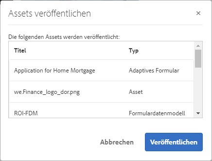
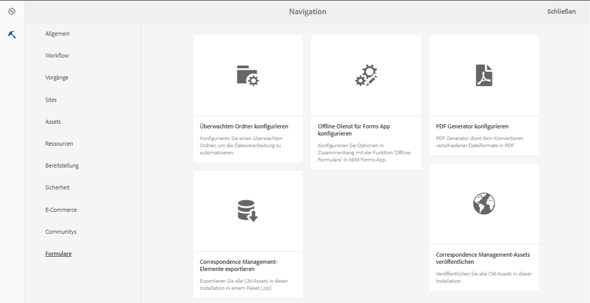
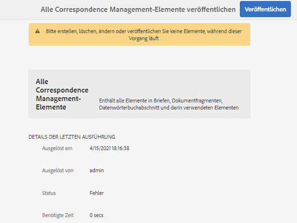

# Veröffentlichen von Formularen und Dokumenten und Rückgängigmachen von Veröffentlichungen{#publishing-and-unpublishing-forms-and-documents}

Mit [!DNL AEM Forms] können Sie Formulare mühelos erstellen, veröffentlichen und die Veröffentlichung rückgängig machen. Der [!DNL AEM Forms]-Server umfasst zwei Instanzen: die Autoren- und die Veröffentlichungsinstanz. Der Autoreninstanz dient dem Erstellen und Verwalten von Formular-Assets und -Ressourcen. Die Veröffentlichungsinstanz dient der Aufbewahrung von Assets und den zugehörigen Ressourcen, die für Endbenutzende verfügbar sind.

## Unterstützte Assets  {#supported-assets-nbsp}

[!DNL AEM Forms] unterstützt die folgenden Asset-Typen:

* Adaptive Formulare
* Adaptive Dokumente
* Adaptive Formularfragmente
* Designs
* Formularvorlagen <!-- (XFA forms) -->
* PDF-Formulare
* Dokumente (reduzierte PDF-Dokumente)
* Formularsätze
* Ressourcen (Bilder, Schemata und Stylesheets)

Zunächst sind alle Assets nur in der Autoreninstanz verfügbar. Admins bzw. Formularautorinnen und -autoren können alle Assets außer Ressourcen veröffentlichen.

Wenn Sie ein Formular auswählen und veröffentlichen, werden auch die zugehörigen Assets und Ressourcen veröffentlicht. Abhängige Assets werden jedoch nicht veröffentlicht. In diesem Zusammenhang sind zugehörige Assets und Ressourcen Assets, die ein veröffentlichtes Asset verwendet oder auf die es verweist. Abhängige Assets sind Assets, die auf ein veröffentlichtes Asset verweisen.

Ihr adaptives Formular verwendet möglicherweise einige Konfigurationen, Einstellungen und Anpassungen, die nicht automatisch veröffentlicht werden. Es wird empfohlen, dass Sie diese Ressourcen veröffentlichen oder aktivieren, bevor Sie ein adaptives Formular veröffentlichen.

* Bearbeitbare adaptive Formularvorlagen
* Cloud-Service-Konfigurationen für Adobe Sign, Typekit, reCAPTCHA und Formulardatenmodelle (FDM)
* Andere Cloud-Service-Konfigurationen sind nur aktiviert, wenn der Benutzer über Administratorberechtigungen verfügt.
* Anpassungen. Dazu gehören unter anderem:

   * benutzerdefinierte Layouts
   * benutzerdefinierte Darstellungen
   * CSS-Datei – als Eingabe im Dialogfeld „Container-Eigenschaften für adaptive Formulare“
   * Client-Bibliothekskategorie – als Eingabe im Dialogfeld „Container-Eigenschaften für adaptive Formulare“
   * andere Client-Bibliotheken, die möglicherweise als Teil der adaptiven Formularvorlage enthalten sind.
   * Design-Pfade

## Asset-Status {#asset-states}

Ein Asset kann über folgende Status verfügen:

* **Unveröffentlicht**: Ein Asset, das noch nie veröffentlicht wurde (dieser Status kann nur für Formular-Assets verwendet werden. Correspondence Management-Asset haben keine unveröffentlichten Status.)
* **Veröffentlicht**: Ein Asset, das veröffentlicht wurde und auf der Veröffentlichungsinstanz verfügbar ist
* **Geändert**: Ein Asset, das nach seiner Veröffentlichung geändert wird

## Veröffentlichen eines Assets {#publish-an-asset}

1. Melden Sie sich beim [!DNL AEM Forms]-Server an.
1. Verwenden Sie eines der folgenden Verfahren, um ein Asset auszuwählen und zu veröffentlichen.

   1. Bewegen Sie den Mauszeiger über ein Asset und wählen Sie **[!UICONTROL Veröffentlichen]**  aus.
   1. Führen Sie einen der folgenden Schritte aus und wählen Sie dann „Veröffentlichen“ aus:

      * Wenn Sie sich in der Kartenansicht befinden, wählen Sie **[!UICONTROL Auswahl eingeben]**  und dann das Asset aus. Das Asset wird ausgewählt.
      * Wenn Sie sich in der Listenansicht befinden, wählen Sie das Kontrollkästchen eines Assets aus. Das Asset wird ausgewählt.
      * Wählen Sie ein Asset aus, um dessen Details anzuzeigen.
      * Zeigen Sie die Eigenschaften eines Assets an, indem Sie auf „Eigenschaften anzeigen“  tippen.

      >[!NOTE]
      >
      >Wählen Sie nicht mehrere Assets aus. Das gleichzeitige Veröffentlichen mehrerer Assets wird nicht unterstützt.

1. Wenn der Veröffentlichungsprozess beginnt, wird ein Bestätigungsdialogfeld angezeigt, in dem alle zugehörigen Assets und Ressourcen aufgelistet sind. Wählen Sie im Dialogfeld, das das zugehörige Asset enthält, **[!UICONTROL Veröffentlichen]** aus. Das Asset wird veröffentlicht, und das Dialogfeld über das erfolgreiche Veröffentlichen des Assets wird angezeigt.

   >[!NOTE]
   >
   >Bei adaptiven Formularen wird neben den zugehörigen Assets auch der Seitenname des adaptiven Formulars angezeigt.

   

   Bestätigungsdialogfeld mit allen zugehörigen Elementen und Ressourcen

   >[!NOTE]
   >
   >Forms Manager: Wenn der Benutzer nicht berechtigt ist, die aufgelisteten Assets zu veröffentlichen, ist die Veröffentlichungsaktion deaktiviert. Ein Asset, für das zusätzliche Berechtigungen erforderlich sind, wird rot angezeigt.

   Nachdem ein Asset veröffentlicht wurde, werden die Metadateneigenschaften des Assets in die Veröffentlichungsinstanz kopiert und der Status des Assets wird zu „Veröffentlicht“ geändert. Der Status der abhängigen Assets, die veröffentlicht wurden, wird ebenfalls in „Veröffentlicht“ geändert.

   <!-- After publishing an asset, you can use the Forms Portal to display all the assets on a web page. For more information, see [Introduction to publishing forms on a portal](introduction-publishing-forms.md).-->

## Veröffentlichen aller Correspondence Management-Assets {#publish-all-the-correspondence-management-assets}

Mit [!DNL AEM Forms] können Sie alle Correspondence Management-Assets auf einem Server in ein und demselben Vorgang veröffentlichen. Die veröffentlichten Assets umfassen sämtliche Correspondence Management-Assets und ihre zugehörigen Abhängigkeiten.

Führen Sie nun die folgenden Schritte aus, um sämtliche Correspondence Management-Assets auf dem Server zu veröffentlichen:

1. Melden Sie sich beim [!DNL AEM Forms]-Server an.
1. Wählen Sie **Adobe Experience Manager** in der Menüleiste für globale Navigation aus.
1. Wählen Sie  und dann **Formulare** aus.
1. Wählen Sie **Correspondence Management Assets veröffentlichen** aus.

   

   Die Seite „Alle Correspondence Management Assets veröffentlichen“ erscheint und zeigt Informationen zur letzten Ausführung des Prozesses „Correspondence Management Assets veröffentlichen“ an.

   

1. Wählen Sie **Veröffentlichen** und anschließend in der Bestätigungsmeldung **OK** aus.

   Nachdem ein Batch-Prozess abgeschlossen ist, können Sie die Details der letzten Ausführung anzeigen. Unter anderem werden Informationen zu Admin-Anmeldedaten angezeigt und ob die Batch-Ausführung erfolgreich war.

   >[!NOTE]
   >
   >Sobald der Veröffentlichungsvorgang gestartet wurde, kann er nicht mehr abgebrochen werden. Zudem sollten Sie darauf achten, während der Ausführung des Vorgangs „Veröffentlichen“ keine Assets zu erstellen, zu löschen, zu modifizieren oder zu veröffentlichen und nicht den Vorgang „Alle Correspondence Management-Elemente exportieren“ zu starten.

## Automatisiertes Veröffentlichen von Formularen und Dokumenten und Rückgängigmachen von Veröffentlichungen {#automate-publishing-and-unpublishing-for-forms-amp-documents}

Mit [!DNL AEM Forms] können Sie die Veröffentlichung von Formularen und Dokumenten und die Rückgängigmachung dieses Vorgangs planen. Sie können den Zeitplan im Metadaten-Editor angeben. Weitere Informationen zum Verwalten von Formularmetadaten finden Sie unter [Verwalten von Formularmetadaten](manage-form-metadata.md).

Führen Sie folgende Schritte aus, um das Datum und die Uhrzeit für die Veröffentlichung bzw. das Rückgängigmachen der Veröffentlichung von Formular- und Dokument-Assets zu planen:

1. Wählen Sie ein Asset und dann **[!UICONTROL Eigenschaften anzeigen]** aus. Die Seite mit den Metadateneigenschaften wird geöffnet.
1. Wählen Sie auf der Seite „Metadateneigenschaften“ **[!UICONTROL Erweitert]** und dann **[!UICONTROL Bearbeiten]**  aus.
1. Wählen Sie in den Feldern **[!UICONTROL Einschaltzeit für Veröffentlichung]** und **[!UICONTROL Ausschaltzeit für Veröffentlichung]** das Datum und die Uhrzeit aus.\
   Wählen Sie **[!UICONTROL Fertig]**  aus.

## Rückgängigmachen der Veröffentlichung eines Assets {#unpublish-an-asset}

1. Wählen Sie ein veröffentlichtes Asset und **[!UICONTROL Veröffentlichung rückgängig machen]**  aus.
1. Verwenden Sie eines der folgenden Verfahren, um ein Asset auszuwählen und seine Veröffentlichung rückgängig zu machen.

   1. Bewegen Sie den Mauszeiger über ein Asset und wählen Sie **[!UICONTROL Veröffentlichung rückgängig machen]** aus.
   1. Führen Sie einen der folgenden Schritte aus und wählen Sie „Veröffentlichung rückgängig machen“ aus:

      * Wenn Sie sich in der Kartenansicht befinden, wählen Sie **[!UICONTROL Auswahl eingeben]** und dann das Asset aus. Das Asset wird ausgewählt.

      * Wenn Sie sich in der Listenansicht befinden, bewegen Sie den Mauszeiger über ein Asset und wählen Sie  aus. Das Asset wird ausgewählt.

      * Wählen Sie ein Asset aus, um dessen Details anzuzeigen.
      * Zeigen Sie die Eigenschaften eines Assets an, indem Sie auf „Eigenschaften anzeigen“  tippen.

1. Wenn der Prozess zum Rückgängigmachen der Veröffentlichung startet, wird ein Bestätigungsdialogfeld angezeigt. Wählen Sie **[!UICONTROL Veröffentlichung rückgängig machen]** aus.

   >[!NOTE]
   >
   >Es wird nur die Veröffentlichung des ausgewählten Assets rückgängig gemacht. Assets, die ihm untergeordnet sind oder auf es verweisen, bleiben veröffentlicht.

## Die zuvor veröffentlichte Version eines Assets oder Briefes wiederherstellen {#revert-an-asset-or-letter-to-the-previously-published-version}

Jedes Mal, wenn Sie ein Asset oder einen Brief nach der Bearbeitung veröffentlichen, wird eine Version des Assets bzw. des Briefs erstellt. Sie können ein Asset oder einen Brief auf eine zuvor veröffentlichte Version zurücksetzen. Dies kann erforderlich sein, wenn bei der aktuellen Version des Assets oder des Dokuments ein Fehler auftritt.

>[!NOTE]
>
>Setzen Sie einen Brief nicht auf den zuletzt veröffentlichten Status zurück, wenn ein abhängiges Asset, das in diesem veröffentlichten Brief verwendet wird, aus dem System gelöscht wird.

1. Wählen Sie ein Asset und dann **[!UICONTROL Wiederherstellen der zuvor veröffentlichten Version]**  aus.
1. Bevor das Asset wiederhergestellt wird, wird ein Bestätigungsdialogfeld angezeigt. Wählen Sie **[!UICONTROL Wiederherstellen]** aus.

   Das Asset bzw. der Brief wird auf seine zuvor veröffentlichte Version zurückgesetzt.

## Löschen eines Assets {#delete-an-asset}

>[!NOTE]
>
>Durch das Löschen eines Assets wird es aus der Veröffentlichungsinstanz entfernt. Durch das Löschen eines Assets wird auch sein Versionsverlauf mit Ausnahme der Basisversion entfernt.

1. Wählen Sie ein Asset und dann **[!UICONTROL Löschen]**  aus.

   >[!NOTE]
   >
   >Die Option „Löschen“ ist auch dann verfügbar, wenn Sie auf ein Asset tippen, um seine Details anzuzeigen, oder durch Tippen auf „Eigenschaften anzeigen“  seine Eigenschaften anzeigen.

1. Bevor das Asset gelöscht wird, wird ein Bestätigungsdialogfeld angezeigt. Wählen Sie **[!UICONTROL Löschen]** aus.

   >[!NOTE]
   >
   >Nur das ausgewählte Asset wird gelöscht, nicht jedoch die von ihm abhängigen Assets. Um die Verweise eines Assets zu prüfen, wählen Sie  und ein Asset aus.
   >
   >
   >Wenn das Asset, das Sie löschen möchten, ein untergeordnetes Asset eines anderen Assets ist, wird es nicht gelöscht. Um ein solches Asset löschen, entfernen Sie seine Verweise aus anderen Assets und wiederholen Sie den Vorgang.

## Geschützte adaptive Formulare {#protected-adaptive-forms}

Sie können die Authentifizierung für Formulare aktivieren, auf die ausgewählte Benutzende Zugriff haben sollen. Wenn Sie die Authentifizierung für Ihre Formulare aktivieren, sehen Benutzende einen Anmeldebildschirm, bevor sie darauf zugreifen. Nur Benutzende mit autorisierten Anmeldeinformationen können auf die Formulare zugreifen.

Aktivieren der Authentifizierung für Ihre Formulare:

1. Öffnen Sie in Ihrem Browser „configMgr“ in der Veröffentlichungsinstanz.\
   URL: `https://<hostname>:<PublishPort>/system/console/configMgr`

1. Klicken Sie auf der Seite „Adobe Experience Manager Web Console-Konfigurationen“ auf **Apache Sling-Authentifizierungs-Service**, um diesen Service zu konfigurieren.
1. Fügen Sie im daraufhin angezeigten Dialogfeld „Apache Sling-Authentifizierungs-Service“ mithilfe der Schaltfläche **+** die gewünschten Pfade hinzu.\
   Wenn Sie einen Pfad hinzufügen, wird der Authentifizierungs-Service für Formulare unter diesem Pfad aktiviert.
