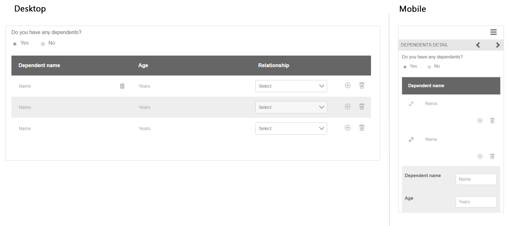

# Verweisen auf adaptive Formularfragmente {#reference-adaptive-form-fragments}

Adaptives Formularfragment steht für eine Gruppe von Feldern oder einen Bereich, der eine Gruppe von Feldern beinhaltet, die Sie verwenden können, wenn Sie ein Formular erstellen. Damit lassen sich Formulare mühelos und schnell erstellen. Sie können ein adaptives Formularfragment per Drag und Drop in ein Formular mit dem Asset-Browser in der Seitenleiste einfügen und es im Formulareditor bearbeiten.

Für Autoren von adaptiven Forms werden Referenzfragmente im [!DNL AEM Forms]-Paket [!DNL AEM FORMS] REFERENCE FRAGMENTS bereitgestellt. Es beinhaltet folgende Fragmente:

* Adresse
* Kontaktangaben
* Kreditkartenangaben
* Aktuelle Beschäftigung
* Informationen zu abhängigen Familienmitgliedern
* Beschäftigungshistorie
* Einkommen und Ausgaben
* Name
* Nutzungsbedingungen
* Nutzungsbedingungen mit Scribble

Wenn Sie das Paket installieren, wird unter „Formulare und Dokumente“ ein Referenzfragmente-Ordner mit Referenzfragmenten erstellt, der Referenzfragmente enthält. Informationen zur Installation von Paketen finden Sie unter [Bereitstellen von Inhaltspaketen über Cloud Manager und Package Manager](https://experienceleague.adobe.com/docs/experience-manager-cloud-service/implementing/deploying/overview.html?lang=de#deploying-content-packages-via-cloud-manager-and-package-manager) und [So arbeiten Sie mit Paketen](https://experienceleague.adobe.com/docs/experience-manager-65/administering/contentmanagement/package-manager.html?lang=de).

## Adresse {#address}

Enthält Felder, um die Postadresse anzugeben. Die verfügbaren Felder sind Straße, Postleitzahl, Stadt, Bundesland und Land. Dazu gehören auch ein vorkonfigurierter Webservice, der Stadt und Staat für eine bestimmte US-Postleitzahl ausfüllt.

<!--[Click to enlarge

](assets/address-1.png)-->

## Kontaktangaben {#contact-information}

Enthält Felder zum Erfassen einer Telefonnummer und E-Mail-Adresse.

<!--[Click to enlarge

](assets/contact-info-1.png)-->

## Kreditkartenangaben {#credit-card-information}

Beinhaltet Felder zur Erfassung von Kreditkartenangaben, die zur Verarbeitung von Zahlungen verwendet werden können.

## Aktuelle Beschäftigung {#current-employment}

Enthält Felder zur Erfassung aktueller Beschäftigungsdetails wie Beschäftigungsstatus, Bereich der Beschäftigung, Bezeichnung, Organisation und Anfangsdatum.

<!--[Click to enlarge

](assets/current-emp-1.png)-->

## Informationen zu abhängigen Familienmitgliedern {#dependents-information}

Enthält Felder für Informationen über ein oder mehrere abhängige Familienmitglieder wie Name, Alter und Beziehung im Tabellenformat.

<!--[Click to enlarge

](assets/dependents-info-1.png)-->

## Beschäftigungshistorie {#employment-history}

Enthält Felder zur Erfassung der Beschäftigungshistorie. Es ermöglicht das Hinzufügen mehrerer Organisationen.

<!--[Click to enlarge

](assets/emp-history-1.png)-->

## Einkommen und Ausgaben {#income-expenditure}

Enthält Felder zur Erfassung von monatlichen Cashflows und Ausgaben. Formulare, in denen Benutzer finanzielle Details bereitstellen müssen, können dieses Fragment verwenden, um Einkommen und Ausgaben zu erfassen.

<!--[Click to enlarge

](assets/income-1.png)-->

## Name {#name}

Enthält Felder zum Angeben von Titel, Vorname, zweitem Vornamen und Nachname.

<!--[Click to enlarge

](assets/name-1.png)-->

## Nutzungsbedingungen {#terms-conditions}

Gibt Nutzungsbedingungen an, die vom Benutzer akzeptiert werden müssen, bevor ein Formular übermittelt wird.

<!--[Click to enlarge

](assets/tnc-1.png)-->

## Nutzungsbedingungen mit Scribble {#terms-conditions-with-scribble}

Gibt Nutzungsbedingungen an, die vom Benutzer akzeptiert und abgezeichnet werden müssen, bevor ein Formular übermittelt wird.

<!--[Click to enlarge

](assets/tnc-scribble-1.png)-->
