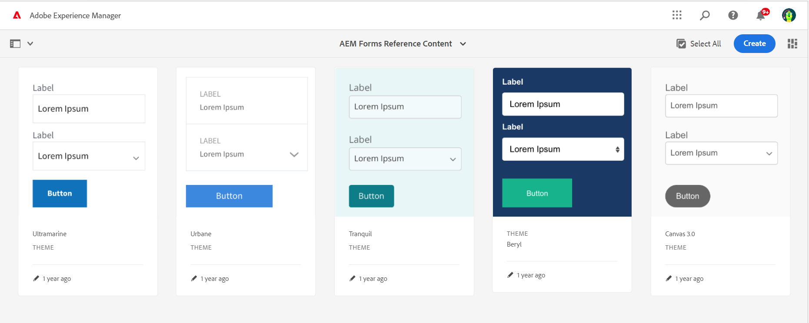

# Referenzthemen, Vorlagen und Formulardatenmodelle {#reference-themes-templates-and-data-models}

| Gilt für | Artikel-Link |
| -------- | ---------------------------- |
| Auf Kernkomponenten basierendes adaptives Formular | [Hier klicken](https://experienceleague.adobe.com/docs/experience-manager-core-components/using/adaptive-forms/sample-themes-templates-form-data-models-core-components.html?lang=de) |
| Auf Foundation-Komponenten basierendes adaptives Formular | Dieser Artikel |

>[!NOTE]
>
> Adobe empfiehlt, die modernen und erweiterbaren [Kernkomponenten](https://experienceleague.adobe.com/docs/experience-manager-core-components/using/adaptive-forms/introduction.html?lang=de) für die Datenerfassung zu verwenden, um [neue adaptive Formulare zu erstellen](/help/forms/creating-adaptive-form-core-components.md) oder [adaptive Formulare zu AEM Sites-Seiten hinzuzufügen](/help/forms/create-or-add-an-adaptive-form-to-aem-sites-page.md). Diese Komponenten stellen einen bedeutenden Fortschritt bei der Erstellung adaptiver Formulare dar und sorgen für beeindruckende Anwendererlebnisse. In diesem Artikel wird der ältere Ansatz zum Erstellen von adaptiven Formularen mithilfe von Foundation-Komponenten beschrieben.

AEM Forms as a Cloud Service bietet mehrere Referenz-Designs, Vorlagen und Formulardatenmodelle (FDM), damit Sie schnell mit der Erstellung adaptiver Formulare beginnen können. Sie können das [Referenzinhaltspaket vom Software-Verteilungs-Portal](https://experience.adobe.com/#/downloads/content/software-distribution/en/aemcloud.html?package=/content/software-distribution/en/details.html/content/dam/aemcloud/public/aem-forms-reference-content.ui.content-2.1.0.zip) herunterladen und den [Package Manager](/help/implementing/developing/tools/package-manager.md) verwenden, um das [Referenzinhaltspaket](https://experience.adobe.com/#/downloads/content/software-distribution/en/aemcloud.html?package=/content/software-distribution/en/details.html/content/dam/aemcloud/public/aem-forms-reference-content.ui.content-2.1.0.zip) in Ihrer Produktions-, Entwicklungs- oder lokalen Entwicklungsumgebung zu installieren, um diese Referenz-Assets in Ihre Umgebung zu bringen.

Die im Referenzinhaltspaket enthaltenen Designs, Vorlagen und Formulardatenmodelle (FDM) sind:

| Designs | Vorlagen | Formulardatenmodell (FDM) |
---------|----------|---------
| Canvas 3.0 | Allgemein | Microsoft Dynamics 365 |
| Tranquil | Leer | Salesforce |
| Urbane |   |  |
| Ultramarine |  |  |
| Beryl |  |  |
| Gesundheitswesen |  |   |
| FSI |   |   |

## Referenzthemen {#reference-themes}

[Designs](/help/forms/themes.md) ermöglichen Ihnen, Ihre Formulare ohne fundierte Kenntnisse im Umgang mit CSS zu formatieren. Sie können die folgenden Designs erhalten, indem Sie das [Referenzinhaltspaket](https://experience.adobe.com/#/downloads/content/software-distribution/en/aemcloud.html?package=/content/software-distribution/en/details.html/content/dam/aemcloud/public/aem-forms-reference-content.ui.content-2.1.0.zip) installieren:

* Beryl
* Canvas 3.0
* Tranquil
* Urbane
* Ultramarine
* Gesundheitswesen
* FSI (Financial Services &amp; Insurance)

Jedes Design enthält einen einzigartigen und eleganten Stil, den Sie verwenden können, um ansprechende adaptive Formulare für Ihre Benutzerinnen und Benutzer zu erstellen. Es enthält einen eindeutigen Stil für Selektoren wie Bedienfeld, Textfeld, numerisches Feld, Optionsfeld, Tabelle und Umschalter. Die Stile in diesen Designs basieren auf Anforderungen. Beispielsweise benötigen Sie in einem bestimmten Szenario ein minimalistisches Design mit sauberen Schriftarten. Mit dem Freiheits-Design können Sie diesen Look erzielen.

Die Designs, die in diesem Paket enthalten sind, sind responsiv, und die Formatierung in diesen Designs ist für Mobil- und Desktop-Anzeigen definiert. Die meisten modernen Browser auf einer Vielzahl von Geräten können Formulare rendern, die mit einem dieser Designs mühelos angewendet werden.

Weitere Informationen zur Installation eines Pakets finden Sie unter [Arbeiten mit Paketen](/help/implementing/developing/tools/package-manager.md).

## Beryl {#beryl}

Das Beryl-Design hebt die Verwendung von Hintergrundbildern, Transparenz und großen und flachen Symbolen hervor. Im Screenshot unten können Sie sehen, wie das Beryl-Design angezeigt wird und wie es das Formatieren des Formulars verbessern kann.

## Canvas 3.0 {#canvas}

Canvas 3.0 ist das Standard-Design für adaptive Formulare und betont die Verwendung von Grundfarben, Transparenz und flachen Symbolen. Im Screenshot unten sehen Sie, wie das Canvas 3.0-Design aussieht.

## Tranquil {#tranquil}

Das Tranquil-Design bietet helle und dunkle Schattierungen des Tranquil-Farbschemas, um verschiedene Komponenten eines Formulars hervorzuheben. Beispielsweise erhalten Optionsfelder, Bereiche und Registerkarten jeweils einen anderen Grünton.

## Urbane {#urbane}

Das Urban-Design betont einen minimalistischen und funktionalen Look für Ihr Formular. Wenn Sie das Urbane-Designs auf Ihr Formular anwenden, können Sie sehen, dass Komponenten reduziert sind. Die Bedienfelder erhalten dünne Konturen, um einen modernen Look zu erzielen.

## Ultramarine {#ultramarine}

Das Ultramarine-Design verwendet dunkelblaue Töne, um Komponenten wie Registerkarten, Bereiche, Textfelder und Schaltflächen hervorzuheben.

## Gesundheitswesen {#healthcare}

Das Healthcare-Design verwendet tiefe grüne Schattierungen, um Komponenten wie Registerkarten, Bedienfelder, Textfelder und Schaltflächen hervorzuheben.

## FSI (Financial Services &amp; Insurance)

Das FSI-Design legt Wert auf einen minimalistischen und funktionalen Look für Ihr Formular. Wenn Sie das FSI-Design auf Ihr Formular anwenden, können Sie sehen, dass die Bedienfeldkomponenten gelb sind.

## Referenzvorlagen {#reference-templates}

Mit [Vorlagen](/help/forms/themes.md) können Sie die anfängliche Formularstruktur, den Inhalt und die Aktionen für Ihre Formulare definieren. Sie können die folgenden Vorlagen erhalten, indem Sie das [Referenzinhaltspaket](https://experience.adobe.com/#/downloads/content/software-distribution/en/aemcloud.html?package=/content/software-distribution/en/details.html/content/dam/aemcloud/public/aem-forms-reference-content.ui.content-2.1.0.zip) installieren:

* Einfach
* Leer

Die einfache Vorlage hilft Ihnen beim schnellen Erstellen eines Registrierungsformulars. Sie können es auch verwenden, um eine Vorschau der Funktionalität von Foundation-Komponenten adaptiver Formulare anzuzeigen. Es bietet ein Assistenten-Layout für eine abschnittsweise Darstellung der Daten. Verwenden Sie die leere Vorlage, um ein adaptives Formular auf einer leeren Arbeitsfläche zu erstellen.

## Referenz-Formulardatenmodell (FDM) {#reference-models}

Die adaptiven Formulare können dann mit Microsoft Dynamics 365- und Salesforce-Servern interagieren, um Geschäftsabläufe zu ermöglichen. Zum Beispiel:

* Schreiben von Daten in Microsoft Dynamics 365 und Salesforce bei der Übermittlung von adaptiven Formularen.
* Schreiben von Daten in Microsoft Dynamics 365 und Salesforce durch benutzerdefinierte Entitäten, die im Formulardatenmodell (FDM) definiert sind, und umgekehrt.
* Abfragen des Microsoft Dynamics 365- und Salesforce-Servers nach Daten und Vorausfüllen der adaptiven Formulare.
* Lesen von Daten von Microsoft Dynamics 365- und Salesforce-Servern.

Sie können die folgenden Formulardatenmodelle (FDM) erhalten, indem Sie das [Referenzinhaltspaket](https://experience.adobe.com/#/downloads/content/software-distribution/en/aemcloud.html?package=/content/software-distribution/en/details.html/content/dam/aemcloud/public/aem-forms-reference-content.ui.content-2.1.0.zip) installieren:

* Microsoft® Dynamics 365
* Salesforce

Informationen zur Verwendung dieser Modelle finden Sie unter [Konfigurieren von Microsoft Dynamics 365- und Salesforce-Cloud-Diensten](https://experienceleague.adobe.com/docs/experience-manager-cloud-service/content/forms/integrate/use-form-data-model/configure-msdynamics-salesforce.html?lang=de#configure-dynamics-cloud-service)

## Siehe auch {#see-also}

{{see-also}}