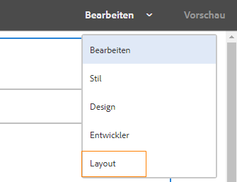
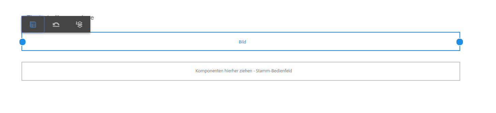
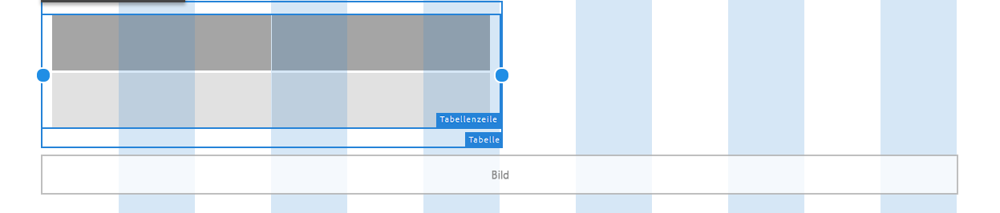
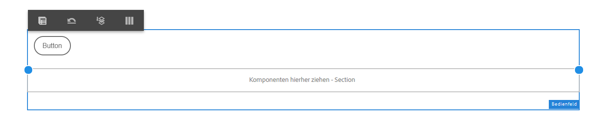
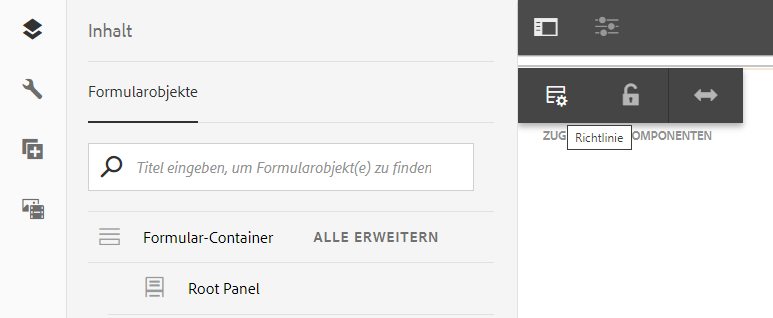

# Verwenden des Layout-Modus zum Ändern der Größe von Komponenten {#use-layout-mode-to-resize-components}

Mit der Authoring-Oberfläche für adaptive Formulare können Sie mithilfe des Layout-Modus die Größe von Komponenten ändern. Indem Sie blaue Punkte in Spalten ziehen, können Sie den Start- und Endpunkt zur Positionierung der Komponenten definieren. Die blauen Punkte werden nach dem Tippen auf die Komponente im responsiven Raster angezeigt. Das responsive Raster besteht aus 12 gleichen Spalten. Die weiße und blaue Farbschattierung in alternativen Spalten setzt die Spalten voneinander ab.

Sie können den Layout-Modus verwenden, um die Größe von Komponenten für alle Gerätetypen wie Desktopcomputer, Tablet, Smartphone und andere kleinere Geräte zu ändern. Das Tablet leitet die Layout-Konfiguration automatisch von der Desktopversion ab und die kleineren Geräte leiten die Layout-Konfiguration vom Smartphone ab. Sie können die automatisch abgeleiteten Konfigurationen jedoch überschreiben, um für jeden Gerätetyp eine andere Konfiguration zu definieren.

## Zugriff auf Layout-Modus {#access-layout-mode}

Wählen Sie **[!UICONTROL Layout]** aus der Dropdownliste, die oben in der Authoring-Oberfläche für adaptive Formulare neben der Option **[!UICONTROL Vorschau]** angezeigt wird. Das Formular wird im Layout-Modus angezeigt.

1. Melden Sie sich bei der [!DNL Adobe Experience Manager]-Autorinstanz an und navigieren Sie zu **[!UICONTROL Adobe Experience Manager]** > **[!UICONTROL Forms]** > **[!UICONTROL Formulare und Dokumente]**.
1. Erstellen Sie ein neues oder öffnen Sie ein vorhandenes [adaptives Formular](creating-adaptive-form.md).
1. Wählen Sie **[!UICONTROL Layout]** aus der Dropdownliste, die oben neben der Option **[!UICONTROL Vorschau]** angezeigt wird. Das Formular wird im Layout-Modus angezeigt.

   

## Anpassen der Größe von Komponenten {#resize-components}

1. Tippen Sie im Layout-Modus auf die Komponente, deren Größe geändert werden soll. Die blauen Punkte werden am Beginn und am Ende des responsiven Rasters angezeigt.
1. Ziehen Sie die blauen Punkte mit der Maus, um die Position der Komponente im responsiven Raster zu definieren.

   

   Die Symbolleiste, die nach dem Tippen auf Komponenten angezeigt wird, besteht aus folgenden Optionen:

   * **[!UICONTROL Übergeordnet]**: Wählen Sie das übergeordnete Element einer Komponente aus.
   * **[!UICONTROL Breakpoint-Layout wiederherstellen]**: Machen Sie alle Änderungen der Größe rückgängig und wenden Sie das Standard-Layout auf die Komponente an.
   * **[!UICONTROL In neue Zeile gleiten lassen]**: Versetzt die Komponente in die nächste Zeile, wenn sich mehrere Komponenten in derselben Zeile befinden.

   Sie können die Option **[!UICONTROL Breakpoint-Layout wiederherstellen]** () auch auf Bedienfeldebene verwenden, um alle Änderungen der Größe rückgängig zu machen.

   >[!NOTE]
   >
   >Sie können die Größe von Tabellenspalten, Symbolleisten, Symbolleistenschaltflächen und Zielbereichskomponenten mit dem Layout-Modus nicht ändern. Verwenden Sie den Stilmodus, um die Größe dieser Komponenten zu ändern.

### Beispiel {#example}

**Ziel**: Eine Tabellenkomponente und eine Bildkomponente sollen eingefügt und parallel in einem adaptiven Formular positioniert werden.

1. Fügen Sie die Tabellen- und Bildkomponenten mit dem Modus [!UICONTROL Bearbeiten] in das adaptiven Formular ein. Die Bildkomponente wird nach der Tabellenkomponente angezeigt.
1. Wechseln Sie in den [!UICONTROL Layout]-Modus und tippen Sie auf die Komponente [!UICONTROL Tabelle]. Die blauen Punkte zur Größenanpassung der Komponente werden in den Spalten 1 und 12 angezeigt.
1. Ziehen Sie den blauen Punkt in Spalte 12 in Spalte 6 des responsiven Rasters.

   

1. Wählen Sie auf ähnliche Weise die Komponente [!UICONTROL Bild] und ziehen Sie den blauen Punkt in Spalte 1 in Spalte 7 des responsiven Rasters. Die Tabellen- und Bildkomponenten werden parallel zueinander angezeigt.

   

   Sie können die Bildkomponente auswählen und auf die Option **[!UICONTROL In neue Zeile gleiten lassen]** tippen, die in der Symbolleiste verfügbar ist, um die Bildkomponente zur nächsten Zeile zu verschieben.

## Ändern der Größe von Bereichen {#resize-panels-layout-mode}

Führen Sie folgende Schritte aus, wenn Sie die Größe des gesamten Bereichs statt der Größe einzelner Komponenten ändern möchten:

1. Tippen Sie auf eine der Komponenten im Bereich, dessen Größe Sie ändern möchten, wählen Sie  aus und dann die erste Option in der Dropdownliste, wenn der Bereich der Komponente direkt übergeordnet ist.

   Die blauen Punkte werden am Beginn und am Ende des responsiven Rasters angezeigt.

1. Ziehen Sie die blauen Punkte mit der Maus, um die Position des Bereichs im responsiven Raster zu definieren.
Sie können die Schritte 1 und 2 wiederholen und mit  den Bereich mit der Größenanpassung zur nächsten Zeile verschieben.

## Definieren eines Layouts mit mehreren Spalten für einen Bereich

Führen Sie folgende Schritte aus, um die Anzahl der Spalten für einen Bereich zu definieren:

1. Tippen Sie im Modus **[!UICONTROL Bearbeiten]** auf den Bereich, wählen Sie  aus und dann **[!UICONTROL Responsiv – alles auf der Seite ohne Navigation]** aus der Dropdownliste **[!UICONTROL Bereichs-Layout]**.

1. Tippen Sie auf , um die Eigenschaften zu speichern.

1. Tippen Sie im Modus **[!UICONTROL Layout]** auf eine der Komponenten im Bereich, wählen Sie  aus und dann den Bereich.

1. Tippen Sie auf  und wählen Sie die Spaltenanzahl aus der Dropdownliste aus. Die Anzahl der Spalten kann zwischen 1 und 12 liegen. Der Bereich wird in ein Layout mit mehreren Spalten unterteilt.

## Aktivieren des neuen responsiven Rasters für alte responsive Layouts {#enableresponsivegrid}

Aktivieren Sie das neue responsive Raster für Formulare, die Sie mit [!DNL Adobe Experience Manager] Forms 6.4 oder einer älteren Version erstellen, um die Größe von Komponenten zu ändern.

>[!NOTE]
>
>Beim Wechsel zum neuen responsiven Raster werden die Layout-Eigenschaften verworfen, die bereits für im Formular verwendete Komponenten definiert wurden.

Führen Sie folgende Schritte aus, um das neue responsive Raster zu aktivieren:

1. Wählen Sie **[!UICONTROL Layout]** aus der Dropdownliste, die oben neben der Option **[!UICONTROL Vorschau]** angezeigt wird. Eine Bestätigung zur Aktivierung des Layout-Modus wird angezeigt.
1. Tippen Sie auf **[!UICONTROL Ja]**, um den **[!UICONTROL Layout]**-Modus für das Formular zu aktivieren.

### Einbetten eines alten Fragments in ein adaptives Formular mit neuem responsivem Layout {#embed-an-old-fragment-in-an-adaptive-form-with-new-responsive-layout}

Mit dem neuen responsiven Layout für adaptive Formulare können Sie ein adaptives Formularfragment mit dem alten responsiven Layout zum Formular hinzufügen. Das neue Layout verwirft jedoch die Layout-Eigenschaften, die bereits für im Fragment verwendete Komponenten definiert wurden. Sie können zum Layout-Modus wechseln, um die Layout-Eigenschaften für die im Fragment verwendeten Komponenten zu definieren.

### Einbetten eines Fragments mit neuem responsivem Layout in ein altes adaptives Formular {#embed-a-fragment-with-new-responsive-layout-in-an-old-adaptive-form}

Wenn Sie ein Fragment mit dem neuen responsiven Layout in ein adaptives Formular mit altem responsivem Layout einbetten, fordert das System Sie dazu auf, den Layout-Modus für das Formular zu aktivieren und das Fragment erneut einzubetten.

Um den Layout-Modus zu aktivieren, wählen Sie **[!UICONTROL Layout]** aus der Dropdownliste, die oben neben der Option **[!UICONTROL Vorschau]** angezeigt wird, und tippen Sie zur Bestätigung auf **[!UICONTROL Ja]**. Wählen Sie den Modus **[!UICONTROL Bearbeiten]**, um das Fragment erneut einzubetten.

## Deaktivieren des Layout-Modus für Formulare mit altem responsivem Layout {#disable-layout-mode-for-forms-with-old-responsive-layout}

Sie können den Layout-Modus für Formulare mit altem responsivem Layout deaktivieren, indem Sie die Eigenschaften der im Formular verwendeten Vorlage bearbeiten.

Gehen Sie wie folgt vor, um den Layout-Modus zu deaktivieren:

1. Wählen Sie **[!UICONTROL Tools]** > **[!UICONTROL Allgemein]** > **[!UICONTROL Vorlagen]** und öffnen Sie die Vorlage, die im Formular im Modus **[!UICONTROL Bearbeiten]** verwendet wird.
1. Wählen Sie den Formular-Container im linken Fenster aus und tippen Sie auf **[!UICONTROL Richtlinie]**.

   

1. Tippen Sie auf die Registerkarte **[!UICONTROL Layout-Einstellungen]** und wählen Sie **[!UICONTROL Layout-Modus deaktivieren]** aus.
1. Tippen Sie auf , um die Vorlageneigenschaften zu speichern.
