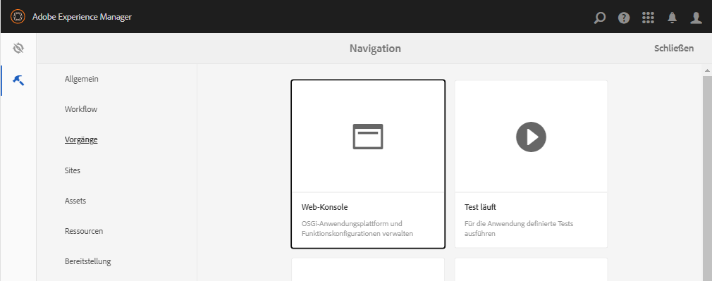
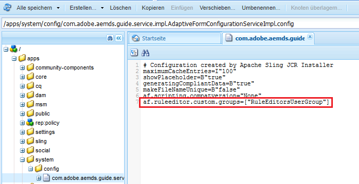

# Gewähren von Zugriff auf den Regeleditor für ausgewählte Benutzergruppen {#grant-rule-editor-access-to-select-user-groups}

## Übersicht {#overview}

Möglicherweise sind unterschiedliche Typen von Benutzern mit unterschiedlichen Fähigkeiten vorhanden, die mit adaptiven Formularen arbeiten. Während erfahrene Benutzer möglicherweise über die richtigen Kenntnisse verfügen, um mit Skripten und komplexen Regeln zu arbeiten, gibt es möglicherweise Benutzer auf Einsteigerniveau, die nur mit dem Layout und den Standardeigenschaften adaptiver Formulare arbeiten müssen.

[!DNL Experience Manager Forms] ermöglicht es Ihnen, den Zugriff auf den Regeleditor anhand der Rolle oder Funktion der Benutzenden einzuschränken. In den Einstellungen für den Konfigurations-Service für adaptive Formular können Sie festlegen, welche [Benutzergruppen](forms-groups-privileges-tasks.md) den Regeleditor anzeigen und auf ihn zugreifen können.

## Angeben von Benutzergruppen für Zugriff auf Regeleditor {#specify-user-groups-that-can-access-rule-editor}

1. Melden Sie sich als Administrator bei [!DNL Experience Manager Forms] an.
1. Klicken Sie in der Autoreninstanz auf Adobe Experience Manager > Tools  > **[!UICONTROL Vorgänge]** > **[!UICONTROL Webkonsole]**. Die Webkonsole wird in einem neuen Fenster geöffnet.

   

1. Suchen Sie im Fenster der [!UICONTROL Web-Konsole] den **[!UICONTROL Konfigurations-Service für adaptive Formulare]** und klicken Sie darauf. Das Dialogfeld für den **[!UICONTROL Konfigurations-Service für adaptive Formulare]** wird angezeigt. Behalten Sie die Werte bei und klicken Sie auf **[!UICONTROL Speichern]**.

   Die Datei `/apps/system/config/com.adobe.aemds.guide.service.impl.AdaptiveFormConfigurationServiceImpl.config` wird im CRX-Repository erstellt.

1. Melden Sie sich als Administrator bei CRXDE an. Öffnen Sie die Datei `/apps/system/config/com.adobe.aemds.guide.service.impl.AdaptiveFormConfigurationServiceImpl.config` zum Bearbeiten.
1. Geben Sie mithilfe folgender Eigenschaft den Namen einer Gruppe an, die auf den Regeleditor zugreifen kann (z. B. RuleEditorsUserGroup), und klicken Sie auf **[!UICONTROL Alle speichern]**.

   `af.ruleeditor.custom.groups=["RuleEditorsUserGroup"]`

   Um den Zugriff für mehrere Gruppen zu aktivieren, geben Sie eine Liste mit durch Kommata getrennten Werten an:

   `af.ruleeditor.custom.groups=["RuleEditorsUserGroup", "PermittedUserGroup"]`

   

   Wenn jetzt ein Benutzer, der nicht zu einer angegebenen Benutzergruppe (hier: `RuleEditorsUserGroup`) gehört, auf ein Feld tippt, ist das Symbol „Regel bearbeiten“ () für ihn in der Komponentensymbolleiste nicht verfügbar:

   

   Komponentensymbolleiste für Benutzer mit Zugriff auf Regeleditor:

   

   Komponentensymbolleiste für Benutzer ohne Zugriff auf Regeleditor:

   Anweisungen zum Hinzufügen von Benutzern zu Gruppen finden Sie unter [Benutzerverwaltung und Sicherheit](https://experienceleague.adobe.com/docs/experience-manager-65/administering/security/security.html?lang=de).
