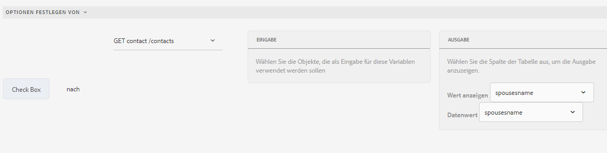

# Operatortypen und -ereignisse im Regeleditor eines auf Kernkomponenten basierendes adaptiven Formulars

In AEM Forms as a Cloud Service umfasst der Regeleditor verschiedene Operatortypen und Ereignisse, mit denen Sie komplexe Bedingungen und Aktionen mühelos definieren und ausführen können.

Die im Regeleditor eines adaptiven Formulars verfügbaren Operatortypen bieten ein robustes Framework für die Erstellung präziser Bedingungen. Sie ermöglichen es Ihnen, Daten zu bearbeiten, Berechnungen durchzuführen und mehrere Bedingungen logisch und kohärent zu kombinieren. Unabhängig davon, ob Sie Werte vergleichen, arithmetische Operationen durchführen oder Zeichenfolgen bearbeiten, stellen diese Operatoren sicher, dass Ihre Regeln sowohl flexibel als auch leistungsstark sind.

Ereignisse im Regeleditor dienen als Trigger zum Aktivieren Ihrer Regeln. Sie definieren die spezifischen Aktionen, die ausgeführt werden, wenn bestimmte Bedingungen erfüllt sind. Durch die Nutzung verschiedener Ereignistypen können Sie die Reaktionen auf eine Vielzahl von Szenarien automatisieren, z. B. Benutzerinteraktionen, geplante Zeiten, Änderungen der Daten und Systemstatus. Mit der Möglichkeit, diese Trigger anzugeben, können Sie dynamische und responsive Regeln erstellen, die Ihren spezifischen Anforderungen entsprechen.

Durch das Verständnis und die Verwendung der verfügbaren Operatortypen und Ereignisse können Sie das volle Potenzial des Regeleditors ausschöpfen, wodurch Sie effiziente, effektive Regeln erstellen können, die Ihren individuellen Anforderungen entsprechen und die allgemeine Systemfunktionalität verbessern.

## Verfügbare Typen von Operatoren und Ereignissen im Regeleditor {#available-operator-types-and-events-in-rule-editor}

Der Regeleditor bietet die folgenden logischen Operatoren und Ereignisse, mit deren Hilfe Sie Regeln erstellen können.

* **Ist gleich** - Prüft, ob das Formularobjekt mit einem angegebenen Wert übereinstimmt.
* **Ist nicht gleich** - Prüft, ob das Formularobjekt einem angegebenen Wert nicht entspricht.
* **Beginnt mit** - Prüft, ob das Formularobjekt mit einer angegebenen Zeichenfolge beginnt.
* **Endet mit** - Prüft, ob das Formularobjekt mit einer angegebenen Zeichenfolge endet.
* **Enthält** - Prüft, ob das Formularobjekt eine angegebene Unterzeichenfolge enthält.
* **Enthält nicht** - Prüft, ob das Formularobjekt eine angegebene Unterzeichenfolge nicht enthält.
* **Ist leer** - Prüft, ob das Formularobjekt leer ist oder nicht angegeben wurde.
* **Ist nicht leer** - Prüft, ob ein Formularobjekt vorhanden und nicht leer ist.
* **Hat ausgewählt** - Gibt „true“ zurück, wenn ein Benutzer eine bestimmte Kontrollkästchen-, Dropdown- oder Optionsfeldoption auswählt.
* **Ist initialisiert (Ereignis)** - Gibt „true“ zurück, wenn ein Formularobjekt im Browser gerendert wird.
* **Wird geändert (Ereignis)** - Gibt „true“ zurück, wenn ein Benutzer den Wert oder die Auswahl eines Formularobjekts ändert.
* **Wird angeklickt (Ereignis)** - Gibt „true“ zurück, wenn ein Benutzer auf ein Formularobjekt klickt, z. B. eine Schaltfläche. Ein Benutzer kann [mehrere Bedingungen zum Klick auf die Schaltfläche hinzufügen](/help/forms/rule-editor-core-components-usecases.md#set-focus-to-another-panel-on-button-click-if-the-first-panel-is-valid).
* **Ist gültig** - Prüft, ob ein Formularobjekt die Validierungskriterien erfüllt.
* **Ist ungültig** - Prüft, ob ein Formularobjekt bei der Validierung fehlschlägt.

<!--
* **Navigation(event):** Returns true when the user clicks a navigation object. Navigation objects are used to move between panels. 
* **Step Completion(event):** Returns true when a step of a rule completes.
* **Successful Submission(event):** Returns true on successful submission of data to a form data model.
* **Error in Submission(event):**  Returns true on unsuccessful submission of data to a form data model. -->

### Verfügbare Typen von Regeln im Regeleditor {#available-rule-types-in-rule-editor}

Der Regeleditor bietet eine Reihe vordefinierter Regeltypen, mit denen Sie Regeln schreiben können. Im Folgenden werden die einzelnen Regeltypen detailliert dargestellt. Weitere Informationen zum Schreiben von Regeln im Regeleditor finden Sie unter [Regeln schreiben](/help/forms/rule-editor-core-components-user-interface.md#write-rules).

#### [!UICONTROL Wenn] {#whenruletype}

Der **[!UICONTROL Wenn]**-Regeltyp nutzt das Konstrukt **Bedingung-Aktion-Alternative Aktion**, in manchen Fällen auch nur das Konstrukt **Bedingung-Aktion**. Für diesen Regeltyp geben Sie zunächst eine auszuwertende Bedingung an und dann eine Aktion, die ausgelöst werden soll, wenn die Bedingung erfüllt ist (`True`). Bei Einsatz der Wenn-Regel können Sie mehrere UND- und ODER-Operatoren verwenden, um [verschachtelte Ausdrücke](/help/forms/rule-editor-core-components-usecases.md#nested-expressions) zu erstellen.

Mit dem Wenn-Regeltyp können Sie eine Bedingung für ein Formularobjekt auswerten und Aktionen für ein oder mehrere Objekte ausführen.

Einfach ausgedrückt: Eine typische Wenn-Regel ist wie folgt aufgebaut:

`When on Object A:`

`(Condition 1 AND Condition 2 OR Condition 3) is TRUE;`

`Then, do the following:`

`Action 2 on Object B;`
`AND`
&grave;Aktion 3 auf Objekt C;

`Else, do the following:`

`Action 2 on Object C;`
_

Beim Erstellen einer Regel für Komponenten mit mehreren Werten (z. B. Optionsfelder oder Listen) werden die Optionen automatisch abgerufen und dem Regelersteller zur Verfügung gestellt. Sie müssen die Optionswerte nicht erneut eingeben.

Eine Liste hat beispielsweise vier Optionen: „Rot“, „Blau“, „Grün“ und „Gelb“. Beim Erstellen der Regel werden die Optionen (Optionsfelder) automatisch abgerufen und dem Regelersteller wie folgt zur Verfügung gestellt:

Beim Schreiben der Wenn-Regel können Sie die Aktion „Wert löschen von“ auslösen. Die Aktion „Wert löschen von“ löscht den Wert des angegebenen Objekts. Mit „Wert löschen von“ als Option in der Wenn-Anweisung können Sie komplexe Bedingungen mit mehreren Feldern erstellen. Sie können die Else-Anweisung hinzufügen, um weitere Bedingungen hinzuzufügen

>[!NOTE]
>
> Wenn der Regeltyp nur Dann-Sonst-Anweisungen mit einer Ebene unterstützt.

##### Felder mit Mehrfachauswahl in [!UICONTROL Wenn] {#allowed-multiple-fields}

In der Bedingung **Wenn** haben Sie die Möglichkeit, neben dem Feld, auf das die Regel angewendet wird, weitere Felder hinzuzufügen.

Beispielsweise können Sie mithilfe des Wenn-Regeltyps eine Bedingung für verschiedene Formularobjekte auswerten und die folgende Aktion durchführen:

Wenn:

(Objekt A Bedingung 1)

UND/ODER

(Objekt B Bedingung 2)

Gehen Sie dann wie folgt vor:

Aktion 1 auf Objekt A

_

**Überlegungen bei Verwendung von Zulässigen mehreren Feldern in der Wenn-Bedingungsfunktion**

* Stellen Sie sicher, dass [Kernkomponente auf Version 3.0.14 oder höher eingestellt ist](https://github.com/adobe/aem-core-forms-components) um diese Funktion im Regeleditor zu verwenden.
* Falls Regeln auf verschiedene Felder in der Wenn-Bedingung angewendet werden, wird die Regel auch dann ausgelöst, wenn nur eines dieser Felder geändert wird.
* Sie können die mehreren Felder nur in der Wenn **Bedingung** eine **AND)-** hinzufügen. Eine OR-Regel **nicht**.

>[!NOTE]
>
> Um mehrere Bedingungen hinzuzufügen, die ein Schaltflächen-Klickereignis enthalten, stellen Sie sicher, dass das Schaltflächen-Klickereignis als erste Bedingung platziert wird. Beispielsweise ist &quot;`When button is clicked AND text input equals '5'`&quot; gültig, während &quot;`When text input equals '5' AND button is clicked`&quot; nicht unterstützt wird.

<!--
* It is not possible to add multiple fields in the When condition while applying rules to a button.

##### To enable Allowed Multiple fields in When condition feature

Allowed Multiple fields in When condition feature is disabled by default. To enable this feature, add a custom property at the template policy:

1. Open the corresponding template associated with an Adaptive Form in the template editor.
1. Select the existing policy as **formcontainer-policy**.
1. Navigate to the **[!UICONTROL Structure]**  view and, from the **[!UICONTROL Allowed Components]** list, open the **[!UICONTROL Adaptive Forms Container]** policy.
1. Go to the **[!UICONTROL Custom Properties]** tab and to add a custom property, click **[!UICONTROL Add]**.
1. Specify the **Group Name** of your choice. For example, in our case, we added the group name as **allowedfeature**.
1. Add the **key** and **value** pair as follows:
   * key: fd:changeEventBehaviour
   * value: deps
1. Click **[!UICONTROL Done]**. -->

Wenn bei Feldern mit Mehrfachauswahl in der Wenn-Bedingung Probleme auftreten, führen Sie die Schritte zur Fehlerbehebung wie folgt aus:

1. Öffnen Sie das Formular im Bearbeitungsmodus.
1. Öffnen Sie den Inhalts-Browser und wählen Sie die **[!UICONTROL Guide-Container]**-Komponente Ihres adaptiven Formulars.
1. Klicken Sie auf das Symbol für die Guide-Container-Eigenschaften . Das Dialogfeld „Container für adaptive Formulare“ wird geöffnet.
1. Klicken Sie auf „Fertig“ und speichern Sie das Dialogfeld erneut.

**[!UICONTROL Ausblenden]**: Blendet das angegebene Objekt aus.

**[!UICONTROL Anzeigen]**: Blendet das angegebene Objekt ein.

**[!UICONTROL Aktivieren]**: Aktiviert das angegebene Objekt.

**[!UICONTROL Deaktivieren]**: Deaktiviert das angegebene Objekt.

**[!UICONTROL Dienst aufrufen]** Ruft einen Dienst auf, der in einem Formulardatenmodell (FDM) konfiguriert ist. Wenn Sie den Vorgang „Dienst aufrufen“ wählen, wird ein Feld angezeigt. Beim Antippen des Felds zeigt es sämtliche Dienste an, die in allen Formulardatenmodellen (FDM) in Ihrer [!DNL Experience Manager]-Instanz konfiguriert sind. Bei Auswahl eines Formulardatenmodell-Service erscheinen weitere Felder, in denen Sie Formularobjekte mit Eingabeparametern für den angegebenen Service zuordnen können. Sie können die Ausgabeparameter über die Payload-Option für das Ereignis für den angegebenen Service zuordnen. Sie können auch Regeln für die Verarbeitung von Erfolgs- und Fehlerantworten des Vorgangs „Service aufrufen“ mithilfe des Regeleditors erstellen.

>[!NOTE]
>
> Weitere Informationen zum Aufrufen des Service finden Sie [hier](/help/forms/invoke-service-enhancements-rule-editor.md).

Siehe die Beispielregel für den Aufruf von Formulardatenmodell(FDM)-Services.

Zusätzlich zum Formulardatenmodell-Service können Sie eine direkte WSDL-URL angeben, um einen Webservice aufzurufen. Ein Formulardatenmodell-Service hat jedoch viele Vorteile und stellt den empfohlenen Ansatz zum Aufrufen eines Service dar.

Weitere Informationen zum Konfigurieren von Diensten im Formulardatenmodell (FDM) finden Sie unter [[!DNL Experience Manager Forms] Datenintegration](data-integration.md).

**[!UICONTROL Wert festlegen]**: Berechnet den Wert des angegebenen Objekts und legt ihn fest. Als Objektwert können Sie eine Zeichenfolge, den Wert eines anderen Objekts, den mithilfe eines mathematischem Ausdrucks oder einer Funktion berechneten Wert, den Wert einer Eigenschaft eines Objekts oder den von einem konfigurierten Formulardatenmodell-Service ausgegebenen Wert festlegen. Wenn Sie die Option „Web-Dienst“ wählen, werden sämtliche Dienste angezeigt, die in allen Formulardatenmodellen (FDM) in Ihrer [!DNL Experience Manager]-Instanz konfiguriert sind. Bei Auswahl eines Formulardatenmodell-Dienstes werden weitere Felder eingeblendet, in denen Sie Formularobjekte mit Ein- und Ausgabeparametern für den angegebenen Dienst zuordnen können.

Weitere Informationen zum Konfigurieren von Diensten im Formulardatenmodell (FDM) finden Sie unter [[!DNL Experience Manager Forms] Datenintegration](data-integration.md).

Mit dem Regeltyp **[!UICONTROL Eigenschaft festlegen]** können Sie den Wert einer Eigenschaft des angegebenen Objekts basierend auf einer Bedingungsaktion festlegen. Sie können die Eigenschaft auf einen der folgenden Werte festlegen:
* visible (Boolescher Wert)
* label.value (Zeichenfolge)
* label.visible (Boolescher Wert)
* description (Zeichenfolge)
* aktiviert (Boolescher Wert)
* readOnly (Boolescher Wert)
* required (Boolescher Wert)
* screenReaderText (Zeichenfolge)
* valid (Boolescher Wert)
* errorMessage (Zeichenfolge)
* value (Zahl, Zeichenfolge, Datum)
* enumNames (Zeichenfolge[])
* chartType (Zeichenfolge)

Beispielsweise können Sie damit Regeln definieren, die das Textfeld beim Klicken auf eine Schaltfläche anzeigen. Sie können eine benutzerdefinierte Funktion, ein Formularobjekt, eine Objekteigenschaft oder eine Service-Ausgabe verwenden, um eine Regel zu definieren.

Um eine Regel basierend auf einer benutzerdefinierten Funktion zu definieren, wählen Sie **[!UICONTROL Funktionsausgabe]** in der Dropdown-Liste aus und ziehen Sie eine benutzerdefinierte Funktion mittels Drag-and-Drop aus der Registerkarte **[!UICONTROL Funktionen]**. Wenn die Aktion der Bedingung erfüllt ist, wird das Texteingabefeld angezeigt.

Um eine auf einem Formularobjekt basierende Regel zu definieren, wählen Sie **[!UICONTROL Formularobjekt]** in der Dropdown-Liste aus und ziehen Sie ein Formularobjekt per Drag-and-Drop aus der Registerkarte **[!UICONTROL Formularobjekte]**. Wenn die Aktion der Bedingung erfüllt ist, wird das Texteingabefeld im adaptiven Formular angezeigt.

Mit einer Regel vom Typ „Eigenschaft festlegen“, die auf einer Objekteigenschaft basiert, können Sie das Texteingabefeld in einem adaptiven Formular basierend auf einer anderen Objekteigenschaft, die im adaptiven Formular enthalten ist, sichtbar machen.

Die folgende Abbildung zeigt ein Beispiel für das dynamische Aktivieren des Kontrollkästchens auf der Grundlage des Ausblendens oder Anzeigens eines Textfelds in einem adaptiven Formular:

**[!UICONTROL Wert löschen von]**: Löscht den Wert des angegebenen Objekts.

**[!UICONTROL Fokus festlegen]**: Legt den Fokus auf das angegebene Objekt.

**[!UICONTROL Formular senden]**: Sendet das Formular.

**[!UICONTROL Zurücksetzen]** Setzt das Formular oder das angegebene Objekt zurück.

**[!UICONTROL Validieren]** Überprüft das Formular oder das angegebene Objekt.

**[!UICONTROL Instanz hinzufügen]**: Fügt eine Instanz des angegebenen wiederholbaren Bereichs oder der Tabellenzeile hinzu.

**[!UICONTROL Instanz entfernen]**: Entfernt eine Instanz des angegebenen wiederholbaren Bereichs oder der Tabellenzeile.

**[!UICONTROL Funktionsausgabe]** Definiert eine Regel basierend auf vordefinierten Funktionen oder benutzerdefinierten Funktionen.

**[!UICONTROL Navigieren zu]** Navigieren Sie zu anderen adaptiven Forms, anderen Assets (wie Bildern oder Dokumentfragmenten) oder zu einer externen URL. <!-- For more information, see [Add button to the Interactive Communication](create-interactive-communication.md#addbuttontothewebchannel). -->

**[!UICONTROL Dispatch-Ereignis]**: Löst die spezifischen Aktionen oder Verhaltensweisen aus, die auf vordefinierten Bedingungen oder Ereignissen basieren.

#### [!UICONTROL Wert festlegen von] {#set-value-of}

Regeln vom Typ **[!UICONTROL Wert festlegen]** ermöglichen es, den Wert eines Formularobjekts abhängig davon festzulegen, ob die angegebene Bedingung erfüllt ist oder nicht. Der Wert kann auf den Wert eines anderen Objekts, eine Literal-Zeichenfolge, einen von einem mathematischen Ausdruck oder einer Funktion abgeleiteten Wert, den Wert einer Eigenschaft eines anderen Objekts oder die Ausgabe eines Formulardatenmodell-Service festgelegt werden. In ähnlicher Weise können Sie auf eine Bedingung bei Komponenten, Zeichenfolgen, Eigenschaften oder Werten, die von Funktionen oder mathematischen Ausdrücken abgeleitet wurden, prüfen.

Der Regeltyp **Wert festlegen** steht für manche Formularobjekte nicht zur Verfügung (z. B. nicht für Bereiche und Schaltflächen von Symbolleisten). Eine standardmäßige Regel vom Typ „Wert festlegen“ hat die folgende Struktur:

Legen Sie für Objekt A den Wert fest auf:

(Zeichenfolge ABC) ODER
(Objekteigenschaft X von Objekt C) ODER
(Wert aus einer Funktion) ODER
(Wert aus einem mathematischen Ausdruck) ODER
(Ausgabewert eines Datenmodell-Service);

When (optional):

(Condition 1 AND Condition 2 AND Condition 3) is TRUE;

Im folgenden Beispiel wird der Wert von `Question2` als `True` ausgewählt und der Wert von `Result` auf `correct` gesetzt.

Beispiel für die Regel „Wert festlegen“ unter Verwendung des Formulardatenmodell-Service.

#### [!UICONTROL Anzeigen] {#show}

Mithilfe des Regeltyps **[!UICONTROL Anzeigen]** können Sie eine Regel schreiben, die ein Formularobjekt je nachdem, ob eine Bedingung erfüllt ist oder nicht, anzeigt oder ausblendet. Der Regeltyp „Anzeigen“ löst auch die Aktion „Ausblenden“ aus, falls die Bedingung nicht erfüllt ist oder `False` zurückgibt.

Eine typische Regel vom Typ „Anzeigen“ ist wie folgt strukturiert:

`Show Object A;`

`When:`

`(Condition 1 OR Condition 2 OR Condition 3) is TRUE;`

`Else:`

`Hide Object A;`

#### [!UICONTROL Ausblenden] {#hide}

Regeln vom Typ **[!UICONTROL Ausblenden]** können ähnlich wie Regeln vom Typ „Anzeigen“ dazu verwendet werden, Formularobjekte je nachdem, ob eine Bedingung erfüllt ist oder nicht, anzuzeigen oder auszublenden. Der Regeltyp „Ausblenden“ löst auch die Aktion „Anzeigen“ aus, falls die Bedingung nicht erfüllt ist oder `False` zurückgibt.

Eine typische Regel vom Typ „Ausblenden“ ist wie folgt strukturiert:

`Hide Object A;`

`When:`

`(Condition 1 AND Condition 2 AND Condition 3) is TRUE;`

`Else:`

`Show Object A;`

#### [!UICONTROL Aktivieren] {#enable}

Mithilfe des Regeltyps **[!UICONTROL Aktivieren]** können Sie ein Formularobjekt in Abhängigkeit davon aktivieren oder deaktivieren, ob eine Bedingung erfüllt ist oder nicht. Der Regeltyp „Aktivieren“ löst auch die Aktion „Deaktivieren“ aus, falls die Bedingung nicht erfüllt ist oder `False` zurückgibt.

Eine typische Regel vom Typ „Aktivieren“ ist wie folgt strukturiert:

`Enable Object A;`

`When:`

`(Condition 1 AND Condition 2 AND Condition 3) is TRUE;`

`Else:`

`Disable Object A;`

#### [!UICONTROL Deaktivieren] {#disable}

Regeln vom Typ **[!UICONTROL Deaktivieren]** können ähnlich wie Regeln vom Typ „Aktivieren“ dazu verwendet werden, Formularobjekte in Abhängigkeit davon, ob eine Bedingung erfüllt ist oder nicht, zu aktivieren oder zu deaktivieren. Der Regeltyp „Deaktivieren“ löst auch die Aktion „Aktivieren“ aus, falls die Bedingung nicht erfüllt ist oder `False` zurückgibt.

Eine typische Regel vom Typ „Deaktivieren“ ist wie folgt strukturiert:

`Disable Object A;`

`When:`

`(Condition 1 OR Condition 2 OR Condition 3) is TRUE;`

`Else:`

`Enable Object A;`

#### [!UICONTROL Validieren] {#validate}

Regeln vom Typ **[!UICONTROL Validieren]** überprüfen den Wert in einem Feld mithilfe eines Ausdrucks. Sie können beispielsweise einen Ausdruck schreiben, um zu überprüfen, ob das Textfeld zum Angeben eines Namens keine Sonderzeichen oder Zahlen enthält.

Eine typische Regel vom Typ „Validieren“ ist wie folgt strukturiert:

`Validate Object A;`

`Using:`

`(Expression 1 AND Expression 2 AND Expression 3) is TRUE;`

>[!NOTE]
>
>Wenn der angegebene Wert nicht der Validierungsregel entspricht, können Sie eine Validierungsmeldung für die Benutzenden anzeigen lassen. Sie können die Meldung im Feld **[!UICONTROL Skriptüberprüfungsmeldung]** in den Komponenteneigenschaften in der Seitenleiste angeben.

#### [!UICONTROL Navigieren zwischen den Bedienfeldern]

Der **[!UICONTROL Navigieren zwischen den Bereichen]** ermöglicht es Ihnen, den Fokus zwischen verschiedenen Bereichen in einem Formular zu verschieben. Sie können beispielsweise einen Ausdruck erstellen, um den Fokus in den nächsten Bereich zu verschieben.

Eine typische Regel **Navigieren zwischen den Bereichen** zum Verschieben des Fokus auf den nächsten Bereich ist wie folgt strukturiert:

`Navigate among the panels`

`Shift focus to the next item Object A;`

`When:`

`(Condition 1 OR Condition 2 OR Condition 3) is TRUE;`

Ebenso können Sie eine Regel **Navigieren zwischen den Bereichen** schreiben, um den Fokus auf das vorherige Bedienfeld zu verschieben:

`Navigate among the panels`

`Shift focus to the previous item Object A;`

`When:`

`(Condition 1 OR Condition 2 OR Condition 3) is TRUE;`

Weitere Informationen zum Erstellen einer Regel für die Navigation in einem Bedienfeld finden Sie [hier ](/help/forms/rule-editor-core-components-usecases.md#navigating-between-panels-using-buttons).

#### [!UICONTROL Async-Funktionsaufruf]

 Dies ist eine Vorabveröffentlichungsfunktion, auf die über unseren [Vorabveröffentlichungskanal](https://experienceleague.adobe.com/docs/experience-manager-cloud-service/content/release-notes/prerelease.html?lang=de#new-features) zugegriffen werden kann. 

Der Regeltyp **[!UICONTROL Aufruf der asynchronen Funktion]** ermöglicht die Ausführung asynchroner Funktionen. Dies ermöglicht es Ihnen, einen Funktionsaufruf zu initiieren, der unabhängig vom Haupt-Ausführungs-Thread ausgeführt wird, sodass andere Prozesse weiter ausgeführt werden können, ohne auf den Abschluss der asynchronen Funktion zu warten.

Eine typische Regel für den Aufruf einer asynchronen Funktion zum Ausführen einer asynchronen Funktion ist wie folgt strukturiert:

`When:`

`(Condition 1 OR Condition 2 OR Condition 3) is TRUE;`

`Async Function call`

`[Callback Function];`

Weitere Informationen zur Verwendung des Aufrufs der asynchronen Funktion im visuellen Regeleditor finden Sie im [Verwenden asynchroner Funktionsaufrufe im Regeleditor](/help/forms/using-async-funct-in-rule-editor.md) .

<!--
### [!UICONTROL Set Options Of] {#setoptionsof}

The **[!UICONTROL Set Options Of]** rule type enables you to define rules to add check boxes dynamically to the Adaptive Form. You can use a Form Data Model or a custom function to define the rule.

To define a rule based on a custom function, select **[!UICONTROL Function Output]** from the drop-down list, and drag-and-drop a custom function from the **[!UICONTROL Functions]** tab. The number of checkboxes defined in the custom function are added to the Adaptive Form.

To create a custom function, see [custom functions in rule editor](#custom-functions).

To define a rule based on a form data model:

1. Select **[!UICONTROL Service Output]** from the drop-down list.
1. Select the data model object.
1. Select a data model object property from the **[!UICONTROL Display Value]** drop-down list. The number of checkboxes in the Adaptive Form is derived from the number of instances defined for that property in the database.
1. Select a data model object property from the **[!UICONTROL Save Value]** drop-down list.

 -->

## Nächster Schritt

Im Folgenden werden verschiedene [Beispiele für einen Regeleditor für ein auf Kernkomponenten basierendes adaptives Formular) ](/help/forms/rule-editor-core-components-usecases.md).

## Siehe auch

{{see-also-rule-editor}}
