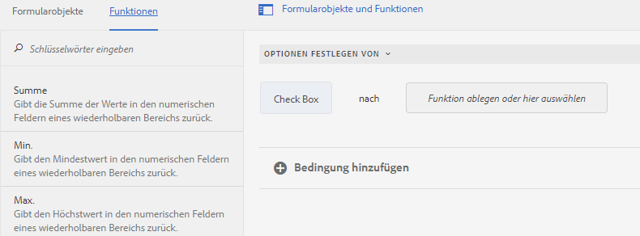

# Operatortypen und -ereignisse im Regeleditor eines auf Kernkomponenten basierendes adaptiven Formulars

In AEM Forms as a Cloud umfasst der Regeleditor verschiedene Operatortypen und -ereignisse, mit denen Sie komplexe Bedingungen und Aktionen einfach definieren und ausführen können.

Die im Regeleditor eines adaptiven Formulars verfügbaren Operatortypen bieten ein robustes Framework für die Erstellung präziser Bedingungen. Sie ermöglichen die logische und kohärente Manipulation von Daten, die Durchführung von Berechnungen und die Kombination mehrerer Bedingungen. Unabhängig davon, ob Sie Werte vergleichen, arithmetische Operationen durchführen oder Zeichenfolgen bearbeiten, stellen diese Operatoren sicher, dass Ihre Regeln flexibel und leistungsstark sind.

Ereignisse im Regeleditor dienen als Trigger, die Ihre Regeln aktivieren. Sie definieren die spezifischen Aktionen, die auftreten, wenn bestimmte Bedingungen erfüllt sind. Durch die Nutzung verschiedener Ereignistypen können Sie Antworten auf eine Vielzahl von Szenarien automatisieren, z. B. Benutzerinteraktionen, terminierte Zeiten, Änderungen der Daten und Systemzustände. Mit der Möglichkeit, diese Trigger anzugeben, können Sie dynamische und responsive Regeln erstellen, die Ihren spezifischen Anforderungen entsprechen.

Indem Sie die verfügbaren Operatortypen und -ereignisse verstehen und verwenden, können Sie das gesamte Potenzial des Regeleditors ausschöpfen, wodurch Sie effiziente und effektive Regeln erstellen können, die Ihren individuellen Anforderungen entsprechen und die Systemfunktionalität insgesamt verbessern.

## Verfügbare Typen von Operatoren und Ereignissen im Regeleditor {#available-operator-types-and-events-in-rule-editor}

Der Regeleditor bietet die folgenden logischen Operatoren und Ereignisse, mit deren Hilfe Sie Regeln erstellen können.

* **Ist gleich**
* **Ist nicht gleich**
* **Beginnt mit**
* **Endet mit**
* **Enthält**
* **enthält nicht**
* **Ist leer**
* **Ist nicht leer**
* **Hat ausgewählt:** Gibt „true“ zurück, wenn der Benutzer eine bestimmte Option für ein Kontrollkästchen, ein Dropdown-Element oder ein Optionsfeld auswählt.
* **Ist initialisiert (Ereignis):** Gibt „true“ zurück, wenn ein Formularobjekt im Browser dargestellt wird.
* **Wird geändert (Ereignis):** Gibt „true“ zurück, wenn der Benutzer den eingegebenen Wert oder die ausgewählte Option für ein Formularobjekt ändert.

<!--
* **Navigation(event):** Returns true when the user clicks a navigation object. Navigation objects are used to move between panels. 
* **Step Completion(event):** Returns true when a step of a rule completes.
* **Successful Submission(event):** Returns true on successful submission of data to a form data model.
* **Error in Submission(event):**  Returns true on unsuccessful submission of data to a form data model. -->

### Verfügbare Typen von Regeln im Regeleditor {#available-rule-types-in-rule-editor}

Der Regeleditor bietet eine Reihe vordefinierter Regeltypen, mit denen Sie Regeln schreiben können. Im Folgenden werden die einzelnen Regeltypen detailliert dargestellt. Weitere Informationen zum Schreiben von Regeln im Regeleditor finden Sie unter [Regeln schreiben](/help/forms/rule-editor-core-components-user-interface.md#write-rules).

#### [!UICONTROL Wenn] {#whenruletype}

Der **[!UICONTROL Wenn]**-Regeltyp nutzt das Konstrukt **Bedingung-Aktion-Alternative Aktion**, in manchen Fällen auch nur das Konstrukt **Bedingung-Aktion**. Für diesen Regeltyp geben Sie zunächst eine auszuwertende Bedingung an und dann eine Aktion, die ausgelöst werden soll, wenn die Bedingung erfüllt ist (`True`). Bei Einsatz der Wenn-Regel können Sie mehrere UND- und ODER-Operatoren verwenden, um [verschachtelte Ausdrücke](/help/forms/rule-editor-core-components-usecases.md#nested-expressions) zu erstellen.

Mit dem Wenn-Regeltyp können Sie eine Bedingung für ein Formularobjekt auswerten und Aktionen für ein oder mehrere Objekte ausführen.

Einfach ausgedrückt: Eine typische Wenn-Regel ist wie folgt aufgebaut:

`When on Object A:`

`(Condition 1 AND Condition 2 OR Condition 3) is TRUE;`

`Then, do the following:`

`Action 2 on Object B;`
`AND`
`Aktion 3 für Objekt C;

`Else, do the following:`

`Action 2 on Object C;`
_

Beim Erstellen einer Regel für Komponenten mit mehreren Werten (z. B. Optionsfelder oder Listen) werden die Optionen automatisch abgerufen und dem Regelersteller zur Verfügung gestellt. Sie müssen die Optionswerte nicht erneut eingeben.

Eine Liste hat beispielsweise vier Optionen: „Rot“, „Blau“, „Grün“ und „Gelb“. Beim Erstellen der Regel werden die Optionen (Optionsfelder) automatisch abgerufen und dem Regelersteller wie folgt zur Verfügung gestellt:

Beim Schreiben der Wenn-Regel können Sie die Aktion „Wert löschen von“ auslösen. Die Aktion „Wert löschen von“ löscht den Wert des angegebenen Objekts. Mit der Option Wert löschen von als Option in der Wenn-Anweisung können Sie komplexe Bedingungen mit mehreren Feldern erstellen. Sie können die Anweisung Else hinzufügen, um weitere Bedingungen hinzuzufügen.

>[!NOTE]
>
> Wenn der Regeltyp nur einstufige then-else -Anweisungen unterstützt.

##### Zulässige mehrere Felder in [!UICONTROL When] {#allowed-multiple-fields}

In der Bedingung **Wenn** haben Sie die Möglichkeit, neben dem Feld, auf das die Regel angewendet wird, weitere Felder hinzuzufügen.

Beispielsweise können Sie mithilfe des Wenn-Regeltyps eine Bedingung für verschiedene Formularobjekte auswerten und die folgende Aktion durchführen:

Wenn:

(Objekt A Bedingung 1)

UND/ODER

(Objekt B Bedingung 2)

Führen Sie dann die folgenden Schritte aus:

Aktion 1: Objekt A

_

**Überlegungen zur Verwendung von &quot;Zulässige mehrere Felder&quot;in der Funktion &quot;Wenn Bedingung&quot;**

* Stellen Sie sicher, dass die [Kernkomponente auf Version 3.0.14 oder höher](https://github.com/adobe/aem-core-forms-components) eingestellt ist, um diese Funktion im Regeleditor zu verwenden.
* Wenn Regeln auf verschiedene Felder in der Wenn-Bedingung angewendet werden, wird die Regel auch dann Trigger, wenn nur eines dieser Felder geändert wird.

<!--
* It is not possible to add multiple fields in the When condition while applying rules to a button.

##### To enable Allowed Multiple fields in When condition feature

Allowed Multiple fields in When condition feature is disabled by default. To enable this feature, add a custom property at the template policy:

1. Open the corresponding template associated with an Adaptive Form in the template editor.
1. Select the existing policy as **formcontainer-policy**.
1. Navigate to the **[!UICONTROL Structure]**  view and, from the **[!UICONTROL Allowed Components]** list, open the **[!UICONTROL Adaptive Forms Container]** policy.
1. Go to the **[!UICONTROL Custom Properties]** tab and to add a custom property, click **[!UICONTROL Add]**.
1. Specify the **Group Name** of your choice. For example, in our case, we added the group name as **allowedfeature**.
1. Add the **key** and **value** pair as follows:
   * key: fd:changeEventBehaviour
   * value: deps
1. Click **[!UICONTROL Done]**. -->

Wenn bei der Funktion Zulässige mehrere Felder in der Bedingung Wenn Probleme auftreten, führen Sie die Schritte zur Fehlerbehebung wie folgt aus:

1. Öffnen Sie das Formular im Bearbeitungsmodus.
1. Öffnen Sie den Inhaltsbrowser und wählen Sie die Komponente **[!UICONTROL Guide Container]** des adaptiven Formulars aus.
1. Klicken Sie auf das Symbol für die Guide-Container-Eigenschaften . Das Dialogfeld „Container für ein adaptives Formular“ wird geöffnet.
1. Klicken Sie auf Fertig und speichern Sie das Dialogfeld erneut.

**[!UICONTROL Ausblenden]**: Blendet das angegebene Objekt aus.

**[!UICONTROL Anzeigen]**: Blendet das angegebene Objekt ein.

**[!UICONTROL Aktivieren]**: Aktiviert das angegebene Objekt.

**[!UICONTROL Deaktivieren]**: Deaktiviert das angegebene Objekt.

**[!UICONTROL Dienst aufrufen]** Ruft einen Dienst auf, der in einem Formulardatenmodell (FDM) konfiguriert ist. Wenn Sie den Vorgang „Dienst aufrufen“ wählen, wird ein Feld angezeigt. Beim Antippen des Felds zeigt es sämtliche Dienste an, die in allen Formulardatenmodellen (FDM) in Ihrer [!DNL Experience Manager]-Instanz konfiguriert sind. Bei Auswahl eines Formulardatenmodell-Service werden weitere Felder eingeblendet, in denen Sie Formularobjekte mit Ein- und Ausgabeparametern für den angegebenen Service zuordnen können. Siehe die Beispielregel zum Aufrufen von Formulardatenmodell (FDM)-Diensten.

Zusätzlich zum Formulardatenmodelldienst können Sie eine direkte WSDL-URL angeben, um einen Webdienst aufzurufen. Ein Formulardatenmodell-Service hat jedoch viele Vorteile und stellt den empfohlenen Ansatz zum Aufrufen eines Service dar.

Weitere Informationen zum Konfigurieren von Diensten im Formulardatenmodell (FDM) finden Sie unter [[!DNL Experience Manager Forms] Datenintegration](data-integration.md).

**[!UICONTROL Wert festlegen]**: Berechnet den Wert des angegebenen Objekts und legt ihn fest. Sie können den Objektwert auf eine Zeichenfolge, den Wert eines anderen Objekts, den mithilfe eines mathematischen Ausdrucks oder einer Funktion berechneten Wert, den Wert einer Eigenschaft eines Objekts oder den Ausgabewert eines konfigurierten Formulardatenmodelldienstes setzen. Wenn Sie die Option „Web-Dienst“ wählen, werden sämtliche Dienste angezeigt, die in allen Formulardatenmodellen (FDM) in Ihrer [!DNL Experience Manager]-Instanz konfiguriert sind. Bei Auswahl eines Formulardatenmodell-Dienstes werden weitere Felder eingeblendet, in denen Sie Formularobjekte mit Ein- und Ausgabeparametern für den angegebenen Dienst zuordnen können.

Weitere Informationen zum Konfigurieren von Diensten im Formulardatenmodell (FDM) finden Sie unter [[!DNL Experience Manager Forms] Datenintegration](data-integration.md).

Mit dem Regeltyp **[!UICONTROL Eigenschaft festlegen]** können Sie den Wert einer Eigenschaft des angegebenen Objekts basierend auf einer Bedingungsaktion festlegen. Sie können die Eigenschaft auf einen der folgenden Werte festlegen:
* visible (Boolescher Wert)
* label.value (String)
* label.visible (Boolesch)
* description (String)
* aktiviert (Boolescher Wert)
* readOnly (Boolesch)
* required (Boolesch)
* screenReaderText (String)
* valid (Boolescher Wert)
* errorMessage (Zeichenfolge)
* default (Zahl, Zeichenfolge, Datum)
* enumNames (String[])
* chartType (Zeichenfolge)

So können Sie beispielsweise Regeln definieren, die das Textfeld anzeigen, wenn auf eine Schaltfläche geklickt wird. Sie können eine benutzerdefinierte Funktion, ein Formularobjekt, eine Objekteigenschaft oder eine Dienstausgabe verwenden, um eine Regel zu definieren.

Um eine Regel basierend auf einer benutzerdefinierten Funktion zu definieren, wählen Sie **[!UICONTROL Funktionsausgabe]** in der Dropdown-Liste aus und ziehen Sie eine benutzerdefinierte Funktion mittels Drag-and-Drop aus der Registerkarte **[!UICONTROL Funktionen]**. Wenn die Bedingungsaktion erfüllt ist, wird das Texteingabefeld angezeigt.

Um eine auf einem Formularobjekt basierende Regel zu definieren, wählen Sie **[!UICONTROL Formularobjekt]** in der Dropdown-Liste aus und ziehen Sie ein Formularobjekt mittels Drag-and-Drop aus der Registerkarte **[!UICONTROL Formularobjekte]**. Wenn die Bedingungsaktion erfüllt ist, wird das Texteingabefeld im adaptiven Formular angezeigt.

Mit einer auf einer Objekteigenschaft basierenden Regel Eigenschaft festlegen können Sie das Texteingabefeld in einem adaptiven Formular basierend auf einer anderen Objekteigenschaft im adaptiven Formular sichtbar machen.

Die folgende Abbildung zeigt ein Beispiel für die dynamische Aktivierung des Kontrollkästchens basierend auf dem Ausblenden oder Anzeigen eines Textfelds in einem adaptiven Formular:

**[!UICONTROL Wert löschen von]**: Löscht den Wert des angegebenen Objekts.

**[!UICONTROL Fokus festlegen]**: Legt den Fokus auf das angegebene Objekt.

**[!UICONTROL Formular senden]** Sendet das Formular.

**[!UICONTROL Zurücksetzen]** Setzt das Formular oder das angegebene Objekt zurück.

**[!UICONTROL Validieren]** Prüft das Formular oder das angegebene Objekt.

**[!UICONTROL Instanz hinzufügen]**: Fügt eine Instanz des angegebenen wiederholbaren Bereichs oder der Tabellenzeile hinzu.

**[!UICONTROL Instanz entfernen]**: Entfernt eine Instanz des angegebenen wiederholbaren Bereichs oder der Tabellenzeile.

**[!UICONTROL Funktionsausgabe]** Definiert eine Regel, die auf vordefinierten Funktionen oder benutzerdefinierten Funktionen basiert.

**[!UICONTROL Navigieren Sie zu]** Navigieren Sie zu anderen adaptiven Forms, anderen Assets wie Bildern oder Dokumentfragmenten oder einer externen URL. <!-- For more information, see [Add button to the Interactive Communication](create-interactive-communication.md#addbuttontothewebchannel). -->

**[!UICONTROL Dispatch-Ereignis]** : Trigger die spezifischen Aktionen oder Verhaltensweisen, die auf vordefinierten Bedingungen oder Ereignissen basieren.

#### [!UICONTROL Wert festlegen] {#set-value-of}

Regeln vom Typ **[!UICONTROL Wert festlegen]** ermöglichen es, den Wert eines Formularobjekts abhängig davon festzulegen, ob die angegebene Bedingung erfüllt ist oder nicht. Der Wert kann auf den Wert eines anderen Objekts, eine Literal-Zeichenfolge, einen von einem mathematischen Ausdruck oder einer Funktion abgeleiteten Wert, den Wert einer Eigenschaft eines anderen Objekts oder die Ausgabe eines Formulardatenmodell-Service festgelegt werden. In ähnlicher Weise können Sie auf eine Bedingung bei Komponenten, Zeichenfolgen, Eigenschaften oder Werten, die von Funktionen oder mathematischen Ausdrücken abgeleitet wurden, prüfen.

Der Regeltyp **Wert festlegen** steht für manche Formularobjekte nicht zur Verfügung (z. B. nicht für Bereiche und Schaltflächen von Symbolleisten). Eine standardmäßige Regel vom Typ „Wert festlegen“ hat die folgende Struktur:

Setzen Sie den Wert von Objekt A auf:

(String ABC) ODER
(Objekteigenschaft X des Objekts C) ODER
(Wert aus einer Funktion) ODER
(Wert aus einem mathematischen Ausdruck) ODER
(Ausgabewert eines Datenmodelldienstes);

When (optional):

(Condition 1 AND Condition 2 AND Condition 3) is TRUE;

Im folgenden Beispiel wird der Wert von `Question2` als `True` ausgewählt und der Wert von `Result` auf `correct` gesetzt.

Beispiel einer Regel zum Festlegen eines Werts mit dem Formulardatenmodelldienst.

#### [!UICONTROL Anzeigen] {#show}

Mithilfe des Regeltyps **[!UICONTROL Anzeigen]** können Sie eine Regel schreiben, die ein Formularobjekt je nachdem, ob eine Bedingung erfüllt ist oder nicht, anzeigt oder ausblendet. Der Regeltyp „Anzeigen“ löst auch die Aktion „Ausblenden“ aus, falls die Bedingung nicht erfüllt ist oder `False` zurückgibt.

Eine typische Regel vom Typ „Anzeigen“ ist wie folgt strukturiert:

`Show Object A;`

`When:`

`(Condition 1 OR Condition 2 OR Condition 3) is TRUE;`

`Else:`

`Hide Object A;`

#### [!UICONTROL Ausblenden] {#hide}

Regeln vom Typ **[!UICONTROL Ausblenden]** können ähnlich wie Regeln vom Typ „Anzeigen“ dazu verwendet werden, Formularobjekte je nachdem, ob eine Bedingung erfüllt ist oder nicht, anzuzeigen oder auszublenden. Der Regeltyp „Ausblenden“ löst auch die Aktion „Anzeigen“ aus, falls die Bedingung nicht erfüllt ist oder `False` zurückgibt.

Eine typische Regel vom Typ „Ausblenden“ ist wie folgt strukturiert:

`Hide Object A;`

`When:`

`(Condition 1 AND Condition 2 AND Condition 3) is TRUE;`

`Else:`

`Show Object A;`

#### [!UICONTROL Aktivieren] {#enable}

Mithilfe des Regeltyps **[!UICONTROL Aktivieren]** können Sie ein Formularobjekt in Abhängigkeit davon aktivieren oder deaktivieren, ob eine Bedingung erfüllt ist oder nicht. Der Regeltyp „Aktivieren“ löst auch die Aktion „Deaktivieren“ aus, falls die Bedingung nicht erfüllt ist oder `False` zurückgibt.

Eine typische Regel vom Typ „Aktivieren“ ist wie folgt strukturiert:

`Enable Object A;`

`When:`

`(Condition 1 AND Condition 2 AND Condition 3) is TRUE;`

`Else:`

`Disable Object A;`

#### [!UICONTROL Deaktivieren] {#disable}

Regeln vom Typ **[!UICONTROL Deaktivieren]** können ähnlich wie Regeln vom Typ „Aktivieren“ dazu verwendet werden, Formularobjekte in Abhängigkeit davon, ob eine Bedingung erfüllt ist oder nicht, zu aktivieren oder zu deaktivieren. Der Regeltyp „Deaktivieren“ löst auch die Aktion „Aktivieren“ aus, falls die Bedingung nicht erfüllt ist oder `False` zurückgibt.

Eine typische Regel vom Typ „Deaktivieren“ ist wie folgt strukturiert:

`Disable Object A;`

`When:`

`(Condition 1 OR Condition 2 OR Condition 3) is TRUE;`

`Else:`

`Enable Object A;`

#### [!UICONTROL Validieren] {#validate}

Regeln vom Typ **[!UICONTROL Validieren]** überprüfen den Wert in einem Feld mithilfe eines Ausdrucks. Sie können beispielsweise einen Ausdruck schreiben, um zu überprüfen, ob das Textfeld zur Angabe eines Namens keine Sonderzeichen oder Zahlen enthält.

Eine typische Regel vom Typ „Validieren“ ist wie folgt strukturiert:

`Validate Object A;`

`Using:`

`(Expression 1 AND Expression 2 AND Expression 3) is TRUE;`

>[!NOTE]
>
>Wenn der angegebene Wert nicht der Validierungsregel entspricht, können Sie eine Validierungsmeldung für die Benutzenden anzeigen lassen. Sie können die Meldung im Feld **[!UICONTROL Skriptüberprüfungsmeldung]** in den Komponenteneigenschaften in der Seitenleiste angeben.

#### [!UICONTROL Zwischen den Bedienfeldern navigieren]

Mit dem Regeltyp **[!UICONTROL Zwischen Bedienfeldern navigieren]** können Sie den Fokus auf verschiedene Bedienfelder in einem Formular verschieben. Sie können beispielsweise einen Ausdruck erstellen, um den Fokus auf den nächsten Bereich zu verschieben.

Eine typische **Navigieren zwischen den Bedienfeldern** -Regel zum Verschieben des Fokus auf den nächsten Bereich ist wie folgt strukturiert:

`Navigate among the panels`

`Shift focus to the next item Object A;`

`When:`

`(Condition 1 OR Condition 2 OR Condition 3) is TRUE;`

Auf ähnliche Weise können Sie die Regel **Navigieren zwischen den Bedienfeldern** schreiben, um den Fokus auf das vorherige Bedienfeld zu verschieben:

`Navigate among the panels`

`Shift focus to the previous item Object A;`

`When:`

`(Condition 1 OR Condition 2 OR Condition 3) is TRUE;`

Weitere Informationen zum Erstellen einer Regel für die Navigation in einem Bedienfeld finden Sie unter [Klicken Sie hier](/help/forms/rule-editor-core-components-usecases.md#navigating-between-panels-using-buttons).

#### [!UICONTROL Async-Funktionsaufruf]

 Dies ist eine Vorabveröffentlichungsfunktion, auf die über unseren [Vorabveröffentlichungskanal](https://experienceleague.adobe.com/docs/experience-manager-cloud-service/content/release-notes/prerelease.html?lang=de#new-features) zugegriffen werden kann. 

Mit dem Regeltyp **[!UICONTROL Async Function call]** können Sie asynchrone Funktionen ausführen. Dadurch können Sie einen Funktionsaufruf starten, der unabhängig vom Haupt-Ausführungs-Thread ausgeführt wird, sodass andere Prozesse fortgesetzt werden können, ohne auf den Abschluss der asynchronen Funktion zu warten.

Eine typische Regel für einen asynchronen Funktionsaufruf zum Ausführen der asynchronen Funktion ist wie folgt strukturiert:

`When:`

`(Condition 1 OR Condition 2 OR Condition 3) is TRUE;`

`Async Function call`

`[Callback Function];`

Weitere Informationen zur Verwendung des Aufrufs Async-Funktion im Visual Rule Editor finden Sie im Artikel [Verwenden asynchroner Funktionsaufrufe im Regeleditor](/help/forms/using-async-funct-in-rule-editor.md) .

<!--
### [!UICONTROL Set Options Of] {#setoptionsof}

The **[!UICONTROL Set Options Of]** rule type enables you to define rules to add check boxes dynamically to the Adaptive Form. You can use a Form Data Model or a custom function to define the rule.

To define a rule based on a custom function, select **[!UICONTROL Function Output]** from the drop-down list, and drag-and-drop a custom function from the **[!UICONTROL Functions]** tab. The number of checkboxes defined in the custom function are added to the Adaptive Form.

To create a custom function, see [custom functions in rule editor](#custom-functions).

To define a rule based on a form data model:

1. Select **[!UICONTROL Service Output]** from the drop-down list.
1. Select the data model object.
1. Select a data model object property from the **[!UICONTROL Display Value]** drop-down list. The number of checkboxes in the Adaptive Form is derived from the number of instances defined for that property in the database.
1. Select a data model object property from the **[!UICONTROL Save Value]** drop-down list.

 -->

## Nächster Schritt

Im Folgenden werden verschiedene [Beispiele für einen Regeleditor für ein adaptives Formular basierend auf Kernkomponenten](/help/forms/rule-editor-core-components-usecases.md) erläutert.

## Siehe auch

{{see-also-rule-editor}}
