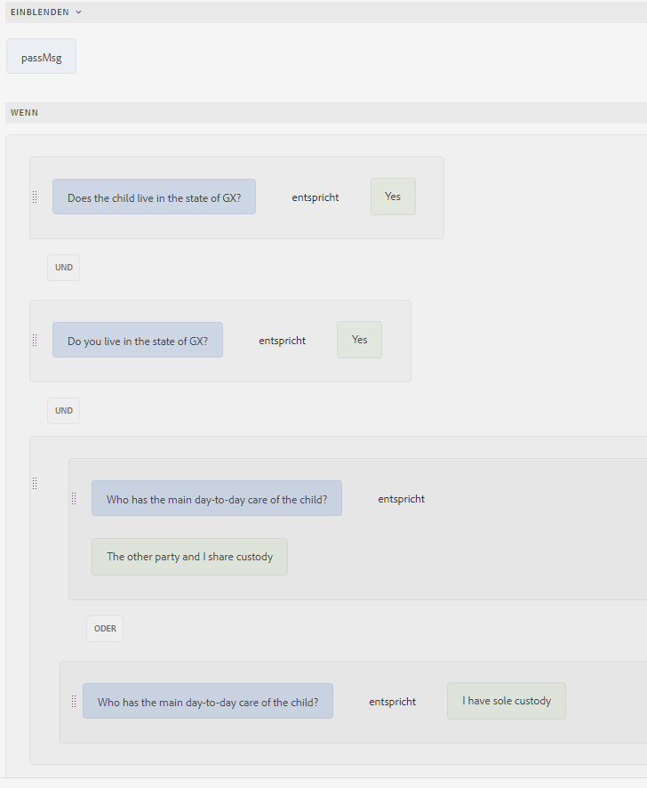
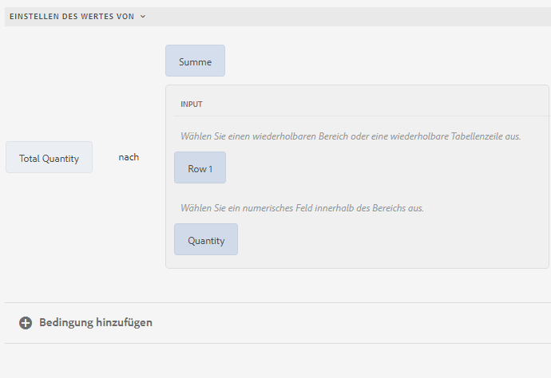

# Verschiedene Anwendungsfälle des Regeleditors

Der Artikel enthält ausführliche Beispiele für einen Regeleditor für ein adaptives Formular, das auf Kernkomponenten basiert, und bietet Einblicke in seine ordnungsgemäße Implementierung für verschiedene Szenarien. Mit dem Regeleditor können Entwickler die Logik definieren und verwalten, die das Verhalten von Formularen steuert.
Lassen Sie uns nun die verschiedenen Implementierungen für einen Regeleditor besprechen.

## Fokus auf ein anderes Bedienfeld legen, wenn beim Klicken auf die Schaltfläche das erste Bedienfeld gültig ist

 Dies ist eine Vorabveröffentlichungsfunktion, auf die über unseren [Vorabveröffentlichungskanal](https://experienceleague.adobe.com/docs/experience-manager-cloud-service/content/release-notes/prerelease.html?lang=de#new-features) zugegriffen werden kann. 

Mit dem Regeleditor können Sie Bereichslayouts wie horizontale Registerkarten, vertikale Registerkarten, Akkordeons oder Assistenten beim Klicken auf eine Schaltfläche überprüfen und den Fokus auf ein Formularobjekt in einem anderen Bereich setzen. Sie können diese Funktion verwenden, um die Formularnavigation und das Benutzererlebnis zu verbessern.

Stellen Sie sich ein mehrstufiges Anwendungsformular mit einem Assistenten-Layout vor. Sie müssen das Bedienfeld `Personal Information` ausfüllen, bevor Sie zu `Employment Details` wechseln. Wenn Sie auf die Schaltfläche `Next` klicken, validiert der Regeleditor das `Personal Information`. Wenn alle erforderlichen Felder korrekt ausgefüllt sind, verlagert das Formular automatisch den Fokus auf das `Employment Details`. Andernfalls wird eine Fehlermeldung angezeigt, die Benutzer auffordert, die fehlenden Felder auszufüllen.

Sie können auf der Schaltfläche `Next` eine Regel erstellen, um das erste Bedienfeld zu validieren:

{width=50%}

Wenn Sie auf die Schaltfläche **Weiter** klicken, wird das Bedienfeld **Persönliche Informationen** validiert. Wenn die eingegebenen Details korrekt sind, wird der Fokus auf das Bedienfeld **Kontosicherheit** verschoben. Andernfalls werden Sie durch eine Fehlermeldung aufgefordert, die fehlenden Details auszufüllen.

>[!VIDEO](https://video.tv.adobe.com/v/3457767)

## Navigieren zwischen Bedienfeldern mithilfe einer Schaltfläche

Mit dem Regeleditor können Sie Bedienfeld-Layouts Navigationsschaltflächen hinzufügen, z. B. horizontale Registerkarten, vertikale Registerkarten, Akkordeons oder Assistenten. Diese Schaltflächen verbessern das Benutzererlebnis, indem sie die Übergänge zwischen verschiedenen Bedienfeldern in einem Formular vereinfachen und den Fokus auf das ausgewählte Bedienfeld verschieben.

Angenommen, Sie interagieren mit dem Abschnitt Profileinstellungen einer Anwendung, in dem die Navigation durch Schaltflächen anstelle von Registerkarten erleichtert wird. Beim Eingeben der Profileinstellungen über das Haupt-Dashboard werden Sie mit einer Reihe von Bedienfeldern konfrontiert, die verschiedenen Aspekten ihres Profils gewidmet sind: **Persönliche**, **Kontosicherheit** und **Benachrichtigungseinstellungen**.

Jedes Bedienfeld enthält relevante Felder und Optionen zum Aktualisieren bestimmter Informationen. Navigationsschaltflächen, wie `Next` und `Back`, sind gut sichtbar platziert, sodass Sie zwischen diesen Bereichen wechseln können. Klicken Sie auf `Next` , um den Benutzer zum Bedienfeld **Kontosicherheit** zu leiten, und klicken Sie auf `Back` , um zum Bedienfeld **Persönliche Informationen** zurückzukehren. Diese Navigationsmethode sorgt für einen nahtlosen Übergang zwischen Abschnitten, ohne den Kontext zu verlieren, und bietet ein reibungsloses und intuitives Benutzererlebnis. Die Verwendung von Navigationsschaltflächen vereinfacht die Verwaltung von Profileinstellungen und macht die Interaktion übersichtlicher und benutzerfreundlicher.

Sie können die `Navigate among the panels` verwenden, um Navigationsregeln für Schaltflächen zu erstellen, die das Wechseln zwischen verschiedenen Bedienfeldern ermöglichen.  Wählen Sie das Attribut `Shift focus to the next item` aus, um den Fokus auf den nächsten Bereich im Layout zu verschieben.

{width=50%}

Wenn Sie auf die Schaltfläche `Next` klicken, wechselt der Fokus zum nachfolgenden Bereich im Layout.

Auf ähnliche Weise können Sie eine Regel für die Schaltfläche `Previous` erstellen, um den Fokus auf das vorherige Bedienfeld zu verschieben.

{width=50%}

## Optimierung komplexer Berechnungen in wiederholbaren Bereichen mit Funktionen

Mit dem Regeleditor können Sie vordefinierte Funktionen wie Summe, Min, Max und Zusammenführen direkt für Felder in wiederholbaren Bereichen verwenden. Sie können auch einen wiederholbaren Bereichsfeldwert an die Funktion übergeben, die ein Zahlen-Array, ein Zeichenfolgen-Array, ein boolesches Array usw. akzeptiert. Dies ermöglicht eine leistungsstarke Automatisierung, sodass Sie komplexe Geschäftslogik ohne benutzerdefinierten Code implementieren können.

Stellen Sie sich ein Formular mit einem wiederholbaren Bereich vor, in dem jede Bereichsinstanz Informationen über den deklarierten Wert von Assets erfasst.

Mit der Funktion `Sum` können Sie den Gesamtwert der Assets für alle Bedienfelder automatisch berechnen, sodass keine manuellen Berechnungen mehr erforderlich sind und das Fehlerpotenzial reduziert wird.

Wenn Sie ein Formular ausfüllen und Instanzen hinzufügen, um die Asset-Werte zu deklarieren, berechnet die Schaltfläche &quot;`Calculate Asset Value`&quot; die Gesamtsumme aller deklarierten Asset-Werte und zeigt das Ergebnis in der Summe `assetvalue` Textfeld an.

>[!NOTE]
>
> Wenn der Wert des wiederholbaren Bereichsfelds an eine Funktion übergeben wird, die kein Array akzeptiert, wird der Feldwert aus der letzten Instanz des wiederholbaren Bereichs an die Funktion übergeben.

Dies ist nur ein Beispiel! Erkunden Sie die verfügbaren [Funktionen](#b-form-objects-and-functions-br), um Workflows zu vereinfachen und die Datengenauigkeit in Ihren Formularen zu verbessern.

## Verschachtelte Ausdrücke {#nestedexpressions}

Mit dem Regeleditor können Sie mehrere UND- und ODER-Operatoren verwenden, um verschachtelte Regeln zu erstellen. Sie können mehrere UND- und ODER-Operatoren in den Regeln mischen.

Im Folgenden finden Sie ein Beispiel für eine verschachtelte Regel, die dem Benutzer eine Meldung über den Anspruch auf das Sorgerecht für ein Kind anzeigt, wenn die erforderlichen Bedingungen erfüllt sind.

Sie können Bedingungen innerhalb einer Regel auch mittels Drag-and-Drop ziehen, um sie zu bearbeiten. Wählen Sie den Ziehgriff vor einer Bedingung aus und bewegen Sie den Mauszeiger über den Griff (). Sobald sich der Zeiger wie unten gezeigt in das Handsymbol verwandelt, ziehen Sie die Bedingung per Drag &amp; Drop an eine beliebige Stelle innerhalb der Regel. Die Regelstruktur ändert sich.

## Bedingungen für Datumsausdrücke {#dateexpression}

Im Regeleditor können Sie Datenvergleiche verwenden, um Bedingungen zu erstellen.

Im Folgenden finden Sie eine Beispielbedingung, die ein statisches Textobjekt anzeigt, wenn die Hypothek für das Haus bereits abgeschlossen ist, was der Benutzer durch Ausfüllen des Datumsfelds angibt.

Wenn das vom Benutzer eingetragene Datum der Hypothek in der Vergangenheit liegt, wird im adaptiven Formular ein Hinweis über die Einkommensberechnung angezeigt. Die folgende Regel vergleicht das Datum, das vom Benutzer eingetragen wurde, mit dem aktuellen Datum. Wenn dieses Datum vor dem aktuellen Datum liegt, zeigt das Formular die Textmeldung (mit der Bezeichnung „Einkommen“) an.

Wenn das eingetragene Datum vor dem aktuellen Datum liegt, zeigt das Formular die Textmeldung (Einkommen) an, wie hier dargestellt:

## Bedingungen für den Vergleich von Zahlen {#number-comparison-conditions}

Im Regeleditor können Sie Bedingungen erstellen, die zwei Zahlen vergleichen.

Nachfolgend ist eine Beispielbedingung dargestellt, die ein statisches Textobjekt anzeigt, wenn die Anzahl der Monate, die ein aktueller Benutzer schon an seiner gegenwärtigen Adresse wohnt, kleiner als 36 ist.

Wenn der Benutzer angibt, dass er seit weniger als 36 Monaten an seiner derzeitigen Adresse wohnt, wird im Formular ein Hinweis angezeigt, dass ein zusätzlicher Aufenthaltsnachweis erforderlich ist.

<!-- ## Impact of rule editor on existing scripts {#impact-of-rule-editor-on-existing-scripts}

In [!DNL Experience Manager Forms] versions prior to [!DNL Experience Manager 6.1 Forms] feature pack 1, form authors and developers used to write expressions in the Scripts tab of the Edit component dialog to add dynamic behavior to Adaptive Forms. The Scripts tab is now replaced by the rule editor.

Any scripts or expressions that you must have written in the Scripts tab are available in the rule editor. While you cannot view or edit them in visual editor, if you are a part of the forms-power-users group you can edit scripts in code editor. -->

### Aufrufen des Formulardatenmodell-Service {#invoke}

Stellen Sie sich einen Webservice `GetInterestRates` vor, der den Darlehensbetrag, die Beschäftigungsdauer und die Kreditwürdigkeit des Antragstellers als Eingabe entgegennimmt und einen Darlehensplan einschließlich EMI-Betrag und Zinssatz zurückgibt. Sie erstellen ein Formulardatenmodell (FDM), indem Sie den Web-Dienst als Datenquelle verwenden. Sie fügen dem Formularmodell Datenmodellobjekte und einen `get`-Dienst hinzu. Der Dienst wird auf der Registerkarte „Dienste“ des Formulardatenmodells (FDM) angezeigt. Erstellen Sie dann ein adaptives Formular, das Felder aus Datenmodellobjekten enthält, um Benutzereingaben für Darlehensbetrag, Beschäftigungsdauer und Kreditwürdigkeit zu erfassen. Fügen Sie eine Schaltfläche hinzu, die den Webservice auslöst, um Plandetails abzurufen. Die Ausgabe wird in den entsprechenden Feldern befüllt.

Die folgende Regel zeigt, wie Sie die Aktion „Service aufrufen“ konfigurieren, um das Beispielszenario durchzuführen.

>[!NOTE]
>
>Wenn die Eingabe vom Typ „Array“ ist, sind die Felder, die Arrays unterstützen, im Dropdown-Abschnitt „Ausgabe“ sichtbar.

### Auslösen mehrerer Aktionen mithilfe einer Wenn-Regel {#triggering-multiple-actions-using-the-when-rule}

Sie möchten in einem Kreditantrag erfassen, ob dieser von einer Bestandskundin oder einem Bestandskunden gestellt wurde. Basierend auf den Informationen, die der Benutzer bereitstellt, sollte das Feld „Kunden-ID“ ein- oder ausgeblendet werden. Darüber hinaus soll der Fokus auf das Feld für die Kunden-ID gelegt werden, wenn es sich um eine Bestandskundin oder einen Bestandskunden handelt. Der Kreditantrag umfasst die folgenden Komponenten:

* Ein Optionsfeld **[!UICONTROL Sind Sie bereits Geometrixx-Kunde?]**, das die Optionen [!UICONTROL Ja] und [!UICONTROL Nein] anbietet. Der Wert für „Ja“ ist **0**, und der Wert „Nein“ ist **1**.

* Das Textfeld **[!UICONTROL Geometrixx-Kunden-ID]** zur Angabe der Kunden-ID.

Wenn Sie eine Wenn-Regel für das Optionsfeld schreiben, um dieses Verhalten zu implementieren, wird die Regel wie folgt im visuellen Regeleditor angezeigt.

In der Beispielregel ist die Anweisung im Abschnitt „Wenn“ die Bedingung. Wenn diese „True“ zurückgibt, werden die im Abschnitt „Dann“ angegebenen Aktionen ausgeführt.

<!-- The rule appears as follows in the code editor.

 

Rule in the code editor -->

### Verwenden einer Funktionsausgabe in einer Regel {#using-a-function-output-in-a-rule}

Ein Bestellformular enthält die folgende Tabelle, in der Benutzer ihre Bestellungen eingeben. In dieser Tabelle gilt:

* Die erste Zeile ist wiederholbar, sodass Benutzende mehrere Produkte bestellen und unterschiedliche Mengen angeben können. Ihr Elementname ist `Row1`.
* Der Titel der Zelle in der Spalte „Produktmenge“ der wiederholbaren Zeile lautet „Menge“. Der Elementname für diese Zelle lautet `productquantity`.
* Die zweite Zeile in der Tabelle ist nicht wiederholbar, und der Titel der Zelle in der Spalte „Produktmenge“ in dieser Zeile lautet „Menge insgesamt“.

**A.** Zeile 1 **B.** Menge **C.** Menge insgesamt

Als Nächstes sollen die in der Spalte „Produktmenge“ angegebenen Mengen für alle Produkte addiert und die Summe in der Zelle „Menge insgesamt“ angezeigt werden. Dies erreichen Sie, indem Sie für die Zelle „Menge insgesamt“ wie nachfolgend gezeigt eine Regel vom Typ „Wert festlegen“ schreiben.

### Validieren eines Feldwerts mithilfe eines Ausdrucks {#validating-a-field-value-using-expression}

Sie möchten verhindern, dass der Benutzer in dem im vorherigen Beispiel erläuterten Bestellformular mehr als eine Menge eines Produkts bestellt, dessen Preis über 10000 liegt. Um dies zu erreichen, können Sie wie unten gezeigt eine Validierungsregel schreiben.

## Siehe auch

{{see-also-rule-editor}}
