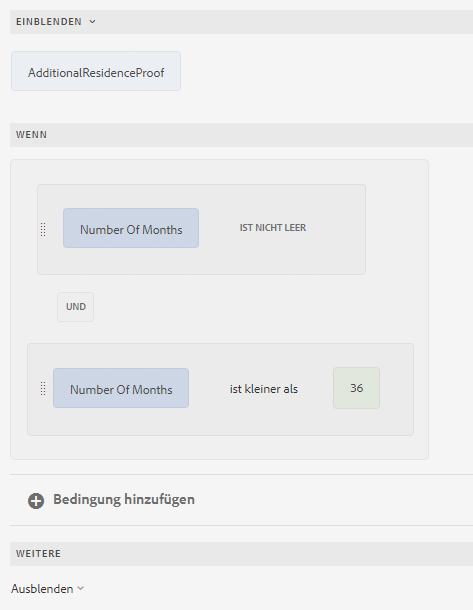
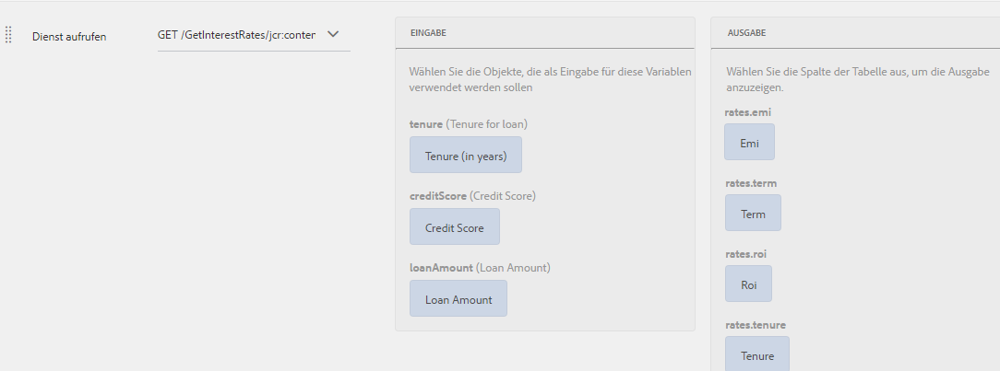

# Verschiedene Anwendungsfälle des Regeleditors

Der Artikel enthält detaillierte Beispiele für einen Regeleditor für ein adaptives Formular, das auf Kernkomponenten basiert und Einblicke in die ordnungsgemäße Implementierung für verschiedene Szenarien bietet. Mit dem Regeleditor können Entwickler die Logik definieren und verwalten, die das Verhalten von Formularen steuert.
Lassen Sie uns nun die verschiedenen Implementierungen für einen Regeleditor besprechen.

## Navigieren zwischen Bedienfeldern mithilfe der Schaltfläche

Mit dem Regeleditor können Sie Navigationsschaltflächen zu Ihren Bedienfeldlayouts hinzufügen, z. B. Horizontale Registerkarten, Vertikale Registerkarten, Akkordeons oder Assistent. Diese Schaltflächen verbessern das Benutzererlebnis, indem sie die Übergänge zwischen verschiedenen Bedienfeldern in einem Formular vereinfachen und den Fokus auf das ausgewählte Bedienfeld verschieben.

Stellen Sie sich vor, Sie interagieren mit dem Profileinstellungsabschnitt einer Anwendung, in dem die Navigation durch Schaltflächen und nicht durch Registerkarten erleichtert wird. Nach Eingabe der Profileinstellungen aus dem Haupt-Dashboard wird eine Reihe von Bedienfeldern angezeigt, die verschiedenen Aspekten ihres Profils gewidmet sind: **Persönliche Informationen**, **Kontosicherheit** und **Benachrichtigungseinstellungen**.

Jedes Bedienfeld enthält relevante Felder und Optionen zum Aktualisieren bestimmter Informationen. Navigationsschaltflächen wie `Next` und `Back` sind hervorgehoben platziert und ermöglichen den Wechsel zwischen diesen Bedienfeldern. Klicken Sie auf `Next` , um den Benutzer zum Bereich **Kontosicherheit** zu leiten, und klicken Sie auf `Back` , um zum Bereich **Persönliche Informationen** zurückzukehren. Diese Navigationsmethode gewährleistet einen nahtlosen Übergang zwischen Abschnitten, ohne den Kontext zu verlieren, und sorgt so für ein reibungsloses und intuitives Benutzererlebnis. Die Verwendung von Navigationsschaltflächen vereinfacht die Verwaltung von Profileinstellungen, wodurch die Interaktion besser organisiert und benutzerfreundlicher wird.

Sie können die Regel `Navigate among the panels` verwenden, um Navigationsregeln für Schaltflächen zu erstellen, die den Wechsel zwischen verschiedenen Bereichen ermöglichen.  Wählen Sie das Attribut `Shift focus to the next item` aus, um den Fokus auf das nächste Bedienfeld im Layout zu verschieben.

{width=50%}

Wenn auf die Schaltfläche &quot;`Next`&quot; geklickt wird, wird der Fokus auf den nachfolgenden Bereich im Layout verschoben.

Auf ähnliche Weise können Sie eine Regel für die Schaltfläche `Previous` erstellen, um den Fokus auf das vorherige Bedienfeld zu verschieben.

{width=50%}

## Optimieren komplexer Berechnungen in wiederholbaren Bereichen mit Funktionen

Mit dem Regeleditor können Sie native Funktionen wie Summe, Minimum, Maximum und Verbinden direkt für Felder in wiederholbaren Bereichen verwenden. Sie können auch einen wiederholbaren Bereichsfeldwert an die Funktion übergeben, die Zahlenarray, Zeichenfolgen-Array, boolesches Array usw. akzeptiert. Dadurch wird eine leistungsstarke Automatisierung freigesetzt, sodass Sie komplexe Geschäftslogik ohne benutzerdefinierten Code implementieren können.

Stellen Sie sich ein Formular mit einem wiederholbaren Bedienfeld vor, in dem jede Bedienfeldinstanz Informationen über den deklarierten Wert von Assets erfasst.

Mit der Funktion &quot;`Sum`&quot;können Sie den Gesamtwert der Assets in allen Bedienfeldern automatisch berechnen, sodass keine manuellen Berechnungen mehr erforderlich sind und das Fehlerpotenzial verringert wird.

Wenn Sie ein Formular ausfüllen und Instanzen zum Deklarieren der Asset-Werte hinzufügen, berechnet die Schaltfläche `Calculate Asset Value` die Gesamtsumme aller deklarierten Asset-Werte und zeigt das Ergebnis im Textfeld `assetvalue` insgesamt an.

>[!NOTE]
>
> Wenn der Wert des wiederholbaren Bereichsfelds an eine Funktion übergeben wird, die kein Array akzeptiert, wird der Feldwert aus der letzten Instanz des wiederholbaren Bereichs an die Funktion übergeben.

Das ist nur ein Beispiel! Erkunden Sie die verfügbaren [Funktionen](#b-form-objects-and-functions-br), um Workflows zu vereinfachen und die Datengenauigkeit in Ihren Formularen zu verbessern.

## Verschachtelte Ausdrücke {#nestedexpressions}

Mit dem Regeleditor können Sie mehrere UND- und ODER-Operatoren verwenden, um verschachtelte Regeln zu erstellen. Sie können mehrere UND- und ODER-Operatoren in den Regeln kombinieren.

Im Folgenden finden Sie ein Beispiel für eine verschachtelte Regel, die dem Benutzer eine Nachricht über die Berechtigung zum Sorgerecht für ein Kind anzeigt, wenn die erforderlichen Bedingungen erfüllt sind.

Sie können Bedingungen innerhalb einer Regel auch mittels Drag-and-Drop ziehen, um sie zu bearbeiten. Wählen Sie den Ziehgriff vor einer Bedingung aus und bewegen Sie den Mauszeiger über den Griff (). Sobald sich der Zeiger wie unten gezeigt in das Handsymbol verwandelt, ziehen Sie die Bedingung per Drag &amp; Drop an eine beliebige Stelle innerhalb der Regel. Die Regelstruktur ändert sich.

## Bedingungen für Datumsausdrücke {#dateexpression}

Im Regeleditor können Sie Datenvergleiche verwenden, um Bedingungen zu erstellen.

Im Folgenden finden Sie eine Beispielbedingung, die ein statisches Textobjekt anzeigt, wenn die Hypothek auf das Haus bereits aufgenommen wurde, was der Benutzer durch Ausfüllen des Datumsfelds angibt.

Wenn das vom Benutzer eingetragene Datum der Hypothek in der Vergangenheit liegt, wird im adaptiven Formular ein Hinweis über die Einkommensberechnung angezeigt. Die folgende Regel vergleicht das Datum, das vom Benutzer eingetragen wurde, mit dem aktuellen Datum. Wenn dieses Datum vor dem aktuellen Datum liegt, zeigt das Formular die Textmeldung (mit der Bezeichnung „Einkommen“) an.

Wenn das eingetragene Datum vor dem aktuellen Datum liegt, zeigt das Formular die Textmeldung (Einkommen) an, wie hier dargestellt:

## Bedingungen für den Vergleich von Zahlen {#number-comparison-conditions}

Im Regeleditor können Sie Bedingungen erstellen, die zwei Zahlen vergleichen.

Nachfolgend ist eine Beispielbedingung dargestellt, die ein statisches Textobjekt anzeigt, wenn die Anzahl der Monate, die ein aktueller Benutzer schon an seiner gegenwärtigen Adresse wohnt, kleiner als 36 ist.

Wenn der Benutzer angibt, dass er seit weniger als 36 Monaten an seiner derzeitigen Adresse wohnt, wird im Formular ein Hinweis angezeigt, dass ein zusätzlicher Aufenthaltsnachweis erforderlich ist.

<!-- ## Impact of rule editor on existing scripts {#impact-of-rule-editor-on-existing-scripts}

In [!DNL Experience Manager Forms] versions prior to [!DNL Experience Manager 6.1 Forms] feature pack 1, form authors and developers used to write expressions in the Scripts tab of the Edit component dialog to add dynamic behavior to Adaptive Forms. The Scripts tab is now replaced by the rule editor.

Any scripts or expressions that you must have written in the Scripts tab are available in the rule editor. While you cannot view or edit them in visual editor, if you are a part of the forms-power-users group you can edit scripts in code editor. -->

### Aufrufen des Formulardatenmodell-Service {#invoke}

Stellen Sie sich einen Webservice `GetInterestRates` vor, der den Darlehensbetrag, die Beschäftigungsdauer und die Kreditwürdigkeit des Antragstellers als Eingabe entgegennimmt und einen Darlehensplan einschließlich EMI-Betrag und Zinssatz zurückgibt. Sie erstellen ein Formulardatenmodell (FDM), indem Sie den Web-Dienst als Datenquelle verwenden. Sie fügen dem Formularmodell Datenmodellobjekte und einen `get`-Dienst hinzu. Der Dienst wird auf der Registerkarte „Dienste“ des Formulardatenmodells (FDM) angezeigt. Erstellen Sie dann ein adaptives Formular, das Felder aus Datenmodellobjekten enthält, um Benutzereingaben für Darlehensbetrag, Beschäftigungsdauer und Kreditwürdigkeit zu erfassen. Fügen Sie eine Schaltfläche hinzu, die den Webservice auslöst, um Plandetails abzurufen. Die Ausgabe wird in den entsprechenden Feldern befüllt.

Die folgende Regel zeigt, wie Sie die Aktion „Service aufrufen“ konfigurieren, um das Beispielszenario durchzuführen.

>[!NOTE]
>
>Wenn die Eingabe vom Typ „Array“ ist, sind die Felder, die Arrays unterstützen, im Dropdown-Abschnitt „Ausgabe“ sichtbar.

### Auslösen mehrerer Aktionen mithilfe einer Wenn-Regel {#triggering-multiple-actions-using-the-when-rule}

Sie möchten in einem Kreditantrag erfassen, ob dieser von einer Bestandskundin oder einem Bestandskunden gestellt wurde. Basierend auf den Informationen, die der Benutzer bereitstellt, sollte das Feld Kunden-ID ein- oder ausgeblendet werden. Darüber hinaus soll der Fokus auf das Feld für die Kunden-ID gelegt werden, wenn es sich um eine Bestandskundin oder einen Bestandskunden handelt. Der Kreditantrag umfasst die folgenden Komponenten:

* Ein Optionsfeld **[!UICONTROL Sind Sie bereits Geometrixx-Kunde?]**, das die Optionen [!UICONTROL Ja] und [!UICONTROL Nein] anbietet. Der Wert für „Ja“ ist **0**, und der Wert „Nein“ ist **1**.

* Das Textfeld **[!UICONTROL Geometrixx-Kunden-ID]** zur Angabe der Kunden-ID.

Wenn Sie eine Wenn-Regel für das Optionsfeld schreiben, um dieses Verhalten zu implementieren, wird die Regel wie folgt im visuellen Regeleditor angezeigt.

In der Beispielregel ist die Anweisung im Abschnitt „Wenn“ die Bedingung. Wenn diese „True“ zurückgibt, werden die im Abschnitt „Dann“ angegebenen Aktionen ausgeführt.

<!-- The rule appears as follows in the code editor.

 

Rule in the code editor -->

### Verwenden einer Funktionsausgabe in einer Regel {#using-a-function-output-in-a-rule}

Ein Bestellformular enthält die folgende Tabelle, in der Benutzer ihre Bestellungen eingeben. In dieser Tabelle gilt:

* Die erste Zeile ist wiederholbar, sodass Benutzende mehrere Produkte bestellen und unterschiedliche Mengen angeben können. Ihr Elementname ist `Row1`.
* Der Titel der Zelle in der Spalte &quot;Produktmenge&quot;der wiederholbaren Zeile ist &quot;Menge&quot;. Der Elementname für diese Zelle lautet `productquantity`.
* Die zweite Zeile in der Tabelle ist nicht wiederholbar und der Titel der Zelle in der Spalte &quot;Produktmenge&quot;in dieser Zeile ist Gesamtmenge.

**A.** Zeile 1 **B.** Menge **C.** Menge insgesamt

Als Nächstes sollen die in der Spalte „Produktmenge“ angegebenen Mengen für alle Produkte addiert und die Summe in der Zelle „Menge insgesamt“ angezeigt werden. Dies erreichen Sie, indem Sie für die Zelle „Menge insgesamt“ wie nachfolgend gezeigt eine Regel vom Typ „Wert festlegen“ schreiben.

### Validieren eines Feldwerts mithilfe eines Ausdrucks {#validating-a-field-value-using-expression}

Im im vorherigen Beispiel erläuterten Bestellformular möchten Sie den Benutzer daran hindern, mehr als eine Menge eines Produkts zu bestellen, das über 10000 verkauft wird. Um dies zu erreichen, können Sie wie unten gezeigt eine Validierungsregel schreiben.

## Siehe auch

{{see-also-rule-editor}}
