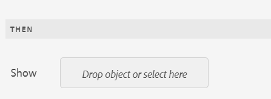
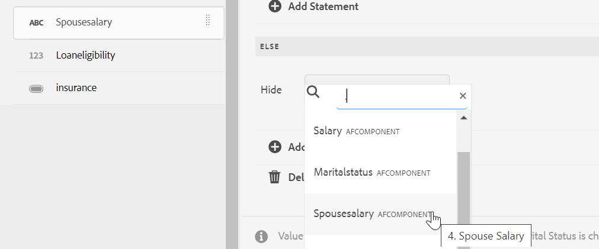
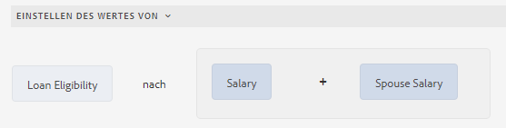
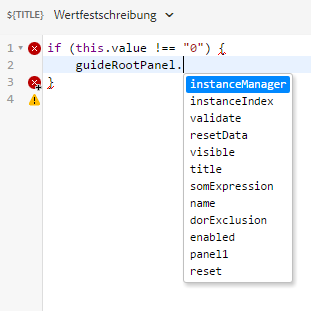
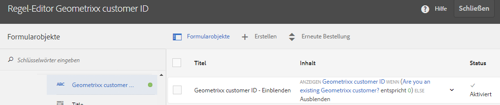

# Benutzeroberfläche des Regeleditors für adaptive Formulare, die auf Kernkomponenten basieren

Die auf Kernkomponenten basierende Benutzeroberfläche des Regeleditors für adaptive Forms verbessert den Prozess der Formularerstellung in Adobe Experience Manager (AEM). Es ermöglicht Geschäftsbenutzern und Entwicklern, dynamisches Verhalten und komplexe Logik in Formulare zu implementieren, indem Regeln geschrieben werden, die Trigger-Aktionen basierend auf vordefinierten Bedingungen, Benutzereingaben und Interaktionen erstellen. Diese Funktion unterstützt moderne JavaScript-Funktionen bis ES2022 und bietet einen intuitiven visuellen Editor, der den Regelerstellungsprozess vereinfacht.
Der Regeleditor ist für das optimierte Ausfüllen des Formulars von entscheidender Bedeutung, da er sowohl Genauigkeit als auch Effizienz gewährleistet. Dies ermöglicht die Validierung oder das Zurücksetzen von Bereichen und Formularen sowie die Ausführung benutzerdefinierter Funktionen zum Berechnen von Werten von Formularobjekten. Durch die Unterstützung verschachtelter Bedingungen und die Möglichkeit, Formulardatenmodell-Services aufzurufen, ist die Benutzeroberfläche des Regeleditors eine zentrale Komponente für die Erstellung responsiver, benutzerfreundlicher und adaptiver Formulare.

## Grundlegendes zur Benutzeroberfläche des Regeleditors {#understanding-the-rule-editor-user-interface}

Der Regeleditor bietet eine umfangreiche und dennoch einfache Benutzeroberfläche zum Erstellen und Verwalten von Regeln. Sie können die Benutzeroberfläche des Regeleditors im Autorenmodus von einem adaptiven Formular aus aufrufen.

So starten Sie die Benutzeroberfläche des Regeleditors:

1. Öffnen Sie ein adaptives Formular im Autorenmodus.
1. Wählen Sie das Formularobjekt aus, für das Sie eine Regel schreiben möchten, und wählen Sie in der Komponenten-Symbolleiste . Die Benutzeroberfläche des Regeleditors wird angezeigt.

   

   Alle vorhandenen Regeln für die ausgewählten Formularobjekte werden in dieser Ansicht aufgelistet. Weitere Informationen zum Verwalten vorhandener Regeln finden Sie unter [Verwalten von Regeln](rule-editor.md#p-manage-rules-p).

1. Wählen Sie **[!UICONTROL Erstellen]**, um eine neue Regel zu erstellen. Wenn Sie den Regeleditor zum ersten Mal starten, wird standardmäßig der Visual Editor der Regeleditor-Benutzeroberfläche geöffnet.

   

Nachfolgend werden die einzelnen Komponenten der Benutzeroberfläche des Regeleditors im Detail beschrieben.

### A. Ansicht „Komponente und Regel“ {#a-component-rule-display}

Zeigt den Titel des adaptiven Formularobjekts, über das Sie den Regeleditor aufgerufen haben, sowie den derzeit ausgewählten Regeltyp an. Im oben gezeigten Beispiel wurde der Regeleditor über ein adaptives Formularobjekt namens „Question 1“ (Frage 1) gestartet und der Regeltyp „Wenn“ ist ausgewählt.

### B. Formularobjekte und Funktionen {#b-form-objects-and-functions-br}

Im linken Bereich der Benutzeroberfläche des Regeleditors stehen zwei Registerkarten zur Verfügung: **[!UICONTROL Formularobjekte]** und **[!UICONTROL Funktionen]**.

Die Registerkarte „Formularobjekte“ zeigt eine hierarchische Ansicht aller Objekte an, die in dem adaptiven Formular enthalten sind. Angezeigt werden Titel und Typ der Objekte. Wenn Sie eine Regel erstellen, können Sie Formularobjekte in den Regeleditor ziehen und dort ablegen. Wenn Sie beim Erstellen oder Bearbeiten einer Regel ein Objekt oder eine Funktion in einen Platzhalter ziehen, übernimmt dieser Platzhalter automatisch den entsprechenden Wertetyp.

Die Formularobjekte, auf die eine oder mehrere gültige Regeln angewendet wurden, sind mit einem grünen Punkt markiert. Ist eine der auf ein Formularobjekt angewendeten Regeln ungültig, wird das Formularobjekt mit einem gelben Punkt markiert.

Die Registerkarte „Funktionen“ enthält eine Reihe integrierter Funktionen (z. B. „Summe von“, „Minimum von“, „Maximum von“, „Durchschnitt von“, „Anzahl von“ und „Formular validieren“). Sie können diese Funktionen verwenden, um Werte in wiederholbaren Bereichen und Tabellenzeilen zu berechnen und sie beim Erstellen von Regeln in den Aktions- und Bedingungsanweisungen zu verwenden. Sie können jedoch auch benutzerdefinierte Funktionen erstellen.

Einige der Listen von Funktionen werden in der Abbildung angezeigt:


>[!NOTE]
>
>Sie können auf den Registerkarten &quot;Forms-Objekte“ und „Funktionen“ eine Textsuche nach den Namen und Titeln von Objekten und Funktionen durchführen.

In der linken Baumstruktur der Formularobjekte können Sie die Formularobjekte auswählen, um die Regeln anzuzeigen, die auf die einzelnen Objekte angewendet werden. Sie können nicht nur durch die Regeln der verschiedenen Formularobjekte navigieren, sondern auch Regeln zwischen den Formularobjekten kopieren und einfügen. Weitere Informationen finden Sie unter [Kopieren und Einfügen von Regeln](rule-editor.md#p-copy-paste-rules-p).

### C. Umschalten zwischen Formularobjekten und Funktionen {#c-form-objects-and-functions-toggle-br}

Durch Tippen auf die Schaltfläche schalten Sie zwischen den Bereichen für Formularobjekte und Funktionen um.

### D. Visueller Regeleditor {#visual-rule-editor}

Der visuelle Regeleditor ist im visuellen Editormodus der Benutzeroberfläche des Regeleditors der Bereich, in dem Sie Regeln schreiben. Sie können hier einen Regeltyp auswählen und die entsprechenden Bedingungen und Aktionen definieren. Beim Definieren von Bedingungen und Aktionen in einer Regel können Sie Formularobjekte und Funktionen aus dem Bereich „Formularobjekte und Funktionen“ ziehen und ablegen.

Weitere Informationen zur Verwendung eines visuellen Regeleditors finden Sie unter [Regeln schreiben](rule-editor.md#p-write-rules-p).
<!-- 
### E. Visual-code editors switcher {#e-visual-code-editors-switcher}

Users in the forms-power-users group can access code editor. For other users, code editor is not available. If you have the rights, you can switch from visual editor mode to code editor mode of the rule editor, and conversely, using the switcher right above the rule editor. When you launch rule editor the first time, it opens in the visual editor mode. You can write rules in the visual editor mode or switch to the code editor mode to write a rule script. However, note that if you modify a rule or write a rule in code editor, you cannot switch back to the visual editor for that rule unless you clear the code editor.

[!DNL Experience Manager Forms] tracks the rule editor mode you used last to write a rule. When you launch the rule editor next time, it opens in that mode. However, you can also configure a default mode to open the rule editor in the specified mode. To do so:

1. Go to [!DNL Experience Manager] web console at `https://[host]:[port]/system/console/configMgr`.
1. Click to edit **[!UICONTROL Adaptive Form Configuration Service]**.
1. choose **[!UICONTROL Visual Editor]** or **[!UICONTROL Code Editor]** from the **[!UICONTROL Default Mode for Rule Editor]** drop-down

1. Click **[!UICONTROL Save]**.
-->

### F. Schaltflächen „Fertig“ und „Abbrechen“ {#done-and-cancel-buttons}

Die Schaltfläche **[!UICONTROL Fertig]** wird verwendet, um eine Regel zu speichern. Sie können eine unvollständige Regel speichern. Unvollständige Regeln sind jedoch ungültig und werden nicht ausgeführt. Gespeicherte Regeln für ein Formularobjekt werden aufgelistet, wenn Sie den Regeleditor das nächste Mal von demselben Formularobjekt aus starten. In dieser Ansicht können Sie vorhandene Regeln verwalten. Weitere Informationen finden Sie unter [Verwalten von Regeln](rule-editor.md#p-manage-rules-p).

Die **[!UICONTROL Abbrechen]**-Schaltfläche verwirft alle Änderungen, die Sie an einer Regel vorgenommen haben, und schließt den Regeleditor.

## Regeln schreiben {#write-rules}

Sie können Regeln mit dem visuellen Regeleditor<!-- or the code editor. When you launch the rule editor the first time, it opens in the visual editor mode. You can switch to the code editor mode and write rules. However, if you write or modify a rule in code editor, you cannot switch to the visual editor for that rule unless you clear the code editor. When you launch the rule editor next time, it opens in the mode that you used last to create rule. --> schreiben

Sehen wir uns zunächst an, wie Regeln mit einem visuellen Editor geschrieben werden.

+++ Verwenden von Visual Editor {#using-visual-editor}

Anhand des folgenden Beispielformulars soll das Erstellen einer Regel in einem visuellen Editor verständlich gemacht werden.


Im Abschnitt für die Kreditvoraussetzungen in diesem Beispielformular für einen Kreditantrag müssen die Antragstellenden ihren Familienstand, ihr Gehalt und, falls verheiratet, das Gehalt der Partnerin bzw. des Partners angeben. Basierend auf den Benutzereingaben wird mithilfe der Regel der Kreditanspruchsbetrag berechnet und im Feld für den Kreditanspruch angegeben. Wenden Sie die folgenden Regeln an, um dieses Szenario zu implementieren:

* Das Feld für das Gehalt der Partnerin bzw. des Partners wird nur angezeigt, wenn als Familienstand „Verheiratet“ angegeben wurde.
* Der Kreditanspruchsbetrag beträgt 50 % des Gesamtgehalts.

Gehen Sie wie folgt vor, um Regeln zu erstellen:

1. Schreiben Sie zunächst die Regel, um die Sichtbarkeit des Felds Gehalt des Partners basierend auf der Option zu steuern, die der Benutzer für das Optionsfeld Familienstand auswählt.

   Öffnen Sie das Kreditantragsformular im Autorenmodus. Wählen Sie die Komponente **[!UICONTROL Familienstand]** und  aus. Wählen Sie als Nächstes **[!UICONTROL Erstellen]** aus, um den Regeleditor zu starten.

   

   Wenn Sie den Regeleditor starten, ist standardmäßig die Wenn-Regel ausgewählt. Darüber hinaus wird das Formularobjekt (in diesem Fall „Familienstand“), von dem aus Sie den Regeleditor gestartet haben, in der Wenn-Anweisung angegeben.

   Sie können zwar das ausgewählte Objekt nicht bearbeiten oder ändern, es ist jedoch möglich, über die Dropdown-Liste für Regeln einen anderen Regeltyp wählen (siehe unten). Wenn Sie eine Regel für ein anderes Objekt erstellen möchten, wählen Sie „Abbrechen“ aus, um den Regeleditor zu beenden, und starten Sie ihn erneut über das gewünschte Formularobjekt.

1. Wählen Sie die Dropdown-Liste **[!UICONTROL Status auswählen]** und **[!UICONTROL Ist gleich]** aus. Das Feld **[!UICONTROL Eine Zeichenfolge eingeben]** wird angezeigt.

   

1. Wählen **[!UICONTROL in der Regel im Feld]** Geben Sie eine Zeichenfolge ein **aus dem Dropdown-Menü die Option** Verheiratet“ aus.

   

   Sie haben die Bedingung als `When Marital Status is equal to Married` definiert. Definieren Sie anschließend die Aktion, die ausgeführt werden soll, wenn diese Bedingung „True“ lautet.

1. Wählen Sie für die Dann-Anweisung die Option **[!UICONTROL Anzeigen]** aus der Dropdown-Liste **[!UICONTROL Aktion auswählen]**.

   

1. Ziehen Sie das Feld **[!UICONTROL Partnergehalt]** aus der Registerkarte „Formularobjekte“ in das Feld **[!UICONTROL Legen Sie das Objekt ab oder wählen Sie hier aus]**. Stattdessen können Sie auch das Feld **[!UICONTROL Objekt hier einfügen oder auswählen]** auswählen und das Feld **[!UICONTROL Gehalt des Partners]** aus dem Popup-Menü wählen, in dem sämtliche Formularobjekte im Formular aufgeführt sind.

   

   Definieren Sie anschließend die Aktion, die ausgeführt werden soll, wenn diese Bedingung „false“ lautet.
1. Klicken Sie auf **[!UICONTROL Abschnitt „Andernfalls“ hinzufügen]**, um eine weitere Bedingung für das Feld **[!UICONTROL Partnergehalt]** hinzuzufügen, falls für den Familienstand „Einzelperson“ ausgewählt wird.

   


1. Wählen Sie für die Sonst-Anweisung die Option **[!UICONTROL Ausblenden]** aus der Dropdown-Liste **[!UICONTROL Aktion auswählen]** aus.
   

1. Ziehen Sie das Feld **[!UICONTROL Partnergehalt]** aus der Registerkarte „Formularobjekte“ in das Feld **[!UICONTROL Legen Sie das Objekt ab oder wählen Sie hier aus]**. Stattdessen können Sie auch das Feld **[!UICONTROL Objekt hier einfügen oder auswählen]** auswählen und das Feld **[!UICONTROL Gehalt des Partners]** aus dem Popup-Menü wählen, in dem sämtliche Formularobjekte im Formular aufgeführt sind.
   

   Die Regel wird im Regeleditor wie folgt angezeigt.

   

1. Wählen Sie **[!UICONTROL Fertig]** aus, um die Regel zu speichern.

<!--
1. Repeat steps 1 through 5 to define another rule to hide the Spouse Salary field if the marital Status is Single. The rule appears as follows in the rule editor.

    -->

>[!NOTE]
>
> Alternativ zu diesem Verfahren können Sie dieses Verhalten auch implementieren, indem Sie für das Feld „Partnergehalt“ lediglich eine Regel vom Typ „Anzeigen“ anstelle zweier Wenn-Regeln für das Feld „Familienstand“ erstellen.


1. Als Nächstes erstellen Sie eine Regel für die Berechnung des Kreditanspruchsbetrags (50 % des Gesamtgehalts) und zur Anzeige des Betrags im Feld für den Kreditanspruch. Um dies zu erreichen, erstellen Sie **[!UICONTROL Wert festlegen von]**-Regeln für das Feld „Kreditanspruch“.

   Wählen Sie im Autorenmodus das Feld **[!UICONTROL Kreditanspruch]** und dann aus. Wählen Sie anschließend **[!UICONTROL Erstellen]** aus, um den Regeleditor zu starten.

1. Wählen Sie in der Dropdown-Liste „Regeln“ die Regel **[!UICONTROL Wert festlegen]** aus.

   

1. Wählen Sie **[!UICONTROL Option auswählen]** und dann **[!UICONTROL Mathematischer Ausdruck]** aus. Ein Feld, in das Sie mathematische Ausdrücke schreiben können, wird geöffnet.

   

1. Gehen Sie in diesem Ausdrucksfeld wie folgt vor:

   * Wählen Sie das Feld **[!UICONTROL Gehalt]** im ersten Feld **[!UICONTROL Legen Sie das Objekt ab oder wählen Sie hier aus]** aus oder ziehen Sie es von der Registerkarte „Formularobjekt“ hierhin.

   * Wählen Sie aus dem Feld **[!UICONTROL Operator auswählen]** die Option **[!UICONTROL plus]** aus.

   * Wählen Sie das Feld **[!UICONTROL Gehalt des Partners]** auf der Registerkarte „Formularobjekt“ aus oder ziehen Sie es in das zweite Feld **[!UICONTROL Legen Sie das Objekt ab oder wählen Sie hier aus]** und legen Sie es dort ab.

   

1. Wählen Sie als Nächstes etwas im hervorgehobenen Bereich um das Ausdrucksfeld und wählen Sie dann **[!UICONTROL Ausdruck erweitern]** aus.

   

   Wählen Sie im Feld für den erweiterten Ausdruck im Feld **[!UICONTROL Operator auswählen]** die Option **[!UICONTROL geteilt durch]** und im Feld **[!UICONTROL Option auswählen]** die Option **[!UICONTROL Zahl]** aus. Geben Sie **[!UICONTROL 2]** in das Zahlenfeld ein.

   

   >[!NOTE]
   >
   >Sie können mithilfe von Komponenten, Funktionen, mathematischen Ausdrücken und Eigenschaftswerten aus dem Feld „Option auswählen“ komplexe Ausdrücke erstellen.

   Erstellen Sie als Nächstes eine Bedingung, bei der bei Rückgabe von „True“ der Ausdruck ausgeführt wird.

1. Wählen Sie **[!UICONTROL Bedingung hinzufügen]** aus, um eine Wenn-Anweisung hinzuzufügen.

   

   Gehen Sie in der Wenn-Anweisung wie folgt vor:

   * Wählen Sie auf der Registerkarte „Formularobjekt“ das Feld **[!UICONTROL Familienstand]** im ersten Feld **[!UICONTROL Objekt hier einfügen oder auswählen]**.

   * Wählen Sie **[!UICONTROL Ist gleich]** im Feld **[!UICONTROL Operator wählen]** aus.

   * Wählen Sie in dem anderen Feld **[!UICONTROL Legen Sie das Objekt ab oder wählen Sie hier aus]** den Eintrag „String“ (Zeichenfolge) aus und geben Sie **[!UICONTROL Verheiratet]** in das Feld **[!UICONTROL Geben Sie eine Zeichenfolge ein]** ein.

   Die Regel wird schließlich wie folgt im Regeleditor angezeigt.  

1. Klicken Sie auf **[!UICONTROL Fertig]**. Dadurch wird die Regel gespeichert.

1. Folgen Sie wiederum Schritt 7 bis 14, um eine andere Regel zu definieren, mit deren Hilfe der Kreditanspruch berechnet wird im Falle, dass der Familienstand „Ledig“ ist. Die Regel wird im Regeleditor wie folgt angezeigt.

   

Sie können auch die Regel „Wert einstellen von“ verwenden, um den Kreditanspruch über die Wenn-Regel zu berechnen, die Sie erstellt haben, um das Feld für das Gehalt der Partnerin bzw. des Partners ein- bzw. auszublenden. Die resultierende kombinierte Regel (für den Familienstand „Ledig“) wird wie folgt im Regeleditor angezeigt.


Sie können eine kombinierte Regel erstellen, die die Sichtbarkeit des Felds für das Gehalt der Partnerin bzw. des Partners steuert, und mit der Sonst-Bedingung die Darlehensberechtigung für den Familienstand „Verheiratet“ berechnet.


+++


<!-- ### Using code editor {#using-code-editor}

Users added to the forms-power-users group can use code editor. The rule editor auto generates the JavaScript code for any rule you create using visual editor. You can switch from visual editor to the code editor to view the generated code. However, if you modify the rule code in the code editor, you cannot switch back to the visual editor. If you prefer writing rules in code editor rather than visual editor, you can write rules afresh in the code editor. The visual-code editors switcher helps you switch between the two modes.

The code editor JavaScript is the expression language of Adaptive Forms. All the expressions are valid JavaScript expressions and use Adaptive Forms scripting model APIs. These expressions return values of certain types. For the complete list of Adaptive Forms classes, events, objects, and public APIs, see [JavaScript Library API reference for Adaptive Forms](https://helpx.adobe.com/de/experience-manager/6-5/forms/javascript-api/index.html).

For more information about guidelines to write rules in the code editor, see [Adaptive Form Expressions](adaptive-form-expressions.md).

While writing JavaScript code in the rule editor, the following visual cues help you with the structure and syntax:

* Syntax highlights

* Auto Indentation

* Hints and suggestions for Form objects, functions, and their properties

* Auto completion of form component names and common JavaScript functions


-->

### Benutzerdefinierte Funktionen im Regeleditor {#custom-functions}

Zusätzlich zu den vorkonfigurierten Funktionen wie beispielsweise *Summe von*, die unter **Funktionsausgabe** aufgeführt sind, können Sie in Ihrem Regeleditor auch benutzerdefinierte Funktionen verwenden. Der Regeleditor unterstützt die JavaScript ECMAScript 2019-Syntax für Skripte und benutzerdefinierte Funktionen. Anweisungen zum Erstellen benutzerdefinierter Funktionen finden Sie im Artikel [Benutzerdefinierte Funktionen in adaptiven Formularen](/help/forms/create-and-use-custom-functions.md).

<!--

Ensure that the function you write is accompanied by the `jsdoc` above it. Adaptive Form supports the various [JavaScript annotations for custom functions](/help/forms/create-and-use-custom-functions.md#js-annotations).

For more information, see [jsdoc.app](https://jsdoc.app/).

Accompanying `jsdoc` is required:

* If you want custom configuration and description
* Because there are multiple ways to declare a function in `JavaScript,` and comments let you keep a track of the functions.

Supported `jsdoc` tags:

* **Private**
  Syntax: `@private`
  A private function is not included as a custom function.

* **Name**
  Syntax: `@name funcName <Function Name>`
  Alternatively `,` you can use: `@function funcName <Function Name>` **or** `@func` `funcName <Function Name>`.
  `funcName` is the name of the function (no spaces allowed).
  `<Function Name>` is the display name of the function.

* **Parameter**
  Syntax: `@param {type} name <Parameter Description>`
  Alternatively, you can use: `@argument` `{type} name <Parameter Description>` **or** `@arg` `{type}` `name <Parameter Description>`.
  Shows parameters used by the function. A function can have multiple parameter tags, one tag for each parameter in the order of occurrence.
  `{type}` represents parameter type. Allowed parameter types are:

    1. string
    2. number
    3. boolean
    4. scope
    5. string[]
    6. number[]
    7. boolean[]
    8. date
    9. date[]
    10. array
    11. object

   `scope` refers to a special globals object which is provided by forms runtime. It must be the last parameter and is not be visible to the user in the rule editor. You can use scope to access readable form and field proxy object to read properties, event which triggered the rule and a set of functions to manipulate the form.

   `object` type is used to pass readable field object in parameter to a custom function instead of passing the value.

   All parameter types are categorized under one of the above. None is not supported. Ensure that you select one of the types above. Types are not case-sensitive. Spaces are not allowed in the parameter name.  Parameter description can have multiple words.

* **Optional Parameter**
Syntax: `@param {type=} name <Parameter Description>` 
Alternatively, you can use: `@param {type} [name] <Parameter Description>`
By default all parameters are mandatory. You can mark a parameter optional by adding `=` in type of the parameter or by putting param name in square brackets.
   
   For example, let us declare `Input1` as optional parameter:
    * `@param {type=} Input1`
    * `@param {type} [Input1]`

* **Return Type**
  Syntax: `@return {type}`
  Alternatively, you can use `@returns {type}`.
  Adds information about the function, such as its objective.
  {type} represents the return type of the function. Allowed return types are:

    1. string
    2. number
    3. boolean
    4. string[]
    5. number[]
    6. boolean[]
    7. date
    8. date[]
    9. array
    10. object

  All other return types are categorized under one of the above. None is not supported. Ensure that you select one of the types above. Return types are not case-sensitive.

**Adding a custom function**

For example, you want to add a custom function which calculates area of a square. Side length is the user input to the custom function, which is accepted using a numeric box in your form. The calculated output is displayed in another numeric box in your form. To add a custom function, you have to first create a client library, and then add it to the CRX repository.

To create a client library and add it in the CRX repository, perform the following steps:

1. Create a client library. For more information, see [Using Client-Side Libraries](https://experienceleague.adobe.com/docs/experience-manager-cloud-service/implementing/developing/full-stack/clientlibs.html?lang=de#developing).
2. In CRXDE, add a property `categories`with string type value as `customfunction` to the `clientlib` folder.

   >[!NOTE]
   >
   >`customfunction`is an example category. You can choose any name for the category you create in the `clientlib`folder.

After you have added your client library in the CRX repository, use it in your Adaptive Form. It lets you use your custom function as a rule in your form. To add the client library in your Adaptive Form, perform the following steps:

1. Open your form in edit mode.
   To open a form in edit mode, select a form and select **[!UICONTROL Open]**.
1. In the edit mode, select a component, then select  &gt; **[!UICONTROL Adaptive Form Container]**, and then select .
1. In the sidebar, under Name of Client Library, add your client library. ( `customfunction` in the example.)

   

1. Select the input numeric box, and select  to open the rule editor.
1. Select **[!UICONTROL Create Rule]**. Using options shown below, create a rule to save the squared value of the input in the Output field of your form.

   [](assets/add-custom-rule.png)
  
1. Select **[!UICONTROL Done]**. Your custom function is added.

   >[!NOTE]
   >
   > To invoke a form data model from rule editor using custom functions, [see here](/help/forms/using-form-data-model.md#invoke-services-in-adaptive-forms-using-rules-invoke-services). 

#### Function declaration supported types {#function-declaration-supported-types}

**Function Statement**

```javascript
function area(len) {
    return len*len;
}
```

This function is included without `jsdoc` comments.

**Function Expression**

```javascript
var area;
//Some codes later
/** */
area = function(len) {
    return len*len;
};
```

**Function Expression and Statement**

```javascript
var b={};
/** */
b.area = function(len) {
    return len*len;
}
```

**Function Declaration as Variable**

```javascript
/** */
var x1,
    area = function(len) {
        return len*len;
    },
    x2 =5, x3 =true;
```

Limitation: custom function picks only the first function declaration from the variable list, if together. You can use function expression for every function declared.

**Function Declaration as Object**

```javascript
var c = {
    b : {
        /** */
        area : function(len) {
            return len*len;
        }
    }
};
```

>[!NOTE]
>
>Ensure that you use `jsdoc` for every custom function. Although `jsdoc`comments are encouraged, include an empty `jsdoc`comment to mark your function as custom function. It enables default handling of your custom function.
-->

## Verwalten von Regeln {#manage-rules}

Wenn Sie das Objekt und dann  auswählen, werden alle vorhandenen Regeln für ein Formularobjekt aufgelistet. Sie können den Titel und eine Vorschau der Regelzusammenfassung anzeigen. Darüber hinaus können Sie in der Benutzeroberfläche die vollständige Regelübersicht erweitern und anzeigen, die Reihenfolge der Regeln ändern, Regeln bearbeiten und Regeln löschen.


Sie können die folgenden Aktionen für die Regeln ausführen:

* **Anzeigen/Reduzieren**: Die Inhaltsspalte in der Regelliste zeigt den Regelinhalt an. Wenn in der Standardansicht nicht der gesamte Regelinhalt sichtbar ist, wählen Sie  aus, um die Ansicht zu erweitern.

* **Anordnung ändern**: Jede neue Regel, die Sie erstellen, wird am unteren Rand der Regelliste gestapelt. Die Regeln werden von oben nach unten ausgeführt. Die Regel oben wird zuerst ausgeführt, gefolgt von anderen Regeln desselben Typs. Wenn Sie beispielsweise die Regeln „Wenn“, „Anzeigen“, „Aktivieren“ und „Wenn“ an der ersten, zweiten, dritten bzw. vierten Position von der obersten Position haben, wird die Wenn-Regel oben zuerst ausgeführt, gefolgt von der Wenn-Regel an der vierten Position. Danach werden die Anzeigen- und die Aktivieren-Regel ausgeführt.
Sie können die Position einer Regel in der Reihenfolge ändern, indem Sie auf  für die Regel tippen oder die Regel an die gewünschte Stelle in der Liste ziehen und dort ablegen.

* **Bearbeiten**: Zum Bearbeiten einer Regel aktivieren Sie das Kontrollkästchen neben ihrem Titel. Weitere Optionen zum Bearbeiten und Löschen der Regel werden angezeigt. Wählen Sie **[!UICONTROL Bearbeiten]** aus, um die ausgewählte Regel im Regeleditor zu öffnen.

* **Löschen**: Um eine Regel zu löschen, wählen Sie die Regel aus und dann **[!UICONTROL Löschen]**.

* **Aktivieren/Deaktivieren**: Wenn Sie die Verwendung einer Regel vorübergehend aussetzen müssen, können Sie eine oder mehrere Regeln auswählen und in der Aktionsleiste **[!UICONTROL Deaktivieren]** wählen, um sie zu deaktivieren. Wenn eine Regel deaktiviert ist, wird sie zur Laufzeit nicht ausgeführt. Um eine deaktivierte Regel zu aktivieren, können Sie sie auswählen und dann in der Aktionssymbolleiste „Aktivieren“ auswählen. Die Statusspalte der Regel zeigt an, ob die Regel aktiviert oder deaktiviert ist.


## Kopieren und Einfügen von Regeln {#copy-paste-rules}

Es ist möglich, Regeln aus einem Feld zu kopieren und in andere, ähnliche Felder einzufügen, um Zeit zu sparen.

Gehen Sie wie folgt vor, um Regeln zu kopieren und einzufügen:

1. Wählen Sie das Formularobjekt aus, von dem Sie eine Regel kopieren möchten, und wählen Sie in der Komponentensymbolleiste . Die Benutzeroberfläche des Regeleditors wird angezeigt, wobei das Formularobjekt ausgewählt ist und die vorhandenen Regeln angezeigt werden.

   

   Weitere Informationen zum Verwalten vorhandener Regeln finden Sie unter [Verwalten von Regeln](rule-editor.md#p-manage-rules-p).

1. Aktivieren Sie das Kontrollkästchen neben dem Titel der Regel. Es werden Optionen für das Verwalten der Regel angezeigt. Wählen Sie **[!UICONTROL Kopieren]**.

   

1. Wählen Sie ein anderes Formularobjekt aus, in das Sie die Regel einfügen möchten, und wählen Sie dann **[!UICONTROL Einfügen]** aus. Darüber hinaus können Sie die Regel bearbeiten, um Änderungen daran vorzunehmen.

   >[!NOTE]
   >
   >Sie können eine Regel nur dann in ein anderes Formularobjekt einfügen, wenn dieses Formularobjekt das Ereignis der kopierten Regel unterstützt. So unterstützt beispielsweise eine Schaltfläche das Klickereignis. Sie können eine Regel, die ein Klickereignis enthält, in eine Schaltfläche, nicht jedoch in ein Kontrollkästchen einfügen.

1. Wählen Sie **[!UICONTROL Fertig]** aus, um die Regel zu speichern.

## Nächster Schritt

Informationen zu den verschiedenen Typen von Operatoren und Ereignissen im Regeleditor eines adaptiven Formulars finden Sie im [Verfügbare Typen von Operatoren und Ereignissen im Regeleditor eines adaptiven Formulars](/help/forms/rule-editor-core-components-events-operators.md) .


## Siehe auch

{{see-also-rule-editor}}
