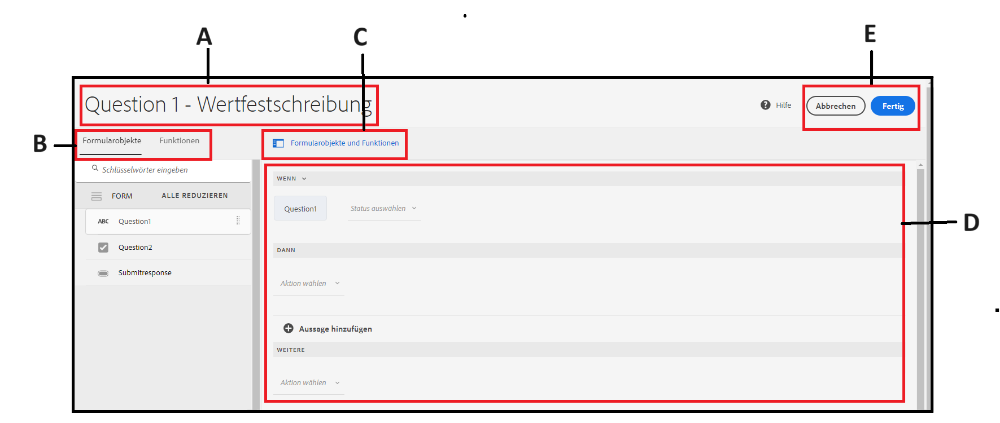
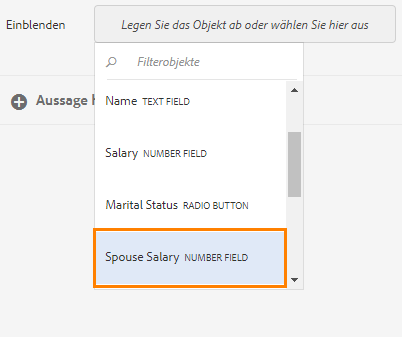
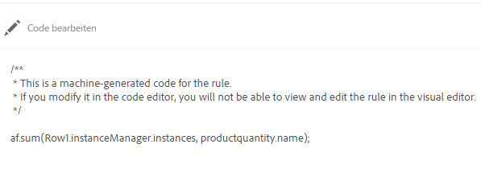

# Hinzufügen von Regeln zu adaptiven Formularen {#adaptive-forms-rule-editor}

<span class="preview"> Adobe empfiehlt die Verwendung der modernen und erweiterbaren Datenerfassung [Kernkomponenten](https://experienceleague.adobe.com/docs/experience-manager-core-components/using/adaptive-forms/introduction.html?lang=de) für [Erstellen neuer adaptiver Forms](/help/forms/creating-adaptive-form-core-components.md) oder [Hinzufügen von Adaptive Forms zu AEM Sites-Seiten](/help/forms/create-or-add-an-adaptive-form-to-aem-sites-page.md). Diese Komponenten stellen einen bedeutenden Fortschritt bei der Erstellung adaptiver Forms dar und sorgen für beeindruckende Benutzererlebnisse. In diesem Artikel wird der ältere Ansatz zum Erstellen von Adaptive Forms mithilfe von Foundation-Komponenten beschrieben. </span>

| Version | Artikel-Link |
| -------- | ---------------------------- |
| AEM 6.5 | [Hier klicken](https://experienceleague.adobe.com/docs/experience-manager-65/forms/adaptive-forms-advanced-authoring/rule-editor.html) |
| AEM as a Cloud Service | Dieser Artikel |

## Übersicht {#overview}

Der Regeleditor ermöglicht es Geschäftsbenutzern und Entwicklern, Regeln für adaptive Formularobjekte zu erstellen. Diese Regeln definieren Aktionen für Formularobjekte, die durch voreingestellte Bedingungen, Benutzereingaben und Benutzeraktionen im Formular ausgelöst werden. Dadurch wird das Ausfüllen von Formularen optimiert, was Genauigkeit und Geschwindigkeit gewährleistet.

Der Regeleditor bietet eine intuitive und vereinfachte Benutzeroberfläche zum Schreiben von Regeln. Der Regeleditor bietet einen grafischen Editor für alle Benutzer.<!-- In addition, only for forms power users, rule editor provides a code editor to write rules and scripts. --> Zu den wichtigsten Aktionen, die Sie mithilfe von Regeln in adaptiven Formularobjekten ausführen können, gehören die folgenden:

* Ein Objekt ein- oder ausblenden
* Ein Objekt aktivieren oder deaktivieren
* Einen Wert für ein Objekt festlegen
* Den Wert eines Objekts validieren
* Funktionen zur Berechnung des Werts eines Objekts ausführen
* Aufrufen eines Formulardatenmodell-Service und Durchführen eines Vorgangs
* Festlegen einer Eigenschaft eines Objekts

<!-- Rule editor replaces the scripting capabilities in [!DNL Experience Manager 6.1 Forms] and earlier releases. However, your existing scripts are preserved in the new rule editor. For more information about working with existing scripts in the rule editor, see [Impact of rule editor on existing scripts](rule-editor.md#p-impact-of-rule-editor-on-existing-scripts-p). -->

Benutzer, die der Gruppe der Formular-Hauptbenutzer hinzugefügt wurden, können Skripte erstellen und bestehende Skripte bearbeiten. Benutzer in der Gruppe [!DNL forms-users] können die Skripte verwenden, aber keine Skripte erstellen oder bearbeiten.

## Grundlegendes zu Regeln {#understanding-a-rule}

Eine Regel ist eine Kombination aus Aktionen und Bedingungen. Im Regeleditor umfassen Aktionen Aktivitäten wie das Ausblenden, Anzeigen, Aktivieren, Deaktivieren oder Berechnen des Werts eines Objekts in einem Formular. Bedingungen sind boolesche Ausdrücke, die durch Prüfungen und Vorgänge für den Status, den Wert oder die Eigenschaft eines Formularobjekts ausgewertet werden. Aktionen werden basierend auf dem bei der Auswertung einer Bedingung zurückgegebenen Wert (`True` oder `False`) ausgeführt.

Der Regeleditor bietet eine Reihe vordefinierter Regeltypen, z. B. &quot;Wann&quot;, &quot;Anzeigen&quot;, &quot;Ausblenden&quot;, &quot;Aktivieren&quot;, &quot;Deaktivieren&quot;, &quot;Wert einstellen&quot;und &quot;Validieren&quot;, um Ihnen beim Schreiben von Regeln zu helfen. Mit jedem Regeltyp können Sie Bedingungen und Aktionen in einer Regel definieren. In diesem Dokument sind die einzelnen Regeltypen im Detail beschrieben.

Eine Regel folgt normalerweise einem der folgenden Konstrukte:

**Bedingung-Aktion** In diesem Konstrukt definiert die Regel zuerst eine Bedingung und dann die auszulösende Aktion. Dieses Konstrukt ist mit einer if-then-Anweisung in Programmiersprachen vergleichbar.

Im Regeleditor wird das Bedingung-Aktion-Konstrukt durch den Regeltyp **Wenn** durchgesetzt.

**Aktion-Bedingung** In diesem Konstrukt definiert die Regel zuerst eine auszulösende Aktion und dann die auszuwertenden Bedingungen. Eine weitere Variante dieses Konstrukts ist Aktion-Bedingung-alternative Aktion, wobei auch dann eine alternative Aktion angegeben wird, die ausgelöst wird, wenn die Bedingung den Wert „False“ zurückgibt.

Die Regeltypen „Anzeigen“, „Ausblenden“, „Aktivieren“, „Deaktivieren“, „Wert festlegen“ und „Validieren“ im Regeleditor setzen das Aktion-Bedingung-Regelkonstrukt um. Die alternative Aktion für „Anzeigen“ ist standardmäßig „Ausblenden“ und für „Aktivieren“ „Deaktivieren“ und umgekehrt. Sie können die standardmäßige alternative Aktion nicht ändern.

>[!NOTE]
>
>Die verfügbaren Regeltypen, einschließlich der Bedingungen und Aktionen, die Sie im Regeleditor definieren, hängen auch vom Typ des Formularobjekts ab, für das Sie eine Regel erstellen. Der Regeleditor zeigt nur gültige Regeltypen und Optionen zum Schreiben von Bedingungs- und Aktionsanweisungen für einen bestimmten Formularobjekttyp an. So werden für ein Bereichsobjekt beispielsweise keine Regeln vom Typ „Validieren“, „Wert festlegen“ oder „Deaktivieren“ angezeigt.

Weitere Informationen über die im Regeleditor verfügbaren Regeltypen finden Sie unter [Verfügbare Regeltypen im Regeleditor](rule-editor.md#p-available-rule-types-in-rule-editor-p).

### Richtlinien für die Auswahl eines Regelkonstrukts {#guidelines-for-choosing-a-rule-construct}

Für die meisten Anwendungsfälle können Sie ein beliebiges Regelkonstrukt verwenden. Nachfolgend finden Sie jedoch einige Richtlinien für die Wahl des am besten geeigneten Konstrukts für Ihre Zwecke. Weitere Informationen über die verfügbaren Regeln im Regeleditor finden Sie unter [Verfügbare Regeltypen im Regeleditor](rule-editor.md#p-available-rule-types-in-rule-editor-p).

* Eine typische Faustregel beim Erstellen einer Regel besteht darin, im Kontext des Objekts, für das Sie eine Regel erstellen, darüber nachzudenken. Angenommen, Sie möchten das Feld B basierend auf dem Wert, den ein Benutzer im Feld A angibt, ein- oder ausblenden. In diesem Fall bewerten Sie eine Bedingung für Feld A und lösen basierend auf dem zurückgegebenen Wert eine Aktion für Feld B aus.

  Wenn Sie daher eine Regel für Feld B (das Objekt, für das Sie eine Bedingung auswerten) schreiben, verwenden Sie das Konstrukt &quot;Bedingung-Aktion&quot;oder den Regeltyp &quot;Wenn&quot;. Verwenden Sie auf ähnliche Weise das Konstrukt Aktion-Bedingung oder den Regeltyp Anzeigen oder Ausblenden für Feld A.

* In manchen Fällen müssen Sie für eine Bedingung mehrere Aktionen ausführen. In solchen Fällen wird empfohlen, das Konstrukt &quot;Bedingung-Aktion&quot;zu verwenden. In diesem Konstrukt können Sie eine Bedingung einmal auswerten und mehrere Aktionsanweisungen angeben.

  Um beispielsweise die Felder B, C und D anhand der Bedingung auszublenden, die nach dem Wert sucht, den ein Benutzer in Feld A angibt, schreiben Sie eine Regel mit dem Konstrukt Bedingung-Aktion oder Wenn Regeltyp für Feld A und geben Sie Aktionen an, um die Sichtbarkeit der Felder B, C und D zu steuern. Andernfalls benötigen Sie drei separate Regeln für die Felder B, C und D, wobei jede Regel die Bedingung prüft und das entsprechende Feld anzeigt oder ausblendet. In diesem Beispiel ist es effizienter, den Wenn-Regeltyp für ein Objekt zu schreiben, anstatt für drei Objekte den Regeltyp &quot;Anzeigen&quot;oder &quot;Ausblenden&quot;.

* Für den Trigger einer Aktion, die auf mehreren Bedingungen basiert, wird empfohlen, das Konstrukt &quot;action-condition&quot;zu verwenden. Um beispielsweise Feld A durch Auswertung der Bedingungen für die Felder B, C und D ein- und auszublenden, verwenden Sie Regeltyp &quot;Anzeigen&quot;oder &quot;Ausblenden&quot;für Feld A.
* Für Regeln, Regel die eine Aktion für eine Bedingung enthalten, können Sie sowohl Bedingung-Aktion- als auch Aktion-Bedingung-Konstrukte verwenden.
* Wenn ein Regel nach einer Bedingung sucht und sofort eine Aktion ausführt, wenn ein Wert in einem Feld bereitgestellt oder ein Feld verlassen wird, wird empfohlen, eine Regel mit dem Bedingungs-Aktion-Konstrukt oder dem Wenn-Regel Typ für das Feld zu schreiben, für das die Bedingung ausgewertet wird.
* Die Bedingung in der Wenn-Regel wird ausgewertet, wenn ein Benutzer den Wert des Objekts ändert, auf das die Wenn-Regel angewendet wird. Soll die Aktion jedoch ausgelöst werden, wenn der Wert Server-seitig geändert wird (z. B. wenn der Wert vorab ausgefüllt wird), empfehlen wir, eine Wenn-Regel zu erstellen, die die Aktion beim Initialisieren des Felds auslöst.
* Beim Schreiben von Regeln für Dropdown-Elemente, Optionsfelder oder Kontrollkästchenobjekte werden die Optionen oder Werte dieser Formularobjekte im Formular im Regeleditor vorbefüllt.

## Verfügbare Typen von Operatoren und Ereignissen im Regeleditor {#available-operator-types-and-events-in-rule-editor}

Der Regeleditor bietet die folgenden logischen Operatoren und Ereignisse, mit denen Sie Regeln erstellen können.

* **ist gleich**
* **ist nicht gleich**
* **Beginnt mit**
* **Endet mit**
* **Enthält**
* **Ist leer**
* **Ist nicht leer**
* **Hat ausgewählt:** Gibt „true“ zurück, wenn der Benutzer eine bestimmte Option für ein Kontrollkästchen, ein Dropdown-Element oder ein Optionsfeld auswählt.
* **Ist initialisiert (Ereignis):** Gibt „true“ zurück, wenn ein Formularobjekt im Browser dargestellt wird.
* **Wird geändert (Ereignis):** Gibt „true“ zurück, wenn der Benutzer den eingegebenen Wert oder die ausgewählte Option für ein Formularobjekt ändert.
* **Navigation (Ereignis):** Gibt „true“ zurück, wenn der Benutzer auf ein Navigationsobjekt klickt. Navigationsobjekte werden verwendet, um zwischen Bereichen zu wechseln.
* **Schritt abgeschlossen (Ereignis):** Gibt „true“ zurück, wenn ein Regelschritt abgeschlossen ist.
* **Erfolgreiche Übermittlung (Ereignis):** Gibt „true“ zurück, wenn Daten erfolgreich an ein Formulardatenmodell gesendet wurden.
* **Fehler bei der Übermittlung (Ereignis):** Gibt „true“ zurück, wenn die Daten nicht erfolgreich an ein Formulardatenmodell gesendet wurden.

## Verfügbare Typen von Regeln im Regeleditor {#available-rule-types-in-rule-editor}

Der Regeleditor bietet eine Reihe vordefinierter Regeltypen, mit denen Sie Regeln schreiben können. Im Folgenden werden die einzelnen Regeltypen detailliert dargestellt. Weitere Informationen zum Erstellen von Regeln im Regeleditor finden Sie unter [Regeln schreiben](rule-editor.md#p-write-rules-p).

### [!UICONTROL Wenn] {#whenruletype}

Der **[!UICONTROL Wenn]**-Regeltyp nutzt das Konstrukt **Bedingung-Aktion-Alternative Aktion**, in manchen Fällen auch nur das Konstrukt **Bedingung-Aktion**. Für diesen Regeltyp geben Sie zunächst eine auszuwertende Bedingung an und dann eine Aktion, die ausgelöst werden soll, wenn die Bedingung erfüllt ist (`True`). Bei Einsatz der Wenn-Regel können Sie mehrere UND- und ODER-Operatoren verwenden, um [verschachtelte Ausdrücke](#nestedexpressions) zu erstellen.

Mit dem Wenn-Regeltyp können Sie eine Bedingung für ein Formularobjekt auswerten und Aktionen für ein oder mehrere Objekte ausführen.

Einfach ausgedrückt: Eine typische Wenn-Regel ist wie folgt aufgebaut:

`When on Object A:`

`(Condition 1 AND Condition 2 OR Condition 3) is TRUE;`

`Then, do the following:`

Aktion 2 auf Objekt B anwenden;
UND
Aktion 3 auf Objekt C anwenden;

_

Beim Erstellen einer Regel für Komponenten mit mehreren Werten (z. B. Optionsfelder oder Listen) werden die Optionen automatisch abgerufen und dem Regelersteller zur Verfügung gestellt. Sie müssen die Optionswerte nicht erneut eingeben.

Eine Liste hat beispielsweise vier Optionen: Rot, Blau, Grün und Gelb. Beim Erstellen der Regel werden die Optionen (Optionsfelder) automatisch abgerufen und dem Regelersteller wie folgt zur Verfügung gestellt:


Beim Schreiben der Wenn-Regel können Sie die Aktion „Wert löschen von“ auslösen. Die Aktion „Wert löschen von“ löscht den Wert des angegebenen Objekts. Mit der Option Wert löschen von als Option in der Wenn-Anweisung können Sie komplexe Bedingungen mit mehreren Feldern erstellen.


**[!UICONTROL Ausblenden]**: Blendet das angegebene Objekt aus.

**[!UICONTROL Anzeigen]**: Blendet das angegebene Objekt ein.

**[!UICONTROL Aktivieren]**: Aktiviert das angegebene Objekt.

**[!UICONTROL Deaktivieren]**: Deaktiviert das angegebene Objekt.

**[!UICONTROL Service aufrufen]** Ruft einen Service auf, der in einem Formulardatenmodell konfiguriert ist. Wenn Sie den Vorgang „Service aufrufen“ wählen, wird ein Feld angezeigt. Beim Antippen des Felds zeigt es sämtliche Services an, die in allen Formulardatenmodellen in Ihrer [!DNL Experience Manager]-Instanz konfiguriert sind. Bei Auswahl eines Formulardatenmodell-Service werden weitere Felder eingeblendet, in denen Sie Formularobjekte mit Ein- und Ausgabeparametern für den angegebenen Service zuordnen können. Siehe dazu die Beispielregel für den Aufruf von Formulardatenmodell-Services.

Zusätzlich zum Formulardatenmodell-Service können Sie eine direkte WSDL-URL angeben, um einen Webservice aufzurufen. Ein Formulardatenmodell-Service hat jedoch viele Vorteile und stellt den empfohlenen Ansatz zum Aufrufen eines Service dar.

Weitere Informationen zum Konfigurieren von Services im Formulardatenmodell finden Sie unter [[!DNL Experience Manager Forms] Datenintegration](data-integration.md).

**[!UICONTROL Wert festlegen]**: Berechnet den Wert des angegebenen Objekts und legt ihn fest. Als Objektwert können Sie eine Zeichenfolge, den Wert eines anderen Objekts, den mittels eines mathematischem Ausdrucks oder einer Funktion berechneten Wert, den Wert einer Eigenschaft eines Objekts oder den von einem konfigurierten Formulardatenmodell-Service ausgegebenen Wert festlegen. Wenn Sie die Option „Webservice“ wählen, werden sämtliche Services angezeigt, die in allen Formulardatenmodellen in Ihrer [!DNL Experience Manager]-Instanz konfiguriert sind. Bei Auswahl eines Formulardatenmodell-Service werden weitere Felder eingeblendet, in denen Sie Formularobjekte mit Ein- und Ausgabeparametern für den angegebenen Service zuordnen können.

Weitere Informationen zum Konfigurieren von Services im Formulardatenmodell finden Sie unter [[!DNL Experience Manager Forms] Datenintegration](data-integration.md).

Die **[!UICONTROL Eigenschaft festlegen]** Mit dem Regeltyp können Sie den Wert einer Eigenschaft des angegebenen Objekts basierend auf einer Bedingungsaktion festlegen. Sie können die Eigenschaft auf einen der folgenden Werte festlegen:
* visible (Boolesch)
* dorExclusion (Boolesch)
* chartType (String)
* title (String)
* enabled (Boolesch)
* mandatory (Boolesch)
* validationsDisabled (Boolesch)
* validateExpMessage (String)
* value (Zahl, Zeichenfolge, Datum)
* Artikel (Liste)
* valid (Boolesch)
* errorMessage (Zeichenfolge)

So können Sie beispielsweise Regeln definieren, um Kontrollkästchen dynamisch zum adaptiven Formular hinzuzufügen. Sie können benutzerdefinierte Funktionen, Formularobjekte oder eine Objekteigenschaft verwenden, um eine Regel zu definieren.


Um eine Regel basierend auf einer benutzerdefinierten Funktion zu definieren, wählen Sie **[!UICONTROL Funktionsausgabe]** in der Dropdown-Liste aus und ziehen Sie eine benutzerdefinierte Funktion mittels Drag-and-Drop aus der Registerkarte **[!UICONTROL Funktionen]**. Wenn die Bedingungsaktion erfüllt ist, wird die Anzahl der in der benutzerdefinierten Funktion definierten Kontrollkästchen dem adaptiven Formular hinzugefügt.

Um eine auf einem Formularobjekt basierende Regel zu definieren, wählen Sie **[!UICONTROL Formularobjekt]** in der Dropdown-Liste aus und ziehen Sie ein Formularobjekt mittels Drag-and-Drop aus der Registerkarte **[!UICONTROL Formularobjekte]**. Wenn die Bedingungsaktion erfüllt ist, wird die Anzahl der im Formularobjekt definierten Kontrollkästchen dem adaptiven Formular hinzugefügt.

Mit einer auf einer Objekteigenschaft basierenden Regel Eigenschaft festlegen können Sie die Anzahl der Kontrollkästchen in einem adaptiven Formular hinzufügen, basierend auf einer anderen Objekteigenschaft, die im adaptiven Formular enthalten ist.

Die folgende Abbildung zeigt ein Beispiel für das dynamische Hinzufügen von Kontrollkästchen auf der Grundlage der Anzahl der Dropdown-Listen im adaptiven Formular:


**[!UICONTROL Wert löschen von]**: Löscht den Wert des angegebenen Objekts.

**[!UICONTROL Fokus festlegen]**: Legt den Fokus auf das angegebene Objekt.

**[!UICONTROL Formular speichern]**: Speichert das Formular.

**[!UICONTROL Formulare senden]**: Sendet das Formular.

**[!UICONTROL Formular zurücksetzen]**: Setzt das Formular zurück.

**[!UICONTROL Formular validieren]**: Überprüft das Formular.

**[!UICONTROL Instanz hinzufügen]**: Fügt eine Instanz des angegebenen wiederholbaren Bereichs oder der Tabellenzeile hinzu.

**[!UICONTROL Instanz entfernen]**: Entfernt eine Instanz des angegebenen wiederholbaren Bereichs oder der Tabellenzeile.

**[!UICONTROL Navigieren zu]**: Navigiert zu anderen <!--Interactive Communications,--> adaptiven Formularen, anderen Assets (wie Bildern oder Dokument-Fragmenten) oder zu einer externen URL. <!-- For more information, see [Add button to the Interactive Communication](create-interactive-communication.md#addbuttontothewebchannel). -->

### [!UICONTROL Wert festlegen] {#set-value-of}

Die **[!UICONTROL Wert einstellen von]** Mit dem Regeltyp können Sie den Wert eines Formularobjekts in Abhängigkeit davon festlegen, ob die angegebene Bedingung erfüllt ist oder nicht. Der Wert kann auf den Wert eines anderen Objekts, eine Literal-Zeichenfolge, einen von einem mathematischen Ausdruck oder einer Funktion abgeleiteten Wert, den Wert einer Eigenschaft eines anderen Objekts oder die Ausgabe eines Formulardatenmodell-Service festgelegt werden. In ähnlicher Weise können Sie auf eine Bedingung bei Komponenten, Zeichenfolgen, Eigenschaften oder Werten, die von Funktionen oder mathematischen Ausdrücken abgeleitet wurden, prüfen.

Der Regeltyp **Wert festlegen** steht für manche Formularobjekte nicht zur Verfügung (z. B. nicht für Bereiche und Schaltflächen von Symbolleisten). Eine standardmäßige Regel vom Typ „Wert festlegen“ hat die folgende Struktur:

Wert von Objekt A festlegen auf:

(Zeichenfolge ABC) ODER
(Objekteigenschaft X von Objekt C) ODER
(Wert aus einer Funktion) ODER
(Wert aus einem mathematischen Ausdruck) ODER
(Ausgabewert von einem Datenmodell-Service oder Webservice);

Wann (optional):

(Bedingung 1 UND Bedingung 2 UND Bedingung 3) WAHR IST;

Im folgenden Beispiel wird der Wert im Feld `dependentid` als Eingabe genommen und der Wert des Felds `Relation` auf die Ausgabe des Arguments `Relation` des Formulardatenmodell-Service `getDependent` festgelegt.


Beispiel für die Regel „Wert festlegen“ unter Verwendung des Formulardatenmodell-Service

>[!NOTE]
>
>Darüber hinaus können Sie die Regel „Wert festlegen“ verwenden, um alle Werte in einer Dropdown-Listenkomponente mit der Ausgabe eines Formulardatenmodell-Service oder eines Webservice aufzufüllen. Stellen Sie jedoch sicher, dass das von Ihnen ausgewählte Ausgabeargument einen Array-Typ aufweist. Alle in einem Array zurückgegebenen Werte werden in der angegebenen Dropdown-Liste verfügbar.

### [!UICONTROL Anzeigen] {#show}

Mithilfe des Regeltyps **[!UICONTROL Anzeigen]** können Sie eine Regel schreiben, die ein Formularobjekt je nachdem, ob eine Bedingung erfüllt ist oder nicht, anzeigt oder ausblendet. Der Regeltyp „Anzeigen“ löst auch die Aktion „Ausblenden“ aus, falls die Bedingung nicht erfüllt ist oder `False` zurückgibt.

Eine typische Regel vom Typ „Anzeigen“ ist wie folgt strukturiert:

`Show Object A;`

`When:`

`(Condition 1 OR Condition 2 OR Condition 3) is TRUE;`

`Else:`

`Hide Object A;`

### [!UICONTROL Ausblenden] {#hide}

Regeln vom Typ **[!UICONTROL Ausblenden]** können ähnlich wie Regeln vom Typ „Anzeigen“ dazu verwendet werden, Formularobjekte je nachdem, ob eine Bedingung erfüllt ist oder nicht, anzuzeigen oder auszublenden. Der Regeltyp „Ausblenden“ löst auch die Aktion „Anzeigen“ aus, falls die Bedingung nicht erfüllt ist oder `False` zurückgibt.

Eine typische Regel vom Typ „Ausblenden“ ist wie folgt strukturiert:

`Hide Object A;`

`When:`

`(Condition 1 AND Condition 2 AND Condition 3) is TRUE;`

`Else:`

`Show Object A;`

### [!UICONTROL Aktivieren] {#enable}

Mithilfe des Regeltyps **[!UICONTROL Aktivieren]** können Sie ein Formularobjekt in Abhängigkeit davon aktivieren oder deaktivieren, ob eine Bedingung erfüllt ist oder nicht. Der Regeltyp „Aktivieren“ löst auch die Aktion „Deaktivieren“ aus, falls die Bedingung nicht erfüllt ist oder `False` zurückgibt.

Eine typische Regel vom Typ „Aktivieren“ ist wie folgt strukturiert:

`Enable Object A;`

`When:`

`(Condition 1 AND Condition 2 AND Condition 3) is TRUE;`

`Else:`

`Disable Object A;`

### [!UICONTROL Deaktivieren] {#disable}

Ähnlich wie beim Typ &quot;Enable Regel&quot; können Sie mit dem **[!UICONTROL Typ &quot;Deaktivieren]** Regel&quot; ein Formularobjekt aktivieren oder deaktivieren, je nachdem, ob eine Bedingung erfüllt ist oder nicht. Der Regeltyp „Deaktivieren“ löst auch die Aktion „Aktivieren“ aus, falls die Bedingung nicht erfüllt ist oder `False` zurückgibt.

Eine typische Regel vom Typ „Deaktivieren“ ist wie folgt strukturiert:

`Disable Object A;`

`When:`

`(Condition 1 OR Condition 2 OR Condition 3) is TRUE;`

`Else:`

`Enable Object A;`

### [!UICONTROL Validieren] {#validate}

Regeln vom Typ **[!UICONTROL Validieren]** überprüfen den Wert in einem Feld mithilfe eines Ausdrucks. Sie können beispielsweise einen Ausdruck schreiben, um zu überprüfen, ob das Textfeld zur Angabe des Namens keine Sonderzeichen oder Zahlen enthält.

Eine typische Regel vom Typ „Validieren“ ist wie folgt strukturiert:

`Validate Object A;`

`Using:`

`(Expression 1 AND Expression 2 AND Expression 3) is TRUE;`

>[!NOTE]
>
>Wenn der angegebene Wert nicht mit der Validierungsregel übereinstimmt, können Sie dem Benutzer eine Validierungsmeldung anzeigen. Sie können die Meldung im Feld **[!UICONTROL Skriptüberprüfungsmeldung]** in den Komponenteneigenschaften in der Seitenleiste angeben.


### [!UICONTROL Optionen festlegen] {#setoptionsof}

Mit dem Regeltyp **[!UICONTROL Optionen festlegen]** können Sie Regeln definieren, um Kontrollkästchen dynamisch zum adaptiven Formular hinzuzufügen. Sie können ein Formulardatenmodell oder eine benutzerdefinierte Funktion verwenden, um die Regel zu definieren.

Um eine Regel basierend auf einer benutzerdefinierten Funktion zu definieren, wählen Sie **[!UICONTROL Funktionsausgabe]** in der Dropdown-Liste aus und ziehen Sie eine benutzerdefinierte Funktion mittels Drag-and-Drop aus der Registerkarte **[!UICONTROL Funktionen]**. Die in der benutzerdefinierten Funktion definierte Anzahl von Kontrollkästchen wird dem adaptiven Formular hinzugefügt.


Informationen über das Erstellen einer benutzerdefinierten Funktion finden Sie unter [Benutzerdefinierte Funktionen im Regeleditor](#custom-functions).

So definieren Sie eine auf einem Formulardatenmodell basierende Regel:

1. Wählen Sie **[!UICONTROL Service-Ausgabe]** in der Dropdown-Liste aus.
1. Wählen Sie das Datenmodellobjekt aus.
1. Wählen Sie in der Dropdown-Liste **[!UICONTROL Wert anzeigen]** eine Datenmodell-Objekteigenschaft aus. Die Anzahl der Kontrollkästchen im adaptiven Formular wird von der Anzahl der Instanzen abgeleitet, die für diese Eigenschaft in der Datenbank definiert wurden.
1. Wählen Sie in der Dropdown-Liste **[!UICONTROL Wert speichern]** eine Datenmodell-Objekteigenschaft.


## Grundlegendes zur Benutzeroberfläche des Regeleditors {#understanding-the-rule-editor-user-interface}

Der Regeleditor bietet eine umfangreiche und dennoch einfache Benutzeroberfläche zum Erstellen und Verwalten von Regeln. Sie können die Benutzeroberfläche des Regeleditors im Autorenmodus von einem adaptiven Formular aus aufrufen.

So starten Sie die Benutzeroberfläche des Regeleditors:

1. Öffnen Sie ein adaptives Formular im Autorenmodus.
1. Tippen Sie auf das Formularobjekt, für das Sie eine Regel erstellen möchten, und tippen Sie in der Symbolleiste „Komponente“ auf . Die Benutzeroberfläche des Regeleditors wird angezeigt.

   

   Alle vorhandenen Regeln für die ausgewählten Formularobjekte werden in dieser Ansicht aufgelistet. Weitere Informationen zum Verwalten vorhandener Regeln finden Sie unter [Verwalten von Regeln](rule-editor.md#p-manage-rules-p).

1. Tippen Sie auf **[!UICONTROL Erstellen]**, um eine neue Regel zu erstellen. Wenn Sie den Regeleditor zum ersten Mal starten, wird standardmäßig der Visual Editor der Regeleditor-Benutzeroberfläche geöffnet.

   

Nachfolgend werden die einzelnen Komponenten der Benutzeroberfläche des Regeleditors im Detail beschrieben.

### A. Ansicht „Komponente und Regel“ {#a-component-rule-display}

Zeigt den Titel des adaptiven Formularobjekts, über das Sie den Regeleditor aufgerufen haben, sowie den derzeit ausgewählten Regeltyp an. Im oben gezeigten Beispiel wurde der Regeleditor über ein adaptives Formularobjekt namens „Salary“ (Gehalt) gestartet, und der Regeltyp „Wenn“ ist ausgewählt.

### B. Formularobjekte und Funktionen {#b-form-objects-and-functions-br}

Im linken Bereich der Benutzeroberfläche des Regeleditors stehen zwei Registerkarten zur Verfügung: **[!UICONTROL Formularobjekte]** und **[!UICONTROL Funktionen]**.

Die Registerkarte „Formularobjekte“ zeigt eine hierarchische Ansicht aller Objekte an, die in dem adaptiven Formular enthalten sind. Angezeigt werden Titel und Typ der Objekte. Wenn Sie eine Regel erstellen, können Sie Formularobjekte in den Regeleditor ziehen und dort ablegen. Wenn Sie beim Erstellen oder Bearbeiten einer Regel ein Objekt oder eine Funktion in einen Platzhalter ziehen, übernimmt dieser Platzhalter automatisch den entsprechenden Wertetyp.

Die Formularobjekte, auf die eine oder mehrere gültige Regeln angewendet wurden, sind mit einem grünen Punkt markiert. Ist eine der auf ein Formularobjekt angewendeten Regeln ungültig, wird das Formularobjekt mit einem gelben Punkt markiert.

Die Registerkarte „Funktionen“ enthält eine Reihe integrierter Funktionen (z. B. „Summe von“, „Minimum von“, „Maximum von“, „Durchschnitt von“, „Anzahl von“ und „Formular validieren“). Sie können diese Funktionen verwenden, um Werte in wiederholbaren Bereichen und Tabellenzeilen zu berechnen und sie beim Erstellen von Regeln in den Aktions- und Bedingungsanweisungen zu verwenden. Sie können jedoch auch [benutzerdefinierte Funktionen](#custom-functions) erstellen.


>[!NOTE]
>
>Sie können auf den Registerkarten „Formularobjekte“ und „Funktionen“ eine Textsuche nach den Namen und Titeln von Objekten und Funktionen durchführen.

In der linken Struktur der Formularobjekte können Sie auf die Formularobjekte tippen, um die Regeln anzuzeigen, die auf die einzelnen Objekte angewendet werden. Sie können nicht nur durch die Regeln der verschiedenen Formularobjekte navigieren, sondern auch Regeln zwischen den Formularobjekten kopieren und einfügen. Weitere Informationen finden Sie unter [Regeln kopieren und einfügen](rule-editor.md#p-copy-paste-rules-p).

### C. Umschalten zwischen Formularobjekten und Funktionen {#c-form-objects-and-functions-toggle-br}

Durch Tippen auf die Schaltfläche schalten Sie zwischen den Bereichen für Formularobjekte und Funktionen um.

### D. Visueller Regeleditor {#visual-rule-editor}

Der visuelle Regeleditor ist der Bereich im Visual Editor-Modus der Benutzeroberfläche des Regeleditors, in dem Sie Regeln schreiben. Damit können Sie einen Regeltyp auswählen und dementsprechend Bedingungen und Aktionen definieren. Beim Definieren von Bedingungen und Aktionen in einer Regel können Sie Formularobjekte und -funktionen aus dem Bereich &quot;Formularobjekte und -funktionen&quot;ziehen und dort ablegen.

Weitere Informationen zur Verwendung des visuellen Regeleditors finden Sie unter [Regeln schreiben](rule-editor.md#p-write-rules-p).
<!-- 
### E. Visual-code editors switcher {#e-visual-code-editors-switcher}

Users in the forms-power-users group can access code editor. For other users, code editor is not available. If you have the rights, you can switch from visual editor mode to code editor mode of the rule editor, and vice versa, using the switcher right above the rule editor. When you launch rule editor the first time, it opens in the visual editor mode. You can write rules in the visual editor mode or switch to the code editor mode to write a rule script. However, note that if you modify a rule or write a rule in code editor, you cannot switch back to the visual editor for that rule unless you clear the code editor.

[!DNL Experience Manager Forms] tracks the rule editor mode you used last to write a rule. When you launch the rule editor next time, it opens in that mode. However, you can also configure a default mode to open the rule editor in the specified mode. To do so:

1. Go to [!DNL Experience Manager] web console at `https://[host]:[port]/system/console/configMgr`.
1. Click to edit **[!UICONTROL Adaptive Form Configuration Service]**.
1. choose **[!UICONTROL Visual Editor]** or **[!UICONTROL Code Editor]** from the **[!UICONTROL Default Mode for Rule Editor]** drop-down

1. Click **[!UICONTROL Save]**.
-->

### F. Schaltflächen „Fertig“ und „Abbrechen“ {#done-and-cancel-buttons}

Die Schaltfläche **[!UICONTROL Fertig]** wird verwendet, um eine Regel zu speichern. Sie können eine unvollständige Regel speichern. Unvollständige Elemente sind jedoch ungültig und werden nicht ausgeführt. Gespeicherte Regeln für ein Formularobjekt werden aufgelistet, wenn Sie den Regeleditor das nächste Mal von demselben Formularobjekt aus starten. In dieser Ansicht können Sie vorhandene Regeln verwalten. Weitere Informationen finden Sie unter [Regeln verwalten](rule-editor.md#p-manage-rules-p).

Die **[!UICONTROL Abbrechen]** -Schaltfläche verwirft alle Änderungen, die Sie an einer Regel vorgenommen haben, und schließt den Regeleditor.

## Regeln schreiben {#write-rules}

Zum Schreiben von Regeln können Sie den visuellen Regeleditor &lt;!-- oder den Code-Editor> verwenden. Wenn Sie die Regel Bearbeiter zum ersten Mal starten, wird sie im visuellen Bearbeiter-Modus geöffnet. Sie können zum Code-Editormodus wechseln und Regeln schreiben. Wenn Sie eine Regel im Code-Editor schreiben oder ändern, ist es jedoch nicht möglich, für diese Regel in den Visual Editor zu wechseln, es sei denn, Sie löschen den Inhalt des Code-Editors. Wenn Sie die Regel Bearbeiter das nächste Mal starten, wird sie im zuletzt zum Erstellen von Regel verwendeten Modus geöffnet.

Sehen wir uns zunächst an, wie Regeln mit dem Visual Editor geschrieben werden.

### Verwenden des Visual Editor {#using-visual-editor}

Anhand des folgenden Beispielformulars soll das Erstellen von Regeln im visuellen Editor verständlich gemacht werden.


Im Abschnitt &quot;Kreditanforderungen&quot;im Beispielformular für einen Kreditantrag müssen Antragsteller ihren Familienstand, ihr Gehalt und, falls verheiratet, das Gehalt ihres Ehepartners angeben. Basierend auf den Benutzereingaben berechnet die Regel den Kreditanspruchsbetrag und wird im Feld Kreditanspruch angezeigt. Wenden Sie die folgenden Regeln an, um das Szenario zu implementieren:

* Das Feld für das Gehalt des Partners/der Partnerin wird nur angezeigt, wenn der Familienstand Verheiratet ist.
* Der Kreditanspruchsbetrag beträgt 50 % des Gesamtgehalts.

Gehen Sie wie folgt vor, um Regeln zu erstellen:

1. Schreiben Sie zuerst die Regel, mit der die Sichtbarkeit des Felds „Gehalt des Partners“ entsprechend der vom Benutzer über das Optionsfeld „Familienstand“ gewählten Option gesteuert wird.

   Öffnen Sie das Kreditantragsformular im Autorenmodus. Tippen Sie auf die Komponente **[!UICONTROL Familienstand]** und dann auf . Tippen Sie als Nächstes auf **[!UICONTROL Erstellen]**, um den Regeleditor zu starten.

   

   Wenn Sie die Regel Bearbeiter starten, ist standardmäßig &quot;Wenn Regel&quot; ausgewählt. Außerdem wird das Formularobjekt (in diesem Fall Familienstand), von dem aus Sie den Regeleditor gestartet haben, in der Wenn-Anweisung angegeben.

   Sie können zwar das ausgewählte Objekt nicht bearbeiten oder ändern, es ist jedoch möglich, über die Dropdown-Liste für Regeln einen anderen Regeltyp wählen (siehe unten). Wenn Sie eine Regel für ein anderes Objekt erstellen möchten, tippen Sie auf Abbrechen , um den Regeleditor zu beenden und erneut über das gewünschte Formularobjekt zu starten.

1. Tippen Sie auf die Dropdown-Liste **[!UICONTROL Status auswählen]** und wählen Sie **[!UICONTROL Ist gleich]** aus. Das Feld **[!UICONTROL Eine Zeichenfolge eingeben]** wird angezeigt.

   

   In dem Optionsfeld „Familienstand“ werden den Optionen **[!UICONTROL Verheiratet]** und **[!UICONTROL Ledig]** die Werte **0** bzw. **1** zugewiesen. Sie können die zugewiesenen Werte auf der Registerkarte „Titel“ des Dialogfelds zum Bearbeiten des Optionsfelds überprüfen, wie unten gezeigt.

   

1. Geben Sie in der Regel im Feld **[!UICONTROL Eine Zeichenfolge eingeben]** den Wert **0** an.

   

   Sie haben die Bedingung als `When Marital Status is equal to Married` definiert. Definieren Sie anschließend die Aktion, die ausgeführt werden soll, wenn diese Bedingung &quot;True&quot;lautet.

1. Wählen Sie für die Dann-Anweisung die Option **[!UICONTROL Anzeigen]** aus der Dropdown-Liste **[!UICONTROL Aktion auswählen]**.

   

1. Ziehen Sie das Feld **[!UICONTROL Gehalt des Partners]** aus der Registerkarte „Formularobjekte“ in das Feld **[!UICONTROL Legen Sie das Objekt ab oder wählen Sie hier aus]**. Stattdessen können Sie auch auf das Feld **[!UICONTROL Legen Sie das Objekt ab oder wählen Sie hier aus]** tippen und das Feld **[!UICONTROL Gehalt des Partners]** aus dem Popupmenü wählen, in dem sämtliche Formularobjekte im Formular aufgeführt sind.

   

   Die Regel wird im Regeleditor wie folgt angezeigt.

   

1. Tippen Sie auf **[!UICONTROL Fertig]**, um die Regel zu speichern.

1. Wiederholen Sie die Schritte 1 bis 5, um eine weitere Regel zu definieren, mit der das Feld für das Gehalt des Partners/der Partnerin ausgeblendet wird, wenn der Familienstand Single ist. Die Regel wird im Regeleditor wie folgt angezeigt.

   

   >[!NOTE]
   >
   >Alternativ zu diesem Verfahren können Sie dieses Verhalten auch implementieren, indem Sie für das Feld „Gehalt des Partners“ lediglich eine Regel vom Typ „Anzeigen“ anstelle zweier Wenn-Regeln für das Feld „Familienstand“ erstellen.

   

1. Als Nächstes erstellen Sie eine Regel für die Berechnung des Kreditanspruchsbetrags (50 % des Gesamtgehalts) und zur Anzeige des Betrags im Feld für den Kreditanspruch. Dies erreichen Sie, indem Sie für das Feld „Kreditanspruch“ Regeln vom Typ **[!UICONTROL Wert festlegen]** erstellen.

   Klicken Sie im Autorenmodus auf das Feld **[!UICONTROL Kreditanspruch]** und dann auf . Tippen Sie als Nächstes auf **[!UICONTROL Erstellen]**, um den Regeleditor zu starten.

1. Wählen Sie in der Dropdown-Liste „Regeln“ die Regel **[!UICONTROL Wert festlegen]** aus.

   

1. Tippen Sie auf **[!UICONTROL Option auswählen]** und wählen Sie **[!UICONTROL Mathematischer Ausdruck]** aus. Ein Feld, in dem Sie mathematische Ausdrücke schreiben können, wird geöffnet.

   

1. Im Ausdrucksfeld:

   * Wählen Sie die Registerkarte Forms-Objekt aus oder ziehen Sie sie aus der Registerkarte **[!UICONTROL Gehalt]** im ersten Feld **[!UICONTROL Objekt ablegen oder hier auswählen]** -Feld.

   * Auswählen **[!UICONTROL Plus]** aus dem **[!UICONTROL Operator auswählen]** -Feld.

   * Wählen Sie das Feld **[!UICONTROL Gehalt des Partners]** auf der Registerkarte „Formularobjekt“ aus oder ziehen Sie es in das zweite Feld **[!UICONTROL Legen Sie das Objekt ab oder wählen Sie hier aus]** und legen Sie es dort ab.

   

1. Tippen Sie als Nächstes in den hervorgehobenen Bereich um das Ausdrucksfeld und tippen Sie dann auf **[!UICONTROL Ausdruck erweitern]**.

   

   Wählen Sie im Feld erweiterter Ausdruck die Option **[!UICONTROL dividiert durch]** aus dem **[!UICONTROL Operator auswählen]** und **[!UICONTROL Zahl]** aus dem **[!UICONTROL Option auswählen]** -Feld. Geben Sie **[!UICONTROL 2]** in das Zahlenfeld ein.

   

   >[!NOTE]
   >
   >Sie können komplexe Ausdrücke mithilfe von Komponenten, Funktionen, mathematischen Ausdrücken und Eigenschaftswerten aus dem Feld Option auswählen erstellen.

   Als Nächstes erstellen Sie eine Bedingung, die bei der Rückgabe von True den Ausdruck ausführt.

1. Tippen Sie auf **[!UICONTROL Bedingung hinzufügen]**, um eine Wenn-Anweisung hinzuzufügen.

   

   Geben Sie in der Wenn-Anweisung Folgendes ein:

   * Wählen Sie aus dem Forms Objekt Tab das **[!UICONTROL Feld &quot;Eheliche Status]** &quot; in das erste **[!UICONTROL Feld &quot;Objekt ablegen&quot; oder &quot;Hier auswählen&quot; aus oder ziehen Sie sie dorthin]** .

   * Wählen Sie **[!UICONTROL Ist gleich]** im Feld **[!UICONTROL Operator wählen]** aus.

   * Wählen Sie in dem anderen Feld **[!UICONTROL Legen Sie das Objekt ab oder wählen Sie hier aus]** den Eintrag „String“ (Zeichenfolge) aus und geben Sie **[!UICONTROL Verheiratet]** in das Feld **[!UICONTROL Geben Sie eine Zeichenfolge ein]** ein.

   Die Regel wird schließlich wie folgt im Regeleditor angezeigt.  

1. Tippen Sie auf **[!UICONTROL Fertig]**. Dadurch wird die Regel gespeichert.

1. Folgen Sie wiederum Schritt 7 bis 14, um eine andere Regel zu definieren, mit deren Hilfe der Kreditanspruch berechnet wird im Falle, dass der Familienstand „Ledig“ ist. Die Regel wird im Regeleditor wie folgt angezeigt.

   

>[!NOTE]
>
>Alternativ können Sie die Regel Wert einstellen verwenden, um die Kreditanspruchsberechtigung in der Wenn-Regel zu berechnen, die Sie erstellt haben, um das Feld für das Gehalt des Partners/der Partnerin ein- und auszublenden. Die resultierende kombinierte Regel, bei der der Familienstand &quot;Ledig&quot;lautet, wird im Regeleditor wie folgt angezeigt:
>
>Auf ähnliche Weise können Sie eine kombinierte Regel erstellen, um die Sichtbarkeit des Felds für das Gehalt des Partners oder der Partnerin zu steuern und die Kreditanspruchsberechtigung zu berechnen, wenn der Familienstand Verheiratet ist.


<!-- ### Using code editor {#using-code-editor}

Users added to the forms-power-users group can use code editor. The rule editor auto generates the JavaScript code for any rule you create using visual editor. You can switch from visual editor to the code editor to view the generated code. However, if you modify the rule code in the code editor, you cannot switch back to the visual editor. If you prefer writing rules in code editor rather than visual editor, you can write rules afresh in the code editor. The visual-code editors switcher helps you switch between the two modes.

The code editor JavaScript is the expression language of Adaptive Forms. All the expressions are valid JavaScript expressions and use Adaptive Forms scripting model APIs. These expressions return values of certain types. For the complete list of Adaptive Forms classes, events, objects, and public APIs, see [JavaScript Library API reference for Adaptive Forms](https://helpx.adobe.com/experience-manager/6-5/forms/javascript-api/index.html).

For more information about guidelines to write rules in the code editor, see [Adaptive Form Expressions](adaptive-form-expressions.md).

While writing JavaScript code in the rule editor, the following visual cues help you with the structure and syntax:

* Syntax highlights

* Auto Indentation

* Hints and suggestions for Form objects, functions, and their properties

* Auto completion of form component names and common JavaScript functions


-->

#### Benutzerdefinierte Funktionen im Regeleditor {#custom-functions}

Zusätzlich zu den vorkonfigurierten Funktionen wie beispielsweise *Summe von*, die unter „Funktionenausgabe“ aufgeführt sind, können Sie auch benutzerdefinierte Funktionen erstellen, die Sie häufig benötigen. Stellen Sie sicher, dass für die Funktion, die Sie schreiben, ein `jsdoc` vorhanden ist.

Dieses dazugehörige `jsdoc` ist aus den folgenden Gründen erforderlich:

* Wenn Sie benutzerdefinierte Konfigurationen und Beschreibungen verwenden möchten
* Da Funktionen in `JavaScript,` auf unterschiedliche Weise deklariert werden können und Sie mithilfe der Kommentare den Überblick über die Funktionen behalten.

Der Regeleditor unterstützt die JavaScript ES2015-Syntax für Skripte und benutzerdefinierte Funktionen.
Weitere Informationen finden Sie unter [jsdoc.app](https://jsdoc.app/).

Unterstützte `jsdoc`-Tags:

* **Privat**
Syntax: `@private`
Eine private Funktion ist nicht als benutzerdefinierte Funktion enthalten.

* **Name**
Syntax: `@name funcName <Function Name>`
Alternativ `,` Sie können Folgendes verwenden: `@function funcName <Function Name>` **oder** `@func` `funcName <Function Name>`.
  `funcName` ist der Name der Funktion (Leerzeichen sind nicht zulässig).
  `<Function Name>` ist der Anzeigename der Funktion.

* **Mitglied**
Syntax: `@memberof namespace`
Hängt einen Namespace an die Funktion an.

* **Parameter**
Syntax: `@param {type} name <Parameter Description>`
Alternativ können Sie Folgendes verwenden: `@argument` `{type} name <Parameter Description>` **oder** `@arg` `{type}` `name <Parameter Description>`.
Zeigt die von der Funktion verwendeten Parameter an. In einer Funktion können mehrere Parameter-Tags vorhanden sein (je ein Tag für jeden Parameter in der Reihenfolge ihres Auftretens).
  `{type}` gibt den Parametertyp an. Zulässige Parametertypen sind:

   1. String (Zeichenfolge)
   1. Number (Zahl)
   1. Boolean (Boolesch)
   1. Scope (Umfang)

  Scope bezieht sich auf Felder eines adaptiven Formulars. Wenn ein Formular verzögertes Laden (Lazy Loading) verwendet, können Sie `scope` verwenden, um auf dessen Felder zuzugreifen. Sie können auf Felder zugreifen, wenn die Felder geladen wurden oder wenn die Felder als „global“ gekennzeichnet sind.

  Alle Parametertypen fallen in eine der oben genannten Kategorien. Keine wird nicht unterstützt. Achten Sie darauf, einen der oben genannten Typen zu wählen. Bei den Typen wird nicht zwischen Groß- und Kleinschreibung unterschieden. Leerzeichen sind im Parameter `name` unzulässig. `<Parameter Descrption>` `<parameter>  can have multiple words. </parameter>`

* **Rückgabetyp**
Syntax: `@return {type}`
Alternativ können Sie `@returns {type}`.
Fügt Informationen über die Funktion hinzu (z. B. ihren Zweck).
Die Zeichenfolge „{type}“ gibt den Rückgabetyp der Funktion an. Zulässige Rückgabetypen sind:

   1. String (Zeichenfolge)
   1. Number (Zahl)
   1. Boolean (Boolesch)

  Alle anderen Rückgabetypen werden in eine der oben genannten Kategorien eingeordnet. Keine wird nicht unterstützt. Achten Sie darauf, einen der oben genannten Typen zu wählen. Bei Rückgabetypen wird nicht zwischen Groß- und Kleinschreibung unterschieden.

   * **This** (Dieses)
Syntax: `@this currentComponent`

  Verwenden Sie @this, um auf die Komponente des adaptiven Formulars zu verweisen, in der die Regel geschrieben wird.

  Das folgende Beispiel basiert auf dem Feldwert. In dem folgenden Beispiel blendet die Regel ein Feld im Formular aus. Der `this`-Teil von `this.value` bezieht sich auf die zugrunde liegende Komponente des adaptiven Formulars, für die die Regel geschrieben wird.

  ```
     /**
     * @function myTestFunction
     * @this currentComponent
     * @param {scope} scope in which code inside function is run.
     */
     myTestFunction = function (scope) {
        if(this.value == "O"){
              scope.age.visible = true;
        } else {
           scope.age.visible = false;
        }
     }
  ```

  >[!NOTE]
  >
  >Kommentare vor benutzerdefinierten Funktionen werden für die Zusammenfassung verwendet. Die Zusammenfassung kann sich auf mehrere Zeilen erstrecken, bis ein Tag gefunden wird. Beschränken Sie die Größe für eine kurze Beschreibung im Regel-Builder auf eine einzelne.

**Hinzufügen einer benutzerdefinierten Funktion**

Sie möchten beispielsweise eine benutzerdefinierte Funktion hinzufügen, mit der der Bereich eines Quadrats berechnet wird. Die Seitenlänge ist die Benutzereingabe für die benutzerdefinierte Funktion, die mithilfe eines numerischen Felds in Ihrem Formular akzeptiert wird. Die berechnete Ausgabe wird in einem anderen numerischen Feld im Formular angezeigt. Um eine benutzerdefinierte Funktion hinzuzufügen, müssen Sie zunächst eine Client-Bibliothek erstellen und sie dann zum CRX-Repository hinzufügen.

So erstellen Sie eine Client-Bibliothek und fügen sie dem CRX-Repository hinzu:

1. Erstellen Sie eine Client-Bibliothek. Weitere Informationen finden Sie unter [Verwenden Client-seitiger Bibliotheken](https://experienceleague.adobe.com/docs/experience-manager-cloud-service/implementing/developing/full-stack/clientlibs.html?lang=de#developing).
1. Fügen Sie in CRXDE die Eigenschaft `categories` mit dem Wert `customfunction` (vom Typ „String“ (Zeichenfolge)) zum Ordner `clientlib` hinzu.

   >[!NOTE]
   >
   >`customfunction` ist eine Beispielkategorie. Sie können einen beliebigen Namen für die Kategorie wählen, die Sie im Ordner `clientlib`erstellen.

Nachdem Sie Ihre Client-Bibliothek im CRX-Repository hinzugefügt haben, verwenden Sie sie in Ihrem adaptiven Formular. Sie ermöglicht die Verwendung der benutzerdefinierten Funktion als Regel im Formular. So fügen Sie die Client-Bibliothek in Ihrem adaptiven Formular hinzu:

1. Öffnen Sie das Formular im Bearbeitungsmodus.
Um ein Formular im Bearbeitungsmodus zu öffnen, wählen Sie das Formular aus und klicken Sie auf **[!UICONTROL Öffnen]**.
1. Wählen Sie im Bearbeitungsmodus eine Komponente aus und tippen Sie anschließend auf  > **[!UICONTROL Container für ein adaptives Formular]** und dann auf .
1. Fügen Sie in der Seitenleiste unter „Name der Client-Bibliothek“ Ihre Client-Bibliothek hinzu. (In diesem Beispiel wäre das `customfunction`.)

   

1. Wählen Sie das numerische Eingabefeld aus und tippen Sie auf , um den Regeleditor zu öffnen.
1. Tippen Sie auf **[!UICONTROL Regel erstellen]**. Erstellen Sie mithilfe der unten gezeigten Optionen eine Regel zum Speichern des Quadratwerts der Eingabe im Ausgabefeld des Formulars.

   [](assets/add-custom-rule.png)

1. Tippen Sie auf **[!UICONTROL Fertig]**. Ihre benutzerdefinierte Funktion wird hinzugefügt.

   >[!NOTE]
   >
   > So rufen Sie ein Formulardatenmodell mithilfe benutzerdefinierter Funktionen aus dem Regeleditor auf: [hier sehen](/help/forms/using-form-data-model.md#invoke-services-in-adaptive-forms-using-rules-invoke-services).

#### Unterstützte Typen von Funktionsdeklarationen {#function-declaration-supported-types}

**Funktionsanweisung**

```javascript
function area(len) {
    return len*len;
}
```

Diese Funktion wird ohne `jsdoc`-Kommentare eingefügt.

**Funktionsausdruck**

```javascript
var area;
//Some codes later
/** */
area = function(len) {
    return len*len;
};
```

**Funktions-Ausdruck und -Anweisung**

```javascript
var b={};
/** */
b.area = function(len) {
    return len*len;
}
```

**Funktionsdeklaration als Variable**

```javascript
/** */
var x1,
    area = function(len) {
        return len*len;
    },
    x2 =5, x3 =true;
```

Einschränkung: Die benutzerdefinierte Funktion wählt nur die erste Funktionsdeklaration aus dem Variable Liste aus, wenn sie zusammen ist. Sie können Funktion Ausdruck für jede deklarierte Funktion verwenden.

**Funktionsdeklaration als Objekt**

```javascript
var c = {
    b : {
        /** */
        area : function(len) {
            return len*len;
        }
    }
};
```

>[!NOTE]
>
>Stellen Sie sicher, dass Sie `jsdoc` für jede benutzerdefinierte Funktion verwenden. Obwohl `jsdoc`-Kommentare empfohlen werden, sollten Sie einen leeren `jsdoc`-Kommentar einfügen, um eine Funktion als benutzerdefinierte Funktion zu kennzeichnen. Dies ermöglicht eine standardmäßige Behandlung Ihrer benutzerdefinierten Funktion.

## Verwalten von Regeln {#manage-rules}

Wenn Sie auf das Objekt und dann auf  tippen, werden alle vorhandenen Regeln für ein Formularobjekt aufgelistet. Sie können den Titel und eine Vorschau der Regelzusammenfassung anzeigen. Darüber hinaus können Sie über die Benutzeroberfläche die vollständige Regelzusammenfassung erweitern und anzeigen, die Reihenfolge der Regeln ändern, Regeln bearbeiten und Regeln löschen.


Sie können die folgenden Aktionen für Regeln ausführen:

* **Anzeigen/Reduzieren**: Die Inhaltsspalte in der Regelliste zeigt den Regelinhalt an. Wenn in der Standardansicht nicht der gesamte Regelinhalt sichtbar ist, tippen Sie auf , um die Ansicht zu erweitern.

* **Neu anordnen**: Jede neue Regel, die Sie erstellen, wird am unteren Rand der Regelliste gestapelt. Die Regeln werden in der Reihenfolge von oben nach unten ausgeführt. Der Regel ganz oben wird zuerst ausgeführt, gefolgt von anderen Regeln desselben Typs. Wenn Sie z. B. die Regeln &quot;Wann&quot;, &quot;Anzeigen&quot;, &quot;Aktivierung&quot; und &quot;Wann&quot; an der ersten, zweiten, dritten bzw. vierten Position von oben haben, wird die &quot;Wann&quot;Regel an der Spitze zuerst ausgeführt, gefolgt von der &quot;Wann Regel an der vierten Position. Danach werden die Anzeigen- und die Aktivieren-Regel ausgeführt.
Sie können die Position einer Regel in der Reihenfolge ändern, indem Sie auf  für die Regel tippen oder die Regel an die gewünschte Stelle in der Liste ziehen und dort ablegen.

* **Bearbeiten**: Zum Bearbeiten einer Regel aktivieren Sie das Kontrollkästchen neben ihrem Titel. Weitere Optionen zum Bearbeiten und Löschen der Regel werden angezeigt. Tippen Sie auf **[!UICONTROL Bearbeiten]**, um die ausgewählte Regel im Regeleditor <!-- in visual  or code editor mode depending on the mode used to create the rule --> zu öffnen.

* **Löschen**: Zum Löschen einer Regel wählen Sie die Regel aus und tippen dann auf **[!UICONTROL Löschen]**.

* **Aktivieren/Deaktivieren**: Wenn Sie die Verwendung einer Regel vorübergehend aussetzen müssen, können Sie eine oder mehrere Regeln auswählen und in der Aktionsleiste auf **[!UICONTROL Deaktivieren]** tippen, um sie zu deaktivieren. Wenn eine Regel deaktiviert ist, wird sie zur Laufzeit nicht ausgeführt. Um eine Regel zu aktivieren, die deaktiviert ist, können Sie sie auswählen und in der Aktionssymbolleiste auf Aktivieren tippen. Die Statusspalte der Regel zeigt an, ob die Regel aktiviert oder deaktiviert ist.


## Kopieren und Einfügen von Regeln {#copy-paste-rules}

Sie können eine Regel aus einem Feld kopieren und in andere ähnliche Felder einfügen, um Zeit zu sparen.

Gehen Sie wie folgt vor, um Regeln zu kopieren und einzufügen:

1. Tippen Sie auf das Formularobjekt, aus dem Sie eine Regel kopieren möchten, und tippen Sie dann in der Komponentensymbolleiste auf . Die Benutzeroberfläche des Regeleditors wird angezeigt, wobei das Formularobjekt ausgewählt ist und die vorhandenen Regeln angezeigt werden.

   

   Weitere Informationen zum Verwalten vorhandener Regeln finden Sie unter [Verwalten von Regeln](rule-editor.md#p-manage-rules-p).

1. Aktivieren Sie das Kontrollkästchen neben dem Titel der Regel. Es werden Optionen für das Verwalten der Regel angezeigt. Tippen Sie auf **[!UICONTROL Kopieren]**.

   

1. Wählen Sie ein anderes Formularobjekt aus, in das Sie die Regel einfügen möchten, und tippen Sie auf **[!UICONTROL Einfügen]**. Außerdem können Sie die Regel bearbeiten, um Änderungen daran vorzunehmen.

   >[!NOTE]
   >
   >Sie können eine Regel nur dann in ein anderes Formularobjekt einfügen, wenn dieses Formularobjekt das Ereignis der kopierten Regel unterstützt. Beispielsweise unterstützt eine Schaltfläche das Klickereignis. Sie können eine Regel mit einem Klick-Ereignis in eine Schaltfläche, nicht aber in ein Kontrollkästchen einfügen.

1. Tippen Sie auf **[!UICONTROL Fertig]**, um die Regel zu speichern.

## Verschachtelte Ausdrücke {#nestedexpressions}

Mit dem Regeleditor können Sie mehrere UND- und ODER-Operatoren verwenden, um verschachtelte Regeln zu erstellen. Sie können mehrere UND- und ODER-Operatoren in Regeln kombinieren.

Das folgende Beispiel zeigt eine verschachtelte Regel, die dem Benutzer eine Meldung über den Anspruch auf das Sorgerecht für ein Kind anzeigt, wenn die entsprechenden Bedingungen erfüllt sind.


Sie können Bedingungen innerhalb einer Regel auch mittels Drag-and-Drop ziehen, um sie zu bearbeiten. Tippen Sie auf den Ziehgriff und halten Sie den Mauszeiger auf den Griff () vor einer Bedingung. Sobald der Zeiger in das Handsymbol umgewandelt wurde, wie unten dargestellt, ziehen Sie die Bedingung an eine beliebige Stelle innerhalb der Regel. Die Regelstruktur ändert sich.


## Bedingungen für Datumsausdrücke {#dateexpression}

Mit dem Regeleditor können Sie Datumsvergleiche verwenden, um Bedingungen zu erstellen.

Nachfolgend ist eine Beispielbedingung dargestellt, die ein statisches Textobjekt anzeigt, wenn die Hypothek für das Haus bereits abgeschlossen ist, was der Benutzer durch Ausfüllen des Datumsfelds angibt.

Wenn das vom Benutzer eingetragene Datum der Hypothek in der Vergangenheit liegt, wird im adaptiven Formular ein Hinweis über die Einkommensberechnung angezeigt. Die folgende Regel vergleicht das Datum, das vom Benutzer eingetragen wurde, mit dem aktuellen Datum. Wenn dieses Datum vor dem aktuellen Datum liegt, zeigt das Formular die Textmeldung (mit der Bezeichnung „Einkommen“) an.


Wenn das eingetragene Datum vor dem aktuellen Datum liegt, zeigt das Formular die Textmeldung (Einkommen) an, wie hier dargestellt:


## Bedingungen für den Vergleich von Zahlen {#number-comparison-conditions}

Mit dem Regeleditor können Sie Bedingungen erstellen, die zwei Zahlen vergleichen.

Nachfolgend ist eine Beispielbedingung dargestellt, die ein statisches Textobjekt anzeigt, wenn die Anzahl der Monate, die ein aktueller Benutzer schon an seiner gegenwärtigen Adresse wohnt, kleiner als 36 ist.


Wenn der Benutzer angibt, dass er seit weniger als 36 Monaten an seiner derzeitigen Adresse wohnt, wird im Formular ein Hinweis angezeigt, dass ein zusätzlicher Aufenthaltsnachweis erforderlich ist.


<!-- ## Impact of rule editor on existing scripts {#impact-of-rule-editor-on-existing-scripts}

In [!DNL Experience Manager Forms] versions prior to [!DNL Experience Manager 6.1 Forms] feature pack 1, form authors and developers used to write expressions in the Scripts tab of the Edit component dialog to add dynamic behavior to Adaptive Forms. The Scripts tab is now replaced by the rule editor.

Any scripts or expressions that you must have written in the Scripts tab are available in the rule editor. While you cannot view or edit them in visual editor, if you are a part of the forms-power-users group you can edit scripts in code editor. -->

## Beispielregeln {#example}

### Aufrufen des Formulardatenmodell-Service {#invoke}

Stellen Sie sich einen Webservice `GetInterestRates` vor, der den Darlehensbetrag, die Beschäftigungsdauer und die Kreditwürdigkeit des Antragstellers als Eingabe entgegennimmt und einen Darlehensplan einschließlich EMI-Betrag und Zinssatz zurückgibt. Sie erstellen ein Formulardatenmodell, indem Sie den Webservice als Datenquelle verwenden. Sie fügen dem Formularmodell Datenmodellobjekte und einen `get`-Service hinzu. Der Service wird auf der Registerkarte „Services“ des Formulardatenmodells angezeigt. Erstellen Sie dann ein adaptives Formular, das Felder aus Datenmodellobjekten enthält, um Benutzereingaben für Darlehensbetrag, Beschäftigungsdauer und Kreditwürdigkeit zu erfassen. Fügen Sie eine Schaltfläche hinzu, die den Webservice auslöst, um Plandetails abzurufen. Die Ausgabe wird in die entsprechenden Felder befüllt.

Die folgende Regel zeigt, wie Sie die Aktion „Service aufrufen“ konfigurieren, um das Beispielszenario durchzuführen.


>[!NOTE]
>
>Wenn die Eingabe vom Typ Array ist, sind die Felder, die Arrays unterstützen, im Dropdown-Abschnitt Ausgabe sichtbar.

### Auslösen mehrerer Aktionen mithilfe einer Wenn-Regel {#triggering-multiple-actions-using-the-when-rule}

In einem Kreditantragsformular möchten Sie erfassen, ob der Kreditantrag ein bestehender Kunde ist oder nicht. Basierend auf den vom Benutzer bereitgestellten Informationen sollte das Feld Kunden-ID ein- oder ausgeblendet werden. Außerdem möchten Sie den Fokus auf das Feld Kunden-ID legen, wenn der Benutzer ein bestehender Kunde ist. Das Antragsformular für ein Darlehen umfasst die folgenden Komponenten:

* Ein Optionsfeld **[!UICONTROL Sind Sie bereits Geometrixx-Kunde?]**, das die Optionen [!UICONTROL Ja] und [!UICONTROL Nein] anbietet. Der Wert für „Ja“ ist **0**, und der Wert „Nein“ ist **1**.

* ein Textfeld, **[!UICONTROL Geometrixx-ID]**, um die Kunden-ID anzugeben.

Wenn Sie eine Wenn-Regel für das Optionsfeld schreiben, um dieses Verhalten zu implementieren, wird die Regel wie folgt im visuellen Regeleditor angezeigt.


Regel im Visual Editor

Im Beispiel Regel ist die Anweisung im Wenn-Abschnitt die Bedingung, die, wenn sie True zurückgibt, die im Then-Abschnitt angegebenen Aktionen ausführt.

<!-- The rule appears as follows in the code editor.

 

Rule in the code editor -->

### Verwenden einer Funktionsausgabe in einer Regel {#using-a-function-output-in-a-rule}

Ein Bestellformular enthält die folgende Tabelle, in der Benutzer ihre Bestellungen eingeben. In dieser Tabelle:

* Die erste Zeile ist wiederholbar, sodass Benutzer mehrere Produkte bestellen und unterschiedliche Mengen angeben können. Ihr Elementname ist `Row1`.
* Der Titel der Zelle in der Spalte „Produktmenge“ der wiederholbaren Zeile lautet „Menge“. Der Elementname für diese Zelle lautet `productquantity`.
* Die zweite Zeile der Tabelle ist nicht wiederholbar, und der Titel der Zelle in der Spalte „Produktmenge“ in dieser Zeile lautet „Menge insgesamt“.


**A.** Zeile 1 **B.** Menge **C.** Menge insgesamt

Als Nächstes sollen die in der Spalte „Produktmenge“ angegebenen Mengen für alle Produkte addiert und die Summe in der Zelle „Menge insgesamt“ angezeigt werden. Dies erreichen Sie, indem Sie für die Zelle „Menge insgesamt“ wie nachfolgend gezeigt eine Regel vom Typ „Wert festlegen“ schreiben.


Regel im Visual Editor

<!-- he rule appears as follows in the code editor.



Rule in the code editor -->

### Validieren eines Feldwerts mithilfe eines Ausdrucks {#validating-a-field-value-using-expression}

Sie möchten verhindern, dass in dem Bestellformular aus dem vorigen Abschnitt Benutzer mehr als eine Einheit jedes beliebigen Produkts mit einem Preis über 10.000 bestellen. Um dies zu erreichen, können Sie wie unten gezeigt eine Validierungsregel schreiben.


Regel im Visual Editor

<!-- The rule appears as follows in the code editor.


Rule in the code editor -->
