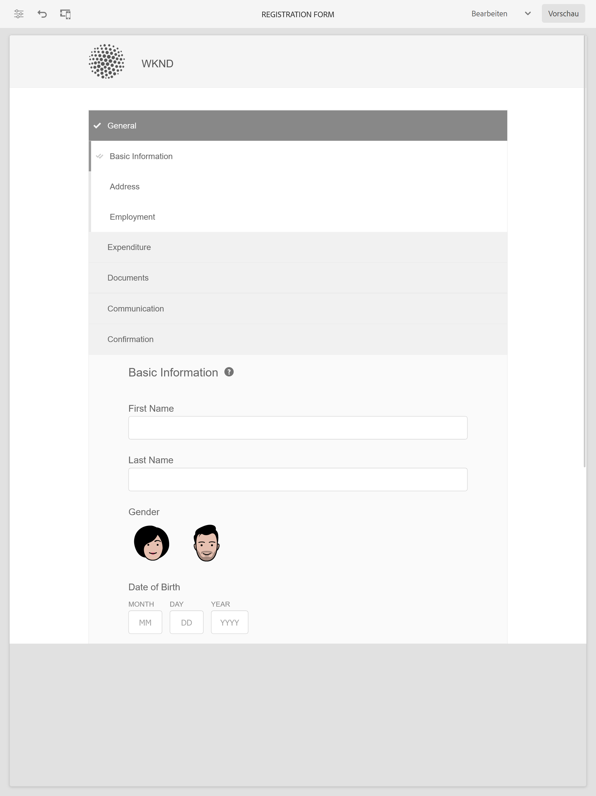
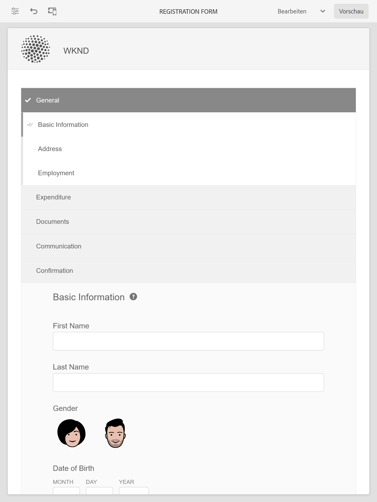

# Muster-Designs, Vorlagen und Formulardatenmodelle in Kernkomponenten {#sample-themes-templates-and-data-models}

AEM Forms as a Cloud Service bietet verschiedene Beispiel-Referenzthemen, Vorlagen und Formulardatenmodelle, damit Sie schnell mit der Erstellung von Adaptive Forms mit Kernkomponenten beginnen können. Sie können [Aktivieren der adaptiven Forms-Kernkomponenten](https://experienceleague.adobe.com/docs/experience-manager-cloud-service/content/forms/setup-configure-migrate/enable-adaptive-forms-core-components.html?lang=de) zur as a Cloud Service und lokalen Entwicklungsumgebung von AEM Forms , um OOTB-Referenzvorlagen zu erhalten und [Designs verwenden und anpassen](https://experienceleague.adobe.com/docs/experience-manager-cloud-service/content/forms/adaptive-forms-authoring/authoring-adaptive-forms-core-components/create-an-adaptive-form-on-forms-cs/using-themes-in-core-components.html) in [!DNL AEM Forms].

Die im Referenzinhaltspaket enthaltenen Musterdesigns, Vorlagen und Formulardatenmodelle sind:

| Vorlagen | Designs | Formulardatenmodelle |
---------|----------|---------
| Einfach | Canvas | Microsoft® Dynamics 365 |
| Leer | WKND | Salesforce |
| Kontakt | Easel |  |
| Einverständnisformular | |  |
| Beschwerde einreichen | | |
| Anfrage zum Protokolldienst |  |  |
| Feedback geben |  |  |
| Vorteile der Registrierung |  |   |
| Zusammenfassung der Leistungen für Arbeitnehmer |   |   |
| Kontoauszug anfordern |   |   |
| Aktualisierung der Kontaktdetails |   |   |
| Sicherheitsüberprüfungsformular |   |   |
| Qualitätskontrolle |   |   |
| Kaufanfrage |  |  |

## Beispieldesigns {#Sample-Themes}

Mithilfe von Referenzdesigns können Sie die Formatierung für Ihre Formulare definieren, ohne dass Sie über Kenntnisse in CSS verfügen müssen. Sie können auch Ihr Design entsprechend Ihren Anforderungen anpassen. Sie können [Aktivieren der adaptiven Forms-Kernkomponenten](https://experienceleague.adobe.com/docs/experience-manager-cloud-service/content/forms/setup-configure-migrate/enable-adaptive-forms-core-components.html?lang=de) in der as a Cloud Service und lokalen Entwicklungsumgebung von AEM Forms, um diese Themen wie folgt zu behandeln:

### Canvas {#Canvas}

Canvas ist das Standard-Design für adaptive Formulare und betont die Verwendung von Grundfarben, Transparenz und flachen Symbolen. Im Screenshot unten sehen Sie, wie das Canvas -Design aussieht.

### WKND {#WKND}

Das WKND-Design verkörpert ein lebendiges, fantasievolles und ansprechendes Design, um eine stilvolle Darstellung in Ihren Formularen zu präsentieren. Das Design basiert auf dem Erscheinungsbild und Stil von [WKND-Site](https://wknd.site/us/en.html) , auf der eine Reise- und Abenteuerwebsite aufbaut [Adobe Experience Manager-Kernkomponenten](https://experienceleague.adobe.com/docs/experience-manager-core-components/using/introduction).

### Easel {#Easel}

Das Easel-Design bezieht sich auf einen speziellen Typ von Vorlagendesign, der einfach einzurichten ist und auf Einfachheit und Benutzerfreundlichkeit angepasst ist. Das Easel-Design basiert auf dem Konzept, wo ein tragbarer Stand von Künstlern verwendet, um eine Leinwand während der Arbeit an ihren Gemälden zu unterstützen.

## Beispielvorlagen {#Sample-templates}

Vorlagen definieren die anfängliche Formularstruktur, den Inhalt und die Aktionen, die in Ihrem Formular repliziert werden sollen, oder verwenden eine ähnliche Vorlagenstruktur wie das Formular, z. B. Einverständnisformular, Registrierungsformular für Vorteile und vieles mehr. Sie erhalten die folgenden Vorlagen von [Aktivieren der adaptiven Forms-Kernkomponenten](https://experienceleague.adobe.com/docs/experience-manager-cloud-service/content/forms/setup-configure-migrate/enable-adaptive-forms-core-components.html?lang=de) in der as a Cloud Service oder lokalen Entwicklungsumgebung von AEM Forms. Die Beispielvorlagen in den Kernkomponenten des adaptiven Forms sind:

### Einfach {#Basic}

Eine einfache Vorlage hilft Ihnen beim schnellen Erstellen eines Registrierungserlebnisformulars. Sie können sie auch verwenden, um die Funktionalität der Kernkomponenten in adaptiven Forms in der Vorschau anzuzeigen. Es bietet ein Assistenten-Layout für eine abschnittsweise Darstellung der Daten.

>[!BEGINTABS]

>[!TAB Desktop]

    

>[!TAB Telefon]

    

>[!TAB Tablet]

    

>[!ENDTABS]

### Leer {#Blank}

Eine leere Arbeitsflächenvorlage wird verwendet, um eine Struktur, einen Inhalt und Regeln für adaptive Formulare von Grund auf neu zu erstellen. Es sind keine Formularkomponenten integriert.

### Kontoauszug anfordern {#Request-for-Account-Statement}

Eine Anfrage nach einem Kontoauszugsformular, um eine Transaktionsabrechnung anzufordern. Diese Erklärung enthält einen detaillierten Überblick über Finanztransaktionen, -aktivitäten oder andere relevante Informationen über eine Person. Durch Ausfüllen dieses Formulars können Sie den Vorgang starten, um eine genaue und aktuelle Aussage für Ihre Datensätze zu erhalten.

### Aktualisierung der Kontaktdetails {#Contact-Details-Update}

Das Aktualisierungsformular für Kontaktdetails für Adresse und Kontaktdaten soll Ihnen dabei helfen, Ihre personenbezogenen Daten zu Ihrem Abonnement oder Ihren Vorteilen zu aktualisieren, um eine nahtlose Kommunikation und einen unterbrechungsfreien Zugriff auf die Services oder Vorteile zu gewährleisten, die Sie erhalten.

### Sicherheitskontrolle {#Safety-Inspection}

Das Formular für die Sicherheitskontrolle dient der Erhaltung eines sicheren Arbeitsumfelds. Durch regelmäßige Inspektionen mit diesem Formular können potenzielle Risiken ermittelt werden. Er umfasst verschiedene Aspekte wie Notausstiege, Brandsicherheit, elektrische Sicherheit, Gefahrstoffe, persönliche Schutzausrüstung, Ergonomie der Workstation usw. für die Sicherheit und das Wohlbefinden von Mitarbeitern, Besuchern und Kunden und schafft ein sicheres Umfeld für alle.

### Kaufanfrage {#Purchase-Request}

Ein Bestellformular, mit dem die Auftragsvergabe initiiert werden kann und dem Arbeitnehmer die Möglichkeit gegeben wird, den Kauf von Waren oder Dienstleistungen zu beantragen, die für ihre Arbeit erforderlich sind. Das Formular erfasst wichtige Details wie Artikelbeschreibung, Menge, bevorzugter Lieferant (falls zutreffend), Budgetzuweisung, Begründung des Kaufs, Lieferinformationen und erforderliche Genehmigungen. Mit dem Formular soll der Einkaufsprozess gestrafft und dokumentiert werden, um eine ordnungsgemäße Autorisierung und Nachverfolgung der angeforderten Käufe zu gewährleisten.

### Zusammenfassung der Arbeitnehmervorteile {#Employee-Benefits-Summary}

Das Formular &quot;Zusammenfassung der Leistungen für Arbeitnehmer&quot;dient dazu, wichtige Informationen über die Leistungen einer Person zu sammeln. Es hilft bei der schnellen und präzisen Bewertung der Abdeckung, indem ein umfassender Überblick über effiziente Hilfe und Unterstützung bereitgestellt wird.

### Leistungseinstufung {#Benefits-Enrollment}

Eine Vorlage für das Formular zur Anmeldung von Leistungen , mit der Mitarbeiter wichtige Informationen zu ihren bevorzugten Vorteilen und Deckungsoptionen sammeln können. Sie begleitet in der Regel den jährlichen Zeitraum der Leistungseinstufung.

### Qualitätskontrolle {#Quality-Control-Inspection}

Ein Überprüfungsformular für die Qualitätskontrolle zur Bewertung und Dokumentierung des Erscheinungsbilds, der Abmessungen, der Funktionalität, der Dokumentation, der Testergebnisse und der Gesamtqualität eines Produkts oder Artikels. Sie hilft bei der Identifizierung von Mängeln, Nichtkonformitäten und Korrekturmaßnahmen, die zur Gewährleistung der Einhaltung von Qualitätsstandards erforderlich sind.

### Einverständnisformular {#Consent-Form}

Ein Einverständnisformular ist ein Rechtsdokument, das die freiwillige und informierte Zustimmung einer Person oder eines Teilnehmers einholen soll, bevor diese an einer bestimmten Tätigkeit, einem Forschungsstudium, einem medizinischen Verfahren oder einer Situation teilnimmt, in der ihre personenbezogenen Daten oder Rechte involviert sein können. Mit einem Einverständnisformular soll Transparenz gewährleistet, die Rechte des Teilnehmers geschützt und ein klares Verständnis dessen geschaffen werden, was der Einzelne zustimmt.

### Kontakt {#Contact-Us}

Das Aktualisierungsformular für Kontaktdetails für Adresse und Kontaktdaten soll Ihnen dabei helfen, Ihre personenbezogenen Daten zu Ihrem Abonnement oder Ihren Vorteilen zu aktualisieren, um eine nahtlose Kommunikation und einen unterbrechungsfreien Zugriff auf die Services oder Vorteile zu gewährleisten, die Sie erhalten.

### Protokolldienstanfrage {#Log-Service-Request}

Ein Protokolldienst-Anfrageformular zum Anfordern bestimmter Protokollierungsdienste von einem Dienstanbieter. Das Formular dient als formelle Anfrage zum Erstellen eines Tickets, bei dem bestimmte Ereignisse, Aktivitäten oder Daten zur Überwachung oder zum Tracking-Status protokolliert werden.

### Feedback geben {#Give-Feedback}

Eine &quot;Feedback-Vorlage&quot;, um einer anderen Person oder einem Team konstruktives Feedback zu geben. Die Vorlage trägt dazu bei sicherzustellen, dass das Feedback klar, spezifisch und umsetzbar ist, und fördert offene Kommunikation und Verbesserungen.

## Referenzformular-Datenmodelle {#reference-models}

Adaptive Forms kann dann mit Microsoft® Dynamics 365- und Salesforce-Servern interagieren, um geschäftliche Workflows zu ermöglichen. Beispiel:

* Schreiben Sie Daten in Microsoft® Dynamics 365 und Salesforce bei der Übermittlung des adaptiven Formulars.
* Schreiben Sie Daten in Microsoft® Dynamics 365 und Salesforce über benutzerdefinierte Entitäten, die im Formulardatenmodell definiert sind, und umgekehrt.
* Abfragen von Microsoft® Dynamics 365- und Salesforce-Server auf Daten und Vorausfüllen von Adaptive Forms.
* Lesen Sie Daten von Microsoft® Dynamics 365- und Salesforce-Servern.

Sie können die folgenden Formulardatenmodelle erhalten, indem Sie das [Referenzinhaltspaket](https://experience.adobe.com/#/downloads/content/software-distribution/en/aemcloud.html?package=/content/software-distribution/en/details.html/content/dam/aemcloud/public/aem-forms-reference-content.ui.content-2.1.0.zip) installieren:

* Microsoft® Dynamics 365
* Salesforce

Informationen zur Verwendung dieser Modelle finden Sie unter [Konfigurieren von Microsoft® Dynamics 365- und Salesforce-Cloud-Services](https://experienceleague.adobe.com/docs/experience-manager-cloud-service/content/forms/integrate/use-form-data-model/configure-msdynamics-salesforce.html?lang=de#configure-dynamics-cloud-service)
